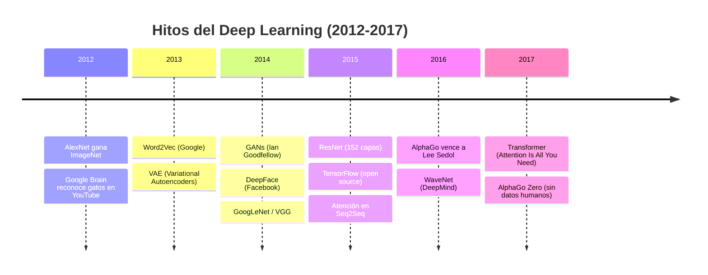
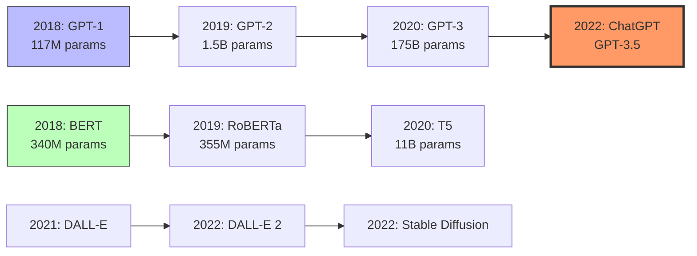
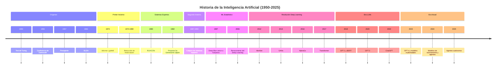

# Historia de la Inteligencia Artificial

> [!abstract]
> Recorrido completo por la evolución de la inteligencia artificial desde los ==primeros trabajos teóricos de Alan Turing en 1950== hasta la ==era de los agentes autónomos en 2025==. Se analizan los periodos de auge y caída (*AI winters*), los hitos técnicos que marcaron cada época y las implicaciones de cada avance para el estado actual del campo. La historia de la IA no es lineal: es una sucesión de ==promesas, decepciones y redescubrimientos== que convergen en el momento más transformador de la disciplina.

---

## Los orígenes: fundamentos teóricos (1943-1955)

La historia de la IA comienza antes de que el término existiera. En 1943, Warren McCulloch y Walter Pitts publicaron *"A Logical Calculus of the Ideas Immanent in Nervous Activity"*[^1], proponiendo el primer modelo matemático de una neurona artificial. Este trabajo sentó las bases de lo que décadas después se convertiría en el campo de las [[redes-neuronales]].

> [!info] El Test de Turing
> En 1950, ==Alan Turing== publicó *"Computing Machinery and Intelligence"*[^2], donde propuso la célebre pregunta: *"Can machines think?"*. El *Turing Test* (o *Imitation Game*) estableció el primer marco conceptual para evaluar la inteligencia de una máquina: si un evaluador humano no puede distinguir las respuestas de una máquina de las de un humano, la máquina puede considerarse "inteligente". ^test-turing

En 1951, Marvin Minsky y Dean Edmonds construyeron SNARC (*Stochastic Neural Analog Reinforcement Calculator*), la primera computadora basada en redes neuronales, con 40 neuronas simuladas usando tubos de vacío. Ese mismo periodo, Claude Shannon desarrolló los fundamentos de la teoría de la información que serían esenciales para el procesamiento del lenguaje natural.

---

## El nacimiento oficial: Dartmouth y la edad dorada (1956-1974)

### La Conferencia de Dartmouth (1956)

> [!tip] Momento fundacional
> En el verano de 1956, John McCarthy, Marvin Minsky, Nathaniel Rochester y Claude Shannon organizaron el ==Dartmouth Summer Research Project on Artificial Intelligence==. Esta conferencia de dos meses acuñó oficialmente el término *"Artificial Intelligence"* y estableció la IA como disciplina académica independiente. ^conferencia-dartmouth

La propuesta original de McCarthy fue ambiciosamente optimista: *"Every aspect of learning or any other feature of intelligence can in principle be so precisely described that a machine can be made to simulate it."*

### La edad dorada (1956-1974)

Los años posteriores a Dartmouth estuvieron marcados por un optimismo desbordante y avances significativos:

| Año | Hito | Creador(es) | Significado |
|-----|------|-------------|-------------|
| 1957 | *Perceptron* | Frank Rosenblatt | Primera red neuronal capaz de aprender |
| 1958 | LISP | John McCarthy | Lenguaje de programación para IA |
| 1961 | Unimate | George Devol | Primer robot industrial |
| 1964 | ELIZA | Joseph Weizenbaum | Primer *chatbot* |
| 1966 | Shakey | SRI International | Primer robot móvil con "razonamiento" |
| 1969 | *Perceptrons* (libro) | Minsky & Papert | Demostración de limitaciones del perceptrón |
| 1972 | PROLOG | Alain Colmerauer | Lenguaje de programación lógica |

> [!example]- ELIZA: el primer chatbot
> ELIZA, creada por Joseph Weizenbaum en el MIT, simulaba un terapeuta rogeriano usando técnicas simples de *pattern matching*. A pesar de su simplicidad, muchos usuarios atribuían comprensión real al programa, un fenómeno que Weizenbaum denominó el *"ELIZA effect"*. Este efecto sigue siendo relevante hoy en la discusión sobre [[tipos-ia]] y la percepción de inteligencia en sistemas como ChatGPT.

Herbert Simon predijo en 1965 que *"machines will be capable, within twenty years, of doing any work a man can do"*. Marvin Minsky afirmó en 1970 que *"in from three to eight years we will have a machine with the general intelligence of an average human being"*. ==Estas predicciones fallidas marcarían el patrón recurrente de la IA: promesas excesivas seguidas de decepciones.==

---

## El primer invierno de la IA (1974-1980)

> [!danger] AI Winter
> El término *AI winter* describe periodos donde la financiación, el interés público y el progreso investigativo en IA se desploman dramáticamente. El primer invierno fue desencadenado por el ==Informe Lighthill (1973)==[^3], encargado por el gobierno británico, que concluyó que la IA había fallado en cumplir sus promesas grandiosas. ^primer-invierno

Factores que provocaron el primer invierno:

1. **Limitaciones computacionales**: los problemas de IA requerían potencia de cálculo que no existía
2. **El libro *Perceptrons*** de Minsky y Papert demostró que los perceptrones de una capa no podían resolver problemas no lineales como XOR, desacreditando las [[redes-neuronales]]
3. **La explosión combinatoria**: los sistemas simbólicos no escalaban a problemas del mundo real
4. **Fracaso en traducción automática**: el proyecto ALPAC demostró que la traducción automática estaba lejos de ser viable

> [!warning]
> El primer invierno de la IA destruyó carreras académicas enteras. Muchos investigadores abandonaron el campo o renombraron su trabajo para evitar la etiqueta "IA". Este patrón se repetiría y es una lección importante sobre los ciclos de *hype* en tecnología.

---

## Sistemas expertos y el renacimiento (1980-1987)

La IA resurgió en los años 80 con los *expert systems* (sistemas expertos), programas que codificaban el conocimiento de especialistas humanos en reglas lógicas.

> [!success] El auge de los sistemas expertos
> ==R1/XCON de Digital Equipment Corporation== fue el sistema experto más exitoso comercialmente, ahorrando a la empresa aproximadamente ==40 millones de dólares anuales== configurando pedidos de computadoras. Para 1985, las empresas gastaban más de ==mil millones de dólares al año en IA==. ^sistemas-expertos

| Sistema | Dominio | Año | Impacto |
|---------|---------|-----|---------|
| MYCIN | Diagnóstico médico | 1976 | Diagnóstico de infecciones bacterianas |
| R1/XCON | Configuración hardware | 1980 | $40M/año en ahorros |
| DENDRAL | Química | 1965-1981 | Identificación de estructuras moleculares |
| Cyc | Conocimiento general | 1984-presente | Base de conocimiento de sentido común |

Japón lanzó el ambicioso *Fifth Generation Computer Project* en 1982, invirtiendo ==850 millones de dólares== en crear computadoras basadas en programación lógica. El proyecto fue ampliamente considerado un fracaso al finalizar en 1992.

---

## El segundo invierno de la IA (1987-1993)

> [!danger] Segundo colapso
> El segundo invierno llegó por varias convergencias: el colapso del mercado de hardware LISP, las limitaciones inherentes de los sistemas expertos (fragilidad, dificultad de mantenimiento, incapacidad de aprender), y el fracaso del proyecto japonés de quinta generación. ^segundo-invierno

Los sistemas expertos revelaron un problema fundamental: el ==knowledge acquisition bottleneck== (cuello de botella en la adquisición de conocimiento). Codificar manualmente el conocimiento de un experto era extremadamente costoso y el resultado era frágil ante situaciones no previstas.

---

## El ascenso del aprendizaje automático (1993-2011)

Durante y después del segundo invierno, un cambio paradigmático silencioso estaba ocurriendo: la IA dejaba de intentar codificar inteligencia manualmente y comenzaba a ==aprender de los datos==.

### Hitos fundamentales

> [!example]- Backpropagation y redes neuronales
> Aunque fue descubierto anteriormente, el algoritmo de *backpropagation* fue popularizado por Rumelhart, Hinton y Williams en 1986[^4]. Sin embargo, las limitaciones de hardware y la dominancia de los métodos estadísticos mantuvieron las redes neuronales en un segundo plano hasta la década de 2010. Ver [[machine-learning-overview]] para detalles sobre el entrenamiento.

| Año | Hito | Significado |
|-----|------|-------------|
| 1997 | ==Deep Blue vence a Kasparov== | Primera derrota de un campeón mundial de ajedrez por una máquina |
| 1997 | LSTM | Hochreiter & Schmidhuber resuelven el problema del gradiente desvaneciente |
| 2001 | Random Forests | Breiman introduce uno de los algoritmos más prácticos de ML |
| 2006 | *Deep Learning* renace | Geoffrey Hinton demuestra entrenamiento efectivo de redes profundas |
| 2009 | ImageNet | Fei-Fei Li crea el dataset que revolucionará la visión por computadora |
| 2011 | Watson gana Jeopardy! | IBM demuestra comprensión de lenguaje natural en TV nacional |
| 2011 | Siri | Apple lanza el primer asistente virtual masivo |

> [!quote] Geoffrey Hinton, 2006
> *"We discover a fast, greedy algorithm that can learn deep, directed belief networks one layer at a time."*[^5]
> Este paper de Hinton marcó el renacimiento del *deep learning* y cambió el rumbo de toda la disciplina.

---

## La revolución del Deep Learning (2012-2017)

### AlexNet: el punto de inflexión (2012)

> [!success] El momento que cambió todo
> En 2012, ==AlexNet ganó el ImageNet Large Scale Visual Recognition Challenge== con un error del 15.3%, destruyendo al segundo lugar (26.2%) por un margen sin precedentes[^6]. Alex Krizhevsky, Ilya Sutskever y Geoffrey Hinton demostraron que las redes neuronales convolucionales profundas ([[redes-neuronales|CNNs]]), entrenadas con GPUs, podían superar cualquier método clásico de visión por computadora. ^alexnet-momento

Este resultado desencadenó una avalancha de inversión e investigación en *deep learning*:

### Hitos detallados

**2014 - GANs (*Generative Adversarial Networks*)**: Ian Goodfellow introdujo las redes generativas adversarias[^7], un marco donde dos redes neuronales compiten entre sí. Este trabajo abrió el camino a la generación de imágenes, video y audio sintéticos. Ver [[redes-neuronales]] para la arquitectura.

**2016 - AlphaGo**: ==DeepMind derrotó a Lee Sedol== (campeón mundial de Go) 4-1. El Go tiene aproximadamente 10^170 posiciones posibles (más que átomos en el universo observable), lo que hacía impracticable la fuerza bruta de Deep Blue. AlphaGo combinó *deep reinforcement learning* con *Monte Carlo tree search*. ^alphago

> [!tip] De AlphaGo a AlphaGo Zero
> En 2017, AlphaGo Zero demostró que podía aprender Go ==completamente desde cero==, sin ningún dato de partidas humanas, y superar a la versión original en solo 40 días de auto-juego. Este resultado demostró el poder del [[machine-learning-overview|aprendizaje por refuerzo]] puro.

**2017 - El Transformer**: Vaswani et al. publicaron ==*"Attention Is All You Need"*==[^8], introduciendo la [[transformer-architecture|arquitectura Transformer]]. Este paper es posiblemente el más influyente en la historia moderna de la IA.

---

## La era de los modelos de lenguaje (2018-2022)

### La explosión de los LLMs

| Modelo | Año | Parámetros | Innovación clave |
|--------|-----|------------|------------------|
| GPT-1 | 2018 | 117M | *Pre-training* + *fine-tuning* |
| BERT | 2018 | 340M | Bidireccionalidad, MLM |
| GPT-2 | 2019 | 1.5B | *Zero-shot* en múltiples tareas |
| T5 | 2020 | 11B | *Text-to-text* unificado |
| GPT-3 | 2020 | ==175B== | *In-context learning*, *few-shot* |
| PaLM | 2022 | 540B | *Chain-of-thought reasoning* |
| ChatGPT | 2022 | ~175B | ==RLHF==, interfaz conversacional |

> [!example]- La escala como motor de capacidades emergentes
> Uno de los descubrimientos más sorprendentes fue que ==las capacidades emergen de forma impredecible a cierta escala==. GPT-3, con 175 mil millones de parámetros, demostró habilidades que no existían en modelos más pequeños:
> - Aritmética de varios dígitos
> - Traducción sin entrenamiento específico
> - Generación de código
> - Razonamiento analógico
>
> Este fenómeno de *emergent abilities* fue documentado por Wei et al. (2022)[^9] y sigue siendo objeto de intenso debate. Algunos investigadores como Schaeffer et al. argumentan que las habilidades "emergentes" son un artefacto de las métricas elegidas.

### ChatGPT: el momento iPhone de la IA (noviembre 2022)

> [!success] Adopción sin precedentes
> ==ChatGPT alcanzó 100 millones de usuarios en solo 2 meses==, convirtiéndose en la aplicación de consumo de más rápido crecimiento en la historia. Para comparación, TikTok tardó 9 meses e Instagram 2.5 años en alcanzar esa cifra. ^chatgpt-adopcion

La clave de ChatGPT no fue solo el modelo base (GPT-3.5), sino el proceso de ==*Reinforcement Learning from Human Feedback* (RLHF)==, que alineó las respuestas del modelo con las expectativas humanas de utilidad y seguridad.

---

## La era de los fundamentos abiertos y multimodales (2023-2024)

### 2023: el año de la explosión

> [!info] Panorama competitivo 2023-2024
> La competencia entre laboratorios de IA se intensificó dramáticamente:
> - **OpenAI**: GPT-4 (marzo 2023), GPT-4V (multimodal), GPT-4o
> - **Google/DeepMind**: Gemini Ultra, Gemini 1.5 Pro (1M tokens de contexto)
> - **Anthropic**: Claude 2, Claude 3 (Opus, Sonnet, Haiku)
> - **Meta**: Llama 2, Llama 3 (open weights)
> - **Mistral**: Mistral 7B, Mixtral 8x7B (MoE)
> - **Generación de imagen/video**: Midjourney v5/v6, DALL-E 3, Sora

==GPT-4== demostró capacidades multimodales y rendimiento a nivel humano en exámenes profesionales: aprobó el examen de abogacía de EE.UU. en el percentil 90, SAT de matemáticas en el percentil 99, y múltiples exámenes AP con puntuaciones de 4 y 5.

> [!warning] El debate sobre AGI se intensifica
> Con cada nuevo modelo, la línea entre [[tipos-ia|ANI y AGI]] se difumina. Algunos investigadores como Ilya Sutskever sugieren que los LLMs grandes podrían tener formas rudimentarias de comprensión. Otros, como Yann LeCun, argumentan que los LLMs son fundamentalmente limitados y que se necesitan nuevas arquitecturas. Ver [[tipos-ia]] para un análisis detallado.

### 2024: Agentes, razonamiento y escala

| Tendencia | Ejemplos | Impacto |
|-----------|----------|---------|
| Modelos de razonamiento | o1, o3 (OpenAI), Claude con *extended thinking* | Mejor rendimiento en matemáticas y código |
| Agentes autónomos | Devin, Claude Computer Use, GPT con tools | Automatización de tareas complejas |
| Modelos abiertos competitivos | Llama 3.1 405B, Qwen 2.5, DeepSeek V3 | Democratización del acceso |
| Multimodalidad nativa | GPT-4o, Gemini 2.0 | Procesamiento unificado de texto, imagen, audio, video |
| Ventanas de contexto masivas | Gemini 1.5 (1M-2M tokens) | Procesamiento de libros y codebases completos |
| Generación de video | Sora, Kling, Runway Gen-3 | Producción audiovisual con IA |

---

## La era de los agentes (2025)

> [!tip] El paradigma actual
> En 2025, la IA ha evolucionado de ==modelos conversacionales a agentes autónomos== capaces de usar herramientas, navegar interfaces, escribir y ejecutar código, y completar tareas complejas de múltiples pasos. Este es el paradigma que impulsa productos como [[intake-overview]], [[architect-overview]], [[vigil-overview]] y [[licit-overview]]. ^era-agentes

Los agentes de IA representan la convergencia de múltiples líneas de investigación:
- [[transformer-architecture|Transformers]] como motor de razonamiento
- *Tool use* y *function calling* para interacción con el mundo
- *Chain-of-thought* y *tree-of-thought* para planificación
- [[machine-learning-overview|Aprendizaje por refuerzo]] para optimización de comportamiento

---

## Diagrama cronológico completo

---

## Lecciones de la historia

> [!question] Preguntas abiertas
> 1. ¿Estamos en otra burbuja de IA o esta vez es diferente?
> 2. ¿Los LLMs actuales son un camino hacia [[tipos-ia|AGI]] o un callejón sin salida sofisticado?
> 3. ¿Cómo evitar un tercer invierno de la IA?
> 4. ¿El progreso seguirá dependiendo de la escala (*scaling laws*) o necesitamos paradigmas nuevos?

> [!warning] Patrón recurrente
> Cada era de la IA ha seguido un ciclo similar: ==descubrimiento técnico → promesas excesivas → inversión masiva → expectativas no cumplidas → invierno==. La diferencia actual es que los modelos de IA están generando valor económico real y medible a escala global, lo que podría romper este ciclo. ^ciclo-hype

### Factores que diferencian la era actual

1. **Valor económico demostrable**: a diferencia de eras anteriores, la IA genera miles de millones en ingresos reales
2. **Infraestructura madura**: cloud computing, GPUs masivas, datasets a escala de internet
3. **Adopción masiva**: millones de personas usan IA diariamente
4. **Open source robusto**: ecosistema de modelos abiertos que democratiza el acceso
5. **Inversión sin precedentes**: ==más de 100 mil millones de dólares en infraestructura de IA solo en 2024==

---

## Relación con el ecosistema

La historia de la IA proporciona contexto esencial para entender los productos del ecosistema actual:

- **[[intake-overview]]**: heredero directo de la visión de procesamiento automático de documentos que comenzó con los sistemas expertos de los 80, ahora potenciado por [[transformer-architecture|Transformers]]
- **[[architect-overview]]**: representa la convergencia de décadas de investigación en planificación automatizada y generación de código
- **[[vigil-overview]]**: la monitorización de sistemas de IA es un campo nuevo nacido de la necesidad de controlar modelos cada vez más autónomos
- **[[licit-overview]]**: responde a las preocupaciones regulatorias que han acompañado a la IA desde sus orígenes pero que ahora son urgentes

---

## Enlaces y referencias

### Notas relacionadas
- [[tipos-ia]] - Taxonomía completa de tipos de inteligencia artificial
- [[machine-learning-overview]] - Fundamentos del aprendizaje automático
- [[redes-neuronales]] - Evolución de las arquitecturas neuronales
- [[transformer-architecture]] - La arquitectura que domina la IA actual
- [[etica-ia]] - Consideraciones éticas en el desarrollo de IA
- [[tendencias-futuro]] - Hacia dónde se dirige el campo

> [!quote]- Bibliografía y referencias
> - [^1]: McCulloch, W.S. & Pitts, W. (1943). *A Logical Calculus of the Ideas Immanent in Nervous Activity*. Bulletin of Mathematical Biophysics, 5, 115-133.
> - [^2]: Turing, A.M. (1950). *Computing Machinery and Intelligence*. Mind, 59(236), 433-460.
> - [^3]: Lighthill, J. (1973). *Artificial Intelligence: A General Survey*. UK Science Research Council.
> - [^4]: Rumelhart, D.E., Hinton, G.E. & Williams, R.J. (1986). *Learning representations by back-propagating errors*. Nature, 323, 533-536.
> - [^5]: Hinton, G.E., Osindero, S. & Teh, Y.W. (2006). *A Fast Learning Algorithm for Deep Belief Nets*. Neural Computation, 18(7), 1527-1554.
> - [^6]: Krizhevsky, A., Sutskever, I. & Hinton, G.E. (2012). *ImageNet Classification with Deep Convolutional Neural Networks*. NeurIPS.
> - [^7]: Goodfellow, I. et al. (2014). *Generative Adversarial Networks*. NeurIPS.
> - [^8]: Vaswani, A. et al. (2017). *Attention Is All You Need*. NeurIPS.
> - [^9]: Wei, J. et al. (2022). *Emergent Abilities of Large Language Models*. TMLR.

[^1]: McCulloch & Pitts (1943). A Logical Calculus of the Ideas Immanent in Nervous Activity.
[^2]: Turing (1950). Computing Machinery and Intelligence.
[^3]: Lighthill (1973). Artificial Intelligence: A General Survey.
[^4]: Rumelhart, Hinton & Williams (1986). Learning representations by back-propagating errors.
[^5]: Hinton, Osindero & Teh (2006). A Fast Learning Algorithm for Deep Belief Nets.
[^6]: Krizhevsky, Sutskever & Hinton (2012). ImageNet Classification with Deep CNNs.
[^7]: Goodfellow et al. (2014). Generative Adversarial Networks.
[^8]: Vaswani et al. (2017). Attention Is All You Need.
[^9]: Wei et al. (2022). Emergent Abilities of Large Language Models.
