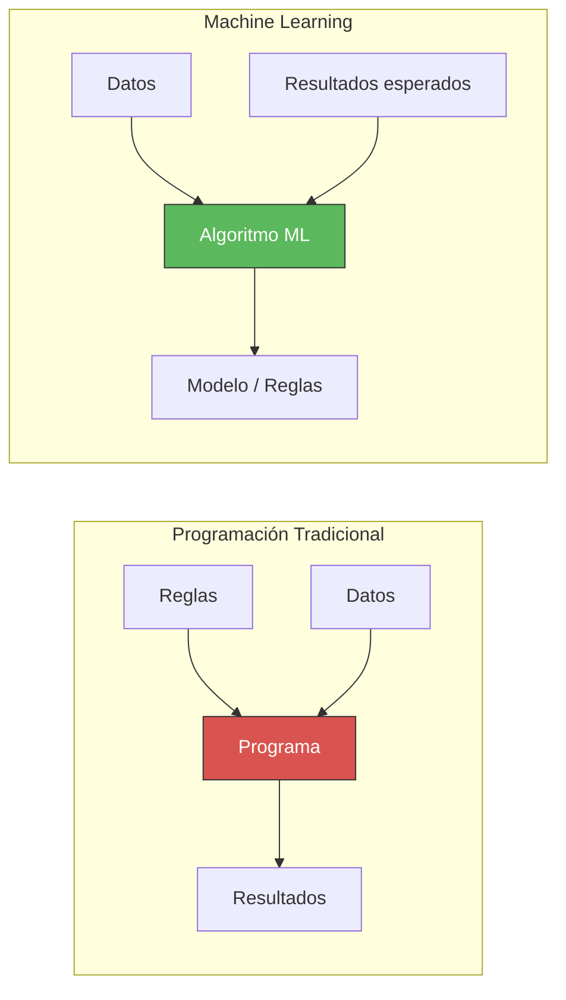
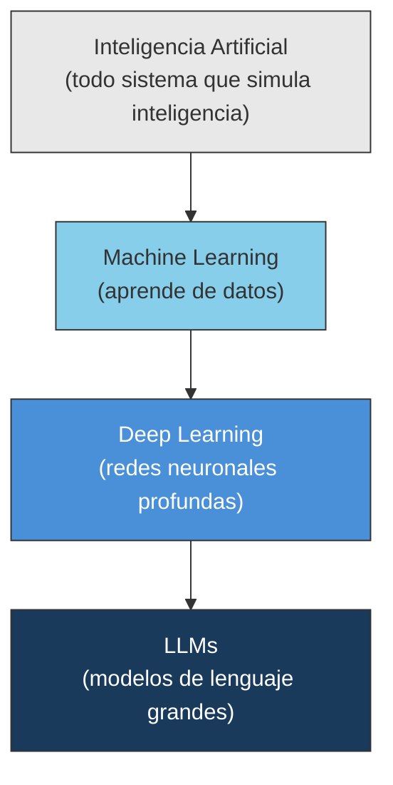
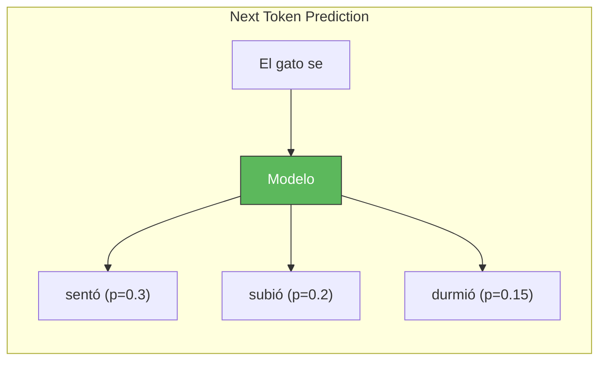
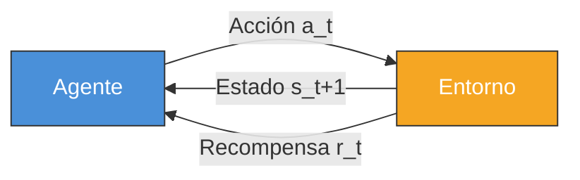
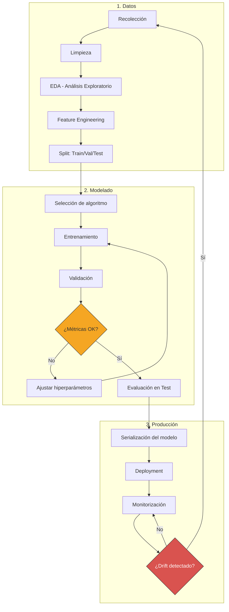
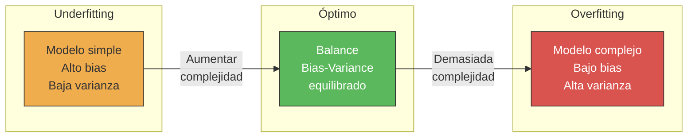
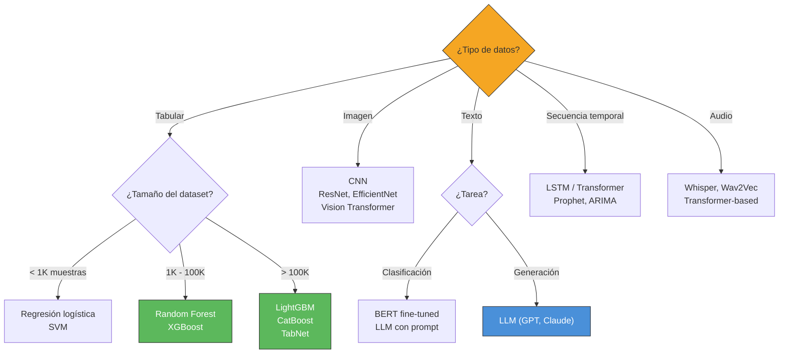

# Machine Learning - Visión General

> [!abstract]
> *Machine Learning* (ML) es el subcampo de la IA donde los sistemas ==aprenden patrones a partir de datos sin ser programados explícitamente==. Esta nota cubre los cinco paradigmas principales (supervisado, no supervisado, semi-supervisado, auto-supervisado y por refuerzo), los algoritmos clave con guías de cuándo usar cada uno, el pipeline completo de entrenamiento, conceptos fundamentales como el ==*bias-variance tradeoff*== y la ==regularización==, y la conexión directa con los LLMs modernos a través del *self-supervised pre-training*.

---

## ¿Qué es Machine Learning?

> [!quote] Arthur Samuel, 1959
> *"Machine Learning is the field of study that gives computers the ability to learn without being explicitly programmed."*

*Machine Learning* (aprendizaje automático) es el enfoque que permite a las máquinas mejorar su rendimiento en una tarea a medida que se exponen a más datos. A diferencia de la programación tradicional donde un humano codifica reglas, en ML ==los algoritmos descubren las reglas por sí mismos a partir de ejemplos==. ^ml-definicion



### Jerarquía: IA > ML > Deep Learning > LLMs



==Todo LLM es deep learning, todo deep learning es ML, y todo ML es IA.== Pero no al revés: hay IA que no es ML (sistemas basados en reglas), hay ML que no es DL (Random Forests), y hay DL que no son LLMs (CNNs para imágenes). Ver [[tipos-ia]] para la taxonomía completa. ^jerarquia-ml

---

## Los cinco paradigmas de aprendizaje

### 1. Aprendizaje supervisado (*Supervised Learning*)

El paradigma más intuitivo y más usado en producción. El modelo aprende de pares $(x_i, y_i)$ donde $x$ es la entrada e $y$ es la etiqueta correcta proporcionada por un humano.

> [!tip] Cuándo usar supervisado
> - Tienes datos etiquetados de calidad
> - El problema es de clasificación o regresión
> - Necesitas resultados predecibles y auditables
> - La relación entrada-salida es estable en el tiempo

**Dos tipos principales:**

| Tipo | Objetivo | Salida | Métricas | Ejemplo |
|------|----------|--------|----------|---------|
| **Clasificación** | Asignar una categoría | Discreta | Accuracy, F1, AUC-ROC | Spam vs no spam |
| **Regresión** | Predecir un valor | Continua | MSE, MAE, R² | Precio de vivienda |

**Algoritmos clave de aprendizaje supervisado:**

| Algoritmo | Tipo | Fortalezas | Debilidades | Cuándo usar |
|-----------|------|-----------|-------------|-------------|
| Regresión lineal/logística | Ambos | Simple, interpretable | No captura no linealidad | Baseline, datos lineales |
| Árboles de decisión | Ambos | Interpretable, maneja datos mixtos | Overfitting fácil | Explicabilidad requerida |
| Random Forest | Ambos | Robusto, poco overfitting | Caja negra, lento en predicción | ==Primer intento para datos tabulares== |
| Gradient Boosting (XGBoost, LightGBM) | Ambos | ==Mejor rendimiento en datos tabulares== | Requiere tuning cuidadoso | Competiciones, producción |
| SVM | Ambos | Efectivo en alta dimensionalidad | No escala bien a grandes datasets | Datasets pequeños/medianos |
| k-NN | Ambos | No requiere entrenamiento | Lento en predicción, maldición de dimensionalidad | Prototipos rápidos |
| [[redes-neuronales\|Redes neuronales]] | Ambos | Captura patrones complejos | Requiere muchos datos, caja negra | Imágenes, texto, audio |

> [!example]- Ejemplo: clasificación de sentimiento
> ```python
> from sklearn.ensemble import GradientBoostingClassifier
> from sklearn.model_selection import train_test_split
> from sklearn.metrics import classification_report
>
> # Datos: reseñas de productos con etiquetas positivo/negativo
> X_train, X_test, y_train, y_test = train_test_split(
>     features, labels, test_size=0.2, random_state=42
> )
>
> model = GradientBoostingClassifier(
>     n_estimators=200,
>     learning_rate=0.1,
>     max_depth=5
> )
> model.fit(X_train, y_train)
> predictions = model.predict(X_test)
> print(classification_report(y_test, predictions))
> ```

### 2. Aprendizaje no supervisado (*Unsupervised Learning*)

El modelo trabaja con datos sin etiquetar, buscando estructura inherente en los datos.

> [!info] Aplicaciones principales
> - **Clustering**: agrupar datos similares (segmentación de clientes, detección de anomalías)
> - **Reducción de dimensionalidad**: comprimir datos preservando estructura (PCA, t-SNE, UMAP)
> - **Asociación**: descubrir reglas de co-ocurrencia (market basket analysis)
> - **Generación**: aprender la distribución de datos para generar nuevos (VAE, GAN)

| Algoritmo | Tarea | Fortalezas | Cuándo usar |
|-----------|-------|-----------|-------------|
| K-Means | Clustering | Simple, escalable | Clusters esféricos, K conocido |
| DBSCAN | Clustering | Detecta formas arbitrarias, ruido | Clusters irregulares, outliers |
| Hierarchical | Clustering | Dendrograma interpretable | Taxonomías, K desconocido |
| PCA | Reducción dim. | Lineal, rápido | Preprocesamiento, visualización |
| t-SNE / UMAP | Reducción dim. | Preserva estructura local | Visualización 2D/3D |
| Autoencoders | Reducción / Generación | No lineal, aprende representaciones | Detección de anomalías, preentrenamiento |
| GMM | Clustering | Probabilístico, clusters suaves | Asignación probabilística |

### 3. Aprendizaje semi-supervisado (*Semi-Supervised Learning*)

Combina una ==pequeña cantidad de datos etiquetados con una gran cantidad de datos sin etiquetar==. Especialmente útil cuando etiquetar datos es costoso.

> [!tip] Estrategias comunes
> - **Self-training**: entrenar con datos etiquetados, usar el modelo para etiquetar datos no etiquetados de alta confianza, re-entrenar
> - **Co-training**: dos modelos con diferentes vistas de los datos se enseñan mutuamente
> - **Graph-based**: propagar etiquetas por un grafo de similitud entre datos
> - **Consistency regularization**: el modelo debe dar la misma predicción ante perturbaciones del input

En la práctica, esta es la situación más común en empresas reales: se tienen millones de datos pero solo una fracción está etiquetada. Productos como [[intake-overview]] se benefician enormemente de este enfoque.

### 4. Aprendizaje auto-supervisado (*Self-Supervised Learning*)

> [!success] El paradigma que revolucionó la IA
> ==El aprendizaje auto-supervisado es la base de todos los LLMs modernos== (GPT, Claude, Llama, Gemini). El modelo crea sus propias etiquetas a partir de la estructura de los datos. Es técnicamente no supervisado (no requiere etiquetas humanas), pero usa una señal de supervisión derivada de los datos mismos. Ver [[tipos-ia#^self-supervised]]. ^self-supervised-overview

**Tareas de pre-texto (*pretext tasks*) principales:**

| Tarea | Descripción | Usado en |
|-------|-------------|----------|
| *Next Token Prediction* | Predecir la siguiente palabra | ==GPT, Claude, Llama== |
| *Masked Language Modeling* | Predecir palabras ocultas | BERT, RoBERTa |
| *Contrastive Learning* | Aprender que ejemplos son similares/diferentes | CLIP, SimCLR |
| *Denoising* | Reconstruir datos corrompidos | T5, modelos de difusión |
| *Image Patch Prediction* | Predecir partes ocultas de imagen | MAE, BEiT |



> [!warning] La escala lo cambia todo
> El aprendizaje auto-supervisado solo produce resultados espectaculares ==a gran escala==. Un modelo pequeño entrenado con *next token prediction* solo aprende gramática básica. Un modelo con cientos de miles de millones de parámetros, entrenado sobre trillones de tokens, desarrolla capacidades de razonamiento, traducción, generación de código y más. Esto se conoce como *scaling laws* y conecta directamente con la [[transformer-architecture]].

### 5. Aprendizaje por refuerzo (*Reinforcement Learning*)

Un agente aprende a tomar decisiones secuenciales interactuando con un entorno para maximizar una recompensa acumulada.

> [!info] Componentes del RL
> - **Agente**: el que toma decisiones
> - **Entorno**: el mundo con el que interactúa
> - **Estado** ($s$): la situación actual
> - **Acción** ($a$): lo que el agente puede hacer
> - **Recompensa** ($r$): señal de feedback
> - **Política** ($\pi$): estrategia del agente ($s \rightarrow a$)



| Algoritmo | Tipo | Aplicación |
|-----------|------|------------|
| Q-Learning | Value-based | Juegos simples |
| DQN | Value-based + DL | Atari, juegos |
| Policy Gradient (REINFORCE) | Policy-based | Robótica |
| PPO (*Proximal Policy Optimization*) | Policy-based | ==RLHF en LLMs==, robótica |
| A3C / A2C | Actor-Critic | Juegos complejos |
| SAC | Actor-Critic | Robótica continua |

> [!tip] RLHF: el puente entre RL y LLMs
> ==*Reinforcement Learning from Human Feedback* (RLHF)== es la técnica que convierte un LLM pre-entrenado en un asistente útil y seguro. El proceso: 1) pre-entrenar con *self-supervised learning*, 2) hacer *fine-tuning* con instrucciones, 3) entrenar un modelo de recompensa con preferencias humanas, 4) optimizar el LLM con PPO usando ese modelo de recompensa. Este proceso es fundamental para sistemas como [[vigil-overview]] que necesitan comportamiento alineado. ^rlhf-proceso

---

## Pipeline de entrenamiento de ML



### Fase 1: Preparación de datos

> [!danger] "Garbage in, garbage out"
> ==El 80% del tiempo en un proyecto de ML se dedica a datos.== La calidad de los datos determina el techo del rendimiento del modelo. Ningún algoritmo puede compensar datos malos.

**Feature Engineering** (ingeniería de características): el proceso de crear, seleccionar y transformar variables de entrada para mejorar el rendimiento del modelo.

| Técnica | Descripción | Ejemplo |
|---------|-------------|---------|
| *One-hot encoding* | Convertir categorías en vectores binarios | Color: rojo → [1,0,0] |
| *Normalization* | Escalar a rango [0,1] | Min-Max scaling |
| *Standardization* | Media 0, desviación 1 | Z-score |
| *Polynomial features* | Crear términos de interacción | $x_1 \times x_2$, $x_1^2$ |
| *Embeddings* | Representar entidades en espacio denso | Word2Vec, entity embeddings |
| *Log transform* | Manejar distribuciones sesgadas | log(precio) |

### Fase 2: Entrenamiento y validación

> [!warning] No evaluar con datos de entrenamiento
> ==Nunca evalúes tu modelo con los mismos datos que usaste para entrenarlo.== Esto da una estimación falsamente optimista. Siempre usa validación cruzada (*cross-validation*) o un conjunto de validación separado.

**Estrategias de validación:**
- *Hold-out*: split simple (70/15/15 o 80/10/10)
- *K-fold cross-validation*: K particiones rotativas, más robusto
- *Stratified K-fold*: preserva la distribución de clases
- *Time series split*: para datos temporales, siempre entrenar con pasado y validar con futuro

### Fase 3: Producción y monitorización

El despliegue de modelos de ML en producción introduce desafíos únicos. Ver [[vigil-overview]] para monitorización y [[devops-cicd-ia]] para CI/CD.

---

## Bias-Variance Tradeoff

> [!info] El concepto más importante en ML
> El ==*bias-variance tradeoff*== es el equilibrio fundamental entre dos fuentes de error en un modelo predictivo. ^bias-variance

**Bias (sesgo)**: error por simplificar demasiado el modelo. Un modelo con alto bias *underfits* (no captura la complejidad de los datos).

**Variance (varianza)**: error por hacer el modelo demasiado sensible a los datos de entrenamiento. Un modelo con alta varianza *overfits* (memoriza ruido en lugar de aprender patrones).

| | Alto Bias | Bajo Bias |
|---|----------|-----------|
| **Alta Varianza** | Modelo roto | ==*Overfitting*== |
| **Baja Varianza** | ==*Underfitting*== | Modelo óptimo |



### Overfitting: el enemigo principal

*Overfitting* (sobreajuste) ocurre cuando el modelo ==memoriza los datos de entrenamiento en lugar de aprender patrones generalizables==. Señales de overfitting:
- Error de entrenamiento mucho menor que error de validación
- El modelo funciona perfectamente en entrenamiento pero mal en datos nuevos
- El rendimiento empeora al añadir más datos de entrenamiento (raro pero posible)

### Regularización: la solución

*Regularización* es cualquier técnica que ==penaliza la complejidad del modelo== para prevenir overfitting.

| Técnica | Cómo funciona | Dónde se usa |
|---------|---------------|--------------|
| L1 (Lasso) | Penaliza suma de valores absolutos de pesos | Regresión, selección de features |
| L2 (Ridge) | Penaliza suma de cuadrados de pesos | ==Casi todos los modelos== |
| *Dropout* | Desactiva neuronas aleatoriamente en entrenamiento | [[redes-neuronales]] |
| *Early stopping* | Detener entrenamiento cuando val_loss sube | Redes neuronales, boosting |
| *Data augmentation* | Crear variaciones de datos existentes | Visión, NLP |
| *Weight decay* | Reducir pesos gradualmente | [[transformer-architecture\|Transformers]], DL |
| *Batch normalization* | Normalizar activaciones entre capas | Deep learning |
| Ensemble | Combinar múltiples modelos | Random Forest, bagging |

> [!example]- Regularización en la práctica
> ```python
> import torch.nn as nn
>
> class RegularizedModel(nn.Module):
>     def __init__(self, input_dim, hidden_dim, output_dim, dropout_rate=0.3):
>         super().__init__()
>         self.layers = nn.Sequential(
>             nn.Linear(input_dim, hidden_dim),
>             nn.BatchNorm1d(hidden_dim),      # Batch normalization
>             nn.ReLU(),
>             nn.Dropout(dropout_rate),          # Dropout regularization
>             nn.Linear(hidden_dim, hidden_dim),
>             nn.BatchNorm1d(hidden_dim),
>             nn.ReLU(),
>             nn.Dropout(dropout_rate),
>             nn.Linear(hidden_dim, output_dim)
>         )
>
>     def forward(self, x):
>         return self.layers(x)
>
> # Weight decay (L2 regularization) en el optimizer
> optimizer = torch.optim.AdamW(model.parameters(), lr=1e-3, weight_decay=0.01)
> ```

---

## Deep Learning como subconjunto de ML

*Deep learning* (aprendizaje profundo) es ML con [[redes-neuronales]] de múltiples capas. Lo que distingue al DL:

> [!success] Ventajas del deep learning
> 1. ==Aprende representaciones automáticamente== (no requiere feature engineering manual)
> 2. Escala con más datos y más cómputo
> 3. Maneja datos no estructurados (imágenes, texto, audio)
> 4. Rendimiento estado del arte en la mayoría de tareas

> [!failure] Cuándo NO usar deep learning
> 1. Pocos datos (< 10,000 muestras para clasificación tabular)
> 2. Datos tabulares estructurados (==XGBoost/LightGBM suelen ganar==)
> 3. Se requiere interpretabilidad total
> 4. Recursos computacionales limitados
> 5. Latencia de inferencia muy baja requerida

### Guía rápida: ¿qué algoritmo usar?



---

## Conexión con los LLMs modernos

> [!tip] El pipeline completo de un LLM
> Los LLMs modernos combinan múltiples paradigmas de ML en un pipeline unificado:

| Fase | Paradigma ML | Qué aprende |
|------|-------------|-------------|
| 1. Pre-training | ==Auto-supervisado== | Conocimiento general del lenguaje y el mundo |
| 2. Supervised Fine-Tuning (SFT) | Supervisado | Seguir instrucciones, formato de respuesta |
| 3. RLHF/RLAIF | Refuerzo | Alineación con valores humanos, seguridad |
| 4. Task-specific fine-tuning | Supervisado | Rendimiento en dominio específico |

Este pipeline es directamente relevante para [[fine-tuning-overview]] y para entender cómo funcionan los modelos detrás de [[architect-overview]] y [[licit-overview]]. ^pipeline-llm

### Scaling Laws

> [!info] Leyes de escala
> Kaplan et al. (2020)[^1] descubrieron que el rendimiento de los LLMs mejora de forma ==predecible y log-lineal== con tres factores: número de parámetros (N), tamaño del dataset (D) y cómputo (C). Estas *scaling laws* han guiado decisiones de inversión de miles de millones de dólares. Chinchilla (Hoffmann et al., 2022)[^2] refinó estas leyes, demostrando que ==modelos más pequeños entrenados con más datos== son más eficientes.

---

## Métricas de evaluación

| Tarea | Métrica | Cuándo usar |
|-------|---------|-------------|
| Clasificación binaria | **AUC-ROC** | Comparación general de modelos |
| Clasificación binaria | **F1-Score** | Cuando importa el balance precisión/recall |
| Clasificación binaria | **Precision** | Cuando falsos positivos son costosos (spam) |
| Clasificación binaria | **Recall** | Cuando falsos negativos son costosos (cáncer) |
| Clasificación multiclase | **Macro/Micro F1** | Múltiples clases, posible desbalance |
| Regresión | **RMSE** | Penalizar errores grandes |
| Regresión | **MAE** | Error promedio interpretable |
| Regresión | **R²** | Proporción de varianza explicada |
| Ranking | **NDCG, MAP** | Sistemas de recomendación |
| Generación de texto | **BLEU, ROUGE** | Traducción, resumen (limitados) |
| LLMs | **ELO, arena scores** | Comparación general de modelos conversacionales |

---

## Relación con el ecosistema

Cada producto del ecosistema utiliza diferentes paradigmas y técnicas de ML:

- **[[intake-overview]]**: combina modelos supervisados (clasificación de documentos) con auto-supervisados (embeddings para búsqueda semántica) y técnicas de [[transformer-architecture|Transformers]] para extracción de información
- **[[architect-overview]]**: se basa en LLMs pre-entrenados con el pipeline completo (auto-supervisado → SFT → RLHF), más generación de código con técnicas de *constrained decoding*
- **[[vigil-overview]]**: emplea detección de anomalías (no supervisado), clasificación de alertas (supervisado) y monitorización de *data drift* que conecta directamente con el concepto de [[#Bias-Variance Tradeoff|bias-variance tradeoff]]
- **[[licit-overview]]**: utiliza clasificación supervisada de riesgos legales, NER (extracción de entidades nombradas) y generación de texto controlada

---

## Enlaces y referencias

### Notas relacionadas
- [[tipos-ia]] - Taxonomía completa incluyendo clasificación por método de aprendizaje
- [[historia-ia]] - Evolución histórica del ML y el deep learning
- [[redes-neuronales]] - Arquitecturas de redes neuronales para deep learning
- [[transformer-architecture]] - La arquitectura base de los LLMs
- [[fine-tuning-overview]] - Técnicas de adaptación de modelos pre-entrenados
- [[datos-entrenamiento]] - Curación y gestión de datos de entrenamiento

> [!quote]- Bibliografía y referencias
> - [^1]: Kaplan, J. et al. (2020). *Scaling Laws for Neural Language Models*. arXiv:2001.08361.
> - [^2]: Hoffmann, J. et al. (2022). *Training Compute-Optimal Large Language Models* (Chinchilla). arXiv:2203.15556.
> - Bishop, C.M. (2006). *Pattern Recognition and Machine Learning*. Springer.
> - Goodfellow, I., Bengio, Y. & Courville, A. (2016). *Deep Learning*. MIT Press.
> - Murphy, K.P. (2022). *Probabilistic Machine Learning: An Introduction*. MIT Press.
> - Hastie, T., Tibshirani, R. & Friedman, J. (2009). *The Elements of Statistical Learning*. Springer.
> - Géron, A. (2022). *Hands-On Machine Learning with Scikit-Learn, Keras, and TensorFlow*. 3rd Ed. O'Reilly.

[^1]: Kaplan et al. (2020). Scaling Laws for Neural Language Models.
[^2]: Hoffmann et al. (2022). Training Compute-Optimal Large Language Models (Chinchilla).
