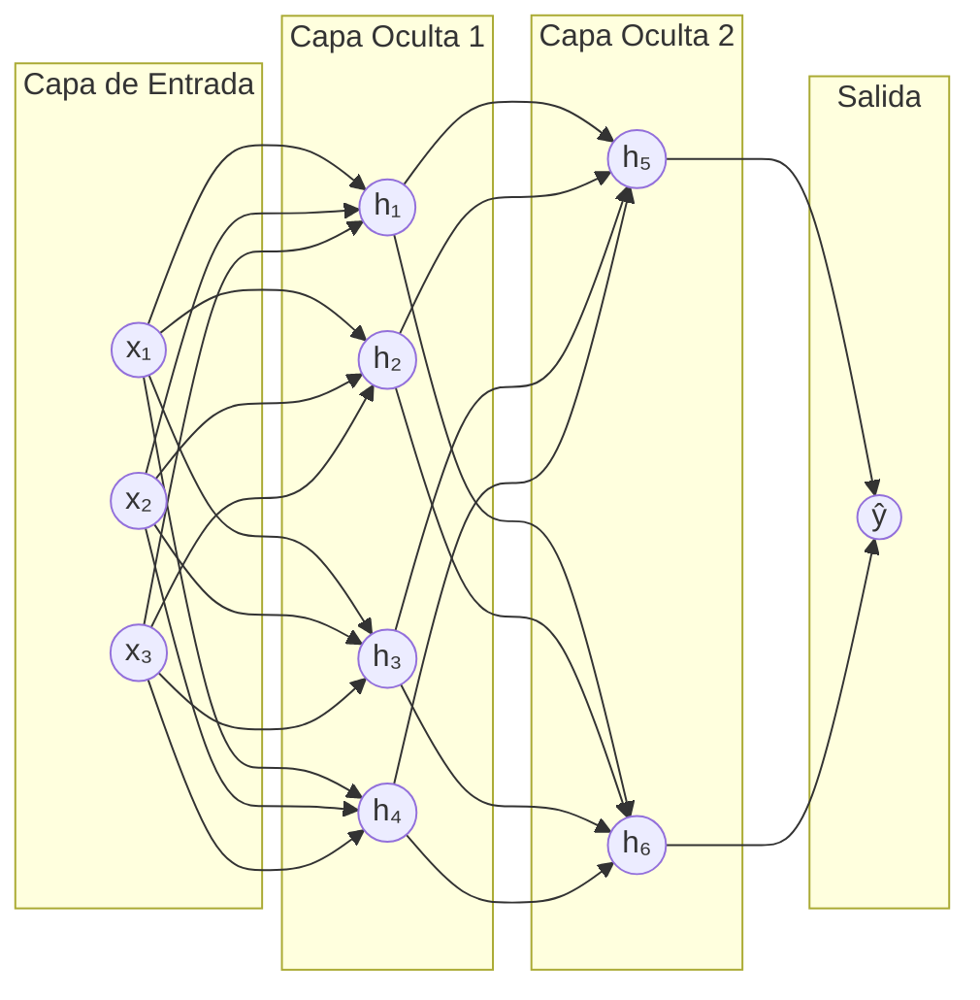
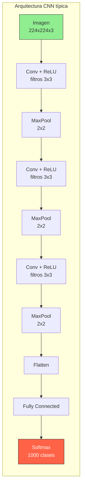
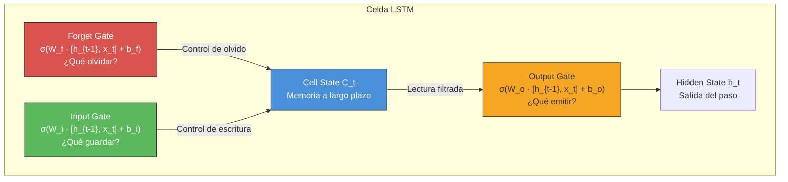
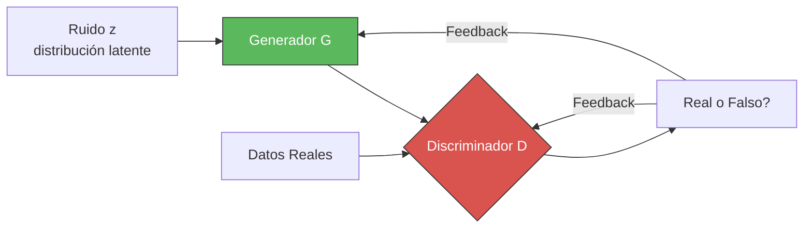
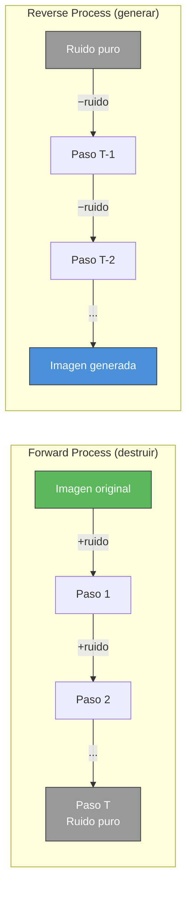
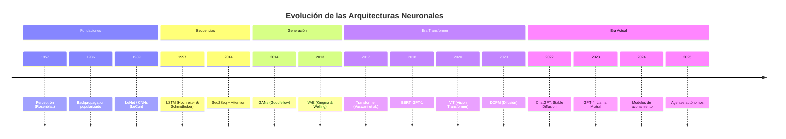

# Redes Neuronales - Del Perceptrón a las Arquitecturas Modernas

> [!abstract]
> Las redes neuronales artificiales (*Artificial Neural Networks*, ANNs) son el pilar del *deep learning* y la base de toda la IA moderna. Esta nota recorre la evolución desde el ==perceptrón de Rosenblatt (1957)== hasta las ==arquitecturas de difusión y Transformers== que dominan el campo actual. Se cubren las principales familias: redes feedforward, convolucionales (CNN), recurrentes (RNN/LSTM), generativas adversarias (GAN), modelos de difusión y la revolucionaria arquitectura [[transformer-architecture|Transformer]]. Incluye guías prácticas de cuándo usar cada arquitectura.

---

## El perceptrón: donde todo comenzó

En 1957, Frank Rosenblatt construyó el *Perceptron*, la primera red neuronal capaz de aprender ([[historia-ia]]). Inspirado en las neuronas biológicas modeladas por McCulloch y Pitts (1943), el perceptrón es un clasificador lineal binario. ^perceptron

**Funcionamiento matemático:**

$$y = f\left(\sum_{i=1}^{n} w_i x_i + b\right)$$

Donde $x_i$ son las entradas, $w_i$ los pesos, $b$ el sesgo (*bias*), y $f$ es una función de activación escalón.

> [!warning] La crisis del XOR
> En 1969, Minsky y Papert demostraron en su libro *Perceptrons*[^1] que un perceptrón de una sola capa ==no puede resolver el problema XOR== (ni ningún problema no linealmente separable). Esta limitación, aunque solucionable con múltiples capas, fue interpretada como una condena a las redes neuronales y contribuyó al [[historia-ia#^primer-invierno|primer invierno de la IA]]. ^xor-crisis

### La solución: perceptrón multicapa (MLP)

El *Multi-Layer Perceptron* (MLP) resuelve el problema XOR al añadir capas ocultas (*hidden layers*) que permiten aprender fronteras de decisión no lineales.



---

## Funciones de activación

Las funciones de activación introducen ==no linealidad== en la red, permitiéndole modelar relaciones complejas.

| Función | Fórmula | Rango | Uso principal | Problema |
|---------|---------|-------|---------------|----------|
| Sigmoid | $\sigma(x) = \frac{1}{1+e^{-x}}$ | (0, 1) | Clasificación binaria (salida) | Gradientes desvanecientes |
| Tanh | $\tanh(x) = \frac{e^x - e^{-x}}{e^x + e^{-x}}$ | (-1, 1) | RNNs (histórico) | Gradientes desvanecientes |
| ==ReLU== | $\max(0, x)$ | [0, ∞) | ==Estándar para capas ocultas== | "Neuronas muertas" |
| Leaky ReLU | $\max(0.01x, x)$ | (-∞, ∞) | Alternativa a ReLU | Ligeramente más lento |
| GELU | $x \cdot \Phi(x)$ | (-0.17, ∞) | ==Transformers (GPT, BERT)== | Más costoso |
| SiLU/Swish | $x \cdot \sigma(x)$ | (-0.28, ∞) | ==LLMs modernos (Llama)== | Más costoso |
| Softmax | $\frac{e^{x_i}}{\sum_j e^{x_j}}$ | (0, 1) | Clasificación multiclase (salida) | - |

> [!tip] Regla práctica
> Para capas ocultas en redes modernas, usa ==ReLU o sus variantes== (GELU para Transformers, SiLU para LLMs). Para la capa de salida, usa sigmoid (binaria) o softmax (multiclase). No uses sigmoid/tanh en capas ocultas profundas por el problema de gradientes desvanecientes.

---

## Backpropagation: cómo aprenden las redes

*Backpropagation* (retropropagación del error)[^2] es el algoritmo que permite entrenar redes neuronales multicapa. Funciona en dos fases:

1. **Forward pass**: propagar la entrada a través de la red para obtener la predicción
2. **Backward pass**: calcular el gradiente del error con respecto a cada peso usando la ==regla de la cadena== y actualizar los pesos en la dirección que reduce el error

> [!example]- El proceso de backpropagation
> ```
> 1. Forward pass: x → h₁ = f(W₁x + b₁) → ŷ = f(W₂h₁ + b₂)
> 2. Calcular pérdida: L = Loss(y, ŷ)
> 3. Backward pass:
>    ∂L/∂W₂ = ∂L/∂ŷ · ∂ŷ/∂W₂        (gradiente capa salida)
>    ∂L/∂W₁ = ∂L/∂ŷ · ∂ŷ/∂h₁ · ∂h₁/∂W₁  (gradiente capa oculta)
> 4. Actualizar pesos:
>    W₂ = W₂ - η · ∂L/∂W₂
>    W₁ = W₁ - η · ∂L/∂W₁
> ```
> Donde η (*learning rate*) controla el tamaño del paso de actualización.

### Optimizadores modernos

| Optimizador | Innovación | Cuándo usar |
|-------------|-----------|-------------|
| SGD + Momentum | Acumula velocidad en direcciones consistentes | Visión por computadora |
| Adam | Tasa de aprendizaje adaptativa por parámetro | ==Default para la mayoría de casos== |
| AdamW | Adam con *weight decay* correcto | ==Entrenamiento de Transformers== |
| LAMB | Adam escalado para batch grandes | Pre-entrenamiento a gran escala |
| Lion | Más eficiente en memoria que Adam | LLMs (investigación) |

---

## Redes Neuronales Convolucionales (CNN)

Las *Convolutional Neural Networks* (CNNs) son la arquitectura dominante para ==procesamiento de imágenes, video y señales espaciales==. Introducidas por Yann LeCun en 1989 con LeNet para reconocimiento de dígitos[^3].

### Principio fundamental

En lugar de conectar cada neurona con todas las entradas (como un MLP), las CNNs usan ==filtros (*kernels*) que se deslizan sobre la entrada== detectando patrones locales. Esto introduce dos propiedades clave:

- **Compartición de parámetros** (*parameter sharing*): el mismo filtro se aplica en toda la imagen
- **Equivarianza a la traslación**: un gato se detecta igual esté en la esquina o en el centro



### Evolución de las arquitecturas CNN

| Año | Arquitectura | Capas | Top-5 Error (ImageNet) | Innovación clave |
|-----|-------------|-------|----------------------|------------------|
| 1998 | LeNet-5 | 5 | - | Convoluciones para dígitos |
| 2012 | ==AlexNet== | 8 | ==15.3%== | GPUs, ReLU, Dropout |
| 2014 | VGGNet | 19 | 7.3% | Filtros 3x3 profundos |
| 2014 | GoogLeNet | 22 | 6.7% | Módulos Inception |
| 2015 | ==ResNet== | ==152== | ==3.57%== | Conexiones residuales |
| 2017 | DenseNet | 201 | - | Conexiones densas |
| 2019 | EfficientNet | Variable | ==1.8%== | Escalado compuesto |
| 2020 | ViT | 12-24 | Comparable | [[transformer-architecture\|Transformers]] para visión |

> [!success] ResNet: la revolución de las conexiones residuales
> ==ResNet== (He et al., 2015)[^4] resolvió el problema de entrenar redes muy profundas con *skip connections* (conexiones residuales): en lugar de aprender $H(x)$, la red aprende el residuo $F(x) = H(x) - x$, facilitando que la información fluya a través de muchas capas. Esta idea es ==fundamental en todas las arquitecturas modernas, incluyendo Transformers==. ^resnet-residual

---

## Redes Neuronales Recurrentes (RNN)

Las *Recurrent Neural Networks* (RNNs) procesan ==datos secuenciales== manteniendo un estado oculto que actúa como "memoria" de los pasos anteriores.

$$h_t = f(W_h h_{t-1} + W_x x_t + b)$$

Donde $h_t$ es el estado oculto en el paso $t$, $x_t$ la entrada actual, y $W_h$, $W_x$ los pesos.

> [!danger] El problema del gradiente desvaneciente
> Las RNNs básicas sufren del ==*vanishing gradient problem*==: al propagar gradientes a través de muchos pasos temporales, estos se multiplican repetidamente por valores < 1, haciéndose exponencialmente pequeños. Esto impide que la red aprenda dependencias a largo plazo. ^vanishing-gradient

### LSTM (*Long Short-Term Memory*)

Hochreiter y Schmidhuber (1997)[^5] resolvieron el problema del gradiente desvaneciente con ==puertas (*gates*) que controlan el flujo de información==:



| Variante | Innovación | Estado |
|----------|-----------|--------|
| LSTM | 3 puertas (forget, input, output) | ==Reemplazado por Transformers en NLP== |
| GRU | 2 puertas (reset, update), más simple | Similar rendimiento, más rápido |
| Bidirectional RNN | Procesa secuencia en ambas direcciones | Predecesor de BERT |
| Seq2Seq + Attention | Encoder-decoder con mecanismo de atención | Predecesor directo del Transformer |

> [!warning] RNNs vs Transformers
> Desde 2017, los [[transformer-architecture|Transformers]] han ==reemplazado casi completamente a las RNNs/LSTMs== en procesamiento de lenguaje natural. Las razones: paralelización del entrenamiento, mejor modelado de dependencias largas, y escalabilidad superior. Sin embargo, las RNNs aún son usadas en algunos dominios de series temporales y en dispositivos con recursos limitados.

---

## Redes Generativas Adversarias (GAN)

Ian Goodfellow introdujo las *Generative Adversarial Networks* (GANs) en 2014[^6] ([[historia-ia]]). La idea es elegantemente simple: dos redes compiten entre sí.

> [!info] El juego adversarial
> - **Generador** (G): aprende a crear datos falsos que parecen reales
> - **Discriminador** (D): aprende a distinguir datos reales de falsos
> - Se entrenan simultáneamente: G intenta engañar a D, D intenta no ser engañado
> - En equilibrio (*Nash equilibrium*), G genera datos indistinguibles de los reales



### Evolución de las GANs

| Año | Variante | Innovación | Aplicación |
|-----|----------|-----------|------------|
| 2014 | GAN original | Marco adversarial | Generación básica de imágenes |
| 2015 | DCGAN | Convoluciones profundas | Imágenes más estables |
| 2017 | WGAN | Distancia de Wasserstein | Entrenamiento más estable |
| 2017 | CycleGAN | Traducción imagen-imagen sin pares | Caballo→cebra, verano→invierno |
| 2018 | ==StyleGAN== | Control de estilo por capas | ==Caras fotorrealistas== |
| 2019 | BigGAN | Escala masiva | ImageNet a 512x512 |
| 2020 | StyleGAN2 | Eliminación de artefactos | Caras indistinguibles de fotos reales |

> [!failure] Limitaciones de las GANs
> - **Mode collapse**: el generador produce poca variedad
> - **Entrenamiento inestable**: difícil de converger
> - **No aprende una distribución explícita**: no se puede calcular la probabilidad de una muestra
> - ==Han sido mayormente reemplazadas por modelos de difusión para generación de imágenes==

---

## Modelos de difusión (*Diffusion Models*)

Los modelos de difusión son la arquitectura detrás de ==DALL-E 2, Stable Diffusion, Midjourney y Sora==. Funcionan aprendiendo a revertir un proceso gradual de corrupción por ruido. ^diffusion-models

> [!tip] Intuición
> Imagina que tomas una foto y gradualmente le añades ruido gaussiano hasta que solo queda ruido puro. Un modelo de difusión aprende a ==revertir este proceso: dado ruido puro, reconstruye gradualmente una imagen coherente==.

**Dos fases:**
1. **Forward process** (fijo): añadir ruido gaussiano gradualmente en $T$ pasos
2. **Reverse process** (aprendido): eliminar ruido gradualmente, generando la imagen



| Modelo | Año | Parámetros | Resolución | Innovación |
|--------|-----|------------|------------|------------|
| DDPM | 2020 | ~100M | 256x256 | Framework de difusión |
| DALL-E 2 | 2022 | 3.5B | 1024x1024 | CLIP + difusión |
| Stable Diffusion | 2022 | 890M | 512-1024 | Difusión en espacio latente (LDM) |
| Midjourney v5 | 2023 | Desconocido | 1024+ | Calidad artística superior |
| SDXL | 2023 | 2.6B | 1024x1024 | Dos etapas de refinamiento |
| Sora | 2024 | Desconocido | Video HD | Difusión para video |

> [!success] Ventajas sobre GANs
> Los modelos de difusión superaron a las GANs porque:
> 1. ==Entrenamiento estable== (no hay adversarial training)
> 2. Mayor diversidad de muestras (no hay mode collapse)
> 3. Densidad de probabilidad explícita
> 4. Control fino con *guidance* (classifier-free guidance)
> 5. Escalabilidad probada

---

## La arquitectura Transformer

> [!info] La revolución definitiva
> El Transformer, presentado en *"Attention Is All You Need"* (Vaswani et al., 2017)[^7], ha ==reemplazado o mejorado prácticamente toda arquitectura neuronal existente==. Originalmente diseñado para traducción, ahora domina NLP, visión, audio, proteínas, robótica y más. Ver [[transformer-architecture]] para un análisis exhaustivo. ^transformer-intro

Lo que hace al Transformer revolucionario:
1. **Paralelización total**: a diferencia de las RNNs, procesa toda la secuencia simultáneamente
2. **Atención global**: cada token puede "atender" directamente a cualquier otro token
3. **Escalabilidad**: el rendimiento mejora predeciblemente con más datos y parámetros

---

## Cronología de innovaciones clave



---

## Guía: ¿qué arquitectura usar?

| Tarea | Arquitectura recomendada | Alternativa | Notas |
|-------|-------------------------|-------------|-------|
| Clasificación de imágenes | ==ViT / EfficientNet== | ResNet | ViT requiere más datos |
| Detección de objetos | DETR / YOLOv8 | Faster R-CNN | YOLO para tiempo real |
| Segmentación | SAM / SegFormer | U-Net | SAM para zero-shot |
| NLP - clasificación | ==BERT fine-tuned / LLM== | - | LLMs para zero-shot |
| NLP - generación | ==Transformer decoder (GPT, Claude)== | - | Sin alternativa real |
| Traducción | Transformer encoder-decoder | - | Estándar desde 2017 |
| Series temporales | Transformer temporal / LSTM | Prophet, ARIMA | Transformers escalando |
| Generación de imágenes | ==Modelos de difusión== | GAN (StyleGAN) | Difusión es estándar |
| Generación de video | DiT (Diffusion Transformer) | - | Campo emergente |
| Audio / TTS | Transformer (Whisper, XTTS) | WaveNet | Whisper para STT |
| Proteínas | AlphaFold / ESMFold | - | Transformer-based |

---

## Conceptos transversales

### Conexiones residuales

Introducidas por ResNet [[#^resnet-residual]], las *skip connections* permiten que la información fluya directamente entre capas no adyacentes: $y = F(x) + x$. Son ==fundamentales en todas las arquitecturas modernas profundas==.

### Normalización

| Técnica | Dónde normaliza | Uso principal |
|---------|----------------|---------------|
| *Batch Normalization* | A través del batch | CNNs |
| *Layer Normalization* | A través de las features | ==Transformers== |
| *Group Normalization* | Grupos de canales | Detección de objetos |
| *RMS Normalization* | Variante simplificada de LayerNorm | ==LLMs modernos (Llama)== |

### Transfer Learning

> [!success] La técnica más práctica
> ==*Transfer learning*== permite reusar un modelo pre-entrenado en una tarea general y adaptarlo a una tarea específica con pocos datos. Es la base del paradigma moderno de [[machine-learning-overview#^pipeline-llm|pre-training + fine-tuning]] que usan todos los LLMs. Ver [[fine-tuning-overview]]. ^transfer-learning

---

## Relación con el ecosistema

Las arquitecturas neuronales son la base técnica de todo el ecosistema:

- **[[intake-overview]]**: utiliza modelos basados en [[transformer-architecture|Transformers]] tanto para procesamiento de texto (encoder) como para generación (decoder). La capa de embeddings emplea técnicas originadas en CNNs para procesamiento de documentos con layout
- **[[architect-overview]]**: se basa enteramente en LLMs (*decoder-only Transformers*) para generación de código y arquitectura, con mecanismos de atención que le permiten razonar sobre codebases completas
- **[[vigil-overview]]**: combina autoencoders para detección de anomalías, modelos de clasificación basados en Transformers para categorización de alertas, y técnicas de series temporales (LSTM/Transformer) para predicción
- **[[licit-overview]]**: emplea modelos encoder (tipo BERT) para clasificación de cláusulas legales y modelos decoder para generación de texto de compliance

---

## Enlaces y referencias

### Notas relacionadas
- [[tipos-ia]] - Cómo las redes neuronales encajan en la taxonomía de IA
- [[historia-ia]] - La evolución histórica completa
- [[machine-learning-overview]] - ML como contexto del deep learning
- [[transformer-architecture]] - ==La nota más detallada sobre la arquitectura dominante==
- [[fine-tuning-overview]] - Adaptación de redes pre-entrenadas
- [[generative-models]] - Profundización en modelos generativos

> [!quote]- Bibliografía y referencias
> - [^1]: Minsky, M. & Papert, S. (1969). *Perceptrons: An Introduction to Computational Geometry*. MIT Press.
> - [^2]: Rumelhart, D.E., Hinton, G.E. & Williams, R.J. (1986). *Learning representations by back-propagating errors*. Nature, 323, 533-536.
> - [^3]: LeCun, Y. et al. (1989). *Backpropagation Applied to Handwritten Zip Code Recognition*. Neural Computation.
> - [^4]: He, K. et al. (2015). *Deep Residual Learning for Image Recognition*. arXiv:1512.03385.
> - [^5]: Hochreiter, S. & Schmidhuber, J. (1997). *Long Short-Term Memory*. Neural Computation, 9(8), 1735-1780.
> - [^6]: Goodfellow, I. et al. (2014). *Generative Adversarial Networks*. NeurIPS.
> - [^7]: Vaswani, A. et al. (2017). *Attention Is All You Need*. NeurIPS.
> - Goodfellow, I., Bengio, Y. & Courville, A. (2016). *Deep Learning*. MIT Press.
> - LeCun, Y., Bengio, Y. & Hinton, G. (2015). *Deep Learning*. Nature, 521, 436-444.
> - Ho, J., Jain, A. & Abbeel, P. (2020). *Denoising Diffusion Probabilistic Models*. NeurIPS.

[^1]: Minsky & Papert (1969). Perceptrons.
[^2]: Rumelhart, Hinton & Williams (1986). Learning representations by back-propagating errors.
[^3]: LeCun et al. (1989). Backpropagation Applied to Handwritten Zip Code Recognition.
[^4]: He et al. (2015). Deep Residual Learning for Image Recognition.
[^5]: Hochreiter & Schmidhuber (1997). Long Short-Term Memory.
[^6]: Goodfellow et al. (2014). Generative Adversarial Networks.
[^7]: Vaswani et al. (2017). Attention Is All You Need.
