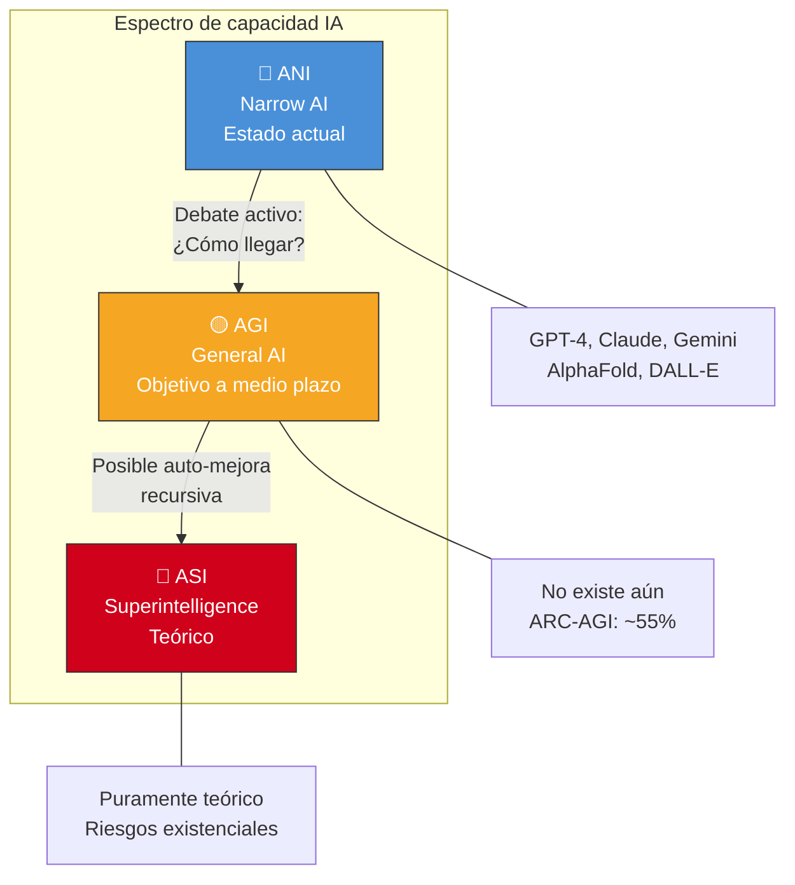
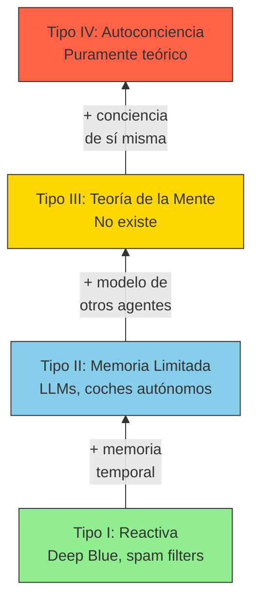
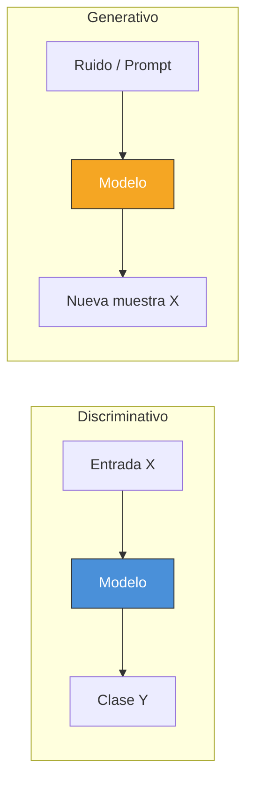
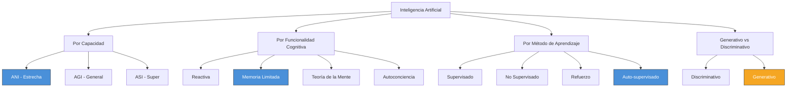

# Tipos de Inteligencia Artificial

> [!abstract]
> Existen múltiples formas de clasificar la inteligencia artificial, cada una iluminando diferentes aspectos del campo. Esta nota cubre tres taxonomías fundamentales: ==por capacidad (ANI, AGI, ASI)==, ==por funcionalidad cognitiva (reactiva, memoria limitada, teoría de la mente, autoconciencia)== y ==por método de aprendizaje (supervisado, no supervisado, por refuerzo, generativo vs discriminativo)==. Comprender estas clasificaciones es esencial para evaluar el estado actual de la IA y las afirmaciones sobre su futuro.

---

## Taxonomía por capacidad

Esta es la clasificación más conocida y debatida. Divide la IA en tres niveles según la amplitud de su inteligencia comparada con la humana.

### ANI - Inteligencia Artificial Estrecha (*Artificial Narrow Intelligence*)

> [!info] Estado actual
> ==Toda la IA que existe hoy es ANI==. Incluso los modelos más avanzados como GPT-4, Claude, Gemini y los agentes autónomos son formas sofisticadas de inteligencia artificial estrecha. Son extremadamente capaces en dominios específicos pero carecen de comprensión general del mundo. ^ani-estado-actual

*Artificial Narrow Intelligence* (ANI), también llamada *weak AI*, se refiere a sistemas diseñados y entrenados para realizar tareas específicas. Características clave:

- **Especialización**: optimizada para un dominio o conjunto de tareas
- **Sin transferencia genuina**: no puede aplicar conocimiento de un dominio a otro de forma autónoma
- **Sin conciencia**: no tiene experiencia subjetiva ni comprensión real
- **Dependiente de datos**: su rendimiento está limitado por los datos de entrenamiento

| Sistema ANI | Dominio | Capacidad | Limitación |
|-------------|---------|-----------|------------|
| AlphaGo | Go | Supera a cualquier humano | No puede jugar ajedrez sin reentrenamiento |
| GPT-4 | Lenguaje | Genera texto sofisticado | No tiene modelo del mundo persistente |
| DALL-E 3 | Imágenes | Genera imágenes de alta calidad | No entiende física real |
| AlphaFold 2 | Proteínas | Predice estructuras 3D con precisión atómica | Solo sirve para plegamiento de proteínas |
| Tesla Autopilot | Conducción | Navega carreteras | Falla en situaciones imprevistas |

> [!warning] La ilusión de generalidad
> Los LLMs modernos parecen generales porque operan sobre lenguaje, que es un medio universal. Sin embargo, ==su "generalidad" es una función de la amplitud de sus datos de entrenamiento==, no de comprensión genuina. Un LLM que "sabe" física, historia y programación no integra ese conocimiento como lo haría una mente humana: recupera patrones estadísticos de sus datos.

### AGI - Inteligencia Artificial General (*Artificial General Intelligence*)

> [!question] La gran pregunta
> ¿Cuándo (si alguna vez) alcanzaremos AGI? Las respuestas varían enormemente:
> - **Optimistas** (Demis Hassabis, Sam Altman): 2-10 años
> - **Moderados** (Yoshua Bengio): 20-50 años
> - **Escépticos** (Yann LeCun): las arquitecturas actuales no son suficientes
> - **Pesimistas** (Gary Marcus): podría requerir paradigmas fundamentalmente nuevos

*Artificial General Intelligence* (AGI), o *strong AI*, se refiere a un sistema con ==capacidad cognitiva general equivalente o superior a la humana==. Un sistema AGI debería poder:

1. **Aprender cualquier tarea intelectual** que un humano pueda aprender
2. **Transferir conocimiento** entre dominios de forma flexible
3. **Razonar abstractamente** sobre situaciones nuevas
4. **Planificar a largo plazo** con objetivos complejos
5. **Comprender el contexto** social, emocional y cultural

> [!example]- Criterios propuestos para AGI
> No existe consenso sobre cómo definir o medir AGI. Algunas propuestas:
>
> **Test de Turing** ([[historia-ia#^test-turing]]): un humano no puede distinguir la máquina de un humano en conversación. Criticado por ser demasiado fácil de "hackear" con trucos superficiales.
>
> **Test del café** (Steve Wozniak): una máquina AGI debería poder entrar en una casa desconocida, encontrar la cocina, identificar los ingredientes y preparar café. Prueba manipulación física, navegación y sentido común.
>
> **Test del empleo** (Ben Goertzel): una máquina AGI debería poder realizar cualquier trabajo humano con un periodo razonable de entrenamiento.
>
> **ARC-AGI Benchmark** (Chollet, 2024): mide la capacidad de abstracción y generalización en tareas de razonamiento visual nuevas. En 2024, los mejores sistemas de IA obtuvieron ~55% vs ~98% humano.

> [!danger] Riesgos asociados a AGI
> El desarrollo de AGI plantea riesgos existenciales según investigadores como Stuart Russell, Nick Bostrom y los firmantes de la carta del Future of Life Institute. El ==problema de alineación== (*alignment problem*) - cómo asegurar que un sistema superinteligente actúe en beneficio de la humanidad - es considerado por muchos como el problema más importante de nuestra era. Ver [[etica-ia]].

### ASI - Superinteligencia Artificial (*Artificial Superintelligence*)

*Artificial Superintelligence* (ASI) se refiere a un sistema que ==supera la inteligencia humana en todos los dominios==: creatividad científica, sabiduría general, habilidades sociales, y todo lo demás.

> [!quote] Nick Bostrom, *Superintelligence* (2014)
> *"Machine intelligence is the last invention that humanity will ever need to make."*[^1]

Características teóricas de ASI:
- Capacidad de auto-mejora recursiva (*recursive self-improvement*)
- Resolución de problemas que exceden la comprensión humana
- Velocidad de procesamiento millones de veces superior
- Capacidad de optimización a escala global

> [!danger] La singularidad tecnológica
> El concepto de *technological singularity*, popularizado por Ray Kurzweil y Vernor Vinge, postula que ==la creación de ASI desencadenaría un ciclo de auto-mejora tan rápido que el progreso se volvería impredecible e incomprensible para los humanos==. Kurzweil predice la singularidad para 2045. ^singularidad

---

## Taxonomía por funcionalidad cognitiva

Esta clasificación, propuesta por Arend Hintze[^2], ordena la IA según sus capacidades cognitivas en cuatro tipos progresivos.

### Tipo I: Máquinas reactivas (*Reactive Machines*)

Los sistemas más básicos. ==No tienen memoria ni capacidad de usar experiencias pasadas==. Responden a estímulos específicos con acciones predeterminadas.

> [!example]- Deep Blue como máquina reactiva
> Deep Blue de IBM, que venció a Kasparov en 1997 ([[historia-ia]]), es el ejemplo clásico. Evaluaba ==200 millones de posiciones por segundo== pero no recordaba jugadas anteriores ni aprendía de partidas pasadas. Cada movimiento se calculaba desde cero evaluando el estado actual del tablero.

**Características**: sin memoria, sin aprendizaje, respuesta directa al estímulo actual.
**Ejemplos**: Deep Blue, sistemas de recomendación simples basados en reglas, filtros de spam básicos.

### Tipo II: Memoria limitada (*Limited Memory*)

Estos sistemas ==pueden usar datos recientes para tomar decisiones==, pero no forman recuerdos permanentes. La mayoría de la IA actual pertenece a esta categoría.

| Sistema | Tipo de memoria | Duración | Uso |
|---------|----------------|----------|-----|
| Coches autónomos | Datos de sensores recientes | Segundos | Detectar coches cercanos |
| LLMs (GPT-4, Claude) | Ventana de contexto | Una conversación | Mantener coherencia |
| Sistemas de recomendación | Historial de usuario | Variable | Personalización |

> [!info] Los LLMs como memoria limitada
> Los modelos de lenguaje grandes son un caso interesante de memoria limitada. ==Su "conocimiento" del mundo está congelado en los pesos del modelo (entrenamiento)==, y su "memoria" conversacional está limitada a la ventana de contexto (tokens recientes). No forman nuevos recuerdos persistentes entre conversaciones. La técnica de [[machine-learning-overview|fine-tuning]] puede actualizar sus conocimientos, pero es un proceso costoso y no equivale a "recordar". ^llm-memoria-limitada

### Tipo III: Teoría de la mente (*Theory of Mind*)

> [!warning] No existe aún
> Este tipo de IA ==podría entender emociones, creencias, intenciones y expectativas==, y ajustar su comportamiento en consecuencia. Requeriría un modelo interno de otros agentes. Aunque los LLMs actuales simulan aspectos de teoría de la mente en sus respuestas, no poseen una representación genuina de estados mentales ajenos.

Capacidades necesarias:
- Modelar estados mentales de otros agentes
- Predecir comportamiento basándose en intenciones inferidas
- Entender sarcasmo, ironía y comunicación implícita
- Adaptar el comportamiento social al contexto cultural

### Tipo IV: Autoconciencia (*Self-Aware AI*)

El nivel más alto teórico: una IA con ==conciencia de sí misma, experiencia subjetiva y sentido de identidad==.

> [!danger] Territorio puramente especulativo
> No tenemos una teoría científica completa de la conciencia humana, lo que hace extremadamente difícil determinar si una máquina podría ser consciente, y mucho menos diseñar una que lo sea. Este nivel plantea las preguntas filosóficas más profundas sobre la naturaleza de la mente y la experiencia subjetiva (*qualia*).

---

## Taxonomía por método de aprendizaje

Esta clasificación se basa en ==cómo aprende el sistema== y está directamente relacionada con [[machine-learning-overview]].

### Aprendizaje supervisado (*Supervised Learning*)

El modelo aprende de pares entrada-salida etiquetados. Dado un conjunto de ejemplos $(x_i, y_i)$, aprende la función $f: X \rightarrow Y$.

> [!tip] Cuándo usar supervisado
> - Cuando tienes datos etiquetados abundantes
> - Para clasificación (spam/no spam, diagnóstico médico)
> - Para regresión (predicción de precios, demanda)

**Algoritmos clave**: regresión lineal, SVM, árboles de decisión, [[redes-neuronales|redes neuronales]], *Random Forests*, *Gradient Boosting*.

### Aprendizaje no supervisado (*Unsupervised Learning*)

El modelo encuentra estructura en datos sin etiquetar. Busca patrones, agrupaciones o representaciones latentes.

**Algoritmos clave**: K-means, DBSCAN, PCA, autoencoders, modelos de mezcla gaussiana.

### Aprendizaje por refuerzo (*Reinforcement Learning*)

Un agente aprende a tomar decisiones interactuando con un entorno para maximizar una señal de recompensa acumulada.

> [!example]- RL en acción: AlphaGo
> AlphaGo ([[historia-ia#^alphago]]) usó *deep reinforcement learning* combinado con *Monte Carlo tree search*. El agente jugó ==millones de partidas contra sí mismo==, recibiendo recompensa (+1 por victoria, -1 por derrota) y refinando su política de juego. La versión Zero eliminó completamente el aprendizaje de datos humanos.

### Aprendizaje auto-supervisado (*Self-Supervised Learning*)

> [!success] La base de los LLMs modernos
> ==El aprendizaje auto-supervisado es el paradigma que hizo posible GPT, BERT, Claude y todos los LLMs modernos.== El modelo genera sus propias etiquetas a partir de los datos: por ejemplo, predecir la siguiente palabra en un texto (*causal language modeling*) o rellenar palabras enmascaradas (*masked language modeling*). No requiere etiquetado manual. Ver [[transformer-architecture]] para la arquitectura subyacente. ^self-supervised

| Paradigma | Datos | Etiquetas | Ejemplo LLM |
|-----------|-------|-----------|-------------|
| Supervisado | Texto + etiquetas | Humanos las crean | Fine-tuning con instrucciones |
| No supervisado | Texto sin etiquetar | No hay | Clustering de documentos |
| Auto-supervisado | Texto sin etiquetar | Generadas del propio texto | ==Pre-training de GPT, BERT== |
| Refuerzo | Interacción | Señal de recompensa | RLHF para alineación |

---

## Generativo vs. Discriminativo

Una clasificación fundamental en [[machine-learning-overview]] distingue entre modelos generativos y discriminativos.

### Modelos discriminativos

Aprenden la frontera de decisión entre clases. Modelan $P(y|x)$ directamente: dada una entrada, ¿cuál es la clase más probable?

- **Ejemplos**: regresión logística, SVM, redes neuronales de clasificación, BERT para NLP
- **Fortaleza**: eficientes para clasificación cuando hay datos etiquetados
- **Limitación**: no pueden generar nuevos ejemplos

### Modelos generativos

Aprenden la distribución de los datos. Modelan $P(x)$ o $P(x,y)$, pudiendo generar nuevas muestras.

> [!tip] La revolución generativa
> La ==IA generativa== (*Generative AI*) es la tendencia dominante desde 2022. Los modelos generativos pueden crear texto, imágenes, audio, video y código que antes solo los humanos podían producir.

| Tipo | Arquitectura | Ejemplo | Genera |
|------|-------------|---------|--------|
| LLM | [[transformer-architecture|Transformer]] decodificador | GPT-4, Claude | Texto |
| Difusión | [[redes-neuronales|U-Net]] + noise schedule | Stable Diffusion, DALL-E 3 | Imágenes |
| GAN | Generador + Discriminador | StyleGAN, BigGAN | Imágenes |
| VAE | Encoder + Decoder | VQ-VAE | Imágenes, audio |
| Autoregresivo multimodal | Transformer multimodal | GPT-4o, Gemini | Texto, imagen, audio |

---

## Mapa integrado de taxonomías

---

## Estado actual: el debate ANI vs AGI

> [!question] ¿Dónde estamos realmente?
> El estado actual de la IA genera un debate intenso. Algunos argumentos clave:

**Argumentos de que estamos cerca de AGI:**
1. Los LLMs muestran capacidades emergentes no programadas explícitamente
2. Rendimiento a nivel humano en exámenes profesionales
3. *In-context learning*: capacidad de aprender de ejemplos sin reentrenamiento
4. Los modelos de razonamiento (o1, o3) demuestran capacidad de reflexión
5. Los agentes autónomos completan tareas complejas de múltiples pasos

**Argumentos de que AGI está lejos:**
1. ==Los LLMs no tienen modelo del mundo== persistente ni actualizable
2. Fallan en razonamiento causal y sentido común básico
3. No pueden aprender de forma continua sin reentrenamiento
4. Su "comprensión" podría ser *stochastic parroting* sofisticado[^3]
5. El benchmark ARC-AGI muestra brechas significativas con humanos

> [!failure] Limitaciones concretas de la IA actual
> - No puede mover una taza de café (Test de Wozniak)
> - Confidente al dar respuestas incorrectas (*hallucinations*)
> - No puede actualizar su conocimiento en tiempo real
> - Requiere cantidades masivas de energía y datos
> - No tiene motivación intrínseca ni curiosidad genuina

---

## Relación con el ecosistema

Las diferentes taxonomías de IA informan el diseño y las capacidades de los productos del ecosistema:

- **[[intake-overview]]**: opera como un sistema ANI de memoria limitada (Tipo II), usando [[transformer-architecture|modelos generativos]] para procesar y clasificar documentos. Su efectividad depende de la calidad del *fine-tuning* supervisado
- **[[architect-overview]]**: combina capacidades generativas (generar código/arquitectura) con discriminativas (evaluar calidad), representando el estado del arte en ANI aplicada a desarrollo de software
- **[[vigil-overview]]**: utiliza modelos discriminativos para detección de anomalías y modelos generativos para síntesis de reportes. Un ejemplo de cómo diferentes [[machine-learning-overview|tipos de ML]] se combinan en un producto
- **[[licit-overview]]**: aplica clasificación supervisada para categorizar riesgos legales y generación de texto para producir documentación de compliance

---

## Enlaces y referencias

### Notas relacionadas
- [[historia-ia]] - Cronología completa desde Turing hasta 2025
- [[machine-learning-overview]] - Detalle de cada paradigma de aprendizaje
- [[redes-neuronales]] - Arquitecturas detrás de cada tipo de IA
- [[transformer-architecture]] - La arquitectura dominante en IA generativa
- [[etica-ia]] - Implicaciones éticas de AGI y ASI
- [[tendencias-futuro]] - Predicciones sobre el camino hacia AGI

> [!quote]- Bibliografía y referencias
> - [^1]: Bostrom, N. (2014). *Superintelligence: Paths, Dangers, Strategies*. Oxford University Press.
> - [^2]: Hintze, A. (2016). *Understanding the Four Types of AI, from Reactive Robots to Self-Aware Beings*. The Conversation.
> - [^3]: Bender, E.M. et al. (2021). *On the Dangers of Stochastic Parrots: Can Language Models Be Too Big?*. FAccT '21.
> - Russell, S. & Norvig, P. (2020). *Artificial Intelligence: A Modern Approach*. 4th Edition. Pearson.
> - Chollet, F. (2019). *On the Measure of Intelligence*. arXiv:1911.01547.
> - Marcus, G. & Davis, E. (2019). *Rebooting AI: Building Artificial Intelligence We Can Trust*. Vintage.
> - Goertzel, B. & Pennachin, C. (2007). *Artificial General Intelligence*. Springer.

[^1]: Bostrom (2014). Superintelligence: Paths, Dangers, Strategies.
[^2]: Hintze (2016). Understanding the Four Types of AI.
[^3]: Bender et al. (2021). On the Dangers of Stochastic Parrots.
