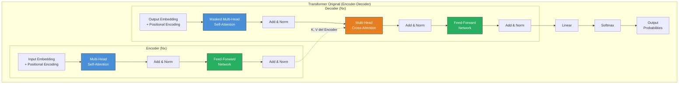
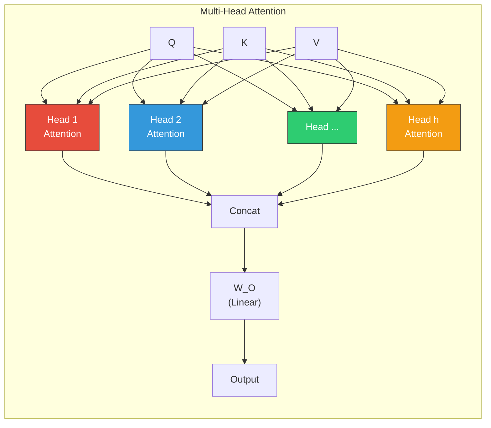
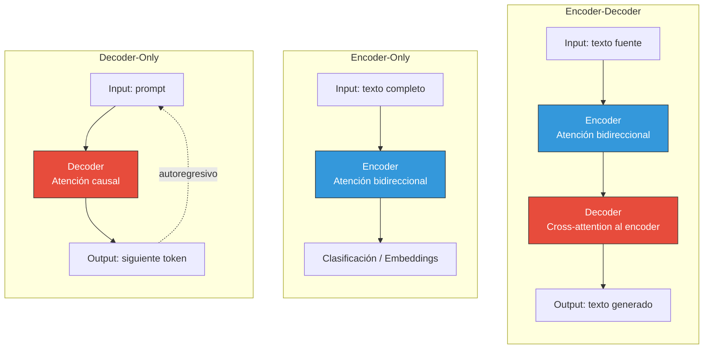

# Arquitectura Transformer

> [!abstract]
> El Transformer es ==la arquitectura más importante en la historia moderna de la inteligencia artificial==. Presentado en *"Attention Is All You Need"* (Vaswani et al., 2017)[^1], eliminó la necesidad de recurrencia y convoluciones para procesar secuencias, reemplazándolas por el mecanismo de ==*self-attention*==. Esta nota es un análisis exhaustivo de cada componente: la intuición y la matemática detrás de *self-attention*, *multi-head attention*, *positional encoding* (sinusoidal, RoPE, ALiBi), las variantes encoder-decoder vs decoder-only, *layer normalization*, conexiones residuales, y las propiedades de escalado que hicieron posible la era de los LLMs. Incluye diagramas arquitectónicos y código simplificado.

---

## ¿Por qué el Transformer?

Antes del Transformer, el procesamiento de secuencias estaba dominado por las [[redes-neuronales|RNNs y LSTMs]]. Estas arquitecturas tenían limitaciones fundamentales:

| Limitación de RNN/LSTM | Cómo lo resuelve el Transformer |
|------------------------|-------------------------------|
| ==Procesamiento secuencial== (token a token) | Procesamiento paralelo de toda la secuencia |
| Dependencias a largo plazo limitadas | Atención directa entre cualquier par de tokens |
| Gradientes desvanecientes ([[redes-neuronales#^vanishing-gradient]]) | Conexiones residuales + normalización |
| No paralelizable en entrenamiento | ==Totalmente paralelizable en GPUs/TPUs== |
| Cuello de botella en vector de estado fijo | Representación distribuida por posición |

> [!success] El impacto
> El Transformer no solo mejoró el estado del arte en traducción automática (su tarea original), sino que ==se convirtió en la arquitectura base de prácticamente toda la IA moderna==: GPT, BERT, Claude, Gemini, Llama, DALL-E, Whisper, AlphaFold, modelos de video, robótica y más. ^transformer-impacto

---

## Visión general de la arquitectura



El Transformer original tiene una arquitectura ==encoder-decoder== con $N=6$ capas idénticas en cada parte. Cada capa del encoder contiene dos sub-capas (self-attention + feed-forward), y cada capa del decoder contiene tres (masked self-attention + cross-attention + feed-forward). ^arquitectura-original

---

## Self-Attention: el corazón del Transformer

### Intuición

> [!tip] Entendiendo self-attention
> Imagina que lees la frase: *"El gato se sentó en la alfombra porque estaba cansado."*
>
> ¿A qué se refiere "estaba"? Un humano sabe inmediatamente que se refiere al gato. El mecanismo de *self-attention* permite al modelo hacer exactamente esto: ==cada palabra "presta atención" a todas las demás palabras de la secuencia para entender el contexto==.
>
> Específicamente, cada token genera tres vectores:
> - **Query** (Q): "¿Qué estoy buscando?"
> - **Key** (K): "¿Qué contengo?"
> - **Value** (V): "¿Qué información doy?"
>
> La atención se calcula como la similitud entre el Query de un token y los Keys de todos los tokens, usada para ponderar los Values. ^self-attention-intuicion

### La matemática

La operación de *Scaled Dot-Product Attention* se define como:

$$\text{Attention}(Q, K, V) = \text{softmax}\left(\frac{QK^T}{\sqrt{d_k}}\right)V$$

Donde: ^attention-formula
- $Q \in \mathbb{R}^{n \times d_k}$: matriz de queries (n tokens, dimensión $d_k$)
- $K \in \mathbb{R}^{n \times d_k}$: matriz de keys
- $V \in \mathbb{R}^{n \times d_v}$: matriz de values
- $d_k$: dimensión de las keys (==el factor de escala $\sqrt{d_k}$ previene que los dot products sean demasiado grandes==, lo que saturaría el softmax)

> [!example]- Paso a paso: cálculo de self-attention
> Supongamos una secuencia de 3 tokens con $d_k = 4$:
>
> **1. Proyectar inputs a Q, K, V:**
> ```
> Input X = [[1.0, 0.5, 0.3, 0.8],   # token 1
>             [0.2, 0.9, 0.7, 0.1],   # token 2
>             [0.6, 0.3, 0.8, 0.4]]   # token 3
>
> Q = X · W_Q    # [3 x 4] · [4 x 4] = [3 x 4]
> K = X · W_K    # mismas dimensiones
> V = X · W_V    # mismas dimensiones
> ```
>
> **2. Calcular scores de atención:**
> ```
> scores = Q · K^T / sqrt(4)    # [3 x 3] matrix
> # scores[i][j] = cuánta atención presta token_i a token_j
> ```
>
> **3. Aplicar softmax (por filas):**
> ```
> attention_weights = softmax(scores, dim=-1)    # [3 x 3]
> # Cada fila suma 1.0
> # attention_weights[i][j] = peso de atención de token_i hacia token_j
> ```
>
> **4. Ponderar values:**
> ```
> output = attention_weights · V    # [3 x 3] · [3 x 4] = [3 x 4]
> # output[i] = suma ponderada de todos los values, según la atención de token_i
> ```

> [!example]- Implementación simplificada en Python
> ```python
> import torch
> import torch.nn as nn
> import torch.nn.functional as F
> import math
>
> class SelfAttention(nn.Module):
>     """Implementación simplificada de Scaled Dot-Product Attention."""
>
>     def __init__(self, d_model: int, d_k: int):
>         super().__init__()
>         self.d_k = d_k
>         # Proyecciones lineales para Q, K, V
>         self.W_Q = nn.Linear(d_model, d_k, bias=False)
>         self.W_K = nn.Linear(d_model, d_k, bias=False)
>         self.W_V = nn.Linear(d_model, d_k, bias=False)
>
>     def forward(self, x: torch.Tensor, mask: torch.Tensor = None):
>         """
>         x: (batch_size, seq_len, d_model)
>         mask: (batch_size, seq_len, seq_len) o None
>         """
>         Q = self.W_Q(x)  # (batch, seq_len, d_k)
>         K = self.W_K(x)  # (batch, seq_len, d_k)
>         V = self.W_V(x)  # (batch, seq_len, d_k)
>
>         # Scaled dot-product attention
>         scores = torch.matmul(Q, K.transpose(-2, -1)) / math.sqrt(self.d_k)
>         # scores: (batch, seq_len, seq_len)
>
>         if mask is not None:
>             scores = scores.masked_fill(mask == 0, float('-inf'))
>
>         attention_weights = F.softmax(scores, dim=-1)
>         # attention_weights: (batch, seq_len, seq_len)
>
>         output = torch.matmul(attention_weights, V)
>         # output: (batch, seq_len, d_k)
>
>         return output, attention_weights
>
>
> # Ejemplo de uso
> d_model = 512
> d_k = 64
> seq_len = 10
> batch_size = 2
>
> attn = SelfAttention(d_model, d_k)
> x = torch.randn(batch_size, seq_len, d_model)
>
> # Máscara causal para modelos autoregresivos (tipo GPT)
> causal_mask = torch.tril(torch.ones(seq_len, seq_len))
>
> output, weights = attn(x, causal_mask)
> print(f"Output shape: {output.shape}")   # (2, 10, 64)
> print(f"Weights shape: {weights.shape}") # (2, 10, 10)
> ```

### ¿Por qué funciona self-attention?

> [!info] Propiedades clave
> 1. **Contexto global**: cada token puede atender ==directamente a cualquier otro token== en la secuencia, sin importar la distancia. En una RNN, la información de un token lejano debe pasar por todos los intermedios.
> 2. **Composicionalidad**: diferentes capas de atención pueden capturar diferentes tipos de relaciones (sintácticas, semánticas, coreferenciales).
> 3. **Interpretabilidad parcial**: los pesos de atención muestran a qué tokens presta atención el modelo (aunque la interpretación no es directa).
> 4. **Paralelización**: todas las atenciones se calculan simultáneamente, aprovechando al máximo las GPUs.

> [!danger] Complejidad cuadrática
> La complejidad de self-attention es ==$O(n^2 \cdot d)$== donde $n$ es la longitud de la secuencia y $d$ la dimensión. Esto significa que ==duplicar la longitud de secuencia cuadruplica el cómputo y la memoria==. Esta limitación es la razón principal de los límites en la ventana de contexto (*context window*) de los LLMs y ha motivado intensa investigación en atención eficiente. ^complejidad-cuadratica

**Variantes de atención eficiente:**

| Método | Complejidad | Idea | Usado en |
|--------|-------------|------|----------|
| Vanilla attention | $O(n^2d)$ | Atención completa | GPT-4, Claude |
| Sparse attention | $O(n\sqrt{n}d)$ | Patrones de atención dispersos | GPT-3 (parcial) |
| Flash Attention | $O(n^2d)$ pero ==mucho más rápido en GPU== | Optimización de memoria/IO | ==Casi todos los LLMs modernos== |
| Linear attention | $O(nd^2)$ | Kernel trick para linearizar | Investigación |
| Sliding window | $O(n \cdot w \cdot d)$ | Atención local + global | Mistral, Longformer |
| Ring attention | $O(n^2d)$ distribuido | Distribuir secuencia entre GPUs | Gemini (contextos largos) |
| Multi-Query Attention | $O(n^2d)$ reducido | Compartir K,V entre cabezas | ==Llama 2, PaLM== |
| Grouped-Query Attention | $O(n^2d)$ reducido | Grupos de cabezas comparten K,V | ==Llama 3, Gemma== |

---

## Multi-Head Attention

En lugar de calcular una sola función de atención, el Transformer usa ==múltiples "cabezas" de atención en paralelo==, cada una con sus propias matrices de proyección. ^multi-head

$$\text{MultiHead}(Q, K, V) = \text{Concat}(\text{head}_1, ..., \text{head}_h)W^O$$

Donde cada cabeza es:

$$\text{head}_i = \text{Attention}(QW_i^Q, KW_i^K, VW_i^V)$$

> [!tip] ¿Por qué múltiples cabezas?
> Cada cabeza de atención puede ==especializarse en capturar un tipo diferente de relación==:
> - Una cabeza puede capturar relaciones sintácticas (sujeto-verbo)
> - Otra puede capturar correferencias (pronombres-antecedentes)
> - Otra puede capturar relaciones semánticas (sinónimos, analogías)
> - Otra puede capturar patrones posicionales (palabras adyacentes)
>
> El modelo original usaba $h=8$ cabezas con $d_k = d_v = d_{model}/h = 64$. Los LLMs modernos usan muchas más: ==GPT-3 usa 96 cabezas, Llama 3 405B usa 128 cabezas==.



### Multi-Query y Grouped-Query Attention

> [!info] Optimizaciones de inferencia
> En la inferencia autoregresiva, las matrices K y V de tokens previos se almacenan en un *KV cache* que crece linealmente con la secuencia. Con muchas cabezas, esto consume mucha memoria.
>
> - **Multi-Query Attention** (MQA): ==todas las cabezas comparten las mismas K y V==, solo Q es diferente por cabeza. Reduce dramáticamente el KV cache. Usado en PaLM, Llama 2.
> - **Grouped-Query Attention** (GQA): compromiso entre MHA y MQA. Las cabezas se agrupan (ej. 8 grupos de 8 cabezas), cada grupo comparte K,V. ==Usado en Llama 3, Gemma, Mixtral.== ^gqa

---

## Positional Encoding

Self-attention es ==invariante al orden== de los tokens: sin información posicional, "el gato persigue al ratón" y "el ratón persigue al gato" producirían la misma representación. Los *positional encodings* inyectan información sobre la posición de cada token en la secuencia. ^positional-encoding

### Codificación sinusoidal (original)

El paper original usó funciones sinusoidales:

$$PE_{(pos, 2i)} = \sin\left(\frac{pos}{10000^{2i/d_{model}}}\right)$$
$$PE_{(pos, 2i+1)} = \cos\left(\frac{pos}{10000^{2i/d_{model}}}\right)$$

Donde $pos$ es la posición en la secuencia e $i$ es la dimensión.

> [!tip] Intuición de las funciones sinusoidales
> Cada dimensión del encoding oscila a una frecuencia diferente. Las dimensiones bajas oscilan rápidamente (capturan posiciones cercanas) y las altas oscilan lentamente (capturan posiciones lejanas). La ventaja es que ==las posiciones relativas se pueden expresar como transformaciones lineales de los encodings==, lo que permite al modelo aprender relaciones posicionales relativas.

### RoPE (*Rotary Position Embedding*)

> [!success] El estándar actual
> ==RoPE (Su et al., 2021)[^2] es el método de codificación posicional usado en la mayoría de LLMs modernos==: Llama, Mistral, Qwen, PaLM, y muchos más. En lugar de sumar un encoding al vector, RoPE ==rota las coordenadas del vector en el espacio de embeddings==. ^rope

La idea clave: aplicar una rotación dependiente de la posición a los vectores Q y K antes de calcular el dot product.

$$\text{RoPE}(x_m, m) = R_m x_m$$

Donde $R_m$ es una matriz de rotación por bloques cuyo ángulo depende de la posición $m$.

**Ventajas de RoPE sobre sinusoidal:**
1. Codifica naturalmente ==posiciones relativas== (la atención entre tokens $m$ y $n$ depende solo de $m-n$)
2. Decae suavemente con la distancia (tokens lejanos reciben menos atención)
3. Compatible con extensión de contexto (*NTK-aware RoPE*, *YaRN*)
4. No requiere parámetros adicionales aprendibles

### ALiBi (*Attention with Linear Biases*)

ALiBi (Press et al., 2022)[^3] toma un enfoque diferente: no modifica los embeddings sino que añade un ==sesgo lineal negativo a los scores de atención basado en la distancia entre tokens==.

$$\text{scores}_{ij} = q_i \cdot k_j - m \cdot |i - j|$$

Donde $m$ es una pendiente (*slope*) fija que varía por cabeza de atención.

> [!info] Comparación de métodos de posición
> | Método | Tipo | Generalización a secuencias largas | Usado en |
> |--------|------|----------------------------------|----------|
> | Sinusoidal | Absoluto, aditivo | Limitada | Transformer original |
> | Aprendido | Absoluto, aditivo | Limitada al entrenamiento | BERT, GPT-2 |
> | ==RoPE== | ==Relativo, rotacional== | ==Extensible con interpolación== | ==Llama, Mistral, Qwen, GPT-NeoX== |
> | ALiBi | Relativo, bias aditivo | Buena extrapolación nativa | BLOOM, MPT |
> | Relative PE (T5) | Relativo, bias aprendido | Buena | T5, Flan-T5 |

---

## Feed-Forward Network (FFN)

Cada capa del Transformer incluye una red feed-forward posición por posición (*position-wise feed-forward network*):

$$\text{FFN}(x) = \text{Activation}(xW_1 + b_1)W_2 + b_2$$

En el Transformer original, la capa interna tiene dimensión $d_{ff} = 4 \times d_{model} = 2048$. Los LLMs modernos usan dimensiones mucho mayores.

> [!info] Variantes modernas del FFN
> | Variante | Activación | Fórmula | Usado en |
> |----------|-----------|---------|----------|
> | Original | ReLU | $\max(0, xW_1 + b_1)W_2 + b_2$ | Transformer (2017) |
> | GELU | GELU | $\text{GELU}(xW_1)W_2$ | BERT, GPT-2/3 |
> | ==SwiGLU== | Swish + GLU | ==$(\text{Swish}(xW_1) \odot xW_3)W_2$== | ==Llama, Mistral, PaLM, Gemma== |
>
> SwiGLU (Shazeer, 2020)[^4] introduce una tercera matriz de pesos ($W_3$) y una multiplicación element-wise (*gating*), mejorando el rendimiento a igual cómputo. Es el estándar en LLMs modernos.

> [!question] ¿Qué almacena el FFN?
> Investigaciones recientes sugieren que las capas FFN actúan como ==memorias clave-valor== donde se almacena conocimiento factual[^5]. Las matrices $W_1$ codifican "keys" (patrones de activación) y $W_2$ codifica "values" (información asociada). Esto tiene implicaciones directas para la edición de conocimiento en modelos y la comprensión de cómo los LLMs "recuerdan" hechos.

---

## Layer Normalization y conexiones residuales

### Conexiones residuales

Cada sub-capa del Transformer usa una ==conexión residual== (*skip connection*) seguida de normalización:

$$\text{output} = \text{Norm}(x + \text{SubLayer}(x))$$

Heredadas de ResNet ([[redes-neuronales#^resnet-residual]]), las conexiones residuales permiten que:
1. Los gradientes fluyan directamente a través de las capas (previene gradiente desvaneciente)
2. Las capas aprenden modificaciones incrementales al input
3. Se puedan entrenar redes con cientos de capas

### Layer Normalization

A diferencia de *Batch Normalization* (que normaliza a través del batch), *Layer Normalization*[^6] normaliza ==a través de las features para cada muestra individualmente==:

$$\text{LayerNorm}(x) = \gamma \cdot \frac{x - \mu}{\sqrt{\sigma^2 + \epsilon}} + \beta$$

Donde $\mu$ y $\sigma$ son la media y desviación estándar calculadas sobre las features, y $\gamma$, $\beta$ son parámetros aprendibles.

> [!tip] Pre-Norm vs Post-Norm
> El Transformer original usa ==Post-Norm==: $x + \text{SubLayer}(\text{LayerNorm}(x))$... incorrecto, usa $\text{LayerNorm}(x + \text{SubLayer}(x))$.
>
> Los LLMs modernos usan ==Pre-Norm==: $x + \text{SubLayer}(\text{LayerNorm}(x))$. Pre-Norm es más estable para entrenar modelos muy profundos y es el estándar desde GPT-2.

### RMSNorm

> [!info] La simplificación que funciona
> ==RMSNorm== (Zhang & Sennrich, 2019)[^7] elimina el centrado (resta de media) de LayerNorm, usando solo la norma RMS:
>
> $$\text{RMSNorm}(x) = \gamma \cdot \frac{x}{\sqrt{\frac{1}{n}\sum_{i=1}^n x_i^2 + \epsilon}}$$
>
> Es ==computacionalmente más eficiente== y funciona igual de bien. Usado en ==Llama, Mistral, Gemma y la mayoría de LLMs modernos==. ^rmsnorm

---

## Encoder-Decoder vs. Decoder-Only



| Variante | Atención | Ejemplos | Tarea típica |
|----------|----------|----------|-------------|
| **Encoder-Decoder** | Bidireccional (enc) + causal (dec) + cross | T5, BART, mT5 | Traducción, resumen |
| **Encoder-Only** | Bidireccional | BERT, RoBERTa, DeBERTa | Clasificación, NER, embeddings |
| **==Decoder-Only==** | ==Causal (unidireccional)== | ==GPT-4, Claude, Llama, Gemini, Mistral== | ==Generación de texto, la mayoría de tareas== |

> [!success] El triunfo del decoder-only
> A pesar de que el Transformer original era encoder-decoder, ==los modelos decoder-only han dominado== desde GPT-2. La razón: son más simples, escalan mejor, y con suficientes datos y parámetros pueden realizar cualquier tarea de NLP (incluyendo las que antes requerían encoder) mediante ==generación condicional==. ^decoder-only-dominante

### Máscara causal (*Causal Mask*)

En modelos decoder-only, la atención es ==unidireccional==: cada token solo puede atender a tokens anteriores (y a sí mismo), no a tokens futuros. Esto se implementa con una máscara triangular inferior que pone $-\infty$ en las posiciones futuras antes del softmax.

```
Causal mask (seq_len=5):
[1, 0, 0, 0, 0]     token 1: solo ve a sí mismo
[1, 1, 0, 0, 0]     token 2: ve tokens 1-2
[1, 1, 1, 0, 0]     token 3: ve tokens 1-3
[1, 1, 1, 1, 0]     token 4: ve tokens 1-4
[1, 1, 1, 1, 1]     token 5: ve todos los tokens
```

Esta máscara es lo que permite el entrenamiento con *teacher forcing*: todos los tokens se procesan en paralelo, pero cada uno solo "ve" su contexto izquierdo, simulando la generación autoregresiva.

---

## Por qué los Transformers superaron a las RNNs

> [!info] Comparación detallada
> | Aspecto | RNN/LSTM | Transformer |
> |---------|----------|-------------|
> | Procesamiento | Secuencial ($O(n)$ pasos) | ==Paralelo (1 paso)== |
> | Dependencias largas | Limitadas (gradient flow) | ==Directas (attention)== |
> | Entrenamiento GPU | Poco eficiente | ==Altamente paralelo== |
> | Memoria de contexto | Estado oculto fijo | ==Ventana de contexto completa== |
> | Escalabilidad | Rendimiento satura | ==Log-lineal con escala== |
> | Velocidad de entrenamiento | Lento | ==Ordenes de magnitud más rápido== |
>
> La ventaja de paralelización es especialmente decisiva: entrenar un LLM con trillones de tokens sería ==computacionalmente imposible== con RNNs. ^transformers-vs-rnns

> [!warning] La desventaja
> La complejidad cuadrática de la atención ([[#^complejidad-cuadratica]]) significa que los Transformers consumen ==mucha más memoria para secuencias largas== que las RNNs (que tienen complejidad lineal en memoria). Esto ha motivado arquitecturas híbridas como Mamba (SSM) y RWKV que intentan combinar las ventajas de ambos enfoques.

---

## Propiedades de escalado (*Scaling Laws*)

> [!success] Lo que hizo posible los LLMs
> Las ==*scaling laws*== son la razón fundamental por la que los Transformers habilitaron la era de los LLMs. Kaplan et al. (2020)[^8] descubrieron que el rendimiento de un Transformer escala de forma ==predecible y log-lineal== con tres factores. ^scaling-laws

$$L(N, D, C) \approx \left(\frac{N_c}{N}\right)^{\alpha_N} + \left(\frac{D_c}{D}\right)^{\alpha_D} + L_\infty$$

Donde $L$ es la pérdida, $N$ los parámetros, $D$ los datos, y $L_\infty$ la pérdida irreducible.

| Factor | Scaling exponent | Implicación |
|--------|-----------------|-------------|
| Parámetros (N) | ~0.076 | ==10x más parámetros → ~0.5 menos pérdida== |
| Datos (D) | ~0.095 | 10x más datos → ~0.6 menos pérdida |
| Cómputo (C) | ~0.050 | 10x más cómputo → mejora predecible |

> [!example]- Chinchilla: la ley de escala refinada
> Hoffmann et al. (2022)[^9] demostraron que los LLMs anteriores estaban ==sub-entrenados== (demasiados parámetros, pocos datos). La regla de Chinchilla establece que ==el número óptimo de tokens de entrenamiento debe ser aproximadamente 20x el número de parámetros==:
>
> | Modelo | Parámetros | Tokens entrenamiento | Ratio tokens/params |
> |--------|-----------|---------------------|-------------------|
> | GPT-3 | 175B | 300B | 1.7x (sub-entrenado) |
> | Chinchilla | 70B | ==1.4T== | ==20x (óptimo)== |
> | Llama 2 70B | 70B | 2T | 29x (sobre-entrenado para inferencia) |
> | Llama 3 8B | 8B | 15T | ==1875x (extremo, más eficiente en inferencia)== |
>
> La tendencia actual es ==sobre-entrenar modelos pequeños== para obtener el mejor rendimiento posible en inferencia (donde el costo es por token generado).

### Capacidades emergentes

> [!question] ¿Emergen nuevas capacidades con la escala?
> Wei et al. (2022)[^10] observaron que ciertas capacidades ==aparecen abruptamente a cierta escala== sin estar presentes en modelos más pequeños:
> - Aritmética de múltiples dígitos (~10B parámetros)
> - *Chain-of-thought reasoning* (~100B parámetros)
> - Generación de código funcional (~10B parámetros)
>
> Sin embargo, Schaeffer et al. (2023) argumentan que las "capacidades emergentes" son un ==artefacto de las métricas discontinuas== elegidas. Con métricas suaves, la mejora es gradual. Este debate sigue abierto.

---

## Anatomía de un LLM moderno

Un LLM moderno (estilo Llama 3) combina todos los componentes anteriores:

```mermaid
graph TB
    subgraph "LLM Decoder-Only Moderno (ej. Llama 3)"
        TOK[Tokenizer<br/>BPE / SentencePiece] --> EMB[Token Embedding<br/>+ RoPE]

        subgraph "Bloque Transformer x N"
            RN1[RMSNorm] --> GQA[Grouped-Query<br/>Attention + RoPE]
            GQA --> RES1["Residual Connection (+)"]
            RES1 --> RN2[RMSNorm]
            RN2 --> SGL[SwiGLU FFN]
            SGL --> RES2["Residual Connection (+)"]
        end

        EMB --> RN1
        RES2 --> FN[RMSNorm Final]
        FN --> LH[Linear Head<br/>vocab_size]
        LH --> SM[Softmax<br/>+ Sampling]
        SM --> OUT[Token generado]
        OUT -.->|"Autoregresivo"| TOK
    end

    style TOK fill:#9b59b6,stroke:#333,color:#fff
    style GQA fill:#3498db,stroke:#333,color:#fff
    style SGL fill:#27ae60,stroke:#333,color:#fff
    style SM fill:#e74c3c,stroke:#333,color:#fff
```



**Especificaciones de modelos representativos:**

| Componente | Llama 3 8B | Llama 3 70B | GPT-3 175B |
|------------|-----------|------------|-----------|
| Capas | 32 | 80 | 96 |
| $d_{model}$ | 4096 | 8192 | 12288 |
| Cabezas atención | 32 | 64 | 96 |
| Cabezas KV (GQA) | 8 | 8 | 96 (MHA) |
| $d_{ff}$ (SwiGLU) | 14336 | 28672 | 49152 |
| Vocab size | 128K | 128K | 50K |
| Context window | 8K (ext. 128K) | 8K (ext. 128K) | 2K |
| Positional encoding | RoPE | RoPE | Aprendido |
| Normalization | RMSNorm | RMSNorm | LayerNorm |
| Activation | SwiGLU | SwiGLU | GELU |

---

## El proceso de generación (*Inference*)

> [!tip] Cómo genera texto un LLM
> La generación es ==autoregresiva==: el modelo genera un token a la vez, alimentando cada token generado como input para producir el siguiente. Este proceso implica:
> 1. **Prefill**: procesar todo el prompt en paralelo (rápido)
> 2. **Decode**: generar tokens uno a uno (lento, secuencial)
>
> El KV cache almacena las matrices K y V computadas para evitar recalcularlas en cada paso. Ver [[context-window]] para implicaciones prácticas. ^generacion-autoregresiva

**Estrategias de muestreo (*sampling*):**

| Estrategia | Descripción | Efecto |
|-----------|-------------|--------|
| *Greedy* | Siempre elige el token más probable | Determinista, repetitivo |
| *Temperature* | Escala logits por $T$: bajo=conservador, alto=creativo | Control de diversidad |
| *Top-k* | Solo considera los $k$ tokens más probables | Elimina tokens raros |
| *Top-p* (nucleus) | Considera tokens hasta acumular probabilidad $p$ | Adaptativo al contexto |
| *Min-p* | Descarta tokens con prob < $p \times \text{max\_prob}$ | Filtrado proporcional |

---

## Relación con el ecosistema

La arquitectura Transformer es la ==base tecnológica de absolutamente todo el ecosistema==:

- **[[intake-overview]]**: utiliza Transformers tanto en la capa de embeddings (encoder, para representar documentos) como en la capa de procesamiento (decoder, para extraer y resumir información). La atención permite al modelo "mirar" simultáneamente diferentes partes de un documento largo
- **[[architect-overview]]**: se basa en LLMs decoder-only que usan generación autoregresiva ([[#^generacion-autoregresiva]]) para producir código. La ventana de contexto y las propiedades de escalado determinan directamente la calidad de la arquitectura generada
- **[[vigil-overview]]**: emplea modelos encoder (tipo BERT) para clasificación de eventos y detección de anomalías en tiempo real, donde la atención bidireccional permite analizar logs completos de forma holística
- **[[licit-overview]]**: combina encoders para análisis semántico de cláusulas legales con decoders para generación de documentación. El mecanismo de atención es crítico para la precisión en la identificación de riesgos legales en textos largos

---

## Enlaces y referencias

### Notas relacionadas
- [[redes-neuronales]] - Contexto histórico: del perceptrón al Transformer
- [[machine-learning-overview]] - ML como marco general; self-supervised learning
- [[historia-ia]] - El Transformer en el contexto de la evolución de la IA
- [[tipos-ia]] - Cómo los Transformers impulsan la IA generativa
- [[fine-tuning-overview]] - Adaptación de Transformers pre-entrenados
- [[prompt-engineering-overview]] - Cómo interactuar efectivamente con Transformers
- [[context-window]] - Implicaciones prácticas de la ventana de contexto
- [[scaling-laws]] - Profundización en leyes de escala

> [!quote]- Bibliografía y referencias
> - [^1]: Vaswani, A. et al. (2017). *Attention Is All You Need*. NeurIPS. El paper fundacional.
> - [^2]: Su, J. et al. (2021). *RoFormer: Enhanced Transformer with Rotary Position Embedding*. arXiv:2104.09864.
> - [^3]: Press, O., Smith, N.A. & Lewis, M. (2022). *Train Short, Test Long: Attention with Linear Biases Enables Input Length Extrapolation*. ICLR.
> - [^4]: Shazeer, N. (2020). *GLU Variants Improve Transformer*. arXiv:2002.05202.
> - [^5]: Geva, M. et al. (2021). *Transformer Feed-Forward Layers Are Key-Value Memories*. EMNLP.
> - [^6]: Ba, J.L., Kiros, J.R. & Hinton, G.E. (2016). *Layer Normalization*. arXiv:1607.06450.
> - [^7]: Zhang, B. & Sennrich, R. (2019). *Root Mean Square Layer Normalization*. NeurIPS.
> - [^8]: Kaplan, J. et al. (2020). *Scaling Laws for Neural Language Models*. arXiv:2001.08361.
> - [^9]: Hoffmann, J. et al. (2022). *Training Compute-Optimal Large Language Models* (Chinchilla). arXiv:2203.15556.
> - [^10]: Wei, J. et al. (2022). *Emergent Abilities of Large Language Models*. TMLR.
> - Radford, A. et al. (2019). *Language Models are Unsupervised Multitask Learners* (GPT-2). OpenAI.
> - Brown, T.B. et al. (2020). *Language Models are Few-Shot Learners* (GPT-3). NeurIPS.
> - Touvron, H. et al. (2023). *Llama 2: Open Foundation and Fine-Tuned Chat Models*. arXiv:2307.09288.
> - Dao, T. et al. (2022). *FlashAttention: Fast and Memory-Efficient Exact Attention with IO-Awareness*. NeurIPS.

[^1]: Vaswani et al. (2017). Attention Is All You Need.
[^2]: Su et al. (2021). RoFormer: Enhanced Transformer with Rotary Position Embedding.
[^3]: Press, Smith & Lewis (2022). Train Short, Test Long: ALiBi.
[^4]: Shazeer (2020). GLU Variants Improve Transformer.
[^5]: Geva et al. (2021). Transformer Feed-Forward Layers Are Key-Value Memories.
[^6]: Ba, Kiros & Hinton (2016). Layer Normalization.
[^7]: Zhang & Sennrich (2019). Root Mean Square Layer Normalization.
[^8]: Kaplan et al. (2020). Scaling Laws for Neural Language Models.
[^9]: Hoffmann et al. (2022). Training Compute-Optimal Large Language Models (Chinchilla).
[^10]: Wei et al. (2022). Emergent Abilities of Large Language Models.
