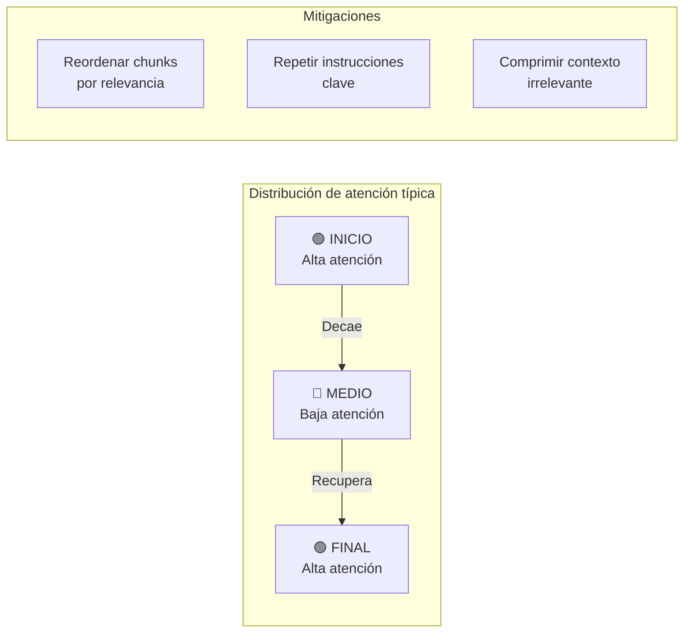
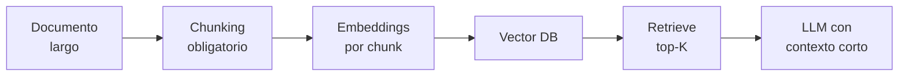
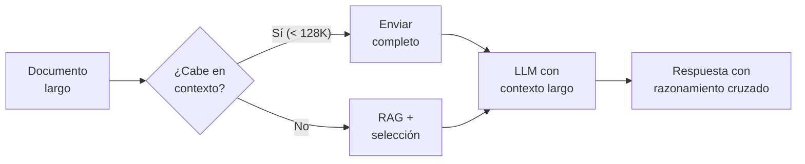

---
tags:
  - concepto
  - llm
  - arquitectura
aliases:
  - ventana de contexto
  - context length
  - longitud de contexto
created: 2025-06-01
updated: 2025-06-01
category: inference
status: current
difficulty: intermediate
related:
  - "[[transformer-architecture]]"
  - "[[inference-optimization]]"
  - "[[razonamiento-llm]]"
  - "[[context-engineering-overview]]"
  - "[[context-caching]]"
  - "[[pattern-rag]]"
  - "[[pricing-llm-apis]]"
  - "[[embeddings]]"
up: "[[moc-llms]]"
---

# Context Window

> [!abstract] Resumen
> La *context window* (ventana de contexto) define el número máximo de tokens que un LLM puede procesar en una sola llamada. La evolución ha sido vertiginosa: ==de 2K tokens en GPT-2 (2019) a 2M tokens en Gemini 1.5 Pro (2024)==. Este parámetro determina fundamentalmente qué aplicaciones son viables, cómo se diseñan los sistemas RAG, y cuánto cuesta cada inferencia. La relación entre contexto largo y calidad de atención no es lineal — el fenómeno *lost in the middle* demuestra que ==más contexto no siempre significa mejor rendimiento==. ^resumen

## Qué es y por qué importa

La **ventana de contexto** (*context window*) es la cantidad máxima de tokens — unidades de texto procesadas por el modelo — que un LLM puede considerar simultáneamente durante la generación de una respuesta. Este límite incluye tanto el *prompt* de entrada como la salida generada.

La importancia de este parámetro es difícil de exagerar. Determina:

- Si un documento completo puede ser procesado de una sola vez o requiere fragmentación
- Si un agente puede mantener un historial largo de conversación sin perder contexto
- El coste económico de cada llamada a la API
- La viabilidad de aplicaciones como análisis legal de contratos, revisión de código de repositorios completos, o síntesis de literatura científica

> [!tip] Cuándo necesitas contexto largo
> - **Usar contexto largo cuando**: El documento es único, no se puede fragmentar sin perder coherencia, o necesitas razonamiento cruzado entre partes distantes del texto
> - **No usar cuando**: La información es recuperable vía búsqueda semántica y las preguntas son puntuales
> - Ver [[pattern-rag]] para un enfoque complementario con *retrieval*

---

## Evolución histórica de la ventana de contexto

La progresión del tamaño de contexto refleja avances tanto algorítmicos como de hardware:

| Año | Modelo | Tokens | Equivalente aproximado | Técnica clave |
|-----|--------|--------|----------------------|---------------|
| 2019 | GPT-2 | 1,024 | ~2 páginas | *Absolute positional encoding* |
| 2020 | GPT-3 | 2,048 | ~4 páginas | *Learned positional embeddings* |
| 2022 | GPT-3.5 | 4,096 | ~8 páginas | Optimizaciones de entrenamiento |
| 2023 Q1 | GPT-4 | 8,192 | ~16 páginas | Escalado de atención |
| 2023 Q2 | GPT-4-32K | 32,768 | ~64 páginas | Extensión por *fine-tuning* |
| 2023 Q3 | Claude 2.1 | 200,000 | ~400 páginas | ==Primer salto a 200K== |
| 2024 Q1 | Gemini 1.5 Pro | 1,000,000 | ~2,000 páginas | *Ring attention* + *mixture of depths* |
| 2024 Q2 | Gemini 1.5 Pro | ==2,000,000== | ~4,000 páginas | ==Mayor ventana pública== |
| 2024 Q3 | Claude 3.5 Sonnet | 200,000 | ~400 páginas | Optimización de calidad en contexto largo |
| 2025 Q1 | GPT-4.1 | 1,000,000 | ~2,000 páginas | Extensión nativa |
| 2025 Q1 | Claude Opus 4 | ==1,000,000== | ~2,000 páginas | *Interleaved attention* |

> [!info] Conversión de tokens
> Como regla general: ==1 token ≈ 0.75 palabras en inglés, ≈ 0.60 palabras en español==. Un libro típico de 300 páginas tiene aproximadamente 100K tokens en inglés. Un contexto de 1M tokens equivale a ~10 libros completos.

---

## Cómo funciona internamente

### El problema de la complejidad cuadrática

La arquitectura *Transformer* original[^1] utiliza *self-attention* con complejidad O(n²) respecto a la longitud de la secuencia. Para una secuencia de 1,000 tokens, la matriz de atención tiene 1 millón de elementos. Para 100,000 tokens, son ==10 mil millones de elementos==. Esto hace que escalar la ventana sea un desafío tanto computacional como de memoria.

> [!example]- Ver diagrama de complejidad
> ```mermaid
> graph TD
>     subgraph "Complejidad de Self-Attention"
>         A["Secuencia: n tokens"] --> B["Matriz Q·K^T"]
>         B --> C["Tamaño: n × n"]
>         C --> D["2K tokens → 4M elementos"]
>         C --> E["128K tokens → 16B elementos"]
>         C --> F["1M tokens → 1T elementos"]
>     end
>
>     subgraph "Soluciones"
>         G["Flash Attention"] --> H["Reduce acceso a memoria"]
>         I["Sparse Attention"] --> J["Reduce cálculos"]
>         K["Sliding Window"] --> L["Limita rango de atención"]
>         M["Ring Attention"] --> N["Distribuye entre GPUs"]
>     end
>
>     F -.->|"Requiere"| G
>     F -.->|"Requiere"| I
>     F -.->|"Requiere"| K
>     F -.->|"Requiere"| M
> ```

### Codificación de posiciones (*Positional Encoding*)

Los *Transformers* no tienen noción inherente de orden secuencial. Las codificaciones posicionales inyectan información sobre la posición de cada token. Las técnicas modernas permiten extender el contexto más allá de lo visto durante el entrenamiento.

---

## Técnicas de extensión de contexto

### RoPE (*Rotary Position Embedding*)

Introducida por Su et al. (2021)[^2], *RoPE* codifica las posiciones como rotaciones en el espacio complejo. Su ventaja clave es que la relación entre dos posiciones depende solo de su distancia relativa, no de sus valores absolutos.

==*RoPE* es la codificación posicional dominante en modelos modernos==: LLaMA, Mistral, Qwen y muchos otros la utilizan como base. Su extensibilidad ha sido clave para permitir la ampliación de contexto post-entrenamiento.

> [!example]- Intuición de RoPE
> ```
> Posición p → Rotación de θ·p radianes
>
> Para tokens en posiciones i, j:
>   atención(i,j) depende de (i-j), no de i ni j individualmente
>
> Ventaja: invarianza translacional
> El modelo aprende "qué tan lejos" están dos tokens,
> no "en qué posición absoluta están"
> ```

### ALiBi (*Attention with Linear Biases*)

Propuesta por Press et al. (2022)[^3], *ALiBi* no modifica los *embeddings* sino que añade un sesgo lineal negativo a los *attention scores* basado en la distancia entre tokens. Tokens más distantes reciben penalizaciones mayores.

| Propiedad | RoPE | ALiBi |
|-----------|------|-------|
| Mecanismo | Rotación de embeddings | Sesgo en attention scores |
| Generalización | Requiere extensión (YaRN, NTK) | ==Extrapola naturalmente== |
| Uso de memoria | Estándar | Ligeramente menor |
| Adopción | LLaMA, Mistral, Qwen | BLOOM, MPT |
| Calidad en contexto muy largo | Excelente con extensiones | Degrada gradualmente |

### YaRN (*Yet another RoPE extensioN*)

*YaRN*[^4] es una técnica de extensión que aplica interpolación por frecuencia al esquema *RoPE*. Distingue entre dimensiones de alta y baja frecuencia del *embedding* rotatorio y las escala de manera diferente, logrando ==extensiones de 4x-16x sin reentrenamiento significativo==.

### Sliding Window Attention

Utilizada prominentemente por [[mistral-7b|Mistral]], la *sliding window attention* limita cada token a atender solo a los W tokens previos más cercanos. Combinada con capas que sí tienen atención completa, permite un compromiso eficiente:

- ==Complejidad O(n·W) en lugar de O(n²)==
- Las capas superiores propagan información más allá de la ventana local
- Mistral usa W=4,096 con atención completa cada pocas capas

> [!warning] Limitación de sliding window
> La *sliding window attention* pura pierde la capacidad de relacionar directamente tokens muy distantes. Los modelos que la usan necesitan mecanismos complementarios (capas de atención global, *sink tokens*) para mantener coherencia en secuencias largas.

---

## El problema "Lost in the Middle"

Liu et al. (2023)[^5] demostraron un fenómeno crítico: ==los LLMs prestan más atención al inicio y al final del contexto, perdiendo información situada en el medio==. Este descubrimiento tiene implicaciones profundas para el diseño de aplicaciones.

> [!danger] Implicación práctica
> Si colocas la información más relevante en el centro de un prompt largo, el modelo puede ignorarla parcialmente. Esto afecta directamente a:
> - Sistemas [[pattern-rag|RAG]] donde los chunks recuperados se insertan en el medio del prompt
> - Análisis de documentos largos donde la sección clave está en las páginas centrales
> - Conversaciones largas donde instrucciones del sistema quedan "enterradas"

### Distribución de atención en contexto largo



### Estrategias de mitigación

1. **Colocar información crítica al inicio y al final** del prompt
2. **Reordenar chunks de RAG**: los más relevantes primero y último, los menos relevantes en el medio
3. **Repetir instrucciones del sistema** al final del prompt como recordatorio
4. **Reducir el contexto innecesario** en lugar de depender de contextos enormes
5. **Usar [[context-caching|context caching]]** para mantener instrucciones fijas al inicio

---

## Needle-in-a-Haystack: benchmarking de contexto largo

El benchmark *Needle-in-a-Haystack* (NIAH) evalúa la capacidad del modelo para recuperar un dato específico insertado en una posición aleatoria dentro de un contexto largo lleno de texto irrelevante.

### Metodología

1. Se genera un "pajar" (*haystack*) de texto largo (ensayos, artículos)
2. Se inserta una "aguja" (*needle*): un hecho específico en una posición aleatoria
3. Se pregunta al modelo por ese hecho específico
4. Se varía la longitud del contexto y la posición de la aguja

### Resultados comparativos (2025)

| Modelo | Contexto máximo | NIAH al 100% | Degradación en medio | Nota |
|--------|----------------|-------------|----------------------|------|
| GPT-4.1 | 1M | ~95% hasta 512K | Moderada | Mejora significativa vs GPT-4 |
| Claude Opus 4 | 1M | ==~98% hasta 800K== | Mínima | ==Mejor rendimiento en contexto largo== |
| Gemini 1.5 Pro | 2M | ~92% hasta 1M | Notable en >1M | Primer modelo en 2M |
| Llama 3.1 405B | 128K | ~90% hasta 128K | Moderada | Mejor open-source |
| Mistral Large | 128K | ~88% hasta 128K | Moderada | Sliding window + global |

> [!question] Debate abierto: NIAH es suficiente?
> Existe un debate sobre si *Needle-in-a-Haystack* es un benchmark adecuado:
> - **A favor**: Prueba la capacidad fundamental de recuperación en contexto largo
> - **En contra**: Es demasiado simple — encontrar una frase literal no requiere razonamiento complejo. Benchmarks como *BABILong* y *RULER* evalúan tareas más realistas como razonamiento multi-hop sobre contexto largo
> - **Mi valoración**: NIAH es necesario pero insuficiente. Un modelo que falla en NIAH fallará en todo lo demás, pero pasar NIAH no garantiza buen rendimiento en tareas complejas de contexto largo.

---

## RAG vs contexto largo: el gran debate

Una de las decisiones arquitectónicas más importantes en 2025 es cuándo usar [[pattern-rag|RAG]] versus cuándo confiar en el contexto largo nativo del modelo.

### Argumentos a favor de contexto largo

1. **Simplicidad arquitectónica**: no requiere pipeline de indexación, embeddings, ni base de datos vectorial
2. **Coherencia**: el modelo tiene acceso a toda la información simultáneamente
3. **Sin pérdida de información**: no hay riesgo de que el *chunking* fragmente una idea
4. **Razonamiento cruzado**: puede conectar información de diferentes partes del documento

### Argumentos a favor de RAG

1. **Coste**: ==procesar 1M tokens por cada consulta es 100-500x más caro que recuperar los 5 chunks relevantes==
2. **Latencia**: la inferencia con contexto largo es significativamente más lenta
3. **Precisión**: la búsqueda semántica puede ser más precisa que la atención del modelo para encontrar información específica
4. **Escalabilidad**: RAG puede buscar en millones de documentos; el contexto largo tiene un límite fijo
5. **Actualización**: añadir nuevos documentos al índice es trivial vs re-procesar todo el contexto

> [!example]- Tabla de decisión: RAG vs contexto largo
> | Escenario | Recomendación | Razón |
> |-----------|---------------|-------|
> | Documento único < 100K tokens | ==Contexto largo== | Simplicidad, coherencia total |
> | Corpus de >100 documentos | ==RAG== | Coste, escalabilidad |
> | Análisis legal de un contrato | Contexto largo | Necesita coherencia total |
> | FAQ/soporte al cliente | RAG | Precisión puntual, coste |
> | Código de un repositorio completo | ==Híbrido== | Contexto largo para archivos clave + RAG para búsqueda |
> | Investigación científica | Híbrido | RAG para descubrimiento + contexto largo para síntesis |
> | Conversaciones con historial largo | Contexto largo + resumen | Mantener coherencia conversacional |

### El enfoque híbrido

La tendencia en 2025 es ==combinar RAG con contexto largo==. Primero se usa RAG para recuperar los documentos o fragmentos más relevantes, y luego se insertan en un contexto largo donde el modelo puede razonar sobre ellos de manera holística. Este enfoque optimiza tanto coste como calidad.

> [!tip] Patrón recomendado
> 1. Usa [[pattern-rag|RAG]] para reducir el corpus a los 10-20 fragmentos más relevantes
> 2. Inserta esos fragmentos en un contexto de 32K-128K tokens
> 3. Aplica las mitigaciones de "lost in the middle" (relevancia al inicio y final)
> 4. Usa [[context-caching|caching]] para el sistema prompt y las instrucciones fijas

---

## Implicaciones de coste

El coste de la inferencia escala directamente con el número de tokens procesados. Con los precios de APIs en 2025:

| Modelo | Input (por 1M tokens) | 1K tokens | 32K tokens | 128K tokens | 1M tokens |
|--------|----------------------|-----------|------------|-------------|-----------|
| GPT-4.1 | $2.00 | $0.002 | $0.064 | $0.256 | ==$2.00== |
| Claude Opus 4 | $15.00 | $0.015 | $0.48 | $1.92 | ==$15.00== |
| Claude Sonnet 4 | $3.00 | $0.003 | $0.096 | $0.384 | $3.00 |
| Gemini 1.5 Pro | $1.25 | $0.001 | $0.040 | $0.160 | $1.25 |

> [!warning] Coste oculto: la salida
> Los precios anteriores son solo por tokens de entrada. ==Los tokens de salida cuestan 3-5x más==. Una llamada con 128K de input que genera 4K de output no es solo $0.384 sino $0.384 + $0.060 = $0.444 para Claude Sonnet 4. A escala (miles de llamadas diarias), la diferencia es sustancial.

### Optimización de costes con contexto largo

1. **[[context-caching|Prompt caching]]**: ==descuento del 90% en tokens cacheados== para llamadas repetitivas con el mismo prefijo
2. **Compresión de contexto**: resumir partes del historial que no necesitan detalle completo
3. **Selección inteligente**: no enviar todo el contexto disponible, solo lo relevante
4. **Modelos escalonados**: usar modelos económicos para tareas simples, reservar contexto largo con modelos caros para tareas complejas

---

## Impacto en diseño de aplicaciones

La disponibilidad de contextos largos ha cambiado fundamentalmente cómo se diseñan las aplicaciones de IA:

### Antes (contexto < 8K)



### Ahora (contexto 128K-1M)



> [!success] Aplicaciones habilitadas por contexto largo
> - **Análisis de repositorios de código**: cargar archivos completos del proyecto para revisión holística
> - **Due diligence legal**: procesar contratos completos sin fragmentación
> - **Asistentes con memoria**: mantener conversaciones de horas sin perder contexto
> - **Síntesis de investigación**: resumir múltiples papers en una sola llamada
> - **Traducción de documentos largos**: mantener consistencia terminológica

> [!failure] Lo que el contexto largo NO resuelve
> - **Actualización en tiempo real**: el conocimiento sigue siendo estático dentro de la llamada
> - **Razonamiento perfecto**: más contexto amplifica el riesgo de [[hallucinations|alucinaciones]]
> - **Coste cero**: el precio sigue siendo proporcional al contexto usado
> - **Atención uniforme**: el problema *lost in the middle* persiste, aunque ha mejorado

---

## Estado del arte (2025-2026)

### Tendencias actuales

1. **Convergencia en 1M tokens**: la mayoría de modelos frontier ofrecen al menos 128K, con tendencia hacia 1M
2. **Ring attention y paralelismo de secuencia**: técnicas que distribuyen la atención entre múltiples GPUs para manejar secuencias muy largas[^6]
3. **Mixture of Depths**: permitir que tokens "fáciles" salten capas del transformer, reduciendo el coste efectivo de contexto largo
4. **Atención eficiente nativa**: modelos entrenados desde cero con mecanismos eficientes en lugar de extender modelos existentes
5. **Modelos de estado recurrente**: arquitecturas como [[mamba-architecture|Mamba]] y RWKV que tienen complejidad lineal O(n) pero aún no igualan la calidad de los Transformers en todas las tareas

> [!question] ¿Llegaremos a contexto infinito?
> - **Optimistas**: Las arquitecturas lineales (Mamba, RWKV) eventualmente igualarán a los Transformers con complejidad O(n), habilitando contexto efectivamente ilimitado
> - **Escépticos**: La atención cuadrática captura relaciones que los modelos lineales no pueden replicar completamente. El contexto "infinito" será un sistema híbrido (memoria corta precisa + memoria larga aproximada)
> - **Mi valoración**: El futuro probable es un sistema híbrido donde la atención densa opera sobre una ventana local mientras mecanismos de memoria externa manejan el contexto lejano — similar a cómo funciona la memoria humana

---

## Relación con el ecosistema

> [!info] Conexiones con mis herramientas
> - **[[intake-overview|intake]]**: El tamaño de la ventana de contexto determina cuántas especificaciones pueden inyectarse en una sola llamada al agente. Con 1M tokens, *intake* puede procesar repositorios completos sin necesidad de chunking previo
> - **[[architect-overview|architect]]**: El *Ralph loop* de *architect* se beneficia de contexto largo para mantener coherencia entre iteraciones de diseño. La gestión eficiente del contexto es crítica para evitar costes excesivos en loops largos
> - **[[vigil-overview|vigil]]**: *Vigil* necesita analizar manifiestos y dependencias que pueden ser extensos. Un contexto largo permite analizar el árbol completo de dependencias en una sola pasada
> - **[[licit-overview|licit]]**: El análisis de cumplimiento regulatorio requiere cruzar documentos legales con configuraciones técnicas — un caso de uso ideal para contexto largo

---

## Enlaces y referencias

**Notas relacionadas:**
- [[transformer-architecture]] — Arquitectura base que define la ventana de contexto
- [[inference-optimization]] — Técnicas para hacer viables los contextos largos
- [[context-engineering-overview]] — Diseño efectivo del contenido dentro de la ventana
- [[context-caching]] — Optimización de costes para contextos repetitivos
- [[pattern-rag#contexto-largo]] — Cuándo RAG complementa al contexto largo
- [[pricing-llm-apis]] — Impacto económico detallado

> [!quote]- Referencias bibliográficas
> - Vaswani et al., "Attention Is All You Need", NeurIPS 2017
> - Su et al., "RoFormer: Enhanced Transformer with Rotary Position Embedding", 2021
> - Press et al., "Train Short, Test Long: Attention with Linear Biases Enables Input Length Generalization", ICLR 2022
> - Peng et al., "YaRN: Efficient Context Window Extension of Large Language Models", 2023
> - Liu et al., "Lost in the Middle: How Language Models Use Long Contexts", 2023
> - Liu et al., "Ring Attention with Blockwise Transformers for Near-Infinite Context", 2024
> - Google, "Gemini 1.5: Unlocking multimodal understanding across millions of tokens of context", 2024

[^1]: Vaswani et al., "Attention Is All You Need", NeurIPS 2017. Paper fundacional de la arquitectura Transformer.
[^2]: Su et al., "RoFormer: Enhanced Transformer with Rotary Position Embedding", arXiv:2104.09864, 2021.
[^3]: Press et al., "Train Short, Test Long: Attention with Linear Biases Enables Input Length Generalization", ICLR 2022.
[^4]: Peng et al., "YaRN: Efficient Context Window Extension of Large Language Models", arXiv:2309.00071, 2023.
[^5]: Liu et al., "Lost in the Middle: How Language Models Use Long Contexts", arXiv:2307.03172, 2023.
[^6]: Liu et al., "Ring Attention with Blockwise Transformers for Near-Infinite Context", arXiv:2310.01889, 2024.
