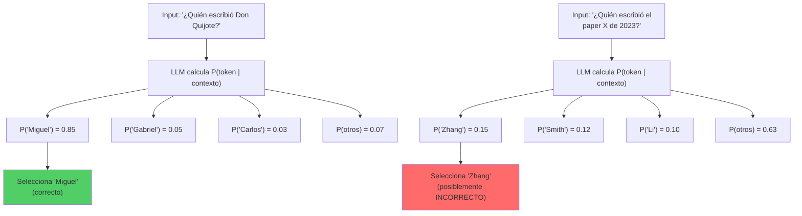
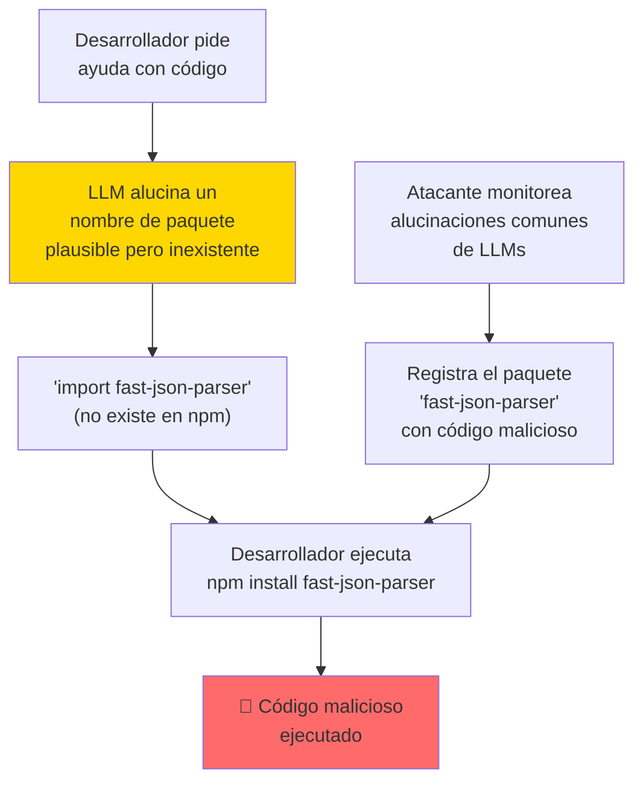
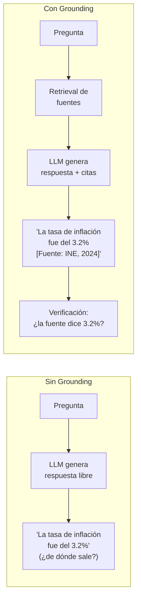
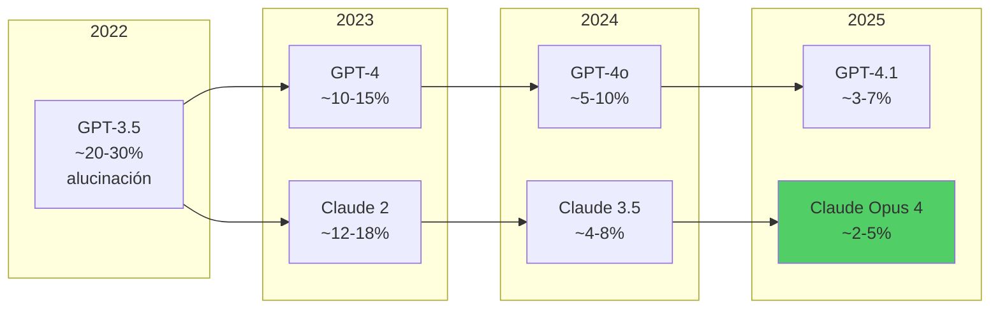
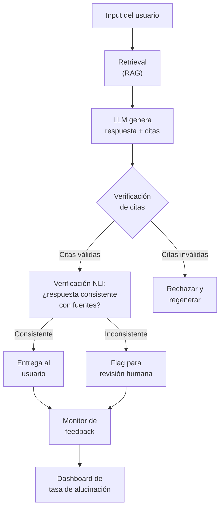

---
tags:
  - concepto
  - llm
  - seguridad
aliases:
  - alucinaciones
  - alucinaciones de LLM
  - LLM hallucinations
  - confabulation
created: 2025-06-01
updated: 2025-06-01
category: modelos-llm
status: evergreen
difficulty: intermediate
related:
  - "[[razonamiento-llm]]"
  - "[[pattern-rag]]"
  - "[[vigil-overview]]"
  - "[[slopsquatting]]"
  - "[[chain-of-thought]]"
  - "[[model-evaluation-practice]]"
  - "[[transformer-architecture]]"
up: "[[moc-llms]]"
---

# Hallucinations (Alucinaciones en LLMs)

> [!abstract] Resumen
> Las **alucinaciones** (*hallucinations*) son generaciones de un LLM que suenan plausibles pero son ==facutalmente incorrectas, internamente inconsistentes, o no fieles al contexto proporcionado==. No son un bug sino una propiedad inherente de la generación estadística de texto: el modelo produce la secuencia de tokens más probable, no la más verdadera. La tasa de alucinación varía por modelo y dominio: ==entre 3-15% en modelos frontier (2025)==, pero puede dispararse en dominios especializados. Las técnicas de mitigación incluyen RAG, verificación por cadena, y grounding — pero ==ninguna elimina completamente el problema==. La conexión con [[vigil-overview|vigil]] es directa: las dependencias alucinadas (*slopsquatting*) son un vector de ataque de seguridad real. ^resumen

## Qué es y por qué importa

Una **alucinación** (*hallucination*) de un LLM es cualquier output generado que no está soportado por la realidad, los datos de entrenamiento, o el contexto proporcionado al modelo. El término, tomado de la psicología, describe cómo ==el modelo "percibe" información que no existe==.

La importancia es crítica porque las alucinaciones:

- Erosionan la confianza en sistemas basados en LLMs
- Pueden causar daño real (información médica falsa, consejos legales incorrectos, dependencias de software inexistentes)
- Son el ==obstáculo principal para adopción empresarial== de LLMs en dominios de alta consecuencia
- Son difíciles de detectar porque el texto alucinado es lingüísticamente fluido e internamente coherente

> [!tip] Regla fundamental de producción
> - **Nunca confiar ciegamente** en el output de un LLM para hechos verificables
> - **Siempre implementar** al menos una capa de verificación para aplicaciones de producción
> - **Diseñar la UX** asumiendo que habrá alucinaciones — hacer que sean detectables y corregibles
> - Ver [[pattern-rag]] para la mitigación más común y [[model-evaluation-practice]] para métricas

---

## Por qué alucinan los LLMs

### Causa raíz: generación probabilística

Los LLMs no "saben" cosas — ==calculan distribuciones de probabilidad sobre el siguiente token==. Cuando el modelo genera "La capital de Australia es...", no consulta una base de datos: predice que "Canberra" es el token más probable dado el contexto. Esta predicción puede ser correcta (como en este caso) o incorrecta.



### Factores que causan alucinaciones

| Factor | Mecanismo | Ejemplo |
|--------|-----------|---------|
| **Distribución de entrenamiento** | El modelo no vio suficientes ejemplos de un dominio | Inventar papers académicos con autores plausibles |
| **Conflicto en datos** | Información contradictoria en el corpus de entrenamiento | Dar fechas incorrectas cuando múltiples fuentes difieren |
| **Sesgo de frecuencia** | Preferir respuestas estadísticamente comunes sobre las correctas | Decir que Sydney es capital de Australia (más famosa que Canberra) |
| **Presión de completitud** | ==El modelo prefiere generar algo a decir "no sé"== | Inventar funciones de API que no existen |
| **Compounding errors** | Errores en pasos intermedios se acumulan | Razonamiento matemático donde un error temprano invalida todo |
| **Calibración de confianza** | El modelo no distingue bien entre lo que sabe y lo que no | Afirmar hechos falsos con alta confianza |
| **Conflicto instrucción-conocimiento** | Instrucciones del usuario contradicen el conocimiento del modelo | El modelo sigue instrucciones incorrectas en lugar de corregir |

> [!danger] El peligro de la confianza calibrada
> Los LLMs están entrenados para sonar ==confiados y útiles==. Esto es problemático porque:
> - Un humano que no sabe algo duda, titubea, dice "no estoy seguro"
> - Un LLM que no sabe algo ==genera una respuesta igual de fluida que cuando sí sabe==
> - El usuario no puede distinguir respuestas fiables de alucinaciones por el tono
> - Los modelos más recientes (2025) han mejorado en decir "no sé", pero el problema persiste

---

## Taxonomía de alucinaciones

### 1. Alucinaciones factuales (*Factual hallucinations*)

El modelo genera hechos incorrectos sobre el mundo real.

> [!example]- Ejemplos de alucinaciones factuales
> ```
> ALUCINACIÓN: "Albert Einstein ganó el Premio Nobel de Física
> en 1921 por su teoría de la relatividad."
>
> REALIDAD: Einstein ganó el Nobel en 1921, pero por el efecto
> fotoeléctrico, NO por la relatividad.
>
> Análisis: El modelo mezcla dos hechos correctos (Einstein +
> Nobel 1921) con una asociación incorrecta (relatividad en
> vez de efecto fotoeléctrico). Es plausible porque la
> relatividad es la contribución más famosa de Einstein.
> ```
>
> ```
> ALUCINACIÓN: "El paper 'Attention Mechanisms for Time Series'
> de Wang et al. (2023), publicado en NeurIPS, propone..."
>
> REALIDAD: Este paper no existe. El modelo generó un título
> plausible, autores comunes en ML, y una conferencia real.
>
> Análisis: Este tipo de alucinación es especialmente peligroso
> en contextos académicos. Los investigadores pueden perder
> tiempo buscando papers que no existen.
> ```

### 2. Alucinaciones de fidelidad (*Faithfulness hallucinations*)

El modelo genera contenido que contradice o no está soportado por el contexto proporcionado.

| Subtipo | Descripción | Ejemplo |
|---------|-------------|---------|
| **Extrínseca** | Añade información no presente en el contexto | Resumen que incluye datos no mencionados en el documento original |
| **Intrínseca** | Contradice información del contexto | Decir "el informe muestra crecimiento" cuando el informe dice "decrecimiento" |
| **Fabricación** | Inventa detalles específicos (números, nombres, citas) | Generar una cita textual de un libro con palabras que el autor nunca escribió |

> [!warning] Impacto en RAG
> Las alucinaciones de fidelidad son ==especialmente problemáticas en sistemas [[pattern-rag|RAG]]==. Incluso cuando proporcionas los documentos correctos como contexto, el modelo puede:
> - Combinar información de diferentes documentos de manera incorrecta
> - Añadir "conocimiento" de su entrenamiento que contradice los documentos
> - Parafrasear de manera que cambie el significado

### 3. Alucinaciones de instrucción (*Instruction hallucinations*)

El modelo no sigue las instrucciones proporcionadas, generando contenido en formato incorrecto, idioma equivocado, o ignorando restricciones explícitas.

---

## Conexión con la seguridad: Slopsquatting

Una de las manifestaciones más peligrosas de las alucinaciones es el **slopsquatting** (*slopsquatting*)[^1], directamente conectado con [[vigil-overview|vigil]] y [[slopsquatting]].

### El mecanismo



> [!danger] Slopsquatting en números
> Investigaciones de 2024-2025 han documentado que:
> - ==~20% de los paquetes sugeridos por LLMs para ciertos lenguajes no existen==
> - Atacantes ya han registrado paquetes con nombres comúnmente alucinados
> - El problema afecta a npm, PyPI, y otros registros de paquetes
> - [[vigil-overview|Vigil]] detecta específicamente este tipo de riesgo verificando la existencia de dependencias sugeridas por LLMs

---

## Técnicas de mitigación

### 1. RAG (*Retrieval-Augmented Generation*)

La técnica más utilizada. Proporcionar al modelo información factual verificada como contexto reduce alucinaciones al ==anclar (*ground*) la generación en datos reales==.

| Aspecto | Sin RAG | Con RAG | Mejora |
|---------|---------|---------|--------|
| Alucinación factual | 15-25% | ==3-8%== | ~3x reducción |
| Fidelidad al contexto | N/A | 85-95% | Depende de calidad del retrieval |
| Latencia | Base | +200-500ms | Overhead de búsqueda |
| Complejidad | Baja | Media-Alta | Pipeline adicional |

> [!tip] RAG no elimina alucinaciones, las transforma
> Con RAG, el modelo puede seguir alucinando de dos formas:
> 1. **Alucinación sobre el contexto**: El modelo tiene los datos correctos pero los interpreta mal
> 2. **Alucinación por contexto insuficiente**: El retrieval no encontró la información relevante, y el modelo llena el hueco con invención
>
> ==La calidad del RAG depende fundamentalmente de la calidad del retrieval==. Un RAG con retrieval pobre puede ser peor que no tener RAG.

### 2. Grounding (anclaje a fuentes)

*Grounding* va más allá de RAG: requiere que el modelo ==cite explícitamente sus fuentes== y solo genere afirmaciones que pueda respaldar con citas directas.



### 3. Self-Consistency (autoconsistencia)

Generar múltiples respuestas con *temperature* > 0 y seleccionar la más consistente (voto mayoritario). Si 8 de 10 generaciones dicen lo mismo, es más probable que sea correcto.

> [!example]- Implementación de self-consistency
> ```python
> import asyncio
> from collections import Counter
>
> async def self_consistent_answer(question: str, n: int = 5) -> str:
>     """Genera n respuestas y retorna la más común."""
>     responses = await asyncio.gather(*[
>         llm.generate(
>             question,
>             temperature=0.7,  # Necesita variabilidad
>             max_tokens=500
>         )
>         for _ in range(n)
>     ])
>
>     # Extraer respuestas finales (después del razonamiento)
>     final_answers = [extract_final_answer(r) for r in responses]
>
>     # Voto mayoritario
>     counter = Counter(final_answers)
>     best_answer, count = counter.most_common(1)[0]
>
>     confidence = count / n
>     if confidence < 0.5:
>         return "No tengo suficiente confianza para responder."
>
>     return f"{best_answer} (confianza: {confidence:.0%})"
> ```

### 4. Chain-of-Verification (CoVe)

Propuesta por Dhuliawala et al. (2023)[^2], la *cadena de verificación* hace que el modelo:

1. Genere una respuesta inicial
2. Genere preguntas de verificación sobre su propia respuesta
3. Responda esas preguntas de verificación independientemente
4. Revise la respuesta original basándose en las verificaciones

==Reduce alucinaciones factuales en ~30-50% adicional sobre la línea base==.

### 5. Otras técnicas

| Técnica | Mecanismo | Efectividad | Coste |
|---------|-----------|-------------|-------|
| **Instruction tuning** | Entrenar al modelo para decir "no sé" | Moderada | En entrenamiento |
| **RLHF/DPO** | Penalizar alucinaciones durante el alignment | ==Alta== | En entrenamiento |
| **Constrained decoding** | Limitar tokens generables a un conjunto válido | Alta (dominio cerrado) | Bajo |
| **Fact-checking pipeline** | Verificar afirmaciones contra una base de conocimiento | Alta | ==Alto (latencia)== |
| **Constitutional AI** | Principios que incluyen honestidad y humildad epistémica | Moderada | En entrenamiento |
| **Fine-tuning en dominio** | Adaptar el modelo a un dominio específico con datos curados | Alta en dominio | Medio |

---

## Métodos de detección

### Detección automatizada

| Método | Cómo funciona | Limitaciones |
|--------|-------------|-------------|
| **Self-evaluation** | Pedir al mismo LLM que evalúe si su respuesta es correcta | ==El modelo tiene los mismos sesgos que causaron la alucinación== |
| **Cross-model verification** | Usar un modelo diferente para verificar | Modelos diferentes pueden compartir sesgos |
| **NLI-based** (*Natural Language Inference*) | Clasificar si la respuesta es entailment/contradiction del contexto | Requiere contexto de referencia |
| **Fact decomposition** | Descomponer en afirmaciones atómicas y verificar cada una | Lento, complejo |
| **Perplexity analysis** | Tokens con alta perplejidad son candidatos a alucinación | Muchos falsos positivos |
| **Semantic entropy** | Medir variabilidad semántica entre múltiples generaciones | ==Mejor correlación con alucinación== |

### Métricas y benchmarks de alucinación

| Benchmark | Qué evalúa | Métricas | Referencia |
|-----------|-----------|---------|------------|
| **TruthfulQA** | Veracidad en preguntas diseñadas para provocar errores comunes | % respuestas verdaderas | Lin et al., 2022[^3] |
| **HaluEval** | Detección de alucinaciones en QA, resumen, y diálogo | F1 de detección | Li et al., 2023[^4] |
| **FaithfulQA** | Fidelidad al contexto en QA extractivo | ROUGE + fidelidad humana | Varios |
| **FEVER** | Verificación de hechos contra Wikipedia | Accuracy de verificación | Thorne et al., 2018 |
| **FactScore** | Precisión factual en biografías generadas | ==% afirmaciones correctas== | Min et al., 2023 |

> [!example]- Resultados comparativos en TruthfulQA (2025)
> | Modelo | % Veraz | % Informativo | % Veraz + Informativo |
> |--------|---------|-------------|----------------------|
> | Claude Opus 4 | ==~89%== | ~92% | ==~84%== |
> | GPT-4.1 | ~86% | ~90% | ~80% |
> | Gemini 2.5 Pro | ~85% | ~91% | ~79% |
> | Llama 3.1 405B | ~78% | ~85% | ~70% |
> | Mistral Large | ~75% | ~83% | ~67% |
>
> Nota: TruthfulQA está diseñado para provocar errores comunes. Las tasas de veracidad en preguntas generales son significativamente más altas.

---

## Impacto en el mundo real: casos famosos

> [!quote] "Hallucination is not a bug, it's a feature — the same mechanism that allows creative generation also causes factual errors." — Sam Altman (paráfrasis)

### Casos documentados

1. **Avianca vs. Mata (2023)**: Un abogado de Nueva York usó ChatGPT para preparar un caso legal. ==El modelo inventó 6 casos jurídicos que no existían==, con citas de jueces reales, tribunales reales, y razonamientos legales plausibles. El abogado fue sancionado por el tribunal.

2. **Google Bard y el telescopio Webb (2023)**: En la demo de lanzamiento de Bard, el modelo afirmó incorrectamente que el telescopio James Webb tomó las primeras fotografías de un exoplaneta. ==La acción de Google cayó ~$100 mil millones en capitalización de mercado== parcialmente por este error.

3. **Alucinaciones médicas**: Múltiples estudios han documentado que LLMs inventan nombres de medicamentos, dosis incorrectas, y contraindicaciones falsas cuando se les pregunta sobre temas médicos fuera de su distribución de entrenamiento.

4. **Dependencias de código inventadas**: El fenómeno de [[slopsquatting]] donde modelos sugieren bibliotecas de software que no existen, creando vectores de ataque para supply chain attacks.

> [!failure] Patrón común en los fallos
> En todos estos casos, el patrón es el mismo:
> 1. El usuario asumió que el modelo era fiable
> 2. El output era lingüísticamente perfecto y sonaba autoritativo
> 3. ==No hubo verificación humana o automatizada==
> 4. Las consecuencias fueron reales y medibles

---

## Evolución de las tasas de alucinación



> [!info] La mejora es real pero asintótica
> Las tasas de alucinación han mejorado significativamente, pero ==la mejora sigue una curva logarítmica==. Pasar de 20% a 10% fue "fácil" (mejores datos, RLHF). Pasar de 5% a 2% requiere técnicas fundamentalmente nuevas. ==Llegar a 0% probablemente sea imposible con la arquitectura actual de generación autoregresiva==.

---

## Estrategias de diseño defensivo

### Principios para aplicaciones en producción

> [!success] Mejores prácticas
> 1. **Citar siempre fuentes**: Diseñar el prompt para que el modelo cite de dónde obtiene cada afirmación
> 2. **Degradación elegante**: Cuando el modelo no está seguro, ==es mejor "no sé" que una alucinación==
> 3. **Verificación en capas**: Combinar RAG + self-consistency + verificación humana para dominios críticos
> 4. **UX honesta**: Mostrar indicadores de confianza al usuario. No presentar el output del LLM como "verdad"
> 5. **Dominio cerrado**: Restringir las respuestas al dominio de los documentos proporcionados reduce drásticamente las alucinaciones
> 6. **Monitoreo continuo**: Implementar detección de alucinaciones en producción y alertar cuando la tasa sube

### Arquitectura defensiva



---

## Estado del arte (2025-2026)

### Tendencias de investigación

1. **Semantic entropy**: Medir la entropía semántica (no léxica) entre múltiples generaciones como predictor de alucinación[^5]. ==Mejor método automatizado de detección actualmente==
2. **Representation engineering**: Identificar y modificar las representaciones internas del modelo que corresponden a "certeza" vs "incertidumbre"
3. **Process supervision**: Entrenar modelos con feedback en cada paso del razonamiento, no solo en la respuesta final, para reducir alucinaciones en cadenas de razonamiento
4. **Retrieval-augmented training**: Entrenar modelos que aprenden a buscar información durante la generación, no solo como augmentation en inferencia
5. **Constitutional approaches**: Entrenar modelos con principios de honestidad epistémica explícitos

> [!question] ¿Serán las alucinaciones un problema resuelto?
> - **Optimistas**: Con mejor entrenamiento (RLHF más preciso, datos curados), mejores arquitecturas (retrieval integrado), y mejor verificación, las alucinaciones se reducirán a niveles aceptables (<1%) para la mayoría de aplicaciones
> - **Escépticos**: La generación autoregresiva es inherentemente probabilística. Mientras el modelo genere token a token basándose en probabilidades, ==siempre habrá una tasa base de alucinación irremediable==. Solo sistemas con verificación formal pueden garantizar corrección
> - **Mi valoración**: Las alucinaciones se manejarán como se manejan los bugs en software: nunca se eliminarán completamente, pero se reducirán a niveles aceptables con capas de defensa (testing, verificación, monitoreo). ==El diseño de sistemas que asumen alucinaciones y las detectan es más pragmático que buscar su eliminación total==

---

## Relación con el ecosistema

> [!info] Conexiones con mis herramientas
> - **[[intake-overview|intake]]**: *Intake* debe validar que las especificaciones generadas sean consistentes con el input del usuario. Un sistema de verificación de fidelidad es esencial para evitar que requisitos alucinados contaminen el proceso de desarrollo
> - **[[architect-overview|architect]]**: El *Ralph loop* de *architect* incluye revisión iterativa que actúa como mecanismo de detección de alucinaciones — cada iteración puede detectar inconsistencias generadas en la anterior
> - **[[vigil-overview|vigil]]**: ==Vigil es directamente un detector de alucinaciones para dependencias de software==. Su función principal — verificar que las dependencias sugeridas por LLMs realmente existen y son seguras — es una aplicación concreta de detección de alucinaciones en el dominio de supply chain
> - **[[licit-overview|licit]]**: Las alucinaciones en análisis de compliance pueden tener consecuencias legales graves. *Licit* necesita las técnicas de mitigación más agresivas: RAG con documentos legales oficiales, verificación cruzada, y flags para revisión humana obligatoria

---

## Enlaces y referencias

**Notas relacionadas:**
- [[razonamiento-llm]] — Los modelos de razonamiento alucinan de manera diferente (con más confianza)
- [[pattern-rag]] — Técnica principal de mitigación
- [[slopsquatting]] — Alucinaciones como vector de ataque de seguridad
- [[vigil-overview]] — Detección de dependencias alucinadas
- [[model-evaluation-practice]] — Cómo medir tasas de alucinación
- [[chain-of-thought]] — CoT puede reducir O amplificar alucinaciones
- [[context-window]] — Más contexto puede aumentar alucinaciones de fidelidad

> [!quote]- Referencias bibliográficas
> - Huang et al., "A Survey on Hallucination in Large Language Models", ACL 2024
> - Dhuliawala et al., "Chain-of-Verification Reduces Hallucination in Large Language Models", 2023
> - Lin et al., "TruthfulQA: Measuring How Models Mimic Human Falsehoods", ACL 2022
> - Li et al., "HaluEval: A Large-Scale Hallucination Evaluation Benchmark", EMNLP 2023
> - Kuhn et al., "Semantic Uncertainty: Linguistic Invariances for Uncertainty Estimation in NLG", ICLR 2023
> - Min et al., "FActScore: Fine-grained Atomic Evaluation of Factual Precision", EMNLP 2023
> - Lanyado, B., "Can LLMs Generate Code with Non-Existent Packages?", Vulcan Cyber Research, 2024

[^1]: Lanyado, B., "Can LLMs Generate Code with Non-Existent Packages?", Vulcan Cyber Research, 2024. Investigación original sobre slopsquatting y dependencias alucinadas.
[^2]: Dhuliawala et al., "Chain-of-Verification Reduces Hallucination in Large Language Models", arXiv:2309.11495, 2023.
[^3]: Lin et al., "TruthfulQA: Measuring How Models Mimic Human Falsehoods", ACL 2022.
[^4]: Li et al., "HaluEval: A Large-Scale Hallucination Evaluation Benchmark for Large Language Models", EMNLP 2023.
[^5]: Kuhn et al., "Semantic Uncertainty: Linguistic Invariances for Uncertainty Estimation in Natural Language Generation", ICLR 2023. Propone semantic entropy como detector de alucinaciones.
