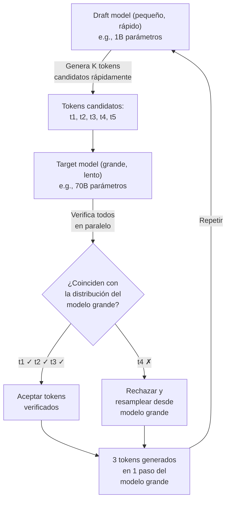
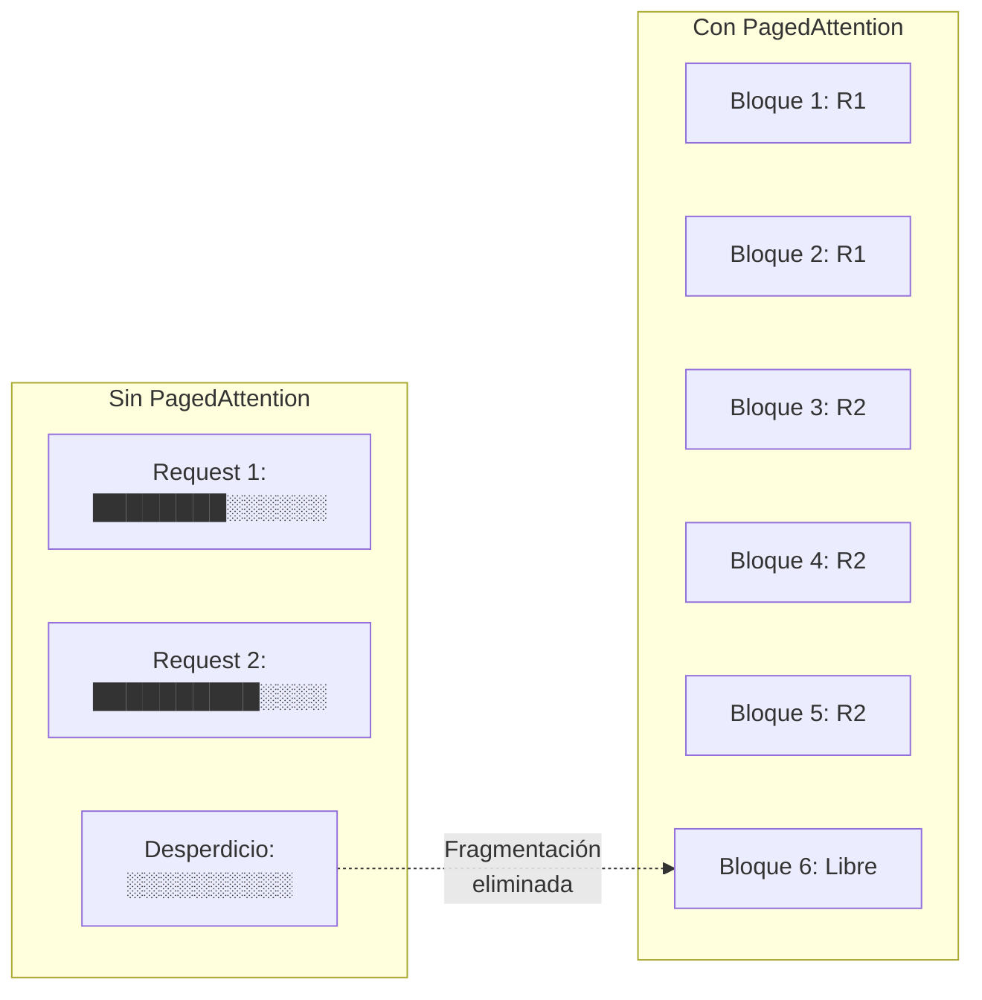
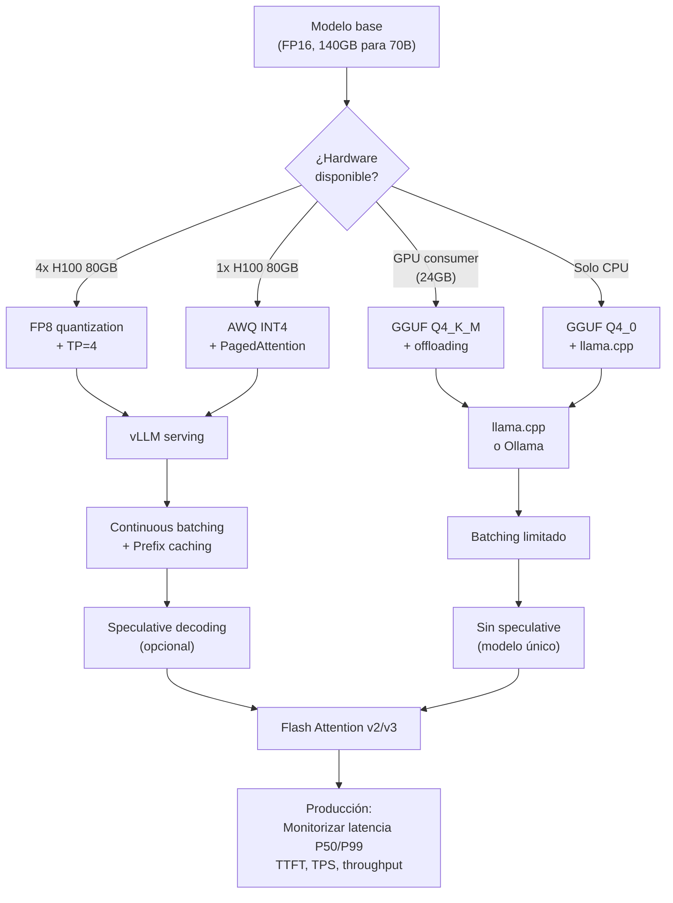

---
tags:
  - concepto
  - llm
  - inference
aliases:
  - optimización de inferencia
  - LLM serving optimization
  - serving LLMs
created: 2025-06-01
updated: 2025-06-01
category: inference
status: current
difficulty: advanced
related:
  - "[[context-window]]"
  - "[[transformer-architecture]]"
  - "[[pricing-llm-apis]]"
  - "[[model-serving]]"
  - "[[llm-routers]]"
  - "[[quantization-deep-dive]]"
  - "[[hardware-ia]]"
up: "[[moc-llms]]"
---

# Inference Optimization

> [!abstract] Resumen
> La optimización de inferencia en LLMs es el conjunto de técnicas que permiten servir modelos grandes de manera eficiente en producción. Cubre desde ==KV-cache para evitar recalcular atención==, hasta ==cuantización para reducir memoria 4x sin pérdida significativa de calidad==, pasando por *speculative decoding*, *continuous batching*, y *Flash Attention*. Sin estas optimizaciones, servir un modelo de 70B parámetros requeriría hardware prohibitivamente caro. ==La diferencia entre una implementación naive y una optimizada puede ser de 10-50x en throughput y coste==. ^resumen

## Qué es y por qué importa

La **optimización de inferencia** (*inference optimization*) comprende todas las técnicas para hacer que la generación de texto por un LLM sea más rápida, más barata y más eficiente en uso de memoria. A diferencia del entrenamiento (que ocurre una vez), la inferencia se ejecuta ==millones de veces en producción==, por lo que cada milisegundo y cada megabyte cuentan.

El pipeline de inferencia de un LLM tiene dos fases fundamentales:

1. **Prefill** (*prompt processing*): Procesar todos los tokens de entrada en paralelo. Limitado por computación (*compute-bound*).
2. **Decode** (*token generation*): Generar tokens uno a uno, de manera autoregresiva. Limitado por acceso a memoria (*memory-bound*).

> [!tip] Regla fundamental
> - **Prefill**: Optimizar computación (FLOPS). Técnicas: *Flash Attention*, *tensor parallelism*
> - **Decode**: Optimizar ancho de banda de memoria. Técnicas: *KV-cache*, cuantización, *speculative decoding*
> - Ver [[model-serving]] para aspectos de infraestructura de despliegue

---

## KV-Cache: la optimización fundamental

### Cómo funciona

En la generación autoregresiva, cada nuevo token necesita atender a todos los tokens previos. Sin optimización, generar el token N requiere recalcular las matrices K (*Key*) y V (*Value*) de todos los N-1 tokens anteriores.

El *KV-cache* almacena las matrices K y V de todos los tokens ya procesados, evitando recalcularlas en cada paso de decodificación.

> [!example]- Diagrama de KV-cache
> ```mermaid
> sequenceDiagram
>     participant P as Prompt (Prefill)
>     participant C as KV-Cache
>     participant D as Decode
>
>     P->>C: Calcular K,V para todos los tokens del prompt
>     Note over C: Almacenar K,V matrices<br/>para cada capa y cabeza
>
>     loop Para cada token generado
>         D->>C: Leer K,V de tokens previos
>         D->>D: Calcular Q para nuevo token
>         D->>D: Attention(Q, K_cached, V_cached)
>         D->>C: Añadir K,V del nuevo token al cache
>         D->>D: Generar siguiente token
>     end
> ```

### Impacto en memoria

El tamaño del KV-cache para un modelo con L capas, H cabezas de atención, dimensión D por cabeza, y secuencia de longitud S:

==Memoria KV-cache = 2 × L × H × D × S × bytes_por_elemento==

Para un modelo como Llama 3 70B con 80 capas, 64 cabezas, dimensión 128, secuencia de 128K tokens en FP16:

> 2 × 80 × 64 × 128 × 128,000 × 2 bytes = ==**~42 GB** solo para el KV-cache de un único request==

> [!danger] Cuello de botella en producción
> El KV-cache es a menudo el factor limitante en el número de requests concurrentes que puede manejar un servidor. Un servidor con 80 GB de GPU RAM que dedica 30 GB al modelo solo tiene 50 GB para KV-caches, limitándolo a ~1 request concurrente con contexto de 128K. Esto es lo que motivó técnicas como *PagedAttention* y *Multi-Query Attention*.

### Optimizaciones del KV-cache

| Técnica | Reducción de memoria | Mecanismo |
|---------|---------------------|-----------|
| *Multi-Query Attention* (MQA) | ==8-64x== | Todas las cabezas comparten un único K,V |
| *Grouped-Query Attention* (GQA) | 4-8x | Grupos de cabezas comparten K,V |
| *KV-cache quantization* | 2-4x | Cuantizar K,V a INT8 o INT4 |
| *PagedAttention* (vLLM) | Variable | Gestión dinámica tipo paginación de SO |
| *Sliding window cache* | Fijo | Solo mantener las últimas W posiciones |
| *Token merging/pruning* | Variable | Eliminar tokens poco relevantes del cache |

---

## Cuantización: menos bits, mismo rendimiento

La *cuantización* (*quantization*) reduce la precisión numérica de los pesos del modelo de FP16/BF16 (16 bits) a formatos de menor precisión como INT8, INT4 o incluso INT2.

### Fundamento

La mayoría de los pesos de un LLM no necesitan la precisión completa de 16 bits. La distribución de pesos típica tiene una concentración alta alrededor de cero con pocos valores atípicos (*outliers*). La cuantización explota esto para comprimir los pesos.

> [!example]- Distribución típica de pesos
> ```
> Distribución de pesos en una capa típica:
>
>      ████
>     ██████
>    ████████
>   ██████████          █  (outliers)
>  ████████████    █
> ████████████████████████████
> ─────────────────────────────
>        -2   -1    0    1    2    3
>
> ~95% de los pesos están en [-1, 1]
> Cuantizar a INT4 (16 niveles) captura bien esta distribución
> Los outliers requieren manejo especial
> ```

### Comparativa de métodos de cuantización

| Método | Bits | Requiere calibración | Formato | Velocidad | Calidad vs FP16 | Mejor para |
|--------|------|---------------------|---------|-----------|-----------------|------------|
| **FP16/BF16** | 16 | No | Nativo | Baseline | 100% | Referencia |
| **FP8** | 8 | Mínima | Nativo (H100+) | ==1.5-2x más rápido== | ~99.5% | Producción en H100 |
| **INT8 (absmax)** | 8 | No | Entero | 1.5x | ~99% | Despliegue rápido |
| **GPTQ** | 4/3/2 | ==Sí (datos)==  | Entero | 2-3x | ~97-98% (4-bit) | GPU con poca VRAM |
| **AWQ** | 4 | Sí (datos) | Entero | 2-3x | ==~98%== | ==Mejor calidad en 4-bit== |
| **GGUF** | 2-8 | Sí | Mixto | 2-4x | Variable | ==CPU + GPU (llama.cpp)== |
| **GGML** | 4-8 | Sí | Mixto | 2-3x | ~96-97% | Legacy (reemplazado por GGUF) |
| **SqueezeLLM** | 3-4 | Sí | Sparse + Dense | 2-3x | ~97% | Investigación |
| **QuIP#** | 2 | Sí | Lattice | Variable | ~94-95% | Compresión extrema |

> [!info] Guía práctica de selección
> - **Producción con H100/H200**: ==FP8 es la opción predeterminada== — soporte nativo, mínima pérdida
> - **GPU consumer (RTX 4090, 24GB)**: AWQ 4-bit para modelos de 70B
> - **CPU o hardware mixto**: GGUF con *llama.cpp*, permite offloading parcial a GPU
> - **Máxima calidad**: GPTQ o AWQ con calibración cuidadosa
> - **Experimentación local**: GGUF Q4_K_M es el sweet spot entre calidad y tamaño

### GPTQ vs AWQ: diferencias clave

**GPTQ** (*Generative Pre-trained Transformer Quantization*)[^1] cuantiza los pesos minimizando el error de reconstrucción capa por capa usando la inversa del Hessiano. Es el método más establecido.

**AWQ** (*Activation-aware Weight Quantization*)[^2] observa que ==no todos los pesos son igualmente importantes==. Los pesos conectados a canales de activación con magnitudes altas son más críticos. AWQ protege estos pesos escalándolos antes de cuantizar.

> [!success] AWQ suele superar a GPTQ
> En benchmarks comparativos, AWQ muestra consistentemente mejor perplejidad que GPTQ al mismo nivel de bits, especialmente en modelos grandes (>30B parámetros). La diferencia es más notable en tareas de razonamiento complejo.

---

## Speculative Decoding

La *decodificación especulativa* (*speculative decoding*)[^3] es una técnica que acelera la generación sin cambiar la distribución de salida del modelo. Utiliza un modelo pequeño y rápido (*draft model*) para generar candidatos que el modelo grande verifica en paralelo.

### Mecanismo



### Por qué funciona

La clave es que ==la verificación de K tokens por el modelo grande cuesta casi lo mismo que generar 1 token==, porque la fase de *prefill* procesa tokens en paralelo. Si el modelo draft acierta frecuentemente (típicamente 60-80% de las veces), el resultado neto es una aceleración de 2-3x.

> [!warning] Condiciones para que sea efectivo
> - El modelo *draft* debe ser ==significativamente más rápido== que el target (al menos 5-10x)
> - La tasa de aceptación debe ser alta (>50%). Esto requiere que el draft model sea razonablemente bueno
> - Funciona mejor en texto predecible (prosa, código repetitivo) que en texto creativo
> - La distribución de salida es ==matemáticamente idéntica== al modelo grande — no hay pérdida de calidad

### Variantes

| Variante | Mecanismo | Ventaja |
|----------|-----------|---------|
| *Speculative decoding* clásico | Modelo draft externo | General |
| *Self-speculative* | Capas tempranas del mismo modelo | Sin modelo extra |
| *Medusa* | Cabezas adicionales entrenadas | ==Mayor tasa de aceptación== |
| *Eagle* | Draft model con features del target | Mayor tasa aceptación |
| *Lookahead decoding* | N-gramas del Jacobi iteration | Sin modelo draft |

---

## Continuous Batching y PagedAttention (vLLM)

### El problema del batching estático

En *batching* estático tradicional, un batch de requests se procesa junto y no se libera hasta que todos terminan. Si un request genera 10 tokens y otro 500, el primero desperdicia GPU durante 490 pasos de decodificación.

### Continuous Batching

El *continuous batching* (también llamado *iteration-level batching* o *in-flight batching*) permite ==insertar nuevos requests y retirar requests completados en cada paso de decodificación==.

> [!example]- Comparación visual de batching
> ```
> BATCHING ESTÁTICO:
> Request A: ████████░░░░░░░░░░░░  (termina pronto, espera)
> Request B: ████████████████████  (largo)
> Request C: ████████████░░░░░░░░  (medio, espera)
> Throughput: Bajo (GPU ociosa en los ░)
>
> CONTINUOUS BATCHING:
> Request A: ████████
> Request D:         ████████████  (entra cuando A sale)
> Request B: ████████████████████
> Request C: ████████████
> Request E:             ████████  (entra cuando C sale)
> Throughput: Alto (GPU siempre ocupada)
> ```

### PagedAttention (vLLM)

*PagedAttention*[^4] es la innovación clave de [[vllm|vLLM]]. Aplica el concepto de memoria paginada de los sistemas operativos al KV-cache:

- El KV-cache se divide en bloques (*pages*) de tamaño fijo
- Los bloques se asignan dinámicamente, no contiguamente
- Una tabla de páginas traduce posiciones lógicas a físicas
- ==Elimina la fragmentación de memoria que desperdicia 60-80% del KV-cache en implementaciones naive==



> [!success] Impacto de vLLM en producción
> - ==Throughput 2-4x mayor== que implementaciones HuggingFace naive
> - Soporte para continuous batching nativo
> - Prefix caching para prompts compartidos
> - Compatible con la mayoría de modelos en HuggingFace
> - Se ha convertido en el ==estándar de facto para serving de LLMs open-source==

---

## Flash Attention

*Flash Attention*[^5] es una optimización de la capa de atención que reduce drásticamente el uso de memoria y acelera el cálculo aprovechando la jerarquía de memoria de las GPUs.

### El problema

La atención estándar materializa la matriz completa de atención (N×N) en memoria HBM (*High Bandwidth Memory*), que es lenta. Flash Attention nunca materializa esta matriz completa — realiza el cálculo por bloques usando la SRAM (*Static RAM*) del chip, que es ==10-100x más rápida== pero mucho más pequeña.

### Versiones

| Versión | Año | Mejora clave | Speedup vs estándar |
|---------|-----|-------------|---------------------|
| Flash Attention v1 | 2022 | Tiling + recompute | 2-4x |
| Flash Attention v2 | 2023 | Mejor paralelismo, menor overhead | ==5-9x== |
| Flash Attention v3 | 2024 | Optimización para H100, FP8 | 1.5-2x sobre v2 en H100 |

> [!tip] Flash Attention es transparente
> No cambia el resultado del cálculo — la salida es ==bit-identical== a la atención estándar. Es puramente una optimización de implementación. Todos los frameworks modernos (PyTorch 2.0+, JAX) lo incluyen como opción predeterminada.

---

## Consideraciones de hardware

### Métricas clave para serving de LLMs

| Métrica | Qué mide | Por qué importa |
|---------|----------|-----------------|
| **VRAM** | Memoria GPU total | Determina qué modelos caben |
| **Memory bandwidth** | GB/s de acceso a memoria | ==Bottleneck en decode== |
| **TFLOPS** | Operaciones por segundo | Bottleneck en prefill |
| **Interconnect** | Ancho de banda entre GPUs | Crítico para tensor parallelism |

### Comparativa de GPUs para inferencia (2025)

| GPU | VRAM | Bandwidth | FP16 TFLOPS | Precio/hora (cloud) | Mejor para |
|-----|------|-----------|-------------|---------------------|------------|
| NVIDIA H100 SXM | 80 GB | 3.35 TB/s | 990 | ~$3.50 | ==Producción estándar== |
| NVIDIA H200 | 141 GB | 4.8 TB/s | 990 | ~$4.50 | Modelos grandes, contexto largo |
| NVIDIA B200 | 192 GB | 8 TB/s | 2,250 | ~$6.00 | ==Máximo rendimiento== |
| NVIDIA A100 80GB | 80 GB | 2.0 TB/s | 312 | ~$2.00 | Coste-efectivo |
| AMD MI300X | 192 GB | 5.3 TB/s | 1,307 | ~$3.00 | Alternativa competitiva |
| Apple M4 Ultra | 192 GB | 819 GB/s | ~30 | Local | Desarrollo local |

> [!warning] Tensor Parallelism y su coste
> Para modelos que no caben en una GPU, se usa *tensor parallelism* (TP) para distribuir el modelo entre múltiples GPUs. Sin embargo, ==cada paso de decodificación requiere comunicación all-reduce entre GPUs==, lo que introduce latencia. TP=2 no duplica el throughput — típicamente da 1.5-1.8x por la overhead de comunicación.

---

## Pipeline completo de optimización



> [!example]- Ejemplo: servir Llama 3 70B en diferentes configuraciones
> | Configuración | Hardware | Quantización | Framework | Throughput estimado | Latencia P50 |
> |---------------|----------|-------------|-----------|--------------------|--------------|
> | Premium | 4x H100 | FP8 | vLLM, TP=4 | ==~2000 tok/s== | ~15ms/tok |
> | Estándar | 2x H100 | FP8 | vLLM, TP=2 | ~1200 tok/s | ~25ms/tok |
> | Económica | 1x H100 | AWQ INT4 | vLLM | ~800 tok/s | ~35ms/tok |
> | Consumer | 2x RTX 4090 | GPTQ INT4 | vLLM, TP=2 | ~200 tok/s | ~80ms/tok |
> | Local | M4 Ultra | GGUF Q4_K_M | llama.cpp | ~40 tok/s | ~200ms/tok |
> | CPU only | 64 cores | GGUF Q4_0 | llama.cpp | ~5 tok/s | ~2s/tok |

---

## Estado del arte (2025-2026)

### Tendencias emergentes

1. **FP8 como estándar**: Con H100/B200, FP8 ofrece la mejor relación calidad/rendimiento sin calibración compleja
2. **KV-cache compression**: Técnicas como *Scissorhands* y *H2O* que podan tokens poco importantes del cache
3. **Disaggregated serving**: Separar prefill y decode en diferentes pools de GPUs optimizadas para cada fase
4. **Speculative decoding generalizado**: Modelos diseñados con draft heads integrados (Medusa, Eagle-2)
5. **Modelos Mixture-of-Experts (MoE)**: Activan solo una fracción de los parámetros por token, ==reduciendo compute 2-8x== manteniendo capacidad total

> [!question] ¿Será la cuantización a 1-bit viable?
> - **Investigación activa**: BitNet y OneBit muestran que modelos entrenados nativamente en 1-bit pueden funcionar sorprendentemente bien
> - **Escépticos**: La cuantización post-entrenamiento a 1-bit destruye calidad. Solo funciona si el modelo se entrena así desde cero, lo cual requiere inversión masiva
> - **Mi valoración**: Los modelos ternarios (-1, 0, 1) podrían ser viables para modelos pequeños especializados, pero los modelos frontier seguirán necesitando al menos 4 bits por peso en el futuro cercano

---

## Relación con el ecosistema

> [!info] Conexiones con mis herramientas
> - **[[intake-overview|intake]]**: La selección de cuantización y framework de serving afecta directamente la latencia percibida por el usuario de *intake*. Para uso interactivo, priorizar TTFT (*Time to First Token*) sobre throughput
> - **[[architect-overview|architect]]**: Los loops iterativos de *architect* multiplican el número de llamadas al LLM. Cada optimización de inferencia se amplifica por el número de iteraciones del *Ralph loop*. ==Speculative decoding es especialmente beneficioso aquí==
> - **[[vigil-overview|vigil]]**: *Vigil* puede usar modelos cuantizados locales para escaneo rápido de dependencias, reservando modelos de alta calidad para análisis profundos. Un pipeline escalonado optimiza coste
> - **[[licit-overview|licit]]**: El análisis de compliance requiere alta calidad de razonamiento — no es buen candidato para cuantización agresiva. Preferir FP8 o FP16 para evitar [[hallucinations|alucinaciones]] en contextos legales

---

## Enlaces y referencias

**Notas relacionadas:**
- [[context-window]] — El KV-cache escala con la ventana de contexto
- [[transformer-architecture]] — Arquitectura base optimizada
- [[model-serving]] — Infraestructura de despliegue
- [[pricing-llm-apis]] — Cómo las optimizaciones reducen costes
- [[vllm|vLLM]] — Framework de serving con PagedAttention
- [[llm-routers]] — Routing inteligente entre modelos optimizados

> [!quote]- Referencias bibliográficas
> - Frantar et al., "GPTQ: Accurate Post-Training Quantization for Generative Pre-trained Transformers", ICLR 2023
> - Lin et al., "AWQ: Activation-aware Weight Quantization for LLM Compression and Acceleration", MLSys 2024
> - Leviathan et al., "Fast Inference from Transformers via Speculative Decoding", ICML 2023
> - Kwon et al., "Efficient Memory Management for Large Language Model Serving with PagedAttention", SOSP 2023
> - Dao et al., "FlashAttention: Fast and Memory-Efficient Exact Attention with IO-Awareness", NeurIPS 2022
> - Dao, "FlashAttention-2: Faster Attention with Better Parallelism and Work Partitioning", 2023
> - Shah et al., "FlashAttention-3: Fast and Accurate Attention with Asynchrony and Low-precision", 2024

[^1]: Frantar et al., "GPTQ: Accurate Post-Training Quantization for Generative Pre-trained Transformers", ICLR 2023.
[^2]: Lin et al., "AWQ: Activation-aware Weight Quantization for LLM Compression and Acceleration", MLSys 2024.
[^3]: Leviathan et al., "Fast Inference from Transformers via Speculative Decoding", ICML 2023. También: Chen et al., "Accelerating Large Language Model Decoding with Speculative Sampling", 2023.
[^4]: Kwon et al., "Efficient Memory Management for Large Language Model Serving with PagedAttention", SOSP 2023.
[^5]: Dao et al., "FlashAttention: Fast and Memory-Efficient Exact Attention with IO-Awareness", NeurIPS 2022.
