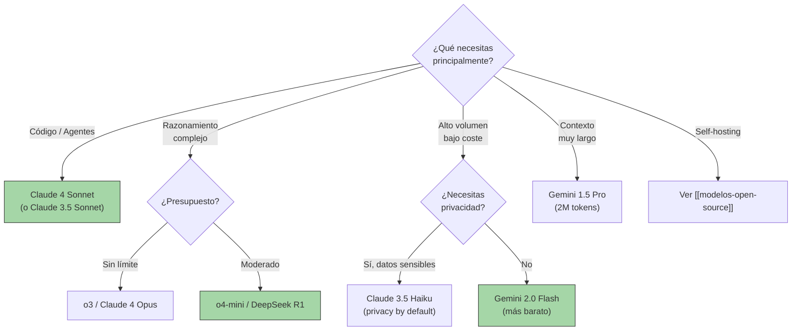

---
tags:
  - concepto
  - llm
  - comparativa
aliases:
  - landscape de modelos
  - comparativa de LLMs
  - LLM comparison
  - modelos disponibles
created: 2025-06-01
updated: 2025-06-01
category: modelos-llm
status: volatile
difficulty: intermediate
related:
  - "[[que-son-llms]]"
  - "[[arquitecturas-llm]]"
  - "[[modelos-open-source]]"
  - "[[modelos-propietarios]]"
  - "[[decision-modelo-llm]]"
  - "[[pricing-llm-apis]]"
up: "[[moc-llms]]"
---

# Landscape de Modelos LLM

> [!abstract] Resumen
> Comparativa exhaustiva de todos los modelos LLM relevantes a fecha de 2025. Cubre OpenAI, Anthropic, Google, Meta, Mistral, y proveedores emergentes. ==El mercado se ha fragmentado en tres tiers: modelos frontier (~$15/M tokens output), modelos eficientes (~$1-3/M tokens), y modelos ultrabaratos (<$0.50/M tokens)==. La elección correcta depende del caso de uso, no del benchmark más alto. ^resumen

> [!warning] Última verificación: 2025-06-01
> ==Los precios, features y benchmarks cambian mensualmente==. Esta nota es inherentemente volátil. Verifica datos de pricing directamente con los proveedores antes de tomar decisiones de producción. Los benchmarks reportados son los publicados por los proveedores y evaluaciones independientes de Chatbot Arena (LMSYS).

---

## Criterios de evaluación

| Criterio | Peso | Qué se evalúa |
|---|---|---|
| Calidad de razonamiento | Alto | MMLU, GPQA, benchmarks de razonamiento |
| Código | Alto | HumanEval, SWE-bench, LiveCodeBench |
| Precio | Alto | $/M tokens input y output |
| Velocidad | Medio | Tokens/segundo, TTFT |
| Contexto | Medio | Ventana máxima real (no solo teórica) |
| Multimodalidad | Medio | Imagen, audio, video, herramientas |
| Disponibilidad | Medio | SLA, rate limits, regiones |
| Privacidad | Alto | Retención de datos, training on data |

---

## OpenAI

### Modelos disponibles

| Modelo | Contexto | Input $/M | Output $/M | Velocidad | Lanzamiento |
|---|---|---|---|---|---|
| GPT-4o | 128K | $2.50 | $10.00 | ~100 tok/s | May 2024 |
| GPT-4o mini | 128K | $0.15 | $0.60 | ~130 tok/s | Jul 2024 |
| GPT-4 Turbo | 128K | $10.00 | $30.00 | ~40 tok/s | Nov 2023 |
| o1 | 200K | $15.00 | $60.00 | ~30 tok/s* | Sep 2024 |
| o1-mini | 128K | $3.00 | $12.00 | ~60 tok/s* | Sep 2024 |
| o3 | 200K | $10.00 | $40.00 | ~20 tok/s* | Ene 2025 |
| ==o3-mini== | 200K | ==$1.10== | ==$4.40== | ~80 tok/s* | Ene 2025 |
| o4-mini | 200K | $1.10 | $4.40 | ~90 tok/s* | Abr 2025 |

*Velocidad aparente — los modelos de razonamiento (o-series) usan tokens internos de "pensamiento" que no se cuentan en output pero consumen tiempo y compute.

> [!tip] Recomendación por caso de uso (OpenAI)
> - **Uso general / chat**: GPT-4o (mejor relación calidad/precio en su tier)
> - **Alto volumen / bajo coste**: GPT-4o mini (==el modelo más rentable de OpenAI==)
> - **Razonamiento complejo**: o3 (matemáticas, ciencia, lógica formal)
> - **Código con razonamiento**: o4-mini (optimizado para código, más barato que o3)
> - **Evitar**: GPT-4 Turbo (superseded por GPT-4o, más caro y más lento)

> [!success] Fortalezas de OpenAI
> - Ecosistema más maduro (API, playground, assistants, fine-tuning)
> - Mejor function calling del mercado
> - Modelos de razonamiento líderes (o-series)
> - Batch API con 50% descuento

> [!failure] Debilidades de OpenAI
> - Precios premium en modelos frontier
> - No hay modelo open-source/open-weights
> - Retención de datos 30 días por defecto (ZDR disponible para enterprise)
> - Rate limits restrictivos en tier free/básico

### Benchmarks clave (OpenAI)

| Benchmark | GPT-4o | o1 | o3 | o3-mini | o4-mini |
|---|---|---|---|---|---|
| MMLU | 88.7% | 92.3% | ==96.7%== | 90.0% | 93.4% |
| GPQA Diamond | 53.6% | 78.0% | ==87.7%== | 70.2% | 81.4% |
| HumanEval | 90.2% | 92.4% | 95.1% | 89.4% | ==96.3%== |
| SWE-bench Verified | 33.2% | 48.9% | ==71.7%== | 49.3% | 68.1% |
| MATH | 76.6% | 94.8% | ==96.7%== | 90.0% | 93.4% |

---

## Anthropic

### Modelos disponibles

| Modelo | Contexto | Input $/M | Output $/M | Velocidad | Lanzamiento |
|---|---|---|---|---|---|
| Claude 3.5 Haiku | 200K | $0.80 | $4.00 | ~150 tok/s | Oct 2024 |
| ==Claude 3.5 Sonnet== | 200K | ==$3.00== | ==$15.00== | ~90 tok/s | Jun 2024 |
| Claude 3 Opus | 200K | $15.00 | $75.00 | ~40 tok/s | Mar 2024 |
| Claude 4 Sonnet | 200K | $3.00 | $15.00 | ~90 tok/s | May 2025 |
| ==Claude 4 Opus== | 200K | ==$15.00== | ==$75.00== | ~40 tok/s | May 2025 |

> [!info] Extended Thinking
> Claude 3.5 Sonnet y Claude 4+ soportan *extended thinking*, donde el modelo usa tokens internos de razonamiento similares a la o-series de OpenAI. Los tokens de pensamiento se cobran a tarifa de output. ==Esto hace que Claude sea competitivo con o1/o3 en tareas de razonamiento cuando se activa extended thinking==.

> [!tip] Recomendación por caso de uso (Anthropic)
> - **Código / agentes**: Claude 4 Sonnet (==mejor modelo para coding agents según SWE-bench==)
> - **Razonamiento profundo**: Claude 4 Opus con extended thinking
> - **Alto volumen**: Claude 3.5 Haiku (mejor ratio calidad/precio del mercado para muchas tareas)
> - **Análisis de documentos largos**: cualquier modelo Claude (200K contexto real, no degradado)

> [!success] Fortalezas de Anthropic
> - ==200K tokens de contexto real con retrieval de alta calidad (needle-in-haystack >99%)==
> - Mejor rendimiento en coding/agent tasks
> - Constitutional AI: menor tendencia a outputs dañinos
> - Políticas de privacidad fuertes (no entrena con datos de API por defecto)
> - Prompt caching (ahorra hasta 90% en prompts repetitivos)
> - Computer use y tool use nativos

> [!failure] Debilidades de Anthropic
> - Menos modelos disponibles que OpenAI (sin tier ultra-barato sub-$0.50)
> - Fine-tuning limitado (solo disponible para enterprise)
> - Sin modelos open-source
> - Ecosistema de herramientas menos maduro que OpenAI

### Benchmarks clave (Anthropic)

| Benchmark | Claude 3.5 Haiku | Claude 3.5 Sonnet | Claude 4 Sonnet | Claude 4 Opus |
|---|---|---|---|---|
| MMLU | 82.0% | 88.7% | 90.2% | ==93.5%== |
| GPQA Diamond | 41.5% | 59.4% | 68.3% | ==82.7%== |
| HumanEval | 82.6% | 92.0% | 93.7% | ==95.8%== |
| SWE-bench Verified | 26.0% | 49.0% | ==72.7%== | 72.0% |
| TAU-bench (agent) | — | 62.3% | ==69.1%== | 67.5% |

---

## Google

### Modelos disponibles

| Modelo | Contexto | Input $/M | Output $/M | Velocidad | Lanzamiento |
|---|---|---|---|---|---|
| Gemini 2.0 Flash | 1M | $0.10 | $0.40 | ~150 tok/s | Feb 2025 |
| ==Gemini 1.5 Pro== | ==2M== | $1.25 | $5.00 | ~60 tok/s | May 2024 |
| Gemini 1.5 Flash | 1M | $0.075 | $0.30 | ~200 tok/s | May 2024 |
| Gemini 2.0 Flash Thinking | 1M | $0.10 | $0.40 | ~60 tok/s* | Dic 2024 |
| Gemini Ultra (vía AI Studio) | 1M | Custom | Custom | Variable | 2024 |

> [!tip] Recomendación por caso de uso (Google)
> - **Contexto ultra-largo**: Gemini 1.5 Pro (==único modelo con 2M tokens reales==)
> - **Alto volumen barato**: Gemini 2.0 Flash (==el modelo más barato con calidad competitiva, $0.10/$0.40==)
> - **Multimodal complejo**: Gemini (procesamiento nativo de video/audio largo)
> - **Razonamiento**: Gemini 2.0 Flash Thinking (competitivo con o1 a fracción del precio)

> [!success] Fortalezas de Google
> - ==Ventanas de contexto masivas (hasta 2M tokens)== sin degradación significativa
> - Precios extremadamente competitivos (Flash a $0.10/M input)
> - Multimodalidad nativa superior (video, audio largo, PDF nativo)
> - Grounding con Google Search integrado
> - Context caching con descuentos significativos

> [!failure] Debilidades de Google
> - API y SDK menos maduros (cambios frecuentes, documentación irregular)
> - Filtros de seguridad agresivos que pueden bloquear consultas legítimas
> - Rendimiento inconsistente entre versiones
> - Disponibilidad geográfica limitada para algunos modelos

---

## Meta (Llama)

### Modelos disponibles

| Modelo | Parámetros | Contexto | Licencia | Lanzamiento |
|---|---|---|---|---|
| Llama 3.1 8B | 8B | 128K | Llama 3.1 Community | Jul 2024 |
| Llama 3.1 70B | 70B | 128K | Llama 3.1 Community | Jul 2024 |
| ==Llama 3.1 405B== | ==405B== | 128K | Llama 3.1 Community | Jul 2024 |
| Llama 3.2 1B | 1B | 128K | Llama 3.2 | Sep 2024 |
| Llama 3.2 3B | 3B | 128K | Llama 3.2 | Sep 2024 |
| Llama 3.2 11B Vision | 11B | 128K | Llama 3.2 | Sep 2024 |
| Llama 3.2 90B Vision | 90B | 128K | Llama 3.2 | Sep 2024 |
| Llama 4 Scout | ~17B activos | 10M | Llama 4 | Abr 2025 |
| Llama 4 Maverick | ~17B activos | 1M | Llama 4 | Abr 2025 |

> [!warning] Llama no es "open source"
> La Llama Community License permite uso comercial pero con restricciones (no para apps con >700M MAU sin permiso de Meta, no para mejorar otros LLMs). ==Es "open weights", no open source según la definición de la OSI==. Ver [[modelos-open-source#Open vs open weights]] para más detalle.

> [!info] Precios vía proveedores de hosting
> Llama no tiene un precio fijo — depende del proveedor. Estimaciones para Llama 3.1 70B:
>
> | Proveedor | Input $/M | Output $/M |
> |---|---|---|
> | Together AI | $0.88 | $0.88 |
> | Fireworks AI | $0.90 | $0.90 |
> | Groq | $0.59 | $0.79 |
> | Self-hosted (8xA100) | ~$0.30* | ~$0.30* |
>
> *Coste amortizado estimado, sin incluir ingeniería.

---

## Mistral

### Modelos disponibles

| Modelo | Parámetros | Contexto | Input $/M | Output $/M | Lanzamiento |
|---|---|---|---|---|---|
| Mistral 7B | 7B (open) | 32K | Hosting | Hosting | Sep 2023 |
| Mixtral 8x7B | 46.7B (open) | 32K | Hosting | Hosting | Dic 2023 |
| Mixtral 8x22B | 141B (open) | 64K | Hosting | Hosting | Abr 2024 |
| Mistral Small | — | 32K | $0.20 | $0.60 | Feb 2024 |
| ==Mistral Large 2== | 123B | 128K | ==$2.00== | ==$6.00== | Jul 2024 |
| Codestral | 22B | 32K | $0.20 | $0.60 | May 2024 |
| Mistral Medium (deprecated) | — | 32K | — | — | Deprecated |

> [!success] Fortalezas de Mistral
> - ==Mejor ratio calidad/tamaño en modelos abiertos== (Mistral 7B revolucionó este tier)
> - Mistral Large 2 competitivo con GPT-4o a menor precio
> - Codestral es excelente para code completion
> - Empresa europea (beneficio regulatorio bajo GDPR/EU AI Act)
> - Modelos abiertos con licencia Apache 2.0 (Mistral 7B, Mixtral)

---

## Otros proveedores relevantes

### Qwen (Alibaba)

| Modelo | Parámetros | Contexto | Licencia | Notas |
|---|---|---|---|---|
| Qwen 2.5 0.5B-7B | 0.5B-7B | 128K | Apache 2.0 | ==Mejor modelo sub-7B disponible== |
| Qwen 2.5 14B | 14B | 128K | Apache 2.0 | Competidor directo de Phi-4 |
| Qwen 2.5 32B | 32B | 128K | Apache 2.0 | Excelente para self-hosting |
| Qwen 2.5 72B | 72B | 128K | Qwen License | Competitivo con Llama 3.1 70B |
| QwQ 32B | 32B | 32K | Apache 2.0 | Modelo de razonamiento abierto |

### DeepSeek

| Modelo | Parámetros | Contexto | Precio (API) | Notas |
|---|---|---|---|---|
| ==DeepSeek V3== | 671B (37B activos) | 128K | ==$0.27 input / $1.10 output== | ==Relación calidad/precio insuperable== |
| ==DeepSeek R1== | 671B (37B activos) | 128K | $0.55 input / $2.19 output | Razonamiento SOTA para open-source |
| DeepSeek R1 distill (1.5B-70B) | Variable | 128K | Hosting | Destilaciones del R1 |
| DeepSeek Coder V2 | 236B (21B activos) | 128K | $0.14 / $0.28 | Especializado en código |

> [!danger] Consideraciones de privacidad con DeepSeek
> DeepSeek es una empresa china. ==Los datos enviados a su API están sujetos a legislación china de protección de datos==. Para aplicaciones con datos sensibles, usar los modelos open-weight (MIT license) con self-hosting. Ver [[modelos-open-source]] para opciones de hosting.

### Microsoft (Phi)

| Modelo | Parámetros | Contexto | Licencia | Notas |
|---|---|---|---|---|
| Phi-3.5 mini | 3.8B | 128K | MIT | Excelente para edge |
| ==Phi-4== | 14B | 16K | MIT | ==Datos sintéticos, calidad de modelo 5x más grande== |
| Phi-4 mini | 3.8B | 128K | MIT | Versión compacta con contexto largo |

### Google (modelos abiertos)

| Modelo | Parámetros | Contexto | Licencia | Notas |
|---|---|---|---|---|
| Gemma 2 2B | 2B | 8K | Gemma Terms | Mejor modelo 2B |
| Gemma 2 9B | 9B | 8K | Gemma Terms | Competitivo con Llama 3.1 8B |
| Gemma 2 27B | 27B | 8K | Gemma Terms | Destilación de Gemini |
| CodeGemma | 7B | 8K | Gemma Terms | Código |

### Cohere

| Modelo | Contexto | Input $/M | Output $/M | Notas |
|---|---|---|---|---|
| Command R+ | 128K | $2.50 | $10.00 | Optimizado para RAG y herramientas |
| Command R | 128K | $0.15 | $0.60 | Versión eficiente |
| Embed v3 | — | $0.10/M tokens | — | Embeddings multilingüe SOTA |
| Rerank v3 | — | $1.00/1K searches | — | Reranking para RAG |

---

## Comparativa cruzada por capacidad

### Razonamiento general (MMLU Pro / GPQA Diamond)

| Modelo | MMLU Pro | GPQA Diamond | Tier de precio |
|---|---|---|---|
| ==o3== | ==Líder== | ==87.7%== | $$$$ |
| Claude 4 Opus | Muy alto | 82.7% | $$$$ |
| o4-mini | Alto | 81.4% | $$ |
| Gemini 1.5 Pro | Alto | 59.1% | $$ |
| DeepSeek R1 | Muy alto | 79.8% | $ |
| Claude 3.5 Sonnet | Alto | 59.4% | $$ |
| GPT-4o | Alto | 53.6% | $$ |
| Llama 3.1 405B | Alto | 51.1% | Self-host |

### Código (SWE-bench Verified)

| Modelo | SWE-bench Verified | HumanEval | Tier |
|---|---|---|---|
| ==Claude 4 Sonnet== | ==72.7%== | 93.7% | $$ |
| o3 | 71.7% | 95.1% | $$$$ |
| o4-mini | 68.1% | ==96.3%== | $$ |
| DeepSeek R1 | 49.2% | 92.6% | $ |
| Claude 3.5 Sonnet | 49.0% | 92.0% | $$ |
| o1 | 48.9% | 92.4% | $$$$ |
| GPT-4o | 33.2% | 90.2% | $$ |

### Contexto largo

| Modelo | Contexto máximo | Needle-in-Haystack | Notas |
|---|---|---|---|
| ==Gemini 1.5 Pro== | ==2M== | >99% hasta 1M | ==Líder absoluto en contexto== |
| Llama 4 Scout | 10M | Reportado >95% | Nuevo, por verificar |
| Claude (todos) | 200K | >99% hasta 200K | Retrieval muy consistente |
| GPT-4o | 128K | ~95% a 128K | Degrada en extremos |
| DeepSeek V3 | 128K | ~93% a 128K | Buen rendimiento |
| Llama 3.1 405B | 128K | ~90% a 128K | Variable por quantización |

---

## Comparativa de precios (junio 2025)

> [!example]- Tabla completa de precios por millón de tokens
>
> | Modelo | Input $/M | Output $/M | Cached Input | Batch |
> |---|---|---|---|---|
> | **Ultra-baratos** | | | | |
> | Gemini 1.5 Flash | $0.075 | $0.30 | $0.019 | — |
> | Gemini 2.0 Flash | $0.10 | $0.40 | $0.025 | — |
> | GPT-4o mini | $0.15 | $0.60 | $0.075 | $0.075/$0.30 |
> | DeepSeek V3 | $0.27 | $1.10 | $0.07 | — |
> | Mistral Small | $0.20 | $0.60 | — | — |
> | **Tier medio** | | | | |
> | Claude 3.5 Haiku | $0.80 | $4.00 | $0.08 | — |
> | Gemini 1.5 Pro | $1.25 | $5.00 | $0.315 | — |
> | o3-mini | $1.10 | $4.40 | $0.55 | $0.55/$2.20 |
> | o4-mini | $1.10 | $4.40 | $0.55 | $0.55/$2.20 |
> | Mistral Large 2 | $2.00 | $6.00 | — | — |
> | **Premium** | | | | |
> | GPT-4o | $2.50 | $10.00 | $1.25 | $1.25/$5.00 |
> | Claude 3.5 Sonnet | $3.00 | $15.00 | $0.30 | — |
> | Claude 4 Sonnet | $3.00 | $15.00 | $0.30 | — |
> | **Frontier** | | | | |
> | o1 | $15.00 | $60.00 | $7.50 | — |
> | o3 | $10.00 | $40.00 | $5.00 | $5.00/$20.00 |
> | Claude 4 Opus | $15.00 | $75.00 | $1.50 | — |

^pricing-table

> [!tip] Estrategia de optimización de costes
> 1. **Prompt caching**: reutilizar prefijos comunes. Claude cobra 10% del precio normal para cached tokens. ==Ahorro de hasta 90% para system prompts largos==.
> 2. **Batch API**: OpenAI ofrece 50% descuento para requests no urgentes (24h SLA).
> 3. **Modelo apropiado**: ==no usar o3 para tareas que GPT-4o mini resuelve igual==. Ver [[pricing-llm-apis]] para análisis detallado.
> 4. **Routing inteligente**: usar [[modelos-propietarios#Multi-provider strategies|LiteLLM o similar]] para enrutar por complejidad.

---

## Árbol de decisión rápido

---

## Chatbot Arena Rankings (LMSYS, mayo 2025)

El Chatbot Arena de LMSYS[^1] es el benchmark más confiable basado en preferencias humanas, con sistema ELO:

| Rank | Modelo | ELO (aprox.) | Notas |
|---|---|---|---|
| 1 | o3 | ~1350 | Líder general |
| 2 | Claude 4 Opus | ~1340 | Fuerte en coding + escritura |
| 3 | o4-mini | ~1320 | Sorprendente para su precio |
| 4 | Gemini 2.0 Flash Thinking | ~1310 | Mejor ratio ELO/$ |
| 5 | Claude 4 Sonnet | ~1305 | Consistente |
| 6 | GPT-4o | ~1290 | Referencia estable |
| 7 | Claude 3.5 Sonnet | ~1280 | Todavía muy competitivo |
| 8 | DeepSeek R1 | ~1275 | ==Mejor modelo abierto== |
| 9 | Gemini 1.5 Pro | ~1260 | Contexto largo insuperable |
| 10 | Llama 3.1 405B | ~1220 | Mejor modelo abierto denso |

---

## Estado del arte y tendencias (2025)

> [!question] ¿Hacia dónde va el mercado?
> - **Comoditización del tier medio**: GPT-4o mini, Gemini Flash, y Claude Haiku ofrecen calidad "suficientemente buena" para el 80% de tareas a <$1/M output. ==El diferenciador ya no es la calidad base sino las features: tool use, caching, multimodalidad==.
> - **Modelos de razonamiento**: o1/o3/o4-mini, R1, extended thinking de Claude definen un nuevo paradigma donde el modelo "piensa más" gastando más tokens internos. Esto cambia la economía: el coste por query puede ser 10-100x mayor.
> - **Open source cerrando la brecha**: DeepSeek R1 y Qwen 2.5 72B compiten con modelos propietarios de hace 6-12 meses.
> - **Especialización**: modelos para código (Codestral, DeepSeek Coder), RAG (Command R+), edge (Phi-4, Gemma) proliferan.

---

## Relación con el ecosistema

> [!info] Conexiones con mis herramientas
> - **[[intake-overview|intake]]**: Usa Claude 3.5 Sonnet/Claude 4 Sonnet como backend principal. La comparativa de modelos informa cuándo considerar cambiar a alternativas más baratas como Gemini Flash para procesamiento batch de repos grandes.
> - **[[architect-overview|architect]]**: El agente architect necesita el mejor modelo de coding disponible. ==Claude 4 Sonnet es actualmente la elección óptima por SWE-bench==, con o4-mini como alternativa para tareas de razonamiento puro.
> - **[[vigil-overview|vigil]]**: Los guardrails deben calibrarse por modelo — cada modelo tiene patrones de alucinación diferentes. Esta comparativa informa qué esperar de cada backend.
> - **[[licit-overview|licit]]**: El modelo usado afecta la clasificación de riesgo bajo [[eu-ai-act-completo|EU AI Act]]. Los modelos propietarios requieren evaluación de la política de datos del proveedor.

---

## Enlaces y referencias

**Notas relacionadas:**
- [[que-son-llms]] — Fundamentos de cómo funcionan los LLMs
- [[arquitecturas-llm]] — Arquitecturas detrás de estos modelos
- [[modelos-open-source]] — Deep dive en el ecosistema open source
- [[modelos-propietarios]] — APIs, pricing detallado, y estrategias multi-proveedor
- [[decision-modelo-llm]] — Árbol de decisión completo para elegir modelo
- [[pricing-llm-apis]] — Análisis económico detallado
- [[inference-optimization]] — Optimizaciones que afectan coste y velocidad

> [!quote]- Fuentes de datos
> - Precios verificados en sitios oficiales de cada proveedor: 2025-06-01
> - Benchmarks de: papers oficiales de cada modelo, Chatbot Arena LMSYS, Open LLM Leaderboard
> - SWE-bench: swebench.com
> - Chatbot Arena: chat.lmsys.org
> - Artificial Analysis: artificialanalysis.ai (velocidad y precios)

[^1]: LMSYS Chatbot Arena: sistema de evaluación basado en comparaciones humanas ciegas. Más confiable que benchmarks estáticos porque captura preferencias reales de usuarios.
[^2]: Los benchmarks reportados son los mejores publicados por cada proveedor. Los resultados reales pueden variar según la tarea y el prompting.
[^3]: Precios sujetos a cambio. Verificar directamente con proveedores antes de decisiones de producción.
