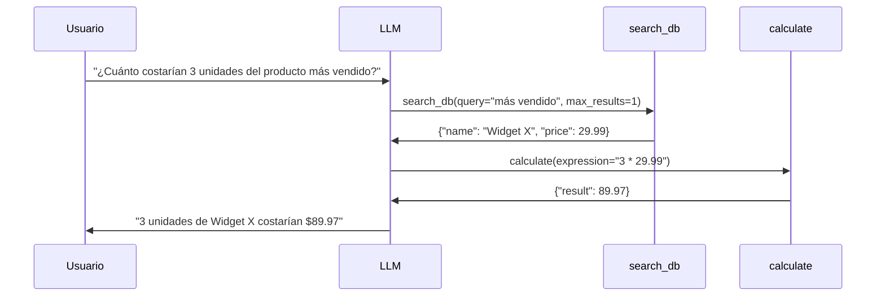

---
tags:
  - concepto
  - llm
  - api
  - infraestructura
aliases:
  - Diseño de API para LLMs
  - LLM API patterns
  - API de modelos de lenguaje
created: 2025-06-01
updated: 2025-06-01
category: inference
status: current
difficulty: intermediate
related:
  - "[[structured-generation]]"
  - "[[function-calling]]"
  - "[[pricing-llm-apis]]"
  - "[[litellm]]"
  - "[[inference-optimization]]"
  - "[[streaming-ux]]"
  - "[[llm-routers]]"
up: "[[moc-llms]]"
---

# Diseño de APIs para LLMs

> [!abstract] Resumen
> El diseño de APIs para interactuar con LLMs abarca patrones de comunicación (*streaming* vs *batch*), gestión de roles en conversaciones multi-turno, *function calling*, estimación de costes por tokens, y estrategias de resiliencia (retry, rate limiting, circuit breaker). ==Dominar estos patrones es la diferencia entre un prototipo que funciona en demos y un sistema de producción fiable==. Esta nota cubre la anatomía de una API de LLM, patrones de integración robusta, y abstracción multi-proveedor con el patrón [[litellm|LiteLLM]]. ^resumen

## Qué es y por qué importa

Las **APIs de LLMs** (*LLM APIs*) son la interfaz principal a través de la cual las aplicaciones interactúan con modelos de lenguaje, ya sean APIs cloud (OpenAI, Anthropic, Google) o servidores locales (vLLM, Ollama, llama.cpp). Aunque conceptualmente simples — enviar prompt, recibir respuesta — la realidad de producción involucra docenas de decisiones de diseño que impactan directamente la latencia, coste, fiabilidad y experiencia de usuario.

> [!tip] Cuándo usar esto
> - **Usar cuando**: Se construye cualquier aplicación que consuma LLMs — desde chatbots hasta agentes autónomos
> - **Conceptos previos**: Familiaridad básica con APIs REST, HTTP y JSON
> - Ver [[structured-generation]] para el formato de salidas
> - Ver [[pricing-llm-apis]] para estrategias de optimización de costes

---

## Anatomía de una llamada a API de LLM

### La request estándar (Chat Completions)

Todas las APIs de LLM modernas convergen en el patrón *Chat Completions*, estandarizado de facto por OpenAI:

```python
{
    "model": "gpt-4o",
    "messages": [
        {"role": "system", "content": "Eres un asistente útil."},
        {"role": "user", "content": "¿Qué es RAG?"},
        {"role": "assistant", "content": "RAG es..."},  # turno previo
        {"role": "user", "content": "¿Cómo implementarlo?"}
    ],
    "temperature": 0.7,
    "max_tokens": 1024,
    "tools": [...],           # function calling schemas
    "response_format": {...}, # structured generation
    "stream": true            # streaming
}
```

### Sistema de roles

| Rol | Propósito | Cuándo usar | Notas |
|---|---|---|---|
| `system` | Instrucciones globales, personalidad, restricciones | ==Siempre como primer mensaje== | Algunos modelos dan mayor peso a este rol |
| `user` | Input del usuario o del sistema que invoca | Cada turno de input | Se puede usar para inyectar contexto (RAG) |
| `assistant` | Respuestas previas del modelo | Multi-turno, few-shot examples | Incluir para mantener coherencia conversacional |
| `tool` | Resultado de una invocación de herramienta | Después de un tool call del assistant | Debe incluir `tool_call_id` para correlación |

> [!warning] El prompt del sistema NO es seguro
> ==El contenido del mensaje `system` puede ser extraído por el usuario con técnicas de prompt injection==. No colocar secretos, API keys, o instrucciones confidenciales en el system prompt. Ver [[prompt-injection-seguridad]] para estrategias de defensa.

### La response

```python
{
    "id": "chatcmpl-abc123",
    "object": "chat.completion",
    "model": "gpt-4o-2025-05-13",
    "choices": [{
        "index": 0,
        "message": {
            "role": "assistant",
            "content": "La respuesta del modelo...",
            "tool_calls": [...]  # si se invocaron herramientas
        },
        "finish_reason": "stop"  # stop | length | tool_calls | content_filter
    }],
    "usage": {
        "prompt_tokens": 125,
        "completion_tokens": 287,
        "total_tokens": 412
    }
}
```

> [!info] El campo `finish_reason` es crítico
> - `stop`: Generación completada normalmente
> - `length`: ==Se alcanzó `max_tokens` — la respuesta está truncada==
> - `tool_calls`: El modelo quiere invocar herramientas (no hay `content`)
> - `content_filter`: Contenido bloqueado por filtros de seguridad

---

## Patrones de comunicación

### Streaming vs Batch

> [!example]- Ver diagrama de streaming vs batch
> ```mermaid
> sequenceDiagram
>     participant C as Cliente
>     participant S as API LLM
>
>     rect rgb(200, 220, 255)
>         Note over C,S: Batch (sin streaming)
>         C->>S: POST /chat/completions
>         Note over S: Genera TODA la respuesta (3-30s)
>         S->>C: Response completa (JSON)
>     end
>
>     rect rgb(220, 255, 220)
>         Note over C,S: Streaming (SSE)
>         C->>S: POST /chat/completions (stream=true)
>         S-->>C: data: {"delta": {"content": "La"}}
>         S-->>C: data: {"delta": {"content": " respuesta"}}
>         S-->>C: data: {"delta": {"content": " es"}}
>         S-->>C: data: {"delta": {"content": "..."}}
>         S-->>C: data: [DONE]
>     end
> ```

| Aspecto | Batch | Streaming |
|---|---|---|
| **Latencia percibida** | Alta (espera completa) | ==Baja (primer token en ~200ms)== |
| **Implementación** | Simple (una request/response) | Compleja (SSE, reconexión, buffering) |
| **Manejo de errores** | Simple (HTTP status codes) | Complejo (errores mid-stream) |
| **Tool calls** | Siempre completos | Se reciben incrementalmente |
| **UX** | Adecuado para backend/batch | ==Imprescindible para chat/interactivo== |
| **Cancelación** | Fácil (no enviar request) | Posible (cerrar conexión SSE) |

### Implementación de streaming con SSE

*Server-Sent Events* (SSE) es el mecanismo estándar para streaming de LLMs. Usa una conexión HTTP persistente donde el servidor envía eventos incrementalmente.

> [!example]- Ver implementación de streaming
> ```python
> import httpx
> import json
> from typing import AsyncIterator
>
>
> async def stream_completion(
>     messages: list[dict],
>     model: str = "gpt-4o",
> ) -> AsyncIterator[str]:
>     """Stream de tokens desde la API de OpenAI."""
>     async with httpx.AsyncClient() as client:
>         async with client.stream(
>             "POST",
>             "https://api.openai.com/v1/chat/completions",
>             headers={"Authorization": f"Bearer {API_KEY}"},
>             json={
>                 "model": model,
>                 "messages": messages,
>                 "stream": True,
>             },
>             timeout=60.0,
>         ) as response:
>             async for line in response.aiter_lines():
>                 if line.startswith("data: "):
>                     data = line[6:]
>                     if data == "[DONE]":
>                         return
>                     chunk = json.loads(data)
>                     delta = chunk["choices"][0].get("delta", {})
>                     if content := delta.get("content"):
>                         yield content
>
>
> # Uso
> async for token in stream_completion([{"role": "user", "content": "Hola"}]):
>     print(token, end="", flush=True)
> ```

### Sync vs Async

| Patrón | Caso de uso | Framework típico |
|---|---|---|
| **Sync** | Scripts, notebooks, CLI tools | `openai.OpenAI()` |
| **Async** | ==Servidores web, alta concurrencia== | `openai.AsyncOpenAI()` |
| **Batch API** | Procesamiento masivo no-urgente | OpenAI Batch API (50% descuento) |

> [!tip] Usar async siempre en servidores
> Una llamada a LLM puede tardar 5-30 segundos. ==En un servidor sync, cada request bloquea un thread==. Con 100 requests concurrentes, necesitarías 100 threads. Con async, un solo thread maneja miles de conexiones.

---

## Function calling / Tool use

El *function calling* permite al modelo invocar funciones externas. Es el mecanismo fundamental de los [[agent-loop|agentes de IA]].

### Definición de herramientas

```python
tools = [
    {
        "type": "function",
        "function": {
            "name": "search_database",
            "description": "Busca información en la base de datos de productos",
            "parameters": {
                "type": "object",
                "properties": {
                    "query": {
                        "type": "string",
                        "description": "Término de búsqueda"
                    },
                    "category": {
                        "type": "string",
                        "enum": ["electronics", "clothing", "books"],
                        "description": "Categoría para filtrar"
                    },
                    "max_results": {
                        "type": "integer",
                        "default": 10,
                        "description": "Máximo de resultados"
                    }
                },
                "required": ["query"]
            }
        }
    }
]
```

> [!danger] Validar SIEMPRE los tool calls
> ==Nunca ejecutar un tool call sin validar sus argumentos==. El modelo puede:
> - Inventar argumentos fuera del schema (si no se usa constrained decoding)
> - Ser manipulado por prompt injection para invocar herramientas peligrosas
> - Pasar valores inesperados que exploten vulnerabilidades
> Ver [[structured-generation]] para validación robusta con Pydantic

### Flujo multi-herramienta



---

## Token counting y estimación de costes

### Cómo funcionan los tokens

Los LLMs no procesan caracteres ni palabras, sino *tokens* — segmentos de texto producidos por un tokenizer (típicamente BPE, *Byte Pair Encoding*). ==Una regla aproximada: 1 token ≈ 4 caracteres en inglés, ≈ 3 caracteres en español==.

```python
import tiktoken

# Contar tokens para modelos OpenAI
enc = tiktoken.encoding_for_model("gpt-4o")
tokens = enc.encode("Hola, ¿cómo estás? Necesito ayuda con un código.")
print(f"Tokens: {len(tokens)}")  # ~15 tokens
```

### Estructura de costes

| Componente | Descripción | Coste típico (GPT-4o) |
|---|---|---|
| **Input tokens** | System prompt + historial + user message | ==$2.50 / 1M tokens== |
| **Output tokens** | Respuesta generada | ==$10.00 / 1M tokens== |
| **Cached input** | Tokens de input que repiten un prefijo previo | $1.25 / 1M tokens |

> [!example]- Calculadora de costes
> ```python
> from dataclasses import dataclass
>
>
> @dataclass
> class ModelPricing:
>     input_per_million: float   # USD per 1M input tokens
>     output_per_million: float  # USD per 1M output tokens
>     cached_input_per_million: float = 0.0
>
>
> PRICING = {
>     "gpt-4o": ModelPricing(2.50, 10.00, 1.25),
>     "gpt-4o-mini": ModelPricing(0.15, 0.60, 0.075),
>     "claude-sonnet-4": ModelPricing(3.00, 15.00, 0.30),
>     "claude-haiku-3.5": ModelPricing(0.80, 4.00, 0.08),
>     "gemini-2.0-flash": ModelPricing(0.10, 0.40, 0.025),
> }
>
>
> def estimate_cost(
>     model: str,
>     input_tokens: int,
>     output_tokens: int,
>     cached_tokens: int = 0,
> ) -> float:
>     """Estima el coste de una llamada a API."""
>     p = PRICING[model]
>     input_cost = ((input_tokens - cached_tokens) / 1_000_000) * p.input_per_million
>     cached_cost = (cached_tokens / 1_000_000) * p.cached_input_per_million
>     output_cost = (output_tokens / 1_000_000) * p.output_per_million
>     return input_cost + cached_cost + output_cost
>
>
> # Ejemplo: conversación típica de agente (5 turnos)
> cost = estimate_cost("gpt-4o", input_tokens=8000, output_tokens=2000)
> print(f"Coste estimado: ${cost:.4f}")  # ~$0.04
> ```

> [!warning] El coste de output es 3-5x mayor que input
> ==Optimizar la longitud de las respuestas tiene mayor impacto que optimizar el prompt==. Usar `max_tokens` agresivamente y pedir respuestas concisas puede reducir costes un 40-60%. Ver [[pricing-llm-apis]] para estrategias avanzadas.

---

## Patrones de resiliencia

### Retry con exponential backoff

Las APIs de LLM fallan frecuentemente: rate limits (429), timeouts, errores internos (500/503). ==Un sistema sin retry no sobrevive un día en producción==.

```python
import asyncio
import random
from openai import RateLimitError, APITimeoutError, InternalServerError


async def call_with_retry(
    func,
    max_retries: int = 5,
    base_delay: float = 1.0,
    max_delay: float = 60.0,
    jitter: bool = True,
):
    """Retry con exponential backoff y jitter."""
    retryable_errors = (RateLimitError, APITimeoutError, InternalServerError)

    for attempt in range(max_retries):
        try:
            return await func()
        except retryable_errors as e:
            if attempt == max_retries - 1:
                raise

            delay = min(base_delay * (2 ** attempt), max_delay)
            if jitter:
                delay *= (0.5 + random.random())  # jitter ±50%

            print(f"Retry {attempt + 1}/{max_retries} after {delay:.1f}s: {e}")
            await asyncio.sleep(delay)
```

### Idempotencia

Las APIs de LLM NO son inherentemente idempotentes — la misma request puede producir respuestas diferentes (por temperature > 0 o variaciones internas). Para operaciones que modifican estado:

> [!tip] Patrón de idempotencia para agentes
> ```python
> # Asignar un ID único a cada operación
> import uuid
>
> operation_id = str(uuid.uuid4())
>
> # Antes de ejecutar una tool call, verificar si ya se ejecutó
> if not await db.operation_exists(operation_id):
>     result = await execute_tool(tool_call)
>     await db.save_operation(operation_id, result)
> else:
>     result = await db.get_operation_result(operation_id)
> ```

### Rate limiting

| Estrategia | Descripción | Implementación |
|---|---|---|
| **Token bucket** | N tokens disponibles, se recargan a tasa fija | `aiolimiter`, semáforos |
| **Sliding window** | Máximo N requests en ventana de T segundos | Contador con TTL |
| **Adaptive** | ==Ajustar tasa según headers `x-ratelimit-*`== | Leer headers de respuesta |
| **Queue-based** | Cola de requests con workers limitados | `asyncio.Queue` + workers |

> [!example]- Implementación de rate limiter adaptativo
> ```python
> import asyncio
> from dataclasses import dataclass
>
>
> @dataclass
> class RateLimitInfo:
>     requests_remaining: int
>     tokens_remaining: int
>     reset_at: float  # timestamp
>
>
> class AdaptiveRateLimiter:
>     """Rate limiter que se adapta según headers de la API."""
>
>     def __init__(self, initial_rps: float = 10.0):
>         self.semaphore = asyncio.Semaphore(int(initial_rps))
>         self._delay = 1.0 / initial_rps
>
>     def update_from_headers(self, headers: dict):
>         """Ajusta rate limit según headers de respuesta."""
>         remaining = int(headers.get("x-ratelimit-remaining-requests", 100))
>         reset_ms = int(headers.get("x-ratelimit-reset-requests", "1000ms").rstrip("ms"))
>
>         if remaining < 5:
>             # Casi al límite: frenar
>             self._delay = reset_ms / 1000 / max(remaining, 1)
>         elif remaining > 50:
>             # Mucho margen: acelerar
>             self._delay = max(0.05, self._delay * 0.8)
>
>     async def acquire(self):
>         await asyncio.sleep(self._delay)
>         return True
> ```

---

## Abstracción multi-proveedor

### El problema del vendor lock-in

Cada proveedor tiene una API ligeramente diferente. Construir directamente sobre un SDK específico crea acoplamiento que dificulta:
- Cambiar de proveedor cuando uno tiene problemas
- Usar diferentes modelos para diferentes tareas
- Negociar precios con alternativas
- Implementar fallback automático

### Patrón LiteLLM

[[litellm|LiteLLM]] proporciona una interfaz unificada para +100 proveedores de LLM. ==Permite cambiar de modelo con solo cambiar un string, sin tocar una línea de código de integración==.

```python
from litellm import completion

# Mismo código, diferentes proveedores
response = completion(model="gpt-4o", messages=[...])
response = completion(model="claude-sonnet-4-20250514", messages=[...])
response = completion(model="gemini/gemini-2.0-flash", messages=[...])
response = completion(model="ollama/llama3.1", messages=[...])
```

> [!example]- Diagrama de abstracción multi-proveedor
> ```mermaid
> flowchart TD
>     APP[Aplicación] --> ROUTER[LLM Router / LiteLLM]
>     ROUTER --> |Primario| OAI[OpenAI API]
>     ROUTER --> |Fallback 1| ANT[Anthropic API]
>     ROUTER --> |Fallback 2| GEM[Google Gemini API]
>     ROUTER --> |Local/dev| OLL[Ollama Local]
>
>     ROUTER -.-> |Retry logic| ROUTER
>     ROUTER -.-> |Rate limiting| ROUTER
>     ROUTER -.-> |Cost tracking| MONITOR[Observabilidad]
>
>     OAI --> |Respuesta| ROUTER
>     ANT --> |Respuesta| ROUTER
>     GEM --> |Respuesta| ROUTER
>     OLL --> |Respuesta| ROUTER
>
>     ROUTER --> |Respuesta normalizada| APP
>
>     style ROUTER fill:#FF9800
> ```

### Implementación de fallback

```python
from litellm import completion
from litellm.exceptions import ServiceUnavailableError, RateLimitError

FALLBACK_CHAIN = [
    "gpt-4o",
    "claude-sonnet-4-20250514",
    "gemini/gemini-2.0-flash",
]

async def resilient_completion(messages: list[dict], **kwargs) -> dict:
    """Llamada con fallback automático entre proveedores."""
    last_error = None
    for model in FALLBACK_CHAIN:
        try:
            return await completion(
                model=model,
                messages=messages,
                **kwargs,
            )
        except (ServiceUnavailableError, RateLimitError) as e:
            last_error = e
            print(f"Fallback: {model} falló con {e}, intentando siguiente...")
            continue
    raise last_error
```

---

## Ventajas y limitaciones

> [!success] Fortalezas de las APIs de LLM modernas
> - Interfaz simple y bien documentada (Chat Completions es fácil de aprender)
> - Streaming permite excelente UX con baja latencia percibida
> - Function calling habilita agentes de IA sofisticados
> - Ecosistema maduro de SDKs en todos los lenguajes principales
> - Abstracción multi-proveedor con LiteLLM elimina vendor lock-in

> [!failure] Limitaciones y desafíos
> - Latencia inherente (200ms-30s) limita casos de uso en tiempo real
> - Costes se acumulan rápidamente en aplicaciones de alto volumen
> - Rate limits pueden causar degradación bajo carga
> - Falta de estandarización real (cada proveedor con sus particularidades)
> - Debugging de errores de generación es opaco (caja negra)

---

## Estado del arte (2025-2026)

- **Realtime API**: OpenAI y Google ofrecen APIs de audio/voz en tiempo real con WebSockets, no solo texto
- **Context caching**: ==Los proveedores ofrecen caché de contexto para reducir coste de prompts repetitivos en 50-90%==. Ver [[context-caching]]
- **Batch APIs**: Procesamiento asíncrono masivo con descuentos del 50% (OpenAI) al 75% (Anthropic)
- **Estandarización emergente**: El patrón Chat Completions de OpenAI se ha convertido en estándar de facto; incluso servidores locales (vLLM, Ollama) lo implementan
- **Multimodalidad nativa**: Todas las APIs principales soportan imágenes, y crecientemente audio y video, en la misma interfaz

---

## Relación con el ecosistema

> [!info] Conexiones con mis herramientas
> - **[[intake-overview|intake]]**: intake abstrae el acceso a LLMs a través de LiteLLM, permitiendo usar modelos locales para desarrollo y modelos cloud para producción sin cambios de código
> - **[[architect-overview|architect]]**: architect necesita streaming para mostrar progreso al usuario, function calling para tool use (editar archivos, ejecutar tests), y retry robusto porque una sesión puede involucrar 50+ llamadas a API
> - **[[vigil-overview|vigil]]**: vigil usa batch mode para escanear múltiples archivos, optimizando coste con la Batch API; el rate limiting es crítico para no exceder cuotas durante escaneos de repositorios grandes
> - **[[licit-overview|licit]]**: licit requiere modelos frontier (GPT-4o, Claude Opus) para análisis legal preciso; la abstracción multi-proveedor permite failover si un proveedor tiene downtime durante una auditoría con deadline

---

## Enlaces y referencias

**Notas relacionadas:**
- [[structured-generation]] — Generación estructurada para outputs parseables
- [[function-calling]] — Invocación de herramientas via API
- [[pricing-llm-apis]] — Estrategias de optimización de costes
- [[litellm]] — Abstracción multi-proveedor
- [[inference-optimization]] — Optimización de latencia y throughput
- [[streaming-ux]] — UX patterns para streaming
- [[llm-routers]] — Routing inteligente entre modelos y proveedores
- [[context-caching]] — Caché de contexto para reducción de costes

> [!quote]- Referencias bibliográficas
> - OpenAI, "API Reference: Chat Completions", documentación oficial
> - Anthropic, "Messages API", documentación oficial
> - Google, "Gemini API", documentación oficial
> - BerriAI, "LiteLLM Documentation", documentación oficial
> - Helicone, "LLM API Cost Calculator", herramienta de referencia

[^1]: OpenAI. "Chat Completions API." La referencia de facto para el diseño de APIs de LLM, adoptada por casi todos los proveedores y servidores locales como estándar.
[^2]: BerriAI. "LiteLLM: Call 100+ LLM APIs using the OpenAI format." Librería open-source que unifica el acceso a proveedores de LLM, usada por miles de empresas en producción.
[^3]: Anthropic. "Tool Use (Function Calling)." Documentación de la API de tool use de Anthropic, con particularidades respecto al estándar OpenAI.
