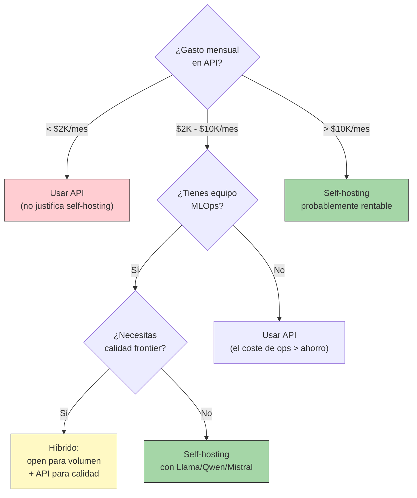

---
tags:
  - concepto
  - llm
  - open-source
aliases:
  - modelos open source
  - open source LLMs
  - modelos abiertos
  - open weights
created: 2025-06-01
updated: 2025-06-01
category: modelos-llm
status: current
difficulty: intermediate
related:
  - "[[que-son-llms]]"
  - "[[arquitecturas-llm]]"
  - "[[landscape-modelos]]"
  - "[[modelos-propietarios]]"
  - "[[inference-optimization]]"
  - "[[decision-modelo-llm]]"
up: "[[moc-llms]]"
---

# Modelos Open Source

> [!abstract] Resumen
> El ecosistema de modelos abiertos ha madurado enormemente en 2024-2025, con modelos como ==DeepSeek V3/R1, Llama 3.1 405B, y Qwen 2.5 72B compitiendo directamente con modelos propietarios frontier==. Sin embargo, "open source" en LLMs es un término cargado: la distinción entre *open weights*, *open source* y *truly open* es crucial. El ecosistema de herramientas (HuggingFace, Ollama, vLLM) ha reducido la barrera de entrada para self-hosting, pero las consideraciones de coste, latencia y mantenimiento siguen siendo significativas. ^resumen

## Qué es y por qué importa

El movimiento de **modelos abiertos** en IA se refiere a la práctica de liberar públicamente los pesos, y en algunos casos el código de entrenamiento, datos y pipeline completo de modelos de lenguaje. ==Esto ha democratizado el acceso a capacidades que hace dos años eran exclusivas de empresas con presupuestos de miles de millones==.

El impacto es múltiple:

1. **Soberanía tecnológica**: organizaciones pueden ejecutar modelos sin dependencia de proveedores cloud
2. **Privacidad**: los datos nunca salen de tu infraestructura
3. **Customización**: fine-tuning, merging, quantización adaptada a tu caso de uso
4. **Coste a escala**: amortización del hardware vs. pago por token
5. **Investigación**: la comunidad académica puede estudiar y mejorar los modelos

> [!tip] Cuándo usar modelos abiertos
> - **Usar cuando**: datos sensibles que no pueden salir de tu infraestructura, necesitas fine-tuning profundo, alto volumen de requests predecible, compliance requiere control total, necesitas latencia ultra-baja
> - **No usar cuando**: necesitas calidad frontier absoluta (o3/Claude 4 Opus), volumen bajo e impredecible, no tienes equipo de MLOps, el time-to-market es crítico
> - Ver [[decision-modelo-llm]] para un árbol de decisión completo

---

## Open vs "Open Weights" vs Truly Open

> [!danger] No todos los "open" son iguales
> ==La comunidad usa "open source" de forma laxa. La realidad es un espectro con implicaciones legales y prácticas muy diferentes==. ^open-weights-distinction

| Nivel | Qué se publica | Ejemplos | Licencia típica |
|---|---|---|---|
| **Truly Open Source** | Pesos + código + datos + pipeline de entrenamiento | OLMo (AI2), BLOOM | Apache 2.0 |
| **Open Weights + Code** | Pesos + código de inferencia + informe técnico | Mistral 7B, Qwen 2.5, Phi-4 | Apache 2.0, MIT |
| **Open Weights** | Solo pesos + informe técnico | Llama 3, Gemma 2 | Licencia custom restrictiva |
| **Open API** | Acceso por API a precio bajo, sin pesos | — | Terms of Service |
| **Cerrado** | Solo acceso por API premium | GPT-4o, Claude | Terms of Service |

> [!warning] La Llama Community License NO es open source
> Llama 3.1/3.2/4 se distribuyen bajo la "Llama Community License Agreement" que incluye restricciones:
> - Empresas con >700M MAU deben pedir permiso explícito a Meta
> - No se pueden usar los outputs de Llama para entrenar otros modelos que compitan con Llama
> - Meta puede revocar la licencia si se viola
>
> La Open Source Initiative (OSI) ha sido explícita: ==esto no cumple la Open Source Definition==. Es marketing, no licencia open source.

### Licencias comunes en modelos abiertos

| Licencia | Uso comercial | Redistribución | Restricciones | Modelos |
|---|---|---|---|---|
| **Apache 2.0** | Sí | Sí | Ninguna relevante | Mistral 7B, Qwen 2.5, DBRX |
| **MIT** | Sí | Sí | Ninguna | Phi-4, DeepSeek V3/R1 |
| **Llama Community** | Sí (con límites) | Sí (con límites) | 700M MAU, no-compete | Llama 3.x, Llama 4 |
| **Gemma Terms** | Sí (con límites) | Sí | Restricciones de uso | Gemma 2 |
| **RAIL** | Caso a caso | Caso a caso | Restricciones de uso responsable | BLOOM, algunos modelos HF |
| **CC-BY-NC** | No | Sí (no comercial) | Sin uso comercial | Algunos fine-tunes community |

> [!tip] Regla práctica para elegir por licencia
> Para uso comercial sin preocupaciones legales: ==Apache 2.0 o MIT son las únicas licencias que te dan tranquilidad total==. Qwen 2.5 (Apache 2.0), Mistral 7B (Apache 2.0), Phi-4 (MIT), y DeepSeek V3/R1 (MIT) son las opciones más seguras.

---

## Modelos abiertos clave

### Tier 1: Frontier open (compiten con propietarios)

| Modelo | Params | Arquitectura | Licencia | Fortalezas |
|---|---|---|---|---|
| ==DeepSeek V3== | 671B (37B act.) | MoE | MIT | ==Mejor open model general, coste de training $5.5M== |
| ==DeepSeek R1== | 671B (37B act.) | MoE | MIT | ==Razonamiento SOTA open, destilaciones disponibles== |
| Llama 3.1 405B | 405B | Dense | Llama | Mejor modelo denso open |
| Qwen 2.5 72B | 72B | Dense | Qwen | Mejor multilingüe open |

### Tier 2: Eficientes (self-hosting accesible)

| Modelo | Params | Arquitectura | Licencia | Fortalezas |
|---|---|---|---|---|
| Llama 3.1 70B | 70B | Dense | Llama | Referencia del tier, gran ecosistema |
| Qwen 2.5 32B | 32B | Dense | Apache 2.0 | Cabe en 1 GPU con Q4, gran calidad |
| Mixtral 8x22B | 141B (39B act.) | MoE | Apache 2.0 | MoE eficiente, function calling |
| Mistral Large 2 | 123B | Dense | Mistral Research | Fuerte en instrucciones multilingüe |
| QwQ 32B | 32B | Dense | Apache 2.0 | Razonamiento tipo o1 en 32B |
| DBRX | 132B (36B act.) | MoE | Apache 2.0 | Databricks, bueno para enterprise |

### Tier 3: Compactos (edge y dispositivos)

| Modelo | Params | Arquitectura | Licencia | Fortalezas |
|---|---|---|---|---|
| Llama 3.1 8B | 8B | Dense | Llama | Referencia 8B, gran fine-tune ecosystem |
| ==Phi-4== | 14B | Dense | MIT | ==Entrena con datos sintéticos, calidad de modelo 5x mayor== |
| Qwen 2.5 7B | 7B | Dense | Apache 2.0 | Mejor sub-10B para multilingüe |
| Gemma 2 9B | 9B | Dense | Gemma | Destilación de Gemini |
| Llama 3.2 3B | 3B | Dense | Llama | Para dispositivos móviles |
| Phi-4 mini | 3.8B | Dense | MIT | 128K contexto en 3.8B |
| Gemma 2 2B | 2B | Dense | Gemma | Mínimo viable para on-device |

---

## Ecosistema de herramientas

### HuggingFace: el hub central

*HuggingFace* es el repositorio estándar de facto para modelos, datasets y herramientas de ML. Su ecosistema incluye:

| Componente | Función | Uso |
|---|---|---|
| **Hub** | Repositorio de modelos (>500K modelos) | Descarga, versionado, model cards |
| **Transformers** | Librería Python para inferencia y training | Interfaz unificada para todos los modelos |
| **PEFT** | *Parameter-Efficient Fine-Tuning* | [[lora-qlora\|LoRA]], QLoRA, adapters |
| **TRL** | *Transformer Reinforcement Learning* | RLHF, DPO, PPO para alineamiento |
| **Accelerate** | Distributed training simplificado | Multi-GPU, FSDP, DeepSpeed |
| **Text Generation Inference** (TGI) | Servidor de inferencia optimizado | Producción, batching, quantización |
| **Spaces** | Hosting de demos y apps | Gradio, Streamlit, Docker |
| **Open LLM Leaderboard** | Benchmark público | Comparativa estandarizada |

> [!example]- Ejemplo: cargar y usar un modelo con Transformers
> ```python
> from transformers import AutoModelForCausalLM, AutoTokenizer
> import torch
>
> model_name = "Qwen/Qwen2.5-7B-Instruct"
>
> tokenizer = AutoTokenizer.from_pretrained(model_name)
> model = AutoModelForCausalLM.from_pretrained(
>     model_name,
>     torch_dtype=torch.bfloat16,
>     device_map="auto",  # distribuye automáticamente entre GPUs
>     attn_implementation="flash_attention_2",  # usa Flash Attention
> )
>
> messages = [
>     {"role": "system", "content": "Eres un asistente útil."},
>     {"role": "user", "content": "¿Qué es un LLM?"}
> ]
>
> input_ids = tokenizer.apply_chat_template(messages, return_tensors="pt")
> output = model.generate(input_ids.to(model.device), max_new_tokens=512)
> print(tokenizer.decode(output[0], skip_special_tokens=True))
> ```

### Ollama: LLMs locales simplificados

*Ollama* ha simplificado enormemente la ejecución local de LLMs, reduciendo la barrera de entrada a un solo comando.

| Aspecto | Detalle |
|---|---|
| **Instalación** | Un binario, sin dependencias Python |
| **Formato** | GGUF (quantizado, optimizado para CPU + GPU) |
| **API** | Compatible con OpenAI API format |
| **Modelos** | Catálogo curado con pull automático |
| **Quantización** | Soporta Q2 hasta Q8, FP16 |
| **Plataformas** | macOS (Metal), Linux (CUDA), Windows |

> [!example]- Ejemplo: ejecutar un modelo con Ollama
> ```bash
> # Instalar Ollama
> curl -fsSL https://ollama.ai/install.sh | sh
>
> # Descargar y ejecutar un modelo
> ollama run llama3.1:8b
>
> # Usar la API compatible con OpenAI
> curl http://localhost:11434/v1/chat/completions \
>   -d '{
>     "model": "llama3.1:8b",
>     "messages": [{"role": "user", "content": "Hola"}]
>   }'
>
> # Crear un Modelfile personalizado
> cat > Modelfile << 'EOF'
> FROM qwen2.5:7b
> SYSTEM "Eres un asistente de programación especializado en Python."
> PARAMETER temperature 0.3
> PARAMETER top_p 0.9
> EOF
> ollama create mi-asistente -f Modelfile
> ```

### vLLM: serving de producción

*vLLM* es el framework de referencia para serving de LLMs en producción, optimizado para alto throughput.

| Feature | Descripción |
|---|---|
| **PagedAttention** | Gestión eficiente de KV-cache, reduce desperdicio de VRAM |
| **Continuous batching** | Procesa requests en paralelo sin esperar a que todas terminen |
| **Tensor parallelism** | Distribuye un modelo entre múltiples GPUs |
| **Quantización** | AWQ, GPTQ, FP8, INT8 |
| **API** | Compatible OpenAI, gRPC |
| **Throughput** | ==2-24x más que Transformers naive== según el modelo |
| **Speculative decoding** | Usa modelo pequeño para acelerar modelo grande |

> [!info] Alternativas a vLLM
> | Framework | Enfoque | Cuándo elegir |
> |---|---|---|
> | **vLLM** | Throughput máximo, producción | ==Default para la mayoría de casos== |
> | **TGI** (HuggingFace) | Integración con HF ecosystem | Si ya usas HF pipeline |
> | **llama.cpp / GGUF** | CPU + GPU mixto, eficiencia | Edge, desarrollo local, Mac |
> | **SGLang** | Programación de flujos LLM | Pipelines complejos con branching |
> | **TensorRT-LLM** (Nvidia) | Optimización para Nvidia GPUs | Máximo rendimiento en A100/H100 |
> | **Aphrodite** | Fork de vLLM con features extra | Roleplay, sampling avanzado |

---

## Self-hosting: consideraciones prácticas

### Requisitos de hardware por modelo

| Modelo | VRAM mínima (FP16) | VRAM con Q4 | GPUs sugeridas | Coste mensual estimado (cloud) |
|---|---|---|---|---|
| Llama 3.1 8B | 16 GB | 6 GB | 1x RTX 4090 / 1x A100 | $200-600 |
| Phi-4 14B | 28 GB | 10 GB | 1x A100 40GB | $300-800 |
| Qwen 2.5 32B | 64 GB | 20 GB | 1x A100 80GB | $800-1,500 |
| Llama 3.1 70B | 140 GB | 40 GB | 2x A100 80GB / 1x H100 | $1,500-3,000 |
| Mixtral 8x22B | 280 GB | 80 GB | 4x A100 80GB | $3,000-5,000 |
| Llama 3.1 405B | 810 GB | 230 GB | 8x H100 80GB | ==~$15,000-25,000== |
| DeepSeek V3 | 1.3 TB | ~400 GB | 8x H100+ | $20,000-35,000 |

> [!warning] El coste real de self-hosting
> El hardware es solo una parte del coste total:
> - **Ingeniería**: configurar, optimizar y mantener el serving requiere expertise en MLOps
> - **Monitoring**: [[observabilidad-ia|observabilidad]] del modelo, drift detection, alertas
> - **Disponibilidad**: redundancia, failover, updates sin downtime
> - **Actualizaciones**: nuevos modelos salen cada semana, re-deployment frecuente
>
> ==Regla práctica: self-hosting tiene sentido económico a partir de ~$5,000/mes en gasto de API==. Por debajo, el overhead de operación supera el ahorro. ^self-hosting-threshold

### Análisis coste: self-hosting vs API



---

## Quantización: el multiplicador de eficiencia

La *quantization* reduce la precisión numérica de los pesos del modelo (de FP16/BF16 a INT8, INT4, o menor), ==reduciendo el uso de VRAM y acelerando la inferencia con una pérdida de calidad mínima==.

| Método | Bits | Ratio de compresión | Pérdida de calidad | Notas |
|---|---|---|---|---|
| FP16/BF16 | 16 | 1x (baseline) | Ninguna | Referencia |
| INT8 (LLM.int8()) | 8 | 2x | Mínima (<1%) | Universal, sin calibración |
| GPTQ | 4 | 4x | Baja (1-3%) | Requiere calibración, offline |
| AWQ | 4 | 4x | ==Baja (1-2%)== | ==Mejor que GPTQ generalmente== |
| GGUF Q4_K_M | ~4.5 | 3.5x | Baja (1-2%) | Estándar en Ollama/llama.cpp |
| GGUF Q2_K | ~2.5 | 6x | Moderada (5-10%) | Solo para modelos muy grandes |
| FP8 | 8 | 2x | Mínima | Nativo en H100, sin calibración |

> [!success] La quantización democratiza los LLMs
> - Llama 3.1 70B en Q4: cabe en 1 GPU de 48GB (RTX 4090, A6000)
> - Qwen 2.5 7B en Q4: cabe en 6GB VRAM (funciona en laptops con GPU dedicada)
> - ==La calidad con Q4_K_M o AWQ es suficiente para el 95% de aplicaciones==

---

## Comunidad y ecosistema

### Fine-tunes y merges de la comunidad

El ecosistema comunitario ha creado una cultura de experimentación:

1. **Fine-tunes especializados**: la comunidad de HuggingFace produce miles de fine-tunes para tareas específicas (coding, roleplay, función calling, dominios médicos/legales).

2. **Model merging**: técnica que combina pesos de múltiples modelos sin entrenamiento adicional. Métodos como SLERP, TIES, y DARE permiten crear modelos que combinan fortalezas de diferentes fine-tunes[^1].

3. **DPO y alineamiento comunitario**: [[dpo-alternativas|Direct Preference Optimization]] ha permitido a la comunidad alinear modelos sin la infraestructura masiva que requiere RLHF.

> [!example]- Ejemplo: merge de modelos con mergekit
> ```bash
> # Instalar mergekit
> pip install mergekit
>
> # Definir configuración de merge (YAML)
> cat > merge_config.yaml << 'EOF'
> models:
>   - model: NousResearch/Hermes-2-Pro-Llama-3-8B
>     parameters:
>       weight: 0.6
>   - model: cognitivecomputations/dolphin-2.9-llama3-8b
>     parameters:
>       weight: 0.4
> merge_method: slerp
> base_model: meta-llama/Meta-Llama-3-8B
> parameters:
>   t: 0.5
> dtype: bfloat16
> EOF
>
> # Ejecutar merge
> mergekit-yaml merge_config.yaml ./merged-model --cuda
> ```

### Plataformas de hosting y acceso

| Plataforma | Tipo | Modelos | Pricing | Notas |
|---|---|---|---|---|
| **Together AI** | Serverless API | Llama, Mistral, Qwen, etc. | Per-token | Rápido, fácil, muchos modelos |
| **Fireworks AI** | Serverless API | Similar a Together | Per-token | Optimización agresiva |
| **Groq** | Hardware dedicado (LPU) | Selección limitada | Per-token | ==Velocidad récord (~800 tok/s)== |
| **Replicate** | Serverless + custom | Amplio catálogo | Per-segundo | Fácil custom deployment |
| **Modal** | Serverless compute | Cualquiera | Per-segundo | Para ML engineers |
| **RunPod** | GPU alquiler | Cualquiera (self-deploy) | Per-hora GPU | Control total, barato |
| **Lambda Labs** | GPU alquiler | Cualquiera (self-deploy) | Per-hora GPU | H100 dedicados |
| **Hugging Face Inference Endpoints** | Managed | Cualquiera del Hub | Per-hora | Integración con HF |

---

## Estado del arte (2025-2026)

> [!question] Debate abierto: ¿los modelos abiertos alcanzarán a los frontier?
> - **Posición A (convergencia)**: DeepSeek R1 ya compite con o1, la brecha se cierra exponencialmente. En 12-18 meses, los mejores modelos abiertos igualarán a los propietarios — defendida por la comunidad open source, Meta
> - **Posición B (brecha persistente)**: Los labs con más datos propietarios, RLHF humano masivo y compute ilimitado siempre mantendrán una ventaja de 6-12 meses. Los modelos abiertos nunca serán *los mejores* — defendida por OpenAI, parcialmente Anthropic
> - **Mi valoración**: ==La brecha se ha reducido de ~2 años (GPT-3 era) a ~6 meses==. Para el 90% de aplicaciones prácticas, los modelos abiertos son "suficientemente buenos". La ventaja de los propietarios está cada vez más en features (tool use, multimodalidad) más que en calidad base de texto.

Tendencias clave:

1. **Post-training abierto**: El valor se mueve del pre-training (caro, centralizado) al post-training (fine-tuning, RLHF, DPO), que la comunidad sí puede hacer.
2. **Destilación**: modelos frontier propietarios "enseñan" a modelos abiertos más pequeños. DeepSeek R1 destilaciones y Qwen-2.5 son ejemplos.
3. **Modelos específicos**: en vez de un modelo general, modelos especializados (código, matemáticas, multilingüe) que superan a frontier en su nicho.
4. **Hardware diversificado**: soporte creciente para AMD (ROCm), Intel (XPU), y Apple Silicon (MLX) reduce la dependencia de Nvidia.

---

## Relación con el ecosistema

> [!info] Conexiones con mis herramientas
> - **[[intake-overview|intake]]**: Puede configurarse con modelos abiertos vía Ollama o vLLM como backend alternativo a Claude API. Útil para procesamiento de repositorios con datos sensibles que no pueden salir de la organización.
> - **[[architect-overview|architect]]**: El agent loop puede funcionar con Llama 3.1 70B o Qwen 2.5 72B como backend para organizaciones que requieren self-hosting completo. La calidad de function calling es inferior a Claude/GPT-4o, requiriendo ajustes en el prompt del agente.
> - **[[vigil-overview|vigil]]**: Los guardrails pueden usar modelos locales pequeños (Llama 3.1 8B, Phi-4) como clasificadores de seguridad, evitando latencia y coste de API calls adicionales.
> - **[[licit-overview|licit]]**: Self-hosting de modelos abiertos simplifica significativamente el compliance bajo GDPR y [[eu-ai-act-completo|EU AI Act]] al eliminar transferencias de datos a terceros.

---

## Enlaces y referencias

**Notas relacionadas:**
- [[que-son-llms]] — Fundamentos de cómo funcionan los LLMs
- [[arquitecturas-llm]] — Arquitecturas: decoder-only, MoE, SSM
- [[landscape-modelos]] — Comparativa general incluyendo propietarios
- [[modelos-propietarios]] — APIs comerciales como alternativa
- [[decision-modelo-llm]] — Árbol de decisión: open vs propietario
- [[inference-optimization]] — Quantización, speculative decoding, KV-cache optimization
- [[lora-qlora]] — Fine-tuning eficiente de modelos abiertos
- [[pricing-llm-apis]] — Análisis económico de API vs self-hosting

> [!quote]- Referencias bibliográficas
> - Meta AI, "The Llama 3 Herd of Models", arXiv 2024
> - DeepSeek AI, "DeepSeek-V3 Technical Report", arXiv 2024
> - DeepSeek AI, "DeepSeek-R1: Incentivizing Reasoning Capability in LLMs via Reinforcement Learning", arXiv 2025
> - Jiang et al., "Mixtral of Experts", arXiv 2024
> - Qwen Team, "Qwen2.5 Technical Report", arXiv 2024
> - Abdin et al., "Phi-4 Technical Report", Microsoft Research 2024
> - Frantar et al., "GPTQ: Accurate Post-Training Quantization for Generative Pre-trained Transformers", ICLR 2023
> - Lin et al., "AWQ: Activation-aware Weight Quantization for LLM Compression and Acceleration", MLSys 2024
> - Kwon et al., "Efficient Memory Management for Large Language Model Serving with PagedAttention" (vLLM), SOSP 2023
> - Groeneveld et al., "OLMo: Accelerating the Science of Language Models", ACL 2024

[^1]: Goddard et al., "Arcee's MergeKit: A Toolkit for Merging Large Language Models", arXiv 2024.
[^2]: Los costes de cloud son estimaciones basadas en precios de AWS, GCP y proveedores especializados a junio 2025.
[^3]: Las métricas de calidad post-quantización varían significativamente por tarea. Los números aquí son promedios en benchmarks estándar.
