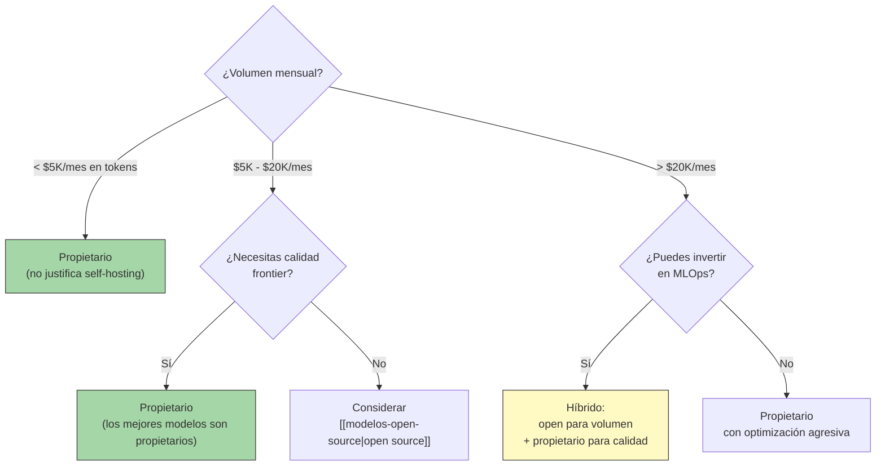

---
tags:
  - concepto
  - llm
  - api
aliases:
  - modelos propietarios
  - proprietary LLMs
  - APIs de LLM
  - LLM APIs
created: 2025-06-01
updated: 2025-06-01
category: modelos-llm
status: volatile
difficulty: intermediate
related:
  - "[[que-son-llms]]"
  - "[[landscape-modelos]]"
  - "[[modelos-open-source]]"
  - "[[pricing-llm-apis]]"
  - "[[decision-modelo-llm]]"
  - "[[inference-optimization]]"
up: "[[moc-llms]]"
---

# Modelos Propietarios y APIs

> [!abstract] Resumen
> Los modelos propietarios — accesibles exclusivamente vía API — siguen siendo la opción dominante para producción por su ==calidad frontier, facilidad de integración, y cero overhead operacional==. Los principales proveedores (OpenAI, Anthropic, Google, Mistral, Cohere) compiten agresivamente en precio y features. La estrategia óptima para la mayoría de organizaciones es ==multi-provider con routing inteligente==, usando herramientas como LiteLLM para abstraer la dependencia de un solo proveedor. ^resumen

> [!warning] Última verificación: 2025-06-01
> Precios, rate limits, SLAs y features cambian frecuentemente. ==Verifica datos directamente con los proveedores antes de compromisos contractuales==. Los datos aquí son orientativos.

## Qué es y por qué importa

Los **modelos propietarios** (*proprietary models*) son LLMs cuyos pesos no son públicos y cuyo acceso se proporciona exclusivamente a través de APIs de pago. A diferencia de los [[modelos-open-source|modelos abiertos]], el usuario no puede inspeccionar, modificar ni ejecutar el modelo localmente.

¿Por qué sigue siendo la elección mayoritaria?

1. **Calidad frontier**: los mejores modelos disponibles (o3, Claude 4 Opus) son propietarios
2. **Zero ops**: no hay infraestructura que gestionar, escalar ni mantener
3. **Features avanzadas**: function calling, structured outputs, multimodalidad, caching — todo integrado
4. **Time-to-market**: de cero a producción en horas, no semanas
5. **Escalabilidad automática**: el proveedor gestiona la capacidad

> [!tip] Cuándo elegir propietario
> - **Usar cuando**: necesitas calidad máxima, volumen variable/impredecible, no tienes equipo MLOps, time-to-market es prioritario, el coste por query es aceptable
> - **No usar cuando**: datos ultra-sensibles que no pueden salir de tu red, coste por token a volumen alto es prohibitivo, necesitas control total del modelo, regulación prohíbe transferencia de datos
> - Ver [[decision-modelo-llm]] para análisis completo

---

## Proveedores principales

### OpenAI

| Aspecto | Detalle |
|---|---|
| **URL API** | `api.openai.com/v1/` |
| **SDK** | `openai` (Python, Node, .NET, Java, Go) |
| **Modelos clave** | GPT-4o, GPT-4o mini, o1, o3, o3-mini, o4-mini |
| **Features** | Function calling, JSON mode, structured outputs, vision, audio, assistants, file search, code interpreter |
| **Batch API** | Sí (50% descuento, 24h SLA) |
| **Fine-tuning** | GPT-4o mini, GPT-3.5 Turbo |
| **Rate limits (tier 1)** | 500 RPM, 30K TPM |
| **Rate limits (tier 5)** | 10K RPM, 10M TPM |
| **Data retention** | 30 días por defecto, ZDR disponible (enterprise/opt-in) |
| **Training on data** | ==No para API (desde marzo 2023)== |
| **Regiones** | US, EU (Azure OpenAI) |

> [!example]- Ejemplo: llamada a la API de OpenAI
> ```python
> from openai import OpenAI
>
> client = OpenAI()  # usa OPENAI_API_KEY del entorno
>
> # Chat completion estándar
> response = client.chat.completions.create(
>     model="gpt-4o",
>     messages=[
>         {"role": "system", "content": "Eres un asistente técnico."},
>         {"role": "user", "content": "Explica qué es un LLM en 2 líneas."}
>     ],
>     temperature=0.3,
>     max_tokens=200,
> )
> print(response.choices[0].message.content)
>
> # Structured output con response_format
> from pydantic import BaseModel
>
> class Analysis(BaseModel):
>     sentiment: str
>     confidence: float
>     topics: list[str]
>
> response = client.beta.chat.completions.parse(
>     model="gpt-4o",
>     messages=[{"role": "user", "content": "Analiza: 'El producto es excelente'"}],
>     response_format=Analysis,
> )
> result = response.choices[0].message.parsed
> # result.sentiment = "positivo", result.confidence = 0.95
> ```

### Anthropic

| Aspecto | Detalle |
|---|---|
| **URL API** | `api.anthropic.com/v1/` |
| **SDK** | `anthropic` (Python, TypeScript) |
| **Modelos clave** | Claude 3.5 Haiku, Claude 3.5 Sonnet, Claude 4 Sonnet, Claude 4 Opus |
| **Features** | Tool use, computer use, vision, PDF processing, extended thinking, prompt caching, batches |
| **Batch API** | Sí (50% descuento) |
| **Fine-tuning** | Solo enterprise (contact sales) |
| **Rate limits (tier 1)** | 50 RPM, 40K TPM |
| **Rate limits (tier 4)** | 4K RPM, 400K TPM |
| **Data retention** | ==30 días, sin uso para training por defecto== |
| **Training on data** | ==No (nunca, para API)== |
| **Regiones** | US, EU (vía AWS Bedrock), GCP Vertex |

> [!success] Anthropic: diferenciadores clave
> - **Prompt caching**: almacena prefijos de prompt y cobra 10% del precio normal en requests siguientes. ==Ahorro de hasta 90% para system prompts largos y repetitivos== (crucial para agentes con contexto largo). ^prompt-caching
> - **Extended thinking**: el modelo "piensa" internamente antes de responder, comparable a o1/o3 pero con la calidad de escritura de Claude
> - **Computer use**: el modelo puede controlar un navegador/escritorio virtual, habilitando agentes más autónomos
> - **200K contexto real**: no se degrada significativamente, needle-in-haystack >99%
> - **Privacidad por defecto**: la política más estricta de los proveedores principales

### Google (Vertex AI / AI Studio)

| Aspecto | Detalle |
|---|---|
| **URL API** | `generativelanguage.googleapis.com` (AI Studio) / Vertex AI |
| **SDK** | `google-generativeai` (Python), `@google/generative-ai` (JS) |
| **Modelos clave** | Gemini 1.5 Pro, Gemini 1.5 Flash, Gemini 2.0 Flash |
| **Features** | Multimodal (video/audio nativo), grounding, context caching, code execution |
| **Fine-tuning** | Sí (Gemini 1.5 Pro/Flash) |
| **Rate limits** | Variables por proyecto y tier |
| **Data retention** | Configurable en Vertex AI |
| **Training on data** | No para Vertex AI; ==sí para AI Studio tier gratuito== |
| **Regiones** | Global (GCP), pero restricciones geográficas para algunos modelos |

> [!warning] AI Studio vs Vertex AI
> Google tiene dos plataformas con políticas diferentes:
> - **AI Studio** (gratuito / básico): Google ==puede usar datos para mejorar productos== en el tier gratuito. No apto para producción con datos sensibles.
> - **Vertex AI** (enterprise): datos no se usan para training, SLAs disponibles, compliance enterprise. ==Siempre usar Vertex AI para producción==.

### Mistral (La Plateforme)

| Aspecto | Detalle |
|---|---|
| **URL API** | `api.mistral.ai/v1/` |
| **SDK** | `mistralai` (Python, JS) |
| **Modelos clave** | Mistral Small, Mistral Large 2, Codestral |
| **Features** | Function calling, JSON mode, guardrails, code completion (FIM) |
| **Fine-tuning** | Sí (Mistral Small, Mistral 7B) |
| **Rate limits** | Basados en plan |
| **Data retention** | 30 días |
| **Training on data** | No para API |
| **Regiones** | ==EU por defecto (ventaja para GDPR)== |

### Cohere

| Aspecto | Detalle |
|---|---|
| **URL API** | `api.cohere.com/v2/` |
| **SDK** | `cohere` (Python, JS, Java, Go) |
| **Modelos clave** | Command R+, Command R, Embed v3, Rerank v3 |
| **Features** | RAG nativo, citations, tool use, grounding |
| **Diferenciador** | ==Especialista en RAG y enterprise search==, embeddings multilingüe líderes |
| **Fine-tuning** | Sí (Command R) |
| **Regiones** | US, privacidad strong |

---

## Modelos de pricing

### Per-token pricing

El modelo estándar de la industria. Se cobra por millón de tokens de input y output por separado.

| Concepto | Cómo funciona | Ejemplo |
|---|---|---|
| **Input tokens** | Tokens en el prompt (system + user + context) | 1000 tokens input con GPT-4o = $0.0025 |
| **Output tokens** | Tokens generados por el modelo | 500 tokens output con GPT-4o = $0.005 |
| **Cached input** | Tokens de input cacheados (prompt repetido) | 1000 tokens cached con Claude = $0.0003 |
| **Reasoning tokens** | Tokens internos de "pensamiento" (o-series) | Se cobran como output pero no se ven |

> [!example]- Cálculo de coste para un caso real
> ```
> Caso: agente de código que analiza un archivo de 500 líneas
>
> System prompt:        ~2,000 tokens
> Código del archivo:   ~3,000 tokens
> Instrucción usuario:  ~100 tokens
> Respuesta del modelo: ~1,500 tokens
>
> Total input:  5,100 tokens
> Total output: 1,500 tokens
>
> Coste con GPT-4o:
>   Input:  5,100 / 1M × $2.50 = $0.01275
>   Output: 1,500 / 1M × $10.00 = $0.015
>   Total: $0.02775 por request
>
> Coste con Claude 3.5 Sonnet:
>   Input:  5,100 / 1M × $3.00 = $0.0153
>   Output: 1,500 / 1M × $15.00 = $0.0225
>   Total: $0.0378 por request
>
> Coste con Gemini 2.0 Flash:
>   Input:  5,100 / 1M × $0.10 = $0.00051
>   Output: 1,500 / 1M × $0.40 = $0.0006
>   Total: $0.00111 por request (34x más barato que GPT-4o)
>
> A 10,000 requests/día:
>   GPT-4o:    ~$277/día  = ~$8,300/mes
>   Claude:    ~$378/día  = ~$11,340/mes
>   Gemini:    ~$11/día   = ~$333/mes
> ```

### Batch pricing

Varios proveedores ofrecen descuentos para requests no urgentes procesados en batch:

| Proveedor | Descuento batch | SLA de procesamiento |
|---|---|---|
| OpenAI | ==50% descuento== | 24 horas |
| Anthropic | 50% descuento | 24 horas |
| Google | Context caching (descuento variable) | Inmediato con cache |

> [!tip] Cuándo usar batch
> - Procesamiento de documentos no urgente
> - Evaluaciones y benchmarking masivos
> - Generación de datasets sintéticos
> - Cualquier tarea donde 24h de latencia es aceptable
> - ==intake puede configurarse para usar batch API cuando procesa repositorios completos==

### Cached token pricing

*Prompt caching* reduce drásticamente el coste cuando el mismo prefijo de prompt se repite:

| Proveedor | Precio cached input | Ahorro vs normal | Cómo funciona |
|---|---|---|---|
| Anthropic | 10% del precio normal | ==90% ahorro== | Cache automático de prefijos >1024 tokens |
| OpenAI | 50% del precio normal | 50% ahorro | Cache automático, TTL de 5-10 min |
| Google | 25% del precio normal | 75% ahorro | Cache explícito, se define TTL |

> [!info] Impacto del prompt caching en agentes
> Para un agente como [[architect-overview|architect]] que envía el mismo system prompt (2000+ tokens) en cada iteración del loop:
> - Sin caching: $0.006 por iteración solo en system prompt (Claude 3.5 Sonnet)
> - Con caching: $0.0006 por iteración después del primer request
> - ==En un loop de 20 iteraciones, el ahorro es ~$0.10 por sesión, que a 1000 sesiones/día = $100/día==

---

## Rate limits y quotas

> [!danger] Los rate limits son el cuello de botella oculto
> ==Muchos proyectos fallan en producción no por coste sino por rate limits==. Es crucial entender y planificar los límites antes de comprometerse con un proveedor.

### Estructura típica de rate limits

| Proveedor | Dimensiones de limite | Cómo escalar |
|---|---|---|
| OpenAI | RPM (requests/min) + TPM (tokens/min) | Tiers automáticos por gasto acumulado |
| Anthropic | RPM + TPM + tokens/día | Tiers por gasto, también por request a sales |
| Google | RPM + TPD (tokens/día) | Basado en proyecto y billing |
| Mistral | Plan-based | Upgrade de plan |

### Rate limits por tier (OpenAI ejemplo)

| Tier | Requisito | RPM | TPM (GPT-4o) | Batch TPM |
|---|---|---|---|---|
| Free | Cuenta nueva | 3 | 40K | N/A |
| Tier 1 | $5 pagados | 500 | 30K | 200K |
| Tier 2 | $50+ pagados, 7+ días | 5K | 450K | 2M |
| Tier 3 | $100+ pagados, 7+ días | 5K | 800K | 4M |
| Tier 4 | $250+ pagados, 14+ días | 10K | 2M | 20M |
| Tier 5 | $1000+ pagados, 30+ días | 10K | 10M | 50M |

> [!warning] Trampas comunes con rate limits
> - **RPM vs TPM**: puedes tener suficiente TPM pero chocar con RPM si haces muchas requests cortas
> - **Modelos nuevos**: los modelos recién lanzados suelen tener rate limits más bajos
> - **Reasoning models**: o1/o3 tienen limits separados y generalmente más restrictivos
> - **Concurrent requests**: no confundir RPM con requests concurrentes

---

## SLAs y fiabilidad

| Proveedor | Uptime SLA | Latency SLA | Compensación |
|---|---|---|---|
| OpenAI (estándar) | ==Ninguno publicado== | Ninguno | Ninguna |
| OpenAI (Enterprise) | 99.9% | P99 documentado | Créditos |
| Anthropic | No publicado formalmente | — | — |
| Anthropic (Enterprise) | Negociable | — | Créditos |
| Google (Vertex AI) | ==99.9%== | P95/P99 | ==Créditos automáticos== |
| Azure OpenAI | 99.9% | P95/P99 documentado | Créditos |
| Mistral | No publicado | — | — |

> [!danger] Realidad de la fiabilidad
> En la práctica, las APIs de LLM tienen incidentes frecuentes:
> - **Degradación de latencia**: los P99 pueden ser 5-10x el P50, especialmente en horas pico (US business hours)
> - **Rate limit errors**: HTTP 429 son parte normal de la operación; tu código DEBE manejarlos con retry exponencial
> - **Model degradation**: hay reportes periódicos de caídas de calidad sin anuncio (especialmente GPT-4o entre mayo-agosto 2024)
> - **Downtime**: incidentes de 1-4 horas ocurren varias veces al año en todos los proveedores
>
> ==La única estrategia robusta es multi-provider con failover automático==. ^multi-provider-necessity

---

## Políticas de privacidad y datos

| Política | OpenAI API | Anthropic API | Google Vertex | Mistral |
|---|---|---|---|---|
| **Training on data** | No | ==No (nunca)== | No | No |
| **Retención de datos** | 30 días (ZDR disponible) | 30 días | Configurable | 30 días |
| **Logs de abuse** | Sí (30 días) | Sí (30 días) | Sí | Sí |
| **DPA disponible** | Sí (Enterprise) | Sí | Sí | Sí |
| **GDPR compliance** | Sí (con DPA) | Sí | Sí | ==Sí (EU nativo)== |
| **SOC 2 Type II** | Sí | Sí | Sí | Sí |
| **HIPAA BAA** | Sí (Enterprise) | Enterprise | Sí (Vertex) | No |
| **ISO 27001** | Sí | Sí | Sí | Sí |
| **Data residency EU** | Via Azure | Via Bedrock EU | Via Vertex EU | ==Nativo== |

> [!warning] Consideraciones para el [[eu-ai-act-completo|EU AI Act]]
> El uso de APIs propietarias en sistemas clasificados como alto riesgo bajo el AI Act requiere:
> - DPA firmado con el proveedor
> - Documentación de dónde se procesan los datos
> - Evaluación de transferencias internacionales (Schrems II)
> - ==Mistral tiene ventaja regulatoria por ser empresa francesa con servidores en EU==
> - Ver [[licit-overview|licit]] para automatizar la evaluación de compliance

---

## Cuándo propietario es la elección correcta



---

## Estrategias multi-provider

### LiteLLM: el proxy universal

*LiteLLM* es la herramienta estándar para abstraer múltiples proveedores detrás de una interfaz OpenAI-compatible. ==Es la pieza clave de cualquier estrategia multi-provider seria==. ^litellm

| Feature | Descripción |
|---|---|
| **Interfaz unificada** | Todos los proveedores expuestos como formato OpenAI |
| **Fallbacks** | Si un proveedor falla, rota al siguiente automáticamente |
| **Load balancing** | Distribuye requests entre múltiples proveedores/modelos |
| **Budget limits** | Controla gasto por proyecto/usuario/modelo |
| **Caching** | Cache de responses para prompts idénticos |
| **Logging** | Integración con Langfuse, Helicone, etc. |
| **Rate limit handling** | Retry automático con backoff |

> [!example]- Configuración de LiteLLM con fallbacks
> ```yaml
> # litellm_config.yaml
> model_list:
>   - model_name: "main-model"
>     litellm_params:
>       model: "anthropic/claude-sonnet-4-20250514"
>       api_key: "os.environ/ANTHROPIC_API_KEY"
>     model_info:
>       max_tokens: 200000
>
>   - model_name: "main-model"  # mismo nombre = fallback
>     litellm_params:
>       model: "openai/gpt-4o"
>       api_key: "os.environ/OPENAI_API_KEY"
>     model_info:
>       max_tokens: 128000
>
>   - model_name: "fast-cheap"
>     litellm_params:
>       model: "google/gemini-2.0-flash"
>       api_key: "os.environ/GOOGLE_API_KEY"
>
>   - model_name: "fast-cheap"  # fallback
>     litellm_params:
>       model: "openai/gpt-4o-mini"
>       api_key: "os.environ/OPENAI_API_KEY"
>
> router_settings:
>   routing_strategy: "latency-based-routing"
>   num_retries: 3
>   timeout: 30
>   allowed_fails: 2
>
> general_settings:
>   max_budget: 1000  # USD/mes
>   budget_duration: "monthly"
> ```

> [!example]- Ejemplo de uso en código Python
> ```python
> from litellm import completion
>
> # Usa la interfaz unificada — LiteLLM enruta automáticamente
> response = completion(
>     model="anthropic/claude-sonnet-4-20250514",
>     messages=[{"role": "user", "content": "¿Qué es un LLM?"}],
>     fallbacks=["openai/gpt-4o", "google/gemini-2.0-flash"],
>     temperature=0.3,
> )
>
> # Con el proxy server (compatible OpenAI SDK)
> import openai
>
> client = openai.OpenAI(
>     api_key="tu-litellm-key",
>     base_url="http://litellm-proxy:4000/v1",
> )
>
> response = client.chat.completions.create(
>     model="main-model",  # LiteLLM resuelve al proveedor real
>     messages=[{"role": "user", "content": "Hola"}],
> )
> ```

### Patrones de routing inteligente

| Patrón | Descripción | Cuándo usar |
|---|---|---|
| **Fallback simple** | Si A falla, usa B | Fiabilidad básica |
| **Latency-based** | Enruta al proveedor con menor latencia actual | Cuando la velocidad importa |
| **Cost-based** | Usa el más barato que cumpla requisitos mínimos | Optimización de costes |
| **Complexity-based** | Modelo simple para tareas simples, frontier para complejas | ==Estrategia óptima para la mayoría== |
| **Region-based** | EU data → Mistral/Vertex EU, US data → OpenAI | Compliance GDPR |

> [!tip] Estrategia recomendada: routing por complejidad
> ```
> Tarea simple (clasificación, extracción, formato):
>   → Gemini 2.0 Flash o GPT-4o mini ($0.10-0.15/M input)
>
> Tarea media (análisis, summarización, código simple):
>   → Claude 3.5 Sonnet o GPT-4o ($2.50-3.00/M input)
>
> Tarea compleja (razonamiento multi-paso, código complejo):
>   → Claude 4 Sonnet o o4-mini ($1.10-3.00/M input)
>
> Tarea frontier (investigación, problemas abiertos):
>   → o3 o Claude 4 Opus ($10-15/M input)
> ```
> ==Este patrón puede reducir costes un 60-80% vs usar siempre el modelo más caro==.

---

## Manejo de errores y resiliencia

> [!example]- Patrón de retry con backoff exponencial
> ```python
> import time
> import random
> from openai import OpenAI, RateLimitError, APIError, APITimeoutError
>
> def call_with_retry(
>     client: OpenAI,
>     messages: list,
>     model: str = "gpt-4o",
>     max_retries: int = 5,
>     base_delay: float = 1.0,
> ):
>     """Llama a la API con retry exponencial + jitter."""
>     for attempt in range(max_retries):
>         try:
>             return client.chat.completions.create(
>                 model=model,
>                 messages=messages,
>             )
>         except RateLimitError:
>             if attempt == max_retries - 1:
>                 raise
>             delay = base_delay * (2 ** attempt) + random.uniform(0, 1)
>             time.sleep(delay)
>         except APITimeoutError:
>             if attempt == max_retries - 1:
>                 raise
>             time.sleep(base_delay)
>         except APIError as e:
>             if e.status_code >= 500:  # Server error, retryable
>                 if attempt == max_retries - 1:
>                     raise
>                 time.sleep(base_delay * (2 ** attempt))
>             else:
>                 raise  # Client error, no retry
> ```

---

## Estado del arte (2025-2026)

> [!question] Debate: ¿hacia la comoditización?
> - **Posición A (comoditización)**: Los modelos se vuelven commodities. La diferenciación será en precio, latencia y features (herramientas, caching, multimodalidad), no en calidad base — defendida por analistas de industria, startups de routing
> - **Posición B (diferenciación persistente)**: Cada proveedor tiene fortalezas únicas (Anthropic en seguridad, OpenAI en razonamiento, Google en multimodalidad) que se mantienen. La "calidad" no es unidimensional — defendida por los propios proveedores
> - **Mi valoración**: ==Ambas son parcialmente correctas==. El tier medio se ha comoditizado (GPT-4o mini ≈ Gemini Flash ≈ Claude Haiku para la mayoría de tareas). Pero el frontier sigue diferenciado, y las features no-modelo (caching, tool use, compliance) son cada vez más importantes.

Tendencias clave:

1. **Prompt caching como estándar**: todos los proveedores lo ofrecen o lo ofrecerán. Cambia fundamentalmente la economía de sistemas con contextos largos.
2. **Modelos de razonamiento**: o1/o3/o4-mini, extended thinking de Claude. Un nuevo tier de pricing donde pagas por "pensamiento".
3. **Competencia de precios**: los precios han caído >10x en 18 meses y seguirán bajando.
4. **Agentic features**: tool use mejorado, computer use, MCP son diferenciadores.
5. **Real-time APIs**: OpenAI Realtime API, Gemini Live para audio/video en tiempo real.

---

## Relación con el ecosistema

> [!info] Conexiones con mis herramientas
> - **[[intake-overview|intake]]**: Usa Claude API como backend principal. La configuración multi-provider con LiteLLM permite fallback a GPT-4o si Anthropic tiene incidentes. El prompt caching de Anthropic es especialmente valioso para el system prompt largo de intake.
> - **[[architect-overview|architect]]**: El agente architect depende críticamente de la calidad del function calling. ==Claude y GPT-4o tienen el function calling más fiable==, lo que los hace preferibles para el loop de agente sobre alternativas más baratas.
> - **[[vigil-overview|vigil]]**: Las verificaciones de seguridad de vigil deben funcionar independientemente del proveedor. LiteLLM facilita que vigil use un modelo barato (GPT-4o mini) para clasificación de seguridad mientras el modelo principal es otro.
> - **[[licit-overview|licit]]**: Evalúa las políticas de privacidad y compliance de cada proveedor. ==La tabla de políticas de datos de esta nota es un input directo para las evaluaciones de licit==.

---

## Enlaces y referencias

**Notas relacionadas:**
- [[que-son-llms]] — Fundamentos de los modelos que estas APIs exponen
- [[landscape-modelos]] — Comparativa completa de todos los modelos
- [[modelos-open-source]] — Alternativa para self-hosting
- [[pricing-llm-apis]] — Análisis económico profundo
- [[decision-modelo-llm]] — Framework de decisión completo
- [[inference-optimization]] — Optimizaciones que afectan latencia y coste
- [[context-engineering-overview]] — Diseño de prompts que maximiza el uso de caching
- [[prompt-injection-seguridad]] — Riesgos de seguridad al usar APIs

> [!quote]- Referencias y fuentes
> - OpenAI Platform Documentation: platform.openai.com/docs
> - Anthropic API Documentation: docs.anthropic.com
> - Google AI for Developers: ai.google.dev
> - Mistral AI Documentation: docs.mistral.ai
> - Cohere Documentation: docs.cohere.com
> - LiteLLM Documentation: docs.litellm.ai
> - Artificial Analysis (pricing tracker): artificialanalysis.ai
> - OpenAI Status Page: status.openai.com
> - Anthropic Terms of Service y Privacy Policy: anthropic.com/legal

[^1]: Los precios y rate limits reportados corresponden a junio 2025. Verificar directamente con proveedores.
[^2]: Los SLAs de uptime son teóricos. En la práctica, la fiabilidad medida externamente por terceros como Artificial Analysis muestra uptimes reales de ~99.5-99.8% para la mayoría de proveedores.
[^3]: La política de "no training on API data" de OpenAI entró en vigor en marzo 2023 y se aplica a todos los endpoints de API. Los datos de ChatGPT (producto consumer) SÍ pueden usarse para training salvo opt-out.
