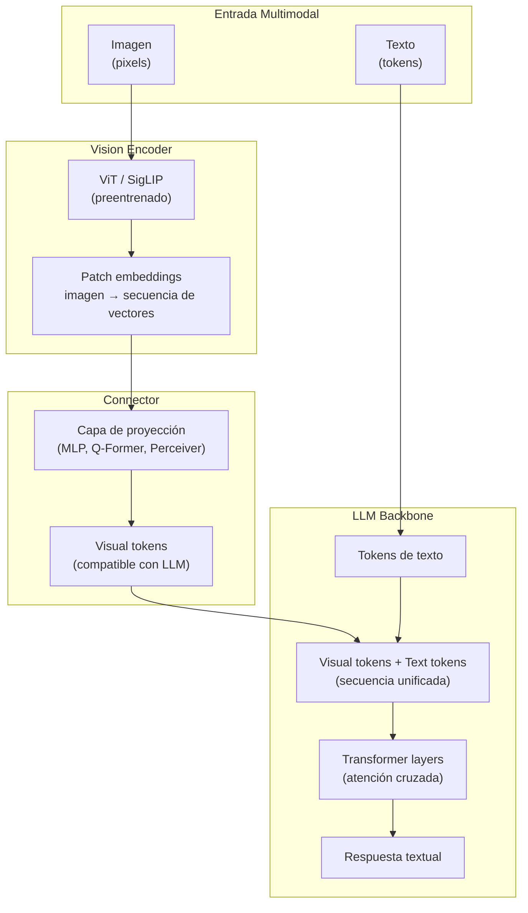
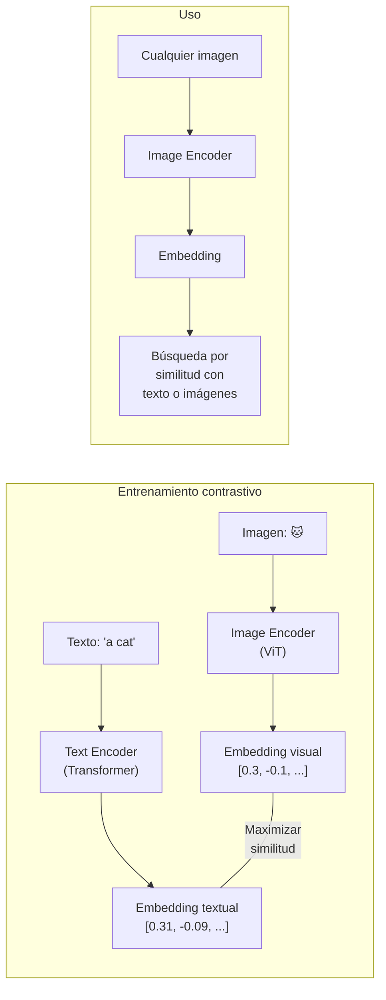

---
tags:
  - concepto
  - llm
  - multimodal
aliases:
  - modelos multimodales
  - vision-language models
  - VLMs
  - multimodal AI
created: 2025-06-01
updated: 2025-06-01
category: modelos-llm
status: current
difficulty: intermediate
related:
  - "[[transformer-architecture]]"
  - "[[embeddings]]"
  - "[[context-window]]"
  - "[[landscape-modelos]]"
  - "[[inference-optimization]]"
  - "[[hallucinations]]"
  - "[[razonamiento-llm]]"
up: "[[moc-llms]]"
---

# Modelos Multimodales

> [!abstract] Resumen
> Los **modelos multimodales** procesan y generan información en múltiples modalidades: texto, imagen, audio y video. La convergencia de 2024-2025 ha producido modelos como ==GPT-4o, Claude 3.5 y Gemini 2.0 que manejan nativamente múltiples modalidades en una sola arquitectura==. La clave arquitectónica es el *vision encoder* (típicamente basado en [[embeddings|CLIP o SigLIP]]) que convierte imágenes en representaciones compatibles con el espacio del LLM. Los modelos multimodales han abierto aplicaciones antes imposibles: análisis de documentos escaneados, comprensión de diagramas técnicos, navegación web visual, y agentes que interactúan con interfaces gráficas. ^resumen

## Qué es y por qué importa

Un **modelo multimodal** (*multimodal model*) es una red neuronal capaz de procesar y/o generar datos en más de una modalidad sensorial. En el contexto actual de LLMs, esto significa principalmente:

- **Entrada**: Texto + imágenes (más maduro), texto + audio (emergente), texto + video (experimental)
- **Salida**: Texto (dominante), imágenes (vía modelos de difusión integrados), audio (TTS integrado)

La importancia radica en que ==el ~80% de la información que los humanos manejan no es textual==. Documentos con tablas y gráficos, interfaces de usuario, fotografías, videos explicativos — todo esto era inaccesible para LLMs puramente textuales.

> [!tip] Cuándo usar modelos multimodales
> - **Usar cuando**: El input natural es visual (screenshots, documentos escaneados, diagramas), cuando necesitas análisis de imágenes combinado con razonamiento, o para agentes que interactúan con GUIs
> - **No usar cuando**: El problema es puramente textual — los modelos multimodales tienen overhead de procesamiento visual incluso cuando no se usa. Las capacidades de solo texto de un modelo dedicado pueden ser superiores
> - Ver [[landscape-modelos]] para comparativa detallada por capacidad

---

## Arquitecturas: cómo se conectan visión y lenguaje

### Patrón dominante: Vision Encoder + LLM

La arquitectura más común en 2025 conecta un *vision encoder* preentrenado con un LLM mediante una capa de proyección (*connector*).



### Componentes clave

**1. Vision Encoder (*codificador visual*)**

El *vision encoder* convierte una imagen en una secuencia de vectores que el LLM puede procesar. Los más utilizados:

| Encoder | Origen | Resolución típica | Tokens por imagen | Usado en |
|---------|--------|-------------------|-------------------|----------|
| **CLIP ViT-L/14** | OpenAI | 224×224 → 336×336 | 256-576 | LLaVA, muchos open-source |
| **SigLIP** | Google | 384×384 | 729 | ==PaliGemma, Gemini== |
| **EVA-CLIP** | BAAI | 448×448 | 1024 | InternVL |
| **DINOv2** | Meta | 518×518 | 1369 | Algunos modelos de investigación |
| **Propietarios** | Varios | Variable | Variable | GPT-4V, Claude 3, Gemini |

> [!info] Resolución y coste
> Cada *patch* de la imagen (típicamente 14×14 o 16×16 pixels) se convierte en un token visual. ==Una imagen de 1024×1024 con patches de 14×14 genera ~5,329 tokens==. Esto impacta directamente en el coste y en el consumo de la [[context-window|ventana de contexto]].

**2. Connector (*conector*)**

El conector traduce las representaciones visuales al espacio de embeddings del LLM:

| Tipo | Mecanismo | Ventaja | Desventaja |
|------|-----------|---------|------------|
| **MLP lineal** | Proyección directa | Simple, rápido | Puede perder información |
| **Q-Former** (BLIP-2) | Cross-attention con queries aprendidas | ==Reduce tokens visuales== | Más complejo de entrenar |
| **Perceiver Resampler** | Attention pooling | Flexible en número de tokens | Overhead computacional |
| **C-Abstractor** | Convolucional | Eficiente | Menos flexible |

**3. LLM Backbone**

El LLM procesa la secuencia intercalada de tokens visuales y textuales. En modelos más avanzados, hay *cross-attention* dedicada entre modalidades en lugar de simplemente concatenar las secuencias.

---

## Vision-Language Models: estado actual

### Modelos propietarios

| Modelo | Lanzamiento | Capacidades visuales | Fortalezas | Limitaciones |
|--------|-------------|---------------------|------------|-------------|
| **GPT-4o** | 2024 | Imágenes, audio, video | ==Mejor rendimiento general==, multimodal nativo | Caro, caja negra |
| **Claude 3.5 Sonnet** | 2024 | Imágenes | ==Excelente en documentos y código visual== | Sin audio/video nativo |
| **Claude Opus 4** | 2025 | Imágenes | Razonamiento visual profundo | Sin audio nativo |
| **Gemini 2.0 Flash** | 2025 | ==Imágenes, audio, video== | Nativo multimodal, largo contexto visual | Calidad variable en razonamiento |
| **Gemini 2.5 Pro** | 2025 | Imágenes, audio, video | ==Mejor multimodal overall== | Precio alto tier |

### Modelos open-source

| Modelo | Parámetros | Encoder | Capacidades | Benchmark (MMMU) |
|--------|-----------|---------|-------------|-------------------|
| **LLaVA-NeXT** | 7B-34B | CLIP ViT-L | Imágenes | ~48% (34B) |
| **InternVL 2.5** | 8B-78B | InternViT-6B | ==Imágenes, documentos== | ~62% (78B) |
| **Qwen2-VL** | 7B-72B | ViT propio | Imágenes, video | ~58% (72B) |
| **PaliGemma 2** | 3B-28B | SigLIP | Imágenes | ~52% (28B) |
| **Llama 3.2 Vision** | 11B-90B | Propio | Imágenes | ==~60% (90B)== |
| **Molmo** | 7B-72B | ViT | Imágenes, pointing | ~55% (72B) |

> [!success] Progreso notable
> En solo dos años (2023-2025), los modelos open-source multimodales han pasado de ser curiosidades académicas a ==competir seriamente con modelos propietarios en muchos benchmarks==. InternVL 2.5 y Qwen2-VL son particularmente impresionantes en análisis de documentos.

---

## Audio: más allá del texto

### Speech-to-Text (STT)

*Whisper* (OpenAI)[^1] revolucionó el reconocimiento de voz al demostrar que un modelo *Transformer* entrenado en 680,000 horas de audio supervisado puede igualar o superar sistemas comerciales.

| Modelo | Parámetros | WER (inglés) | WER (español) | Latencia | Nota |
|--------|-----------|-------------|---------------|----------|------|
| Whisper Large v3 | 1.5B | ==~3%== | ~5% | ~1x tiempo real | Open-source, referencia |
| Whisper Large v3 Turbo | 809M | ~3.5% | ~5.5% | ==~8x tiempo real== | Optimizado para velocidad |
| Deepgram Nova-2 | Propietario | ~3% | ~5% | Streaming | API comercial |
| AssemblyAI Universal-2 | Propietario | ~2.5% | ~4% | Streaming | API comercial |
| Google Chirp 2 | Propietario | ~3% | ~4.5% | Streaming | Integrado en Vertex AI |

> [!example]- Pipeline de audio multimodal
> ```mermaid
> flowchart LR
>     subgraph "Input"
>         A["Audio<br/>(wav/mp3)"]
>     end
>
>     subgraph "Procesamiento"
>         B["Mel spectrogram<br/>(80 bins)"]
>         C["Audio encoder<br/>(Whisper/USM)"]
>         D["Audio tokens"]
>     end
>
>     subgraph "Fusión con LLM"
>         E["Audio tokens +<br/>Text tokens"]
>         F["LLM reasoning"]
>     end
>
>     subgraph "Output"
>         G["Texto<br/>(transcripción)"]
>         H["Respuesta<br/>(comprensión)"]
>         I["Audio<br/>(TTS)"]
>     end
>
>     A --> B --> C --> D --> E --> F
>     F --> G
>     F --> H
>     F --> I
> ```

### Text-to-Speech (TTS)

La generación de voz ha experimentado una revolución con modelos neurales:

| Modelo | Tipo | Calidad (MOS) | Clonación de voz | Nota |
|--------|------|-------------|-----------------|------|
| **ElevenLabs** | Propietario | ==~4.5/5== | Sí (segundos) | ==Líder comercial== |
| **OpenAI TTS** | Propietario | ~4.3/5 | No (voces fijas) | Integrado en API |
| **Bark** | Open-source | ~3.8/5 | Limitada | Multilingüe |
| **XTTS v2** (Coqui) | Open-source | ~4.0/5 | ==Sí (3 segundos)== | Mejor open-source |
| **Fish Speech** | Open-source | ~4.1/5 | Sí | Muy rápido |
| **Sesame CSM** | Open-source | ~4.2/5 | Sí | Conversacional |

### Audio nativo en LLMs

GPT-4o marcó un hito al ser el primer modelo multimodal que procesa y genera audio ==de forma nativa==, sin pipeline separado de STT/TTS. Esto permite:

- Comprender tono, emoción, sarcasmo
- Generar respuestas con entonación apropiada
- Interrupciones naturales en conversación
- Latencia ultra-baja (~200ms round-trip)

> [!warning] Limitaciones del audio nativo
> Los modelos con audio nativo aún tienen problemas con:
> - **Alucinaciones auditivas**: Inventar palabras que no se dijeron
> - **Cambio de idioma**: Confusión cuando el hablante mezcla idiomas
> - **Ruido de fondo**: Degradación significativa en ambientes ruidosos
> - **Múltiples hablantes**: Dificultad para separar y seguir conversaciones

---

## Video: la frontera emergente

La comprensión de video por LLMs está en una fase más temprana que imágenes o audio, pero avanza rápidamente.

### Enfoques principales

1. **Muestreo de frames**: Extraer N frames equidistantes y procesarlos como múltiples imágenes. Simple pero pierde información temporal.
2. **Video encoders**: Modelos como TimeSformer o Video-MAE que capturan información espacio-temporal.
3. **Tokens comprimidos**: Representar el video completo como una secuencia comprimida de tokens (Gemini).

| Modelo | Método | Max duración | Tokens por minuto | Calidad |
|--------|--------|-------------|-------------------|---------|
| Gemini 2.5 Pro | ==Nativo== | ==~2 horas== | ~2,000 | ==Mejor== |
| GPT-4o | Frame sampling | ~3 min | ~5,000 | Buena |
| Qwen2-VL | Frame + temporal | ~10 min | ~3,000 | Buena |
| LLaVA-Video | Video encoder | ~5 min | ~2,500 | Razonable |
| Video-LLaMA 2 | Video Q-Former | ~3 min | ~1,500 | Razonable |

> [!question] Debate: comprensión temporal real
> - **Optimistas**: Modelos como Gemini procesan video "nativamente" y pueden entender acciones, causalidad temporal, y narrativas
> - **Escépticos**: La mayoría de los modelos realmente procesan frames individuales con algo de contexto temporal, sin comprensión profunda de dinámica temporal. Preguntas como "¿qué pasó justo después de X?" siguen siendo difíciles
> - **Mi valoración**: La comprensión de video actual es más "descripción de frames secuenciales" que verdadera comprensión temporal. Mejorará significativamente con arquitecturas diseñadas para video desde cero

---

## Multimodal Embeddings: CLIP y sucesores

### CLIP (*Contrastive Language-Image Pretraining*)

*CLIP*[^2] (OpenAI, 2021) fue el modelo fundacional que alineó representaciones de imágenes y texto en un ==espacio de embeddings compartido==. Entrenado con 400 millones de pares imagen-texto de internet.



### Evolución de embeddings multimodales

| Modelo | Año | Modalidades | Dimensión | Mejora sobre CLIP | Disponibilidad |
|--------|-----|-----------|-----------|-------------------|----------------|
| **CLIP** | 2021 | Imagen + Texto | 512-768 | Baseline | Open-source |
| **OpenCLIP** | 2022 | Imagen + Texto | 512-1024 | Datos mejores | Open-source |
| **SigLIP** | 2023 | Imagen + Texto | 768-1152 | ==Función sigmoid== vs softmax, más estable | Open-source |
| **EVA-CLIP** | 2023 | Imagen + Texto | 768-1024 | EVA pretraining | Open-source |
| **ImageBind** | 2023 | ==6 modalidades== | 1024 | Audio, depth, thermal, IMU | Open-source |
| **ONE-PEACE** | 2023 | Imagen + Audio + Texto | 1536 | Unificado | Open-source |

> [!tip] SigLIP vs CLIP para nuevos proyectos
> Para proyectos nuevos en 2025, ==preferir SigLIP sobre CLIP==:
> - Entrenamiento con *sigmoid loss* en lugar de *softmax* permite batch sizes más grandes
> - Mejor rendimiento zero-shot en benchmarks estándar
> - Base del vision encoder de PaliGemma y Gemini
> - Compatible con los mismos pipelines que CLIP

### Aplicaciones de embeddings multimodales

1. **Búsqueda visual** (*visual search*): Buscar imágenes con consultas de texto o viceversa
2. **Clasificación zero-shot**: Clasificar imágenes sin entrenamiento adicional
3. **Retrieval multimodal para RAG**: Indexar documentos con imágenes y recuperarlos por similitud semántica
4. **Detección de contenido**: Comparar imágenes con descripciones de contenido prohibido

---

## Casos de uso y limitaciones

### Aplicaciones maduras en producción (2025)

> [!success] Aplicaciones con alto impacto demostrado
> - **Análisis de documentos**: Extraer datos de formularios, facturas, recibos — ==reemplaza OCR tradicional con comprensión semántica==
> - **Accesibilidad**: Descripción de imágenes para usuarios con discapacidad visual
> - **Moderación de contenido**: Detección de contenido inapropiado en imágenes y video
> - **Asistentes de código visual**: Analizar screenshots de errores, diagramas UML, wireframes
> - **Retail**: Búsqueda visual de productos, try-on virtual
> - **Medicina**: Análisis asistido de radiografías, dermatología (con supervisión médica)

### Limitaciones actuales

> [!failure] Limitaciones críticas
> - **Conteo**: Los VLMs fallan consistentemente al contar objetos en imágenes (>5 objetos)
> - **Razonamiento espacial**: Dificultad con "izquierda de", "detrás de", posiciones relativas precisas
> - **Texto en imágenes**: Aunque ha mejorado, la lectura de texto (OCR) en imágenes con fuentes pequeñas, ángulos, o calidad baja sigue siendo imperfecta
> - **Alucinaciones visuales**: ==Describir objetos que no están en la imagen== es un problema persistente (ver [[hallucinations]])
> - **Comprensión de gráficos**: Interpretar correctamente ejes, escalas y tendencias en gráficos complejos
> - **Identidad de personas**: Limitaciones éticas y técnicas en reconocimiento facial

> [!danger] Riesgos en producción
> - Las [[hallucinations|alucinaciones]] visuales pueden tener consecuencias graves en aplicaciones médicas o de seguridad
> - Los modelos pueden ser engañados por *adversarial images* diseñadas para causar clasificaciones erróneas
> - El sesgo en datos de entrenamiento visuales afecta a representaciones culturales y demográficas
> - La privacidad es un riesgo cuando se procesan imágenes con información personal sensible

---

## Estado del arte (2025-2026)

### Tendencias principales

1. **Omni-models**: Modelos que procesan y generan todas las modalidades de forma nativa (texto, imagen, audio, video) en una sola arquitectura unificada. GPT-4o fue el primero, Gemini 2.0 y modelos open-source están siguiendo
2. **Any-to-Any generation**: La capacidad de convertir entre cualquier par de modalidades (texto→imagen, audio→texto, imagen→audio)
3. **Agentes visuales**: Modelos que pueden navegar interfaces gráficas, hacer click en botones, y operar software — una aplicación directa de la comprensión visual para [[anatomia-agente|agentes de IA]]
4. **World models**: Modelos que no solo describen sino que ==predicen== cómo evolucionará una escena visual, habilitando planificación y robótica

> [!example]- Benchmarks multimodales relevantes (2025)
> | Benchmark | Qué evalúa | Líder (2025) | Score |
> |-----------|-----------|-------------|-------|
> | **MMMU** | Razonamiento multimodal universitario | Gemini 2.5 Pro | ~75% |
> | **MathVista** | Matemáticas con componente visual | Claude Opus 4 | ~72% |
> | **DocVQA** | Comprensión de documentos | GPT-4o | ~93% |
> | **ChartQA** | Comprensión de gráficos | Gemini 2.5 Pro | ~88% |
> | **AI2D** | Diagramas científicos | InternVL 2.5 | ~85% |
> | **OCRBench** | Reconocimiento de texto en imágenes | Qwen2-VL | ~82% |
> | **Video-MME** | Comprensión de video | Gemini 2.5 Pro | ~70% |

---

## Relación con el ecosistema

> [!info] Conexiones con mis herramientas
> - **[[intake-overview|intake]]**: Capacidad multimodal permite a *intake* procesar diagramas de arquitectura, wireframes y screenshots como parte de las especificaciones de un proyecto. Futura integración para interpretar diagramas UML directamente
> - **[[architect-overview|architect]]**: *Architect* puede generar y verificar diagramas de arquitectura usando visión, comparando el diseño propuesto con diagramas de referencia
> - **[[vigil-overview|vigil]]**: Potencial uso de visión para analizar screenshots de dashboards de seguridad o interpretar reportes visuales de vulnerabilidades
> - **[[licit-overview|licit]]**: Análisis de documentos de compliance que incluyen tablas, sellos, y formularios regulatorios — un caso de uso natural para VLMs que combinan OCR con comprensión semántica

---

## Enlaces y referencias

**Notas relacionadas:**
- [[transformer-architecture]] — Base arquitectónica de los vision encoders
- [[embeddings]] — Embeddings multimodales como extensión de embeddings textuales
- [[context-window]] — Los tokens visuales consumen ventana de contexto
- [[hallucinations]] — Alucinaciones visuales como extensión del problema textual
- [[landscape-modelos]] — Comparativa detallada de modelos multimodales
- [[inference-optimization]] — Optimización de inferencia para modelos multimodales

> [!quote]- Referencias bibliográficas
> - Radford et al., "Learning Transferable Visual Models From Natural Language Supervision" (CLIP), ICML 2021
> - Radford et al., "Robust Speech Recognition via Large-Scale Weak Supervision" (Whisper), 2022
> - Liu et al., "Visual Instruction Tuning" (LLaVA), NeurIPS 2023
> - Zhai et al., "Sigmoid Loss for Language Image Pre-Training" (SigLIP), ICCV 2023
> - Google, "Gemini: A Family of Highly Capable Multimodal Models", 2024
> - OpenAI, "GPT-4o System Card", 2024
> - Anthropic, "The Claude 3 Model Family", 2024

[^1]: Radford et al., "Robust Speech Recognition via Large-Scale Weak Supervision" (Whisper), arXiv:2212.04356, 2022.
[^2]: Radford et al., "Learning Transferable Visual Models From Natural Language Supervision" (CLIP), ICML 2021. Paper fundacional de embeddings multimodales contrastivos.
