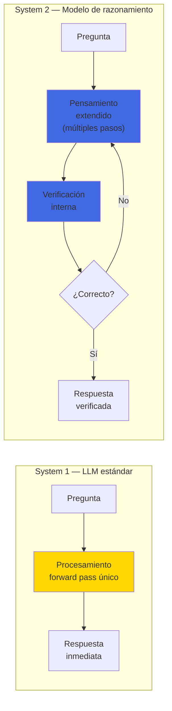
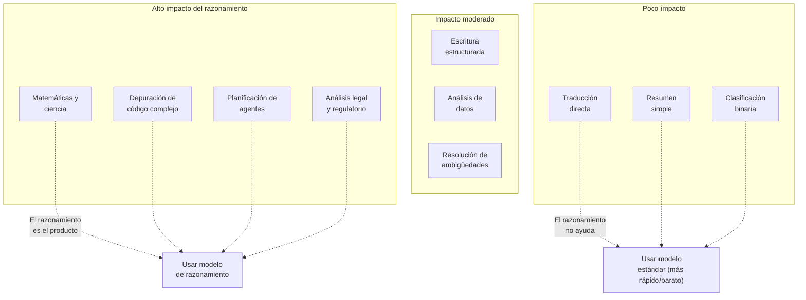

---
tags:
  - concepto
  - llm
  - razonamiento
aliases:
  - reasoning LLM
  - razonamiento en modelos de lenguaje
  - modelos de razonamiento
  - chain-of-thought
created: 2025-06-01
updated: 2025-06-01
category: modelos-llm
status: current
difficulty: intermediate
related:
  - "[[transformer-architecture]]"
  - "[[hallucinations]]"
  - "[[context-window]]"
  - "[[inference-optimization]]"
  - "[[chain-of-thought]]"
  - "[[landscape-modelos]]"
  - "[[pricing-llm-apis]]"
up: "[[moc-llms]]"
---

# Razonamiento en LLMs

> [!abstract] Resumen
> El razonamiento en LLMs ha evolucionado desde el descubrimiento de *chain-of-thought* como capacidad emergente (2022) hasta los ==modelos dedicados de razonamiento como o1, o3, Claude con *extended thinking*, y DeepSeek R1 (2024-2025)==. Estos modelos implementan una forma de *test-time compute scaling*: en lugar de generar respuestas inmediatas, ==invierten más computación durante la inferencia "pensando" antes de responder==. La analogía con el *System 1* (rápido, intuitivo) vs *System 2* (lento, deliberado) de Kahneman[^1] es imperfecta pero útil. Los resultados en matemáticas, código y lógica son impresionantes, pero el debate sobre si los LLMs realmente "razonan" o solo simulan razonamiento sigue abierto. ^resumen

## Qué es y por qué importa

El **razonamiento** (*reasoning*) en LLMs se refiere a la capacidad de descomponer problemas complejos en pasos intermedios, aplicar lógica, y llegar a conclusiones que no están directamente en los datos de entrenamiento. Es distinto de la simple recuperación de información memorizada.

La importancia es fundamental: ==sin razonamiento, los LLMs son bases de datos sofisticadas; con razonamiento, son herramientas de resolución de problemas==. La diferencia determina si un LLM puede:

- Resolver problemas de matemáticas nuevos (no memorizados)
- Depurar código analizando causa y efecto
- Planificar secuencias de acciones para [[anatomia-agente|agentes de IA]]
- Analizar argumentos legales con lógica formal

> [!tip] Cuándo usar modelos de razonamiento
> - **Usar cuando**: El problema requiere múltiples pasos lógicos, matemáticas, análisis de código complejo, planificación, o cuando la precisión es más importante que la velocidad
> - **No usar cuando**: La tarea es simple (clasificación, resumen, traducción directa), la latencia es crítica, o el coste es una restricción fuerte
> - Ver [[chain-of-thought]] para técnicas de prompting que inducen razonamiento en modelos estándar

---

## Chain-of-Thought: el descubrimiento fundacional

### La capacidad emergente

En 2022, Wei et al.[^2] demostraron que ==añadir "Let's think step by step" a un prompt podía mejorar dramáticamente el rendimiento en tareas de razonamiento==. Este fenómeno, llamado *chain-of-thought prompting* (CoT), fue una de las primeras "capacidades emergentes" documentadas en LLMs grandes.

El descubrimiento clave fue que el razonamiento paso a paso ==solo emergía en modelos suficientemente grandes== (~100B+ parámetros). Modelos más pequeños no mejoraban con CoT e incluso empeoraban.

> [!example]- Ejemplo de Chain-of-Thought
> ```
> SIN CoT:
> Pregunta: Roger tiene 5 pelotas de tenis. Compra 2 latas más
> de pelotas, cada una tiene 3. ¿Cuántas tiene ahora?
> Respuesta: 11 ✓ (puede acertar por memorización)
>
> CON CoT:
> Pregunta: [misma]
> Respuesta: Roger empezó con 5 pelotas. Compró 2 latas con
> 3 pelotas cada una. 2 × 3 = 6 pelotas nuevas. 5 + 6 = 11.
> La respuesta es 11. ✓
>
> La diferencia importa en problemas más complejos donde la
> respuesta directa falla pero el razonamiento paso a paso
> permite descomponer el problema.
> ```

### Variantes de Chain-of-Thought

| Técnica | Mecanismo | Mejora típica | Cuándo usar |
|---------|-----------|--------------|-------------|
| **Zero-shot CoT** | "Let's think step by step" | 10-40% en razonamiento | Cuando no hay ejemplos disponibles |
| **Few-shot CoT** | Ejemplos con pasos explícitos | ==20-60% en razonamiento== | Cuando hay ejemplos de referencia |
| **Self-consistency** | Múltiples cadenas, voto mayoritario | 5-15% adicional | Cuando la precisión es crítica |
| **Tree-of-Thought** | Explorar múltiples ramas de razonamiento | Variable | Problemas con múltiples soluciones |
| **Program-of-Thought** | Generar código para calcular | ==Muy alto en matemáticas== | Problemas cuantitativos |

---

## System 1 vs System 2: la analogía

Daniel Kahneman[^1] distinguió dos sistemas de pensamiento humano:

- **System 1**: Rápido, automático, intuitivo, sin esfuerzo. "¿Cuánto es 2+2?"
- **System 2**: Lento, deliberado, requiere concentración. "¿Cuánto es 347 × 28?"



> [!warning] Los límites de la analogía
> La analogía System 1/System 2 es útil pero imperfecta:
> - Los humanos tienen experiencias fenomenológicas diferentes entre ambos sistemas. Los LLMs ejecutan transformaciones matemáticas en ambos casos
> - System 2 humano involucra metacognición real; los modelos de razonamiento ejecutan un entrenamiento que les enseñó a "aparentar" metacognición
> - ==La frontera entre System 1 y System 2 en LLMs es artificial== — es una decisión de diseño, no una propiedad emergente natural

---

## Modelos de razonamiento: la nueva generación

### OpenAI o1 y o3

OpenAI o1 (septiembre 2024) fue el primer modelo comercial diseñado específicamente para razonamiento extendido. Utiliza una *chain-of-thought interna* que no es visible para el usuario pero que puede extenderse durante segundos o minutos.

- **o1-preview**: Primera versión, mejora significativa en matemáticas y código
- **o1**: Versión completa, ==primer modelo en superar el 90% en AIME (competencia de matemáticas)==
- **o3**: Evolución con mejor rendimiento en ARC-AGI y razonamiento general
- **o4-mini**: Versión eficiente, mejor relación rendimiento/coste

> [!info] Test-time compute scaling
> La idea central es que ==un modelo puede mejorar invirtiendo más computación durante la inferencia==, no solo durante el entrenamiento. OpenAI demostró que duplicar el *test-time compute* mejora el rendimiento de forma predecible en tareas de razonamiento, creando una nueva ley de escalado.

### Claude con Extended Thinking

Anthropic introdujo *extended thinking* en Claude 3.5 y lo refinó significativamente en Claude Opus 4. A diferencia de o1, ==el pensamiento extendido de Claude es parcialmente visible==, lo que permite al usuario entender el proceso de razonamiento.

Características distintivas:
- **Transparencia parcial**: Los tokens de "pensamiento" se muestran (con filtering de seguridad)
- **Control del usuario**: Se puede ajustar el presupuesto de tokens de pensamiento
- **Integración con herramientas**: El pensamiento extendido puede decidir cuándo invocar herramientas externas

### DeepSeek R1

*DeepSeek R1*[^3] es notable por ser el ==primer modelo de razonamiento open-source competitivo con o1==. Publicado con pesos abiertos, demostró que:

1. El entrenamiento de modelos de razonamiento es reproducible fuera de OpenAI
2. ==GRPO (*Group Relative Policy Optimization*) puede reemplazar PPO== para RL de razonamiento, siendo más eficiente
3. Modelos destilados de R1 (1.5B-70B) mantienen capacidades de razonamiento sorprendentes

> [!example]- Arquitectura del entrenamiento de DeepSeek R1
> ```mermaid
> flowchart TD
>     A["DeepSeek V3 Base<br/>(671B MoE)"] --> B["SFT con datos<br/>de razonamiento"]
>     B --> C["RL con GRPO"]
>     C --> D{"¿Respuesta<br/>correcta?"}
>     D -->|"Sí"| E["Reward +1"]
>     D -->|"No"| F["Reward -1"]
>     E --> G["Actualizar política"]
>     F --> G
>     G --> C
>
>     C --> H["DeepSeek R1<br/>(modelo de razonamiento)"]
>     H --> I["Destilación"]
>     I --> J["R1-Distill-Qwen-32B"]
>     I --> K["R1-Distill-Llama-70B"]
>     I --> L["R1-Distill-Qwen-1.5B"]
>
>     style H fill:#4169e1
> ```

### Comparativa de modelos de razonamiento (2025)

| Modelo | Organización | Parámetros | Open-source | AIME 2024 | MATH-500 | Código (SWE-bench) |
|--------|-------------|-----------|-------------|-----------|----------|---------------------|
| **o3** | OpenAI | Desconocido | No | ==~95%== | ~98% | ~50% |
| **o4-mini** | OpenAI | Desconocido | No | ~88% | ~95% | ~45% |
| **Claude Opus 4** | Anthropic | Desconocido | No | ~90% | ==~97%== | ==~55%== |
| **Gemini 2.5 Pro** | Google | Desconocido | No | ~92% | ~96% | ~48% |
| **DeepSeek R1** | DeepSeek | 671B (MoE) | ==Sí== | ~80% | ~92% | ~42% |
| **Qwen3-235B** | Alibaba | 235B (MoE) | Sí | ~75% | ~88% | ~38% |

---

## Test-Time Compute Scaling

El *test-time compute scaling* (escalado de computación en tiempo de inferencia) es el principio fundamental detrás de los modelos de razonamiento.

### La idea

Tradicionalmente, la calidad de un modelo se determina durante el entrenamiento: más datos, más parámetros, más compute de entrenamiento → mejor modelo. Los modelos de razonamiento añaden una dimensión nueva: ==más compute durante la inferencia → mejores respuestas==.

| Dimensión de escalado | Fase | Ejemplo | Coste |
|----------------------|------|---------|-------|
| Parámetros del modelo | Entrenamiento | 7B → 70B → 405B | Fijo (una vez) |
| Datos de entrenamiento | Entrenamiento | 1T → 15T tokens | Fijo (una vez) |
| **Tokens de pensamiento** | ==Inferencia== | 100 → 10,000 → 100,000 tokens | ==Variable (por request)== |

> [!danger] Implicación de coste
> El test-time compute scaling tiene un coste directo por cada request. Un problema de matemáticas que requiere 50,000 tokens de "pensamiento" interno cuesta ==50x más que una respuesta directa de 1,000 tokens==. Esto hace que los modelos de razonamiento sean significativamente más caros para tareas que los necesitan. Ver [[pricing-llm-apis]] para impacto económico.

### Leyes de escalado observadas

Los investigadores han observado que:

1. **Log-lineal**: El rendimiento en benchmarks de razonamiento mejora log-linealmente con el compute de inferencia
2. **Rendimientos decrecientes**: Pero hay un punto de saturación donde más "pensamiento" no ayuda
3. **Dependencia del problema**: Problemas fáciles no se benefician de más compute; problemas difíciles sí
4. **Optimal compute allocation**: Para un presupuesto fijo, es mejor ==un modelo mediano con mucho test-time compute que un modelo enorme con poco==

---

## Limitaciones del razonamiento en LLMs

### Fallos sistemáticos

> [!failure] Tipos de fallos de razonamiento
> 1. **Errores aritméticos**: Los LLMs siguen cometiendo errores en multiplicaciones de números grandes, aunque los modelos de razonamiento han reducido esto significativamente
> 2. **Razonamiento causal inverso**: Confundir correlación con causalidad, o invertir la dirección causal
> 3. **Sensibilidad al formato**: ==Cambiar la formulación de un problema puede cambiar la respuesta==, lo que sugiere pattern matching más que comprensión
> 4. **Composicionalidad limitada**: Combinar múltiples reglas lógicas simultáneamente sigue siendo difícil
> 5. **Contrafactuales**: Razonar sobre "¿qué pasaría si...?" con premisas falsas provoca confusión
> 6. **Problemas de planificación**: Tareas que requieren anticipar muchos pasos (como ajedrez) exponen limitaciones fundamentales

### El problema de la "apariencia de razonamiento"

> [!question] Debate fundamental: ¿razonan realmente los LLMs?
> Este es quizás el debate más importante en IA actual:
>
> - **Posición funcionalista**: Si el output es indistinguible del razonamiento, ==es== razonamiento. No importa el mecanismo interno. Los LLMs de razonamiento resuelven problemas nuevos que no están en sus datos de entrenamiento, lo cual es evidencia de generalización
>
> - **Posición escéptica**: Los LLMs ejecutan *pattern matching sofisticado* sobre distribuciones estadísticas. Pueden parecer razonar en problemas similares a su entrenamiento, pero fallan sistemáticamente en distribuciones fuera de lo visto. Los famosos "fallos estúpidos" (e.g., problemas triviales reformulados) revelan la fragilidad
>
> - **Posición intermedia**: Los LLMs tienen una forma de razonamiento que es ==cualitativamente diferente al humano pero genuinamente útil==. No es "verdadero razonamiento" en sentido filosófico, pero tampoco es mera memorización. Es una categoría nueva que necesita su propio marco conceptual
>
> Mi valoración: Los modelos de razonamiento como o3 y Claude Opus 4 muestran capacidades de generalización que van más allá del pattern matching simple, pero sus fallos en problemas aparentemente triviales sugieren que su "razonamiento" opera bajo principios fundamentalmente distintos al humano. ==La utilidad práctica es innegable; la naturaleza teórica sigue en debate==.

---

## Benchmarks de razonamiento

### Benchmarks principales

| Benchmark | Qué evalúa | Rango de dificultad | Saturación (2025) |
|-----------|-----------|---------------------|-------------------|
| **GSM8K** | Matemáticas de primaria (8K problemas) | Fácil | ==~98% (saturado)== |
| **MATH** | Matemáticas de competencia (12.5K problemas) | Medio-Alto | ~97% |
| **AIME** | Competencia matemática americana (30 problemas/año) | Alto | ~95% |
| **ARC-AGI** | Abstracción y razonamiento por analogía visual | ==Muy alto== | ~88% |
| **GPQA Diamond** | Preguntas de doctorado (198 problemas) | Experto | ~75% |
| **FrontierMath** | Matemáticas de investigación abierta | Extremo | ==~30%== |
| **SWE-bench Verified** | Resolver issues reales de GitHub | Alto (código) | ~55% |
| **Codeforces** | Competencia de programación | Alto | Rating ~1800 |

> [!warning] La trampa del benchmark
> Los benchmarks están siendo saturados a un ritmo preocupante. GSM8K, que parecía difícil en 2023, es trivial en 2025. Esto plantea dos preguntas:
> 1. ¿Los modelos realmente aprendieron a razonar, o memorizaron patrones de estos benchmarks específicos?
> 2. ¿Necesitamos benchmarks fundamentalmente diferentes que evalúen razonamiento "puro"?
>
> ==FrontierMath y ARC-AGI son intentos de crear benchmarks resistentes a la saturación==, pero incluso estos están siendo abordados más rápido de lo esperado.

### El caso especial de ARC-AGI

*ARC-AGI*[^4] (François Chollet, 2019) merece mención especial. Diseñado para evaluar inteligencia general abstracta, presenta puzzles visuales de patrones que requieren inferir reglas a partir de pocos ejemplos. Ningún LLM podía superar el 5% hasta que modelos de razonamiento con test-time compute lo llevaron a ~88%.

> [!example]- Cómo funciona un problema ARC
> ```
> EJEMPLO:
> Input:  [1,0,0]    Output: [0,0,1]
>         [0,1,0]            [0,1,0]
>         [0,0,1]            [1,0,0]
>
> Input:  [1,1,0]    Output: [0,1,1]
>         [0,0,1]            [1,0,0]
>
> TEST:
> Input:  [0,1,0]    Output: ???
>         [1,0,1]
>         [0,0,0]
>
> Regla inferida: "Invertir horizontalmente (espejo)"
> Output esperado: [0,1,0]
>                  [1,0,1]
>                  [0,0,0]
>
> Los LLMs deben inferir la regla a partir de 2-3 ejemplos
> y aplicarla al caso de prueba — razonamiento inductivo puro.
> ```

---

## Aplicaciones prácticas del razonamiento

### Dónde brillan los modelos de razonamiento



### Patrones de uso en producción

| Patrón | Descripción | Ejemplo |
|--------|-------------|---------|
| **Razonamiento selectivo** | Usar modelo de razonamiento solo para problemas difíciles | Router que clasifica complejidad y dirige a modelo apropiado |
| **Verificación por razonamiento** | Modelo estándar genera, modelo de razonamiento verifica | Generar código con Sonnet, verificar con Opus |
| **Razonamiento como planificador** | El modelo de razonamiento planifica, modelos rápidos ejecutan | ==Orquestador o3 + ejecutores Haiku== |
| **Budget de pensamiento** | Limitar tokens de pensamiento según urgencia/importancia | Chatbot con 1K tokens de pensamiento, análisis con 50K |

---

## Estado del arte (2025-2026)

### Convergencia de enfoques

La tendencia más notable es que ==todos los principales proveedores están convergiendo hacia modelos que combinan respuesta rápida y razonamiento extendido en un solo modelo==:

- **OpenAI**: o4-mini puede operar en modo rápido o razonamiento profundo
- **Anthropic**: Claude puede activar *extended thinking* selectivamente
- **Google**: Gemini 2.5 Pro tiene modo "thinking" opcional
- **Open-source**: Qwen3 introduce "think mode" togglable

> [!info] La unificación System 1/System 2
> En lugar de modelos separados para "rápido" y "profundo", la tendencia es ==un solo modelo que ajusta dinámicamente su profundidad de razonamiento== según la dificultad detectada del problema. Esto es más natural y eficiente que mantener dos modelos.

### Fronteras de investigación

1. **Faithful reasoning**: ¿La *chain-of-thought* visible refleja realmente el razonamiento interno del modelo? Investigación sugiere que no siempre[^5]
2. **Process reward models**: Entrenar modelos que evalúan cada paso del razonamiento, no solo la respuesta final
3. **Compositional generalization**: Mejorar la capacidad de combinar reglas aprendidas de maneras nuevas
4. **Formal verification integration**: Conectar razonamiento de LLMs con demostradores formales (Lean, Coq) para verificar matemáticas

---

## Relación con el ecosistema

> [!info] Conexiones con mis herramientas
> - **[[intake-overview|intake]]**: *Intake* se beneficia de modelos de razonamiento para descomponer especificaciones complejas en tareas atómicas. El razonamiento permite entender dependencias implícitas entre requisitos
> - **[[architect-overview|architect]]**: ==El *Ralph loop* de architect es esencialmente test-time compute scaling aplicado al diseño de software==. Cada iteración de diseño-review-mejora es un paso de "razonamiento" sobre la arquitectura
> - **[[vigil-overview|vigil]]**: El análisis de seguridad de dependencias requiere razonamiento sobre cadenas de confianza y escenarios de ataque — un caso donde los modelos de razonamiento superan significativamente a los estándar
> - **[[licit-overview|licit]]**: El análisis de compliance regulatorio es fundamentalmente un problema de razonamiento legal. *Licit* necesita los mejores modelos de razonamiento disponibles para interpretar correctamente las regulaciones y su aplicación

---

## Enlaces y referencias

**Notas relacionadas:**
- [[chain-of-thought]] — Técnica de prompting que inicia esta línea
- [[hallucinations]] — Los modelos de razonamiento alucinan diferente (más confidentes)
- [[context-window]] — El pensamiento extendido consume ventana de contexto
- [[inference-optimization]] — Speculative decoding para modelos de razonamiento
- [[pricing-llm-apis]] — Coste de test-time compute
- [[landscape-modelos]] — Comparativa general que incluye capacidades de razonamiento

> [!quote]- Referencias bibliográficas
> - Kahneman, D., "Thinking, Fast and Slow", 2011
> - Wei et al., "Chain-of-Thought Prompting Elicits Reasoning in Large Language Models", NeurIPS 2022
> - DeepSeek AI, "DeepSeek-R1: Incentivizing Reasoning Capability in LLMs via Reinforcement Learning", 2025
> - Chollet, F., "On the Measure of Intelligence", arXiv:1911.01547, 2019
> - Turpin et al., "Language Models Don't Always Say What They Think", NeurIPS 2023
> - OpenAI, "Learning to Reason with LLMs", Blog post, 2024
> - Anthropic, "Extended Thinking in Claude", 2025

[^1]: Kahneman, D., "Thinking, Fast and Slow", Farrar, Straus and Giroux, 2011. Marco de referencia para los dos sistemas de pensamiento.
[^2]: Wei et al., "Chain-of-Thought Prompting Elicits Reasoning in Large Language Models", NeurIPS 2022. Paper fundacional de CoT prompting.
[^3]: DeepSeek AI, "DeepSeek-R1: Incentivizing Reasoning Capability in LLMs via Reinforcement Learning", arXiv:2501.12948, 2025.
[^4]: Chollet, F., "On the Measure of Intelligence", arXiv:1911.01547, 2019. Propone ARC como benchmark de inteligencia general.
[^5]: Turpin et al., "Language Models Don't Always Say What They Think: Unfaithful Explanations in Chain-of-Thought Prompting", NeurIPS 2023.
