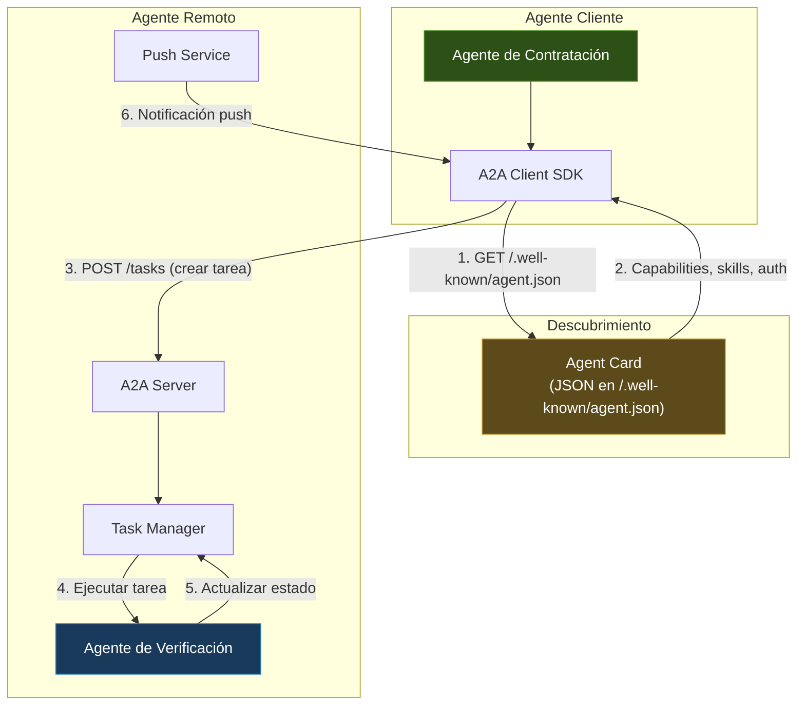
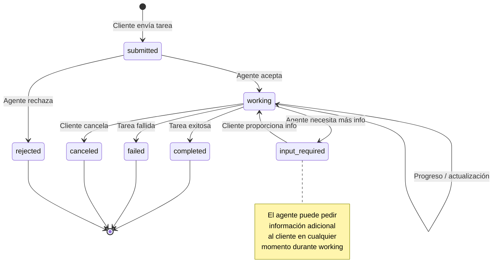
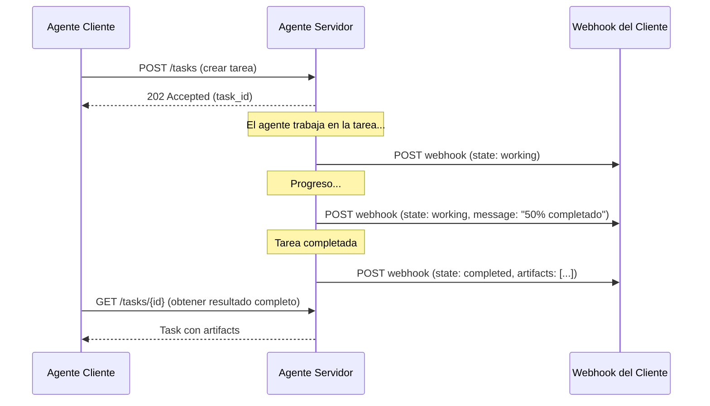
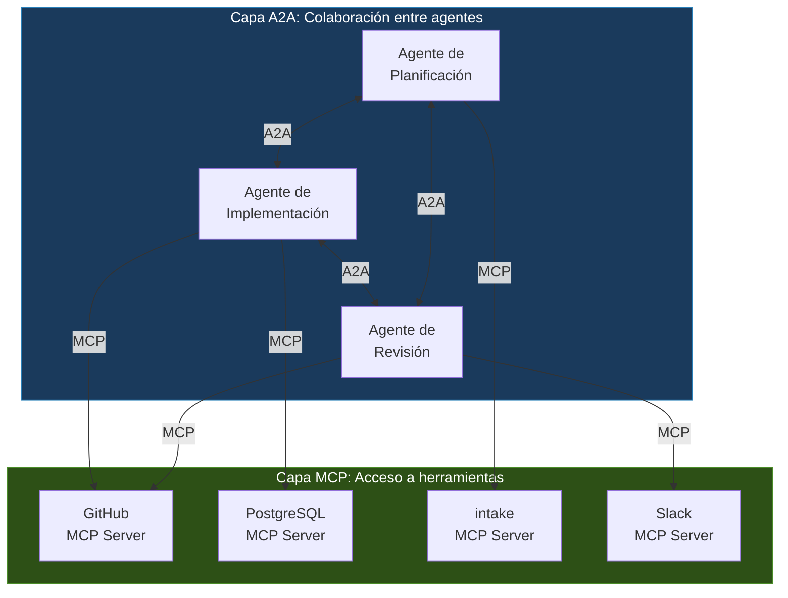

---
tags:
  - concepto
  - agentes
  - protocolos-agentes
aliases:
  - Agent-to-Agent Protocol
  - A2A
  - protocolo A2A
  - Google A2A
created: 2025-06-01
updated: 2025-06-01
category: agent-protocols
status: current
difficulty: advanced
related:
  - "[[mcp-protocol]]"
  - "[[agent-frameworks-comparison]]"
  - "[[agent-loop]]"
  - "[[agent-identity]]"
  - "[[agent-tools]]"
  - "[[architect-overview]]"
  - "[[llm-api-design]]"
  - "[[seguridad-agentes]]"
up: "[[moc-agentes]]"
---

# Agent-to-Agent Protocol (A2A)

> [!abstract] Resumen
> El *Agent-to-Agent Protocol* (A2A) es un protocolo abierto creado por Google que estandariza la comunicación entre agentes de IA independientes. Mientras [[mcp-protocol|MCP]] conecta modelos con herramientas (vertical), ==A2A conecta agentes entre sí (horizontal)==, permitiendo que agentes construidos con diferentes frameworks, por diferentes equipos y en diferentes infraestructuras colaboren en tareas complejas. El protocolo se estructura en torno a tres conceptos clave: *Agent Cards* (descubrimiento de capacidades), un ciclo de vida de tareas con estados definidos (pending, working, done, failed), y un sistema de notificaciones push. ==A2A y MCP son complementarios, no competidores: juntos definen el stack de comunicación completo para sistemas multi-agente==. ^resumen

## Qué es y por qué importa

El **Agent-to-Agent Protocol** (*A2A*) fue anunciado por Google en abril de 2025 como respuesta a un problema emergente: a medida que las organizaciones despliegan múltiples agentes de IA, ==estos agentes necesitan coordinarse entre sí, no solo con herramientas==.

El escenario motivador es claro:

- Una empresa tiene un agente de contratación (creado con [[agent-frameworks-comparison|CrewAI]])
- Otro agente de verificación de antecedentes (creado con Semantic Kernel)
- Otro agente de onboarding (creado custom)
- Necesitan colaborar en el proceso de incorporación de un empleado

Sin A2A, cada par de agentes necesita una integración custom. Con A2A, cada agente expone una interfaz estándar y cualquier otro agente puede descubrir sus capacidades y enviarle tareas.

> [!tip] La diferencia fundamental con MCP
> - **[[mcp-protocol|MCP]]**: Un modelo/agente llama a una herramienta. Relación master-slave. El modelo controla, la herramienta ejecuta
> - **A2A**: Un agente delega una tarea a otro agente. Relación peer-to-peer. El agente receptor tiene autonomía sobre cómo ejecutar la tarea
> - Ver la sección de comparación más adelante para un análisis detallado

---

## Arquitectura del protocolo

A2A define una arquitectura basada en HTTP con tres componentes principales:



---

## Agent Cards: descubrimiento de capacidades

El *Agent Card* es el mecanismo de descubrimiento de A2A. Cada agente que soporta A2A publica un documento JSON en una URL conocida (`/.well-known/agent.json`) que describe quién es y qué puede hacer.

> [!example]- Ejemplo completo de un Agent Card
> ```json
> {
>   "name": "Background Verification Agent",
>   "description": "Agente especializado en verificación de antecedentes laborales y educativos",
>   "version": "1.2.0",
>   "url": "https://agents.empresa.com/verification",
>   "provider": {
>     "organization": "HR Tech Corp",
>     "url": "https://hrtech.com"
>   },
>   "capabilities": {
>     "streaming": true,
>     "pushNotifications": true,
>     "stateTransitionHistory": true
>   },
>   "skills": [
>     {
>       "id": "verify-employment",
>       "name": "Verificación de empleo",
>       "description": "Verifica historial laboral del candidato con empleadores anteriores",
>       "inputModes": ["text/plain", "application/json"],
>       "outputModes": ["application/json", "application/pdf"]
>     },
>     {
>       "id": "verify-education",
>       "name": "Verificación educativa",
>       "description": "Verifica títulos y certificaciones con instituciones educativas",
>       "inputModes": ["text/plain"],
>       "outputModes": ["application/json"]
>     },
>     {
>       "id": "criminal-check",
>       "name": "Verificación de antecedentes penales",
>       "description": "Consulta bases de datos de antecedentes penales",
>       "inputModes": ["application/json"],
>       "outputModes": ["application/json"]
>     }
>   ],
>   "authentication": {
>     "schemes": ["bearer"],
>     "credentials": "oauth2"
>   },
>   "defaultInputModes": ["text/plain", "application/json"],
>   "defaultOutputModes": ["application/json"]
> }
> ```

### Componentes del Agent Card

| Campo | Propósito | Obligatorio |
|---|---|---|
| `name` | Nombre legible del agente | Sí |
| `description` | Descripción de qué hace el agente | Sí |
| `url` | Endpoint base del agente | Sí |
| `skills` | Lista de habilidades específicas | Sí |
| `capabilities` | Features soportados (streaming, push) | Sí |
| `authentication` | Esquemas de autenticación requeridos | Sí |
| `provider` | Organización que opera el agente | No |
| `version` | Versión de la implementación | No |
| `defaultInputModes` | Tipos MIME aceptados por defecto | No |
| `defaultOutputModes` | Tipos MIME de salida por defecto | No |

> [!info] Analogía con APIs REST
> El Agent Card cumple un rol similar a un documento OpenAPI/Swagger, pero para agentes en lugar de APIs. Describe las capacidades de forma que otro agente (o un humano) pueda entender qué puede hacer y cómo interactuar con él.

---

## Ciclo de vida de tareas

El corazón de A2A es el *task lifecycle* — un modelo de estados que define cómo progresa una tarea desde su creación hasta su finalización.

### Estados y transiciones



### Descripción de cada estado

| Estado | Significado | Quién lo establece |
|---|---|---|
| `submitted` | Tarea enviada, pendiente de aceptación | Sistema (automático) |
| `working` | El agente está procesando la tarea | Agente remoto |
| `input_required` | El agente necesita información adicional del cliente | Agente remoto |
| `completed` | Tarea finalizada exitosamente | Agente remoto |
| `failed` | Tarea fallida (con motivo) | Agente remoto |
| `canceled` | Tarea cancelada por el cliente | Agente cliente |
| `rejected` | Agente rechaza la tarea (fuera de scope, no autorizado) | Agente remoto |

> [!warning] El estado `input_required` es crucial
> A diferencia de una llamada a herramienta [[mcp-protocol|MCP]] que es fire-and-forget, A2A soporta diálogo. Un agente puede pedir clarificación durante la ejecución de una tarea. Esto es lo que hace que A2A sea verdaderamente peer-to-peer en lugar de master-slave.

### Estructura de una tarea

> [!example]- Ejemplo de objeto Task en A2A
> ```json
> {
>   "id": "task_abc123",
>   "status": {
>     "state": "working",
>     "message": "Contactando empleador anterior: Acme Corp",
>     "timestamp": "2025-05-15T10:30:00Z"
>   },
>   "artifacts": [],
>   "history": [
>     {
>       "state": "submitted",
>       "timestamp": "2025-05-15T10:28:00Z"
>     },
>     {
>       "state": "working",
>       "message": "Iniciando verificación",
>       "timestamp": "2025-05-15T10:28:05Z"
>     }
>   ],
>   "metadata": {
>     "skill_id": "verify-employment",
>     "priority": "high"
>   }
> }
> ```

### Artifacts: resultados parciales y finales

Los *artifacts* (artefactos) son los resultados producidos por la tarea. Un agente puede producir múltiples artefactos a lo largo de la ejecución:

```json
{
  "artifacts": [
    {
      "name": "verification_report",
      "parts": [
        {
          "type": "application/json",
          "data": {
            "candidate": "Juan Pérez",
            "employer_confirmed": true,
            "dates_confirmed": true,
            "role_confirmed": true,
            "notes": "Empleador confirmó información por email"
          }
        }
      ]
    },
    {
      "name": "evidence_pdf",
      "parts": [
        {
          "type": "application/pdf",
          "data": "base64-encoded-pdf-content..."
        }
      ]
    }
  ]
}
```

> [!success] Multimodalidad nativa
> A2A soporta múltiples tipos MIME en artifacts, lo que permite intercambiar texto, JSON, imágenes, PDFs, audio y video entre agentes. Esto es fundamental para agentes que trabajan con datos no textuales.

---

## Push notifications

A2A incluye un sistema de notificaciones push para que el agente remoto pueda informar al cliente sobre cambios de estado sin polling:



El cliente registra un webhook URL al crear la tarea, y el servidor envía notificaciones HTTP POST a esa URL cuando el estado cambia.

---

## A2A vs MCP: análisis comparativo

Esta es la comparación más importante para entender el ecosistema de protocolos de agentes en 2025:

| Dimensión | [[mcp-protocol\|MCP]] | A2A |
|---|---|---|
| **Relación** | Model → Tool (vertical) | Agent → Agent (horizontal) |
| **Autonomía** | La herramienta ejecuta lo que el modelo pide | ==El agente decide cómo ejecutar la tarea== |
| **Descubrimiento** | `tools/list`, `resources/list` | `/.well-known/agent.json` |
| **Comunicación** | Síncrona (request-response) | ==Asíncrona (task lifecycle + push)== |
| **Estado** | Sin estado entre llamadas | Tarea con estado persistente |
| **Interacción** | Una llamada → un resultado | Múltiples intercambios posibles |
| **Diálogo** | No (el tool no puede preguntar) | Sí (`input_required`) |
| **Multimodalidad** | Texto principalmente | Múltiples MIME types nativos |
| **Transporte** | stdio, SSE, Streamable HTTP | HTTP/HTTPS |
| **Creador** | Anthropic | Google |
| **Madurez** | ==Más maduro== (nov 2024) | Más nuevo (abr 2025) |

### Son complementarios, no competidores



> [!tip] Regla práctica para elegir
> - **¿Necesitas que un modelo ejecute una función?** → [[mcp-protocol|MCP]]
> - **¿Necesitas que un agente delegue una tarea compleja a otro agente autónomo?** → A2A
> - **¿Necesitas ambos?** → Sí, la mayoría de sistemas reales usarán ambos protocolos

---

## Modelo de seguridad

A2A define un modelo de seguridad robusto dado que involucra comunicación entre servicios que pueden estar en diferentes organizaciones:

### Autenticación

| Mecanismo | Cuándo usar |
|---|---|
| **Bearer token** | Agentes dentro de la misma organización |
| **OAuth 2.0** | ==Agentes entre organizaciones== (flujo client_credentials) |
| **Mutual TLS** | Entornos de alta seguridad |
| **API Key** | Desarrollo y prototipado |

### Autorización

A2A no prescribe un modelo de autorización específico, pero recomienda:

- **Nivel de skill**: Autorizar qué skills puede invocar cada agente cliente
- **Nivel de datos**: Controlar qué datos puede ver cada agente en los artifacts
- **Rate limiting**: Limitar el número de tareas que un agente puede enviar

> [!danger] Riesgos de seguridad en A2A
> - **Confused deputy**: Un agente malicioso podría intentar que otro agente ejecute acciones con los permisos del segundo
> - **Data exfiltration**: Un agente servidor podría extraer datos sensibles de las tareas que recibe
> - **Task injection**: Inyectar instrucciones maliciosas en el contenido de una tarea
> - **Agent impersonation**: Publicar un Agent Card falso haciéndose pasar por un agente legítimo
> - Mitigación: verificación de identidad, cifrado end-to-end, auditoría de todas las tareas

---

## Implementación práctica

### Lado servidor: exponer un agente como servicio A2A

> [!example]- Pseudocódigo de servidor A2A
> ```python
> from a2a import A2AServer, AgentCard, Skill, Task
>
> # Definir el Agent Card
> card = AgentCard(
>     name="Code Review Agent",
>     description="Revisa código Python buscando bugs y mejoras",
>     skills=[
>         Skill(
>             id="review-python",
>             name="Revisión de Python",
>             description="Analiza código Python",
>             input_modes=["text/plain", "application/json"],
>             output_modes=["application/json"]
>         )
>     ],
>     capabilities={
>         "streaming": True,
>         "pushNotifications": True
>     }
> )
>
> # Implementar el handler de tareas
> async def handle_task(task: Task) -> None:
>     task.update_status("working", "Analizando código...")
>
>     code = task.input_data
>
>     # Si falta información, pedirla
>     if not code:
>         task.update_status("input_required",
>             "Por favor proporciona el código a revisar")
>         return
>
>     # Ejecutar la revisión (aquí iría la lógica real)
>     review = await perform_code_review(code)
>
>     # Añadir artifact con resultado
>     task.add_artifact("review_report", {
>         "type": "application/json",
>         "data": review.to_dict()
>     })
>
>     task.update_status("completed", "Revisión completada")
>
> # Iniciar servidor
> server = A2AServer(card=card, handler=handle_task)
> server.run(port=8080)
> ```

### Lado cliente: consumir un agente remoto

> [!example]- Pseudocódigo de cliente A2A
> ```python
> from a2a import A2AClient
>
> # Descubrir agente
> client = A2AClient()
> card = await client.discover("https://agents.empresa.com/code-review")
>
> print(f"Agente: {card.name}")
> print(f"Skills: {[s.name for s in card.skills]}")
>
> # Crear tarea
> task = await client.create_task(
>     agent_url=card.url,
>     skill_id="review-python",
>     input_data={
>         "code": open("main.py").read(),
>         "focus": "security"
>     },
>     webhook_url="https://mi-agente.com/webhooks/a2a"
> )
>
> print(f"Tarea creada: {task.id} (estado: {task.status.state})")
>
> # Opción 1: polling
> while task.status.state in ("submitted", "working"):
>     await asyncio.sleep(5)
>     task = await client.get_task(task.id)
>
> # Opción 2: esperar webhook (más eficiente)
> # El webhook recibirá notificaciones automáticamente
>
> if task.status.state == "completed":
>     for artifact in task.artifacts:
>         print(f"Resultado: {artifact.data}")
> ```

---

## Adopción actual y futuro

### Estado de adopción (2025)

| Adopción | Detalle |
|---|---|
| **Google** | Integrado en Vertex AI, Agentspace, Agent Development Kit (ADK) |
| **Salesforce** | Agentforce soporta A2A para integración con agentes externos |
| **SAP** | Joule integra A2A para conectar agentes empresariales |
| **LangChain** | Soporte en desarrollo para LangGraph como cliente/servidor A2A |
| **CrewAI** | Experimentando con A2A para orquestación entre crews |
| **Comunidad** | Más de 50 empresas en el grupo de partners del anuncio |

> [!question] Debate abierto: ¿se consolidará A2A como estándar?
> - **Optimista**: "Con Google, Salesforce y SAP detrás, A2A tiene la masa crítica para convertirse en el estándar de comunicación inter-agente" — la mayoría del ecosistema enterprise
> - **Escéptico**: "Los protocolos de comunicación entre agentes son prematuros; los agentes individuales aún no son lo suficientemente confiables para coordinarlos" — pragmáticos como los creadores de [[architect-overview|architect]]
> - Mi valoración: A2A resuelve un problema real, pero la ==adopción masiva llegará cuando los agentes individuales sean más fiables==. En 2025, el uso más práctico es dentro de una misma organización, no cross-org

### Futuro próximo

- **Descubrimiento centralizado**: Registros de Agent Cards similares a registros DNS, donde los agentes se descubren por nombre o por capacidad
- **Marketplace de agentes**: Plataformas donde organizaciones publican agentes consumibles vía A2A
- **Gobierno de agentes**: Frameworks para auditar, monitorear y controlar la comunicación entre agentes
- **Convergencia MCP + A2A**: Posible fusión o alineación entre ambos protocolos bajo un meta-estándar

---

## Relación con el ecosistema

> [!info] Conexiones con mis herramientas
> - **[[intake-overview|intake]]**: Actualmente expone sus capacidades vía [[mcp-protocol|MCP]]. Si en el futuro se despliega como agente autónomo (no solo herramienta), A2A sería el protocolo natural para que otros agentes le deleguen la gestión de especificaciones
> - **[[architect-overview|architect]]**: Actualmente es un agente monolítico. En una arquitectura futura, sus sub-agentes (plan, build, review) podrían comunicarse vía A2A, permitiendo desplegarlos como servicios independientes escalables
> - **[[vigil-overview|vigil]]**: Un candidato ideal para A2A: otros agentes le delegarían tareas de verificación de calidad, y vigil devolvería reports como artifacts
> - **[[licit-overview|licit]]**: Exposición natural como agente A2A: otros agentes le envían documentos para verificación de compliance, y licit devuelve un artifact con el análisis legal

---

## Enlaces y referencias

**Notas relacionadas:**
- [[mcp-protocol]] — El protocolo complementario para model-to-tool
- [[agent-frameworks-comparison]] — Los frameworks que adoptarán A2A como estándar de interoperabilidad
- [[agent-loop]] — El bucle interno que A2A orquesta externamente
- [[agent-identity]] — Los Agent Cards como expresión pública de la identidad del agente
- [[agent-tools]] — A2A convierte a los agentes en "herramientas" de alto nivel para otros agentes
- [[seguridad-agentes]] — Los riesgos de seguridad de la comunicación inter-agente
- [[llm-api-design]] — A2A se construye sobre HTTP estándar, no sobre APIs de LLMs
- [[architect-overview]] — Posible evolución hacia arquitectura A2A

> [!quote]- Referencias bibliográficas
> - Google, "Announcing the Agent2Agent Protocol (A2A)", Google Cloud Blog, Abril 2025
> - Google, "A2A Protocol Specification", https://github.com/google/A2A, 2025
> - Comparación MCP vs A2A: Anthropic y Google en la estandarización de protocolos de agentes, Varios análisis, 2025
> - Salesforce, "Agentforce and A2A Integration", Salesforce Blog, 2025
> - SAP, "Joule Multi-Agent Collaboration with A2A", SAP News, 2025

[^1]: A2A fue anunciado por Google el 9 de abril de 2025, apenas 5 meses después de que Anthropic lanzara MCP. La rapidez de la respuesta sugiere que Google reconoció la importancia estratégica de controlar los estándares de comunicación en el ecosistema de agentes.
[^2]: El modelo de seguridad de A2A hereda los principios de zero-trust networking: todo el tráfico debe ser autenticado, autorizado y cifrado, incluso dentro de la misma red organizacional.
