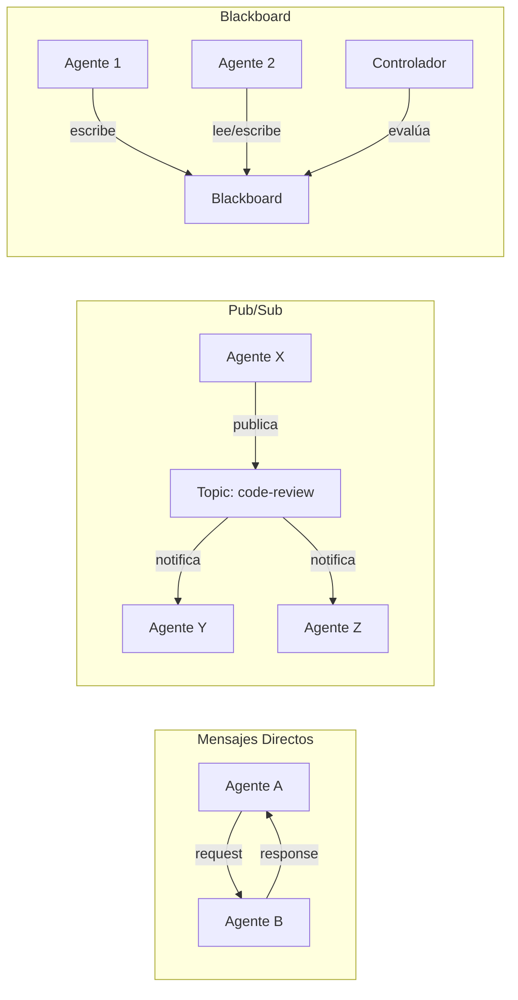
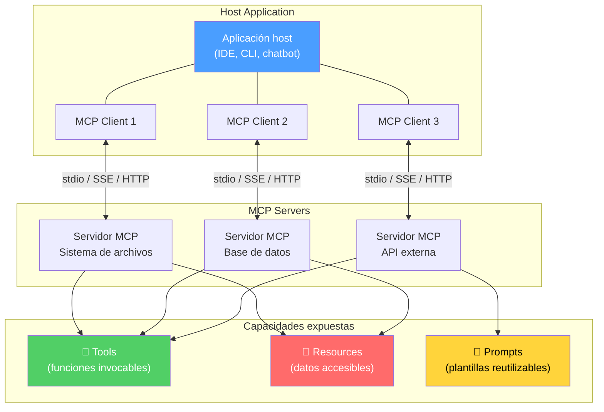
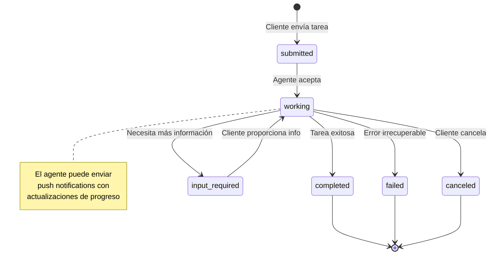
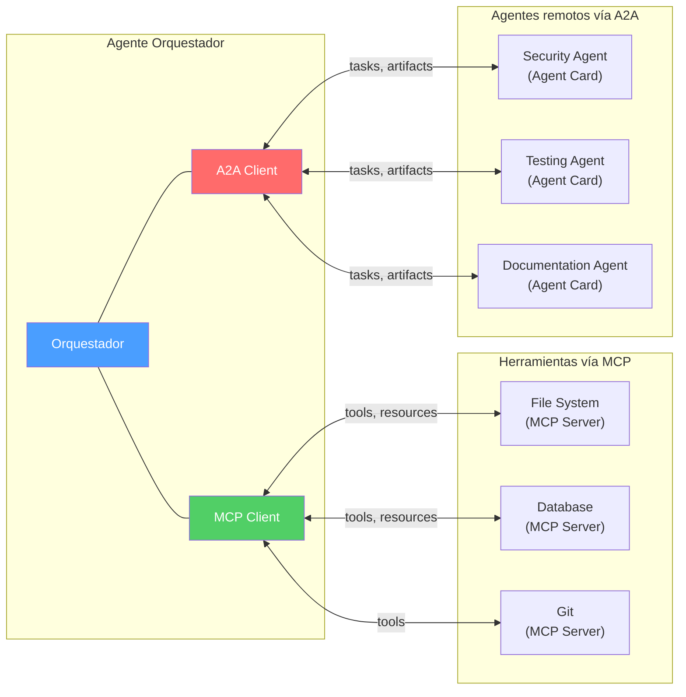
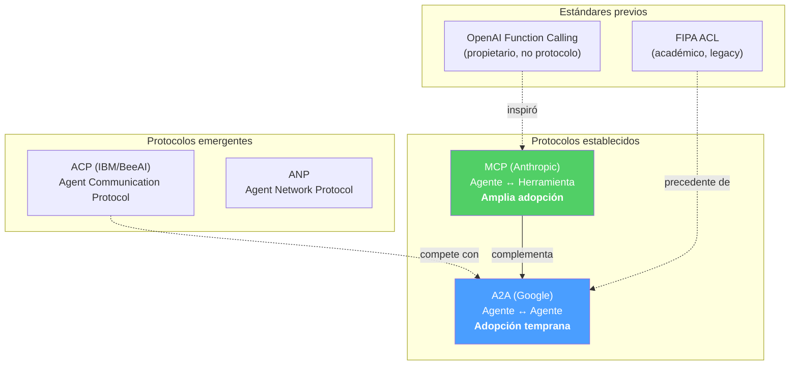

---
tags:
  - concepto
  - agentes
  - protocolos-agentes
  - mcp
aliases:
  - comunicación entre agentes
  - agent protocols
  - MCP protocol
  - A2A protocol
created: 2025-06-01
updated: 2025-06-01
category: protocolos-agentes
status: current
difficulty: intermediate
related:
  - "[[multi-agent-systems]]"
  - "[[architect-overview]]"
  - "[[intake-overview]]"
  - "[[agent-loop]]"
  - "[[autonomous-agents]]"
  - "[[coding-agents]]"
  - "[[llm-api-design]]"
  - "[[memoria-agentes]]"
up: "[[moc-agentes]]"
---

# Comunicación entre Agentes

> [!abstract] Resumen
> La comunicación entre agentes es el problema fundamental que determina si un [[multi-agent-systems|sistema multi-agente]] funciona o colapsa. Dos protocolos están emergiendo como estándares de facto: ==MCP (*Model Context Protocol*) de Anthropic para la comunicación agente-herramienta, y A2A (*Agent-to-Agent*) de Google para la comunicación agente-agente==. Lejos de competir, son complementarios: MCP define cómo un agente usa herramientas y accede a datos, mientras A2A define cómo agentes heterogéneos se descubren, negocian tareas y colaboran. *architect* consume herramientas vía MCP, e *intake* expone un servidor MCP con 9 herramientas y 6 recursos. ^resumen

## Qué es y por qué importa

La **comunicación entre agentes** (*agent communication*) abarca todos los mecanismos que permiten que agentes de IA intercambien información, coordinen acciones y compartan recursos. Sin protocolos de comunicación estandarizados, cada implementación de [[multi-agent-systems|sistema multi-agente]] reinventa la rueda con formatos propietarios, creando ecosistemas fragmentados e incompatibles.

El problema que resuelven los protocolos estándar es triple:
1. **Interoperabilidad**: Un agente construido con LangChain debería poder comunicarse con un agente construido con CrewAI
2. **Descubrimiento**: Un agente debería poder descubrir qué capacidades ofrecen otros agentes sin configuración manual
3. **Seguridad**: La comunicación entre agentes necesita autenticación, autorización y validación para evitar ataques

> [!tip] Cuándo necesitas protocolos formales
> - **Necesarios cuando**: Los agentes son desarrollados por diferentes equipos o proveedores, necesitas interoperabilidad, o el sistema cruza fronteras de confianza
> - **Opcionales cuando**: Todos los agentes son del mismo sistema, controlados por el mismo código, con comunicación interna simple
> - Ver [[multi-agent-systems]] para patrones de orquestación que usan estos protocolos

---

## Patrones de comunicación fundamentales

Antes de los protocolos específicos, es importante entender los patrones básicos de comunicación entre agentes:

### 1. Mensajes directos (*Direct Messaging*)

Un agente envía un mensaje estructurado a otro agente específico. Es el patrón más simple pero crea acoplamiento fuerte.

### 2. Estado compartido (*Shared State*)

Todos los agentes leen y escriben en un estado centralizado (base de datos, archivo, variable compartida). Simple pero propenso a conflictos de concurrencia.

### 3. Eventos (*Event-Driven / Pub-Sub*)

Los agentes publican eventos en canales temáticos y se suscriben a los que les interesan. Bajo acoplamiento pero mayor latencia y complejidad.

### 4. Blackboard

Una "pizarra" compartida donde los agentes escriben contribuciones parciales. Un controlador decide cuándo la solución está completa. Útil para problemas que requieren contribuciones incrementales.

| Patrón | Acoplamiento | Escalabilidad | Complejidad | Caso de uso |
|---|---|---|---|---|
| Mensajes directos | Alto | Baja | Baja | ==2-3 agentes con roles fijos== |
| Estado compartido | Medio | Media | Media | Agentes que modifican el mismo artefacto |
| Eventos (Pub/Sub) | ==Bajo== | ==Alta== | Alta | Sistemas con muchos agentes heterogéneos |
| Blackboard | Medio | Media | Media | Resolución incremental de problemas |



---

## MCP: Model Context Protocol

### Qué es MCP

*MCP* (*Model Context Protocol*)[^1] es un protocolo abierto creado por Anthropic que estandariza cómo los modelos de lenguaje se conectan con fuentes de datos y herramientas externas. La analogía oficial es que ==MCP es al IA lo que USB es a los periféricos==: un estándar universal que permite conectar cualquier herramienta a cualquier modelo sin adaptadores personalizados.

> [!info] MCP no es solo para multi-agente
> Aunque MCP facilita la comunicación en sistemas multi-agente, su propósito principal es más amplio: permitir que ==cualquier LLM acceda a cualquier fuente de datos o herramienta de forma estandarizada==. Un solo agente usando MCP para conectarse a una base de datos, un sistema de archivos y una API ya se beneficia del protocolo.

### Arquitectura de MCP



### Los tres primitivos de MCP

| Primitivo | Descripción | Dirección | Ejemplo |
|---|---|---|---|
| **Tools** | Funciones que el modelo puede invocar | Modelo → Servidor | `create_file`, `query_database`, `send_email` |
| **Resources** | Datos que el modelo puede leer | Servidor → Modelo | Archivos, registros de BD, documentos |
| **Prompts** | Plantillas de prompt reutilizables | Servidor → Modelo | "Analiza este código con enfoque en seguridad" |

### Transportes de MCP

MCP soporta múltiples mecanismos de transporte para diferentes escenarios de despliegue:

| Transporte | Mecanismo | Caso de uso | Latencia |
|---|---|---|---|
| **stdio** | Proceso local, stdin/stdout | ==Herramientas locales en la misma máquina== | Mínima |
| **SSE** (*Server-Sent Events*) | HTTP con streaming unidireccional | Servidores remotos con actualizaciones en tiempo real | Media |
| **Streamable HTTP** | HTTP con streaming bidireccional | ==Producción, servidores remotos== | Media |

> [!example]- Ejemplo: servidor MCP con tools y resources
> ```python
> from mcp.server import Server
> from mcp.types import Tool, Resource
>
> server = Server("mi-servidor-mcp")
>
> @server.tool("buscar_documentacion")
> async def buscar_docs(query: str, max_results: int = 5) -> str:
>     """Busca en la documentación del proyecto por relevancia semántica."""
>     results = await vector_store.search(query, limit=max_results)
>     return "\n\n".join([
>         f"## {r.title}\n{r.content}" for r in results
>     ])
>
> @server.tool("ejecutar_query_sql")
> async def run_query(sql: str) -> str:
>     """Ejecuta una query SQL de solo lectura en la base de datos."""
>     if not sql.strip().upper().startswith("SELECT"):
>         raise ValueError("Solo queries SELECT permitidas")
>     results = await db.execute(sql)
>     return format_as_table(results)
>
> @server.resource("proyecto://estructura")
> async def project_structure() -> str:
>     """Devuelve la estructura de directorios del proyecto."""
>     return generate_tree("./src", max_depth=3)
>
> @server.resource("proyecto://readme")
> async def project_readme() -> str:
>     """Devuelve el README del proyecto."""
>     return Path("README.md").read_text()
>
> # Iniciar con transporte stdio (para uso local)
> server.run_stdio()
>
> # O con transporte HTTP (para uso remoto)
> # server.run_http(port=8080)
> ```

### Seguridad en MCP

> [!danger] Riesgos de seguridad de MCP
> MCP abre una superficie de ataque significativa que [[vigil-overview|vigil]] debería monitorear:
> - **Tool poisoning**: Un servidor MCP malicioso podría devolver datos que contienen instrucciones de *prompt injection*
> - **Exfiltración de datos**: Un tool podría enviar información sensible a un servidor externo
> - **Privilege escalation**: Si el agente tiene permisos para ejecutar herramientas destructivas (borrar archivos, modificar BD) sin confirmación
> - **Supply chain**: Servidores MCP de terceros podrían ser comprometidos (similar a [[slopsquatting|slopsquatting]] para paquetes)
>
> Mitigaciones necesarias:
> 1. Validar outputs de servidores MCP antes de inyectarlos en el contexto
> 2. Aplicar principio de menor privilegio a cada herramienta
> 3. Auditar los servidores MCP de terceros
> 4. Implementar rate limiting y logging de todas las invocaciones

---

## A2A: Agent-to-Agent Protocol

### Qué es A2A

*A2A* (*Agent-to-Agent*)[^2] es un protocolo abierto creado por Google que estandariza cómo agentes de IA se descubren, comunican y colaboran entre sí. Mientras MCP se enfoca en la relación agente-herramienta, ==A2A se enfoca en la relación agente-agente==.

### Conceptos clave de A2A

| Concepto | Descripción |
|---|---|
| **Agent Card** | Documento JSON que describe las capacidades, endpoint y requisitos de un agente. Equivalente a un "currículum" que otros agentes pueden leer para decidir si delegarle una tarea |
| **Task** | Unidad de trabajo con ciclo de vida definido: `submitted` → `working` → `input-required` → `completed` / `failed` / `canceled` |
| **Artifact** | Resultado producido por una tarea: archivos, datos estructurados, texto |
| **Push Notifications** | Mecanismo para que un agente notifique a otro sobre el progreso de una tarea sin polling |
| **Message** | Comunicación entre agentes dentro de una tarea, con partes tipadas (texto, archivo, datos) |

### Ciclo de vida de una tarea A2A



### Agent Card: el pasaporte del agente

La *Agent Card* es el mecanismo de descubrimiento. Se publica en una URL conocida (similar a `robots.txt` o `.well-known/`) y permite que otros agentes entiendan qué puede hacer este agente:

> [!example]- Ejemplo de Agent Card
> ```json
> {
>   "name": "Security Review Agent",
>   "description": "Analiza código y configuración en busca de vulnerabilidades de seguridad. Cubre OWASP Top 10, secrets en código, dependencias vulnerables y configuración de CORS.",
>   "url": "https://agents.example.com/security-review",
>   "version": "1.2.0",
>   "capabilities": {
>     "streaming": true,
>     "pushNotifications": true,
>     "stateTransitionHistory": true
>   },
>   "skills": [
>     {
>       "id": "code-security-scan",
>       "name": "Escaneo de seguridad de código",
>       "description": "Analiza archivos fuente buscando vulnerabilidades",
>       "inputModes": ["text/plain", "application/json"],
>       "outputModes": ["application/json"]
>     },
>     {
>       "id": "dependency-audit",
>       "name": "Auditoría de dependencias",
>       "description": "Verifica dependencias contra bases de datos de vulnerabilidades conocidas",
>       "inputModes": ["application/json"],
>       "outputModes": ["application/json"]
>     }
>   ],
>   "authentication": {
>     "schemes": ["bearer"],
>     "credentials": "OAuth2 token from identity provider"
>   },
>   "defaultInputModes": ["text/plain"],
>   "defaultOutputModes": ["application/json"]
> }
> ```

---

## MCP vs A2A: complementarios, no competidores

Un error común es ver MCP y A2A como competidores. En realidad, ==operan en capas diferentes== y se complementan perfectamente:

| Dimensión | MCP | A2A |
|---|---|---|
| **Relación** | Agente ↔ Herramienta | ==Agente ↔ Agente== |
| **Analogía** | USB (conectar periféricos) | HTTP (comunicar servidores) |
| **Quién controla** | El agente (cliente) controla | Ambos agentes son pares |
| **Descubrimiento** | Configuración manual | ==Agent Cards automáticas== |
| **Ciclo de vida** | Request/response simple | Tareas con estados complejos |
| **Streaming** | Soportado vía transporte | Soportado vía push notifications |
| **Creador** | Anthropic | Google |
| **Estado (2025)** | ==Amplia adopción== | Adopción temprana |

### Cómo se combinan en la práctica



> [!info] El escenario futuro
> En un ecosistema maduro, un agente orquestador:
> 1. Usa **MCP** para acceder a herramientas locales (archivos, bases de datos, APIs)
> 2. Usa **A2A** para descubrir y delegar a agentes especializados remotos
> 3. Los agentes remotos a su vez usan **MCP** para acceder a sus propias herramientas
>
> Esto crea una ==arquitectura de servicios de agentes== análoga a los microservicios, pero con agentes inteligentes en lugar de APIs deterministas.

---

## Cómo architect usa MCP

*architect* implementa soporte MCP tanto como cliente (consume herramientas de servidores MCP) como parte de su arquitectura interna de descubrimiento de herramientas.

### MCPDiscovery y MCPToolAdapter

| Componente | Función |
|---|---|
| **MCPDiscovery** | Descubre servidores MCP disponibles a partir de configuración local o remota |
| **MCPToolAdapter** | Adapta las herramientas descubiertas al formato interno de *architect*, haciéndolas invocables como cualquier otra herramienta nativa |

Esto significa que ==*architect* puede usar cualquier herramienta expuesta vía MCP sin necesidad de código personalizado==. Si alguien publica un servidor MCP para Jira, Slack, o cualquier otro servicio, *architect* puede consumirlo automáticamente.

> [!success] Ventajas del enfoque MCP en architect
> - **Extensibilidad**: Nuevas herramientas se añaden sin modificar el código de architect
> - **Estandarización**: Las herramientas siguen un contrato predecible (nombre, descripción, parámetros, resultado)
> - **Composabilidad**: Múltiples servidores MCP se combinan transparentemente
> - **Aislamiento**: Cada servidor MCP corre en su propio proceso, limitando el impacto de fallos

---

## Cómo intake expone un servidor MCP

*intake* expone sus capacidades como un servidor MCP, permitiendo que otros agentes (incluido *architect*) lo utilicen programáticamente.

### Herramientas de intake vía MCP (9 tools)

| Herramienta | Descripción | Parámetros clave |
|---|---|---|
| `generate_spec` | Genera especificación a partir de descripción | `description`, `format`, `detail_level` |
| `refine_spec` | Refina una especificación existente | `spec_id`, `feedback` |
| `validate_spec` | Valida una especificación contra estándares | `spec_content`, `standard` |
| `list_templates` | Lista plantillas de especificación disponibles | `category` |
| `apply_template` | Aplica una plantilla a un nuevo proyecto | `template_id`, `params` |
| `export_spec` | Exporta especificación a formato externo | `spec_id`, `format` |
| `get_project_context` | Obtiene el contexto completo del proyecto | `project_path` |
| `analyze_requirements` | Analiza requisitos para completitud | `requirements_text` |
| `suggest_improvements` | Sugiere mejoras a una especificación | `spec_id` |

### Recursos de intake vía MCP (6 resources)

| Recurso | URI | Descripción |
|---|---|---|
| Especificaciones | `intake://specs/{id}` | Especificaciones generadas |
| Plantillas | `intake://templates/{id}` | Plantillas de especificación |
| Historial | `intake://history` | Historial de generaciones |
| Configuración | `intake://config` | Configuración activa |
| Proyectos | `intake://projects/{name}` | Metadatos de proyectos |
| Métricas | `intake://metrics` | Métricas de uso y calidad |

> [!example]- Ejemplo: architect usando intake vía MCP
> ```
> // architect detecta el servidor MCP de intake
> MCPDiscovery.scan() → [
>   { name: "intake", transport: "stdio", tools: 9, resources: 6 }
> ]
>
> // El supervisor de architect decide generar una spec antes de codificar
> await mcp.call("intake", "generate_spec", {
>   description: "API REST para gestión de usuarios con OAuth2",
>   format: "yaml",
>   detail_level: "detailed"
> });
>
> // Resultado: una especificación completa que architect usa para planificar
> // la implementación con sus sub-agentes
> ```

---

## Esfuerzos de estandarización y futuro

### El paisaje de protocolos en 2025



### Tendencias clave

1. **Convergencia MCP + A2A**: Es probable que emerja un meta-protocolo o al menos una guía de interoperabilidad que defina cómo usar MCP para herramientas y A2A para coordinación.

2. **Marketplaces de Agent Cards**: Similar a los registros de APIs (como RapidAPI), veremos directorios donde los agentes publican sus Agent Cards y otros agentes los descubren dinámicamente[^3].

3. **Autenticación federada para agentes**: Los agentes necesitarán identidades verificables para interactuar con otros agentes de forma segura. Los estándares de identidad digital (OAuth2, OIDC) se extenderán al mundo de los agentes.

4. **Observabilidad de comunicación**: Herramientas de [[observabilidad-ia|tracing distribuido]] (OpenTelemetry) se adaptarán para trazar conversaciones multi-agente a través de protocolos como MCP y A2A.

> [!question] Debate abierto: ¿dominará un solo protocolo?
> - **Posición A**: MCP ganará todo porque tiene la mayor adopción y Anthropic lo está impulsando agresivamente. A2A se integrará en MCP como una extensión.
> - **Posición B**: MCP y A2A sobrevivirán porque resuelven problemas diferentes. Intentar fusionarlos sería como fusionar HTTP con TCP — son capas diferentes.
> - **Mi valoración**: ==La complementariedad es real==. MCP y A2A tienen dominios bien separados. Lo más probable es que coexistan con un "bridge" estandarizado que permita a un agente MCP comunicarse con un agente A2A y viceversa. El ecosistema de *architect* + *intake* ya demuestra esto: intake expone MCP, architect lo consume, y una futura integración A2A podría permitir que agentes externos deleguen a architect.

---

## Ventajas y limitaciones

> [!success] Fortalezas de los protocolos estandarizados
> - Eliminan la necesidad de integraciones ad-hoc para cada par de herramientas/agentes
> - Permiten ecosistemas abiertos donde herramientas de diferentes proveedores se combinan
> - Facilitan la seguridad al definir capas claras de autenticación y autorización
> - Habilitan el debugging y la observabilidad al estandarizar formatos de comunicación

> [!failure] Limitaciones actuales
> - MCP carece de un modelo de autenticación robusto integrado (se delega al transporte)
> - A2A está en adopción muy temprana con pocas implementaciones de producción
> - La serialización de datos complejos (imágenes, binarios) no está completamente resuelta
> - La latencia de comunicación entre agentes remotos puede ser significativa para tareas interactivas

---

## Relación con el ecosistema

> [!info] Conexiones con mis herramientas
> - **[[intake-overview|intake]]**: ==*intake* es un servidor MCP de primera clase==, exponiendo 9 herramientas y 6 recursos. Esto permite que cualquier agente compatible con MCP use las capacidades de generación de especificaciones de intake sin integración personalizada. En el futuro, podría publicar una Agent Card A2A para que agentes remotos le deleguen tareas de especificación
> - **[[architect-overview|architect]]**: *architect* consume MCP vía MCPDiscovery y MCPToolAdapter, permitiéndole usar cualquier herramienta que se publique como servidor MCP. Su sistema de sub-agentes internos (explore/test/review) usa comunicación directa vía `dispatch_subagent`, no MCP, por razones de rendimiento — pero la interfaz externa sí es MCP
> - **[[vigil-overview|vigil]]**: Los protocolos de comunicación son una superficie de ataque que vigil debería monitorear. Un servidor MCP comprometido podría inyectar datos maliciosos en el contexto del agente (*tool poisoning*). Las 26 reglas de vigil deberían extenderse para cubrir la validación de outputs de herramientas MCP
> - **[[licit-overview|licit]]**: La trazabilidad de proveniencia en un sistema con comunicación A2A es compleja: si un agente delega a otro, ¿quién es responsable del resultado? Las heurísticas de *licit* (patrones de autor, cambios masivos) necesitan adaptarse para rastrear contribuciones a través de fronteras de agentes

---

## Enlaces y referencias

**Notas relacionadas:**
- [[multi-agent-systems]] — Patrones de orquestación que usan estos protocolos
- [[architect-overview]] — Implementación concreta de MCP como cliente
- [[intake-overview]] — Implementación concreta de MCP como servidor
- [[agent-loop]] — El loop individual donde se consumen herramientas MCP
- [[autonomous-agents]] — La comunicación estandarizada habilita mayor autonomía
- [[coding-agents]] — Los coding agents modernos adoptan MCP como estándar de extensibilidad
- [[vigil-overview]] — Seguridad en la comunicación entre agentes
- [[llm-api-design]] — Diseño de APIs para LLMs, precedente de MCP

> [!quote]- Referencias bibliográficas
> - Anthropic, "Model Context Protocol Specification", 2024. https://modelcontextprotocol.io
> - Google, "Agent-to-Agent (A2A) Protocol Specification", 2025. https://google.github.io/A2A
> - Anthropic, "Introducing the Model Context Protocol", Blog post, 2024
> - Google DeepMind, "A2A: An Open Protocol for Agent Interoperability", Blog post, 2025
> - IBM Research, "Agent Communication Protocol (ACP)", 2025
> - FIPA, "Agent Communication Language Specifications", legacy reference

[^1]: Anthropic, "Model Context Protocol Specification", 2024. Protocolo abierto que estandariza la conexión entre LLMs y fuentes de datos/herramientas externas.
[^2]: Google, "Agent-to-Agent (A2A) Protocol", 2025. Protocolo abierto para comunicación, descubrimiento y colaboración entre agentes de IA heterogéneos.
[^3]: La idea de "marketplaces de agentes" se inspira en el éxito de ecosistemas de plugins (VS Code extensions, npm packages) aplicado a agentes con capacidades verificables vía Agent Cards.
