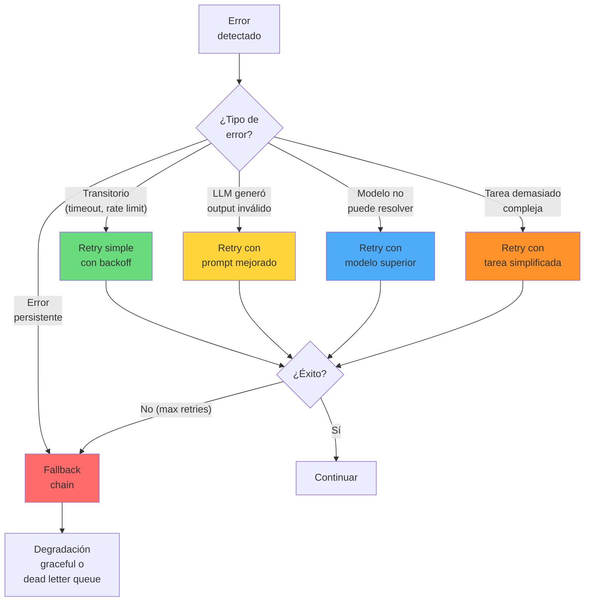
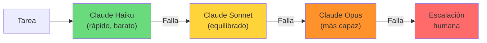
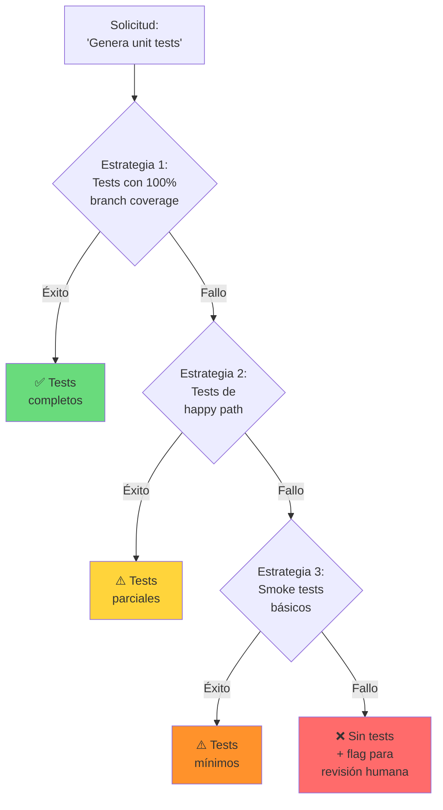
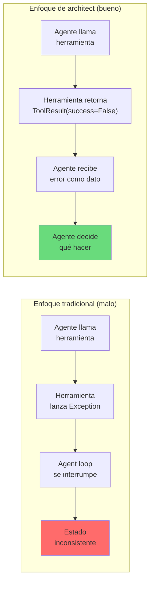
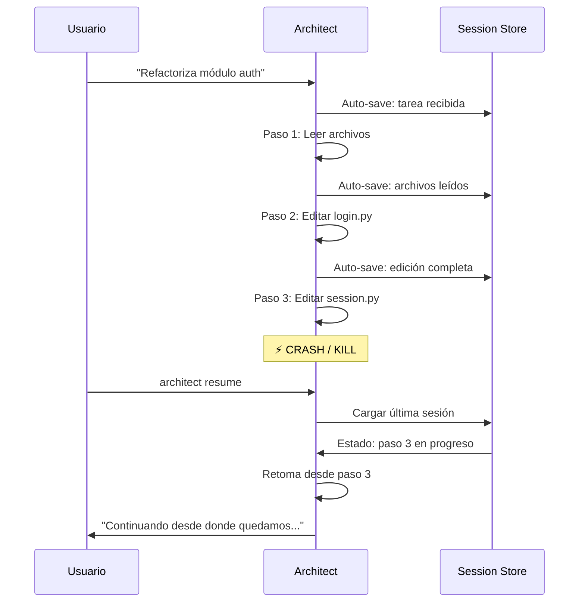
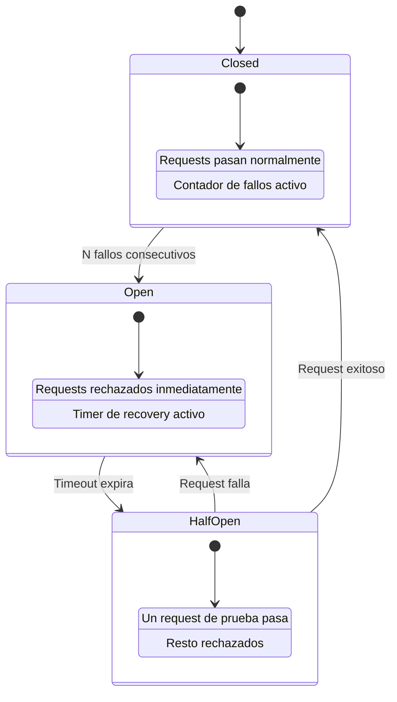

---
tags:
  - concepto
  - agentes
  - produccion
  - patron
aliases:
  - manejo de errores en agentes
  - agent error handling
  - error recovery agents
  - agent fault tolerance
  - tolerancia a fallos de agentes
created: 2025-06-01
updated: 2025-06-01
category: agentes-ia
status: evergreen
difficulty: advanced
related:
  - "[[architect-overview]]"
  - "[[agent-architectures]]"
  - "[[agent-observability]]"
  - "[[coding-agent-debugging]]"
  - "[[circuit-breaker-pattern]]"
  - "[[agent-reliability]]"
  - "[[idempotency-patterns]]"
up: "[[moc-agentes]]"
---

# Manejo de Errores en Agentes IA

> [!abstract] Resumen
> El manejo de errores en agentes IA es ==fundamentalmente diferente al de software tradicional== porque los errores no son solo excepciones técnicas: incluyen alucinaciones, razonamiento incorrecto, herramientas que devuelven resultados inesperados, y estrategias que no convergen. Las técnicas clásicas (try/catch, retries) son insuficientes sin adaptaciones específicas: ==retry con modelo diferente, retry con prompt simplificado, fallback chains que degradan a enfoques menos capaces pero más fiables, dead letter queues para revisión humana, e idempotencia estricta para operaciones con efectos secundarios==. Architect implementa un enfoque donde las herramientas nunca lanzan excepciones (retornan `ToolResult(success=False)`), los *safety nets* solicitan cierre graceful, y las sesiones se auto-guardan para permitir resumir tras un crash. Los patrones de *circuit breaker* y *error budgets* completan el framework de producción. ^resumen

## Qué es y por qué importa

En software tradicional, un error es una excepción que interrumpe el flujo normal del programa. En un agente IA, los errores son ==mucho más variados y difíciles de manejar==:

| Tipo de error | Software tradicional | Agente IA |
|--------------|---------------------|-----------|
| **Técnico** | NullPointerException, TimeoutError | Timeout del LLM API, rate limiting |
| **Lógico** | Bug en la lógica de negocio | ==El LLM razona incorrectamente== |
| **Semántico** | N/A (el código hace lo que dice) | El código generado funciona pero hace algo incorrecto |
| **De contexto** | N/A | ==El agente no tiene suficiente información para actuar== |
| **De estrategia** | N/A | El enfoque elegido por el agente no converge |
| **De seguridad** | Input no sanitizado | El agente intenta una acción peligrosa |

> [!tip] Principio fundamental
> - **Software tradicional**: Los errores son excepciones. El happy path es el camino normal. Los errores son la excepción
> - **Agentes IA**: ==Los errores son parte del camino normal==. Un agente que nunca falla probablemente no está haciendo nada interesante. El diseño debe asumir que los errores ocurrirán y manejarlos como ciudadanos de primera clase
> - Ver [[agent-architectures]] para entender cómo diferentes arquitecturas de agentes manejan errores

---

## Estrategias de retry

### Más allá del retry simple

El *retry* (*reintento*) en agentes IA no es simplemente "intentar de nuevo lo mismo". Hay ==una jerarquía de estrategias de retry==, cada una apropiada para diferentes tipos de fallo.



### 1. Retry simple con exponential backoff

Para errores transitorios: timeouts de red, rate limiting, errores 5xx del API.

> [!example]- Implementación de retry con exponential backoff
> ```python
> import asyncio
> import random
> from typing import TypeVar, Callable
>
> T = TypeVar('T')
>
> async def retry_with_backoff(
>     fn: Callable[..., T],
>     max_retries: int = 3,
>     base_delay: float = 1.0,
>     max_delay: float = 60.0,
>     jitter: bool = True,
>     retryable_exceptions: tuple = (TimeoutError, ConnectionError),
> ) -> T:
>     """Retry con exponential backoff y jitter opcional."""
>     for attempt in range(max_retries + 1):
>         try:
>             return await fn()
>         except retryable_exceptions as e:
>             if attempt == max_retries:
>                 raise  # Sin más retries
>
>             delay = min(base_delay * (2 ** attempt), max_delay)
>             if jitter:
>                 delay = delay * (0.5 + random.random())  # ±50%
>
>             logger.warning(
>                 f"Retry {attempt + 1}/{max_retries} "
>                 f"tras {type(e).__name__}, esperando {delay:.1f}s"
>             )
>             await asyncio.sleep(delay)
> ```

### 2. Retry con prompt mejorado

Cuando el LLM genera output inválido (JSON malformado, código que no compila), ==el retry incluye el error como contexto adicional== para que el modelo se autocorrija.

| Estrategia de mejora | Cuándo usar | Ejemplo |
|---------------------|------------|---------|
| **Incluir error message** | El error es informativo | "Tu JSON es inválido en línea 3: expected comma" |
| **Incluir output esperado** | El formato es incorrecto | "Responde SOLO con JSON válido, sin explicación" |
| **Reducir scope** | La tarea es demasiado amplia | "Solo modifica la función X, no toques nada más" |
| **Añadir ejemplos** | ==El modelo no entiende el formato== | Incluir un ejemplo de output correcto |

> [!warning] Cuidado con el retry loop de prompts
> Cada retry con prompt mejorado ==consume tokens adicionales del LLM y acumula contexto==. Si el historial de intentos fallidos crece demasiado, el modelo puede confundirse más en lugar de mejorar. Regla general: ==máximo 3 retries de prompt antes de escalar a otra estrategia==.

### 3. Retry con modelo diferente

Cuando un modelo específico falla consistentemente en una tarea, ==escalar a un modelo más capaz== puede resolver el problema.



> [!info] Trade-off de model escalation
> Cada nivel de escalación es más capaz pero también ==más lento y más caro==. Un sistema bien diseñado intenta primero con el modelo más barato y solo escala cuando es necesario. Esto requiere instrumentación para saber ==qué porcentaje de tareas se resuelve en cada nivel==.

### 4. Retry con tarea simplificada

Si la tarea es demasiado compleja para el agente, ==descomponerla en subtareas más simples== puede hacer posible lo que antes fallaba.

> [!example]- Ejemplo: simplificación de tarea
> ```
> TAREA ORIGINAL (falla):
> "Refactoriza el módulo de autenticación para usar OAuth2
>  con refresh tokens, añade tests, y actualiza la documentación"
>
> TAREA SIMPLIFICADA (iteraciones):
> 1. "Lee el módulo de autenticación actual y lista los cambios necesarios"
> 2. "Implementa OAuth2 básico sin refresh tokens"
> 3. "Añade refresh token handling"
> 4. "Escribe tests para el flujo de autenticación"
> 5. "Actualiza la documentación con los nuevos endpoints"
> ```

---

## Fallback chains

### Degradación graceful

Una *fallback chain* (*cadena de fallback*) define una ==secuencia de estrategias cada vez menos sofisticadas pero más fiables==. Si la estrategia óptima falla, se degrada a la siguiente.



> [!success] Principio de la degradación graceful
> Es mejor ==entregar un resultado parcial que no entregar nada==. Un agente que genera tests solo para el happy path es más útil que un agente que falla intentando cubrir todos los edge cases. La clave es:
> 1. **Ser transparente**: Indicar claramente qué nivel de la fallback chain se usó
> 2. **Logear la degradación**: Para que el sistema pueda mejorar con el tiempo
> 3. **No degradar silenciosamente**: El usuario debe saber que recibió un resultado parcial

---

## Dead letter queues para agentes

### Concepto

Una *dead letter queue* (*DLQ*) es un concepto tomado de sistemas de mensajería que, aplicado a agentes, sirve para ==almacenar tareas que fallaron todos los retries y fallbacks para revisión humana posterior==.

| Aspecto | En mensajería | En agentes IA |
|---------|--------------|--------------|
| **Qué se almacena** | Mensajes que no pudieron procesarse | ==Tareas fallidas con todo su contexto== |
| **Por qué falla** | Formato inválido, consumidor caído | LLM no puede resolver, tarea ambigua |
| **Qué incluir** | Mensaje, headers, error | Tarea, historial de intentos, errores, contexto |
| **Quién revisa** | Operador del sistema | ==Desarrollador o product owner== |
| **Acción** | Re-enviar o descartar | Refinar prompt, re-asignar, resolver manualmente |

> [!example]- Estructura de un DLQ entry para agentes
> ```json
> {
>   "task_id": "task-789",
>   "created_at": "2025-06-01T10:00:00Z",
>   "failed_at": "2025-06-01T10:15:23Z",
>   "task": {
>     "description": "Migrar endpoint /api/users de REST a GraphQL",
>     "files_involved": ["src/api/users.py", "src/schema.graphql"],
>     "original_prompt": "..."
>   },
>   "attempts": [
>     {
>       "attempt": 1,
>       "strategy": "claude-sonnet, standard prompt",
>       "error": "Generated schema doesn't match existing types",
>       "duration_s": 45,
>       "cost_usd": 0.12
>     },
>     {
>       "attempt": 2,
>       "strategy": "claude-sonnet, prompt with error context",
>       "error": "Loop: kept reverting to REST instead of GraphQL",
>       "duration_s": 120,
>       "cost_usd": 0.34
>     },
>     {
>       "attempt": 3,
>       "strategy": "claude-opus, simplified task",
>       "error": "Exceeded max iterations (10)",
>       "duration_s": 180,
>       "cost_usd": 1.23
>     }
>   ],
>   "total_cost_usd": 1.69,
>   "classification": "task_too_complex",
>   "suggested_action": "Descomponer en subtareas manuales"
> }
> ```

---

## Idempotencia

### Por qué es crítica en agentes

La *idempotencia* (*idempotency*) garantiza que ==ejecutar la misma operación múltiples veces produce el mismo resultado que ejecutarla una vez==. En agentes, esto es crítico porque los retries son frecuentes.

| Operación | ¿Naturalmente idempotente? | Riesgo sin idempotencia | Solución |
|-----------|--------------------------|------------------------|----------|
| Leer un archivo | Sí | Ninguno | N/A |
| Escribir un archivo | Sí (overwrite) | Ninguno | N/A |
| Crear un archivo | ==No== | Archivos duplicados | Check-before-create |
| Enviar un email | ==No== | ==Emails duplicados== | Idempotency key |
| Crear un ticket en Jira | No | Tickets duplicados | Idempotency key |
| Ejecutar una migración de DB | No | Datos corruptos | ==Migraciones idempotentes== |
| Hacer un commit de git | No | Commits duplicados | Check if already committed |
| Llamar a un API de pagos | ==No== | ==Cobros duplicados== | Idempotency key obligatorio |

> [!danger] El peor escenario: retry de operación no idempotente
> Si un agente envía un pago, recibe un timeout (pero el pago sí se procesó), y hace retry, ==el usuario paga dos veces==. Este tipo de error es inaceptable en producción. Toda operación con efectos secundarios DEBE tener un mecanismo de idempotencia.

> [!example]- Implementación de idempotency key
> ```python
> import hashlib
> from dataclasses import dataclass
>
> @dataclass
> class ToolResult:
>     success: bool
>     output: str
>     idempotency_key: str | None = None
>
> class IdempotentToolExecutor:
>     """Ejecuta herramientas con garantía de idempotencia."""
>
>     def __init__(self, store: KeyValueStore):
>         self.store = store
>
>     def _generate_key(self, tool_name: str, params: dict) -> str:
>         """Genera key determinística basada en tool + params."""
>         content = f"{tool_name}:{sorted(params.items())}"
>         return hashlib.sha256(content.encode()).hexdigest()[:16]
>
>     async def execute(
>         self, tool_name: str, params: dict, tool_fn
>     ) -> ToolResult:
>         key = self._generate_key(tool_name, params)
>
>         # ¿Ya ejecutamos esto?
>         cached = await self.store.get(key)
>         if cached:
>             logger.info(f"Idempotent hit: {tool_name} ya ejecutado")
>             return cached
>
>         # Ejecutar y guardar resultado
>         result = await tool_fn(**params)
>         result.idempotency_key = key
>         await self.store.set(key, result, ttl=3600)
>
>         return result
> ```

---

## Cómo architect maneja errores

### Principio: las herramientas nunca lanzan excepciones

En [[architect-overview|architect]], ==ninguna herramienta (tool) lanza excepciones al agente==. En su lugar, retornan un `ToolResult` con `success=False` y un mensaje de error descriptivo.



> [!tip] Por qué esto es mejor
> Cuando la herramienta retorna un error como dato (no excepción), ==el LLM puede razonar sobre el error== y decidir:
> - Intentar de nuevo con parámetros diferentes
> - Probar un enfoque alternativo
> - Reportar el error al usuario con contexto
> - Continuar con la siguiente tarea si el error no es crítico
>
> Cuando se lanza una excepción, el flujo se interrumpe y el agente pierde ==la oportunidad de manejar el error inteligentemente==.

### Safety nets para cierre graceful

Los *safety nets* (*redes de seguridad*) de architect son mecanismos que ==solicitan al agente que cierre de forma graceful== cuando se detecta una condición problemática:

| Safety net | Condición | Acción |
|-----------|----------|--------|
| **Token budget** | Se agota el presupuesto de tokens | Solicitar que el agente termine, guarde estado y reporte progreso |
| **Cost limit** | El coste acumulado excede el límite | ==Cierre graceful con resumen de lo completado== |
| **Iteration limit** | Demasiadas iteraciones sin progreso | Solicitar resumen y pausa |
| **Time limit** | Timeout de la sesión | Auto-save y terminación limpia |
| **Signal handling** | SIGINT/SIGTERM del usuario | ==Guardar sesión, reportar estado, terminar limpiamente== |

> [!info] "Solicitar" vs "Forzar"
> Los safety nets de architect ==solicitan== al agente que cierre, no fuerzan la terminación. Esto permite que el agente:
> 1. Termine la operación en curso (no dejar archivos a medias)
> 2. Guarde un resumen de lo completado y lo pendiente
> 3. Haga commit de cambios parciales si es apropiado
> 4. Proporcione instrucciones para continuar (resume)
>
> Solo si el agente no responde a la solicitud en un plazo razonable se fuerza la terminación.

### Session auto-save para recovery post-crash

La ==persistencia automática de sesiones== permite que, si architect se cierra inesperadamente (crash, kill, pérdida de conexión), el usuario pueda continuar exactamente donde se quedó.



### Post-edit hooks como detección temprana

Los *post-edit hooks* ejecutan ==linting y testing automáticamente después de cada edición de código==. Esto funciona como un sistema de detección temprana de errores:

- Si el linter falla → el agente recibe el error inmediatamente y puede corregir
- Si un test falla → el agente recibe el output del test y puede ajustar el código
- ==Los errores se detectan en el paso donde se introducen==, no al final de toda la tarea

> [!success] Resultado: los errores no se propagan
> Sin post-edit hooks, un error en el paso 3 de 10 podría ==contaminar los pasos 4-10==, haciendo el debugging extremadamente difícil. Con hooks, el error se captura y corrige en el paso 3, antes de que tenga consecuencias downstream.

---

## Circuit breaker para APIs de LLM

### El patrón circuit breaker aplicado a agentes

El *circuit breaker* (*interruptor de circuito*) es un patrón de resiliencia que ==previene que un sistema siga enviando requests a un servicio que está fallando==, dándole tiempo para recuperarse.



| Estado | Comportamiento | Cuándo se activa |
|--------|---------------|-----------------|
| **Closed** (normal) | Requests pasan, se cuentan fallos | Estado inicial y tras recovery |
| **Open** (bloqueado) | ==Requests rechazados inmediatamente== sin contactar el API | Tras N fallos consecutivos |
| **Half-Open** (prueba) | Un request de prueba se envía | Tras timeout en estado Open |

> [!warning] Sin circuit breaker, un agente puede gastar cientos de dólares en retries inútiles
> Si el API de OpenAI está caído y el agente tiene un retry con backoff de 3 intentos por paso, y la tarea tiene 20 pasos, ==eso son 60 requests fallidos antes de abortar==. Con circuit breaker, ==se aborta después de los primeros 5 fallos== y se notifica al usuario inmediatamente.

> [!example]- Implementación de circuit breaker para LLM APIs
> ```python
> import time
> from enum import Enum
>
> class CircuitState(Enum):
>     CLOSED = "closed"
>     OPEN = "open"
>     HALF_OPEN = "half_open"
>
> class LLMCircuitBreaker:
>     def __init__(
>         self,
>         failure_threshold: int = 5,
>         recovery_timeout: float = 60.0,
>         half_open_max_calls: int = 1,
>     ):
>         self.failure_threshold = failure_threshold
>         self.recovery_timeout = recovery_timeout
>         self.half_open_max_calls = half_open_max_calls
>         self.state = CircuitState.CLOSED
>         self.failure_count = 0
>         self.last_failure_time = 0.0
>         self.half_open_calls = 0
>
>     def can_execute(self) -> bool:
>         if self.state == CircuitState.CLOSED:
>             return True
>
>         if self.state == CircuitState.OPEN:
>             if time.time() - self.last_failure_time > self.recovery_timeout:
>                 self.state = CircuitState.HALF_OPEN
>                 self.half_open_calls = 0
>                 return True
>             return False
>
>         # HALF_OPEN
>         return self.half_open_calls < self.half_open_max_calls
>
>     def record_success(self):
>         if self.state == CircuitState.HALF_OPEN:
>             self.state = CircuitState.CLOSED
>         self.failure_count = 0
>
>     def record_failure(self):
>         self.failure_count += 1
>         self.last_failure_time = time.time()
>         if self.state == CircuitState.HALF_OPEN:
>             self.state = CircuitState.OPEN
>         elif self.failure_count >= self.failure_threshold:
>             self.state = CircuitState.OPEN
> ```

---

## Error budgets y SLOs para agentes

### Definiendo SLOs para agentes IA

Los *SLOs* (*Service Level Objectives*) para agentes son diferentes a los de microservicios tradicionales porque deben incluir ==métricas de calidad semántica, no solo de disponibilidad==.

| SLO | Definición | Target típico | Cómo medir |
|-----|-----------|---------------|-----------|
| **Tasa de éxito** | % de tareas completadas correctamente | >90% | Tests automatizados + revisión humana |
| **Latencia P95** | Tiempo para completar una tarea (P95) | <5 min para tareas estándar | Traces con OpenTelemetry |
| **Coste por tarea** | Coste medio en tokens/dólares | <$0.50 para tareas estándar | ==Cost tracking per step== |
| **Tasa de escalación** | % de tareas que requieren intervención humana | <15% | Dead letter queue metrics |
| **Tasa de regresión** | % de tareas que introducen bugs | <5% | Tests de regresión post-agente |
| **Tasa de retry** | % de pasos que requieren retry | <20% | Logs de retry |

### Error budgets

Un *error budget* (*presupuesto de errores*) es la cantidad de errores que ==el sistema puede tolerar antes de tomar acción==.

> [!example]- Cálculo de error budget
> ```
> SLO de tasa de éxito: 95%
> Error budget: 100% - 95% = 5%
>
> En un mes con 1000 tareas:
> - Máximo de fallos permitidos: 50
> - Si en la primera semana fallan 30 tareas:
>   → Quedan 20 fallos para las 3 semanas restantes
>   → Acción: reducir agresividad (usar confirm-all mode),
>     investigar causa de fallos, posiblemente pausar
>     tareas de alta complejidad
> ```

> [!info] Error budgets como herramienta de decisión
> Los error budgets no son solo métricas — son ==herramientas para decidir cuánto riesgo tomar==:
> - **Budget disponible**: Se pueden intentar tareas más complejas, usar modelos más rápidos pero menos fiables
> - **Budget agotándose**: Reducir riesgo, usar modelos más capaces, requerir confirmación humana
> - **Budget agotado**: ==Solo tareas de bajo riesgo con confirmación humana hasta que se recupere==

---

## Antipatrones en manejo de errores

> [!failure] Antipatrones comunes
> 1. **Catch-all silencioso**: Capturar todas las excepciones y continuar como si nada. ==El agente continúa con estado corrupto==
> 2. **Retry infinito**: No poner límite a los retries. El agente gasta dinero sin converger
> 3. **Retry sin cambio de estrategia**: Intentar lo mismo esperando un resultado diferente (la definición de locura)
> 4. **Ignorar el contexto del error**: Hacer retry sin incluir ==por qué falló el intento anterior==
> 5. **No trackear costes de error handling**: Los retries cuestan dinero. Sin tracking, los costes se disparan
> 6. **Asumir idempotencia**: Dar por hecho que las operaciones son idempotentes sin verificarlo
> 7. **Error handling síncrono en pipelines asíncronos**: ==Bloquear todo el pipeline por un error en un componente==

---

## Estado del arte (2025-2026)

> [!question] Tendencias en error handling para agentes
> - **Self-healing agents**: Agentes que ==detectan sus propios errores, diagnostican la causa raíz, y se autocorrigen== sin intervención humana. El Ralph loop de architect es un ejemplo temprano de este patrón
> - **Error-aware planning**: Modelos que, al planificar una tarea, ==anticipan posibles errores y preparan estrategias de contingencia== antes de ejecutar
> - **Collaborative error resolution**: Cuando un agente falla, ==otro agente especializado en debugging analiza el fallo== y sugiere correcciones
> - **Learning from failures**: Sistemas que ==aprenden de fallos pasados== y ajustan su comportamiento para evitar errores recurrentes (fine-tuning on failure data)

---

## Relación con el ecosistema

> [!info] Conexiones con mis herramientas
> - **[[intake-overview|intake]]**: Intake puede reducir errores en downstream al ==generar especificaciones claras y no ambiguas==. Muchos errores de agentes se originan en prompts ambiguos — si intake clarifica los requisitos upfront, architect tiene menos probabilidad de fallar
> - **[[architect-overview|architect]]**: Architect es el caso de estudio principal. Su diseño de error handling — ==tools que nunca lanzan excepciones, safety nets para cierre graceful, session auto-save, post-edit hooks, cost tracking per step== — representa un enfoque comprehensivo que otros coding agents pueden emular. El Ralph loop es esencialmente un sistema de error detection + retry integrado
> - **[[vigil-overview|vigil]]**: Vigil actúa como una ==capa adicional de detección de errores que los tests convencionales no capturan==: dependencias vulnerables, paquetes alucinados, código inseguro. Es un complemento a los post-edit hooks de architect
> - **[[licit-overview|licit]]**: Los errores en agentes que manejan datos regulados pueden tener ==consecuencias legales==. Si un agente falla silenciosamente al anonimizar datos personales, o si un retry procesa datos sensibles dos veces, las implicaciones de compliance son serias. Licit debe monitorear que el error handling respeta las regulaciones

---

## Enlaces y referencias

**Notas relacionadas:**
- [[architect-overview]] — Implementación de referencia de error handling en agents
- [[coding-agent-debugging]] — Debugging como complemento del error handling
- [[agent-observability]] — Observabilidad necesaria para detectar errores
- [[agent-architectures]] — Cómo diferentes arquitecturas manejan errores
- [[circuit-breaker-pattern]] — Patrón de circuit breaker en detalle
- [[idempotency-patterns]] — Patrones de idempotencia
- [[agent-reliability]] — Fiabilidad de agentes en producción
- [[hallucinations]] — Alucinaciones como tipo especial de error

> [!quote]- Referencias bibliográficas
> - Nygard, M., "Release It!", Pragmatic Bookshelf, 2018. Patrones de resiliencia (circuit breaker, bulkheads, timeouts) aplicables a agentes
> - Anthropic, "Building Effective Agents", 2025. Sección sobre error handling y tool design
> - OpenAI, "A Practical Guide to Building Agents", 2025. Patrones de retry y fallback para agentes
> - Microsoft, "Error handling patterns for AI agents", Azure AI Documentation, 2025
> - Fowler, M., "Circuit Breaker", martinfowler.com, 2014. Artículo original sobre el patrón

[^1]: Nygard, M., "Release It! Design and Deploy Production-Ready Software", Pragmatic Bookshelf, 2018. Referencia fundamental sobre patrones de resiliencia en sistemas distribuidos.
[^2]: Anthropic, "Building Effective Agents", 2025. Incluye la recomendación de que las herramientas retornen errores como datos, no excepciones.
[^3]: Fowler, M., "Circuit Breaker", martinfowler.com, 2014. Descripción original del patrón y su aplicación a llamadas entre servicios.
