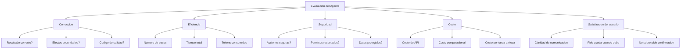
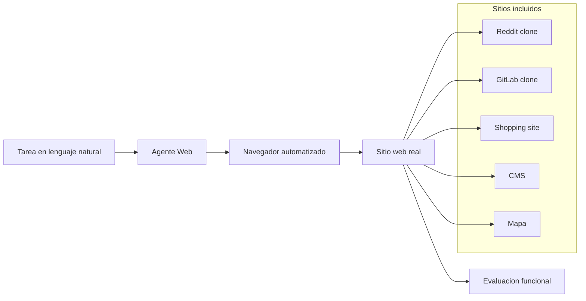
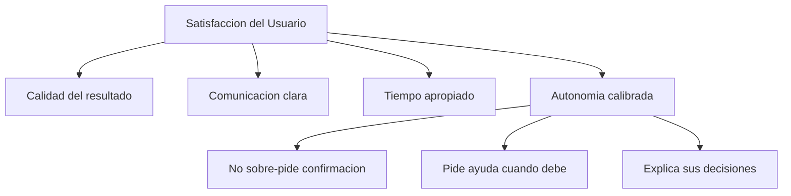
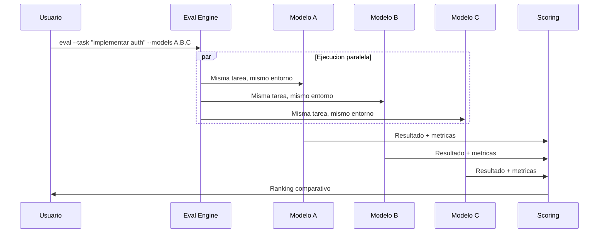
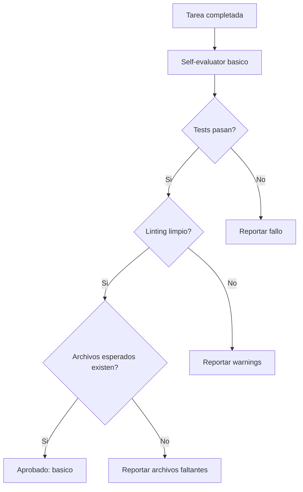
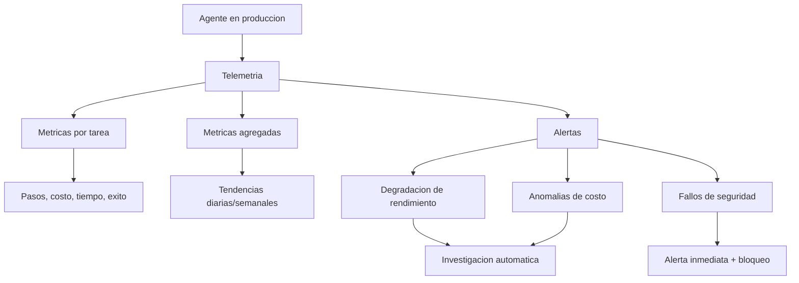
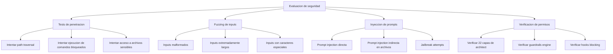

# Evaluacion de Agentes IA

> [!abstract] Resumen
> Evaluar agentes de IA es ==fundamentalmente mas dificil== que evaluar modelos de lenguaje aislados. Mientras que un modelo se evalua por la calidad de su siguiente token, un agente debe evaluarse por el ==resultado final de una cadena de decisiones== que incluyen razonamiento, seleccion de herramientas, gestion de estado y recuperacion de errores. Este documento explora los benchmarks existentes (*SWE-bench*, *GAIA*, *WebArena*, *AgentBench*), las metricas multidimensionales necesarias, y como [[architect-overview]] implementa su propio sistema de evaluacion competitiva y auto-evaluacion. ^resumen

---

## Por que evaluar agentes es tan dificil

### El problema de la composicionalidad

Evaluar un modelo de lenguaje es relativamente sencillo: se le da un input, se obtiene un output, se compara con una referencia. Evaluar un agente requiere considerar:

- **Multiples pasos**: el resultado depende de una cadena de 10-100+ acciones
- **No determinismo**: la misma tarea puede completarse por caminos muy diferentes
- **Interaccion con el entorno**: el agente modifica su entorno, lo que afecta pasos futuros
- **Multiples dimensiones**: velocidad, costo, seguridad, correccion, elegancia

> [!info] La analogia del ajedrez
> Evaluar un modelo es como evaluar un solo movimiento de ajedrez. Evaluar un agente es como evaluar una ==partida completa==: un jugador puede hacer un movimiento suboptimo en el turno 5 pero ganar brillantemente en el turno 40. La evaluacion de movimientos individuales no captura la calidad estrategica global.

### Dimensiones de evaluacion



> [!warning] La trampa de la metrica unica
> Es tentador reducir la evaluacion a una sola metrica (ej: "tasa de exito del 87%"). Esto es ==peligroso== porque oculta tradeoffs criticos. Un agente con 95% de exito que ocasionalmente borra archivos del sistema es peor que uno con 80% de exito que siempre opera de forma segura. La evaluacion de [[agent-safety|seguridad]] debe ser una dimension separada y no negociable.

---

## Benchmarks existentes

### SWE-bench

*SWE-bench*[^1] es el benchmark de referencia para agentes de ingenieria de software. Consiste en issues reales de repositorios de GitHub con sus correspondientes pull requests como solucion de referencia.

| Aspecto | Detalle |
|---------|---------|
| **Tareas** | 2,294 issues de 12 repositorios Python populares |
| **Variantes** | SWE-bench Lite (300 tareas), SWE-bench Verified (500 tareas verificadas por humanos) |
| **Metrica principal** | % de issues resueltas (patch que pasa los tests) |
| **Estado del arte** | ~49% en SWE-bench Verified (2025) |
| **Limitaciones** | Solo Python, solo issues con tests, no mide calidad del codigo |

> [!example]- Ejemplo de tarea SWE-bench
> ```
> Repositorio: django/django
> Issue: #28634 - "QuerySet.union() generates invalid SQL for some queries"
>
> El agente debe:
> 1. Clonar el repositorio
> 2. Leer y comprender el issue
> 3. Navegar el codigo fuente (~500K lineas)
> 4. Identificar la causa raiz
> 5. Implementar un fix
> 6. Verificar que los tests existentes pasan
> 7. Generar un patch
>
> Evaluacion: el patch debe hacer pasar tests especificos que
> fallan sin el fix, sin romper tests existentes.
> ```

> [!tip] SWE-bench como gold standard
> SWE-bench es valioso porque usa ==tareas reales== con ==evaluacion objetiva== (los tests pasan o no). Sin embargo, solo captura una dimension de la capacidad agentiva: la resolucion de bugs. No evalua la capacidad de disenar sistemas nuevos, comunicarse con el usuario, o gestionar proyectos complejos.

### GAIA

*GAIA* (*General AI Assistants*)[^2] evalua la capacidad de razonamiento multi-paso y uso de herramientas en tareas del mundo real:

| Nivel | Descripcion | Ejemplo |
|-------|------------|---------|
| **Nivel 1** | Tareas directas, pocos pasos | "Cual es la poblacion de la capital de Francia?" |
| **Nivel 2** | Razonamiento multi-paso, 2-3 herramientas | "Cuanto cuesta volar de la ciudad con mas Starbucks a la capital de Japon?" |
| **Nivel 3** | Razonamiento complejo, multiples herramientas | "Encuentra el paper mas citado del autor principal del articulo que introdujo los Transformers y calcula cuantas veces ha sido citado por semana" |

> [!info] La brecha humano-maquina
> En GAIA, los humanos alcanzan ~92% de exito mientras que los mejores agentes alcanzan ~70% en Nivel 1 y <40% en Nivel 3. Esta brecha ilustra que los agentes aun luchan con tareas que requieren ==planificacion extendida== y ==uso flexible de herramientas==.

### WebArena

*WebArena*[^3] evalua agentes en tareas web reales, interactuando con sitios web funcionales:



| Aspecto | Detalle |
|---------|---------|
| **Tareas** | 812 tareas en 5 sitios web funcionales |
| **Evaluacion** | Funcional (se logro el objetivo?) no visual |
| **Estado del arte** | ~35% (2025) |
| **Valor diferencial** | Entorno realista con HTML, CSS, JS |

### AgentBench

*AgentBench*[^4] es un benchmark multi-entorno que evalua agentes en 8 entornos diferentes:

| Entorno | Tipo de tarea | Complejidad |
|---------|--------------|-------------|
| Sistema operativo | Comandos de terminal | Media |
| Base de datos | Consultas SQL complejas | Media |
| Knowledge graph | Razonamiento sobre grafos | Alta |
| Card game | Estrategia y adaptacion | Alta |
| Lateral thinking | Puzzles logicos | Alta |
| House holding | Tareas domesticas simuladas | Media |
| Web shopping | Compras online | Media |
| Web browsing | Navegacion libre | Alta |

> [!question] Que benchmark debo usar?
> La eleccion depende del dominio de tu agente:
> - **Ingenieria de software**: SWE-bench es el estandar
> - **Asistente general**: GAIA mide razonamiento multi-paso
> - **Agente web**: WebArena es el mas realista
> - **Evaluacion amplia**: AgentBench cubre multiples dominios
>
> Para agentes como los del ecosistema [[architect-overview]], ==SWE-bench es el benchmark mas relevante== porque evalua exactamente el tipo de tareas que estos agentes realizan.

---

## Metricas multidimensionales

### Metrica 1: Tasa de completado (*Task Completion Rate*)

La metrica mas basica pero fundamental: que porcentaje de tareas se completan exitosamente.

```python
def task_completion_rate(results):
    """Calcula la tasa de completado simple y ajustada."""
    total = len(results)
    completed = sum(1 for r in results if r.status == "COMPLETE")
    verified = sum(1 for r in results
                   if r.status == "COMPLETE" and r.verified)

    return {
        "raw_completion": completed / total,      # Tasa bruta
        "verified_completion": verified / total,   # Tasa verificada
        "false_positive_rate": (completed - verified) / max(completed, 1)
    }
```

> [!danger] La tasa de falsos positivos
> La ==tasa de falsos positivos== (el agente dice que completo pero no lo hizo) es frecuentemente ignorada pero es ==critica para la confianza del usuario==. Si un agente tiene 90% de tasa de completado pero 20% de falsos positivos, el usuario no puede confiar en ningun resultado sin verificarlo manualmente, lo que anula gran parte del valor de la automatizacion.

### Metrica 2: Eficiencia (*Steps to Completion*)

No basta con completar la tarea; importa cuantos pasos y recursos se necesitaron:

| Nivel de eficiencia | Definicion | Implicacion |
|--------------------|-----------|-------------|
| Optimo | Numero minimo de pasos necesarios | Referencia teorica |
| Eficiente | < 1.5x optimo | Buen agente |
| Aceptable | 1.5x - 2x optimo | Mejorable |
| Ineficiente | 2x - 3x optimo | Necesita optimizacion |
| Problematico | > 3x optimo | Posible bucle o confusion |

### Metrica 3: Costo

El costo por tarea completada exitosamente es la metrica economica fundamental:

$$\text{Costo efectivo} = \frac{\text{Costo total (incluye tareas fallidas)}}{\text{Numero de tareas exitosas}}$$

> [!tip] Optimizacion de costo sin sacrificar calidad
> La optimizacion de costos debe hacerse ==sin reducir la tasa de completado==. Estrategias efectivas incluyen:
> - Usar modelos mas pequenos para subtareas simples (como hace [[architect-overview]] con su sistema de fallback)
> - Comprimir el contexto antes de que se llene (poda de 3 niveles de [[agent-memory-patterns]])
> - Cachear resultados de herramientas para evitar llamadas repetidas

### Metrica 4: Seguridad

La seguridad no es negociable. Toda evaluacion debe incluir:

- **Acciones peligrosas ejecutadas**: eliminacion de archivos, ejecucion de codigo arbitrario, acceso a datos sensibles
- **Violaciones de permisos**: acciones fuera del alcance autorizado
- **Exfiltracion de datos**: informacion sensible incluida en outputs

Esto se conecta directamente con [[agent-safety]] y las 22 capas de seguridad de [[architect-overview]].

### Metrica 5: Satisfaccion del usuario

La metrica mas subjetiva pero ultimamente la mas importante:



---

## Evaluacion en architect

[[architect-overview]] implementa dos sistemas de evaluacion complementarios: la evaluacion competitiva y la auto-evaluacion.

### Evaluacion competitiva

El comando de *eval* en architect permite comparar el rendimiento de multiples modelos en la misma tarea:



### Sistema de puntuacion compuesta

El scoring de architect pondera cuatro dimensiones con pesos que reflejan su importancia relativa:

| Dimension | Peso | Que mide | Como se calcula |
|-----------|------|---------|----------------|
| **Checks** | 40 pts | Correccion del resultado | Tests pasan, linting, funcionalidad |
| **Status** | 30 pts | Completitud de la tarea | StopReason + progreso |
| **Efficiency** | 20 pts | Uso optimo de recursos | Pasos vs estimado optimo |
| **Cost** | 10 pts | Economia | Gasto vs presupuesto |

> [!example]- Ejemplo de resultado de evaluacion competitiva
> ```
> ╔══════════════════════════════════════════════════════════════╗
> ║                  EVALUACION COMPETITIVA                      ║
> ║            Tarea: Implementar autenticacion JWT              ║
> ╠══════════════════════════════════════════════════════════════╣
> ║ Modelo          │ Checks │ Status │ Effic. │ Cost │ TOTAL   ║
> ╠══════════════════════════════════════════════════════════════╣
> ║ claude-sonnet   │  38/40 │  30/30 │  18/20 │ 8/10 │  94/100 ║
> ║ gpt-4o          │  35/40 │  30/30 │  15/20 │ 6/10 │  86/100 ║
> ║ claude-haiku    │  30/40 │  25/30 │  20/20 │10/10 │  85/100 ║
> ║ gemini-pro      │  32/40 │  20/30 │  16/20 │ 7/10 │  75/100 ║
> ╠══════════════════════════════════════════════════════════════╣
> ║ Ganador: claude-sonnet (94/100)                              ║
> ╚══════════════════════════════════════════════════════════════╝
>
> Desglose claude-sonnet:
>   - Tests: 12/12 pasaron (38pts)
>   - Status: TASK_COMPLETE (30pts)
>   - Pasos: 23 (optimo estimado: 20) -> 1.15x (18pts)
>   - Costo: $1.82 de $5.00 presupuesto (8pts)
> ```

### Self-evaluator

El *self-evaluator* es un sistema que permite al agente evaluar su propio trabajo despues de completar una tarea. Funciona en dos modos:

#### Modo basico

El modo basico realiza verificaciones rapidas y automatizadas:



#### Modo completo

El modo completo usa el LLM para una revision mas profunda:

> [!example]- Prompt del self-evaluator en modo completo
> ```
> Eres un revisor de codigo experto. Evalua el siguiente trabajo:
>
> TAREA ORIGINAL: {task_description}
> ARCHIVOS MODIFICADOS: {file_list}
> DIFF COMPLETO: {diff}
> RESULTADO DE TESTS: {test_results}
>
> Evalua en estas dimensiones (1-5):
> 1. CORRECCION: El codigo resuelve correctamente el problema?
> 2. CALIDAD: El codigo sigue buenas practicas?
> 3. COMPLETITUD: Se cubrieron todos los casos edge?
> 4. SEGURIDAD: Hay vulnerabilidades introducidas?
> 5. TESTS: Los tests son suficientes y de calidad?
>
> Proporciona:
> - Puntuacion por dimension
> - Problemas encontrados (criticos, warnings, notas)
> - Recomendacion: APPROVE, REQUEST_CHANGES, REJECT
> ```

> [!success] Auto-evaluacion como red de seguridad
> El *self-evaluator* actua como una ==capa adicional de verificacion== que complementa las redes de seguridad descritas en [[agent-reliability]]. Mientras las safety nets previenen fallos catastroficos durante la ejecucion, el self-evaluator verifica la ==calidad del resultado final==.

---

## Construir tu propio framework de evaluacion

### Paso 1: Definir tareas de referencia

> [!tip] Principio de representatividad
> Las tareas de evaluacion deben ser ==representativas de las tareas reales== que tu agente enfrentara. No sirve evaluar con tareas triviales si el agente se usara para tareas complejas, ni con tareas fuera de dominio.

```python
evaluation_suite = [
    {
        "id": "auth-001",
        "task": "Implementar autenticacion JWT con refresh tokens",
        "difficulty": "medium",
        "expected_steps": 25,
        "budget": 3.00,
        "checks": [
            {"type": "test", "command": "pytest tests/test_auth.py"},
            {"type": "file_exists", "path": "src/auth/jwt.py"},
            {"type": "lint", "command": "ruff check src/auth/"},
        ],
        "tags": ["backend", "security", "auth"]
    },
    # ... mas tareas
]
```

### Paso 2: Ejecutar evaluaciones

```python
class AgentEvaluator:
    """Framework de evaluacion para agentes."""

    def __init__(self, agent, suite, runs_per_task=5):
        self.agent = agent
        self.suite = suite
        self.runs_per_task = runs_per_task

    def evaluate(self):
        results = []
        for task in self.suite:
            task_results = []
            for run in range(self.runs_per_task):
                # Entorno limpio para cada ejecucion
                env = create_clean_environment()
                result = self.agent.run(task, env)
                score = self.score(task, result)
                task_results.append(score)

            results.append({
                "task_id": task["id"],
                "mean_score": statistics.mean(task_results),
                "std_dev": statistics.stdev(task_results),
                "min_score": min(task_results),
                "max_score": max(task_results),
                "completion_rate": sum(
                    1 for r in task_results if r > 0
                ) / len(task_results)
            })
        return results
```

### Paso 3: Analizar resultados

> [!question] Cuantas ejecuciones por tarea?
> Dado el no-determinismo de los agentes, cada tarea debe ejecutarse ==multiples veces== para obtener resultados estadisticamente significativos. La recomendacion minima es 5 ejecuciones por tarea, pero 10-20 proporcionan intervalos de confianza mas robustos. Esto tiene implicaciones de costo significativas que deben presupuestarse.

| Estadistica | Proposito | Interpretacion |
|------------|----------|----------------|
| Media | Rendimiento tipico | Mayor = mejor |
| Desviacion estandar | Consistencia | Menor = mas predecible |
| Minimo | Peor caso | Define el floor de rendimiento |
| Mediana | Rendimiento robusto a outliers | Complementa la media |
| Percentil 95 | Rendimiento en casi todos los casos | Objetivo para SLAs |

---

## Evaluacion continua en produccion

### Monitoreo en tiempo real

Una vez que el agente esta en produccion, la evaluacion no termina; se transforma en monitoreo continuo:



### Evaluacion A/B de agentes

Para comparar versiones del agente en produccion:

> [!example]- Framework de A/B testing para agentes
> ```python
> class AgentABTest:
>     """Ejecuta tests A/B entre versiones del agente."""
>
>     def __init__(self, agent_a, agent_b, traffic_split=0.5):
>         self.agent_a = agent_a
>         self.agent_b = agent_b
>         self.split = traffic_split
>         self.results_a = []
>         self.results_b = []
>
>     def route_task(self, task):
>         if random.random() < self.split:
>             result = self.agent_a.run(task)
>             self.results_a.append(result)
>         else:
>             result = self.agent_b.run(task)
>             self.results_b.append(result)
>         return result
>
>     def analyze(self):
>         """Analisis estadistico de significancia."""
>         from scipy import stats
>
>         scores_a = [r.score for r in self.results_a]
>         scores_b = [r.score for r in self.results_b]
>
>         t_stat, p_value = stats.ttest_ind(scores_a, scores_b)
>
>         return {
>             "agent_a_mean": np.mean(scores_a),
>             "agent_b_mean": np.mean(scores_b),
>             "p_value": p_value,
>             "significant": p_value < 0.05,
>             "winner": "A" if np.mean(scores_a) > np.mean(scores_b)
>                       else "B"
>         }
> ```

### Deteccion de drift

El rendimiento de un agente puede degradarse con el tiempo (*drift*) debido a cambios en los modelos subyacentes, cambios en los datos de entrada, o cambios en el entorno:

| Tipo de drift | Causa | Deteccion | Mitigacion |
|--------------|-------|-----------|------------|
| Drift de modelo | Actualizacion del LLM subyacente | Benchmarks de regresion periodicos | Fijar version del modelo |
| Drift de datos | Cambio en la distribucion de tareas | Monitoreo de metricas por tipo de tarea | Reentrenamiento de prompts |
| Drift de entorno | Cambios en APIs, librerias, OS | Tests de integracion automaticos | Versionado de entorno |
| Drift de expectativas | Usuarios esperan mas con el tiempo | Encuestas periodicas | Mejora continua |

> [!warning] El peligro del drift silencioso
> El drift mas peligroso es el que ocurre ==gradualmente==: una caida del 0.5% semanal en tasa de completado no dispara alarmas, pero despues de 6 meses el rendimiento ha caido un 12%. Los sistemas de monitoreo deben incluir ==deteccion de tendencias a largo plazo==, no solo umbrales puntuales.

---

## Evaluacion de seguridad

La evaluacion de seguridad merece atencion especial por su naturaleza asimetrica: un solo fallo de seguridad puede ser catastrofico, sin importar cuantas tareas se completen exitosamente.

### Framework de evaluacion de seguridad



La evaluacion de seguridad se conecta directamente con [[agent-safety]], [[vigil-overview]] para escaneo de codigo generado, y [[licit-overview]] para cumplimiento del OWASP Agentic Top 10.

---

## Relacion con el ecosistema

La evaluacion es el mecanismo de retroalimentacion que permite la mejora continua de todo el ecosistema:

- [[intake-overview]]: la calidad del intake afecta directamente los resultados de evaluacion. La evaluacion puede identificar sistematicamente que tipos de tareas mal definidas causan los mayores fallos, informando mejoras en el proceso de intake
- [[architect-overview]]: implementa el sistema de evaluacion competitiva (eval con multiples modelos y scoring compuesto) y el self-evaluator (modos basico y completo), proporcionando evaluacion tanto pre-despliegue como post-ejecucion
- [[vigil-overview]]: aporta una dimension critica de evaluacion al escanear el codigo generado por el agente. Sus 4 analizadores (dependencias, autenticacion, secretos, calidad de tests) complementan la evaluacion funcional con evaluacion de seguridad y calidad
- [[licit-overview]]: conecta la evaluacion con el cumplimiento normativo, verificando que los resultados del agente cumplen con el OWASP Agentic Top 10 (ASI01-ASI10) y proporcionando trazabilidad de la procedencia de las decisiones

> [!quote] Evaluacion como motor de mejora
> La evaluacion no es un checkpoint puntual sino un ==ciclo continuo==. Cada ejecucion en produccion es una oportunidad de evaluacion, cada fallo detectado alimenta nuevos tests de regresion, y cada mejora debe validarse contra el benchmark completo. --Principio de evaluacion continua

---

## Enlaces y referencias

> [!quote]- Bibliografia
> - [^1]: Jimenez, C. E. et al. "SWE-bench: Can Language Models Resolve Real-World GitHub Issues?" *ICLR 2024*. El benchmark de referencia para agentes de ingenieria de software.
> - [^2]: Mialon, G. et al. "GAIA: A Benchmark for General AI Assistants." *arXiv:2311.12983*, 2023. Benchmark multi-paso para asistentes generales.
> - [^3]: Zhou, S. et al. "WebArena: A Realistic Web Environment for Building Autonomous Agents." *ICLR 2024*. Entorno web realista para evaluacion de agentes.
> - [^4]: Liu, X. et al. "AgentBench: Evaluating LLMs as Agents." *ICLR 2024*. Benchmark multi-entorno para evaluacion amplia de agentes.
> - Kapoor, S. et al. "AI Agents That Matter." *arXiv:2407.01502*, 2024. Analisis critico de metodologias de evaluacion de agentes y sus trampas estadisticas.
> - Debenedetti, E. et al. "AgentDojo: A Dynamic Environment to Assess the Security of LLM Agents." *arXiv:2406.13352*, 2024. Framework para evaluacion de seguridad de agentes.

---

[^1]: Jimenez et al. propusieron SWE-bench como alternativa a benchmarks sinteticos, demostrando que las tareas reales de ingenieria de software son significativamente mas dificiles que los problemas de programacion competitiva.

[^2]: GAIA fue disenado especificamente para evaluar la capacidad de los agentes de descomponer problemas complejos en sub-tareas y usar herramientas de forma coordinada.

[^3]: WebArena destaca por usar sitios web funcionales en lugar de snapshots estaticos, lo que permite evaluar las consecuencias reales de las acciones del agente.

[^4]: AgentBench demostro que el rendimiento de los agentes varia dramaticamente entre dominios, sugiriendo que no existe un "agente general" competente en todos los entornos.
