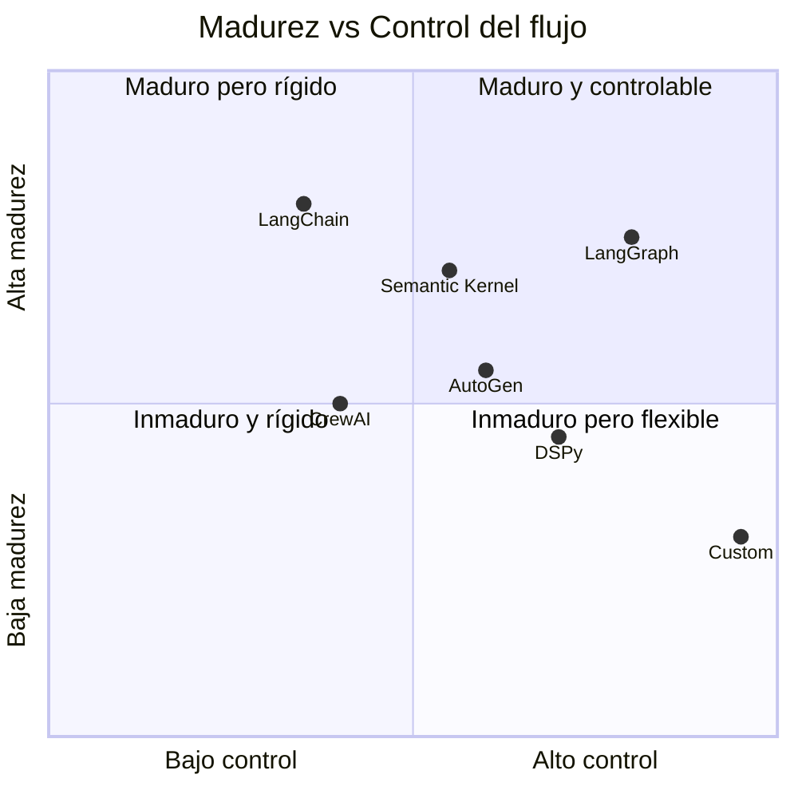
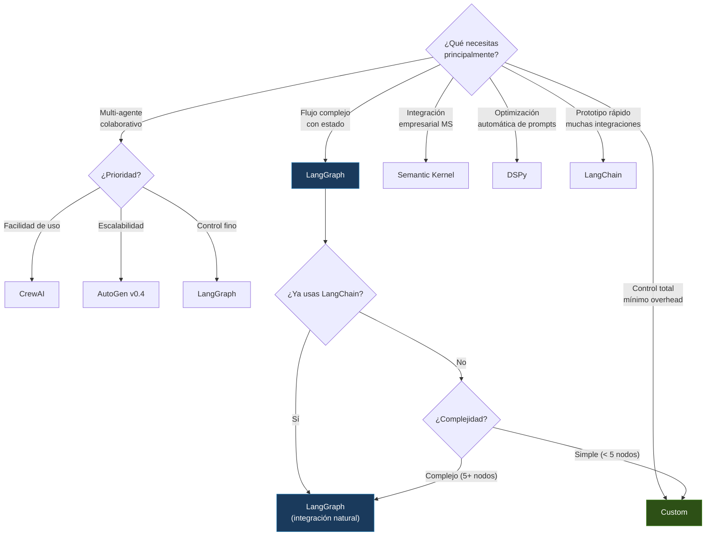

---
tags:
  - framework
  - agentes
  - comparativa
aliases:
  - comparativa de frameworks
  - frameworks de agentes
  - LangChain vs CrewAI
  - LangGraph vs AutoGen
created: 2025-06-01
updated: 2025-06-01
category: agent-frameworks
status: volatile
difficulty: intermediate
related:
  - "[[agent-identity]]"
  - "[[agent-loop]]"
  - "[[agent-tools]]"
  - "[[mcp-protocol]]"
  - "[[architect-overview]]"
  - "[[context-engineering-overview]]"
  - "[[llm-api-design]]"
  - "[[razonamiento-llm]]"
up: "[[moc-agentes]]"
---

# Agent Frameworks Comparison

> [!abstract] Resumen
> Comparativa profunda de los principales *frameworks* para construir agentes de IA: LangChain, LangGraph, CrewAI, AutoGen, Semantic Kernel, DSPy, y la opción custom como [[architect-overview|architect]]. ==No existe un framework universalmente superior — la elección depende de si necesitas orquestación multi-agente, control fino del flujo, integración empresarial, o simplicidad==. La tendencia en 2025 apunta hacia ==frameworks más delgados y componibles frente a los monolíticos==, como demuestra la decisión de architect de implementar su loop en ~300 líneas sin dependencias externas de orquestación. ^resumen

> [!warning] Última verificación: 2025-06-01
> El ecosistema de frameworks para agentes evoluciona con extrema rapidez. LangChain lanza versiones semanalmente, AutoGen fue refactorizado completamente (v0.4), y nuevos frameworks aparecen cada mes. Verifica versiones y features antes de tomar decisiones.

---

## Criterios de evaluación

| Criterio | Peso | Qué se evalúa |
|---|---|---|
| Arquitectura | Alto | Diseño interno, patrones, extensibilidad |
| Facilidad de uso | Alto | Curva de aprendizaje, documentación, DX |
| Control del flujo | Alto | Capacidad de definir flujos complejos de agente |
| Ecosistema | Medio | Integraciones, comunidad, herramientas disponibles |
| Producción | Alto | Estabilidad, observabilidad, escalabilidad |
| Overhead | Medio | Dependencias, complejidad innecesaria, abstracción |
| Multi-agente | Medio | Soporte nativo para orquestación multi-agente |

---

## Panorama general



---

## Análisis detallado por framework

### LangChain

**Creador**: Harrison Chase / LangChain Inc.
**Lanzamiento**: Octubre 2022
**Lenguajes**: Python, JavaScript/TypeScript

LangChain fue el primer *framework* en capturar la atención masiva del ecosistema de desarrollo con LLMs. Su propuesta original era unificar la interacción con modelos, herramientas, y fuentes de datos mediante *chains* (cadenas) componibles.

> [!success] Fortalezas
> - Ecosistema más grande: cientos de integraciones pre-construidas (LLMs, vectorstores, herramientas)
> - Comunidad masiva: documentación extensa, miles de ejemplos, soporte activo
> - LangSmith para observabilidad y debugging de trazas
> - Modelo de negocio sostenible (LangChain Inc. con funding significativo)
> - LCEL (*LangChain Expression Language*) para composición declarativa

> [!failure] Debilidades
> - **Sobreingeniería**: Abstracciones que ocultan la simplicidad subyacente de una llamada a API
> - **API inestable**: Cambios breaking frecuentes que rompen código en producción
> - **Dependencias pesadas**: Instalar LangChain trae un árbol de dependencias enorme
> - **Indirección excesiva**: Para debuggear un error, a veces necesitas navegar 5+ capas de abstracción
> - **Lock-in sutil**: Una vez construyes con LangChain, migrar es costoso

> [!example]- Arquitectura interna de LangChain
> ```mermaid
> flowchart TD
>     subgraph Core["langchain-core"]
>         R["Runnables (LCEL)"]
>         P["PromptTemplates"]
>         O["OutputParsers"]
>         CB["Callbacks"]
>     end
>
>     subgraph Community["langchain-community"]
>         LLM["LLM Integrations"]
>         VS["VectorStores"]
>         TL["Tools"]
>         DL["DocumentLoaders"]
>     end
>
>     subgraph Ecosystem["Ecosistema"]
>         LS["LangSmith (observabilidad)"]
>         LG["LangGraph (flujos)"]
>         LH["LangServe (deploy)"]
>     end
>
>     R --> LLM
>     R --> VS
>     P --> R
>     O --> R
>     CB --> LS
>     R --> LG
>     R --> LH
> ```

### LangGraph

**Creador**: LangChain Inc.
**Lanzamiento**: Enero 2024
**Lenguajes**: Python, JavaScript/TypeScript

LangGraph nació como respuesta a las limitaciones de LangChain para flujos de agentes complejos. Usa un modelo de grafos con estado (*stateful graphs*) donde los nodos son funciones y las aristas definen el flujo.

> [!success] Fortalezas
> - **Control preciso del flujo**: Grafos dirigidos permiten definir exactamente qué nodo se ejecuta cuándo
> - **Estado persistente**: `StateGraph` mantiene estado tipado entre nodos
> - **Checkpointing**: Permite pausar, persistir y reanudar la ejecución del grafo
> - **Human-in-the-loop**: Soporte nativo para interrumpir y pedir aprobación humana
> - **Subgrafos**: Composición de grafos dentro de grafos para sistemas complejos

> [!failure] Debilidades
> - Curva de aprendizaje pronunciada: el modelo mental de grafos no es intuitivo para todos
> - Acoplado al ecosistema LangChain (aunque cada vez menos)
> - Debugging complejo: los errores dentro de nodos del grafo pueden ser crípticos
> - ==Overhead para casos simples==: si tu agente es un loop con herramientas, un grafo es excesivo

> [!example]- Ejemplo de LangGraph: agente con aprobación humana
> ```python
> from langgraph.graph import StateGraph, END
> from typing import TypedDict, Literal
>
> class AgentState(TypedDict):
>     messages: list
>     plan: str
>     approved: bool
>
> def plan_node(state: AgentState) -> AgentState:
>     # LLM genera plan
>     plan = llm.invoke(state["messages"])
>     return {"plan": plan.content}
>
> def human_approval(state: AgentState) -> AgentState:
>     # Interrumpe para aprobación humana
>     return {"approved": True}  # O False
>
> def execute_node(state: AgentState) -> AgentState:
>     # Ejecuta el plan aprobado
>     result = execute_plan(state["plan"])
>     return {"messages": state["messages"] + [result]}
>
> def should_continue(state: AgentState) -> Literal["execute", "end"]:
>     return "execute" if state["approved"] else "end"
>
> graph = StateGraph(AgentState)
> graph.add_node("plan", plan_node)
> graph.add_node("approve", human_approval)
> graph.add_node("execute", execute_node)
> graph.add_edge("plan", "approve")
> graph.add_conditional_edges("approve", should_continue)
> graph.add_edge("execute", END)
> graph.set_entry_point("plan")
>
> app = graph.compile(checkpointer=MemorySaver())
> ```

### CrewAI

**Creador**: João Moura
**Lanzamiento**: Diciembre 2023
**Lenguaje**: Python

CrewAI introduce la metáfora de un "equipo" de agentes, donde cada agente tiene un rol, un *backstory* (historia de fondo), y herramientas específicas. Los agentes colaboran en "tareas" con dependencias entre ellas.

> [!success] Fortalezas
> - API intuitiva: la metáfora de equipo/rol/tarea es fácil de entender
> - Rápido para prototipar sistemas multi-agente
> - Buena documentación y ejemplos prácticos
> - Delegación entre agentes: un agente puede delegar sub-tareas a otro

> [!failure] Debilidades
> - **Control limitado**: Difícil de controlar el flujo exacto de ejecución
> - **Calidad impredecible**: La delegación automática entre agentes a veces produce loops infinitos o resultados sin sentido
> - **Poco maduro para producción**: Manejo de errores básico, sin observabilidad integrada robusta
> - **Overhead de tokens**: Cada agente mantiene su propio prompt completo, multiplicando el consumo

### AutoGen

**Creador**: Microsoft Research
**Lanzamiento**: Septiembre 2023 (refactorizado como v0.4 "AutoGen Core" en 2024)
**Lenguaje**: Python

AutoGen se enfoca en la conversación entre agentes como primitiva fundamental. Cada agente es un participante en una conversación multi-partido, y la coordinación emerge del protocolo de conversación.

> [!success] Fortalezas
> - Modelo conversacional elegante para ciertos tipos de problemas
> - Soporte nativo para ejecución de código en sandbox (*code execution*)
> - Respaldado por Microsoft Research con investigación activa
> - v0.4 trae modelo de actores con runtime distribuido

> [!failure] Debilidades
> - La refactorización v0.4 rompió compatibilidad con todo el código existente
> - Documentación fragmentada entre v0.2 y v0.4
> - El modelo conversacional no escala bien para flujos complejos no lineales
> - Sin ecosistema de integraciones comparable a LangChain

### Semantic Kernel

**Creador**: Microsoft
**Lanzamiento**: Marzo 2023
**Lenguajes**: C#, Python, Java

Semantic Kernel es la apuesta de Microsoft para integrar IA en aplicaciones empresariales existentes. Diseñado para ser un SDK de orquestación de IA dentro del stack de Microsoft.

> [!success] Fortalezas
> - ==Integración profunda con ecosistema Microsoft== (Azure, .NET, Office)
> - Diseñado para producción empresarial desde el día uno
> - Soporte multi-lenguaje real (C#, Python, Java)
> - *Planners* que generan planes de ejecución automáticamente
> - Modelo de plugins extensible y bien definido

> [!failure] Debilidades
> - Enfocado en ecosistema Microsoft — menos útil fuera de Azure
> - Abstracción orientada a enterprise puede sentirse pesada para proyectos pequeños
> - Comunidad más pequeña que LangChain
> - Documentación a veces desfasada entre lenguajes

### DSPy

**Creador**: Stanford NLP (Omar Khattab et al.)
**Lanzamiento**: 2023
**Lenguaje**: Python

DSPy (*Declarative Self-improving Python*) toma un enfoque radicalmente diferente: en lugar de escribir prompts manualmente, defines *signatures* (firmas) y *modules* (módulos) que el framework optimiza automáticamente mediante compilación.

> [!success] Fortalezas
> - **Paradigma revolucionario**: Elimina la ingeniería de prompts manual
> - **Optimización automática**: Compila prompts basándose en ejemplos de entrenamiento
> - **Reproducibilidad**: Los programas DSPy son deterministas una vez compilados
> - **Composición algebraica**: Los módulos se componen como funciones

> [!failure] Debilidades
> - Curva de aprendizaje muy pronunciada — requiere repensar cómo trabajas con LLMs
> - Menos intuitivo para agentes con herramientas — mejor para pipelines de NLP
> - Comunidad pequeña (aunque creciendo rápidamente)
> - La compilación requiere datasets de ejemplos, no siempre disponibles

> [!example]- Ejemplo de DSPy: programa con signature y módulo
> ```python
> import dspy
>
> # Definir signature (qué hace el módulo)
> class GenerateAnswer(dspy.Signature):
>     """Responde preguntas usando el contexto proporcionado."""
>     context = dspy.InputField(desc="información relevante")
>     question = dspy.InputField()
>     answer = dspy.OutputField(desc="respuesta concisa")
>
> # Definir módulo (cómo lo hace)
> class RAG(dspy.Module):
>     def __init__(self):
>         self.retrieve = dspy.Retrieve(k=3)
>         self.generate = dspy.ChainOfThought(GenerateAnswer)
>
>     def forward(self, question):
>         context = self.retrieve(question).passages
>         answer = self.generate(context=context, question=question)
>         return answer
>
> # Compilar (optimiza prompts automáticamente)
> teleprompter = dspy.BootstrapFewShot(metric=my_metric)
> compiled_rag = teleprompter.compile(RAG(), trainset=train_examples)
> ```

### Custom (como architect)

[[architect-overview|architect]] representa el enfoque de implementación custom: construir exactamente lo que necesitas sin dependencias de frameworks de orquestación.

> [!success] Fortalezas
> - **Control total**: Cada línea del loop es tuya, la puedes debuggear trivialmente
> - **Mínimas dependencias**: Solo necesitas un cliente HTTP para la API del LLM
> - **Rendimiento predecible**: Sin capas de abstracción que introduzcan latencia o bugs ocultos
> - **Sync-first**: architect es síncrono por diseño — más simple de razonar, debuggear y testear
> - **~300 líneas**: El loop completo cabe en un archivo legible

> [!failure] Debilidades
> - Hay que implementar todo desde cero: retry logic, streaming, observabilidad
> - Sin comunidad: los bugs los encuentras y corriges tú
> - Riesgo de reinventar la rueda mal
> - Sin integraciones pre-construidas — cada herramienta nueva requiere código

> [!example]- Arquitectura simplificada del loop de architect
> ```python
> # El loop de architect en ~30 líneas conceptuales
> def agent_loop(task: str, agent_type: str, config: Config):
>     system_prompt = build_system_prompt(agent_type, config)
>     messages = [{"role": "system", "content": system_prompt}]
>     messages.append({"role": "user", "content": task})
>     tools = get_allowed_tools(agent_type)
>
>     while True:
>         response = llm_client.chat(
>             messages=messages,
>             tools=[t.schema() for t in tools],
>         )
>
>         if response.finish_reason == "stop":
>             break  # Agente terminó
>
>         if response.finish_reason == "tool_use":
>             for tool_call in response.tool_calls:
>                 tool = find_tool(tool_call.name, tools)
>
>                 if config.confirm_mode and tool.is_destructive:
>                     if not ask_user_confirmation(tool_call):
>                         continue
>
>                 result = tool.execute(tool_call.arguments)
>                 messages.append(tool_result(tool_call.id, result))
>
>         messages.append(response.message)
> ```

---

## Comparativa general

| Criterio | LangChain | LangGraph | CrewAI | AutoGen | Semantic Kernel | DSPy | ==Custom== |
|---|---|---|---|---|---|---|---|
| **Curva de aprendizaje** | Media | Alta | Baja | Media | Media | ==Muy alta== | Variable |
| **Control del flujo** | Bajo | ==Alto== | Bajo | Medio | Medio | Medio | ==Total== |
| **Ecosistema** | ==Enorme== | Grande | Medio | Medio | Grande (MS) | Pequeño | Ninguno |
| **Producción-ready** | Medio | Alto | Bajo | Medio | ==Alto== | Bajo | Variable |
| **Multi-agente** | Parcial | Sí | ==Nativo== | ==Nativo== | Parcial | No | Manual |
| **Overhead** | ==Alto== | Medio | Medio | Medio | Medio | Bajo | ==Mínimo== |
| **Observabilidad** | LangSmith | LangSmith | Básica | Básica | Azure | Ninguna | Manual |
| **Madurez** | Alta | Media | Baja | Media | Alta | Baja | N/A |
| **Estrellas GitHub** | ~95K | ~10K | ~25K | ~35K | ~22K | ~20K | N/A |

---

## Árbol de decisión



---

## Por qué architect eligió custom

> [!info] Decisiones de diseño de architect
> La decisión de architect de no usar LangChain, LangGraph ni ningún otro framework no fue por desconocimiento sino por diseño deliberado. Las razones:

1. **El loop es simple**: El 90% de lo que hace un agente es: enviar mensajes al LLM → ejecutar herramientas → repetir. Esto no necesita un framework de grafos — es un `while True` con un `match` dentro[^1]

2. **Sync-first**: architect es deliberadamente síncrono. Los frameworks tienden a ser async-first, lo que introduce complejidad en debugging, testing y razonamiento sobre el flujo

3. **Sin abstracción de LLM**: architect habla directamente con la API del modelo (Anthropic, OpenAI). No necesita una capa de abstracción que unifique proveedores cuando solo usa uno a la vez

4. **Extensibilidad por herramientas, no por plugins**: En lugar del sistema de plugins de LangChain o Semantic Kernel, architect extiende su funcionalidad mediante [[agent-tools|herramientas]] que implementan `BaseTool` y *skills* que son archivos Markdown (ver [[agent-identity]])

5. **Debuggabilidad**: Cuando algo falla en architect, el stacktrace apunta a código del proyecto, no a las entrañas de `langchain_core.runnables.base.RunnableSequence.__call__`

> [!warning] Cuándo custom NO es la respuesta
> - Si necesitas cambiar entre 5+ proveedores de LLM frecuentemente
> - Si tu equipo rota desarrolladores y necesitas estándares de la industria
> - Si necesitas las integraciones pre-construidas (100+ vectorstores, 50+ loaders)
> - Si necesitas observabilidad enterprise desde el día uno

---

## Tendencias emergentes (2025)

El ecosistema de frameworks está convergiendo hacia algunos patrones:

### 1. Frameworks delgados sobre APIs estándar

La tendencia es hacia frameworks que añaden valor sin ocultar la API subyacente. Vercel AI SDK, Instructor, y Mirascope son ejemplos de esta filosofía.

### 2. Interoperabilidad vía MCP

El [[mcp-protocol|Model Context Protocol]] está emergiendo como la capa de integración estándar, reduciendo la necesidad de que cada framework implemente sus propias integraciones.

### 3. Compilación de agentes

Inspirado por DSPy, la idea de "compilar" agentes — optimizar sus prompts y flujos automáticamente basándose en métricas — está ganando tracción.

### 4. Frameworks opinados por dominio

En lugar de frameworks genéricos, están surgiendo frameworks especializados: para coding agents (Aider, [[architect-overview|architect]]), para research agents (STORM, GPT-Researcher), para data agents (PandasAI).

> [!question] Debate abierto: ¿framework o librería?
> - **Pro-framework**: "Los frameworks dan estructura, previenen errores comunes y aceleran el desarrollo" — defendido por LangChain, CrewAI
> - **Pro-librería**: "Los frameworks imponen decisiones y crean lock-in; las librerías dan building blocks sin overhead" — defendido por DSPy, Instructor, architect
> - Mi valoración: para aprender y prototipar, un framework acelera; para producción, ==entiende cada línea de lo que ejecutas==

---

## Relación con el ecosistema

> [!info] Conexiones con mis herramientas
> - **[[intake-overview|intake]]**: No usa ningún framework externo para su lógica de agente. Su servidor [[mcp-protocol|MCP]] es implementación directa, lo que facilita que cualquier framework (o ninguno) pueda consumirlo
> - **[[architect-overview|architect]]**: Ejemplo paradigmático de enfoque custom. Su loop de ~300 líneas demuestra que para agentes de codificación, la complejidad del framework puede superar el valor que aporta
> - **[[vigil-overview|vigil]]**: Podría beneficiarse de LangGraph para definir el flujo de inspección como grafo — pero la simplicidad de su tarea (leer → evaluar → reportar) no lo justifica
> - **[[licit-overview|licit]]**: Candidato interesante para Semantic Kernel si se quisiera integrar con el ecosistema legal de Microsoft (SharePoint, Purview) en el futuro

---

## Enlaces y referencias

**Notas relacionadas:**
- [[agent-loop]] — La mecánica interna que cada framework implementa de forma diferente
- [[agent-identity]] — Cómo cada framework maneja la configuración de identidad del agente
- [[mcp-protocol]] — El protocolo que puede unificar la capa de herramientas entre frameworks
- [[a2a-protocol]] — El protocolo de Google para comunicación entre agentes de diferentes frameworks
- [[agent-tools]] — Las herramientas como factor diferenciador entre frameworks
- [[llm-api-design]] — Las APIs subyacentes sobre las que se construyen estos frameworks
- [[razonamiento-llm]] — Las capacidades de razonamiento que los frameworks intentan orquestar
- [[inference-optimization]] — Optimizaciones a nivel de inferencia que los frameworks pueden ocultar o exponer

> [!quote]- Referencias bibliográficas
> - LangChain Documentation, https://docs.langchain.com, 2024
> - LangGraph Documentation, https://langchain-ai.github.io/langgraph/, 2024
> - CrewAI Documentation, https://docs.crewai.com, 2024
> - AutoGen Documentation (v0.4), https://microsoft.github.io/autogen/, 2024
> - Semantic Kernel Documentation, https://learn.microsoft.com/semantic-kernel/, 2024
> - Khattab, O. et al., "DSPy: Compiling Declarative Language Model Calls into Self-Improving Pipelines", ICLR, 2024
> - Chase, H., "LangChain: The Missing Manual", Blog post, 2023
> - Código fuente de architect: implementación del agent loop

[^1]: La simplicidad del loop de architect es deliberada. Cada abstracción añadida debe justificar su existencia con valor concreto. Un `while True` con `match response.finish_reason` es trivial de entender, debuggear y mantener. Ver el código fuente para la implementación completa.
