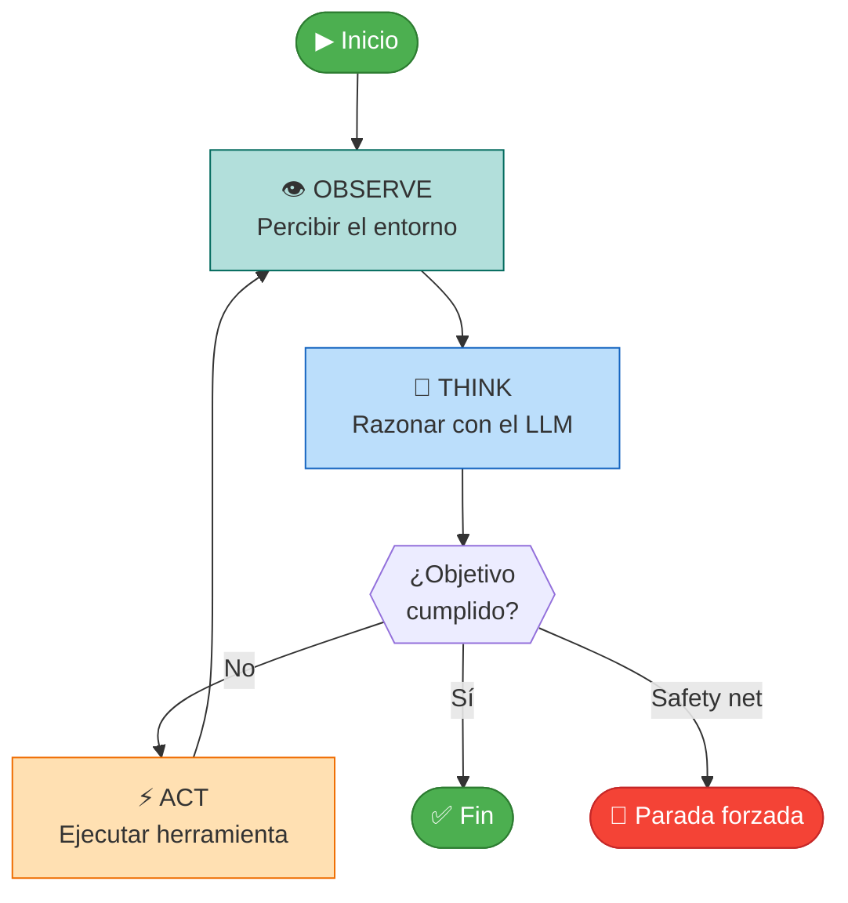
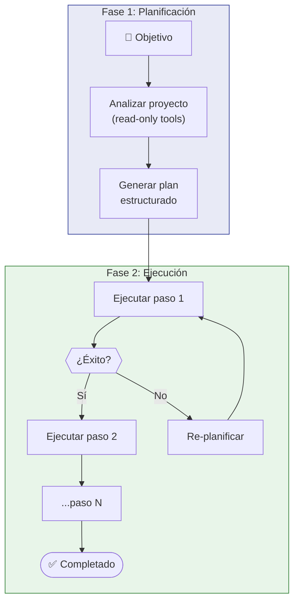
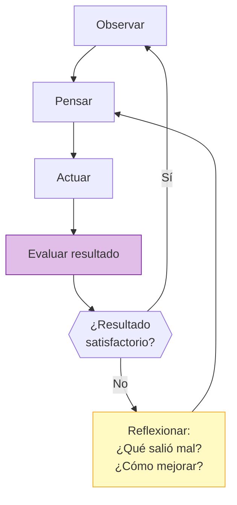
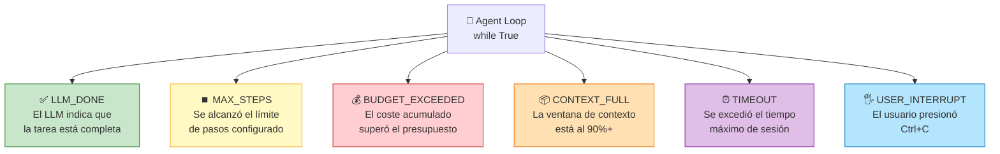
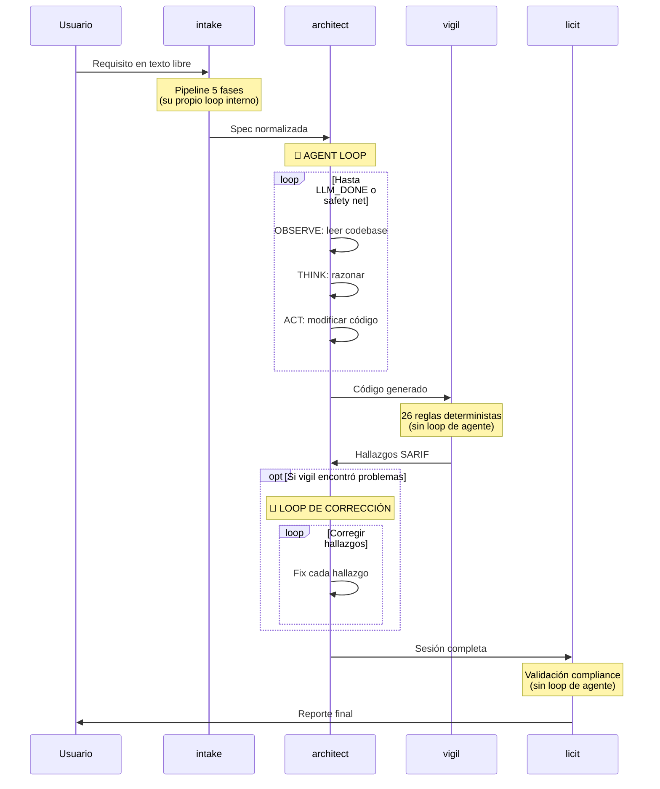
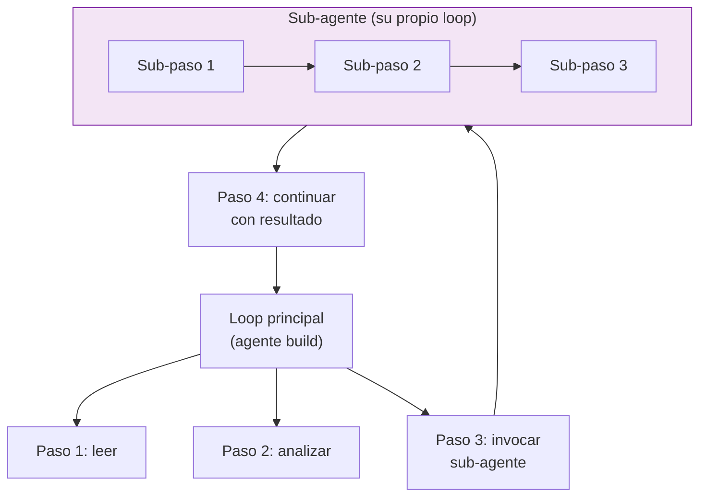

# El Agent Loop

> [!abstract]
> El *agent loop* es el ==patrón fundamental que convierte un LLM pasivo en un agente activo==. En su forma más simple es un `while True` que alterna observación, razonamiento y acción hasta que el objetivo se cumple o se activa una red de seguridad. Esta nota analiza el loop canónico *observe → think → act*, sus tres variantes principales (*ReAct*, *Plan-then-Execute*, *Reflexion*), los detalles de implementación incluyendo condiciones de parada y safety nets, y cómo [[architect-overview|architect]] implementa este patrón en su `core/loop.py` con ==seis razones de parada== (`LLM_DONE`, `MAX_STEPS`, `BUDGET_EXCEEDED`, `CONTEXT_FULL`, `TIMEOUT`, `USER_INTERRUPT`) y auto-guardado de sesión. ^resumen

---

## El loop canónico: observe → think → act

Todo agente, desde el más trivial hasta el más sofisticado, comparte el mismo patrón nuclear:



### Las tres fases en detalle

**OBSERVE**: El agente recopila información del entorno. En el primer paso, esto incluye el objetivo del usuario y el contexto inicial. En pasos posteriores, incluye el resultado de la última herramienta ejecutada. La observación se formatea y se añade a la [[anatomia-agente#5. Memoria: el contexto del agente|memoria de trabajo]].

**THINK**: El LLM recibe todo el contexto acumulado (system prompt + historial de mensajes + última observación) y genera una respuesta. Esta respuesta puede ser un `tool_call` (quiere ejecutar una herramienta), texto (quiere comunicar algo), o una señal de finalización.

**ACT**: Si el LLM generó un `tool_call`, el agente lo ejecuta a través del [[tool-use-function-calling#Pipeline de ejecución|pipeline de ejecución de herramientas]]. El resultado se convierte en la observación del siguiente paso.

> [!tip] La elegancia del loop
> La belleza de este patrón es que ==toda la inteligencia está en el LLM==. El loop en sí es trivial: es un `while True` con unas pocas condiciones de parada. Toda la complejidad de decidir qué hacer, qué herramienta usar y cuándo parar emerge del razonamiento del LLM.

---

## Implementación mínima de un agent loop

> [!example]- Código completo de un agent loop mínimo funcional
> ```python
> """
> Agent loop mínimo: ~50 líneas que capturan la esencia del patrón.
> NO usar en producción: falta validación, guardrails, logging, etc.
> """
> from openai import OpenAI
> import json
>
> client = OpenAI()
>
> # Definición de herramientas disponibles
> tools = [
>     {
>         "type": "function",
>         "function": {
>             "name": "read_file",
>             "description": "Lee el contenido de un fichero",
>             "parameters": {
>                 "type": "object",
>                 "properties": {
>                     "path": {"type": "string", "description": "Ruta al fichero"}
>                 },
>                 "required": ["path"]
>             }
>         }
>     },
>     {
>         "type": "function",
>         "function": {
>             "name": "write_file",
>             "description": "Escribe contenido a un fichero",
>             "parameters": {
>                 "type": "object",
>                 "properties": {
>                     "path": {"type": "string"},
>                     "content": {"type": "string"}
>                 },
>                 "required": ["path", "content"]
>             }
>         }
>     }
> ]
>
> # Ejecutores de herramientas
> def execute_tool(name: str, args: dict) -> str:
>     if name == "read_file":
>         return open(args["path"]).read()
>     elif name == "write_file":
>         open(args["path"], "w").write(args["content"])
>         return f"Fichero {args['path']} escrito correctamente."
>     return f"Herramienta {name} no encontrada."
>
> def agent_loop(goal: str, max_steps: int = 20) -> str:
>     """El loop fundamental: observe → think → act."""
>     messages = [
>         {"role": "system", "content": "Eres un agente de código. "
>          "Usa herramientas para completar la tarea del usuario."},
>         {"role": "user", "content": goal}
>     ]
>
>     for step in range(max_steps):
>         # THINK: el LLM razona y decide
>         response = client.chat.completions.create(
>             model="gpt-4o",
>             messages=messages,
>             tools=tools
>         )
>         msg = response.choices[0].message
>         messages.append(msg.model_dump())
>
>         # ¿El LLM quiere parar? (no hay tool_calls)
>         if not msg.tool_calls:
>             return msg.content  # FIN: el agente terminó
>
>         # ACT: ejecutar cada herramienta solicitada
>         for tool_call in msg.tool_calls:
>             args = json.loads(tool_call.function.arguments)
>             result = execute_tool(tool_call.function.name, args)
>
>             # OBSERVE: el resultado se convierte en observación
>             messages.append({
>                 "role": "tool",
>                 "tool_call_id": tool_call.id,
>                 "content": result
>             })
>
>     return "Se alcanzó el límite máximo de pasos."
>
> # Uso
> result = agent_loop("Lee el fichero main.py y añade type hints a todas las funciones")
> print(result)
> ```

Este código captura la esencia del patrón, pero un agente de producción como [[architect-overview|architect]] necesita mucho más:

- ==Condiciones de parada robustas== (no solo `max_steps`)
- ==Validación de herramientas== antes de ejecutar
- ==Guardrails de seguridad== que prevengan acciones destructivas
- ==Logging y observabilidad== para debuggear sesiones
- ==Gestión de errores== cuando herramientas fallan
- ==Auto-guardado de sesión== para recuperación

---

## Variantes del loop

No todos los agentes usan el loop canónico. Existen tres variantes principales, cada una optimizada para diferentes escenarios:

### Variante 1: ReAct Loop

El patrón *ReAct* (*Reasoning + Acting*) [^1] es la variante más popular. Alterna razonamiento explícito con acciones en cada paso:

```
Paso 1:
  Thought: Necesito entender la estructura del proyecto.
  Action: list_dir(".")
  Observation: ["src/", "tests/", "README.md", "pyproject.toml"]

Paso 2:
  Thought: Voy a revisar pyproject.toml para ver las dependencias.
  Action: read_file("pyproject.toml")
  Observation: [contenido del fichero]

Paso 3:
  Thought: El proyecto usa FastAPI. Necesito ver los endpoints.
  Action: search_code("@app.get|@app.post", "src/")
  Observation: [resultados de búsqueda]
```

> [!info] ReAct con function calling moderno
> En la formulación original de ReAct (2022), el LLM generaba `Thought:`, `Action:` y `Observation:` como texto que se parseaba con regex. Con *function calling* nativo, el "Thought" es el razonamiento interno del LLM y la "Action" es un `tool_call` estructurado. Esto es más robusto y es lo que usan [[architect-overview|architect]] y la mayoría de frameworks modernos.

### Variante 2: Plan-then-Execute Loop

Separa el loop en dos fases. Primero un *planner* genera el plan completo, luego un *executor* lo sigue:



> [!tip] Cuándo usar Plan-then-Execute
> Este patrón es mejor para tareas que:
> - Tienen muchos pasos con dependencias claras
> - Requieren coherencia global (cada paso debe ser consistente con los demás)
> - Necesitan ser auditables (el plan es un artefacto revisable)
>
> [[architect-overview|architect]] usa este patrón: `architect plan` genera el plan, `architect build` lo ejecuta.

### Variante 3: Reflexion Loop

Añade una fase de auto-evaluación después de cada acción o después de un grupo de acciones [^2]:



En [[architect-overview|architect]], el agente `review` implementa la reflexión: después de que `build` genera código, `review` lo examina críticamente, busca bugs, inconsistencias y violaciones de estilo.

### Comparación de variantes

| Aspecto | ReAct | Plan-then-Execute | Reflexion |
|---|---|---|---|
| **Complejidad** | Baja | Media | Alta |
| **Coste en tokens** | Medio | Bajo (planifica una vez) | Alto (doble evaluación) |
| **Adaptabilidad** | Alta (reacciona cada paso) | Media (requiere re-planning) | Alta (aprende de errores) |
| **Trazabilidad** | Media | Alta (plan explícito) | Alta (reflexiones explícitas) |
| **Mejor para** | Tareas exploratorias | Tareas estructuradas | Tareas que requieren precisión |
| **Implementación en architect** | Agente `build` | Agente `plan` + `build` | Agente `review` |

---

## Condiciones de parada: cuándo dejar de iterar

> [!danger] Un loop sin condiciones de parada es un loop infinito
> El error más peligroso en el diseño de agentes es no establecer condiciones de parada robustas. Sin ellas, el agente puede iterar infinitamente, acumular costes astronómicos, o ejecutar acciones cada vez más erráticas a medida que su contexto se contamina.

### Las 6 StopReasons de architect

[[architect-overview|architect]] define seis razones por las que el loop puede terminar. Cada una representa un escenario diferente:



> [!example]- Detalle de cada StopReason
>
> #### `LLM_DONE` — Terminación normal
> El LLM genera una respuesta sin `tool_calls`, indicando que considera la tarea completada. Es la única razón de parada "feliz". El agente evalúa si la respuesta del LLM realmente indica finalización (no una pregunta al usuario o un mensaje intermedio).
>
> ```python
> if not response.tool_calls and not response.content.endswith("?"):
>     return StopReason.LLM_DONE
> ```
>
> #### `MAX_STEPS` — Límite de iteraciones
> Previene loops infinitos. Configurable por el usuario (default: 50 para `build`, 20 para `plan`). Cuando se alcanza, el agente guarda la sesión para poder reanudar con `resume`.
>
> ```python
> if step_count >= max_steps:
>     session.save()  # Auto-guardar para resume
>     return StopReason.MAX_STEPS
> ```
>
> #### `BUDGET_EXCEEDED` — Límite de coste
> El agente trackea el coste acumulado de todas las llamadas al LLM. Si el coste supera el presupuesto configurado, para inmediatamente. Crítico para evitar facturas sorpresa.
>
> ```python
> if session.total_cost >= budget_limit:
>     return StopReason.BUDGET_EXCEEDED
> ```
>
> #### `CONTEXT_FULL` — Ventana de contexto saturada
> Cuando el historial de mensajes ocupa más del 90% de la ventana de contexto del modelo, el agente para. Continuar con contexto casi lleno degrada la calidad del razonamiento y puede causar errores silenciosos.
>
> ```python
> fullness = count_tokens(messages) / model_context_window
> if fullness > 0.9:
>     return StopReason.CONTEXT_FULL
> ```
>
> #### `TIMEOUT` — Tiempo máximo excedido
> Configurable. Previene sesiones que se ejecutan indefinidamente. Útil en CI/CD donde un agente colgado bloquea el pipeline.
>
> #### `USER_INTERRUPT` — Ctrl+C
> Captura SIGINT/SIGTERM y realiza un cierre ordenado: guarda la sesión, hace commit de los cambios parciales en el worktree, y reporta el progreso hasta ese punto.

### Implementación robusta del loop con safety nets

> [!example]- Loop con todas las safety nets (pseudocódigo de architect)
> ```python
> import signal
> import time
> from enum import Enum
> from dataclasses import dataclass
>
> class StopReason(Enum):
>     LLM_DONE = "llm_done"
>     MAX_STEPS = "max_steps"
>     BUDGET_EXCEEDED = "budget_exceeded"
>     CONTEXT_FULL = "context_full"
>     TIMEOUT = "timeout"
>     USER_INTERRUPT = "user_interrupt"
>
> @dataclass
> class LoopConfig:
>     max_steps: int = 50
>     budget_limit: float = 5.00  # USD
>     timeout: int = 3600         # segundos
>     context_threshold: float = 0.9
>
> class AgentLoop:
>     def __init__(self, config: LoopConfig, session, llm, tools):
>         self.config = config
>         self.session = session
>         self.llm = llm
>         self.tools = tools
>         self.interrupted = False
>
>         # Capturar Ctrl+C
>         signal.signal(signal.SIGINT, self._handle_interrupt)
>
>     def _handle_interrupt(self, signum, frame):
>         self.interrupted = True
>
>     def _check_safety_nets(self, step: int) -> StopReason | None:
>         """Verificar todas las condiciones de parada."""
>         if self.interrupted:
>             return StopReason.USER_INTERRUPT
>         if step >= self.config.max_steps:
>             return StopReason.MAX_STEPS
>         if self.session.total_cost >= self.config.budget_limit:
>             return StopReason.BUDGET_EXCEEDED
>         if self.session.context_fullness >= self.config.context_threshold:
>             return StopReason.CONTEXT_FULL
>         if time.time() - self.session.start_time >= self.config.timeout:
>             return StopReason.TIMEOUT
>         return None
>
>     def run(self, goal: str) -> tuple[str, StopReason]:
>         """Ejecutar el loop principal."""
>         self.session.add_message("user", goal)
>
>         for step in range(self.config.max_steps + 1):
>             # Safety nets check
>             stop = self._check_safety_nets(step)
>             if stop:
>                 self._graceful_close(stop)
>                 return self.session.summary(), stop
>
>             # THINK: llamar al LLM
>             response = self.llm.chat(
>                 messages=self.session.messages,
>                 tools=self.tools.schemas()
>             )
>             self.session.track_cost(response.usage)
>
>             # ¿LLM terminó?
>             if not response.tool_calls:
>                 self._graceful_close(StopReason.LLM_DONE)
>                 return response.content, StopReason.LLM_DONE
>
>             # ACT: ejecutar herramientas
>             for call in response.tool_calls:
>                 result = self.tools.execute(call)
>                 self.session.add_tool_result(call.id, result)
>
>             # Auto-save cada N pasos
>             if step % 5 == 0:
>                 self.session.save()
>
>     def _graceful_close(self, reason: StopReason):
>         """Cierre ordenado: guardar sesión, commit parcial."""
>         self.session.stop_reason = reason
>         self.session.save()
>         if reason != StopReason.LLM_DONE:
>             self.session.commit_partial("WIP: sesión interrumpida")
> ```

---

## El loop en el contexto del ecosistema

### Cómo fluye una tarea a través del ecosistema



> [!info] Loops dentro de loops
> El ecosistema tiene loops anidados. El loop principal de [[architect-overview|architect]] puede invocar [[vigil-overview|vigil]] como post-hook, recibir hallazgos, y entrar en un sub-loop de corrección. Cada corrección es un nuevo ciclo observe-think-act dentro del loop principal.

---

## Patrones avanzados del loop

### Parallel Tool Calls

Los LLMs modernos pueden generar múltiples `tool_calls` en una sola respuesta. El loop puede ejecutar estas herramientas en paralelo:

```python
# Ejecución paralela de tool calls
if len(response.tool_calls) > 1:
    with ThreadPoolExecutor() as executor:
        futures = {
            executor.submit(tools.execute, call): call
            for call in response.tool_calls
        }
        for future in as_completed(futures):
            call = futures[future]
            result = future.result()
            session.add_tool_result(call.id, result)
```

> [!warning] Cuidado con las dependencias
> Las herramientas paralelas deben ser independientes. Si el agente pide `read_file("a.py")` y `write_file("a.py", ...)` en paralelo, hay una condición de carrera. Los guardrails deben detectar y serializar estos casos.

### Sub-agent Loops

[[architect-overview|architect]] soporta sub-agentes: un agente puede invocar otro agente como herramienta. Cada sub-agente tiene su propio loop con sus propias condiciones de parada:



### Graceful Degradation

Cuando una herramienta falla, el agente no debe crashear. El loop debe capturar el error y presentarlo al LLM como una observación más:

```python
try:
    result = tools.execute(call)
except ToolExecutionError as e:
    result = f"ERROR: La herramienta {call.name} falló: {e}"
    # El LLM recibirá el error como observación y decidirá cómo proceder

session.add_tool_result(call.id, result)
```

> [!success] Los errores como información
> Un buen agente trata los errores como información valiosa, no como fallos fatales. Si `npm test` falla, el agente lee el error, entiende qué test falló y por qué, y corrige el código. ==El error es una observación más en el loop==.

---

## Métricas y observabilidad del loop

> [!question] ¿Cómo saber si el loop está funcionando bien?

Cada ejecución del loop produce métricas que son esenciales para debugging y optimización:

| Métrica | Descripción | Valor saludable |
|---|---|---|
| **steps_total** | Pasos ejecutados | < 70% del max_steps |
| **stop_reason** | Por qué paró | `LLM_DONE` (los demás son problemáticos) |
| **total_cost** | Coste acumulado en USD | Dentro del budget |
| **context_fullness** | % de ventana de contexto usada | < 80% |
| **tool_calls_total** | Herramientas ejecutadas | Proporcional a la complejidad |
| **tool_errors** | Herramientas que fallaron | < 10% del total |
| **tokens_in / tokens_out** | Tokens consumidos y generados | Para tracking de costes |
| **duration_seconds** | Duración total de la sesión | Dentro del timeout |

[[architect-overview|architect]] exporta estas métricas vía *OpenTelemetry*, lo que permite monitorizar agentes en producción con herramientas estándar como Grafana, Jaeger o Datadog. Ver [[observabilidad-agentes|observabilidad de agentes]] para más detalle.

---

## Anti-patrones del loop

> [!failure] Errores comunes en la implementación del loop
>
> **1. Loop sin max_steps**: El agente itera indefinidamente. Siempre poner un límite, aunque sea alto (100-200 pasos).
>
> **2. Loop sin budget tracking**: Una sesión de 500 pasos con GPT-4o puede costar $50+. Sin tracking, la factura es una sorpresa.
>
> **3. Ignorar CONTEXT_FULL**: Cuando el contexto se llena, el LLM pierde coherencia. Seguir iterando degrada la calidad y puede generar acciones incorrectas.
>
> **4. No capturar SIGINT**: Si el usuario hace Ctrl+C y el proceso muere sin guardar, todo el progreso se pierde. Capturar la señal y hacer cierre ordenado.
>
> **5. Re-intentar herramientas fallidas infinitamente**: Si `npm install` falla 3 veces seguidas, probablemente hay un problema que el agente no puede resolver reintenando. Parar y pedir ayuda.
>
> **6. No auto-guardar**: Sesiones largas (30+ minutos) deben auto-guardarse periódicamente. Un crash sin auto-save pierde todo el progreso.

---

## Relación con el ecosistema

- **[[intake-overview|intake]]**: tiene su propio loop interno de 5 fases para procesar requisitos, pero no es un *agent loop* en el sentido estricto: las fases son deterministas, no dependientes de un LLM. Sin embargo, la fase de normalización sí usa un LLM y podría considerarse un mini agent loop de un solo paso.

- **[[architect-overview|architect]]**: implementa el ==agent loop de referencia== del ecosistema. Su `core/loop.py` es la materialización directa de los patrones descritos en esta nota. Los 4 agentes (plan, build, resume, review) comparten el mismo loop pero con configuraciones diferentes (distintos max_steps, distintas herramientas, distintos system prompts).

- **[[vigil-overview|vigil]]**: NO tiene agent loop. Es deliberadamente determinista: aplica 26 reglas en una sola pasada sin iteración ni razonamiento LLM. Esto es una decisión de diseño --- un scanner de seguridad que depende de un LLM sería tan impredecible como el código que analiza.

- **[[licit-overview|licit]]**: tampoco tiene agent loop. Opera como validador de compliance en una sola pasada. Sin embargo, consume los logs del agent loop de architect (steps, tool calls, stop reasons) para generar reportes de trazabilidad exigidos por la EU AI Act.

---

## Enlaces y referencias

> [!quote]- Bibliografía
> - Yao, S., et al. (2022). *ReAct: Synergizing Reasoning and Acting in Language Models*. arXiv:2210.03629 [^1]
> - Shinn, N., et al. (2023). *Reflexion: Language Agents with Verbal Reinforcement Learning*. arXiv:2303.11366 [^2]
> - Significant Gravitas. (2023-2024). *AutoGPT: An Autonomous GPT-4 Experiment*. GitHub [^3]
> - Anthropic. (2024). *Building effective agents*. Anthropic Blog [^4]
> - Wang, L., et al. (2023). *Plan-and-Solve Prompting*. arXiv:2305.04091 [^5]

### Notas relacionadas

- [[que-es-un-agente-ia]] — Contexto: qué es un agente y por qué necesita un loop
- [[anatomia-agente]] — Los componentes que el loop orquesta
- [[planning-agentes]] — La fase de planificación dentro del loop
- [[tool-use-function-calling]] — Las herramientas que el loop ejecuta
- [[safety-nets-agentes]] — Condiciones de parada en profundidad
- [[observabilidad-agentes]] — Métricas y monitoring del loop
- [[architect-overview]] — Implementación de referencia del loop
- [[moc-agentes]] — Mapa de contenido

---

[^1]: Yao, S., Zhao, J., Yu, D., et al. (2022). *ReAct: Synergizing Reasoning and Acting in Language Models*. arXiv:2210.03629.
[^2]: Shinn, N., Cassano, F., Gopinath, A., et al. (2023). *Reflexion: Language Agents with Verbal Reinforcement Learning*. arXiv:2303.11366.
[^3]: Significant Gravitas. (2023-2024). *AutoGPT*. https://github.com/Significant-Gravitas/AutoGPT
[^4]: Anthropic. (2024). *Building effective agents*. https://www.anthropic.com/research/building-effective-agents
[^5]: Wang, L., Xu, W., Lan, Y., et al. (2023). *Plan-and-Solve Prompting*. arXiv:2305.04091.
