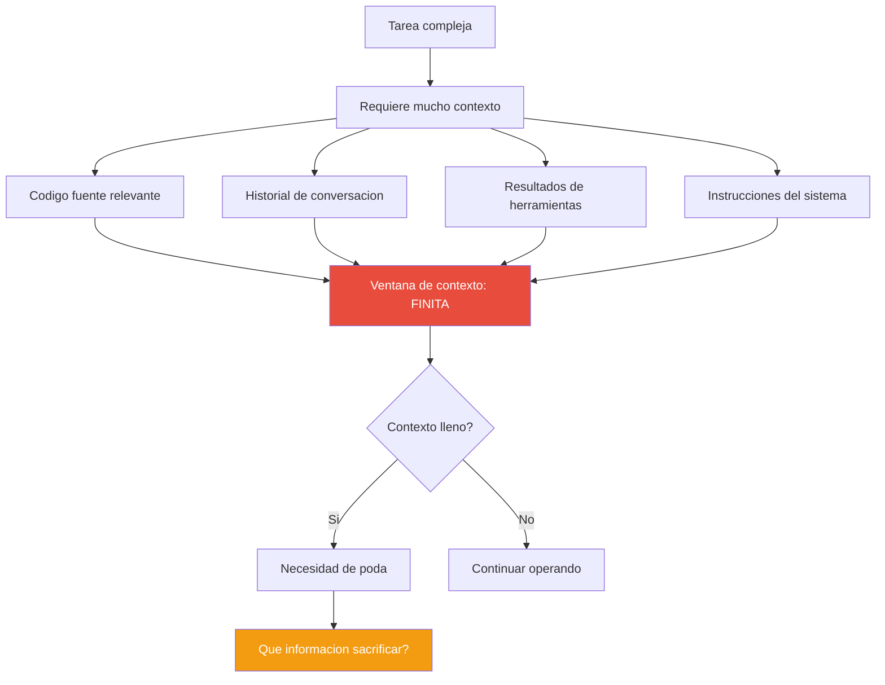
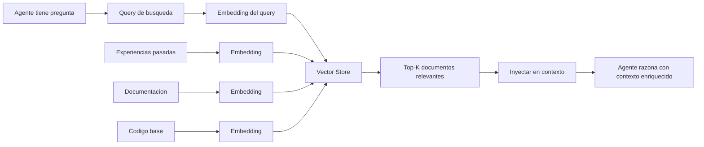
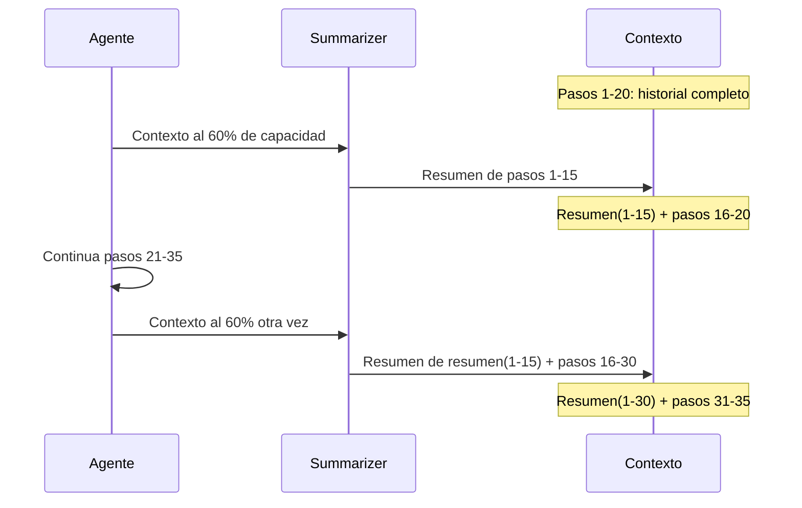
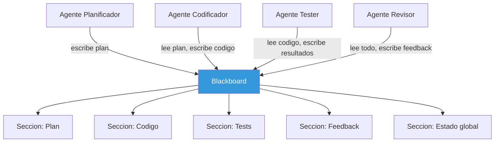
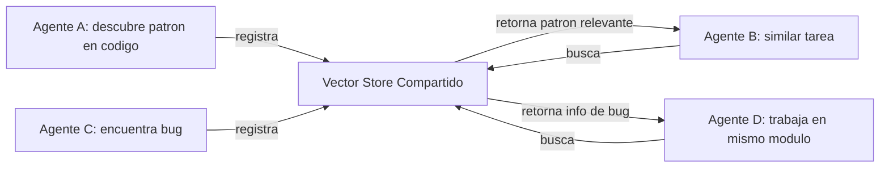
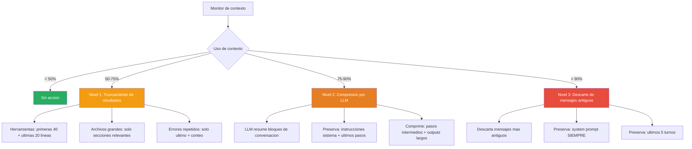
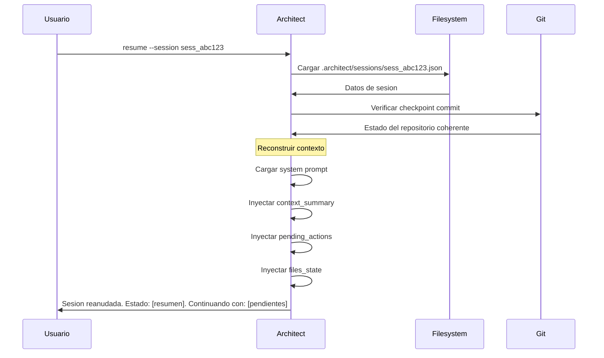
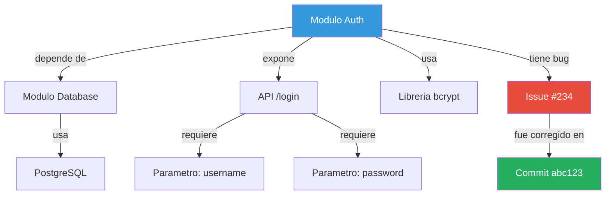
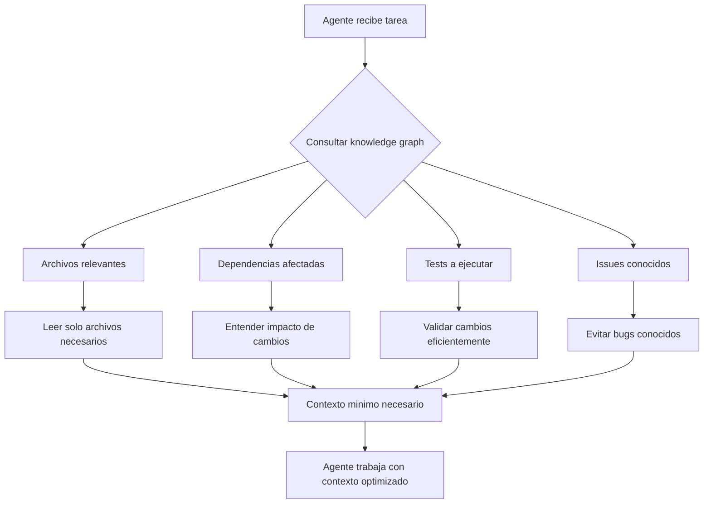

# Patrones de Memoria para Agentes IA

> [!abstract] Resumen
> La memoria es el recurso mas critico y mas limitado de un agente de IA. A diferencia del software tradicional que puede acceder a cantidades arbitrarias de almacenamiento, un agente esta ==confinado a su ventana de contexto==, tipicamente entre 128K y 1M tokens. Como un agente gestiona esta memoria finita --que informacion retener, que comprimir, que descartar-- determina directamente su capacidad de completar tareas complejas. Este documento explora los patrones de memoria fundamentales: ==RAG como memoria externa==, estrategias de ==memoria conversacional==, ==memoria compartida entre agentes==, el sistema de ==poda de 3 niveles== de [[architect-overview]], ==persistencia de sesiones==, y ==grafos de conocimiento== como memoria estructurada. ^resumen

---

## El problema de la memoria finita

Los modelos de lenguaje tienen una paradoja fundamental: su capacidad de razonamiento es proporcional a la cantidad de contexto disponible, pero su ventana de contexto es finita y costosa.



> [!info] La economia del contexto
> Cada token en la ventana de contexto tiene un ==costo directo== (facturacion por token) y un ==costo de oportunidad== (espacio que no puede usarse para otra informacion). Un agente eficiente trata su contexto como un recurso escaso y aplica estrategias conscientes para maximizar su valor informativo por token.

| Modelo | Ventana de contexto | Tokens equivalentes | Coste aproximado (input) |
|--------|--------------------|--------------------|------------------------|
| GPT-4o | 128K tokens | ~96K palabras | $0.32 por ventana llena |
| Claude Sonnet | 200K tokens | ~150K palabras | $0.60 por ventana llena |
| Claude Opus | 200K tokens | ~150K palabras | $3.00 por ventana llena |
| Gemini 1.5 Pro | 1M tokens | ~750K palabras | $1.25 por ventana llena |

---

## RAG como memoria externa

### Concepto fundamental

*RAG* (*Retrieval-Augmented Generation*) permite al agente consultar un almacen de conocimiento externo para obtener informacion relevante bajo demanda, en lugar de mantener todo en la ventana de contexto:



> [!tip] RAG como memoria a largo plazo
> RAG funciona como la ==memoria a largo plazo== del agente: un almacen practicamente ilimitado de informacion que el agente puede consultar selectivamente. Esto contrasta con la ventana de contexto que actua como ==memoria de trabajo== (*working memory*), limitada pero de acceso inmediato.

### RAG para experiencias pasadas

Un patron particularmente poderoso es usar RAG para que el agente aprenda de tareas anteriores:

> [!example]- Implementacion de memoria de experiencias con RAG
> ```python
> class ExperienceMemory:
>     """Almacena y recupera experiencias pasadas del agente."""
>
>     def __init__(self, vector_store):
>         self.store = vector_store
>
>     def record_experience(self, task, actions, result, lessons):
>         """Registra una experiencia completada."""
>         experience = {
>             "task_description": task,
>             "actions_taken": actions,
>             "result": result,
>             "success": result.status == "COMPLETE",
>             "lessons_learned": lessons,
>             "cost": result.cost,
>             "steps": result.steps,
>             "timestamp": datetime.now().isoformat()
>         }
>         embedding = self.embed(
>             f"{task} {lessons} {result.summary}"
>         )
>         self.store.add(embedding, experience)
>
>     def recall_relevant(self, current_task, k=3):
>         """Recupera experiencias relevantes para la tarea actual."""
>         query_embedding = self.embed(current_task)
>         experiences = self.store.search(query_embedding, top_k=k)
>
>         # Formatear para inyeccion en contexto
>         context = "EXPERIENCIAS PASADAS RELEVANTES:\n"
>         for exp in experiences:
>             context += f"\n- Tarea similar: {exp['task_description']}"
>             context += f"\n  Resultado: {'Exito' if exp['success'] else 'Fallo'}"
>             context += f"\n  Lecciones: {exp['lessons_learned']}\n"
>         return context
> ```

### Tipos de almacenes vectoriales

| Almacen | Tipo | Ventaja principal | Caso de uso |
|---------|------|------------------|-------------|
| ChromaDB | Embebido | Sin infraestructura, facil de empezar | Prototipos, agentes locales |
| Pinecone | Cloud | Escalable, managed | Produccion con multiples agentes |
| Weaviate | Self-hosted/Cloud | Busqueda hibrida (vector + keyword) | Cuando se necesita precision |
| Qdrant | Self-hosted/Cloud | Alto rendimiento, filtros avanzados | Volumenes grandes |
| pgvector | Extension PostgreSQL | Integra con infra existente | Si ya se usa PostgreSQL |
| FAISS | Libreria | Maximo rendimiento, en memoria | Busqueda offline, benchmarks |

---

## Memoria conversacional

### Historial completo

La estrategia mas simple: mantener toda la conversacion en la ventana de contexto.

> [!success] Ventajas del historial completo
> - Maxima fidelidad: no se pierde ninguna informacion
> - Coherencia perfecta: el agente puede referenciar cualquier punto de la conversacion
> - Simplicidad de implementacion

> [!failure] Desventajas del historial completo
> - ==Insostenible== para tareas largas: una sesion de 50+ pasos puede consumir toda la ventana
> - Costo lineal creciente: cada paso es mas caro que el anterior
> - Informacion irrelevante ocupa espacio: resultados intermedios de pasos ya superados

### Historial resumido

Se mantiene un resumen comprimido de la conversacion, actualizado periodicamente:



> [!warning] Perdida acumulativa de informacion
> Cada ciclo de resumen introduce ==perdida de informacion==. Despues de multiples ciclos de resumen-de-resumen, detalles que originalmente eran importantes pueden haberse perdido. Esto es especialmente peligroso para ==instrucciones de seguridad== que se dieron al inicio de la sesion, como se discute en [[agent-safety]].

### Ventana deslizante

Se mantienen solo los ultimos N turnos o tokens:

```python
class SlidingWindowMemory:
    """Memoria de ventana deslizante simple."""

    def __init__(self, max_tokens=50000):
        self.max_tokens = max_tokens
        self.messages = []

    def add(self, message):
        self.messages.append(message)
        self._prune()

    def _prune(self):
        """Elimina mensajes antiguos hasta estar bajo el limite."""
        total = sum(count_tokens(m) for m in self.messages)
        while total > self.max_tokens and len(self.messages) > 1:
            removed = self.messages.pop(0)
            total -= count_tokens(removed)

    def get_context(self):
        return self.messages
```

| Estrategia | Fidelidad | Costo | Complejidad | Caso de uso |
|-----------|-----------|-------|-------------|-------------|
| Historial completo | Maxima | Alto, creciente | Minima | Tareas cortas (<20 pasos) |
| Historial resumido | Media | Moderado | Media | Tareas medianas (20-100 pasos) |
| Ventana deslizante | Baja (reciente) | Constante | Minima | Tareas largas, contexto reciente |
| Hibrido (resumen + ventana) | Alta | Moderado | Alta | Tareas largas, contexto critico |

---

## Memoria compartida entre agentes

Cuando multiples agentes colaboran en una tarea, necesitan mecanismos para compartir informacion.

### Patron Blackboard

El patron *blackboard* proporciona un espacio de memoria compartido al que todos los agentes pueden leer y escribir:



> [!example]- Implementacion del patron Blackboard
> ```python
> class Blackboard:
>     """Espacio de memoria compartido entre agentes."""
>
>     def __init__(self):
>         self.sections = {}
>         self.history = []
>         self.lock = threading.Lock()
>
>     def write(self, section, key, value, author):
>         """Escribe en una seccion del blackboard."""
>         with self.lock:
>             if section not in self.sections:
>                 self.sections[section] = {}
>             self.sections[section][key] = {
>                 "value": value,
>                 "author": author,
>                 "timestamp": datetime.now().isoformat()
>             }
>             self.history.append({
>                 "action": "write",
>                 "section": section,
>                 "key": key,
>                 "author": author
>             })
>
>     def read(self, section, key=None):
>         """Lee una seccion o clave especifica."""
>         if section not in self.sections:
>             return None
>         if key:
>             return self.sections[section].get(key)
>         return self.sections[section]
>
>     def get_summary(self, max_tokens=5000):
>         """Genera un resumen del estado actual para inyectar en contexto."""
>         summary = "ESTADO DEL BLACKBOARD:\n"
>         for section, data in self.sections.items():
>             summary += f"\n## {section}\n"
>             for key, entry in data.items():
>                 summary += f"  - {key}: {str(entry['value'])[:200]}\n"
>                 summary += f"    (por {entry['author']})\n"
>         return truncate_to_tokens(summary, max_tokens)
> ```

### Vector store compartido

Multiples agentes pueden compartir un almacen vectorial para intercambiar conocimiento:

> [!info] Memoria semantica compartida
> Un vector store compartido permite que los agentes compartan conocimiento de forma ==semantica== en lugar de estructural. Un agente puede registrar una experiencia o hallazgo, y otro agente puede encontrarlo mediante busqueda por similitud, incluso si no conoce la estructura exacta de los datos.



---

## Gestion de contexto en architect: poda de 3 niveles

[[architect-overview]] implementa un sistema sofisticado de gestion de contexto con tres niveles de poda, activados progresivamente a medida que el contexto se llena:



### Nivel 1: Truncamiento de resultados de herramientas

El primer nivel de poda actua sobre los resultados de herramientas, que tipicamente son los consumidores mas grandes de contexto:

> [!example]- Logica de truncamiento Nivel 1
> ```python
> def truncate_tool_result(result: str, head=40, tail=20) -> str:
>     """
>     Trunca resultados largos de herramientas conservando
>     el inicio (head) y el final (tail) del contenido.
>
>     Razonamiento:
>     - Las primeras lineas contienen headers, imports, estructura
>     - Las ultimas lineas contienen errores, resultados, resumen
>     - El medio frecuentemente es repetitivo
>     """
>     lines = result.split('\n')
>
>     if len(lines) <= head + tail:
>         return result  # No necesita truncamiento
>
>     truncated_count = len(lines) - head - tail
>     return '\n'.join([
>         *lines[:head],
>         f"\n... [{truncated_count} lineas omitidas] ...\n",
>         *lines[-tail:]
>     ])
> ```

> [!tip] Por que 40+20 y no 30+30
> La distribucion asimetrica (40 lineas del inicio, 20 del final) se basa en la observacion empirica de que las ==primeras lineas de un archivo== contienen informacion estructural critica (imports, declaraciones de clase, signatures) mientras que las ==ultimas lineas== contienen resultados de ejecucion o errores. El centro del archivo es frecuentemente cuerpo de funciones que puede inferirse del contexto.

### Nivel 2: Compresion por LLM

Cuando el Nivel 1 no es suficiente y el contexto supera el 75% de capacidad, architect invoca al LLM para comprimir bloques de conversacion:

> [!example]- Prompt de compresion de contexto
> ```
> Resume de forma concisa la siguiente seccion de la conversacion,
> preservando:
> 1. Decisiones tomadas y su razonamiento
> 2. Archivos modificados y cambios clave
> 3. Errores encontrados y como se resolvieron
> 4. Estado actual de la tarea
> 5. Informacion de seguridad y restricciones
>
> NO preservar:
> - Outputs completos de herramientas (solo resultados clave)
> - Codigo que ya fue escrito (solo rutas de archivos)
> - Intentos fallidos que no aportaron informacion
>
> SECCION A COMPRIMIR:
> {conversation_block}
> ```

> [!warning] Riesgo de perdida de instrucciones de seguridad
> La compresion por LLM puede ==inadvertidamente descartar restricciones de seguridad== que se establecieron al inicio de la sesion. Por eso [[architect-overview]] marca ciertas instrucciones como "no comprimibles" y las preserva intactas independientemente del nivel de poda. Esto es critico para la [[agent-safety|seguridad]] del agente.

### Nivel 3: Descarte de mensajes antiguos

El ultimo recurso cuando la compresion no es suficiente:

```python
def hard_prune(messages, max_tokens, system_prompt):
    """
    Nivel 3: descarte de mensajes antiguos.
    SIEMPRE preserva:
    - System prompt completo
    - Ultimos 5 turnos de conversacion
    - Marcadores de checkpoint
    """
    preserved_start = [system_prompt]
    preserved_end = messages[-10:]  # 5 turnos = 10 mensajes (user+assistant)

    available = max_tokens - count_tokens(preserved_start) - count_tokens(preserved_end)

    # Crear resumen de lo descartado
    discarded = messages[1:-10]
    summary = llm_compress(discarded, max_tokens=available // 2)

    return preserved_start + [summary_message(summary)] + preserved_end
```

---

## Persistencia de memoria: sesiones en architect

[[architect-overview]] persiste automaticamente el estado de cada sesion, permitiendo reanudar tareas interrumpidas incluso despues de cerrar la aplicacion.

### Estructura de sesion

> [!example]- Esquema de archivo de sesion
> ```json
> {
>   "session_id": "sess_2025-06-01_abc123",
>   "version": "1.0",
>   "metadata": {
>     "task": "Implementar sistema de cache con invalidacion",
>     "started_at": "2025-06-01T10:00:00Z",
>     "last_active": "2025-06-01T10:45:00Z",
>     "status": "interrupted",
>     "stop_reason": "TIMEOUT",
>     "model": "claude-sonnet-4-20250514",
>     "total_cost_usd": 3.21,
>     "total_steps": 38
>   },
>   "context_summary": "Se implemento la clase CacheManager con metodos get/set/delete. Se creo el sistema de invalidacion por TTL. PENDIENTE: invalidacion por dependencias, tests de integracion.",
>   "files_state": {
>     "created": ["src/cache/manager.py", "src/cache/ttl.py"],
>     "modified": ["src/config.py", "tests/conftest.py"],
>     "checkpoint_commit": "architect:checkpoint:sess_abc123_step35"
>   },
>   "conversation_compressed": "...",
>   "pending_actions": [
>     "Implementar CacheDependencyTracker",
>     "Escribir tests de integracion para cache",
>     "Actualizar documentacion de API"
>   ]
> }
> ```

### Reanudacion de sesiones



> [!question] Cuanto contexto se pierde al reanudar?
> La reanudacion inevitablemente pierde parte del contexto original. Sin embargo, el resumen comprimido preserva las ==decisiones clave y el estado actual==. En la practica, la perdida es comparable a la que ocurre cuando un desarrollador humano retoma una tarea despues de un descanso: se recuerdan las decisiones importantes pero no los detalles de cada linea de codigo.

### Ubicacion de sesiones

Las sesiones se almacenan en `.architect/sessions/<id>.json` dentro del directorio del proyecto, lo que las mantiene versionadas junto al codigo y permite que diferentes miembros del equipo vean el historial de sesiones del agente.

---

## Grafos de conocimiento como memoria estructurada

### Mas alla de los vectores

Mientras que los almacenes vectoriales son excelentes para busqueda por similitud, los *knowledge graphs* proporcionan memoria ==estructurada y relacional==:



> [!tip] Knowledge graphs para agentes de codigo
> Para agentes de ingenieria de software como los del ecosistema de [[architect-overview]], un knowledge graph del codebase proporciona ==comprension estructural== que los embeddings no capturan: relaciones de dependencia, herencia de clases, flujo de datos entre modulos, y el historial de cambios de cada componente.

### Tipos de relaciones en un knowledge graph de codigo

| Relacion | Ejemplo | Utilidad para el agente |
|---------|---------|----------------------|
| `imports` | `auth.py` imports `db.py` | Saber que archivos afectan a cuales |
| `defines` | `auth.py` defines `class AuthManager` | Encontrar definiciones rapidamente |
| `calls` | `login()` calls `hash_password()` | Entender flujo de ejecucion |
| `tests` | `test_auth.py` tests `auth.py` | Saber que tests correr tras un cambio |
| `depends_on` | `AuthManager` depends_on `DatabasePool` | Entender impacto de cambios |
| `modified_by` | `auth.py` modified_by `commit:abc123` | Entender historial de cambios |
| `has_issue` | `auth.py` has_issue `#234` | Contexto de problemas conocidos |

### Consultas utiles

> [!example]- Queries al knowledge graph
> ```cypher
> // Que archivos se ven afectados si cambio auth.py?
> MATCH (f:File {name: "auth.py"})<-[:IMPORTS]-(dependent)
> RETURN dependent.name
>
> // Que tests debo correr para validar cambios en DatabasePool?
> MATCH (c:Class {name: "DatabasePool"})<-[:DEPENDS_ON]-(user)
>       <-[:TESTS]-(test)
> RETURN test.name
>
> // Que bugs hay abiertos en el modulo de autenticacion?
> MATCH (f:File)-[:BELONGS_TO]->(m:Module {name: "auth"})
>       -[:HAS_ISSUE]->(i:Issue {status: "open"})
> RETURN f.name, i.title, i.severity
> ```

### Integracion con el flujo del agente



> [!info] Knowledge graphs reducen el uso de contexto
> Al usar un knowledge graph, el agente puede ==consultar relaciones directamente== en lugar de cargar grandes cantidades de codigo en el contexto para descubrir esas relaciones. Esto reduce significativamente el consumo de contexto y, por tanto, el costo y el riesgo de desbordamiento.

---

## Patrones avanzados de memoria

### Memoria episodica vs semantica vs procedural

Analogamente a la psicologia cognitiva, la memoria del agente puede clasificarse en tres tipos[^2]:

| Tipo | Que almacena | Ejemplo | Implementacion |
|------|-------------|---------|----------------|
| **Episodica** | Experiencias especificas | "Cuando implemente auth en proyecto X, el approach Y fallo porque Z" | Vector store con metadatos temporales |
| **Semantica** | Conocimiento general | "Los JWT deben tener expiracion corta para refresh tokens" | Knowledge graph + embeddings |
| **Procedural** | Saber como hacer algo | "Para deployar, primero correr tests, luego build, luego push" | [[agentic-workflows\|Pipelines]] + ejemplos |

### Memoria con olvido selectivo

> [!question] Debe un agente olvidar?
> Contra-intuitivamente, ==olvidar selectivamente es tan importante como recordar==. Un agente que acumula toda la informacion sin curar sufre de "ruido de memoria": experiencias irrelevantes o desactualizadas contaminan las busquedas de informacion relevante. El olvido selectivo mantiene la memoria enfocada y util.

```python
class SelectiveForgetting:
    """Implementa olvido selectivo basado en relevancia y frescura."""

    def prune_memory(self, memories, current_context):
        """Elimina memorias irrelevantes o desactualizadas."""
        scored = []
        for memory in memories:
            relevance = self.compute_relevance(memory, current_context)
            freshness = self.compute_freshness(memory)
            importance = self.compute_importance(memory)

            # Score compuesto
            score = (relevance * 0.4 +
                     freshness * 0.3 +
                     importance * 0.3)
            scored.append((memory, score))

        # Mantener solo memorias sobre umbral
        threshold = 0.3
        return [m for m, s in scored if s > threshold]
```

---

## Relacion con el ecosistema

La gestion de memoria impacta cada componente del ecosistema y es impactada por ellos:

- [[intake-overview]]: el intake determina cuanta informacion contextual llega al agente desde el inicio. Un intake rico pero conciso optimiza el uso inicial de la ventana de contexto; un intake verboso puede desperdiciar tokens valiosos en informacion que podria haberse resumido
- [[architect-overview]]: implementa el sistema de poda de 3 niveles (truncamiento 40+20, compresion LLM al 75%, descarte al 90%), la persistencia de sesiones en `.architect/sessions/<id>.json`, y la reanudacion inteligente que reconstruye contexto a partir de resumenes comprimidos
- [[vigil-overview]]: los resultados de escaneo de vigil son otra fuente de informacion que consume contexto. Cuando vigil genera un reporte SARIF extenso, el sistema de poda de architect lo trunca a las secciones relevantes (hallazgos criticos y de alta severidad) para preservar espacio
- [[licit-overview]]: el provenance tracking de licit agrega metadata a cada decision del agente, lo cual enriquece la memoria a largo plazo pero tambien aumenta el consumo de almacenamiento. La integracion eficiente requiere comprimir la metadata de procedencia sin perder trazabilidad

> [!quote] Memoria como recurso estrategico
> La memoria del agente no es solo un detalle tecnico de implementacion: es un ==recurso estrategico== que determina la complejidad maxima de las tareas que el agente puede abordar. Un agente con gestion de memoria sofisticada puede resolver problemas que son imposibles para un agente con gestion ingenua, incluso si ambos usan el mismo modelo subyacente. --Principio de memoria estrategica

---

## Enlaces y referencias

> [!quote]- Bibliografia
> - Lewis, P. et al. "Retrieval-Augmented Generation for Knowledge-Intensive NLP Tasks." *NeurIPS 2020*. El paper fundacional de RAG.
> - [^2]: Tulving, E. "Episodic and Semantic Memory." *Organization of Memory*, 1972. La taxonomia original de tipos de memoria que inspira la clasificacion en agentes IA.
> - Park, J. S. et al. "Generative Agents: Interactive Simulacra of Human Behavior." *UIST 2023*. Implementacion de memoria a largo plazo para agentes generativos con patron reflection + retrieval.
> - Xu, W. et al. "MemGPT: Towards LLMs as Operating Systems." *arXiv:2310.08560*, 2023. Sistema de gestion de memoria virtual para LLMs inspirado en la paginacion de sistemas operativos.
> - Zhang, Z. et al. "A Survey on the Memory Mechanism of Large Language Model based Agents." *arXiv:2404.13501*, 2024. Survey comprensivo de mecanismos de memoria en agentes LLM.
> - Packer, C. et al. "MemGPT: Towards LLMs as Operating Systems." *ICLR 2024*. Paginacion de memoria virtual para superar limitaciones de contexto.

---

[^2]: La clasificacion de Tulving en memoria episodica y semantica, extendida con memoria procedural, proporciona un marco conceptual util para disenar sistemas de memoria en agentes de IA. Cada tipo de memoria requiere mecanismos de almacenamiento y recuperacion diferentes.
