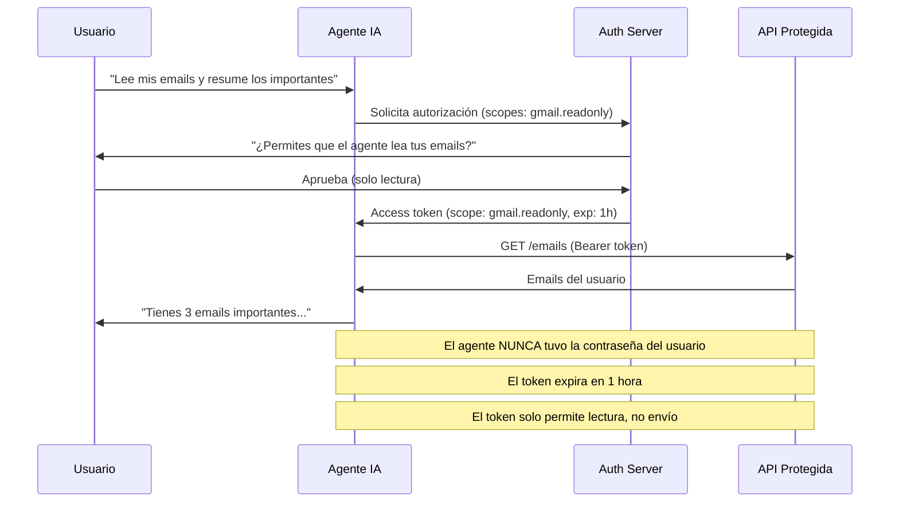
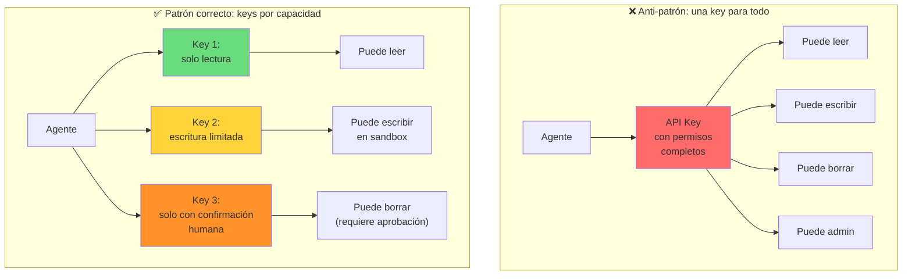
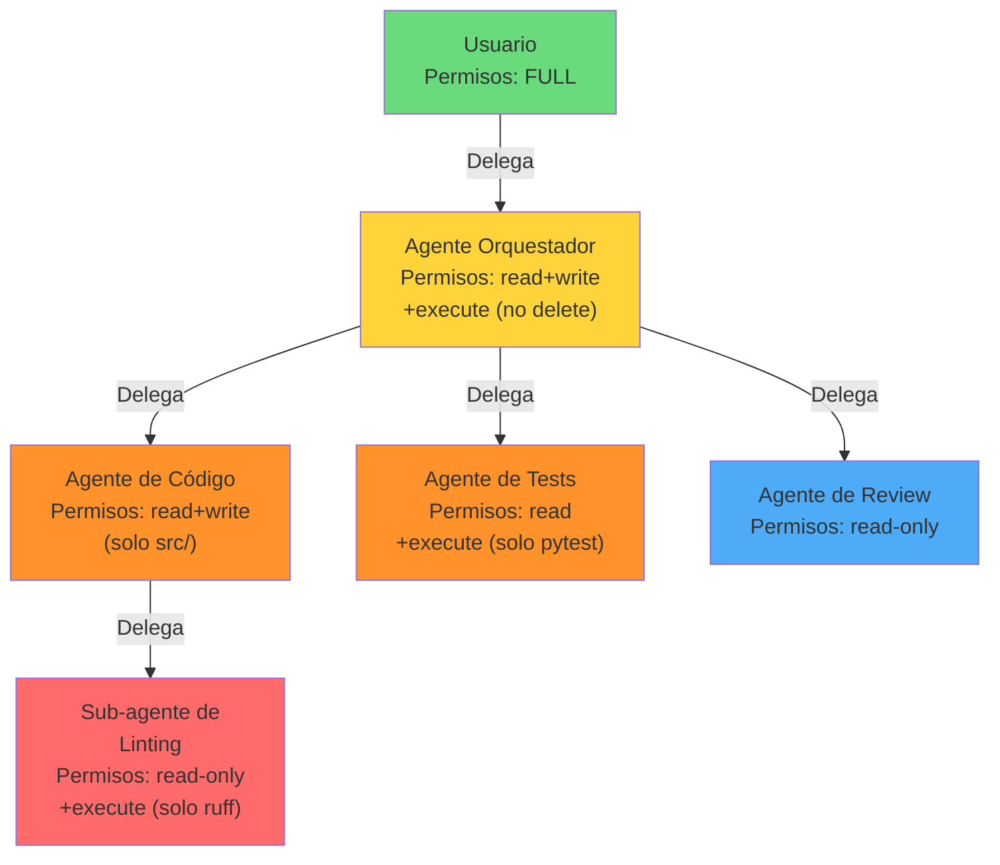
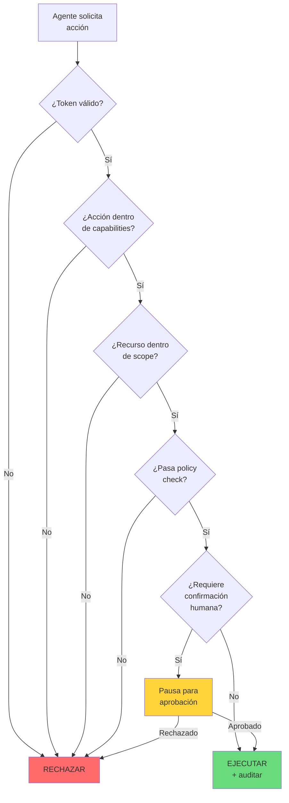
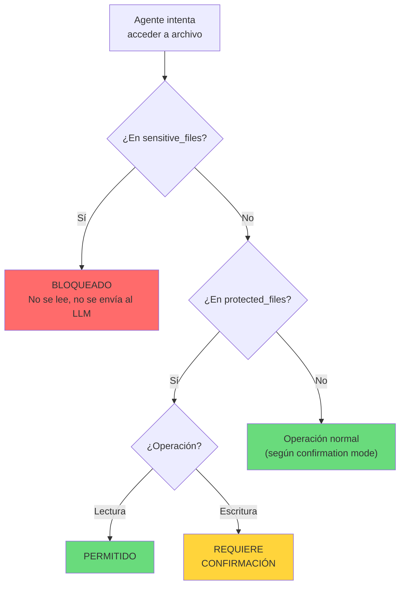
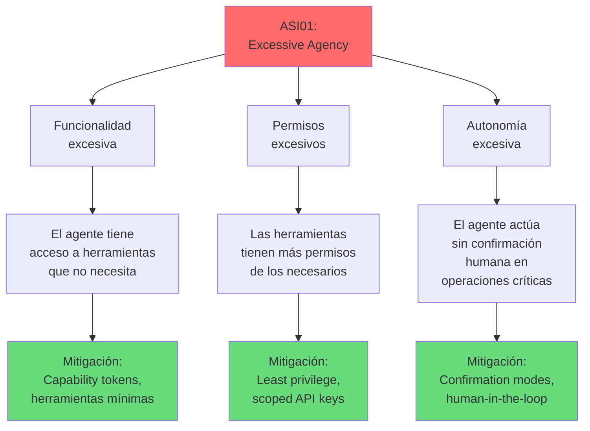

---
tags:
  - concepto
  - agentes
  - seguridad
aliases:
  - permisos de agentes
  - agent permissions
  - agent authorization
  - autenticación de agentes IA
  - agent auth
created: 2025-06-01
updated: 2025-06-01
category: agentes-ia
status: evergreen
difficulty: advanced
related:
  - "[[architect-overview]]"
  - "[[licit-overview]]"
  - "[[agent-error-handling]]"
  - "[[zero-trust-architecture]]"
  - "[[owasp-agentic-top-10]]"
  - "[[agent-tool-use]]"
  - "[[agent-sandboxing]]"
up: "[[moc-agentes]]"
---

# Permisos y Autenticación para Agentes IA

> [!abstract] Resumen
> Los agentes IA que ejecutan acciones en el mundo real — escribir código, acceder a APIs, modificar bases de datos — necesitan ==un modelo de permisos fundamentalmente diferente al de usuarios humanos==. Los desafíos incluyen: ¿cómo delegas credenciales a un agente sin darle acceso total? ¿Cómo limitas el blast radius de un agente comprometido? ¿Cómo auditas lo que un agente hizo en tu nombre? Este documento cubre OAuth para agentes, API keys con rotación y least privilege, *capability tokens* para permisos granulares por herramienta, *delegation chains* entre agentes, y *zero-trust architecture*. Se detalla cómo [[architect-overview|architect]] implementa permisos: ==confirmation modes (yolo/confirm-all/confirm-sensitive), blocklist de comandos peligrosos, protected_files y sensitive_files, path sandboxing con `Path.resolve()` + `is_relative_to()`, y flag `allow_delete`==. Se conecta con el riesgo ASI01 (*Excessive Agency*) del [[owasp-agentic-top-10|OWASP Agentic Top 10]] a través de [[licit-overview|licit]]. ^resumen

## Qué es y por qué importa

La autenticación (*authentication*) y autorización (*authorization*) para agentes IA plantea un problema que no existía antes: ==un sistema no-humano, no-determinístico, que puede alucinar y cometer errores, necesita permisos para actuar en el mundo real==.

Cuando un humano accede a un sistema, confiamos en su juicio (hasta cierto punto) para no hacer cosas destructivas. Cuando un agente IA accede al mismo sistema, ==no podemos confiar en su "juicio" de la misma manera== porque:

- Puede [[hallucinations|alucinar]] y ejecutar acciones basadas en información falsa
- Puede malinterpretar instrucciones y hacer algo diferente a lo solicitado
- Puede ser manipulado via *prompt injection* para ejecutar acciones maliciosas
- Sus acciones son difíciles de predecir con certeza

> [!danger] El riesgo fundamental: Excessive Agency (ASI01)
> El OWASP Agentic Top 10[^1] identifica *Excessive Agency* como el riesgo número uno para aplicaciones de agentes IA:
> - **Funcionalidad excesiva**: El agente tiene acceso a herramientas que no necesita
> - **Permisos excesivos**: Las herramientas tienen más permisos de los necesarios
> - **Autonomía excesiva**: ==El agente actúa sin confirmación humana en operaciones sensibles==
> - Conexión directa con [[licit-overview|licit]] para validación de compliance

> [!tip] Principio de diseño
> - **Para usuarios humanos**: "Todo está permitido excepto lo explícitamente prohibido" (*blacklist*)
> - **Para agentes IA**: =="Todo está prohibido excepto lo explícitamente permitido"== (*allowlist*)
> - Este cambio de mentalidad es fundamental para diseñar sistemas seguros con agentes
> - Ver [[agent-tool-use]] para cómo se conecta con el diseño de herramientas

---

## OAuth para agentes

### El problema de la delegación

Cuando un agente actúa en nombre de un usuario, necesita ==credenciales para acceder a los servicios que el usuario usa==. El peor enfoque posible es darle al agente las credenciales directas del usuario (usuario/contraseña). OAuth (*Open Authorization*) resuelve esto con ==delegación de acceso con permisos limitados==.



### Scopes específicos para agentes

| Scope tradicional | Scope para agentes | Diferencia |
|-------------------|-------------------|-----------|
| `email.read` | `email.read` | Igual — el agente necesita leer |
| `email.send` | ==`email.draft`== | El agente crea borrador, humano aprueba y envía |
| `repo.write` | ==`repo.write:branch`== | El agente escribe solo en branches, no en main |
| `admin.full` | ==NUNCA== | Ningún agente debería tener permisos de admin |
| `storage.readwrite` | ==`storage.readwrite:sandbox/`== | Limitado a un directorio |

> [!warning] OAuth no fue diseñado para agentes
> OAuth2 asume que el "client" que solicita acceso es una aplicación determinística. Con agentes IA:
> - El agente puede ==solicitar scopes que no necesita== si el prompt es ambiguo
> - El agente puede ==usar el token para operaciones no previstas== por el usuario
> - Los scopes actuales son demasiado amplios para agentes (ej. `gmail.modify` incluye enviar y borrar)
> - Se necesitan ==scopes más granulares diseñados para agentes IA==
> - Propuestas como OAuth 2.1 y GNAP incluyen extensiones para agentes[^2]

---

## API keys: gestión y least privilege

### Problemas con API keys para agentes

Las *API keys* (*claves de API*) son el método más simple de autenticación, pero tienen ==riesgos significativos cuando las usa un agente==:

| Riesgo | Descripción | Mitigación |
|--------|------------|-----------|
| **Exposición en logs** | El agente puede incluir la API key en un log o output | ==Redacción automática en todos los pipelines de logging== |
| **Exposición en código** | El agente puede hardcodear la key en código generado | Detección de secrets en post-edit hooks |
| **Over-privilege** | La key tiene más permisos de los necesarios | ==Keys con permisos mínimos por agente== |
| **Sin expiración** | Keys que nunca expiran | Rotación automática periódica |
| **Sin revocación rápida** | No se puede revocar instantáneamente si se compromete | Sistema de revocación con propagación <1min |
| **Prompt injection** | Un atacante inyecta instrucciones para que el agente ==envíe la key a un servidor externo== | Nunca incluir keys en el contexto del LLM |

> [!danger] NUNCA pases API keys al LLM como parte del prompt
> El LLM no necesita "conocer" las API keys. Las keys deben estar en ==variables de entorno o secret stores que las herramientas del agente acceden directamente==, sin que el texto de la key pase por el contexto del modelo. Si la key está en el prompt, un atacante con prompt injection puede extraerla.

### Principio de least privilege para agentes



---

## Capability tokens

### Permisos granulares por herramienta

Los *capability tokens* (*tokens de capacidad*) son un concepto tomado de sistemas operativos de capacidades (como Capsicum o seL4) y aplicado a agentes: ==cada token autoriza una acción específica en un recurso específico, y nada más==.

| Aspecto | RBAC (Role-Based) | Capability tokens |
|---------|-------------------|------------------|
| **Granularidad** | Permisos por rol | ==Permisos por acción + recurso== |
| **Ambient authority** | Sí (el rol tiene permisos implícitos) | No (solo los tokens que tienes) |
| **Principio** | "¿Quién eres?" | =="¿Qué puedes hacer?"== |
| **Least privilege** | Difícil de lograr (roles amplios) | Natural (tokens específicos) |
| **Revocación** | Quitar rol (afecta todo) | Revocar token específico |
| **Auditoría** | Quién accedió | ==Qué token se usó para qué acción== |

> [!example]- Ejemplo de capability tokens para un coding agent
> ```json
> {
>   "agent_id": "architect-session-abc123",
>   "capabilities": [
>     {
>       "action": "file.read",
>       "resource": "src/**/*.py",
>       "constraints": {
>         "max_file_size_bytes": 1048576,
>         "exclude": ["**/.env", "**/secrets.*"]
>       }
>     },
>     {
>       "action": "file.write",
>       "resource": "src/**/*.py",
>       "constraints": {
>         "max_diff_lines": 200,
>         "require_backup": true,
>         "exclude": ["src/core/security.py"]
>       }
>     },
>     {
>       "action": "command.execute",
>       "resource": ["pytest", "ruff", "mypy"],
>       "constraints": {
>         "max_duration_seconds": 300,
>         "no_network": true,
>         "working_directory": "/repo"
>       }
>     },
>     {
>       "action": "file.delete",
>       "resource": "NONE",
>       "constraints": {
>         "requires_human_approval": true
>       }
>     }
>   ],
>   "issued_at": "2025-06-01T10:00:00Z",
>   "expires_at": "2025-06-01T11:00:00Z",
>   "revocation_url": "https://internal/revoke/abc123"
> }
> ```

---

## Delegation chains

### Agente A delega a Agente B

En sistemas multi-agente, un agente puede necesitar delegar trabajo a otro agente. La ==cadena de delegación debe reducir permisos en cada nivel==, nunca ampliarlos.



> [!warning] Principio de atenuación
> En cada nivel de delegación, los permisos ==deben ser un subconjunto estricto== de los permisos del delegador:
> - Si el Agente A tiene permisos `{read, write, execute}`, puede delegar `{read, write}` o `{read}` al Agente B
> - ==NUNCA puede delegar permisos que no tiene==
> - Si se viola este principio, hay un bug de seguridad

### Problemas de las delegation chains

| Problema | Descripción | Mitigación |
|----------|------------|-----------|
| **Confused deputy** | El agente usa permisos delegados para una acción no prevista | ==Vincular token a acción específica, no solo a recursos== |
| **Cadena rota** | Si se revoca el acceso del delegador, ¿se revocan automáticamente los delegados? | Tokens jerárquicos con revocación en cascada |
| **Amplificación** | Un agente combina permisos de múltiples delegadores | ==Prohibir combinación de tokens de diferentes fuentes== |
| **Expiración desalineada** | El token del sub-agente expira después del token del agente padre | Token del hijo debe expirar antes o al mismo tiempo que el padre |

---

## Zero-trust architecture para agentes

### Principios zero-trust aplicados a agentes

*Zero trust* (*confianza cero*) significa que ==ningún agente es confiable por defecto, incluso si opera dentro de la red interna==.

| Principio zero-trust | Aplicación a agentes |
|---------------------|---------------------|
| **Verify explicitly** | ==Verificar cada acción del agente, no solo la autenticación inicial== |
| **Least privilege** | Permisos mínimos por tarea, no por agente |
| **Assume breach** | Diseñar asumiendo que el agente puede ser comprometido (via prompt injection) |
| **Micro-segmentation** | Cada herramienta del agente tiene su propio perímetro de seguridad |
| **Continuous validation** | Re-validar permisos en cada acción, no solo al inicio de la sesión |



> [!info] Zero-trust es costoso pero necesario
> Verificar cada acción añade latencia y complejidad. Para un agente que ejecuta ==50 operaciones por tarea, esto significa 50 verificaciones==. El trade-off es:
> - **Sin zero-trust**: Un agente comprometido tiene acceso a todo lo que puede alcanzar
> - **Con zero-trust**: Un agente comprometido solo puede hacer lo que su token actual permite, y ==cada acción anómala se detecta en tiempo real==

---

## Cómo architect implementa permisos

### Confirmation modes

[[architect-overview|Architect]] implementa tres modos de confirmación que controlan ==cuánta autonomía tiene el agente antes de necesitar aprobación humana==:

| Modo | Descripción | Cuándo usar | Riesgo |
|------|------------|------------|--------|
| `yolo` | ==Ejecuta todo sin preguntar== | Tareas de confianza alta, entorno de sandbox aislado | Alto — el agente puede hacer cualquier cosa |
| `confirm-sensitive` | Pide confirmación solo para operaciones marcadas como sensibles | ==Uso recomendado para desarrollo diario== | Medio — balance entre velocidad y seguridad |
| `confirm-all` | Pide confirmación antes de cada acción | Tareas de alto riesgo, entornos de producción, auditoría | Bajo — pero lento |

> [!warning] `yolo` mode es tentador pero peligroso
> El modo `yolo` es el más cómodo pero ==debe usarse SOLO en entornos aislados== (containers, git worktrees desechables, sandboxes). Nunca usar `yolo` en:
> - El branch principal del repositorio
> - Entornos con acceso a producción
> - Sistemas con datos sensibles
> - Cuando el agente tiene acceso a API keys de servicios externos

### Blocklist de comandos peligrosos

Architect mantiene una ==lista de comandos que nunca se ejecutan sin confirmación==, independientemente del confirmation mode:

> [!example]- Ejemplo conceptual de blocklist
> ```python
> # Comandos que SIEMPRE requieren confirmación
> BLOCKED_COMMANDS = [
>     "rm -rf",           # Borrado recursivo forzado
>     "git push --force",  # Force push
>     "git reset --hard",  # Reset destructivo
>     "DROP TABLE",        # SQL destructivo
>     "DROP DATABASE",
>     "chmod 777",         # Permisos inseguros
>     "curl | sh",         # Ejecución remota de scripts
>     "wget | bash",
>     "sudo",              # Escalación de privilegios
>     "mkfs",              # Formatear disco
>     "dd if=",            # Escritura directa a disco
> ]
>
> # Incluso en yolo mode, estos comandos se bloquean
> def is_command_blocked(command: str) -> bool:
>     return any(
>         blocked in command.lower()
>         for blocked in BLOCKED_COMMANDS
>     )
> ```

### Protected files y sensitive files

Architect distingue entre dos categorías de archivos con protección especial:

| Categoría | Descripción | Comportamiento |
|-----------|------------|---------------|
| **protected_files** | Archivos que el agente ==no puede modificar sin confirmación explícita== | Bloqueo en escritura, lectura permitida |
| **sensitive_files** | Archivos con contenido sensible que ==no deben incluirse en el contexto del LLM== | Bloqueo en lectura Y escritura |



> [!example]- Configuración típica de protected/sensitive files
> ```yaml
> # En configuración de architect
> protected_files:
>   - "*.lock"          # Lockfiles (package-lock.json, Cargo.lock)
>   - "Dockerfile"      # Configuración de containers
>   - "docker-compose*" # Orquestación
>   - ".github/**"      # CI/CD workflows
>   - "Makefile"         # Build system
>   - "migrations/**"   # Database migrations
>
> sensitive_files:
>   - ".env"            # Variables de entorno con secrets
>   - ".env.*"          # Variantes de .env
>   - "**/*.pem"        # Certificados
>   - "**/*.key"        # Claves privadas
>   - "**/credentials*" # Credenciales
>   - "**/secrets*"     # Secrets
>   - "**/.htpasswd"    # Passwords de Apache
> ```

### Path sandboxing

El *path sandboxing* (*sandbox de rutas*) es el mecanismo más fundamental de seguridad de architect: ==todas las operaciones de archivo se validan contra un directorio raíz permitido==.

La implementación usa `Path.resolve()` seguido de `is_relative_to()`:

> [!example]- Implementación de path sandboxing
> ```python
> from pathlib import Path
>
> class PathSandbox:
>     """Valida que todas las rutas estén dentro del sandbox."""
>
>     def __init__(self, root: Path):
>         self.root = root.resolve()  # Resuelve symlinks
>
>     def validate_path(self, path: str | Path) -> Path:
>         """
>         Valida que la ruta esté dentro del sandbox.
>         Previene path traversal attacks (../../etc/passwd).
>         """
>         resolved = Path(path).resolve()
>
>         if not resolved.is_relative_to(self.root):
>             raise SecurityError(
>                 f"Path traversal blocked: {path} "
>                 f"resolves to {resolved}, which is outside "
>                 f"sandbox root {self.root}"
>             )
>
>         return resolved
>
>     def validate_and_check_permissions(
>         self,
>         path: str | Path,
>         operation: str,
>         config: AgentConfig,
>     ) -> tuple[Path, bool]:
>         """
>         Valida la ruta Y verifica permisos.
>         Returns: (resolved_path, needs_confirmation)
>         """
>         resolved = self.validate_path(path)
>
>         # ¿Es un archivo sensible?
>         if self._matches_patterns(resolved, config.sensitive_files):
>             raise SecurityError(
>                 f"Access to sensitive file blocked: {resolved}"
>             )
>
>         # ¿Es un archivo protegido?
>         needs_confirmation = False
>         if operation == "write" and \
>            self._matches_patterns(resolved, config.protected_files):
>             needs_confirmation = True
>
>         # ¿Es una operación de borrado?
>         if operation == "delete" and not config.allow_delete:
>             raise SecurityError(
>                 "File deletion is disabled. "
>                 "Set allow_delete=true to enable."
>             )
>
>         return resolved, needs_confirmation
> ```

> [!danger] Sin path sandboxing, el agente puede escapar del proyecto
> Un LLM puede generar rutas como `../../etc/passwd` o `/home/user/.ssh/id_rsa`. Sin validación de paths, el agente ==podría leer o escribir archivos arbitrarios en el sistema==. El `Path.resolve()` es crítico porque resuelve symlinks y `..` antes de validar, previniendo ataques de path traversal.

### Flag allow_delete

Un control simple pero efectivo: ==por defecto, architect no puede borrar archivos==. El flag `allow_delete` debe habilitarse explícitamente.

| Config | Comportamiento | Riesgo |
|--------|---------------|--------|
| `allow_delete: false` (default) | ==El agente no puede borrar ningún archivo== | Mínimo — puede dejar archivos huérfanos |
| `allow_delete: true` | El agente puede borrar archivos (sujeto a confirmation mode) | Medio — archivos borrados se pueden recuperar de git |

> [!tip] Defensa en profundidad
> El principio es ==múltiples capas de protección==:
> 1. **Path sandboxing**: No puede acceder a nada fuera del proyecto
> 2. **Sensitive files**: No puede leer secrets
> 3. **Protected files**: No puede modificar archivos críticos sin confirmación
> 4. **allow_delete**: No puede borrar nada por defecto
> 5. **Blocklist**: No puede ejecutar comandos peligrosos
> 6. **Confirmation mode**: Control granular sobre autonomía
> 7. **Git worktree isolation**: Cambios en un worktree aislado (Ralph loop)
>
> Si una capa falla, las demás siguen protegiendo. Esto es ==defensa en profundidad clásica==.

---

## OWASP Agentic Top 10: ASI01 Excessive Agency

### Conexión con licit

El riesgo ASI01 del OWASP Agentic Top 10[^1] — *Excessive Agency* — es el riesgo de seguridad más relevante para agentes que ejecutan acciones. Consiste en tres sub-riesgos:



> [!info] Cómo licit valida contra ASI01
> [[licit-overview|Licit]] debería incluir ==checks específicos para Excessive Agency==:
> 1. **Audit de herramientas**: ¿El agente tiene acceso a herramientas que no usa en >90% de las ejecuciones? → Candidatas a remoción
> 2. **Audit de permisos**: ¿Las API keys tienen scopes más amplios que los necesarios? → Reducir scopes
> 3. **Audit de autonomía**: ¿El agente ejecuta operaciones destructivas sin confirmación? → Requerir human-in-the-loop
> 4. **Audit de delegación**: ¿Los agentes delegados tienen los mismos permisos que el delegador? → Violación del principio de atenuación

### Otros riesgos del OWASP Agentic Top 10 relevantes

| Riesgo | ID | Conexión con permisos |
|--------|-----|---------------------|
| **Excessive Agency** | ASI01 | ==Directa== — permisos demasiado amplios |
| **Prompt Injection** | ASI02 | Un atacante manipula al agente para abusar de sus permisos |
| **Insecure Tool Integration** | ASI03 | Herramientas que no validan inputs del agente |
| **Insufficient Access Controls** | ASI04 | ==Directa== — controles de acceso insuficientes |
| **Inadequate Sandboxing** | ASI05 | El agente escapa de su sandbox |
| **Supply Chain Vulnerabilities** | ASI07 | Dependencias comprometidas ([[vigil-overview\|vigil]]) |

---

## Patrones avanzados de seguridad

### Temporal scoping (permisos temporales)

Los permisos del agente deben tener ==vida útil limitada y renovarse explícitamente==:

| Patrón | Descripción | Ejemplo |
|--------|------------|---------|
| **Session-scoped** | Permisos válidos solo durante la sesión actual | Token que expira cuando la sesión de architect termina |
| **Task-scoped** | Permisos válidos solo para la tarea actual | ==Permisos de escritura solo mientras se ejecuta una refactorización== |
| **Time-boxed** | Permisos con expiración absoluta | Token de 1 hora para acceso a una API |
| **Action-scoped** | Permisos para una sola acción | Token de uso único para borrar un archivo específico |

### Audit logging

==Toda acción del agente debe quedar registrada en un log inmutable== para auditoría:

> [!example]- Estructura de audit log
> ```json
> {
>   "timestamp": "2025-06-01T14:23:45.123Z",
>   "agent_id": "architect-session-abc",
>   "user_id": "developer-xyz",
>   "action": "file.write",
>   "resource": "src/auth/login.py",
>   "capability_token": "cap-789",
>   "confirmation": {
>     "required": true,
>     "mode": "confirm-sensitive",
>     "approved_by": "developer-xyz",
>     "approved_at": "2025-06-01T14:23:44.500Z"
>   },
>   "result": "success",
>   "diff_hash": "sha256:abc123...",
>   "context": {
>     "task": "Refactorizar módulo de auth",
>     "step": 4,
>     "model": "claude-sonnet-4-20250514"
>   }
> }
> ```

> [!success] El audit log permite
> - **Forensics**: Reconstruir exactamente qué hizo el agente y por qué
> - **Compliance**: Demostrar que se siguieron los procedimientos de autorización
> - **Learning**: Identificar patrones de uso de permisos para optimizar la configuración
> - **Incident response**: ==Determinar el alcance de un incidente si el agente fue comprometido==

---

## Estado del arte (2025-2026)

> [!question] Tendencias en permisos para agentes
> - **Estándar emergente**: No hay un estándar universal para permisos de agentes IA. OAuth2, capability tokens, y RBAC coexisten sin un modelo unificado. ==Se espera convergencia en 2026-2027==
> - **MCP (Model Context Protocol)**: El protocolo de Anthropic incluye un marco de permisos para herramientas, pero aún es temprano[^3]
> - **Agent identity**: ¿Debe un agente tener su propia "identidad" digital, separada del usuario que lo invoca? Debate activo
> - **Regulatory push**: La EU AI Act requiere trazabilidad de las acciones de sistemas de IA, lo que ==fuerza la adopción de audit logging y permisos granulares==
> - **Hardware-backed security**: TEEs (Trusted Execution Environments) para ejecutar agentes en entornos aislados a nivel de hardware

---

## Relación con el ecosistema

> [!info] Conexiones con mis herramientas
> - **[[intake-overview|intake]]**: Intake debe ==definir qué permisos necesitará architect para la tarea especificada==. Si la tarea requiere borrar archivos, intake debe indicarlo explícitamente para que el usuario configure `allow_delete` antes de que architect empiece
> - **[[architect-overview|architect]]**: Architect es la implementación de referencia de permisos para coding agents. Su stack de seguridad — ==confirmation modes, blocklist, protected/sensitive files, path sandboxing, allow_delete, git worktree isolation== — representa un modelo de defensa en profundidad que otros agentes deberían emular
> - **[[vigil-overview|vigil]]**: Vigil complementa los permisos de architect ==detectando problemas que los permisos no previenen==: un agente con permisos de escritura legítimos puede generar código que introduce vulnerabilidades. Vigil detecta esas vulnerabilidades que el sistema de permisos por sí solo no puede prevenir
> - **[[licit-overview|licit]]**: Licit tiene una conexión directa y crítica con este tema. Debe ==validar que los permisos configurados para los agentes cumplen con regulaciones aplicables== (GDPR requiere acceso mínimo a datos personales, SOC 2 requiere audit logging, la EU AI Act requiere trazabilidad). El riesgo ASI01 del OWASP Agentic Top 10 es un check que licit debe implementar explícitamente

---

## Enlaces y referencias

**Notas relacionadas:**
- [[architect-overview]] — Implementación de permisos en un coding agent real
- [[licit-overview]] — Validación de compliance para permisos de agentes
- [[owasp-agentic-top-10]] — Los 10 riesgos principales para aplicaciones agentic
- [[agent-tool-use]] — Diseño de herramientas con permisos granulares
- [[zero-trust-architecture]] — Principios zero-trust aplicados
- [[agent-sandboxing]] — Aislamiento de ejecución de agentes
- [[agent-error-handling]] — Error handling con implicaciones de seguridad
- [[prompt-injection]] — Cómo prompt injection abusa de permisos del agente

> [!quote]- Referencias bibliográficas
> - OWASP, "Agentic AI Threats and Mitigations", OWASP Agentic Top 10, 2025
> - OAuth 2.1, RFC draft — Simplificación de OAuth con extensiones para agentes
> - Dennis, J. B., Van Horn, E. C., "Programming Semantics for Multiprogrammed Computations", Communications of the ACM, 1966. Paper original sobre capability-based security
> - Anthropic, "Model Context Protocol Security Considerations", 2025
> - Google, "Securing AI Agents: A Framework for Enterprise Deployment", Google Cloud, 2025
> - Microsoft, "Zero Trust for AI Workloads", Azure Security Documentation, 2025

[^1]: OWASP Agentic AI Working Group, "Agentic AI Threats and Mitigations", 2025. ASI01: Excessive Agency se define como "the risk that an AI agent is granted capabilities, permissions, or autonomy beyond what is necessary for its intended function".
[^2]: GNAP (Grant Negotiation and Authorization Protocol) es un sucesor propuesto de OAuth 2.0 que incluye soporte nativo para delegación a agentes software.
[^3]: Anthropic, "Model Context Protocol (MCP) Specification", 2025. El framework de herramientas incluye un modelo de permisos donde el servidor declara capabilities y el cliente (agente) solicita solo las que necesita.
