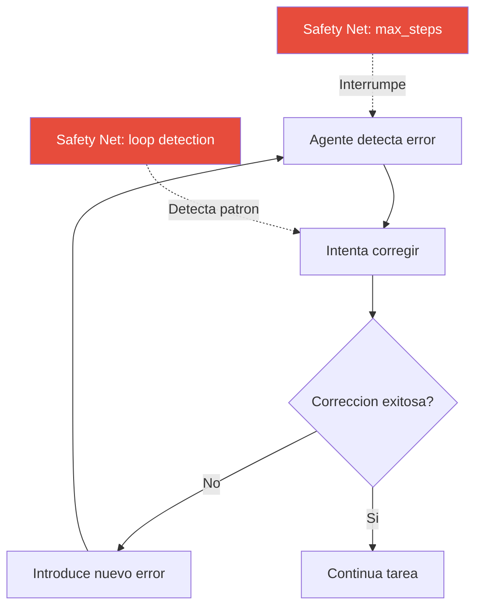
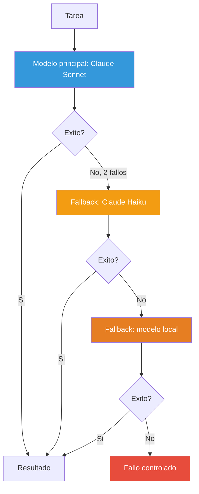
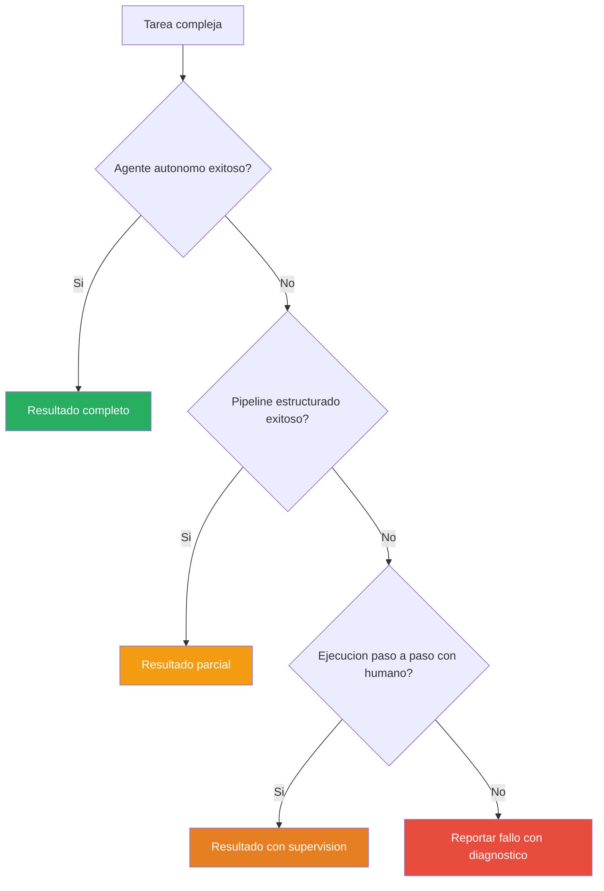
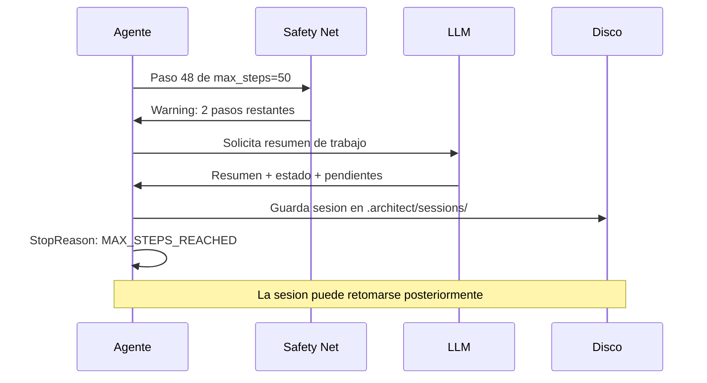
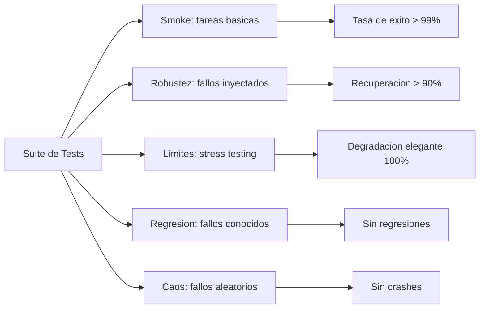
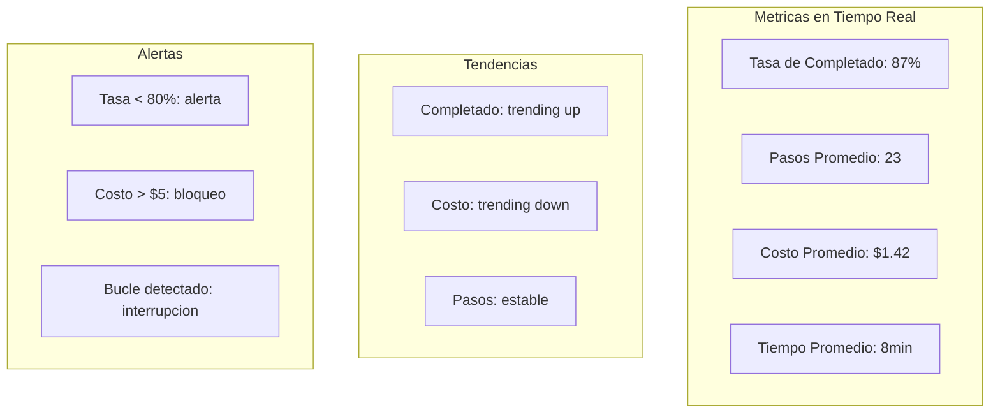

# Fiabilidad de Agentes IA

> [!abstract] Resumen
> La ==fiabilidad== (*reliability*) es el factor determinante entre un agente que funciona en demos y uno que funciona en produccion. Los agentes de IA fallan de formas que los sistemas de software tradicionales jamas contemplaron: ==alucinaciones==, ==bucles infinitos==, ==desbordamiento de contexto== y ==errores en cascada== son solo algunos de los modos de fallo. Este documento analiza por que fallan los agentes, como clasificar sus fallos, y las estrategias concretas --incluyendo las implementadas en [[architect-overview]]-- para construir agentes que degraden elegantemente en lugar de colapsar de forma catastrofica. ^resumen

---

## Por que fallan los agentes

Los agentes de IA operan en un espacio de estados enormemente mas amplio que el software determinista. Cada llamada al LLM introduce incertidumbre, y cuando esa incertidumbre se acumula a traves de multiples pasos, la probabilidad de fallo crece exponencialmente.

> [!info] La regla del interes compuesto del error
> Si cada paso individual tiene un 95% de probabilidad de exito, una cadena de 20 pasos tiene solo un $(0.95)^{20} \approx 36\%$ de probabilidad de completarse correctamente. Este es el desafio fundamental de la fiabilidad en [[agent-patterns|agentes multi-paso]].

### Alucinaciones en contexto agentivo

Las *hallucinations* en agentes son cualitativamente diferentes a las alucinaciones en chatbots. Mientras un chatbot puede inventar un hecho, un agente puede inventar un archivo que no existe, llamar a una API con parametros fabricados, o asumir que un paso previo tuvo exito cuando en realidad fallo.

| Tipo de alucinacion | Ejemplo concreto | Impacto |
|---------------------|-----------------|---------|
| Alucinacion de estado | El agente cree que creo un archivo pero no lo hizo | Pasos posteriores fallan en cadena |
| Alucinacion de herramienta | Inventa parametros para una API | Error de ejecucion o accion incorrecta |
| Alucinacion de resultado | Afirma que los tests pasaron sin ejecutarlos | Codigo defectuoso llega a produccion |
| Alucinacion de contexto | Mezcla informacion de tareas anteriores | Modifica archivos equivocados |
| Alucinacion de capacidad | Intenta acciones fuera de su alcance | Bucle de reintentos fallidos |

> [!warning] Alucinaciones silenciosas
> El tipo de alucinacion mas peligroso es la ==silenciosa==: el agente reporta exito pero la tarea no se completo correctamente. Este es el escenario contra el que [[architect-overview]] protege con su sistema de *self-evaluator* que verifica el trabajo despues de completarlo.

### Llamadas incorrectas a herramientas

El *tool calling* incorrecto ocurre cuando el agente selecciona la herramienta equivocada o la invoca con parametros erroneos. Esto se manifiesta de varias formas:

- **Herramienta equivocada**: usar `write_file` cuando deberia usar `edit_file`, sobreescribiendo contenido existente
- **Parametros malformados**: enviar JSON invalido o tipos de datos incorrectos
- **Secuencia erronea**: intentar editar un archivo antes de leerlo para entender su estructura
- **Herramienta inexistente**: el modelo inventa una herramienta que no existe en el toolkit disponible

> [!example]- Caso real: herramienta equivocada
> ```
> # El agente quiere agregar una linea a un archivo de configuracion
> # INCORRECTO: sobreescribe todo el archivo
> write_file("config.yaml", "new_setting: true")
>
> # CORRECTO: edita solo la seccion relevante
> edit_file("config.yaml",
>   old_content="settings:",
>   new_content="settings:\n  new_setting: true")
> ```
> En [[architect-overview]], el sistema de *guardrails* valida cada llamada a herramienta antes de ejecutarla, verificando que los parametros sean coherentes y que la operacion sea segura.

### Bucles infinitos

Los *infinite loops* en agentes ocurren cuando el agente queda atrapado en un ciclo repetitivo sin progreso. Los patrones mas comunes son:

1. **Bucle de correccion**: el agente introduce un error, intenta corregirlo, introduce otro error al corregir, y asi sucesivamente
2. **Bucle de informacion**: el agente busca informacion, no la encuentra, reformula la busqueda de forma trivialmente diferente, repite
3. **Bucle de confirmacion**: el agente solicita confirmacion al usuario pero no puede interpretar la respuesta
4. **Bucle de herramienta**: la herramienta falla consistentemente pero el agente sigue reintentando con los mismos parametros



### Desbordamiento de contexto

El *context overflow* ocurre cuando la ventana de contexto del modelo se llena, causando que el agente pierda informacion critica sobre la tarea, el estado actual, o instrucciones previas. Esto se documenta en detalle en [[agent-memory-patterns]].

> [!danger] Perdida silenciosa de instrucciones
> Cuando el contexto se llena, los modelos no lanzan un error explicito: simplemente ==empiezan a olvidar==. Las primeras instrucciones (frecuentemente las mas importantes, como restricciones de seguridad) son las primeras en desaparecer. Esta es una de las razones por las que [[architect-overview]] implementa un sistema de poda de contexto de 3 niveles en lugar de confiar en el truncamiento nativo del modelo.

### Errores en cascada

Los *cascading errors* son la consecuencia natural de que los agentes toman decisiones basadas en resultados anteriores. Un error temprano contamina todo el razonamiento posterior:


> [!failure] El anti-patron mas peligroso
> El peor error en cascada es cuando el agente, al encontrar que sus tests fallan, ==modifica los tests en lugar del codigo==. Esto produce un sistema que aparenta funcionar pero tiene defectos fundamentales. [[vigil-overview]] puede detectar este patron al analizar la calidad de los tests generados.

---

## Taxonomia de modos de fallo

Una clasificacion sistematica de los fallos permite disenar mecanismos de defensa especificos para cada categoria.

| Categoria | Modo de fallo | Detectabilidad | Severidad | Mitigacion |
|-----------|--------------|----------------|-----------|------------|
| **Razonamiento** | Alucinacion factual | Media | Alta | Verificacion con [[vigil-overview]] |
| **Razonamiento** | Plan incoherente | Baja | Critica | Auto-review en [[architect-overview]] |
| **Ejecucion** | Herramienta equivocada | Alta | Media | Validacion de parametros |
| **Ejecucion** | Error de sintaxis en codigo | Alta | Baja | Linting automatico |
| **Estado** | Bucle infinito | Alta | Media | max_steps, deteccion de patrones |
| **Estado** | Contexto desbordado | Media | Alta | Poda de 3 niveles |
| **Estado** | Estado inconsistente | Baja | Critica | Checkpoints y rollback |
| **Seguridad** | Accion destructiva | Variable | Critica | 22 capas de [[agent-safety]] |
| **Recursos** | Costo excesivo | Alta | Media | Budget limits |
| **Recursos** | Timeout | Alta | Baja | Temporizadores por paso |

> [!tip] Principio de defensa en profundidad
> Ningun mecanismo unico puede cubrir todos los modos de fallo. La estrategia correcta es ==defensa en profundidad== (*defense in depth*): multiples capas de proteccion independientes, cada una cubriendo un subconjunto de fallos. Esto es exactamente lo que implementa [[architect-overview]] con sus 22 capas de seguridad.

---

## Estrategias de reintento

### Reintento simple

El *simple retry* es la estrategia mas basica: si una operacion falla, intentarla de nuevo. Es efectiva para fallos transitorios como errores de red o rate limiting de APIs.

```python
# Reintento simple con limite
MAX_RETRIES = 3

for attempt in range(MAX_RETRIES):
    try:
        result = call_llm(prompt)
        if validate_result(result):
            break
    except TransientError:
        continue
else:
    raise MaxRetriesExceeded("Fallo tras {MAX_RETRIES} intentos")
```

> [!warning] Cuando NO usar reintento simple
> El reintento simple es ==contraproducente== cuando el fallo es determinista (el mismo input producira el mismo error) o cuando cada intento tiene un costo significativo (llamadas a modelos grandes). En esos casos, se necesitan estrategias mas sofisticadas.

### Retroceso exponencial

El *exponential backoff* incrementa el tiempo de espera entre reintentos, reduciendo la presion sobre servicios sobrecargados:

```python
import time
import random

def exponential_backoff(attempt, base_delay=1.0, max_delay=60.0):
    """Calcula delay con jitter para evitar thundering herd."""
    delay = min(base_delay * (2 ** attempt), max_delay)
    jitter = random.uniform(0, delay * 0.1)
    return delay + jitter

for attempt in range(MAX_RETRIES):
    try:
        result = call_llm(prompt)
        break
    except RateLimitError:
        delay = exponential_backoff(attempt)
        time.sleep(delay)
```

### Reintento con modelo diferente

Esta estrategia, que [[architect-overview]] implementa nativamente, consiste en cambiar a un modelo alternativo cuando el modelo principal falla consistentemente:



> [!tip] Seleccion inteligente de fallback
> No todos los modelos fallan de la misma forma. Un modelo grande puede fallar por timeout en tareas complejas, mientras que un modelo pequeno puede completar una version simplificada de la tarea. El fallback ideal no es simplemente "intentar con otro modelo" sino ==reformular la tarea para el modelo de respaldo==.

---

## Degradacion elegante

La *graceful degradation* es la capacidad de un sistema de continuar proporcionando funcionalidad reducida cuando parte del sistema falla, en lugar de colapsar completamente.

### Patron de fallback a enfoque mas simple



### Niveles de degradacion

1. **Nivel 0 - Plena autonomia**: el agente completa la tarea sin intervencion
2. **Nivel 1 - Autonomia reducida**: el agente pide confirmacion en pasos criticos
3. **Nivel 2 - Modo asistido**: el agente sugiere acciones pero el humano decide
4. **Nivel 3 - Modo informativo**: el agente solo recopila informacion y la presenta
5. **Nivel 4 - Fallo reportado**: el agente no puede actuar pero explica por que

> [!success] Fallo informativo vs fallo silencioso
> Un agente fiable ==siempre prefiere fallar de forma informativa== antes que continuar con incertidumbre. Es mejor decir "no puedo completar esta tarea porque X" que producir un resultado potencialmente incorrecto sin advertencia.

---

## Como architect gestiona la fiabilidad

[[architect-overview]] implementa un conjunto completo de redes de seguridad (*safety nets*) disenadas para prevenir los modos de fallo mas comunes.

### Redes de seguridad

> [!example]- Configuracion de safety nets en architect
> ```yaml
> # Configuracion de redes de seguridad
> safety:
>   max_steps: 50           # Previene bucles infinitos
>   timeout: 1800           # 30 minutos maximo por tarea
>   budget: 5.00            # Maximo $5 USD por tarea
>   context_fullness: 0.75  # Umbral para iniciar poda
>
>   # Acciones al alcanzar limites
>   on_max_steps: graceful_close
>   on_timeout: graceful_close
>   on_budget: graceful_close
>   on_context_full: prune_and_continue
> ```

| Safety Net | Que previene | Accion al activarse |
|-----------|-------------|-------------------|
| `max_steps` | Bucles infinitos | Cierre elegante con resumen |
| `timeout` | Tareas que nunca terminan | Cierre elegante con estado |
| `budget` | Costos descontrolados | Cierre con reporte de gasto |
| `context_fullness` | Desbordamiento de contexto | Poda de 3 niveles |

### Cierre elegante vs corte abrupto

> [!tip] La diferencia critica
> Cuando un agente convencional alcanza un limite, simplemente se detiene a mitad de operacion. [[architect-overview]] implementa un ==cierre elegante== (*graceful close*): en lugar de un corte abrupto, pide al LLM que genere un resumen del trabajo realizado, el estado actual, y los pasos pendientes. Esto permite retomar la tarea posteriormente.



### StopReasons

El sistema de *StopReasons* proporciona informacion precisa sobre por que se detuvo el agente:

| StopReason | Significado | Reanudable |
|-----------|------------|-----------|
| `TASK_COMPLETE` | Tarea completada exitosamente | No necesario |
| `MAX_STEPS_REACHED` | Se alcanzo el limite de pasos | Si |
| `TIMEOUT` | Se agoto el tiempo | Si |
| `BUDGET_EXCEEDED` | Se supero el presupuesto | Si |
| `USER_CANCELLED` | El usuario cancelo | Si |
| `ERROR_UNRECOVERABLE` | Error fatal no recuperable | Depende |
| `CONTEXT_EXHAUSTED` | Contexto lleno tras poda maxima | Si, con resumen |

### Auto-guardado de sesiones

[[architect-overview]] persiste automaticamente el estado de cada sesion en archivos JSON, permitiendo reanudar tareas interrumpidas:

> [!example]- Estructura de sesion guardada
> ```json
> {
>   "session_id": "abc123-def456",
>   "task": "Refactorizar modulo de autenticacion",
>   "status": "interrupted",
>   "stop_reason": "MAX_STEPS_REACHED",
>   "steps_completed": 50,
>   "steps_total_estimated": 65,
>   "summary": "Completado: extraccion de interfaz, tests unitarios. Pendiente: migracion de implementaciones concretas.",
>   "files_modified": ["auth.py", "tests/test_auth.py"],
>   "checkpoint_commit": "architect:checkpoint:abc123",
>   "context_summary": "...",
>   "created_at": "2025-06-01T10:30:00Z",
>   "cost_usd": 4.82
> }
> ```

La reanudacion carga el resumen de contexto como punto de partida, permitiendo al agente continuar desde donde se detuvo sin repetir trabajo. Este patron se conecta directamente con los [[agentic-workflows|workflows]] que permiten definir checkpoints explicitos.

---

## Testing para fiabilidad

Probar la fiabilidad de un agente requiere enfoques diferentes al testing de software tradicional, como se detalla en [[agent-evaluation]].

### Tipos de tests de fiabilidad

> [!question] Como se testea algo no determinista?
> El testing de agentes requiere un enfoque ==estadistico==: no se prueba que una ejecucion individual sea correcta, sino que el agente tiene una ==tasa de exito aceptable== sobre multiples ejecuciones de la misma tarea. Esto implica correr cada test multiples veces y medir la distribucion de resultados.

1. **Tests de humo** (*smoke tests*): verificar que el agente puede completar tareas triviales
2. **Tests de robustez**: introducir fallos deliberados y verificar recuperacion
3. **Tests de limites**: llevar al agente a sus limites (contexto lleno, muchos pasos) y verificar degradacion elegante
4. **Tests de regresion**: verificar que fallos previamente corregidos no reaparecen
5. **Tests de caos** (*chaos testing*): inyectar fallos aleatorios en herramientas y observar el comportamiento



### Inyeccion de fallos

> [!example]- Framework de inyeccion de fallos
> ```python
> class FaultInjector:
>     """Inyecta fallos controlados para probar fiabilidad."""
>
>     def __init__(self, failure_rate=0.1):
>         self.failure_rate = failure_rate
>         self.faults_injected = 0
>
>     def maybe_fail_tool(self, tool_name, params):
>         """Falla aleatoriamente una llamada a herramienta."""
>         if random.random() < self.failure_rate:
>             self.faults_injected += 1
>             raise ToolError(f"Fallo inyectado en {tool_name}")
>         return original_call(tool_name, params)
>
>     def corrupt_output(self, output):
>         """Corrompe parcialmente la salida de una herramienta."""
>         if random.random() < self.failure_rate:
>             return output[:len(output)//2] + "[TRUNCATED]"
>         return output
>
>     def delay_response(self, base_time):
>         """Simula latencia variable."""
>         delay = base_time * random.uniform(1, 10)
>         time.sleep(delay)
> ```

---

## Metricas de fiabilidad

### Metricas principales

| Metrica | Definicion | Objetivo tipico | Como medir |
|---------|-----------|----------------|-----------|
| **Tasa de completado** (*Task Completion Rate*) | % de tareas completadas exitosamente | > 85% | Evaluacion automatica + humana |
| **Pasos hasta completado** (*Steps to Completion*) | Numero de pasos para completar una tarea | < 2x optimo | Logs del agente |
| **Eficiencia de costo** (*Cost Efficiency*) | Costo por tarea completada exitosamente | Tendencia descendente | Registro de tokens |
| **Tiempo hasta completado** (*Time to Completion*) | Tiempo wall-clock para la tarea | < umbral por tipo | Timestamps |
| **Tasa de recuperacion** (*Recovery Rate*) | % de fallos de los que se recupera | > 70% | Tests de robustez |
| **Falsos positivos de exito** | % de tareas reportadas como exitosas pero incorrectas | < 5% | Evaluacion humana |

> [!info] La metrica mas importante
> La metrica con mayor correlacion con la satisfaccion del usuario no es la tasa de completado bruta, sino la ==tasa de completado ajustada por confianza==: que porcentaje de las veces que el agente dice "tarea completada" es realmente asi. Un agente que completa el 70% de las tareas pero siempre sabe cuando fallo es mas util que uno que completa el 90% pero reporta exito el 100% del tiempo.

### Scoring compuesto en architect

[[architect-overview]] utiliza un sistema de puntuacion compuesta para evaluar la fiabilidad de cada ejecucion, como se detalla en [[agent-evaluation]]:

```
Puntuacion total = checks (40pts) + status (30pts) + efficiency (20pts) + cost (10pts)
```

> [!example]- Desglose del scoring compuesto
> ```
> CHECKS (40 puntos):
>   - Todos los tests pasan: 40/40
>   - Tests pasan con warnings: 30/40
>   - Algunos tests fallan: 15/40
>   - Todos los tests fallan: 0/40
>
> STATUS (30 puntos):
>   - TASK_COMPLETE: 30/30
>   - MAX_STEPS con progreso significativo: 20/30
>   - TIMEOUT con progreso: 15/30
>   - ERROR sin progreso: 0/30
>
> EFFICIENCY (20 puntos):
>   - Pasos <= optimo * 1.2: 20/20
>   - Pasos <= optimo * 1.5: 15/20
>   - Pasos <= optimo * 2.0: 10/20
>   - Pasos > optimo * 2.0: 5/20
>
> COST (10 puntos):
>   - Costo <= presupuesto * 0.5: 10/10
>   - Costo <= presupuesto * 0.8: 8/10
>   - Costo <= presupuesto: 5/10
>   - Costo > presupuesto: 0/10
> ```

### Dashboard de fiabilidad



---

## Patrones de fiabilidad avanzados

### Patron de verificacion cruzada

Usar un segundo agente o modelo para verificar el trabajo del primero. [[architect-overview]] implementa esto con su *self-evaluator*:

> [!tip] Verificacion no es duplicacion
> La verificacion cruzada no significa ejecutar la tarea dos veces. Significa que un ==verificador especializado== revisa el resultado del ejecutor. El verificador puede ser un modelo mas pequeno y barato, ya que ==verificar es mas facil que generar==[^1].

### Patron de checkpoint y rollback

Crear puntos de restauracion periodicos para poder revertir en caso de fallo. [[agentic-workflows]] documenta como architect crea commits con prefijo `architect:checkpoint:` para este proposito.

### Patron de presupuesto adaptativo

En lugar de un presupuesto fijo, ajustar el presupuesto basandose en la complejidad estimada de la tarea y el progreso observado:

```python
def adaptive_budget(task_complexity, progress_rate, remaining_steps):
    """Ajusta el presupuesto basado en progreso observado."""
    if progress_rate > 0.8:  # Buen progreso
        return base_budget * 1.2  # Permitir mas recursos
    elif progress_rate < 0.3:  # Poco progreso
        return base_budget * 0.5  # Reducir y degradar
    return base_budget
```

---

## Relacion con el ecosistema

La fiabilidad no existe en aislamiento sino que se entrelaza con todos los componentes del ecosistema de agentes:

- [[intake-overview]]: la calidad del intake inicial determina la fiabilidad de la ejecucion posterior. Un intake deficiente produce tareas ambiguas que aumentan la tasa de fallo del agente
- [[architect-overview]]: implementa las redes de seguridad, el cierre elegante, los StopReasons y el auto-guardado de sesiones que son la columna vertebral de la fiabilidad en ejecucion
- [[vigil-overview]]: complementa la fiabilidad verificando que el codigo generado por el agente sea correcto y seguro, actuando como una capa de validacion posterior que detecta fallos que el propio agente no reconoce
- [[licit-overview]]: conecta los fallos de fiabilidad con su impacto regulatorio y de cumplimiento. Un agente no fiable que actua de forma incorrecta puede violar normativas, lo que agrega una dimension legal a la fiabilidad tecnica

> [!quote] Integracion end-to-end
> La fiabilidad real solo se logra cuando ==cada componente del ecosistema contribuye una capa de proteccion==. Intake reduce la ambiguedad, architect controla la ejecucion, vigil valida los resultados, y licit audita el cumplimiento. --Principio de fiabilidad del ecosistema

---

## Enlaces y referencias

> [!quote]- Bibliografia
> - [^1]: Cobbe, K. et al. "Training Verifiers to Solve Math Word Problems." *arXiv:2110.14168*, 2021. Demuestra que verificar es significativamente mas facil que generar, fundamentando el patron de verificacion cruzada.
> - Madaan, A. et al. "Self-Refine: Iterative Refinement with Self-Feedback." *NeurIPS 2023*. Framework para auto-correccion de agentes.
> - Shinn, N. et al. "Reflexion: Language Agents with Verbal Reinforcement Learning." *NeurIPS 2023*. Agentes que aprenden de sus fallos.
> - Yang, J. et al. "SWE-agent: Agent-Computer Interfaces Enable Automated Software Engineering." *arXiv:2405.15793*, 2024. Analisis de tasas de exito en tareas de ingenieria de software.
> - Wang, L. et al. "A Survey on Large Language Model based Autonomous Agents." *arXiv:2308.11432*, 2023. Taxonomia de modos de fallo de agentes.
> - Ruan, Y. et al. "Identifying the Risks of LM Agents with an LM-Emulated Sandbox." *arXiv:2309.15817*, 2023. Framework para testing de fiabilidad.

---

[^1]: Cobbe et al. demostraron que un verificador entrenado puede identificar soluciones correctas con mucha mayor precision que un generador. Este principio se aplica directamente al *self-evaluator* de [[architect-overview]], que usa el LLM como verificador del trabajo realizado por el mismo agente.
