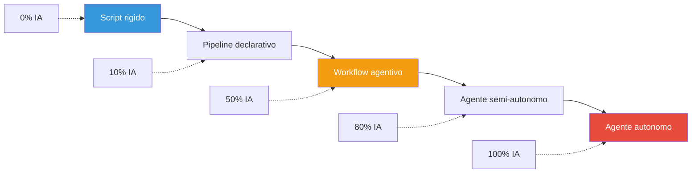
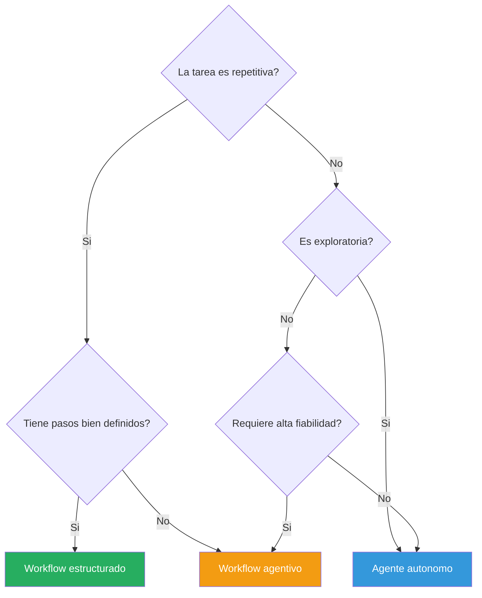
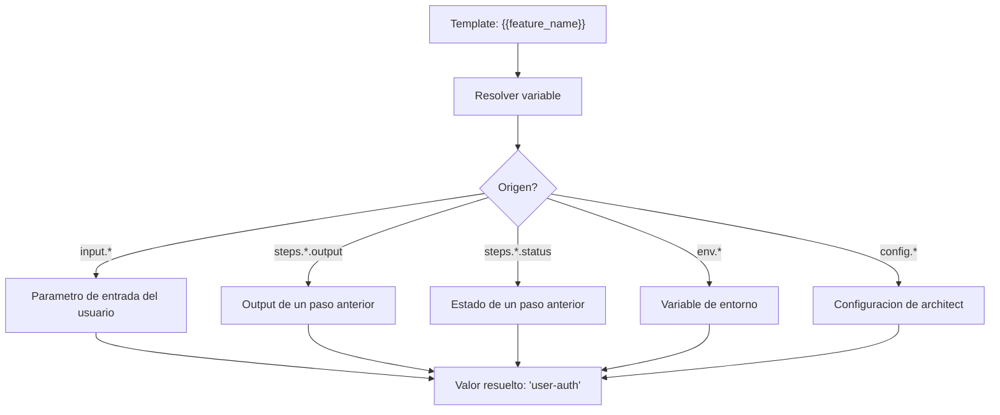
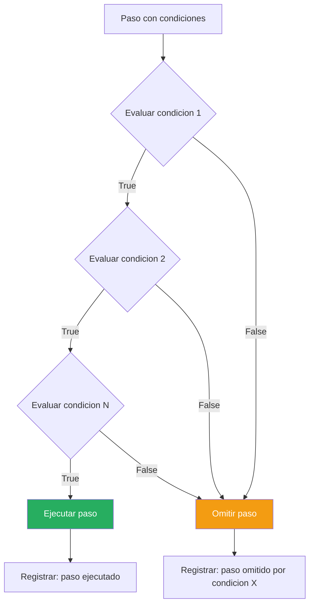
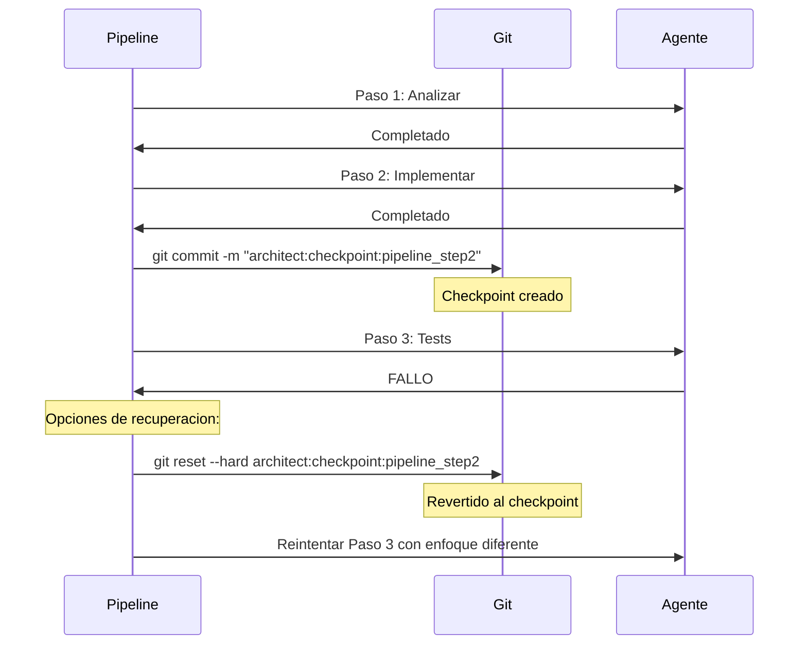
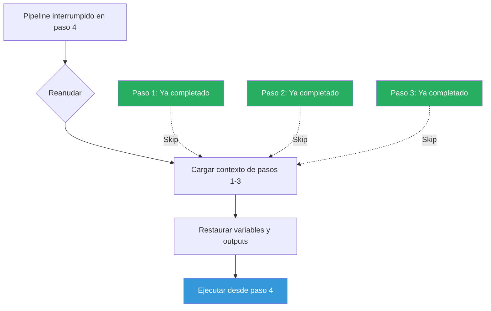
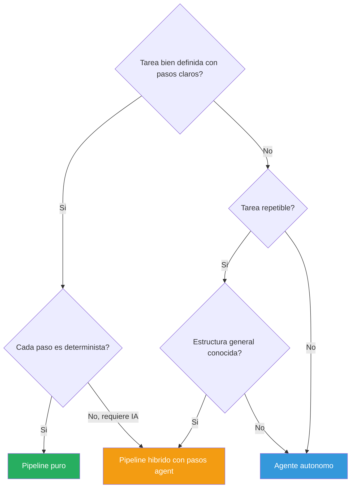
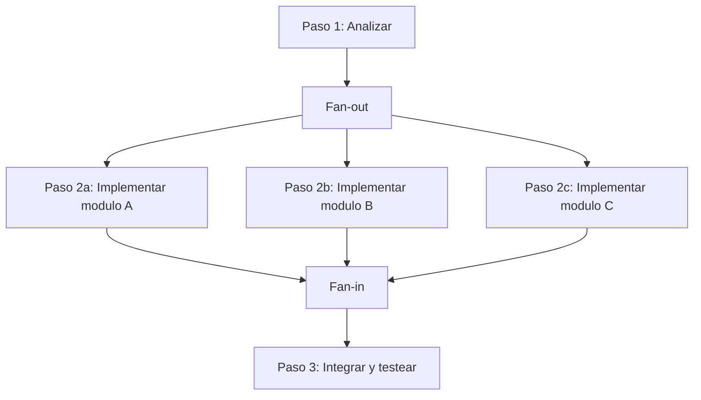

# Workflows Agentivos

> [!abstract] Resumen
> Existe un espectro entre la automatizacion rigida (scripts, CI/CD) y la autonomia total de un agente libre. Los ==workflows agentivos== (*agentic workflows*) ocupan el punto medio: secuencias de pasos ==declarativamente definidas== donde cada paso puede involucrar razonamiento autonomo del LLM, pero la estructura general esta controlada por el desarrollador. Este documento explora la diferencia entre workflows y agentes libres, la definicion declarativa de pipelines en YAML, como [[architect-overview]] implementa pipelines con ==sustitucion de variables==, ==condiciones==, ==checkpoints git==, ==dry-run== y ==reanudacion desde paso especifico==, y cuando usar cada enfoque. ^resumen

---

## El espectro de autonomia

### Workflows vs agentes: no es binario

La decision entre workflow estructurado y agente autonomo no es una eleccion binaria sino un espectro continuo:



| Dimension | Workflow estructurado | Agente autonomo |
|-----------|---------------------|-----------------|
| **Previsibilidad** | Alta: pasos definidos de antemano | Baja: el agente decide que hacer |
| **Flexibilidad** | Baja: no puede adaptarse a lo inesperado | Alta: se adapta a situaciones nuevas |
| **Depurabilidad** | Alta: se sabe exactamente donde fallo | Baja: cadena de razonamiento opaca |
| **Costo** | Predecible: se conoce el numero de pasos | Variable: depende de la tarea |
| **Seguridad** | Alta: acciones acotadas por paso | Requiere guardrails robustos |
| **Casos de uso** | Tareas repetitivas y bien definidas | Tareas novedosas y ambiguas |

> [!tip] El punto optimo
> Para la mayoria de las aplicaciones en produccion, el ==punto optimo es el workflow agentivo==: suficiente estructura para ser predecible y depurable, con suficiente autonomia en cada paso para manejar variabilidad. Este es exactamente el enfoque que implementa [[architect-overview]] con su sistema de pipelines.

### Cuando usar workflows vs agentes libres



> [!question] Puedo combinar ambos enfoques?
> Absolutamente. El patron mas poderoso es un ==workflow hibrido== donde la estructura general es un pipeline definido, pero ciertos pasos son ejecutados por un agente autonomo. Por ejemplo: un pipeline que tiene pasos de "analizar requisitos" (agente autonomo), "implementar cambios" (agente autonomo) y "ejecutar tests" (paso deterministico). [[architect-overview]] soporta esta composicion nativamente.

---

## Definicion declarativa de pipelines

### Por que YAML

La definicion declarativa de pipelines en YAML proporciona varias ventajas sobre la definicion programatica:

1. **Legibilidad**: cualquier miembro del equipo puede entender el pipeline sin conocer el lenguaje de programacion
2. **Versionabilidad**: los pipelines se gestionan con git como cualquier otro archivo de configuracion
3. **Validacion**: el esquema YAML puede validarse estaticamente antes de la ejecucion
4. **Portabilidad**: el mismo pipeline puede ejecutarse en diferentes entornos
5. **Auditabilidad**: conecta directamente con [[licit-overview]] para trazabilidad

### Anatomia de un pipeline YAML

> [!example]- Pipeline YAML completo de architect
> ```yaml
> # Pipeline: Implementar feature con tests y documentacion
> name: "implement-feature"
> description: "Pipeline completo para implementar una feature nueva"
> version: "1.0"
>
> # Variables que se resuelven al inicio
> variables:
>   feature_name: "{{input.feature_name}}"
>   target_module: "{{input.target_module}}"
>   test_framework: "pytest"
>   branch_name: "feat/{{feature_name}}"
>
> # Condiciones globales
> preconditions:
>   - command: "git status --porcelain"
>     expect_empty: true
>     message: "El workspace debe estar limpio antes de iniciar"
>   - command: "test -d src/{{target_module}}"
>     message: "El modulo objetivo debe existir"
>
> steps:
>   - id: "create-branch"
>     name: "Crear rama de feature"
>     type: "command"
>     command: "git checkout -b {{branch_name}}"
>     on_failure: "abort"
>
>   - id: "analyze"
>     name: "Analizar requisitos y codebase"
>     type: "agent"
>     prompt: |
>       Analiza el modulo {{target_module}} y determina:
>       1. La estructura actual del codigo
>       2. Los patrones y convenciones usados
>       3. Como se deberia implementar la feature "{{feature_name}}"
>       4. Que archivos necesitan modificarse
>       Guarda tu analisis en la variable $analysis
>     output_var: "analysis"
>     max_steps: 15
>     budget: 1.00
>
>   - id: "implement"
>     name: "Implementar la feature"
>     type: "agent"
>     prompt: |
>       Basandote en el siguiente analisis:
>       {{analysis}}
>
>       Implementa la feature "{{feature_name}}" en el modulo
>       {{target_module}}, siguiendo las convenciones existentes.
>     max_steps: 30
>     budget: 2.00
>     checkpoint: true  # Crear git checkpoint al completar
>
>   - id: "test"
>     name: "Escribir y ejecutar tests"
>     type: "agent"
>     prompt: |
>       Escribe tests exhaustivos para la feature "{{feature_name}}"
>       usando {{test_framework}}. Ejecuta los tests y asegurate
>       de que todos pasen.
>     max_steps: 20
>     budget: 1.50
>     checkpoint: true
>     conditions:
>       - "{{steps.implement.status}} == 'complete'"
>
>   - id: "lint"
>     name: "Verificar calidad de codigo"
>     type: "command"
>     command: "ruff check src/{{target_module}}/ --fix"
>     on_failure: "continue"
>
>   - id: "security-scan"
>     name: "Escaneo de seguridad"
>     type: "command"
>     command: "vigil scan src/{{target_module}}/ --format sarif"
>     output_var: "security_results"
>     on_failure: "warn"
>
>   - id: "review"
>     name: "Auto-review del trabajo"
>     type: "agent"
>     prompt: |
>       Revisa todos los cambios realizados:
>       - Codigo implementado
>       - Tests escritos
>       - Resultados de lint
>       - Resultados de seguridad: {{security_results}}
>
>       Proporciona una evaluacion de calidad y lista cualquier
>       problema que deba corregirse antes del merge.
>     max_steps: 10
>     budget: 0.50
>
>   - id: "commit"
>     name: "Commit final"
>     type: "command"
>     command: |
>       git add -A
>       git commit -m "feat({{target_module}}): implement {{feature_name}}"
>     conditions:
>       - "{{steps.test.status}} == 'complete'"
>       - "{{steps.review.status}} == 'complete'"
>
> # Manejo de fallos global
> on_failure:
>   strategy: "checkpoint-rollback"
>   notify: true
> ```

---

## Implementacion de pipelines en architect

### Sustitucion de variables

[[architect-overview]] implementa un sistema de *template variables* con sintaxis `{{variable}}` que se resuelven en tiempo de ejecucion:



| Tipo de variable | Sintaxis | Ejemplo | Se resuelve en |
|-----------------|---------|---------|---------------|
| Input del usuario | `{{input.nombre}}` | `{{input.feature_name}}` | Inicio del pipeline |
| Output de paso | `{{steps.id.output}}` | `{{steps.analyze.output}}` | Despues del paso referenciado |
| Status de paso | `{{steps.id.status}}` | `{{steps.test.status}}` | Despues del paso referenciado |
| Variable definida | `{{nombre}}` | `{{branch_name}}` | Segun definicion |
| Entorno | `{{env.nombre}}` | `{{env.NODE_ENV}}` | Inicio del pipeline |

> [!warning] Variables no resueltas
> Si una variable no puede resolverse (por ejemplo, referencia a un paso que no se ha ejecutado aun o a un input que no se proporciono), [[architect-overview]] genera un ==error explicito== en lugar de sustituir silenciosamente con un string vacio. Esto previene ejecuciones con datos incompletos, un patron de [[agent-reliability|fiabilidad]] critico.

### Condiciones

Los pasos pueden tener condiciones que determinan si se ejecutan o se omiten:

> [!example]- Tipos de condiciones soportadas
> ```yaml
> steps:
>   - id: "deploy"
>     name: "Desplegar a staging"
>     type: "command"
>     command: "deploy.sh --env staging"
>     conditions:
>       # Condicion basada en status de paso anterior
>       - "{{steps.test.status}} == 'complete'"
>
>       # Condicion basada en output de paso anterior
>       - "{{steps.security_scan.output}} contains 'NO_ISSUES'"
>
>       # Condicion basada en variable de entorno
>       - "{{env.CI}} == 'true'"
>
>       # Condicion basada en resultado de comando
>       - command: "git log --oneline -1 | grep -q 'feat:'"
>         message: "Solo deploya commits de tipo feat"
> ```



### Captura de output

Cada paso puede capturar su output en una variable para uso posterior:

```python
class StepExecutor:
    """Ejecuta un paso del pipeline y captura su output."""

    def execute_step(self, step, context):
        """Ejecuta un paso y almacena resultado en contexto."""

        if step.type == "command":
            result = self.run_command(step.command)
        elif step.type == "agent":
            result = self.run_agent(step.prompt, step.max_steps)

        # Capturar output si se definio output_var
        if step.output_var:
            context.variables[step.output_var] = result.output

        # Registrar status del paso
        context.steps[step.id] = {
            "status": result.status,
            "output": result.output,
            "cost": result.cost,
            "duration": result.duration
        }

        return result
```

### Checkpoints

Los *checkpoints* son puntos de restauracion que architect crea automaticamente mediante commits de git con un prefijo especial:

> [!info] Checkpoints como red de seguridad
> Los checkpoints permiten ==revertir a un estado conocido bueno== si un paso posterior falla. Esto es especialmente valioso en pipelines largos donde un fallo en el paso 8 no deberia requerir re-ejecutar los pasos 1-7. Conecta directamente con las estrategias de [[agent-reliability|fiabilidad]].



#### Formato del mensaje de checkpoint

```
architect:checkpoint:<pipeline_name>_step<N>_<timestamp>

Ejemplo:
architect:checkpoint:implement-feature_step2_2025-06-01T10:30:00
```

> [!tip] Checkpoints selectivos
> No todos los pasos necesitan checkpoint. Los checkpoints solo son valiosos para pasos que ==modifican el filesystem== de forma significativa. Un paso que solo lee informacion o ejecuta analisis no necesita checkpoint. En el YAML del pipeline, se activa con `checkpoint: true` en los pasos relevantes.

### Dry-run

El modo *dry-run* permite previsualizar la ejecucion del pipeline sin ejecutar realmente ningun paso:

> [!example]- Salida de dry-run
> ```
> $ architect pipeline run implement-feature.yaml --dry-run \
>     --input feature_name=user-auth \
>     --input target_module=core
>
> ╔════════════════════════════════════════════════╗
> ║         PIPELINE DRY-RUN: implement-feature    ║
> ╠════════════════════════════════════════════════╣
> ║                                                ║
> ║  Variables resueltas:                           ║
> ║    feature_name: "user-auth"                    ║
> ║    target_module: "core"                        ║
> ║    branch_name: "feat/user-auth"                ║
> ║    test_framework: "pytest"                     ║
> ║                                                ║
> ║  Precondiciones:                                ║
> ║    [CHECK] git status --porcelain -> limpio     ║
> ║    [CHECK] test -d src/core -> existe           ║
> ║                                                ║
> ║  Pasos:                                        ║
> ║    1. [CMD] create-branch                       ║
> ║       git checkout -b feat/user-auth            ║
> ║                                                ║
> ║    2. [AGENT] analyze                           ║
> ║       max_steps: 15, budget: $1.00              ║
> ║       output -> $analysis                       ║
> ║                                                ║
> ║    3. [AGENT] implement                         ║
> ║       max_steps: 30, budget: $2.00              ║
> ║       checkpoint: YES                           ║
> ║                                                ║
> ║    4. [AGENT] test                              ║
> ║       max_steps: 20, budget: $1.50              ║
> ║       checkpoint: YES                           ║
> ║       condition: implement.status == complete    ║
> ║                                                ║
> ║    5. [CMD] lint                                ║
> ║       ruff check src/core/ --fix                ║
> ║                                                ║
> ║    6. [CMD] security-scan                       ║
> ║       vigil scan src/core/ --format sarif        ║
> ║       output -> $security_results               ║
> ║                                                ║
> ║    7. [AGENT] review                            ║
> ║       max_steps: 10, budget: $0.50              ║
> ║                                                ║
> ║    8. [CMD] commit                              ║
> ║       conditions: test + review complete         ║
> ║                                                ║
> ║  Presupuesto total estimado: $5.00              ║
> ║  Pasos totales estimados: 8 (75 max agent)      ║
> ╚════════════════════════════════════════════════╝
> ```

### Reanudacion desde paso especifico

Si un pipeline falla o se interrumpe, puede reanudarse desde un paso especifico con el parametro `--from-step`:

```bash
# El pipeline fallo en el paso "test"
# Los pasos anteriores ya se completaron exitosamente
# Reanudar desde el paso que fallo:
architect pipeline run implement-feature.yaml \
    --from-step test \
    --input feature_name=user-auth \
    --input target_module=core
```



> [!warning] Variables de pasos omitidos
> Al reanudar desde un paso intermedio, las variables de output de pasos anteriores deben estar disponibles. [[architect-overview]] persiste estas variables en el archivo de sesion (ver [[agent-memory-patterns]]), pero si el archivo de sesion se ha perdido o corrompido, sera necesario re-ejecutar los pasos que generan las variables dependientes.

---

## Comparacion de enfoques

### Pipelines vs bucle autonomo vs hibrido

| Aspecto | Pipeline puro | Agente autonomo | Hibrido |
|---------|--------------|-----------------|---------|
| **Definicion** | YAML con pasos fijos | Prompt con objetivo | YAML con pasos agentivos |
| **Previsibilidad** | Maxima | Minima | Alta |
| **Adaptabilidad** | Nula | Maxima | Media |
| **Depuracion** | Trivial: paso X fallo | Dificil: razonamiento opaco | Buena: paso X, agente interno |
| **Costo** | Fijo y predecible | Variable e impredecible | Acotado por paso |
| **Seguridad** | Solo ejecuta lo definido | Requiere 22 capas | Acotada + guardrails |
| **Reutilizacion** | Alta: mismos pipelines | Baja: cada tarea es unica | Media |
| **Complejidad de setup** | Baja | Media | Media-alta |

> [!success] El enfoque hibrido es optimo para produccion
> Para entornos de produccion, el enfoque hibrido ofrece el ==mejor balance==:
> - La estructura del pipeline proporciona previsibilidad y auditabilidad (requerido por [[licit-overview]])
> - Los pasos agentivos proporcionan la flexibilidad para manejar variabilidad dentro de cada paso
> - Los checkpoints y condiciones proporcionan resiliencia (ver [[agent-reliability]])
> - Los budgets por paso proporcionan control de costos
> - La integracion con vigil en pasos de escaneo proporciona seguridad

### Diagrama de decision



---

## Integracion con CI/CD

### Pipelines de architect en CI/CD

Los pipelines de [[architect-overview]] pueden integrarse en flujos de CI/CD existentes, ejecutandose como un paso mas del pipeline de integracion continua:

> [!example]- Ejemplo de integracion con GitHub Actions
> ```yaml
> # .github/workflows/architect-feature.yml
> name: "Architect Feature Pipeline"
>
> on:
>   issues:
>     types: [labeled]
>
> jobs:
>   implement-feature:
>     if: contains(github.event.label.name, 'architect-auto')
>     runs-on: ubuntu-latest
>
>     steps:
>       - uses: actions/checkout@v4
>
>       - name: Setup architect
>         run: |
>           pip install architect-agent
>           echo "${{ secrets.LLM_API_KEY }}" > .architect/api_key
>
>       - name: Extract feature from issue
>         id: parse
>         run: |
>           echo "feature_name=$(echo '${{ github.event.issue.title }}' | sed 's/ /-/g')" >> $GITHUB_OUTPUT
>           echo "description=${{ github.event.issue.body }}" >> $GITHUB_OUTPUT
>
>       - name: Run architect pipeline
>         run: |
>           architect pipeline run .architect/pipelines/implement-feature.yaml \
>             --input feature_name="${{ steps.parse.outputs.feature_name }}" \
>             --input description="${{ steps.parse.outputs.description }}" \
>             --input target_module="auto-detect" \
>             --budget 10.00 \
>             --timeout 3600
>
>       - name: Security scan with vigil
>         if: success()
>         run: vigil scan src/ --format sarif --output results.sarif
>
>       - name: Upload SARIF
>         if: success()
>         uses: github/codeql-action/upload-sarif@v3
>         with:
>           sarif_file: results.sarif
>
>       - name: Create PR
>         if: success()
>         run: |
>           gh pr create \
>             --title "feat: ${{ steps.parse.outputs.feature_name }}" \
>             --body "Implementado automaticamente por architect. Issue: #${{ github.event.issue.number }}" \
>             --label "architect-generated"
> ```

### Patron: pipeline como codigo revisable

> [!tip] Pipelines versionados junto al codigo
> Al almacenar los pipelines en `.architect/pipelines/` dentro del repositorio, se obtienen beneficios criticos:
> - **Revision por pares**: los cambios al pipeline se revisan en PRs como cualquier otro codigo
> - **Historial**: se puede ver como evoluciono el pipeline con `git log`
> - **Branching**: diferentes ramas pueden tener diferentes pipelines
> - **Auditoria**: [[licit-overview]] puede verificar que los pipelines cumplen con politicas organizacionales

### Comparacion con CI/CD tradicional

| Aspecto | CI/CD tradicional | Pipelines architect | Combinacion optima |
|---------|-------------------|--------------------|--------------------|
| Pasos | Deterministicos | Agentivos + deterministicos | CI/CD dispara pipeline architect |
| Adaptabilidad | Nula | Dentro de cada paso | Pasos externos fijos, internos adaptivos |
| Costo | Solo computo | Computo + tokens LLM | Presupuesto por pipeline |
| Seguridad | Permisos de CI | 22 capas architect + vigil | Defensa en profundidad completa |
| Depuracion | Logs lineales | Logs + razonamiento del agente | Trazabilidad completa |
| Trigger | Push, PR, schedule | Manual, CI, issue | Flujo end-to-end automatizado |

---

## Patrones avanzados de workflows

### Patron: pipeline con rollback automatico

```yaml
steps:
  - id: "implement"
    type: "agent"
    checkpoint: true
    # ...

  - id: "validate"
    type: "command"
    command: "pytest && ruff check src/"
    on_failure:
      action: "rollback"
      to_checkpoint: "implement"
      then: "retry_with_different_approach"
      max_retries: 2
```

> [!info] Rollback automatico
> El patron de rollback automatico combina checkpoints de git con reintentos inteligentes. Cuando un paso de validacion falla, el sistema revierte al checkpoint anterior y reintenta con un prompt modificado que incluye informacion sobre por que el intento anterior fallo. Esto conecta con los patrones de reintento documentados en [[agent-reliability]].

### Patron: pipeline con aprobacion humana

```yaml
steps:
  - id: "implement"
    type: "agent"
    # ...

  - id: "human-review"
    type: "approval"
    message: "Revisa los cambios implementados. Aprobar para continuar."
    timeout: 86400  # 24 horas
    on_timeout: "abort"

  - id: "deploy"
    type: "command"
    conditions:
      - "{{steps.human-review.status}} == 'approved'"
```

### Patron: fan-out / fan-in



> [!example]- Definicion YAML de fan-out / fan-in
> ```yaml
> steps:
>   - id: "analyze"
>     type: "agent"
>     output_var: "modules_to_implement"
>
>   - id: "implement-parallel"
>     type: "parallel"
>     items: "{{modules_to_implement}}"
>     step_template:
>       type: "agent"
>       prompt: "Implementa el modulo {{item.name}}: {{item.description}}"
>       max_steps: 20
>       budget: 1.50
>       checkpoint: true
>     max_concurrency: 3
>
>   - id: "integrate"
>     type: "agent"
>     prompt: |
>       Todos los modulos han sido implementados.
>       Integralos y escribe tests de integracion.
>     conditions:
>       - "{{steps.implement-parallel.status}} == 'complete'"
> ```

### Patron: pipeline recursivo

Un pipeline que puede invocarse a si mismo para sub-tareas:

```yaml
steps:
  - id: "decompose"
    type: "agent"
    prompt: "Descompone esta tarea en sub-tareas independientes"
    output_var: "subtasks"

  - id: "execute-subtasks"
    type: "pipeline"
    for_each: "{{subtasks}}"
    pipeline: "{{self}}"  # Recursion
    max_depth: 3          # Prevenir recursion infinita
    conditions:
      - "{{item.complexity}} > threshold"
```

> [!danger] Recursion infinita en pipelines
> La recursion en pipelines ==debe tener un limite explicito== (`max_depth`). Sin este limite, un pipeline recursivo puede entrar en un bucle infinito de descomposicion, consumiendo recursos indefinidamente. Este es uno de los modos de fallo documentados en [[agent-reliability]].

---

## Relacion con el ecosistema

Los workflows agentivos son el punto de integracion donde todos los componentes del ecosistema convergen:

- [[intake-overview]]: el intake puede alimentar directamente un pipeline, transformando una solicitud del usuario en los parametros de entrada (`{{input.*}}`) necesarios para iniciar el workflow. Un intake bien disenado elimina la ambiguedad antes de que el pipeline comience
- [[architect-overview]]: es el motor de ejecucion de los pipelines, proporcionando sustitucion de variables, condiciones, checkpoints con commits git (`architect:checkpoint:`), modo dry-run para previsualizacion, reanudacion con `--from-step`, y las 22 capas de seguridad que protegen cada paso de ejecucion
- [[vigil-overview]]: se integra como un paso explicito dentro del pipeline (tipo `command` invocando `vigil scan`), proporcionando escaneo de seguridad del codigo generado en pasos anteriores. Sus resultados en SARIF pueden capturarse en variables para que pasos posteriores los evaluen
- [[licit-overview]]: los pipelines declarativos facilitan la auditoria de cumplimiento porque cada paso es explicito, trazable, y tiene condiciones y permisos documentados. Licit puede verificar que los pipelines cumplen con politicas organizacionales y regulaciones aplicables (OWASP Agentic Top 10)

> [!quote] Pipelines como contratos
> Un pipeline YAML es mas que una receta de ejecucion: es un ==contrato== entre el equipo de desarrollo y el agente de IA. Define que puede hacer el agente, en que orden, con que limites, y bajo que condiciones. Este contrato es auditable, versionable, y revisable por pares, lo que lo convierte en la base de la confianza organizacional en los agentes de IA. --Principio de workflows como contratos

---

## Enlaces y referencias

> [!quote]- Bibliografia
> - Zaharia, M. et al. "The Shift from Models to Compound AI Systems." *The Berkeley Artificial Intelligence Research Blog*, 2024. Argumenta que los sistemas de IA compuestos (como los pipelines agentivos) superan a los modelos monoliticos.
> - Wu, Q. et al. "AutoGen: Enabling Next-Gen LLM Applications via Multi-Agent Conversation." *arXiv:2308.08155*, 2023. Framework de multi-agentes con patrones de conversacion estructurada.
> - Hong, S. et al. "MetaGPT: Meta Programming for A Multi-Agent Collaborative Framework." *ICLR 2024*. Workflows multi-agente con roles especializados y comunicacion estructurada.
> - Chase, H. "LangGraph: Building Language Agents as Graphs." *LangChain Blog*, 2024. Definicion de workflows agentivos como grafos dirigidos.
> - Khattab, O. et al. "DSPy: Compiling Declarative Language Model Calls into Self-Improving Pipelines." *ICLR 2024*. Pipelines declarativos que se auto-optimizan.
> - Anthropic. "Building Effective Agents." *Anthropic Research Blog*, 2024. Patrones practicos para construir agentes fiables en produccion.

---

[^1]: La distincion entre workflows y agentes autonomos no es academica: determina fundamentalmente la previsibilidad, depurabilidad y seguridad del sistema. En produccion, la mayoria de las organizaciones encuentran que el enfoque hibrido (pipeline estructurado con pasos agentivos) ofrece el mejor balance.
