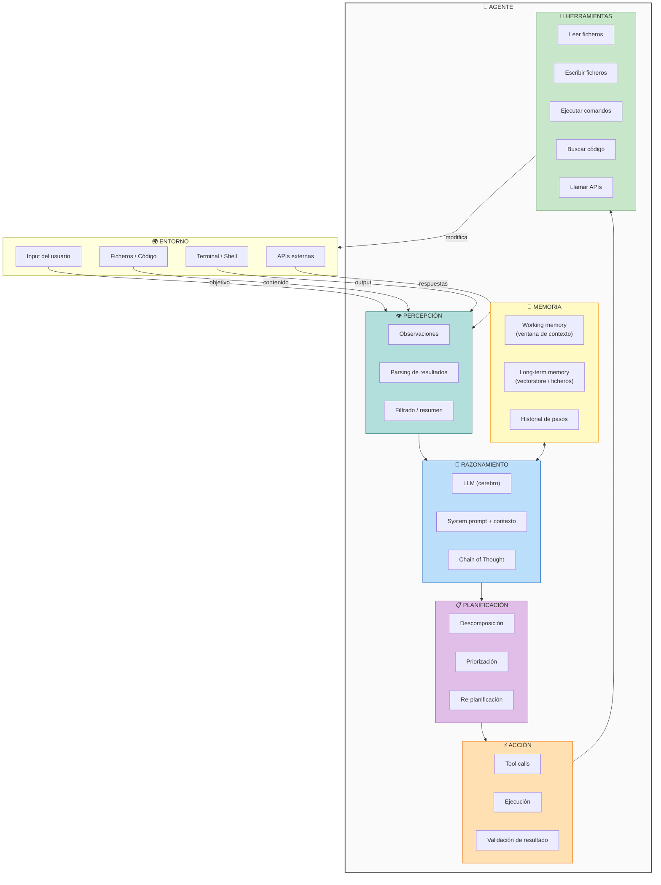
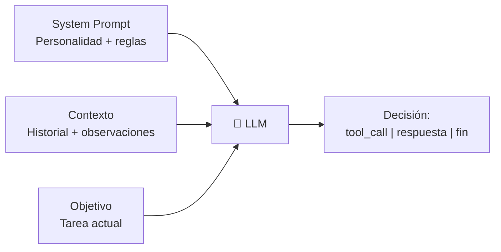
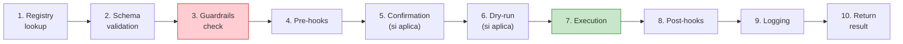
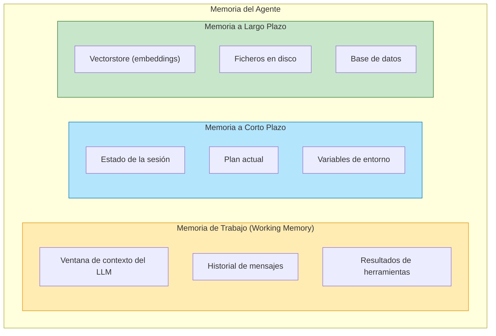
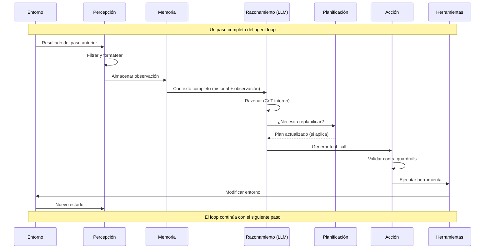
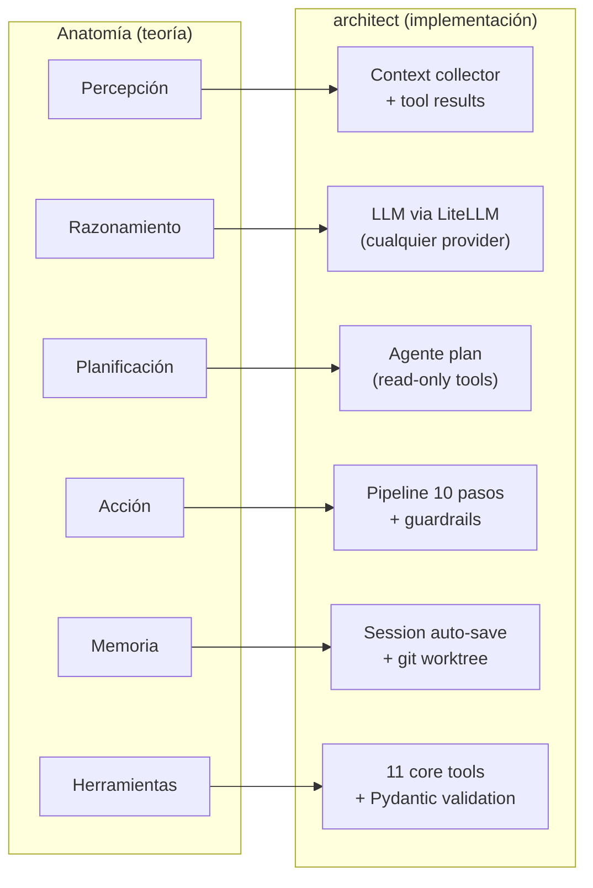

# Anatomía de un Agente IA

> [!abstract]
> Todo agente IA, desde el más simple hasta el más sofisticado, se compone de seis subsistemas fundamentales: ==percepción, razonamiento, planificación, acción, memoria y herramientas==. Esta nota disecciona cada componente en profundidad, explica cómo interactúan durante un paso de ejecución (*step*), compara la arquitectura de agentes con la ==arquitectura de software tradicional==, y muestra cómo [[architect-overview|architect]] implementa concretamente cada pieza con sus 4 agentes, 11 herramientas y su *Ralph Loop*. ^resumen

---

## Vista general: los seis subsistemas



---

## 1. Percepción: los ojos del agente

La percepción (*perception*) es el subsistema que transforma datos crudos del entorno en observaciones que el LLM puede procesar. Sin percepción, el agente está ciego.

### Qué percibe un agente

| Fuente | Tipo de dato | Ejemplo |
|---|---|---|
| Usuario | Texto natural | "Refactoriza el módulo de autenticación" |
| Ficheros | Código, configuración, docs | Contenido de `auth.py`, `package.json` |
| Terminal | stdout/stderr | Resultado de `npm test`, errores de compilación |
| APIs | JSON, XML | Respuesta de un endpoint REST |
| Herramientas | Resultados estructurados | Output de [[vigil-overview\|vigil]] en formato SARIF |

### El problema del ancho de banda

> [!warning] El cuello de botella más crítico de los agentes
> Un LLM puede procesar miles de tokens, pero un codebase tiene millones de líneas. La percepción debe ==filtrar, resumir y priorizar== lo que el agente "ve". Mostrar demasiado inunda el contexto; mostrar muy poco deja al agente desinformado.

Estrategias de filtrado que utiliza [[architect-overview|architect]]:

- **Lectura selectiva**: el agente decide qué ficheros leer basándose en nombres y estructura del proyecto, no lee todo el codebase de golpe
- **Truncamiento inteligente**: cuando un resultado de herramienta es muy largo, se trunca preservando inicio y final
- **Resumen de errores**: los errores de compilación largos se resumen a las líneas más relevantes
- **Context fullness tracking**: el agente monitoriza cuánto de su ventana de contexto ha consumido, y puede parar cuando está al 90%

### Cómo architect implementa la percepción

En [[architect-overview|architect]], la percepción ocurre en dos momentos:

1. **Inicio de sesión**: el sistema recopila contexto del proyecto (estructura de directorios, ficheros clave, `README`, `package.json`, etc.) y lo inyecta en el *system prompt*.
2. **Cada paso del loop**: los resultados de las herramientas ejecutadas se formatean y se añaden al historial de mensajes como `tool_result`.

---

## 2. Razonamiento: el cerebro LLM

El razonamiento (*reasoning*) es el corazón del agente. Un LLM general-purpose actúa como motor de razonamiento, procesando las observaciones y decidiendo la siguiente acción.

### Por qué funciona un LLM como cerebro

> [!tip] La ventaja clave del LLM como razonador
> A diferencia de un motor de reglas o un planificador clásico, el LLM puede razonar sobre ==dominios que nunca ha visto== combinando conocimiento general con contexto específico proporcionado en el prompt.

El razonamiento del agente depende de tres inputs:



1. **System prompt**: define el rol, las reglas, las herramientas disponibles y las restricciones. En architect, cada agente (plan, build, resume, review) tiene un *system prompt* diferente optimizado para su función.
2. **Contexto acumulado**: todo el historial de la conversación, incluyendo resultados de herramientas previas.
3. **Objetivo actual**: lo que el usuario pidió, posiblemente refinado por el agente `plan`.

### Chain of Thought en agentes

El *Chain of Thought* (CoT) no es solo una técnica de prompting --- en agentes, es el mecanismo de razonamiento visible. Cuando un agente "piensa" antes de actuar, está generando CoT que:

- Hace explícito su razonamiento (trazabilidad)
- Mejora la calidad de las decisiones
- Permite debuggear por qué el agente tomó un camino incorrecto

> [!example]- Ejemplo de razonamiento con CoT en un agente de código
> ```
> [Paso 3] Pensamiento del agente:
>
> He leído el fichero auth_middleware.py y encontrado el problema:
> la función verify_token() captura todas las excepciones con un
> bare except, lo que oculta errores de configuración.
>
> Plan para este paso:
> 1. Reemplazar "except:" por "except jwt.InvalidTokenError:"
> 2. Añadir un bloque separado para "except jwt.ExpiredSignatureError:"
>    con un mensaje específico
> 3. Dejar que otros errores propaguen para que sean visibles
>
> Voy a usar write_file para aplicar el cambio.
>
> [Acción] write_file("auth_middleware.py", nuevo_contenido)
> ```

### Cómo architect implementa el razonamiento

[[architect-overview|architect]] delega todo el razonamiento al LLM a través de [[tool-use-function-calling|function calling]]. El LLM recibe el historial completo y genera una respuesta que puede ser:

- Un `tool_call`: indica que quiere usar una herramienta (razonó que necesita más información o ejecutar una acción)
- Un mensaje de texto: indica que quiere comunicar algo o que ha terminado
- Una señal de `stop`: indica que la tarea está completa

El agente NO tiene lógica de razonamiento hardcoded. Todo el razonamiento emerge del LLM, guiado por el *system prompt* y el contexto.

---

## 3. Planificación: el estratega

La planificación (*planning*) es la capacidad de descomponer un objetivo complejo en pasos manejables. Ver [[planning-agentes]] para un tratamiento exhaustivo.

### Dos modos de planificación

| Modo | Cuándo planifica | Ventajas | Desventajas |
|---|---|---|---|
| **Inline** (*ReAct*) | En cada paso del loop | Adaptativo, reacciona a cambios | Puede perder el hilo en tareas largas |
| **Upfront** (*Plan-and-Execute*) | Antes de empezar a ejecutar | Estructura clara, fácil de auditar | Plan puede volverse obsoleto |

### Cómo architect implementa la planificación

[[architect-overview|architect]] usa un enfoque híbrido:

1. **Agente `plan`**: genera un plan estructurado antes de la ejecución. Usa herramientas de ==solo lectura== (no puede modificar ficheros) para analizar el proyecto y produce un plan detallado con pasos numerados.
2. **Agente `build`**: ejecuta el plan paso a paso, pero tiene libertad para **replanificar** si algo sale mal (un test falla, un import no existe, etc.).

> [!info] Planificación en intake
> [[intake-overview|intake]] también implementa planificación, pero a nivel de tareas, no de código. Su pipeline de 5 fases transforma requisitos en un DAG (*Directed Acyclic Graph*) de tareas con dependencias, priorizaciones y estimaciones.

---

## 4. Acción: las manos del agente

La acción (*action*) es la ejecución concreta de herramientas que modifican el entorno. Es lo que distingue a un agente de un sistema que solo "piensa".

### El pipeline de ejecución de una acción

En [[architect-overview|architect]], cada acción pasa por un pipeline de 10 pasos antes de ejecutarse (ver [[tool-use-function-calling#Pipeline de ejecución|pipeline de ejecución completo]]):



> [!danger] La acción es el punto de máximo riesgo
> Cuando un agente ejecuta una acción, está modificando el mundo real. Un `rm -rf /` ejecutado por un agente es tan destructivo como uno ejecutado por un humano. Las 22 capas de seguridad de architect y las 26 reglas de [[vigil-overview|vigil]] existen precisamente para este momento.

### Tipos de acciones

1. **Acciones de lectura**: leer ficheros, buscar código, listar directorios. Bajo riesgo.
2. **Acciones de escritura**: crear o modificar ficheros. Riesgo medio (reversible con git).
3. **Acciones de ejecución**: ejecutar comandos shell. ==Riesgo alto== (pueden ser irreversibles).
4. **Acciones externas**: llamar APIs, enviar datos. Riesgo muy alto (datos pueden salir del sistema).

---

## 5. Memoria: el contexto del agente

La memoria (*memory*) permite al agente mantener coherencia a lo largo de múltiples pasos. Sin memoria, cada paso sería independiente y el agente no podría construir sobre resultados anteriores.

### Tipos de memoria



| Tipo | Alcance | Implementación | Limitaciones |
|---|---|---|---|
| **Memoria de trabajo** | Paso actual | Ventana de contexto del LLM | Limitada por tokens (4K-1M+) |
| **Memoria de sesión** | Sesión completa | Historial en memoria/disco | Puede desbordar el contexto |
| **Memoria a largo plazo** | Entre sesiones | Ficheros, vectorstores, DB | Latencia de recuperación, relevancia |

> [!tip] El truco de la memoria de trabajo
> La memoria de trabajo de un agente ES la ventana de contexto del LLM. Cada mensaje previo, cada resultado de herramienta, cada observación ocupa tokens. Cuando se llena, el agente pierde contexto antiguo o debe parar. [[architect-overview|architect]] monitoriza esto con su *context fullness* tracking y tiene `CONTEXT_FULL` como una razón de parada.

### Cómo architect implementa la memoria

- **Sesión auto-save**: cada sesión se guarda automáticamente a disco, permitiendo reanudarla con el agente `resume`
- **Historial de mensajes**: el historial completo se mantiene en un array de mensajes que se pasa al LLM en cada llamada
- **Context window management**: cuando el contexto se acerca al límite, architect puede comprimir mensajes antiguos o parar la sesión para reanudarla después
- **Git como memoria**: todos los cambios se hacen en un *git worktree* aislado, lo que permite volver atrás y mantener un historial completo de lo que el agente hizo

---

## 6. Herramientas: las extensiones del agente

Las herramientas (*tools*) son funciones que el agente puede invocar para interactuar con el entorno. Sin herramientas, el agente solo puede generar texto. Con herramientas, puede modificar el mundo. Ver [[tool-use-function-calling]] para el tratamiento completo.

### Las 11 herramientas core de architect

> [!example]- Lista completa de herramientas de architect
>
> | Herramienta | Tipo | Descripción |
> |---|---|---|
> | `read_file` | Lectura | Lee el contenido de un fichero |
> | `write_file` | Escritura | Crea o sobrescribe un fichero |
> | `edit_file` | Escritura | Aplica ediciones parciales a un fichero |
> | `list_dir` | Lectura | Lista contenido de un directorio |
> | `search_code` | Lectura | Busca patrones en el codebase con ripgrep |
> | `run_command` | Ejecución | Ejecuta un comando shell |
> | `ask_user` | Interacción | Pide input al usuario (rompe autonomía) |
> | `task_complete` | Control | Señala que la tarea está completa |
> | `create_file` | Escritura | Crea un fichero nuevo (falla si existe) |
> | `search_replace` | Escritura | Busca y reemplaza texto en ficheros |
> | `read_image` | Lectura | Lee y analiza una imagen (multimodal) |
>
> El agente `plan` tiene acceso solo a herramientas de lectura. El agente `build` tiene acceso a todas. Esta separación de privilegios es un patrón de seguridad importante.

---

## Cómo interactúan los componentes en un paso

Un solo paso (*step*) del [[agent-loop|agent loop]] involucra todos los subsistemas. Veamos la secuencia completa:



---

## Comparación con arquitectura de software tradicional

> [!question] ¿Cómo se mapean los conceptos de un agente a la arquitectura de software que ya conocemos?

| Componente del agente | Equivalente en software tradicional | Diferencia clave |
|---|---|---|
| **LLM (razonamiento)** | Business logic / Controller | No determinista: misma entrada puede dar diferente salida |
| **Herramientas** | Services / Repositories | El agente decide cuáles usar en runtime |
| **Memoria de trabajo** | Request context / Session state | Limitada por tokens, no por RAM |
| **Memoria a largo plazo** | Database / Cache | El agente decide qué almacenar y recuperar |
| **Percepción** | Input parsing / Deserialization | Debe manejar datos no estructurados |
| **Planificación** | Workflow engine / Orchestrator | Emergente del LLM, no hardcodeada |
| **Agent loop** | Event loop / Main loop | Incluye razonamiento en cada iteración |
| **System prompt** | Configuration / DI container | Define el comportamiento sin cambiar código |
| **Guardrails** | Middleware / Validators | Seguridad contra comportamiento impredecible del LLM |

> [!warning] La diferencia fundamental
> En software tradicional, el flujo de ejecución es determinista: dado un input, siempre sigue el mismo camino. En un agente, ==el flujo es emergente==: el LLM decide el camino en runtime. Esto hace que el testing, el debugging y la seguridad sean fundamentalmente más difíciles. Por eso existen herramientas como [[vigil-overview|vigil]] (testing determinista del output) y [[licit-overview|licit]] (compliance del proceso).

---

## Cómo architect implementa cada componente

> [!success] Mapeo concreto: anatomía → implementación



### Detalle de la implementación

**Percepción en architect**: Al inicio de una sesión, architect recopila contexto del proyecto: estructura de directorios, `README`, ficheros de configuración clave. Durante el loop, los resultados de cada herramienta se formatean como `tool_result` y se añaden al historial.

**Razonamiento en architect**: architect usa [[tool-use-function-calling|function calling]] nativo del LLM a través de LiteLLM. El LLM razona internamente y produce `tool_calls` estructurados. No hay parsing de texto libre ni regex --- todo es JSON tipado.

**Planificación en architect**: El agente `plan` es una configuración especial del loop que restringe las herramientas disponibles a solo lectura. El LLM analiza el proyecto y genera un plan en markdown estructurado con pasos numerados, estimaciones y dependencias.

**Acción en architect**: Cada tool call pasa por el pipeline de 10 pasos descrito en [[tool-use-function-calling#Pipeline de ejecución|pipeline de ejecución]]. Los *guardrails* verifican que la acción no viole restricciones de seguridad (no escribir fuera del directorio del proyecto, no ejecutar comandos destructivos).

**Memoria en architect**: Las sesiones se auto-guardan a disco. El agente `resume` puede reanudar una sesión interrumpida cargando el historial completo y continuando donde se quedó. Git worktrees proporcionan una "memoria" a nivel de cambios en el código.

**Herramientas en architect**: Las 11 herramientas core están definidas con schemas JSON y validación Pydantic. Cada herramienta tiene su schema, su función de ejecución y sus hooks pre/post.

---

## Anti-patrones en la anatomía de agentes

> [!failure] Errores comunes en el diseño de agentes
>
> 1. **Cerebro sin manos**: Un agente que solo razona pero no puede actuar. Genera planes perfectos que nadie ejecuta.
>
> 2. **Manos sin cerebro**: Un agente que ejecuta herramientas sin razonar adecuadamente. Modifica código sin entender el contexto.
>
> 3. **Amnesia**: No mantener historial entre pasos. El agente repite las mismas acciones porque no recuerda haberlas hecho.
>
> 4. **Percepción total**: Intentar cargar todo el codebase en el contexto. El agente se ahoga en información irrelevante.
>
> 5. **Herramientas sin guardrails**: Dar al agente acceso a herramientas peligrosas sin validación. Un `run_command("rm -rf /")` es un tool call válido si no hay guardrails.
>
> 6. **Plan rígido**: Generar un plan y seguirlo ciegamente sin adaptarse a errores o cambios. La re-planificación es esencial.

---

## Relación con el ecosistema

La anatomía de un agente se refleja directamente en cómo están diseñadas las herramientas del ecosistema:

- **[[intake-overview|intake]]**: actúa como **sistema de percepción externo**. Transforma requisitos heterogéneos (PDFs, emails, tickets de Jira) en specs normalizadas que el agente puede consumir. Sus 12+ parsers son, en esencia, los "ojos" del pipeline completo.

- **[[architect-overview|architect]]**: implementa los **seis subsistemas completos** dentro de un solo CLI. Es la referencia concreta de cómo la teoría de anatomía de agentes se traduce en código funcional. Cada agente (plan, build, resume, review) enfatiza un subsistema diferente.

- **[[vigil-overview|vigil]]**: funciona como un **sistema de percepción post-acción**. Después de que el agente actúa (genera código), vigil "percibe" el resultado y lo evalúa contra 26 reglas deterministas. Es un guardrail externo al agente, independiente del LLM.

- **[[licit-overview|licit]]**: representa la **memoria de compliance**. Registra qué hizo cada agente, con qué configuración, y si cumple la EU AI Act. Es memoria a largo plazo orientada a auditoría y trazabilidad.

---

## Enlaces y referencias

> [!quote]- Bibliografía
> - Weng, L. (2023). *LLM Powered Autonomous Agents*. Lil'Log. [^1]
> - Sumers, T., et al. (2023). *Cognitive Architectures for Language Agents*. arXiv:2309.02427 [^2]
> - Park, J.S., et al. (2023). *Generative Agents: Interactive Simulacra of Human Behavior*. arXiv:2304.03442 [^3]
> - Russell, S., & Norvig, P. (2020). *AIMA*, Cap. 2: Intelligent Agents [^4]
> - Brooks, R. (1991). *Intelligence without representation*. Artificial Intelligence, 47(1-3) [^5]

### Notas relacionadas

- [[que-es-un-agente-ia]] — Definición y taxonomías de agentes
- [[agent-loop]] — El bucle de ejecución que conecta todos los componentes
- [[planning-agentes]] — Planificación en profundidad
- [[tool-use-function-calling]] — El subsistema de herramientas al detalle
- [[memory-management-agentes]] — Gestión de memoria avanzada
- [[architect-overview]] — Implementación de referencia
- [[vigil-overview]] — Guardrails externos al agente
- [[moc-agentes]] — Mapa de contenido

---

[^1]: Weng, L. (2023). *LLM Powered Autonomous Agents*. Lil'Log. https://lilianweng.github.io/posts/2023-06-23-agent/
[^2]: Sumers, T., Yao, S., Narasimhan, K., & Griffiths, T. (2023). *Cognitive Architectures for Language Agents*. arXiv:2309.02427.
[^3]: Park, J.S., O'Brien, J.C., Cai, C.J., et al. (2023). *Generative Agents: Interactive Simulacra of Human Behavior*. arXiv:2304.03442.
[^4]: Russell, S., & Norvig, P. (2020). *Artificial Intelligence: A Modern Approach* (4th ed.). Cap. 2: Intelligent Agents.
[^5]: Brooks, R. (1991). *Intelligence without representation*. Artificial Intelligence, 47(1-3), 139-159.
