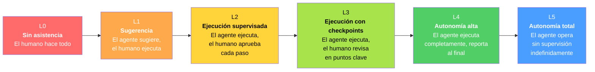
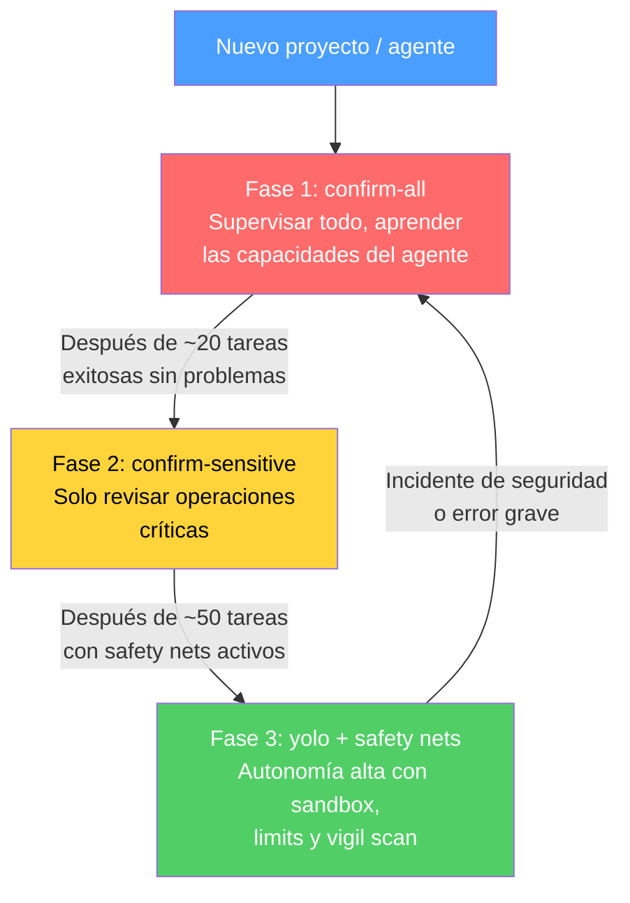
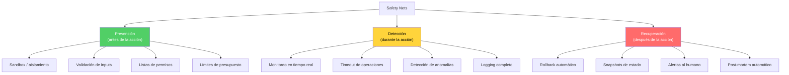
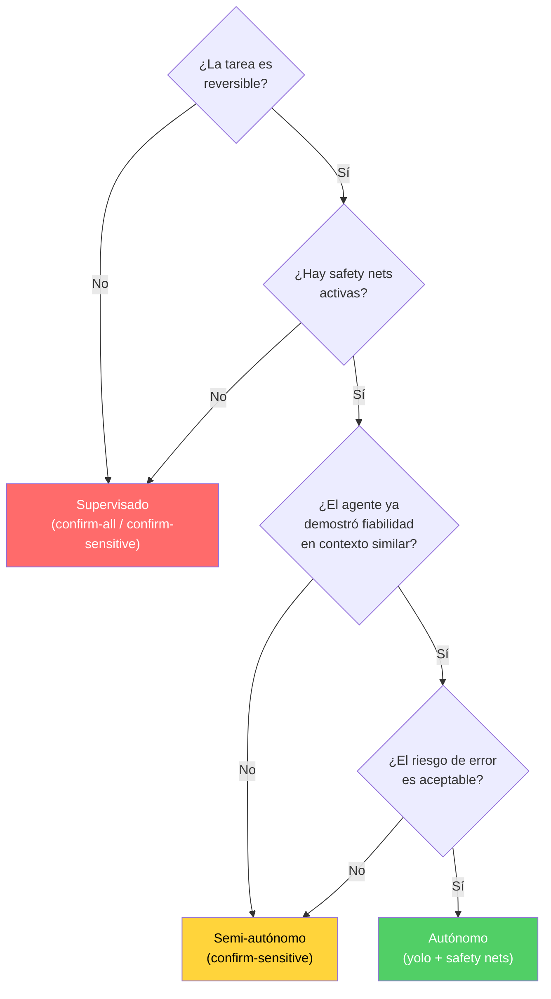

---
tags:
  - concepto
  - agentes
  - seguridad
aliases:
  - agentes autónomos
  - autonomous AI agents
  - autonomía de agentes
  - niveles de autonomía
created: 2025-06-01
updated: 2025-06-01
category: agentes-avanzado
status: current
difficulty: advanced
related:
  - "[[agent-loop]]"
  - "[[architect-overview]]"
  - "[[vigil-overview]]"
  - "[[multi-agent-systems]]"
  - "[[coding-agents]]"
  - "[[memoria-agentes]]"
  - "[[agent-communication]]"
  - "[[licit-overview]]"
up: "[[moc-agentes]]"
---

# Agentes Autónomos

> [!abstract] Resumen
> Los *autonomous agents* (agentes autónomos) operan con mínima o nula supervisión humana, tomando decisiones, ejecutando acciones y corrigiendo errores por sí mismos. La autonomía no es binaria sino un espectro: ==desde agentes totalmente supervisados (cada acción requiere aprobación) hasta agentes completamente autónomos (ejecutan tareas completas sin intervención)==. La calibración correcta de la autonomía es el problema central: demasiada supervisión anula la productividad, demasiada autonomía introduce riesgos inaceptables. *architect* implementa tres modos de confirmación — `yolo`, `confirm-all`, `confirm-sensitive` — que permiten ==calibrar la autonomía según la confianza, el contexto y el riesgo de la tarea==. Las *safety nets* (límites de presupuesto, tiempo, sandbox, rollback) son prerequisitos no negociables para cualquier nivel de autonomía significativo. ^resumen

## Qué es y por qué importa

Un **agente autónomo** (*autonomous agent*) es un sistema de IA capaz de ==perseguir objetivos complejos de forma independiente==, descomponiendo tareas, ejecutando acciones, evaluando resultados y ajustando su estrategia sin requerir aprobación humana en cada paso.

La importancia de la autonomía es práctica: la razón principal por la que las empresas invierten en agentes de IA es para ==reducir la carga cognitiva y temporal sobre los humanos==. Un agente que requiere aprobación en cada paso no ahorra tiempo — simplemente reemplaza "hacer" por "supervisar", que es igualmente costoso.

Sin embargo, la autonomía sin control es el camino más rápido hacia desastres: un agente autónomo puede borrar archivos, instalar dependencias maliciosas, comprometer credenciales, o generar código con vulnerabilidades — todo mientras el humano confía en que "el agente sabe lo que hace".

> [!tip] La pregunta correcta
> No preguntes "¿mi agente debería ser autónomo?" sino **"¿en qué tareas específicas y con qué safety nets puedo darle más autonomía?"**. La autonomía es un dial, no un interruptor.

---

## Niveles de autonomía: una escala SAE para agentes de IA

Inspirándonos en los niveles SAE de conducción autónoma[^1], podemos definir una escala de autonomía para agentes de IA:



| Nivel | Nombre | Rol del humano | Rol del agente | Ejemplo |
|---|---|---|---|---|
| **L0** | Sin asistencia | Todo | Nada | Escribir código manualmente |
| **L1** | Sugerencia | Ejecutor + decisor | Sugiere opciones | Autocompletado de Copilot |
| **L2** | Ejecución supervisada | Aprueba cada acción | Ejecuta con permiso | `confirm-all` en architect |
| **L3** | Ejecución con checkpoints | Revisa en puntos clave | ==Ejecuta autónomamente entre checkpoints== | `confirm-sensitive` en architect |
| **L4** | Autonomía alta | Revisa resultado final | Ejecuta tarea completa | `yolo` en architect, Claude Code |
| **L5** | Autonomía total | Monitoreo pasivo | ==Opera indefinidamente== | Agentes de monitoreo 24/7 (aún experimental) |

> [!warning] L5 no existe de forma fiable en 2025
> Ningún agente actual opera en L5 de forma fiable para tareas de desarrollo de software. Los sistemas que se acercan (como agentes de monitoreo o bots de CI/CD) operan en dominios muy restringidos. La autonomía total en tareas abiertas y complejas ==sigue siendo un objetivo de investigación, no un producto==.

---

## El espectro de supervisión

### Supervisión total (*Fully Supervised*)

Cada acción del agente requiere aprobación explícita. El humano ve lo que el agente quiere hacer y decide si permitirlo.

> [!success] Ventajas
> - Máximo control sobre cada acción
> - El humano aprende observando al agente
> - Riesgo mínimo de acciones no deseadas

> [!failure] Desventajas
> - ==Elimina la ventaja principal del agente: ahorrar tiempo==
> - Fatiga de aprobación: después de aprobar 50 acciones, el humano empieza a hacer click en "aprobar" sin revisar
> - No escala a tareas complejas con cientos de acciones

### Human-in-the-Loop (HITL)

El agente opera autónomamente la mayor parte del tiempo pero ==solicita intervención humana en puntos críticos==: decisiones de diseño importantes, operaciones destructivas, acciones que exceden su umbral de confianza.

Este es el ==modo óptimo para la mayoría de casos en 2025==. Combina productividad con control.

| Trigger para intervención humana | Ejemplo |
|---|---|
| **Operación destructiva** | Borrar archivos, drop table, force push |
| **Decisión de arquitectura** | Elegir entre microservicios vs monolito |
| **Coste significativo** | Crear instancias cloud, llamadas API caras |
| **Incertidumbre alta** | El agente no está seguro de cuál de 3 enfoques es correcto |
| **Acción irreversible** | Merge a main, deploy a producción, enviar email |
| **Límite de tiempo/presupuesto** | El agente ha consumido más tokens/tiempo del esperado |

### Autonomía total (*Fully Autonomous*)

El agente recibe una tarea y la ejecuta sin ninguna intervención. El humano revisa el resultado final (o no).

> [!danger] Requisitos para autonomía total
> ==Nunca concedas autonomía total sin todos estos safety nets activos==:
> 1. **Sandbox**: El agente opera en un entorno aislado (worktree, VM, container)
> 2. **Límite de presupuesto**: Máximo de tokens/dólares que puede gastar
> 3. **Límite de tiempo**: Timeout después de X minutos
> 4. **Rollback**: Capacidad de deshacer todo lo que hizo
> 5. **Logging**: Registro completo de cada acción para auditoría
> 6. **Escaneo de seguridad**: Análisis automático del resultado con [[vigil-overview|vigil]]
> 7. **Sin acceso a producción**: Nunca deploy automático a producción

---

## Calibración de confianza: cómo aumentar la autonomía progresivamente

La autonomía no debería ser una decisión estática. Debería ==aumentar gradualmente a medida que el agente demuestra fiabilidad== en un contexto específico.

### Modelo de confianza progresiva



> [!info] El factor del contexto
> La confianza no es transferible entre contextos. Un agente que ha demostrado fiabilidad en un proyecto Python backend no merece el mismo nivel de confianza en un proyecto de infraestructura Terraform. ==Cada nuevo contexto reinicia parcialmente la calibración de confianza==.

### Señales para aumentar la confianza

| Señal | Qué indica | Ajuste de autonomía |
|---|---|---|
| Tests pasan consistentemente después de cambios | El agente genera código correcto | +1 nivel |
| [[vigil-overview\|Vigil]] no detecta issues en las últimas 20 tareas | El agente genera código seguro | +1 nivel |
| No ha requerido rollback en el último mes | Las acciones son fiables | +1 nivel |
| El agente pide ayuda cuando debería | Calibración interna correcta | +1 nivel |

### Señales para reducir la confianza

| Señal | Qué indica | Ajuste de autonomía |
|---|---|---|
| Vigil detecta un SEC-001 (secret hardcodeado) | Riesgo de seguridad | ==-2 niveles== |
| El agente borró archivos que no debería | Mal juicio de acciones | -2 niveles |
| Tests fallan después de cambios del agente | Código incorrecto | -1 nivel |
| El agente instaló una dependencia alucinada (DEP-001) | Fiabilidad comprometida | -1 nivel |
| Tiempo de ejecución excede 3x lo esperado | Posible loop infinito | -1 nivel |

---

## Modos de confirmación en architect

*architect* implementa la calibración de autonomía con tres modos de confirmación que mapean directamente a los niveles del espectro:

### `confirm-all` (Nivel L2)

Cada herramienta que el agente quiere invocar requiere aprobación del usuario. El usuario ve exactamente qué herramienta, con qué parámetros, y decide si permitirlo.

> [!example]- Flujo de confirm-all
> ```
> architect> Quiero leer el archivo src/auth/login.ts
> [?] Permitir read_file("src/auth/login.ts")? [y/n/always] y
>
> architect> He encontrado el bug. Quiero aplicar este cambio:
> [diff mostrado]
> [?] Permitir edit_file("src/auth/login.ts", ...)? [y/n/always] y
>
> architect> Ahora quiero ejecutar los tests:
> [?] Permitir run_command("npm test")? [y/n/always] y
> ```

**Cuándo usar**: Primeras sesiones con un proyecto nuevo, tareas en código crítico, cuando no confías en el agente.

### `confirm-sensitive` (Nivel L3)

El agente ejecuta autónomamente operaciones de lectura y análisis, pero ==solicita confirmación para operaciones que modifican estado==: editar archivos, ejecutar comandos, instalar dependencias.

> [!example]- Flujo de confirm-sensitive
> ```
> architect> [auto] Leyendo src/auth/login.ts...
> architect> [auto] Leyendo src/auth/middleware.ts...
> architect> [auto] Buscando "refreshToken" en el proyecto...
> architect> He analizado el módulo. Quiero aplicar este cambio:
> [diff mostrado]
> [?] Permitir edit_file("src/auth/login.ts", ...)? [y/n/always] y
>
> architect> Quiero ejecutar los tests:
> [?] Permitir run_command("npm test")? [y/n/always] always
>
> architect> [auto] Ejecutando npm test... ✓ 47 tests passed
> architect> [auto] Ejecutando npm test... ✓ 47 tests passed (después del fix)
> ```

**Cuándo usar**: La mayoría del tiempo. ==Es el modo recomendado por defecto.==

### `yolo` (Nivel L4)

El agente ==nunca pide confirmación==. Ejecuta todas las operaciones autónomamente hasta completar la tarea.

> [!danger] yolo requiere safety nets obligatorias
> **Nunca** uses el modo `yolo` sin:
> - Ejecución en un git worktree o branch dedicado (rollback fácil)
> - Límite de presupuesto de tokens configurado
> - Timeout de sesión configurado
> - Escaneo de [[vigil-overview|vigil]] automático post-ejecución
> - ==Nunca en main/master directamente==

**Cuándo usar**: Tareas repetitivas en proyectos conocidos, CI/CD pipelines, generación de boilerplate, cuando el agente ya ha demostrado fiabilidad.

---

## Safety nets: prerequisitos para la autonomía

Las *safety nets* (redes de seguridad) son los mecanismos que permiten conceder autonomía al agente ==sin asumir riesgo desproporcionado==. Son el equivalente a los cinturones de seguridad: no impiden conducir, pero limitan el daño en caso de accidente.

### Taxonomía de safety nets



### Safety nets detalladas

| Safety net | Tipo | Implementación en architect | Criticidad |
|---|---|---|---|
| **Git worktrees** | Prevención | Cada tarea en un worktree separado, rollback = borrar worktree | ==Crítica== |
| **Límite de tokens** | Prevención | Configuración de max_tokens por sesión | Alta |
| **Timeout** | Detección | Timeout configurable por operación y por sesión | Alta |
| **Modos de confirmación** | Prevención | `confirm-all`, `confirm-sensitive`, `yolo` | ==Crítica== |
| **Auto-review** | Detección | Sub-agente de review con contexto limpio | Alta |
| **Vigil scan** | Detección | Escaneo de 26 reglas de seguridad post-generación | ==Crítica== |
| **Licit check** | Detección | Verificación de proveniencia y compliance | Media |
| **Session persistence** | Recuperación | Estado guardado para retomar o analizar | Media |
| **Branch protection** | Prevención | Nunca commit directo a main/master | Alta |

---

## Patrones de Human-in-the-Loop

### Patrón: Aprobación (*Approval Gate*)

El agente prepara una acción y la presenta al humano para aprobación. Simple, efectivo, pero ==interrumpe al humano== constantemente.

### Patrón: Revisión post-hoc (*Review After Action*)

El agente ejecuta autónomamente y el humano revisa el resultado antes de que se "finalice" (merge, deploy). Más eficiente pero ==el daño puede haberse hecho antes de la revisión== (archivos borrados, APIs llamadas, etc).

> [!warning] Review post-hoc solo funciona con operaciones reversibles
> Si el agente puede ejecutar operaciones irreversibles (enviar emails, hacer deploy, borrar datos), la revisión post-hoc llega demasiado tarde. Usa este patrón solo cuando todas las acciones del agente son ==reversibles== (cambios en código, creación de archivos, git commits en branches).

### Patrón: Override (*Human Override*)

El agente opera autónomamente pero el humano puede intervenir en cualquier momento para corregir el rumbo, cancelar la tarea, o tomar el control. Es el patrón de la ==conducción asistida==: el agente conduce, pero el humano tiene el volante.

### Patrón: Escalation (*Intelligent Escalation*)

El agente evalúa su propia confianza en cada paso. Cuando la confianza cae por debajo de un umbral, ==escala automáticamente al humano== en lugar de actuar con incertidumbre.

> [!example]- Implementación de escalation inteligente
> ```python
> class AutonomousAgent:
>     def __init__(self, confidence_threshold: float = 0.7):
>         self.confidence_threshold = confidence_threshold
>
>     async def execute_step(self, step: TaskStep) -> StepResult:
>         # El agente evalúa su confianza antes de actuar
>         confidence = await self.evaluate_confidence(step)
>
>         if confidence >= self.confidence_threshold:
>             # Ejecutar autónomamente
>             result = await self.execute(step)
>             return StepResult(result=result, autonomous=True)
>
>         elif confidence >= 0.4:
>             # Pedir confirmación al humano con explicación
>             explanation = await self.explain_uncertainty(step)
>             approved = await self.request_approval(
>                 step, explanation,
>                 message=f"Confianza: {confidence:.0%}. "
>                         f"Razón de duda: {explanation}"
>             )
>             if approved:
>                 result = await self.execute(step)
>                 return StepResult(result=result, autonomous=False)
>             else:
>                 return StepResult(result=None, skipped=True)
>
>         else:
>             # Confianza muy baja: escalar completamente al humano
>             await self.escalate_to_human(
>                 step,
>                 message=f"No tengo suficiente confianza ({confidence:.0%}) "
>                         f"para ejecutar esta acción. Necesito tu ayuda."
>             )
>             return StepResult(result=None, escalated=True)
>
>     async def evaluate_confidence(self, step: TaskStep) -> float:
>         """Evalúa la confianza del agente en ejecutar este paso."""
>         factors = {
>             'task_familiarity': self.check_similar_past_tasks(step),
>             'tool_reliability': self.check_tool_success_rate(step.tool),
>             'context_completeness': self.check_context_available(step),
>             'reversibility': 1.0 if step.is_reversible else 0.3,
>             'risk_level': 1.0 - step.risk_score,
>         }
>         return sum(factors.values()) / len(factors)
> ```

---

## Por qué los agentes completamente autónomos todavía fallan

A pesar del hype, los agentes autónomos de 2025 tienen limitaciones fundamentales que impiden la autonomía total fiable:

### 1. Planificación a largo plazo deficiente

Los LLMs son excelentes en razonamiento local (el siguiente paso) pero mediocres en planificación global (la estrategia de 50 pasos). Un agente autónomo puede optimizar cada paso individual pero ==converger a una solución subóptima o un callejón sin salida a nivel global==.

### 2. Propagación de errores

En una cadena de 20 acciones, un error en el paso 3 puede propagarse y amplificarse. Sin intervención humana, el agente puede construir sobre fundamentos incorrectos durante pasos 4-20, desperdiciando tiempo y recursos.

### 3. Incapacidad de "saber que no sabe"

Los LLMs son notoriamente malos en calibrar su propia confianza[^2]. Un agente que no sabe que no sabe no puede escalar correctamente al humano — actúa con la misma certeza cuando acierta y cuando se equivoca.

### 4. Falta de sentido común en contexto de negocio

Un agente puede resolver perfectamente el problema técnico definido pero ==malinterpretar la intención de negocio==. Ejemplo: "optimiza el rendimiento de la base de datos" podría llevar al agente a borrar índices que ralentizan las escrituras pero son críticos para las lecturas de producción.

### 5. Drift en sesiones largas

En sesiones de trabajo prolongadas, los agentes pueden sufrir *goal drift*: ==perder de vista el objetivo original== y obsesionarse con sub-problemas que encontraron por el camino.

> [!question] Debate abierto: ¿cuándo llegaremos a L5 fiable?
> - **Optimistas**: Con modelos de razonamiento más avanzados (o1, o3, Claude Opus) y mejores safety nets, L5 para tareas de código será viable en 2026
> - **Escépticos**: Los problemas fundamentales (planificación, calibración de confianza, comprensión de contexto de negocio) no se resuelven solo con modelos más grandes. L5 requiere avances conceptuales, no solo escala
> - **Mi valoración**: ==L4 con safety nets robustas es el sweet spot para 2025-2026==. L5 en dominios restringidos (monitoreo, CI/CD, mantenimiento rutinario) será viable antes que L5 en desarrollo de software general

---

## Cuándo usar autónomo vs supervisado



| Tarea | Nivel recomendado | Razón |
|---|---|---|
| Fix de bug con tests existentes | L4 (yolo) | Reversible, verificable por tests |
| Refactorización de módulo grande | L3 (confirm-sensitive) | Muchos archivos afectados, posibles regresiones |
| Cambio de schema de BD | ==L2 (confirm-all)== | Potencialmente irreversible, alto impacto |
| Generación de boilerplate | L4 (yolo) | Bajo riesgo, fácilmente descartable |
| Deploy a producción | ==L2 o manual== | Irreversible en la práctica, alto impacto |
| Escribir documentación | L4 (yolo) | Bajo riesgo, el humano revisa el resultado |
| Migración de framework | L3 (confirm-sensitive) | Cambios masivos pero reversibles con git |
| Configuración de seguridad | ==L2 (confirm-all)== | Errores aquí son vulnerabilidades |

---

## Ventajas y limitaciones

> [!success] Fortalezas de la autonomía bien calibrada
> - Multiplicador de productividad: un desarrollador puede supervisar múltiples agentes en paralelo
> - Reducción de tareas rutinarias: los humanos se enfocan en decisiones de alto valor
> - Consistencia: el agente sigue las mismas prácticas en cada tarea
> - Disponibilidad: los agentes pueden trabajar fuera de horario (CI/CD nocturno)

> [!failure] Limitaciones actuales
> - La calibración de confianza del LLM es imprecisa — el agente no siempre sabe cuándo pedir ayuda
> - Las safety nets añaden latencia y coste
> - La "fatiga de supervisión" (aprobar sin revisar) es un riesgo real incluso en modos semi-supervisados
> - No existe un estándar para medir la "fiabilidad" de un agente en un contexto dado

---

## Estado del arte (2025-2026)

1. **Reward models para autonomía**: Investigación en modelos que evalúan la calidad de las decisiones del agente en tiempo real, permitiendo ==ajuste dinámico del nivel de autonomía== basado en el rendimiento reciente[^3].

2. **Constitutional AI para agentes**: Extensión de los principios de *Constitutional AI* (Anthropic) a agentes que operan autónomamente: el agente tiene "principios constitucionales" que limitan sus acciones independientemente de las instrucciones.

3. **Formal verification de acciones**: Verificación formal de que las acciones del agente cumplen con especificaciones de seguridad antes de ejecutarlas. Aún en fase de investigación pero prometedor para dominios críticos.

4. **Autonomía adaptativa**: Sistemas que ajustan el nivel de autonomía automáticamente basándose en señales de contexto: hora del día, tipo de proyecto, historial de errores recientes, criticidad del código siendo modificado.

---

## Relación con el ecosistema

> [!info] Conexiones con mis herramientas
> - **[[intake-overview|intake]]**: Un *intake* autónomo podría monitorear repositorios y generar especificaciones actualizadas automáticamente cuando detecta cambios significativos. El nivel de autonomía apropiado para intake es L3-L4: puede analizar libremente pero debería confirmar antes de generar specs que afecten a pipelines de architect
> - **[[architect-overview|architect]]**: ==architect implementa la calibración de autonomía más granular del ecosistema== con sus tres modos de confirmación (`confirm-all`, `confirm-sensitive`, `yolo`). La combinación de worktrees (sandbox), sub-agentes con auto-review, y la integración con vigil crea un sistema de safety nets que permite L4 con confianza razonable. El Ralph Loop es inherentemente un mecanismo de autonomía calibrada: el agente itera autónomamente pero la fase de review actúa como checkpoint de calidad
> - **[[vigil-overview|vigil]]**: ==Vigil es la safety net de detección más importante del ecosistema==. Sus 26 reglas actúan como un "segundo par de ojos" automático que escanea el output del agente buscando dependencias alucinadas (DEP-001), secrets hardcodeados (SEC-001), test theater (TEST-001), y problemas de CORS (AUTH-005). En un sistema autónomo, vigil debería ejecutarse automáticamente después de cada tarea completada — sin excepción
> - **[[licit-overview|licit]]**: La autonomía aumenta el riesgo de compliance. Un agente autónomo que genera código sin verificación de proveniencia podría introducir código con licencias incompatibles o copiar código protegido. Las 6 heurísticas de licit (patrones de autor, co-autores, cambios masivos, patrones de mensaje) deben ejecutarse como safety net post-generación, especialmente la evaluación OWASP Agentic Top 10 que cubre riesgos específicos de agentes autónomos

---

## Enlaces y referencias

**Notas relacionadas:**
- [[coding-agents]] — Los coding agents y sus niveles de autonomía
- [[multi-agent-systems]] — La autonomía se complica en sistemas multi-agente
- [[memoria-agentes]] — La memoria habilita mayor autonomía al permitir aprendizaje acumulativo
- [[agent-communication]] — Protocolos necesarios para agentes autónomos que interactúan con otros
- [[agent-loop]] — El loop fundamental que los agentes autónomos ejecutan sin supervisión
- [[architect-overview]] — Implementación concreta de autonomía calibrada con modos de confirmación
- [[vigil-overview]] — Safety net de detección obligatoria para agentes autónomos
- [[licit-overview#owasp-agentic|licit: OWASP Agentic Top 10]] — Riesgos de seguridad específicos de agentes

> [!quote]- Referencias bibliográficas
> - Shinn et al., "Reflexion: Language Agents with Verbal Reinforcement Learning", 2023
> - Yao et al., "ReAct: Synergizing Reasoning and Acting in Language Models", 2022
> - Wang et al., "A Survey on Large Language Model based Autonomous Agents", 2023
> - Anthropic, "Constitutional AI: Harmlessness from AI Feedback", 2022
> - Chan et al., "The Landscape of Emerging AI Agent Architectures for Reasoning, Planning, and Tool Calling", 2024
> - OWASP, "Agentic AI Threats and Mitigations", 2025
> - SAE International, "Taxonomy and Definitions for Terms Related to Driving Automation Systems", J3016 (referencia de analogía)

[^1]: SAE International, "Taxonomy and Definitions for Terms Related to Driving Automation Systems for On-Road Motor Vehicles", J3016, 2021. La escala L0-L5 de conducción autónoma que inspiró nuestra taxonomía para agentes de IA.
[^2]: Kadavath et al., "Language Models (Mostly) Know What They Know", arXiv:2207.05221, 2022. Demuestra que los LLMs tienen cierta capacidad de auto-evaluación pero con calibración imperfecta, especialmente en tareas fuera de distribución.
[^3]: Ouyang et al., "Training language models to follow instructions with human feedback", NeurIPS 2022. RLHF como base para entrenar modelos que evalúen la calidad de acciones de agentes.
