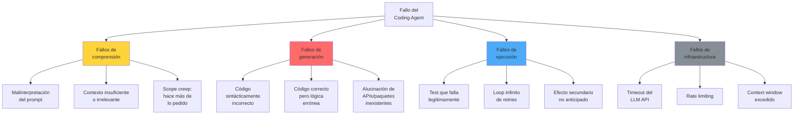
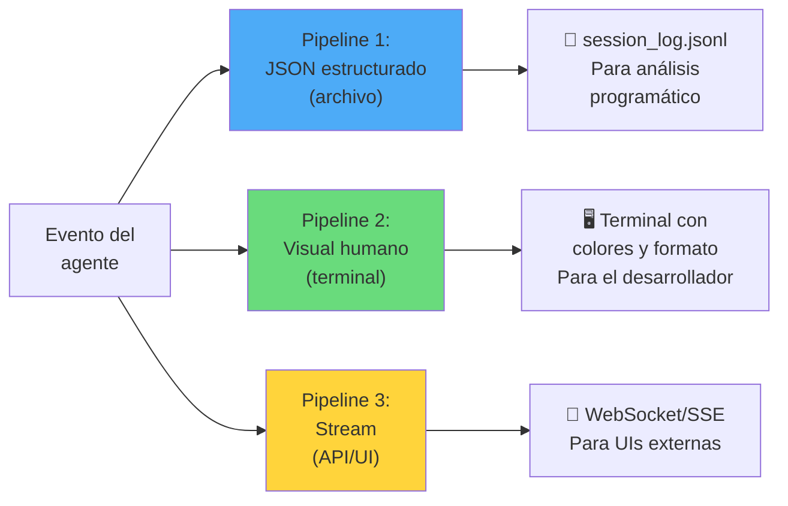
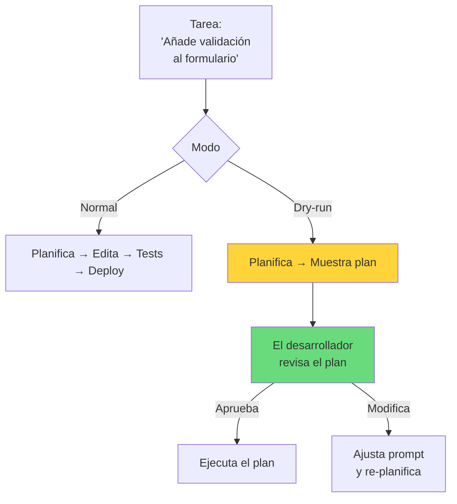
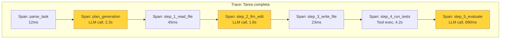
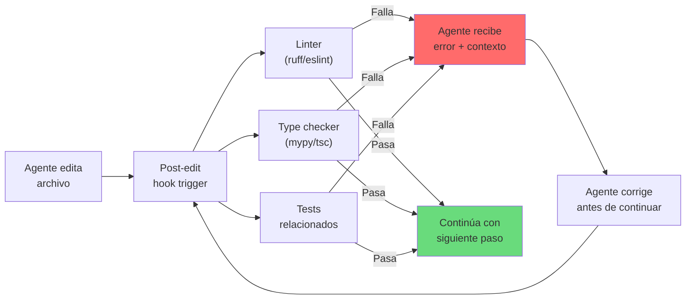

---
tags:
  - concepto
  - agentes
  - observabilidad
  - architect
aliases:
  - debugging coding agents
  - depuración de agentes de código
  - agent debugging
  - debugging de agentes IA
created: 2025-06-01
updated: 2025-06-01
category: agentes-ia
status: evergreen
difficulty: advanced
related:
  - "[[architect-overview]]"
  - "[[agent-observability]]"
  - "[[agent-error-handling]]"
  - "[[coding-agents]]"
  - "[[agent-evaluation]]"
  - "[[opentelemetry-traces]]"
  - "[[llm-testing]]"
up: "[[moc-agentes]]"
---

# Debugging de Coding Agents

> [!abstract] Resumen
> Depurar un *coding agent* es fundamentalmente diferente a depurar software tradicional porque ==el comportamiento es no-determinístico, los errores son semánticos (no solo sintácticos) y las cadenas causales pueden abarcar múltiples invocaciones de LLM==. Este documento cubre las técnicas, herramientas y patrones para diagnosticar fallos en agentes de código, desde logging estructurado y trazas hasta replay de sesiones y breakpoints conceptuales. Se detalla cómo [[architect-overview|architect]] implementa ==tres pipelines de logging paralelos, verbosidad progresiva (-v/-vv/-vvv), session replay via resume, dry-run mode y trazas OpenTelemetry==. Herramientas como Langfuse, LangSmith y Phoenix complementan la observabilidad. ^resumen

## Qué es y por qué importa

Depurar un *coding agent* — un sistema de IA que escribe, edita y ejecuta código de forma autónoma — es uno de los problemas más difíciles en ingeniería de software actual. A diferencia del software tradicional:

- ==El mismo input puede producir outputs diferentes== (no-determinismo del LLM)
- Los errores pueden ser **semánticos**: el código generado es sintácticamente correcto pero hace algo incorrecto
- Las **cadenas causales** son largas: un error en la interpretación del prompt → mala planificación → código incorrecto → test que falla → retry que empeora las cosas
- El **espacio de estados** es enorme: cada decisión del agente abre un árbol de posibilidades

> [!tip] Principio fundamental del debugging de agentes
> - **En software tradicional**: el bug está en el código → lees el código → encuentras el bug
> - **En coding agents**: el bug puede estar en ==el prompt, la interpretación del contexto, la selección de herramientas, la generación de código, la interpretación de errores, o la estrategia de retry==
> - La clave es tener ==suficiente observabilidad para reconstruir la cadena de decisiones del agente==
> - Ver [[agent-observability]] para el marco general de observabilidad

---

## Taxonomía de fallos en coding agents

### Clasificación por origen



### Patrones de fallo comunes y diagnóstico

| Patrón de fallo | Síntoma | Causa raíz típica | Cómo diagnosticar |
|----------------|---------|-------------------|-------------------|
| **Loop infinito de corrección** | El agente edita el mismo archivo repetidamente sin converger | ==El error del test no da suficiente información para corregir== | Revisar logs de las últimas N iteraciones, buscar patrón cíclico |
| **Scope creep** | El agente modifica archivos no relacionados | Prompt demasiado amplio o contexto que incluye archivos irrelevantes | Comparar diff total vs. lo solicitado |
| **Alucinación de dependencias** | `import` de paquete inexistente | El LLM genera nombres de paquetes plausibles pero ficticios | Verificar contra [[vigil-overview\|vigil]] o registros de paquetes |
| **Regresión silenciosa** | Tests nuevos pasan pero tests existentes fallan | El agente no ejecuta la suite completa | Revisar qué tests se ejecutaron en cada iteración |
| **Context window overflow** | Respuestas truncadas o incoherentes | Archivo grande + historial largo excede el contexto | Monitorear token count por request |
| **Colapso de estrategia** | El agente abandona un enfoque correcto por uno incorrecto | ==El error message del intento correcto se malinterpretó== | Replay de la sesión paso a paso |
| **Over-engineering** | Solución innecesariamente compleja | El modelo prefiere soluciones "impresionantes" sobre simples | Comparar complejidad ciclomática antes/después |

> [!danger] El fallo más peligroso: éxito aparente
> El peor escenario no es cuando el agente falla visiblemente, sino cuando ==genera código que parece funcionar (tests pasan) pero tiene bugs sutiles==: race conditions, edge cases no cubiertos, vulnerabilidades de seguridad. Esto requiere revisión humana o herramientas como [[vigil-overview|vigil]] que analizan más allá de la corrección funcional.

---

## Logging y trazas estructuradas

### Principios de logging para agentes

El logging de un coding agent debe capturar ==la cadena completa de decisiones, no solo los resultados==:

1. **Input completo**: El prompt del usuario, el contexto proporcionado, los archivos leídos
2. **Decisiones del agente**: Qué herramienta eligió y por qué, qué archivo decidió editar
3. **Interacciones con el LLM**: Prompt enviado, respuesta recibida, tokens consumidos, latencia
4. **Ejecución de herramientas**: Qué comando ejecutó, output, exit code
5. **Resultado y evaluación**: Si el cambio fue exitoso según los tests

> [!example]- Estructura de un log entry ideal
> ```json
> {
>   "timestamp": "2025-06-01T14:23:45.123Z",
>   "trace_id": "abc123",
>   "span_id": "span-456",
>   "parent_span_id": "span-400",
>   "step": 7,
>   "type": "tool_execution",
>   "tool": "file_edit",
>   "input": {
>     "file": "src/auth/login.py",
>     "operation": "replace",
>     "line_range": [45, 52],
>     "old_content": "def validate_token(token):\n    ...",
>     "new_content": "def validate_token(token: str) -> bool:\n    ..."
>   },
>   "output": {
>     "success": true,
>     "lines_changed": 8
>   },
>   "llm_context": {
>     "model": "claude-sonnet-4-20250514",
>     "tokens_in": 12450,
>     "tokens_out": 342,
>     "latency_ms": 1823,
>     "cost_usd": 0.0089
>   },
>   "agent_reasoning": "El tipo de retorno faltaba, causando que mypy fallara en línea 78"
> }
> ```

### Cómo architect implementa logging

[[architect-overview|Architect]] implementa ==tres pipelines de logging paralelos==, cada uno diseñado para un consumidor diferente:



| Pipeline | Formato | Destino | Uso principal |
|----------|---------|---------|--------------|
| **JSON estructurado** | JSONL (una línea por evento) | Archivo en disco | ==Replay, análisis post-mortem, auditoría== |
| **Visual humano** | Texto con colores ANSI, iconos | Terminal/stdout | Monitoreo en vivo por el desarrollador |
| **Stream** | Eventos SSE o WebSocket | Clientes remotos | Integración con UIs, dashboards |

### Niveles de verbosidad

Architect implementa ==verbosidad progresiva== con tres niveles que van desde lo esencial hasta el detalle completo:

| Flag | Nivel | Qué muestra | Cuándo usar |
|------|-------|-------------|-------------|
| (ninguno) | Normal | Resultados finales, errores, resumen de acciones | ==Uso diario== |
| `-v` | Verbose | + Decisiones del agente, herramientas seleccionadas, duración de pasos | Cuando algo falla y necesitas contexto |
| `-vv` | Very Verbose | + Prompts enviados al LLM, respuestas completas, token counts | ==Debug profundo== de comportamiento del LLM |
| `-vvv` | Debug | + Tráfico HTTP raw, serialización interna, estado de cache | Solo para bugs en architect mismo |

> [!warning] `-vvv` puede exponer información sensible
> El nivel de debug máximo incluye headers HTTP, tokens de API, y contenido completo de archivos. ==Nunca compartir logs de `-vvv` sin sanitizar primero==. Architect debería implementar redacción automática de secrets en logs, similar a lo que hace GitHub Actions.

---

## Replay y reproducción de fallos

### El problema de la reproducibilidad

En software tradicional, un bug se puede reproducir ejecutando el mismo código con el mismo input. En coding agents, ==reproducir un fallo requiere recrear el estado completo del sistema==:

- El mismo modelo LLM (versión exacta)
- La misma temperatura y parámetros de sampling
- El mismo contexto (archivos del proyecto en el estado exacto)
- El mismo historial de conversación
- Los mismos resultados de ejecución de herramientas

> [!info] Session replay en architect
> Architect resuelve esto con su sistema de ==sesiones persistentes==:
> 1. Cada sesión se guarda automáticamente con un ID único
> 2. El estado incluye: historial de mensajes, archivos modificados, resultados de herramientas, costes acumulados
> 3. El comando `resume` permite ==continuar una sesión desde el punto exacto donde se detuvo==
> 4. Esto funciona tanto para crashes (auto-save) como para interrupciones voluntarias
> 5. La sesión guardada es efectivamente un "checkpoint" que permite reproducir el estado

### Replay vs Resume

| Concepto | Qué hace | Cuándo usar |
|----------|----------|-------------|
| **Resume** | Continúa la sesión desde donde se detuvo | ==Crash, interrupción, o quieres seguir mañana== |
| **Replay** (conceptual) | Re-ejecuta la sesión desde el inicio con el mismo contexto | Debugging: entender por qué el agente tomó ciertas decisiones |

> [!tip] Técnica de debugging: replay con modelo diferente
> Si el agente falla con un modelo, ==intenta reproducir la sesión con un modelo diferente== (ej. Claude Sonnet → Claude Opus). Si el segundo modelo resuelve el problema, el fallo probablemente es una limitación de capacidad del primer modelo, no un problema de diseño del prompt.

---

## Breakpoints conceptuales

En un debugger tradicional, pones un breakpoint en una línea de código. En un coding agent, los "breakpoints" son ==puntos de decisión donde quieres pausar y examinar el estado==.

### Dry-run mode en architect

El *dry-run mode* de architect es el equivalente a un breakpoint: ==muestra lo que el agente haría sin ejecutarlo==.



### Confirmation modes como breakpoints granulares

Los [[agent-permissions-auth|modos de confirmación]] de architect funcionan como ==breakpoints selectivos==:

| Modo | Comportamiento | Analogía con debugger |
|------|---------------|---------------------|
| `yolo` | Ejecuta todo sin preguntar | ==Run without breakpoints== |
| `confirm-sensitive` | Pausa solo en operaciones potencialmente destructivas | Breakpoints solo en funciones peligrosas |
| `confirm-all` | Pausa antes de cada acción | ==Step-by-step execution== |

> [!example]- Flujo con confirm-sensitive
> ```
> architect> Analizando tarea: "Refactorizar módulo de auth"
>
> [PLAN] 1. Leer src/auth/login.py
> [PLAN] 2. Leer src/auth/session.py
> [PLAN] 3. Crear src/auth/validators.py      ← AUTO (crear archivo)
> [PLAN] 4. Editar src/auth/login.py           ← AUTO (editar)
> [PLAN] 5. Eliminar src/auth/old_auth.py      ← ⚠️ CONFIRMAR (eliminar)
> [PLAN] 6. Ejecutar: pytest tests/auth/       ← ⚠️ CONFIRMAR (ejecutar comando)
> [PLAN] 7. Ejecutar: git commit               ← ⚠️ CONFIRMAR (git)
>
> > Paso 5: ¿Eliminar src/auth/old_auth.py? [y/n/explain]
> ```

---

## Herramientas de observabilidad para agentes

### Langfuse

*Langfuse* es una plataforma open source de observabilidad para aplicaciones LLM. Su fortaleza es la ==trazabilidad completa de chains y agents==.

| Feature | Descripción |
|---------|------------|
| **Traces** | Visualización jerárquica de todas las llamadas LLM en una ejecución |
| **Scores** | Métricas de calidad (latencia, costes, evaluaciones humanas) |
| **Datasets** | Conjuntos de test para evaluar regresiones |
| **Prompt management** | Versionado de prompts con A/B testing |
| **Cost tracking** | ==Coste por trace, por usuario, por feature== |

### LangSmith

*LangSmith* de LangChain ofrece observabilidad profunda para agents construidos con LangChain o LangGraph, pero ==también funciona con agents custom via su SDK==.

> [!tip] LangSmith vs Langfuse
> - **LangSmith**: Mejor integración con el ecosistema LangChain, mejor para prototyping rápido. SaaS con tier gratuito
> - **Langfuse**: ==Open source y self-hosteable==. Mejor para producción donde necesitas control total de los datos
> - Ver [[agent-observability]] para una comparativa completa

### Phoenix (Arize)

*Phoenix* es una herramienta de observabilidad open source enfocada en ==evaluación y debugging de LLMs con soporte nativo para OpenTelemetry==.

### OpenTelemetry para agentes

El estándar *OpenTelemetry* (*OTel*) se está adoptando como ==la forma estándar de instrumentar aplicaciones LLM==. Architect usa OTel con spans para:



Cada span de LLM call registra:
- Modelo utilizado
- Tokens de input/output
- Latencia
- ==Coste estimado==
- Prompt completo (en nivel verbose)
- Respuesta completa (en nivel verbose)

Cada span de tool execution registra:
- Herramienta invocada
- Parámetros
- Resultado (éxito/fallo)
- Output (truncado si es largo)

> [!success] Beneficio del estándar OTel
> Al usar OpenTelemetry, los traces de architect son ==compatibles con cualquier backend de observabilidad==: Jaeger, Zipkin, Grafana Tempo, Datadog, Honeycomb. No hay vendor lock-in.

---

## Estrategias de debugging paso a paso

### 1. Debugging reactivo (post-mortem)

Cuando el agente ya falló y necesitas entender por qué.

> [!example]- Checklist de debugging post-mortem
> ```markdown
> ## Checklist de debugging post-mortem
>
> ### 1. Identificar el síntoma
> - [ ] ¿Qué se esperaba que hiciera el agente?
> - [ ] ¿Qué hizo realmente?
> - [ ] ¿En qué paso falló? (revisar logs)
>
> ### 2. Reconstruir la cadena causal
> - [ ] Revisar el prompt original — ¿era claro y completo?
> - [ ] Revisar el contexto proporcionado — ¿incluía los archivos relevantes?
> - [ ] Revisar la planificación del agente — ¿el plan era razonable?
> - [ ] Revisar cada paso de ejecución — ¿cuál fue el primer error?
>
> ### 3. Clasificar el fallo
> - [ ] ¿Fallo de comprensión? → mejorar prompt
> - [ ] ¿Fallo de generación? → cambiar modelo o añadir ejemplos
> - [ ] ¿Fallo de ejecución? → fix en herramientas o entorno
> - [ ] ¿Fallo de infraestructura? → fix en config/deployment
>
> ### 4. Verificar la corrección
> - [ ] ¿Los tests cubrían el caso que falló?
> - [ ] ¿El agente ejecutó la suite de tests completa?
> - [ ] ¿Hay regresiones en otras partes del código?
> ```

### 2. Debugging proactivo (prevención)

Técnicas para ==detectar problemas antes de que se manifiesten==:

| Técnica | Implementación | En architect |
|---------|---------------|-------------|
| **Pre-flight checks** | Validar que el entorno está listo antes de ejecutar | Verificar que el repo está limpio, tests base pasan |
| **Assertions en el agent loop** | Verificar invariantes en cada iteración | ==Ralph loop verifica que los checks pasan antes de continuar== |
| **Cost guards** | Abortar si el coste excede un umbral | Cost tracking per step con alertas |
| **Time guards** | Abortar si el agente tarda demasiado | Timeout configurable por tarea |
| **Diff size guards** | Alertar si el diff es inusualmente grande | Post-edit hooks validan tamaño de cambios |

### 3. Debugging interactivo

Interactuar con el agente durante su ejecución para ==guiar o corregir su comportamiento==.

> [!info] El modelo de confirmación como debugging interactivo
> En `confirm-all` mode de architect, el desarrollador puede:
> 1. Ver lo que el agente planea hacer
> 2. Aprobar, rechazar, o ==modificar la acción propuesta==
> 3. Proporcionar contexto adicional ("No uses esa librería, usa esta otra")
> 4. Esto es esencialmente un ==debugging interactivo de la lógica del agente==

---

## Post-edit hooks como mecanismo de detección temprana

Los *post-edit hooks* de architect son ==scripts que se ejecutan automáticamente después de cada edición de código==, funcionando como una red de seguridad contra errores:



> [!success] Ventaja clave de los post-edit hooks
> Los hooks detectan errores ==inmediatamente después de cada edición==, no al final de toda la tarea. Esto significa que el agente corrige errores antes de que se propaguen y acumulen. Sin hooks, un error en el paso 3 podría no detectarse hasta el paso 15, haciendo el debugging mucho más difícil.

---

## Antipatrones en debugging de agentes

> [!failure] Errores comunes al debuggear agentes
> 1. **Debuggear el output, no el razonamiento**: Mirar solo el código generado sin revisar ==por qué el agente tomó esa decisión==
> 2. **No reproducir antes de corregir**: Hacer cambios al prompt sin primero confirmar que puedes reproducir el fallo
> 3. **Cambiar demasiadas variables**: Modificar el prompt, el modelo Y la temperatura al mismo tiempo → no sabes qué arregló el problema
> 4. **Ignorar los costes del debugging**: Una sesión de debugging puede costar ==más que la tarea original== si no se ponen límites
> 5. **No automatizar checks post-fix**: Arreglar el fallo sin añadir un test que prevenga su recurrencia

> [!warning] El coste oculto del debugging de agentes
> Cada retry del agente consume tokens del LLM. Un loop de debugging que involucra 20 iteraciones con un modelo frontier puede costar ==varios dólares por sesión==. Architect mitiga esto con cost tracking per step, pero el desarrollador debe ser consciente de que ==debuggear un agente es fundamentalmente más caro que debuggear código tradicional==.

---

## Estado del arte (2025-2026)

> [!question] ¿Hacia dónde evoluciona el debugging de agentes?
> - **Optimistas**: Las herramientas de observabilidad (Langfuse, LangSmith) madurarán hasta el punto de que debuggear un agente sea tan natural como usar Chrome DevTools para una web app. ==Los modelos con razonamiento explícito (o1, Claude con thinking) hacen el debugging más fácil porque muestran su cadena de pensamiento==
> - **Escépticos**: El no-determinismo fundamental de los LLMs hace que el debugging de agentes sea ==inherentemente más difícil que el debugging de software determinístico==. Nunca será tan confiable como un debugger tradicional
> - **Mi valoración**: La clave está en aceptar el no-determinismo y diseñar para él: ==en vez de buscar reproducibilidad perfecta, buscar patrones estadísticos en los fallos==. Las herramientas evolucionarán hacia "debugging probabilístico"

---

## Relación con el ecosistema

> [!info] Conexiones con mis herramientas
> - **[[intake-overview|intake]]**: Intake puede generar especificaciones con criterios de aceptación claros que ==faciliten el debugging de architect== — si los tests están bien definidos desde el inicio, los fallos son más fáciles de diagnosticar
> - **[[architect-overview|architect]]**: Architect es el caso de estudio principal de este documento. Sus ==tres pipelines de logging, verbosidad progresiva, session replay, dry-run mode y post-edit hooks== representan un enfoque comprehensivo al debugging de coding agents. El [[architect-overview#ralph-loop|Ralph loop]] con sus checks iterativos es un mecanismo de auto-debugging integrado
> - **[[vigil-overview|vigil]]**: Vigil complementa el debugging detectando ==problemas que los tests no capturan==: dependencias vulnerables, paquetes alucinados, code smells de seguridad. Un agente que genera código que pasa tests pero tiene vulnerabilidades necesita vigil para detectar el fallo
> - **[[licit-overview|licit]]**: Los logs de debugging pueden contener ==información sensible (código propietario, API keys, datos de usuarios)==. Licit debe validar que los sistemas de logging cumplen con políticas de retención de datos y no exponen información regulada

---

## Enlaces y referencias

**Notas relacionadas:**
- [[architect-overview]] — Implementación de referencia de debugging en coding agents
- [[agent-observability]] — Marco general de observabilidad para agentes IA
- [[agent-error-handling]] — Manejo de errores que complementa el debugging
- [[coding-agents]] — Taxonomía de coding agents
- [[agent-evaluation]] — Evaluación de calidad que informa el debugging
- [[opentelemetry-traces]] — Estándar de trazas utilizado por architect
- [[llm-testing]] — Testing de aplicaciones LLM
- [[hallucinations]] — Alucinaciones como causa raíz de fallos en coding agents

> [!quote]- Referencias bibliográficas
> - Langfuse Documentation: https://langfuse.com/docs
> - LangSmith Documentation: https://docs.smith.langchain.com
> - Arize Phoenix: https://docs.arize.com/phoenix
> - OpenTelemetry Semantic Conventions for LLMs (draft): https://opentelemetry.io/docs/specs/semconv/gen-ai/
> - Chase, H., "Debugging LLM Applications", LangChain Blog, 2024
> - Anthropic, "Building Effective Agents", 2025
> - OpenAI, "A Practical Guide to Building Agents", 2025

[^1]: OpenTelemetry Semantic Conventions for Generative AI, 2024. Propuesta de convenciones estándar para instrumentar llamadas a LLMs con spans y atributos semánticos.
[^2]: Chase, H., "Debugging LLM Applications", LangChain Blog, 2024. Guía práctica sobre debugging de aplicaciones basadas en LLMs con LangSmith.
[^3]: Anthropic, "Building Effective Agents", 2025. Documento de referencia sobre patrones de diseño para agentes IA, incluyendo observabilidad y debugging.
