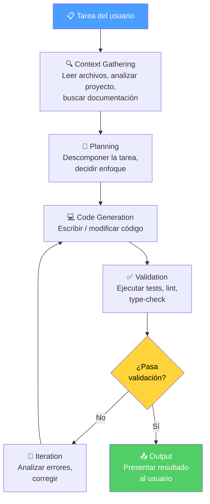
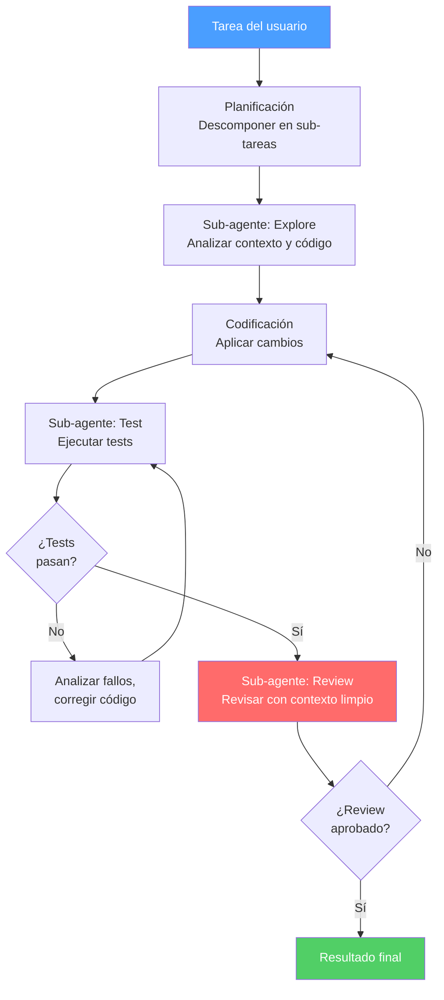
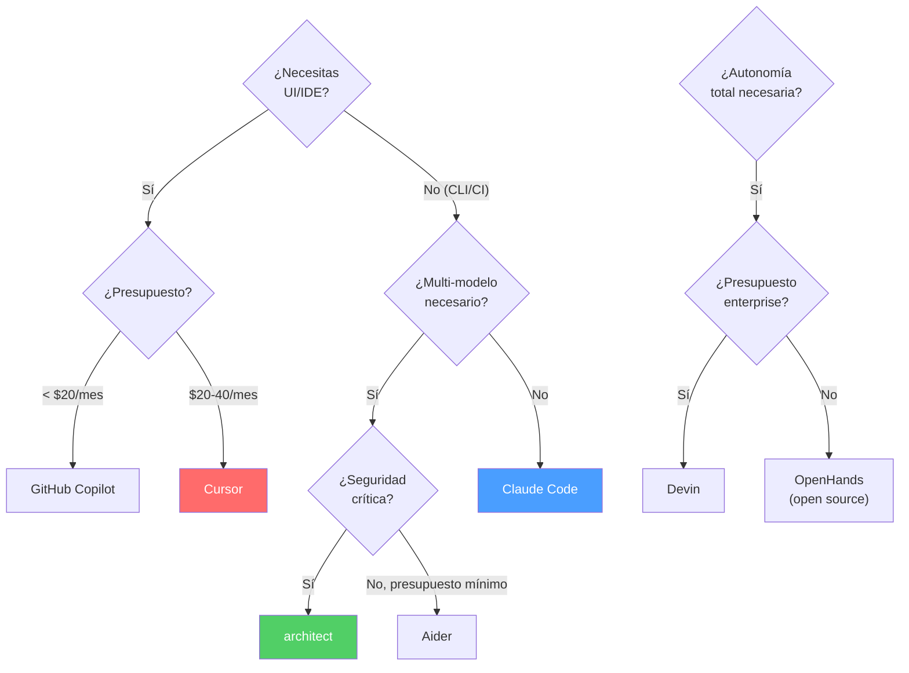

---
tags:
  - herramienta
  - agentes
  - comparativa
  - architect
aliases:
  - agentes de código
  - coding assistants
  - AI coding tools
  - asistentes de programación IA
created: 2025-06-01
updated: 2025-06-01
category: herramientas-coding
status: volatile
difficulty: intermediate
related:
  - "[[architect-overview]]"
  - "[[multi-agent-systems]]"
  - "[[autonomous-agents]]"
  - "[[agent-loop]]"
  - "[[agent-communication]]"
  - "[[vigil-overview]]"
  - "[[licit-overview]]"
  - "[[context-window]]"
up: "[[moc-agentes]]"
---

# Coding Agents: El Paisaje en 2025

> [!abstract] Resumen
> Los *coding agents* (agentes de código) han transformado el desarrollo de software de una actividad puramente manual a un ==proceso colaborativo entre humanos y agentes de IA con niveles crecientes de autonomía==. El paisaje en 2025 incluye desde asistentes de autocompletado (GitHub Copilot) hasta agentes autónomos capaces de resolver issues complejos (Devin, Claude Code, architect). Las diferencias clave son el nivel de autonomía, el acceso a herramientas (terminal, navegador, filesystem), la gestión de contexto y las capas de seguridad. *architect* se distingue por su arquitectura headless CLI, el *Ralph Loop* iterativo, ==22 capas de seguridad== y soporte multi-modelo con pipelines YAML declarativos. ^resumen

> [!warning] Última verificación: 2025-06-01
> Este paisaje cambia semanalmente. Nuevos agentes, features y precios se anuncian constantemente. Verificar datos específicos antes de tomar decisiones de adopción.

---

## Cómo funcionan los coding agents

Todos los coding agents, independientemente de su interfaz o marca, siguen un patrón fundamental:

### El loop de iteración es lo que diferencia a un agente de un modelo

Un LLM que genera código en una sola pasada (*single-shot*) no es un agente. Lo que convierte a un modelo en agente es la ==capacidad de ejecutar su propio código, observar el resultado, y corregir==. Este loop de observación-acción-corrección es el [[agent-loop|agent loop]] fundamental.

---

## El paisaje de coding agents (2025)

### Tier 1: Agentes IDE (integrados en el editor)

| Herramienta | Tipo | Modelo(s) | Autonomía | Precio (2025) | Open Source |
|---|---|---|---|---|---|
| **Cursor** | IDE completo (fork VS Code) | Claude, GPT, custom | Media-Alta | $20-40/mes | No |
| **Windsurf** (Codeium) | IDE completo | Claude, GPT, propio | Media | $15-40/mes | No |
| **GitHub Copilot** | Extensión VS Code + agent mode | GPT-4.1, Claude | Media | $10-39/mes | No |
| **Continue** | Extensión VS Code | ==Cualquier modelo== | Baja-Media | Gratis | ==Sí (Apache 2.0)== |

### Tier 2: Agentes CLI / headless

| Herramienta | Tipo | Modelo(s) | Autonomía | Precio (2025) | Open Source |
|---|---|---|---|---|---|
| **Claude Code** | CLI oficial Anthropic | Claude | ==Alta== | API pricing | No (uso libre) |
| **architect** | CLI headless, multi-agente | ==Cualquier modelo== | Alta | API pricing | Propietario |
| **Aider** | CLI ligero | Cualquier modelo | Media | Gratis + API | ==Sí (Apache 2.0)== |
| **Codex** (OpenAI) | CLI + sandbox | GPT / o-series | Alta | API pricing | Sí (Apache 2.0) |

### Tier 3: Agentes autónomos / plataformas

| Herramienta | Tipo | Modelo(s) | Autonomía | Precio (2025) | Open Source |
|---|---|---|---|---|---|
| **Devin** (Cognition) | Plataforma autónoma | Propio + terceros | ==Muy alta== | $500/mes | No |
| **SWE-agent** | Framework investigación | Cualquier modelo | Alta | Gratis + API | Sí |
| **OpenHands** (ex-OpenDevin) | Plataforma autónoma | Cualquier modelo | Alta | Gratis + API | ==Sí== |

---

## Diferenciadores clave

### Nivel de autonomía

La autonomía varía enormemente entre herramientas. Ver [[autonomous-agents]] para un análisis detallado de los niveles de autonomía.

| Nivel | Descripción | Herramientas |
|---|---|---|
| **L1: Autocompletado** | Sugiere la siguiente línea/bloque | Copilot (modo básico), Continue |
| **L2: Instrucción** | Ejecuta una instrucción específica con supervisión | Cursor, Windsurf |
| **L3: Tarea** | Completa una tarea multi-paso con iteración | Claude Code, Aider, architect |
| **L4: Proyecto** | Gestiona un proyecto completo con mínima supervisión | Devin, architect (modo yolo) |

### Acceso a herramientas

> [!danger] El acceso a herramientas es la mayor superficie de ataque
> Cada herramienta a la que un coding agent tiene acceso es un vector potencial de daño. [[vigil-overview|Vigil]] evalúa la seguridad de herramientas con reglas como AUTH-005 (CORS) y SEC-001 (secrets). El principio de menor privilegio es crítico.

| Herramienta | Terminal | Filesystem | Navegador | Git | MCP | Sandbox |
|---|---|---|---|---|---|---|
| Cursor | Sí | Sí | No | Sí | ==Sí== | No |
| GitHub Copilot | Sí | Sí | No | Sí | Sí | Parcial |
| Claude Code | ==Sí== | ==Sí== | No | Sí | Sí | No |
| architect | ==Sí== | ==Sí== | No | ==Sí (worktrees)== | ==Sí== | ==Sí (worktrees)== |
| Devin | Sí | Sí | ==Sí== | Sí | No | ==Sí (VM)== |
| Aider | Sí | Sí | No | Sí | No | No |
| Codex | Sí | Sí | No | Sí | No | ==Sí (sandbox)== |

### Gestión de contexto

La forma en que cada agente gestiona la [[context-window|ventana de contexto]] determina la calidad del trabajo en proyectos grandes. Ver [[memoria-agentes]] para la taxonomía de memoria.

| Herramienta | Estrategia de contexto | Contexto máximo efectivo |
|---|---|---|
| Cursor | Indexación de proyecto + RAG + context pinning | Proyecto completo (indexado) |
| GitHub Copilot | Archivos abiertos + workspace indexing | Workspace activo |
| Claude Code | Exploración activa + herramientas de búsqueda | ==Hasta 1M tokens por sesión== |
| architect | `memory.md` + skills + exploración por sub-agentes | Proyecto completo (vía sub-agentes) |
| Devin | Planificación + exploración autónoma | Proyecto completo (VM persistente) |
| Aider | Map de repositorio + archivos en chat | Configurable, típico 32K-128K |

---

## Benchmarks

### SWE-bench

*SWE-bench*[^1] es el benchmark de referencia para evaluar coding agents. Consiste en 2,294 issues reales de repositorios open-source de Python, con tests que verifican la solución.

| Agente / Modelo | SWE-bench Verified (%) | Fecha | Notas |
|---|---|---|---|
| Claude Opus 4 (agentless) | ~25% | 2025-05 | Solo modelo, sin herramientas |
| Claude Code | ~55% | 2025-05 | Con herramientas completas |
| Devin | ~48% | 2025-03 | Ejecución autónoma completa |
| OpenHands | ==~53%== | 2025-04 | Open source, resultado notable |
| Codex (OpenAI) | ~50% | 2025-05 | Con sandbox |
| architect | No publicado | — | No participa en SWE-bench público |

> [!question] Debate abierto: ¿SWE-bench es suficiente?
> - **A favor**: Es el benchmark más realista con issues reales de proyectos reales
> - **En contra**: Solo cubre Python, solo cubre bug fixes (no features nuevas), y la "solución" se valida solo con tests existentes — un agente podría pasar los tests sin realmente resolver el problema correctamente
> - **Mi valoración**: SWE-bench es necesario pero insuficiente. Evalúa la capacidad de resolver issues aislados, pero no captura la calidad de código, la seguridad, la comunicación con el desarrollador, ni la capacidad de trabajar en codebases grandes y complejas en lenguajes diversos

### HumanEval y más allá

| Benchmark | Qué evalúa | Limitaciones |
|---|---|---|
| **HumanEval** | Generación de funciones individuales | Demasiado simple para agentes |
| **SWE-bench** | Resolución de issues reales | Solo Python, solo bug fixes |
| **Polyglot Bench** | Generación de código multi-lenguaje | No evalúa iteración |
| **MBPP** | Problemas básicos de programación | Trivial para modelos actuales |
| **CrossCodeEval** | Código que requiere entender múltiples archivos | Más realista pero menor adopción |

---

## La posición de architect

*architect* ocupa un nicho único en el paisaje de coding agents. No busca ser el agente más autónomo ni el más fácil de usar, sino el ==más seguro, controlable y adaptable para equipos de desarrollo profesionales==.

### Características distintivas

| Feature | Descripción | Ventaja |
|---|---|---|
| **Headless CLI** | Sin interfaz gráfica, solo línea de comandos | ==Integrable en CI/CD, scripts, pipelines== |
| **Ralph Loop** | Loop iterativo de planificación → ejecución → verificación | Convergencia más fiable que single-shot |
| **22 capas de seguridad** | Desde validación de input hasta auto-review | Reducción significativa de riesgos |
| **Multi-modelo** | Soporta cualquier LLM vía LiteLLM | No vendor lock-in, optimización coste/calidad |
| **YAML Pipelines** | Flujos de trabajo declarativos en archivos YAML | Reproducibles, versionables, auditables |
| **Sub-agentes** | explore, test, review con contexto aislado | Verificación cruzada automática |
| **Worktrees** | Ejecución paralela en git worktrees | Sin conflictos, rollback limpio |
| **Memoria procedimental** | `.architect/memory.md` + skills system | ==Mejora con cada uso== |

### El Ralph Loop en detalle

> [!tip] Lo que hace único al Ralph Loop
> La clave del Ralph Loop no es la iteración (todos los agentes iteran), sino que ==la revisión se hace con un sub-agente con contexto limpio==. El revisor no ha visto los intentos fallidos, las decisiones descartadas, ni el razonamiento del codificador. Esto elimina el sesgo de confirmación y produce revisiones genuinamente objetivas.

### Integración con el ecosistema de seguridad

> [!warning] Las 22 capas de seguridad
> Las capas de seguridad de *architect* no son un número de marketing sino controles concretos que incluyen:
> - Validación de herramientas (qué puede ejecutar y qué no)
> - Sandbox de ejecución (worktrees aislados)
> - Confirmación de operaciones sensibles (configurable)
> - Auto-review con contexto limpio
> - Integración con [[vigil-overview|vigil]] para análisis de seguridad post-generación
> - Integración con [[licit-overview|licit]] para verificación de proveniencia

---

## El fenómeno "vibe coding"

El término *vibe coding*, acuñado por Andrej Karpathy[^2], describe la práctica de escribir código dando instrucciones en lenguaje natural al agente y aceptando el resultado sin entender completamente lo que hace. ==Es programar por "vibra" en lugar de por comprensión==.

> [!danger] Riesgos del vibe coding
> - **Deuda técnica oculta**: El código funciona pero nadie entiende por qué ni cómo
> - **Vulnerabilidades de seguridad**: El agente puede generar código inseguro que pasa los tests
> - **Dependencias fantasma**: [[vigil-overview|Vigil]] detecta dependencias alucinadas (regla DEP-001) que el vibe coder nunca cuestionaría
> - **Test theater**: Vigil también detecta tests que parecen pasar pero no testean nada real (regla TEST-001)
> - **Incapacidad de mantener**: Cuando algo falla, nadie puede debuggear código que nadie entiende

> [!success] Cuándo el vibe coding es aceptable
> - Prototipos y PoCs que se descartarán
> - Scripts personales de un solo uso
> - Exploración de tecnologías nuevas (aprender haciendo)
> - Generación de boilerplate estándar (configuración, setup)

> [!failure] Cuándo el vibe coding es peligroso
> - ==Código de producción== que necesita mantenerse
> - Sistemas con requisitos de seguridad o compliance
> - Infraestructura como código (Terraform, Kubernetes)
> - Cualquier código que maneje datos sensibles o financieros

---

## Tabla comparativa detallada

> [!warning] Última verificación: 2025-06-01
> Precios y features cambian frecuentemente.

| Criterio | Cursor | Copilot | Claude Code | architect | Devin | Aider |
|---|---|---|---|---|---|---|
| **Tipo** | IDE | Extensión | CLI | CLI headless | Plataforma | CLI |
| **Autonomía máxima** | L3 | L2-L3 | ==L4== | ==L4== | ==L4== | L3 |
| **Multi-modelo** | Sí | Limitado | No (Claude) | ==Sí (cualquier)== | Parcial | ==Sí (cualquier)== |
| **Seguridad** | Básica | Básica | Media | ==22 capas== | Media | Mínima |
| **Multi-agente** | No | No | No | ==Sí (3 sub-agentes)== | Interno | No |
| **MCP** | Sí | Sí | Sí | ==Sí (client)== | No | No |
| **CI/CD** | No | GitHub Actions | Parcial | ==Sí (headless)== | Sí (API) | Parcial |
| **Memoria persistente** | Proyecto-level | Limitada | Proyecto-level | ==memory.md + skills== | Sesión | Repo map |
| **Precio base** | $20/mes | $10/mes | API costs | API costs | $500/mes | Gratis |
| **Open Source** | No | No | No | No | No | ==Sí== |
| **Worktrees** | No | No | No | ==Sí== | N/A (VM) | Sí |

---

## Árbol de decisión

---

## Mi recomendación

> [!tip] Mi recomendación
> - **Para desarrolladores individuales**: **Claude Code** o **Cursor** según prefieras CLI o IDE. Ambos ofrecen el mejor balance entre capacidad y coste
> - **Para equipos con requisitos de seguridad**: **architect** por sus 22 capas de seguridad, integración con [[vigil-overview|vigil]] y [[licit-overview|licit]], y capacidad de ejecutar en CI/CD
> - **Para exploración y prototipos**: **Aider** (gratis, open source, multi-modelo) es imbatible en relación coste/capacidad
> - **Para autonomía enterprise**: **Devin** si el presupuesto lo permite; **OpenHands** si necesitas open source
> - **Evitar**: Elegir un agente solo por el hype. ==El mejor agente es el que se integra en tu workflow existente sin crear fricción==

---

## Estado del arte y tendencias (2025-2026)

1. **Convergencia IDE + CLI**: Los agentes IDE están añadiendo modos CLI/headless, y los agentes CLI están añadiendo interfaces gráficas. La distinción se difuminará.

2. **Multi-agente como estándar**: Cada vez más herramientas adoptan internamente patrones [[multi-agent-systems|multi-agente]], incluso si no lo exponen al usuario.

3. **Seguridad como diferenciador**: A medida que la autonomía aumenta, la seguridad se convierte en el diferenciador principal. Las [[autonomous-agents#safety-nets|safety nets]] pasarán de ser opcionales a obligatorias.

4. **Estándares de interoperabilidad**: [[agent-communication#MCP|MCP]] está emergiendo como el estándar de extensibilidad, permitiendo que herramientas de terceros se integren con cualquier coding agent.

5. **Evaluación estandarizada**: Más allá de SWE-bench, se necesitan benchmarks que evalúen seguridad, calidad de código, y capacidad de trabajo en equipo con humanos[^3].

---

## Relación con el ecosistema

> [!info] Conexiones con mis herramientas
> - **[[intake-overview|intake]]**: *intake* es el "frontend" que genera especificaciones que los coding agents consumen. Un flujo típico es: intake genera spec → architect implementa spec → vigil escanea el resultado. La integración vía MCP (9 herramientas + 6 recursos) permite que cualquier coding agent use intake
> - **[[architect-overview|architect]]**: ==*architect* es el coding agent del ecosistema propio==. Su enfoque en seguridad (22 capas), multi-agente (sub-agentes con aislamiento), y control (YAML pipelines, modos de confirmación) lo posiciona para desarrollo profesional donde la seguridad y la auditabilidad son prioritarias
> - **[[vigil-overview|vigil]]**: Vigil es el compañero obligatorio de cualquier coding agent. Sus 26 reglas detectan los problemas más comunes del código generado por IA: dependencias alucinadas (DEP-001), secrets hardcodeados (SEC-001), test theater (TEST-001), y configuración CORS insegura (AUTH-005). ==Todo código generado por un agente debería pasar por vigil antes de mergearse==
> - **[[licit-overview|licit]]**: Con coding agents generando código, la pregunta de proveniencia se vuelve crítica. ¿El agente generó este código original o lo copió de su entrenamiento? Las 6 heurísticas de licit (patrones de autor, co-autores, cambios masivos, patrones de mensaje) son esenciales para compliance en entornos regulados

---

## Enlaces y referencias

**Notas relacionadas:**
- [[architect-overview]] — Deep dive en el coding agent del ecosistema propio
- [[autonomous-agents]] — Niveles de autonomía y safety nets
- [[multi-agent-systems]] — Patrones multi-agente usados internamente por coding agents
- [[agent-communication]] — MCP como estándar de extensibilidad para coding agents
- [[memoria-agentes]] — Cómo los coding agents gestionan contexto y memoria
- [[vigil-overview]] — Escaneo de seguridad obligatorio para código generado por IA
- [[licit-overview]] — Proveniencia y compliance para código generado
- [[agent-loop]] — El loop fundamental que ejecutan todos los coding agents

> [!quote]- Referencias bibliográficas
> - Jimenez et al., "SWE-bench: Can Language Models Resolve Real-World GitHub Issues?", 2023
> - Anthropic, "Claude Code: An agentic coding tool", 2025
> - OpenAI, "Codex: A cloud-based software engineering agent", 2025
> - Cognition, "Devin: The AI Software Engineer", 2024
> - Gauthier, "Aider: AI pair programming in your terminal", 2023-2025
> - Karpathy, "Vibe coding" (tweet / blog), 2025

[^1]: Jimenez et al., "SWE-bench: Can Language Models Resolve Real-World GitHub Issues?", arXiv:2310.06770, 2023. Benchmark estándar de facto para evaluar coding agents en resolución de issues reales.
[^2]: Andrej Karpathy popularizó el término "vibe coding" en febrero de 2025, describiéndolo como una nueva forma de programar donde el desarrollador describe lo que quiere y el agente genera el código, sin que el desarrollador necesariamente entienda cada línea.
[^3]: La falta de benchmarks de seguridad para coding agents es un gap significativo. SWE-bench evalúa si el agente resuelve el issue, pero no si la solución introduce vulnerabilidades nuevas.
