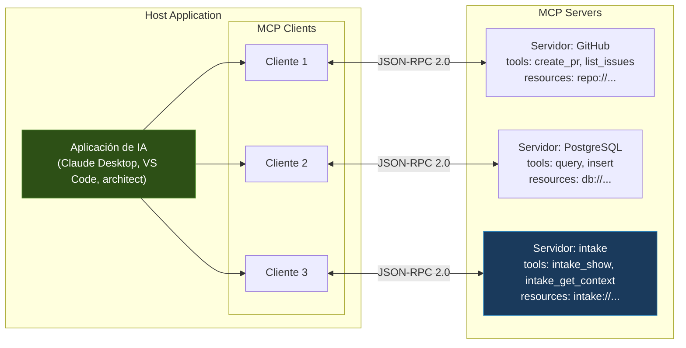
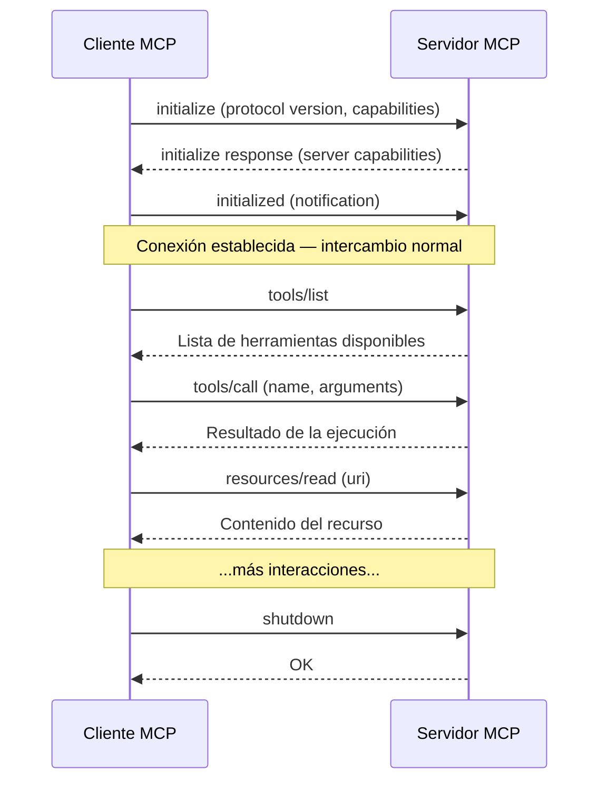
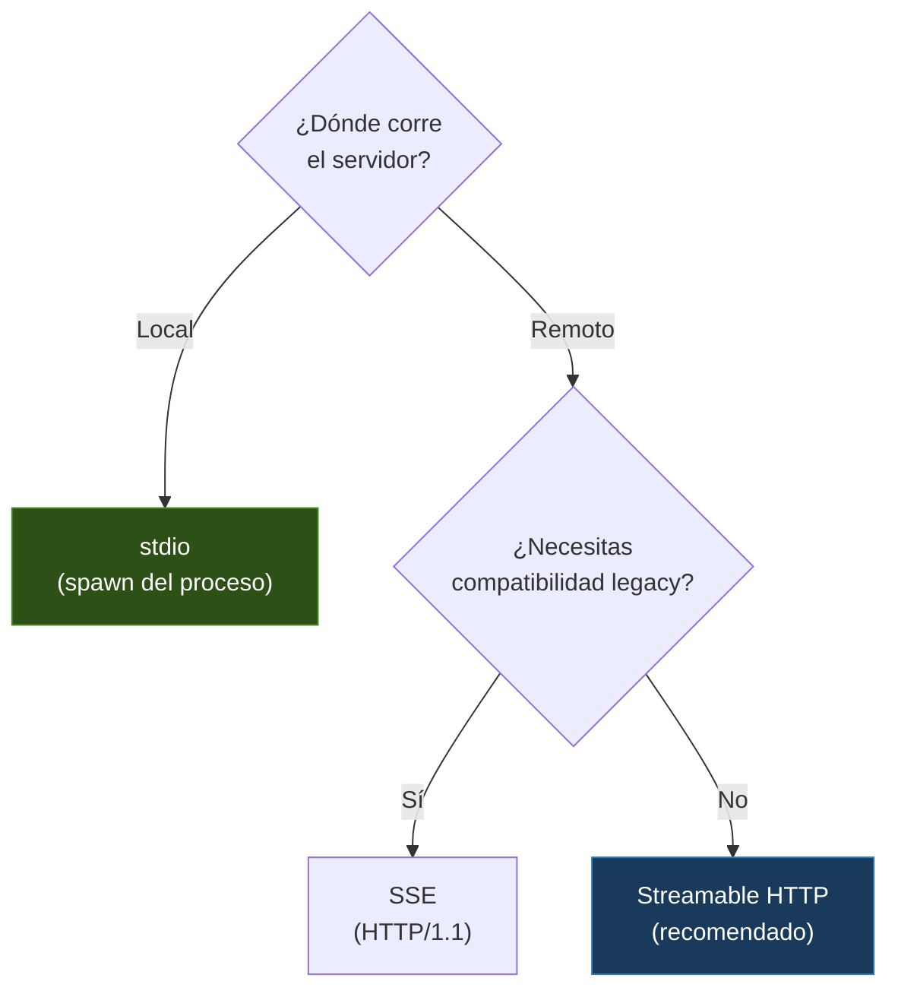
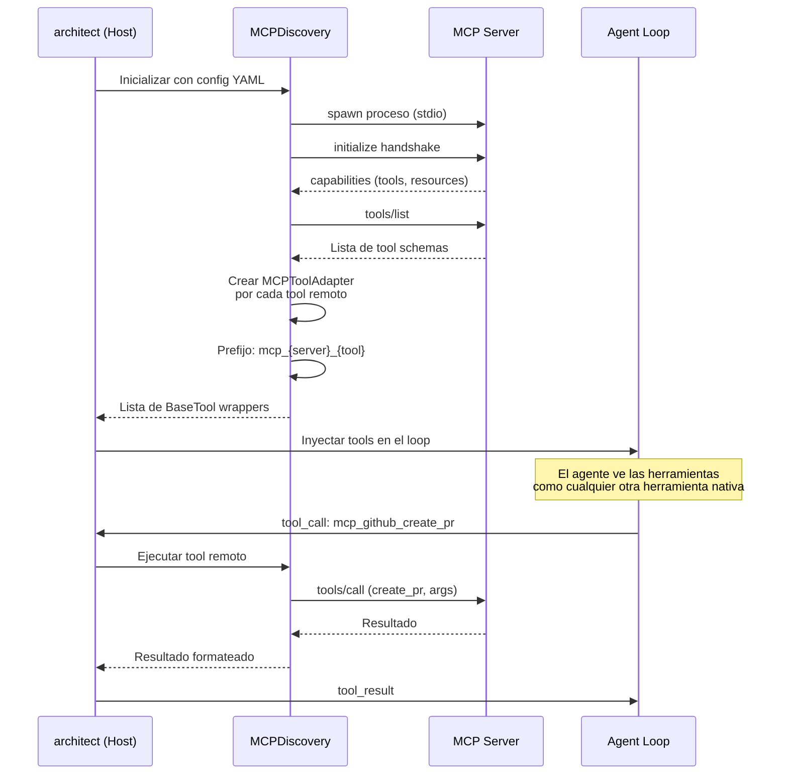
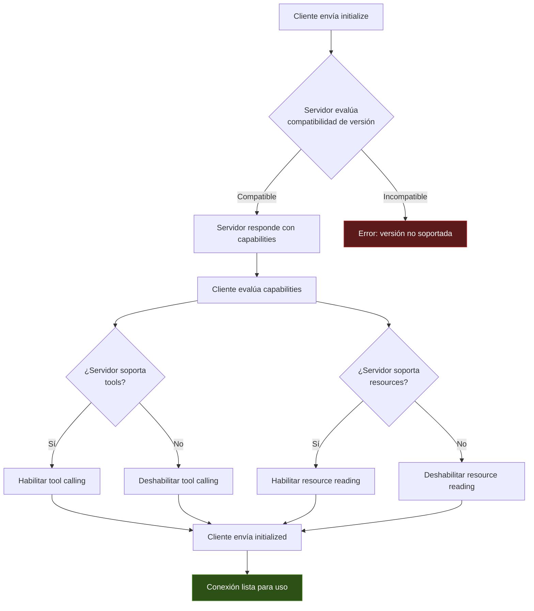

---
tags:
  - concepto
  - agentes
  - protocolos-agentes
  - mcp
aliases:
  - Model Context Protocol
  - MCP
  - protocolo MCP
  - Anthropic MCP
created: 2025-06-01
updated: 2025-06-01
category: agent-protocols
status: current
difficulty: advanced
related:
  - "[[a2a-protocol]]"
  - "[[agent-tools]]"
  - "[[agent-loop]]"
  - "[[architect-overview]]"
  - "[[intake-overview]]"
  - "[[agent-frameworks-comparison]]"
  - "[[llm-api-design]]"
  - "[[structured-generation]]"
up: "[[moc-agentes]]"
---

# Model Context Protocol (MCP)

> [!abstract] Resumen
> El *Model Context Protocol* (MCP) es un protocolo abierto creado por Anthropic que estandariza la comunicación entre aplicaciones de IA (clientes) y fuentes de datos/herramientas externas (servidores). ==MCP es al contexto de IA lo que USB fue a los periféricos: una interfaz universal que elimina la necesidad de integraciones punto a punto==. El protocolo define tres primitivas fundamentales — *Tools* (acciones), *Resources* (datos), y *Prompts* (plantillas) — y soporta múltiples transportes (stdio, SSE, *Streamable HTTP*). En la práctica, [[architect-overview|architect]] consume servidores MCP para extender sus herramientas, mientras que [[intake-overview|intake]] ==expone un servidor MCP completo con 9 tools, 6 resources y 2 prompts==. ^resumen

## Qué es y por qué importa

El **Model Context Protocol** (*MCP*) es una especificación de protocolo abierto publicada por Anthropic en noviembre de 2024. Su objetivo es resolver un problema fundamental en el ecosistema de agentes de IA: ==cada aplicación de IA necesita conectarse a docenas de fuentes de datos y herramientas, y sin un estándar, cada conexión requiere una integración custom==.

Antes de MCP, el paisaje era caótico:

- Cada [[agent-frameworks-comparison|framework]] implementaba su propio sistema de herramientas
- Cada proveedor de herramientas necesitaba N integraciones para N clientes
- No había descubrimiento dinámico de capacidades
- La seguridad era ad-hoc

> [!tip] La analogía USB
> - **Sin MCP**: Cada dispositivo necesita un cable propietario → N dispositivos × M computadoras = N×M cables
> - **Con MCP**: Un estándar universal → N dispositivos + M computadoras = N+M adaptadores
> - Ver [[agent-tools]] para entender las herramientas que MCP estandariza

---

## Arquitectura del protocolo

MCP sigue una arquitectura **cliente-servidor** con roles claros:



### Roles

| Componente | Rol | Ejemplo |
|---|---|---|
| **Host** | Aplicación que orquesta todo | Claude Desktop, [[architect-overview\|architect]], IDE |
| **Client** | Mantiene conexión 1:1 con un servidor | Instancia del SDK de MCP |
| **Server** | Expone capacidades (tools, resources, prompts) | Servidor de GitHub, [[intake-overview\|intake]] |

### Ciclo de vida de la conexión



---

## Las tres primitivas

MCP define exactamente tres tipos de capacidades que un servidor puede exponer:

### 1. Tools (herramientas) — Acciones que el modelo puede ejecutar

Los *tools* son funciones que el LLM puede invocar. Representan acciones con efectos secundarios: crear un archivo, enviar un email, ejecutar una query.

> [!warning] Seguridad de Tools
> Los tools son la primitiva más peligrosa porque ejecutan acciones. El protocolo recomienda que el host implemente *human-in-the-loop* para tools destructivos. Ver `confirm_mode` en [[agent-identity]].

Cada tool se describe con un JSON Schema que define sus parámetros:

> [!example]- Ejemplo: definición de un tool MCP
> ```json
> {
>   "name": "create_github_issue",
>   "description": "Crea un nuevo issue en un repositorio de GitHub",
>   "inputSchema": {
>     "type": "object",
>     "properties": {
>       "repo": {
>         "type": "string",
>         "description": "Owner/repo, e.g., 'anthropics/mcp'"
>       },
>       "title": {
>         "type": "string",
>         "description": "Título del issue"
>       },
>       "body": {
>         "type": "string",
>         "description": "Cuerpo del issue en Markdown"
>       },
>       "labels": {
>         "type": "array",
>         "items": {"type": "string"},
>         "description": "Labels a asignar"
>       }
>     },
>     "required": ["repo", "title"]
>   }
> }
> ```

### 2. Resources (recursos) — Datos que el modelo puede leer

Los *resources* exponen datos mediante URIs. A diferencia de los tools, los resources son de solo lectura y no tienen efectos secundarios. Son ideales para proporcionar contexto al modelo.

Cada resource tiene una URI única que sigue un esquema definido por el servidor:

```
github://repos/anthropics/mcp/README.md
db://mydb/users/schema
intake://specs/auth-module/tasks
```

> [!info] Resources vs Tools para leer datos
> - **Resource**: El host/aplicación decide cuándo inyectar el recurso en el contexto del modelo. El modelo no lo solicita explícitamente
> - **Tool**: El modelo decide cuándo invocar la herramienta para obtener datos
> - Regla práctica: si el dato es contexto necesario → resource. Si el dato se obtiene bajo demanda → tool

### 3. Prompts (plantillas) — Plantillas de interacción reutilizables

Los *prompts* son plantillas parametrizadas que definen flujos de interacción comunes. Son la primitiva menos utilizada pero potencialmente la más poderosa para estandarizar patrones de uso.

> [!example]- Ejemplo: prompt MCP para revisión de código
> ```json
> {
>   "name": "review_code",
>   "description": "Revisa código buscando bugs, seguridad y estilo",
>   "arguments": [
>     {
>       "name": "file_path",
>       "description": "Ruta al archivo a revisar",
>       "required": true
>     },
>     {
>       "name": "focus",
>       "description": "Área de enfoque: security, performance, style",
>       "required": false
>     }
>   ]
> }
> ```

---

## Transportes

MCP es agnóstico al transporte. La especificación define tres mecanismos:

| Transporte | Cuándo usar | Ventajas | Desventajas |
|---|---|---|---|
| **stdio** | Servidor local como proceso hijo | Simple, sin red, baja latencia | ==Solo local==, no escalable |
| **SSE** (*Server-Sent Events*) | Servidor remoto (legacy) | Compatible con HTTP/1.1, atraviesa firewalls | Unidireccional (server→client), requiere POST separado para client→server |
| **Streamable HTTP** | ==Servidor remoto (recomendado)== | Bidireccional, eficiente, estándar | Más nuevo, menos implementaciones |



### stdio en detalle

El transporte *stdio* es el más utilizado en la práctica. El host lanza el servidor MCP como proceso hijo y se comunica mediante stdin/stdout:

```bash
# El host lanza el servidor así:
npx -y @modelcontextprotocol/server-github

# La comunicación fluye:
# Host → stdin del proceso → Servidor MCP
# Servidor MCP → stdout del proceso → Host
# Los logs del servidor van a stderr (no interfieren)
```

---

## Cómo architect usa MCP

[[architect-overview|architect]] actúa como **cliente MCP**, consumiendo servidores externos para extender sus capacidades sin modificar su código.

### Configuración en YAML

Los servidores MCP se configuran en el archivo de proyecto:

> [!example]- Configuración MCP en architect
> ```yaml
> # .architect/config.yaml
> mcp_servers:
>   github:
>     command: "npx"
>     args: ["-y", "@modelcontextprotocol/server-github"]
>     env:
>       GITHUB_TOKEN: "${GITHUB_TOKEN}"
>
>   postgres:
>     command: "npx"
>     args: ["-y", "@modelcontextprotocol/server-postgres"]
>     env:
>       DATABASE_URL: "${DATABASE_URL}"
>
>   intake:
>     command: "python"
>     args: ["-m", "intake", "mcp", "serve"]
>     env:
>       INTAKE_SPEC: "./specs/my-project.yaml"
> ```

### Flujo de descubrimiento e inyección

El proceso mediante el cual architect integra herramientas MCP es completamente automático:



### El patrón MCPToolAdapter

`MCPToolAdapter` es el componente que envuelve cada herramienta remota MCP como una instancia de `BaseTool`, la interfaz interna de herramientas de architect:

> [!example]- Pseudocódigo de MCPToolAdapter
> ```python
> class MCPToolAdapter(BaseTool):
>     """Wraps a remote MCP tool as a local BaseTool."""
>
>     def __init__(self, server_name: str, tool_schema: dict, client: MCPClient):
>         self.name = f"mcp_{server_name}_{tool_schema['name']}"
>         self.description = tool_schema["description"]
>         self.input_schema = tool_schema["inputSchema"]
>         self._client = client
>         self._remote_name = tool_schema["name"]
>
>     def execute(self, arguments: dict) -> str:
>         result = self._client.call_tool(self._remote_name, arguments)
>         return self._format_result(result)
> ```

### Prefijado de herramientas

El convenio de nombres `mcp_{server}_{tool}` es crucial para:

- **Evitar colisiones**: Dos servidores podrían exponer una herramienta `search` — el prefijo las diferencia
- **Trazabilidad**: En los logs, es inmediato identificar qué servidor ejecutó qué
- **Control de acceso**: Se pueden filtrar herramientas por prefijo de servidor

### Seguridad

> [!danger] Consideraciones de seguridad en MCP
> - **Bearer token**: Para servidores remotos (SSE, Streamable HTTP), architect soporta autenticación via bearer token en headers
> - **Session ID**: Cada conexión MCP tiene un ID de sesión único para aislar estado
> - **Variables de entorno**: Los tokens y credenciales se pasan via variables de entorno, nunca hardcodeados
> - **Sandboxing**: Los servidores MCP corren como procesos separados — un crash del servidor no afecta a architect
> - **Validación de schema**: architect valida los argumentos contra el JSON Schema del tool antes de enviarlos

---

## Cómo intake expone un servidor MCP

[[intake-overview|intake]] implementa el lado opuesto: actúa como **servidor MCP**, exponiendo sus capacidades para que cualquier cliente MCP pueda consumirlas.

### Tools expuestos (9 herramientas)

| Tool | Descripción | Parámetros clave |
|---|---|---|
| `intake_show` | Muestra la especificación completa | `format: yaml\|json` |
| `intake_get_context` | Obtiene el contexto para una tarea | `task_id` |
| `intake_list_tasks` | Lista todas las tareas pendientes | `status: pending\|done\|all` |
| `intake_next_task` | Obtiene la siguiente tarea a implementar | — |
| `intake_mark_done` | Marca una tarea como completada | `task_id, evidence` |
| `intake_validate` | Valida la especificación | — |
| `intake_expand` | Expande una tarea en sub-tareas | `task_id` |
| `intake_search` | Busca en la especificación | `query` |
| `intake_status` | Muestra estado general del proyecto | — |

### Resources expuestos (6 URIs)

Los *resources* de intake siguen un esquema de URIs propio:

```
intake://specs/{name}/full          → Especificación completa
intake://specs/{name}/tasks         → Lista de tareas
intake://specs/{name}/tasks/{id}    → Detalle de una tarea
intake://specs/{name}/context/{id}  → Contexto enriquecido de una tarea
intake://specs/{name}/status        → Estado del proyecto
intake://specs/{name}/schema        → JSON Schema de la especificación
```

> [!info] Resources vs Tools en intake
> Los *resources* de intake son útiles para que el host inyecte contexto proactivamente (e.g., el estado del proyecto al inicio de cada conversación). Los *tools* son para interacción bajo demanda del modelo.

### Prompts expuestos (2 plantillas)

| Prompt | Descripción | Argumentos |
|---|---|---|
| `implement_next_task` | Guía al agente para implementar la siguiente tarea pendiente | `spec_name` |
| `verify_and_fix` | Guía al agente para verificar y corregir una implementación | `task_id, test_output` |

> [!example]- Ejemplo: el prompt implement_next_task
> ```json
> {
>   "name": "implement_next_task",
>   "description": "Genera instrucciones completas para implementar la siguiente tarea pendiente de la especificación",
>   "arguments": [
>     {
>       "name": "spec_name",
>       "description": "Nombre de la especificación intake",
>       "required": true
>     }
>   ]
> }
> ```
> Al invocar este prompt, intake genera un mensaje completo que incluye:
> - La tarea a implementar con todo su contexto
> - Los archivos relevantes a considerar
> - Los criterios de aceptación
> - Instrucciones para marcar la tarea como completada cuando termine

### Transportes soportados

intake soporta los dos transportes principales:

```bash
# Transporte stdio (para uso local con architect)
python -m intake mcp serve --transport stdio

# Transporte SSE (para uso remoto / múltiples clientes)
python -m intake mcp serve --transport sse --port 8080
```

> [!success] Beneficio clave de intake como servidor MCP
> Al exponer intake como servidor MCP, ==cualquier herramienta que hable MCP puede consumir las especificaciones de intake==: Claude Desktop, VS Code con Cline/Continue, [[architect-overview|architect]], o cualquier cliente MCP futuro. Esto desacopla intake de architect y lo hace universalmente accesible.

---

## Ecosistema de servidores MCP

El ecosistema de servidores MCP ha crecido exponencialmente desde el lanzamiento del protocolo. A mediados de 2025, existen cientos de servidores:

### Servidores oficiales (Anthropic)

| Servidor | Función |
|---|---|
| `@modelcontextprotocol/server-github` | Interacción con repos, PRs, issues |
| `@modelcontextprotocol/server-postgres` | Queries a PostgreSQL |
| `@modelcontextprotocol/server-filesystem` | Lectura/escritura de archivos locales |
| `@modelcontextprotocol/server-memory` | Almacenamiento de memoria persistente |
| `@modelcontextprotocol/server-brave-search` | Búsqueda web vía Brave |
| `@modelcontextprotocol/server-puppeteer` | Automatización de navegador |

### Servidores de la comunidad (selección)

| Servidor | Función | Estrellas |
|---|---|---|
| `mcp-server-sqlite` | Interacción con SQLite | ~2K |
| `mcp-server-slack` | Integración con Slack | ~1.5K |
| `mcp-server-notion` | Lectura/escritura en Notion | ~1K |
| `mcp-server-linear` | Gestión de issues en Linear | ~800 |
| `mcp-server-docker` | Gestión de contenedores Docker | ~600 |

> [!tip] Dónde encontrar servidores MCP
> - **Registro oficial**: https://github.com/modelcontextprotocol/servers
> - **Awesome MCP Servers**: Lista curada de la comunidad
> - **MCP Hub**: Directorio con búsqueda y categorización
> - **npm**: Buscar `@modelcontextprotocol/server-*`

---

## Especificación técnica detallada

### Formato de mensajes (JSON-RPC 2.0)

MCP usa JSON-RPC 2.0 como formato de mensaje. Cada mensaje es un objeto JSON con una estructura definida:

> [!example]- Ejemplo de intercambio JSON-RPC completo
> ```json
> // Request: listar herramientas
> {
>   "jsonrpc": "2.0",
>   "id": 1,
>   "method": "tools/list",
>   "params": {}
> }
>
> // Response
> {
>   "jsonrpc": "2.0",
>   "id": 1,
>   "result": {
>     "tools": [
>       {
>         "name": "create_issue",
>         "description": "Crea un issue en GitHub",
>         "inputSchema": {
>           "type": "object",
>           "properties": {
>             "title": {"type": "string"},
>             "body": {"type": "string"}
>           },
>           "required": ["title"]
>         }
>       }
>     ]
>   }
> }
>
> // Request: ejecutar herramienta
> {
>   "jsonrpc": "2.0",
>   "id": 2,
>   "method": "tools/call",
>   "params": {
>     "name": "create_issue",
>     "arguments": {
>       "title": "Bug: login falla con SSO",
>       "body": "Al intentar login con SSO corporativo..."
>     }
>   }
> }
>
> // Response
> {
>   "jsonrpc": "2.0",
>   "id": 2,
>   "result": {
>     "content": [
>       {
>         "type": "text",
>         "text": "Issue #42 creado exitosamente"
>       }
>     ]
>   }
> }
> ```

### Capability negotiation

Durante el *handshake* inicial, cliente y servidor intercambian sus capacidades:



### Notificaciones y actualizaciones dinámicas

MCP soporta notificaciones asíncronas. El servidor puede informar al cliente de cambios sin que el cliente pregunte:

- `notifications/tools/list_changed` — Las herramientas disponibles cambiaron
- `notifications/resources/list_changed` — Los recursos disponibles cambiaron
- `notifications/resources/updated` — Un recurso específico fue actualizado

Esto permite comportamiento dinámico: un servidor puede añadir o quitar herramientas en runtime.

---

## MCP vs APIs REST tradicionales

> [!question] ¿Por qué no usar REST directamente?
> MCP añade valor sobre REST en estos aspectos:
> - **Descubrimiento**: El cliente descubre automáticamente qué puede hacer el servidor
> - **Tipado**: Los schemas JSON definen contratos estrictos
> - **Bidireccionalidad**: Notificaciones del servidor al cliente sin polling
> - **Estándar**: Cualquier cliente MCP habla con cualquier servidor MCP
>
> Pero REST sigue siendo mejor para APIs de datos puros donde el consumidor es una aplicación, no un LLM.

---

## Relación con el ecosistema

> [!info] Conexiones con mis herramientas
> - **[[intake-overview|intake]]**: ==El caso de uso más completo en el ecosistema propio==: servidor MCP con 9 tools, 6 resources y 2 prompts. Demuestra cómo una herramienta de especificación puede exponerse universalmente
> - **[[architect-overview|architect]]**: Cliente MCP que consume servidores externos. Su `MCPDiscovery` + `MCPToolAdapter` es la implementación de referencia de cómo integrar MCP en un agente custom
> - **[[vigil-overview|vigil]]**: Candidato natural para exponer métricas de calidad como resources MCP (`vigil://reports/{project}/latest`)
> - **[[licit-overview|licit]]**: Podría exponer verificaciones de compliance como tools MCP, permitiendo que cualquier agente verifique conformidad legal

---

## Estado del arte y futuro (2025-2026)

- **Adopción masiva**: Claude Desktop, Cursor, Windsurf, Zed, Continue, y Cline soportan MCP nativamente
- **Registros de servidores**: Están emergiendo marketplaces y registros centralizados de servidores MCP
- **Complementariedad con [[a2a-protocol|A2A]]**: MCP para model-to-tool, A2A para agent-to-agent. Ver [[a2a-protocol]] para la comparación detallada
- **Autenticación estandarizada**: OAuth 2.0 como mecanismo estándar de autenticación en la especificación[^2]
- **Remote MCP**: La tendencia es hacia servidores MCP remotos desplegados como servicios cloud, no solo procesos locales

> [!quote] Cita de Anthropic sobre MCP
> "MCP is an open protocol that standardizes how applications provide context to LLMs. Think of MCP like a USB-C port for AI applications."
> — Documentación oficial de MCP, Anthropic, 2024

---

## Enlaces y referencias

**Notas relacionadas:**
- [[a2a-protocol]] — El protocolo complementario de Google para comunicación agent-to-agent
- [[agent-tools]] — Las herramientas que MCP estandariza y expone
- [[agent-loop]] — El bucle del agente donde se integran las herramientas MCP
- [[agent-identity]] — Cómo los prompts MCP pueden extender la identidad del agente
- [[agent-frameworks-comparison]] — MCP como capa de unificación entre frameworks
- [[llm-api-design]] — MCP se construye sobre las mismas APIs de modelos
- [[structured-generation]] — Los schemas JSON de MCP se alinean con la generación estructurada
- [[architect-overview]] — Implementación de referencia como cliente MCP
- [[intake-overview]] — Implementación de referencia como servidor MCP

> [!quote]- Referencias bibliográficas
> - Anthropic, "Model Context Protocol Specification", https://spec.modelcontextprotocol.io, 2024
> - Anthropic, "Introducing the Model Context Protocol", Blog, Noviembre 2024
> - MCP GitHub Organization, https://github.com/modelcontextprotocol, 2024
> - JSON-RPC 2.0 Specification, https://www.jsonrpc.org/specification
> - Código fuente de architect: módulos `MCPDiscovery` y `MCPToolAdapter`
> - Código fuente de intake: módulo `mcp_server`

[^1]: El protocolo MCP fue anunciado por Anthropic el 25 de noviembre de 2024. En menos de 6 meses, se convirtió en el estándar de facto para integración de herramientas en aplicaciones de IA.
[^2]: La especificación MCP 2025-03 introduce soporte estandarizado para OAuth 2.0, reemplazando los mecanismos ad-hoc de autenticación que cada implementación definía independientemente.
