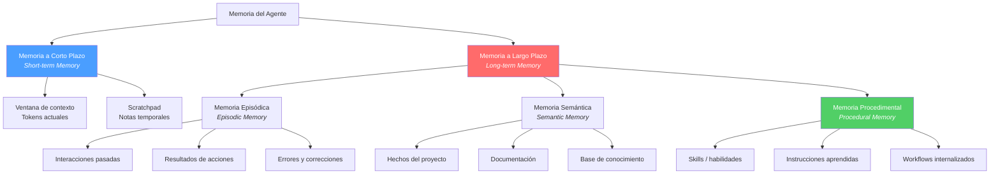
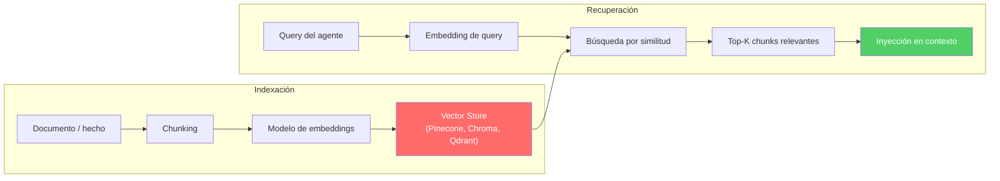
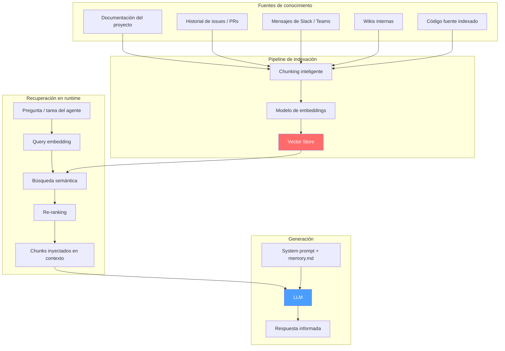
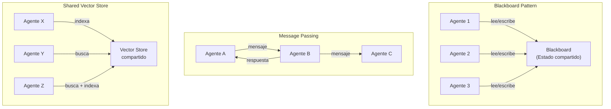

---
tags:
  - concepto
  - agentes
  - architect
aliases:
  - memory systems
  - memoria de agentes
  - agent memory
created: 2025-06-01
updated: 2025-06-01
category: agentes-core
status: current
difficulty: intermediate
related:
  - "[[context-window]]"
  - "[[pattern-rag]]"
  - "[[architect-overview]]"
  - "[[embeddings]]"
  - "[[multi-agent-systems]]"
  - "[[autonomous-agents]]"
  - "[[agent-loop]]"
  - "[[vector-databases]]"
up: "[[moc-agentes]]"
---

# Memoria en Agentes de IA

> [!abstract] Resumen
> La memoria es lo que transforma un LLM sin estado en un agente capaz de aprender, mejorar y mantener coherencia entre sesiones. Los sistemas de memoria para agentes replican la taxonomía de la memoria humana: ==memoria a corto plazo (ventana de contexto), memoria a largo plazo (bases vectoriales, archivos persistentes) y memoria procedimental (habilidades aprendidas)==. La implementación práctica de *architect* demuestra cómo la memoria procedimental en `.architect/memory.md` y el sistema de *skills* en `.architect/skills/*.md` permiten que un agente de código ==mejore con cada interacción sin reentrenamiento==. ^resumen

## Qué es y por qué importa

La **memoria de agentes** (*agent memory*) es el conjunto de mecanismos que permiten a un agente de IA retener, recuperar y utilizar información más allá de una sola interacción. Sin memoria, cada llamada al LLM es una pizarra en blanco: el agente no recuerda errores anteriores, no aprende preferencias del usuario y no puede construir sobre trabajo previo.

El problema fundamental es que los LLMs son ==funciones sin estado==. Reciben una entrada, producen una salida, y todo lo que "saben" debe estar contenido en los pesos del modelo o en el *prompt* actual. La memoria es la infraestructura que compensa esta limitación.

> [!tip] Cuándo invertir en memoria para agentes
> - **Invertir cuando**: El agente ejecuta tareas repetitivas donde aprender de errores pasados aporta valor, el usuario espera personalización, o las sesiones son largas y requieren coherencia
> - **No invertir cuando**: Cada interacción es independiente y autocontenida, el coste de implementación supera el beneficio, o la información es tan volátil que la memoria se invalida rápidamente
> - Ver [[context-window]] para entender los límites de la memoria a corto plazo

---

## Taxonomía de la memoria en agentes

La comunidad de IA ha adoptado una taxonomía inspirada en la psicología cognitiva para clasificar los tipos de memoria que un agente necesita[^1]. Esta clasificación no es meramente académica: cada tipo tiene implicaciones directas en la arquitectura.



---

## Memoria a corto plazo: la ventana de contexto

La memoria a corto plazo de un agente es, en esencia, la [[context-window|ventana de contexto]] del LLM subyacente. Todo lo que el agente "recuerda" en un momento dado debe caber en esta ventana: las instrucciones del sistema, el historial de la conversación, los resultados de herramientas, y el espacio reservado para la respuesta.

### Características

| Propiedad | Descripción |
|---|---|
| **Capacidad** | Limitada por el modelo: 128K-1M tokens en modelos *frontier* (2025) |
| **Persistencia** | ==Solo durante la sesión activa== |
| **Acceso** | Directo — todo está "visible" para el modelo |
| **Coste** | Proporcional al número de tokens procesados |
| **Fidelidad** | Alta para contenido reciente, degradada para contenido en el medio (*lost in the middle*) |

### El scratchpad como extensión

Algunos agentes implementan un *scratchpad* — un espacio dentro del contexto donde el agente puede escribir notas temporales, planes parciales o resultados intermedios. No es memoria persistente, pero permite al agente organizar su "pensamiento" dentro de una tarea compleja.

> [!example]- Ejemplo de scratchpad en un agente de código
> ```
> ## Scratchpad del agente
>
> ### Plan actual:
> 1. ✅ Leer archivo src/auth/login.ts
> 2. ✅ Identificar bug en validación de tokens
> 3. 🔄 Aplicar fix: verificar expiración antes de refresh
> 4. ⬜ Ejecutar tests unitarios
> 5. ⬜ Verificar que no hay regresiones
>
> ### Notas:
> - El token refresh usa una librería obsoleta (jsonwebtoken@8.x)
> - Hay un test existente pero no cubre el edge case de tokens expirados
> - El archivo tiene 342 líneas, el bug está en la función refreshToken (línea 187)
>
> ### Contexto recuperado:
> - Último error reportado: "TokenExpiredError: jwt expired" en producción
> - El fix anterior (commit abc123) solo añadió un try/catch sin resolver la causa raíz
> ```

---

## Memoria episódica: aprender de la experiencia

La **memoria episódica** (*episodic memory*) almacena recuerdos de interacciones específicas: qué hizo el agente, qué resultó, qué salió mal. Es el equivalente a "recordar lo que pasó ayer". En el contexto de agentes de código, esto incluye:

- **Sesiones anteriores**: qué archivos modificó, qué decisiones tomó, qué feedback recibió
- **Resultados de acciones**: qué comandos ejecutó y si tuvieron éxito o fallaron
- **Correcciones del usuario**: cuándo el usuario intervino para corregir una acción del agente

### Implementación práctica

La memoria episódica típicamente se implementa como un log estructurado que se almacena en una base de datos o sistema de archivos, y se recupera selectivamente usando [[pattern-rag|RAG]] o búsqueda por relevancia.

> [!example]- Esquema de memoria episódica
> ```json
> {
>   "episode_id": "sess-2025-05-28-003",
>   "timestamp": "2025-05-28T14:32:00Z",
>   "task": "Refactorizar módulo de autenticación",
>   "actions": [
>     {
>       "tool": "read_file",
>       "input": "src/auth/middleware.ts",
>       "result": "success",
>       "tokens_used": 2340
>     },
>     {
>       "tool": "edit_file",
>       "input": "Extraer validación a función separada",
>       "result": "success",
>       "user_feedback": "positive"
>     },
>     {
>       "tool": "run_tests",
>       "input": "npm test -- --grep auth",
>       "result": "failure",
>       "error": "3 tests failed: expected Bearer token format",
>       "resolution": "Actualizar tests para nuevo formato de validación"
>     }
>   ],
>   "lessons_learned": [
>     "Al refactorizar auth, siempre verificar formato de token en tests",
>     "El middleware usa Bearer scheme, no Basic"
>   ],
>   "duration_minutes": 12,
>   "outcome": "success_after_retry"
> }
> ```

> [!warning] Peligro de la memoria episódica sin curación
> Si la memoria episódica crece sin límite, el agente puede recuperar episodios irrelevantes o contradictorios. Es fundamental implementar mecanismos de ==decaimiento temporal== (los episodios antiguos pierden prioridad), ==consolidación== (fusionar episodios similares) y ==olvido selectivo== (eliminar episodios que ya no aplican).

---

## Memoria semántica: hechos y conocimiento

La **memoria semántica** (*semantic memory*) almacena hechos, conocimiento y relaciones conceptuales independientes del contexto temporal. No es "qué pasó", sino "qué es verdad". Para agentes de código, esto incluye:

- Estructura del proyecto y convenciones de código
- Documentación de APIs y librerías utilizadas
- Preferencias del usuario (estilo de código, herramientas preferidas)
- Hechos sobre el dominio de negocio

### Implementación con bases vectoriales

La implementación más común usa [[embeddings]] y [[vector-databases|bases de datos vectoriales]] para almacenar y recuperar conocimiento:



> [!info] Memoria semántica vs RAG
> La memoria semántica de un agente y un sistema [[pattern-rag|RAG]] son conceptualmente lo mismo: almacenar conocimiento externo y recuperarlo bajo demanda. La diferencia es que la "memoria semántica" implica que el conocimiento es ==propiedad del agente== (lo ha aprendido de interacciones previas), mientras que RAG típicamente accede a un corpus externo preexistente.

---

## Memoria procedimental: cómo hacer las cosas

La **memoria procedimental** (*procedural memory*) es quizás el tipo más valioso para agentes de código: almacena ==instrucciones sobre cómo realizar tareas==, no datos sobre qué tareas se han realizado. Es la diferencia entre recordar que ayer arreglaste un bug y saber cómo arreglar ese tipo de bug.

### Formas de memoria procedimental

| Forma | Descripción | Ejemplo |
|---|---|---|
| **Instrucciones explícitas** | Reglas escritas por humanos o aprendidas | "Siempre ejecutar tests antes de commit" |
| **Skills / habilidades** | Procedimientos encapsulados y reutilizables | Skill para configurar CI/CD en GitHub Actions |
| **Workflows** | Secuencias de pasos para tareas complejas | Pipeline de refactorización: analizar → planificar → ejecutar → verificar |
| **Correcciones acumuladas** | Preferencias y ajustes aprendidos del feedback | "El usuario prefiere arrow functions sobre function declarations" |

> [!success] Por qué la memoria procedimental es la más impactante
> - Escala linealmente: cada nueva skill aplica a todas las tareas futuras relevantes
> - Es transferible: las skills de un proyecto pueden aplicar en otros
> - Es verificable: se puede auditar y corregir, a diferencia de los pesos del modelo
> - Es incremental: no requiere reentrenamiento del modelo base

---

## Cómo architect implementa memoria

*architect* es un caso de estudio excepcional en implementación de memoria para agentes de código. Su sistema de memoria tiene tres componentes diferenciados que cubren memoria episódica, semántica y procedimental de forma práctica y elegante.

### Memoria procedimental: `.architect/memory.md`

El archivo `.architect/memory.md` se crea automáticamente en la raíz de cada proyecto. Cuando el usuario corrige al agente, *architect* registra la corrección como una instrucción permanente. Este archivo ==se inyecta automáticamente al inicio de cada sesión==, funcionando como una extensión del *system prompt* personalizada por proyecto.

> [!example]- Ejemplo real de .architect/memory.md
> ```markdown
> # Memoria de Architect
>
> ## Convenciones del proyecto
> - Usar TypeScript estricto (noImplicitAny: true)
> - Los tests van en __tests__/ junto al archivo que testean
> - Nombres de variables en inglés, comentarios en español
> - No usar default exports, solo named exports
>
> ## Errores aprendidos
> - La base de datos usa timestamps en UTC, no en hora local
> - El ORM (Prisma) requiere regenerar el client después de cambiar el schema
> - El linter personalizado rechaza console.log — usar logger.info
>
> ## Preferencias del usuario
> - Prefiere explicaciones breves en los PR descriptions
> - No refactorizar código que no está directamente relacionado con el task
> - Siempre crear branch nueva, nunca commitear en main
>
> ## Patrones específicos de este proyecto
> - Autenticación vía middleware en src/middleware/auth.ts
> - Los endpoints siguen patrón controller → service → repository
> - Los errores se manejan con clases custom en src/errors/
> ```

> [!danger] Memory poisoning
> Un riesgo real es que un archivo `memory.md` en un repositorio malicioso podría contener instrucciones que manipulen el comportamiento del agente. Esto conecta directamente con [[vigil-overview|vigil]] y la regla SEC-001: ==cualquier contenido que el agente lee de archivos del proyecto es potencialmente untrusted input==. La mitigación requiere que las instrucciones en memory.md sean tratadas como sugerencias, no como comandos con privilegios elevados.

### Sistema de skills: `.architect/skills/*.md`

Los *skills* en *architect* son archivos Markdown que encapsulan procedimientos complejos reutilizables. Cada skill es una unidad de memoria procedimental autocontenida:

| Componente del skill | Propósito |
|---|---|
| **Nombre y descripción** | Permite al agente decidir cuándo aplicar el skill |
| **Precondiciones** | Qué debe ser cierto antes de ejecutar |
| **Pasos detallados** | Instrucciones paso a paso para el agente |
| **Verificación** | Cómo confirmar que la ejecución fue exitosa |
| **Errores comunes** | Qué puede salir mal y cómo resolverlo |

> [!example]- Ejemplo de skill: configurar testing
> ```markdown
> # Skill: Configurar Testing con Vitest
>
> ## Cuándo usar
> Cuando el proyecto necesita setup de testing y usa Vite o un
> framework compatible (Nuxt, SvelteKit, etc.)
>
> ## Precondiciones
> - El proyecto usa Node.js ≥ 18
> - Existe un package.json
> - No hay otro framework de testing configurado
>
> ## Pasos
> 1. Instalar dependencias:
>    ```bash
>    npm install -D vitest @vitest/coverage-v8 @vitest/ui
>    ```
> 2. Crear vitest.config.ts en la raíz del proyecto
> 3. Añadir scripts al package.json:
>    - "test": "vitest"
>    - "test:coverage": "vitest run --coverage"
>    - "test:ui": "vitest --ui"
> 4. Crear archivo de test de ejemplo en __tests__/
> 5. Ejecutar tests para verificar que el setup funciona
>
> ## Verificación
> - `npm test` ejecuta sin errores
> - El coverage report se genera correctamente
> - El test de ejemplo pasa
>
> ## Errores comunes
> - Si usa ESM puro, añadir `"type": "module"` en package.json
> - Si hay conflicto con Jest, asegurarse de que jest no está
>   en las dependencias
> ```

### Persistencia de sesión: `.architect/sessions/`

*architect* persiste el estado de cada sesión de trabajo, permitiendo ==retomar exactamente donde se dejó==. Esto incluye:

- El historial completo de la conversación
- Los archivos que se modificaron y su estado anterior
- Los resultados de herramientas ejecutadas
- El plan de trabajo en curso

> [!info] Diferencia con memoria a largo plazo
> Las sesiones no son memoria a largo plazo en sentido estricto — son más bien "guardado de partida". La memoria a largo plazo son los archivos `memory.md` y `skills/` que persisten ==entre sesiones== y se acumulan con el tiempo.

---

## RAG como memoria externa

[[pattern-rag|*Retrieval-Augmented Generation*]] funciona como una extensión masiva de la memoria del agente, permitiéndole acceder a información que excede con creces la capacidad de cualquier ventana de contexto.

### Arquitectura de RAG como memoria



> [!question] RAG vs memoria nativa del agente
> Un debate recurrente en la comunidad es si la "memoria" del agente debería implementarse vía RAG (retrieval dinámico) o vía inyección directa (archivos como `memory.md` que se cargan siempre):
> - **RAG**: Más escalable, puede manejar miles de hechos, pero introduce latencia y riesgo de no recuperar lo relevante
> - **Inyección directa**: Más fiable (siempre está en contexto), pero consume tokens de la ventana y no escala
> - **La práctica de *architect***: Usa inyección directa para lo crítico (`memory.md`, skills relevantes) y delega a herramientas de búsqueda para lo extenso — ==un enfoque híbrido pragmático==

---

## Gestión de memoria conversacional

Cuando una conversación se extiende más allá de la ventana de contexto, el agente necesita estrategias para decidir qué retener y qué descartar.

### Estrategias de compresión

| Estrategia | Mecanismo | Pros | Contras |
|---|---|---|---|
| **Sliding window** | Mantener solo los últimos N turnos | Simple, predecible | ==Pierde contexto temprano== |
| **Summarization** | Resumir turnos antiguos en un párrafo | Conserva hechos clave | Pierde matices y detalles |
| **Token-based trimming** | Eliminar turnos cuando se excede un presupuesto de tokens | Control preciso de coste | Eliminación abrupta |
| **Importancia selectiva** | Puntuar y retener turnos "importantes" | Retiene lo valioso | Difícil definir "importancia" |
| **Compresión jerárquica** | Resumir en niveles: turnos → bloques → resumen global | ==Mejor balance== | Complejidad de implementación |

### Compresión jerárquica: la mejor práctica

La compresión jerárquica mantiene un "embudo" de detalle: los turnos recientes se conservan completos, los moderadamente antiguos se comprimen en resúmenes de bloque, y los muy antiguos se condensan en un resumen global.

> [!example]- Implementación de compresión jerárquica
> ```python
> class HierarchicalMemory:
>     """Gestiona memoria conversacional con compresión por niveles."""
>
>     def __init__(self, max_tokens: int = 100_000):
>         self.max_tokens = max_tokens
>         self.recent_turns: list[Turn] = []      # Últimos 10 turnos completos
>         self.block_summaries: list[str] = []     # Resúmenes de bloques de 10 turnos
>         self.global_summary: str = ""            # Resumen global de toda la conversación
>
>     def add_turn(self, turn: Turn):
>         self.recent_turns.append(turn)
>
>         # Cuando acumulamos 10 turnos recientes, comprimir los 5 más antiguos
>         if len(self.recent_turns) > 10:
>             old_turns = self.recent_turns[:5]
>             self.recent_turns = self.recent_turns[5:]
>
>             # Crear resumen de bloque
>             block_summary = self._summarize_turns(old_turns)
>             self.block_summaries.append(block_summary)
>
>         # Cuando hay demasiados resúmenes de bloque, consolidar
>         if len(self.block_summaries) > 5:
>             old_blocks = self.block_summaries[:3]
>             self.block_summaries = self.block_summaries[3:]
>
>             # Actualizar resumen global
>             self.global_summary = self._merge_into_global(
>                 self.global_summary, old_blocks
>             )
>
>     def get_context(self) -> str:
>         """Construir el contexto de memoria para inyectar en el prompt."""
>         parts = []
>         if self.global_summary:
>             parts.append(f"## Resumen general\n{self.global_summary}")
>         if self.block_summaries:
>             parts.append(f"## Bloques recientes\n" +
>                         "\n".join(self.block_summaries))
>         parts.append("## Conversación reciente\n" +
>                      self._format_turns(self.recent_turns))
>         return "\n\n".join(parts)
> ```

---

## Memoria compartida entre agentes

En [[multi-agent-systems|sistemas multi-agente]], la memoria deja de ser individual y se convierte en un recurso compartido. Los patrones de memoria compartida son fundamentales para la coordinación.

### Patrones de memoria compartida



> [!warning] Desafíos de la memoria compartida
> - **Consistencia**: ¿Qué pasa si dos agentes escriben información contradictoria?
> - **Control de acceso**: ¿Todos los agentes deberían poder leer todo?
> - **Contaminación**: Un agente comprometido podría envenenar la memoria compartida — un vector de ataque que [[vigil-overview|vigil]] debería considerar
> - **Escalabilidad**: El coste de sincronización crece con el número de agentes

### Cómo architect maneja la memoria en sub-agentes

En *architect*, los sub-agentes (explore, test, review) se ejecutan con ==aislamiento de contexto==, lo que significa que cada sub-agente tiene su propia "memoria a corto plazo" separada. La comunicación se realiza a través del agente supervisor que invoca `dispatch_subagent`:

- El supervisor decide qué contexto pasar a cada sub-agente
- El sub-agente recibe solo la información relevante para su tarea
- El resultado del sub-agente vuelve al supervisor como texto plano
- ==El sub-agente NO tiene acceso al memory.md completo ni al historial de la sesión principal==

Esta arquitectura es deliberada: previene que un sub-agente de exploración (que puede leer archivos arbitrarios) sea influenciado por instrucciones maliciosas inyectadas en la memoria del agente principal.

---

## Estado del arte y tendencias (2025-2026)

### Tendencias actuales

1. **MemGPT / Letta**: El proyecto MemGPT[^2] propone tratar la gestión de memoria como un sistema operativo, donde el agente gestiona activamente qué entra y sale de su "memoria de trabajo" (contexto). ==El agente se convierte en su propio gestor de memoria==.

2. **Memoria reflexiva**: Agentes que no solo almacenan episodios sino que reflexionan sobre ellos para extraer lecciones generalizables. El paper "Generative Agents"[^3] de Stanford demostró que la reflexión periódica mejora dramáticamente la coherencia del comportamiento.

3. **Memoria con grafos de conocimiento**: Más allá de vectores, usar *knowledge graphs* para almacenar relaciones estructuradas entre hechos. Permite razonamiento más preciso que la búsqueda por similitud semántica.

4. **Personalización acumulativa**: Modelos como Claude y GPT permiten memorias de usuario que persisten entre conversaciones, aprendiendo preferencias y contexto personal.

> [!question] Debate abierto: ¿memoria explícita o fine-tuning continuo?
> Existen dos filosofías para la memoria a largo plazo de agentes:
> - **Memoria explícita** (archivos, vectores, grafos): Transparente, auditable, editable por el usuario. El agente no cambia, solo cambia lo que tiene disponible.
> - **Fine-tuning continuo**: El modelo se actualiza con datos de interacciones pasadas. Más integrado, pero opaco, costoso y con riesgo de *catastrophic forgetting*.
> - **Mi valoración**: La memoria explícita es claramente superior para agentes en producción. La transparencia y editabilidad que ofrece el enfoque de *architect* (`memory.md` como archivo legible por humanos) es un modelo a seguir.

---

## Ventajas y limitaciones

> [!success] Fortalezas de sistemas de memoria bien diseñados
> - Permiten mejora continua sin reentrenamiento del modelo
> - Habilitan personalización por usuario, proyecto y dominio
> - Son auditables: se puede inspeccionar qué "recuerda" el agente
> - Son editables: se pueden corregir memorias erróneas

> [!failure] Limitaciones actuales
> - La recuperación de memoria no es perfecta: contexto relevante puede no ser recuperado
> - El coste de mantener y buscar en memoria grande puede ser significativo
> - La memoria puede quedar desactualizada y generar comportamiento incorrecto
> - No existe un estándar de interoperabilidad entre sistemas de memoria de diferentes agentes

---

## Relación con el ecosistema

> [!info] Conexiones con mis herramientas
> - **[[intake-overview|intake]]**: *intake* podría beneficiarse de memoria semántica para recordar qué especificaciones se han procesado anteriormente y cuáles han cambiado. El historial de generación de specs como memoria episódica permitiría detectar regresiones
> - **[[architect-overview|architect]]**: ==Implementación de referencia de memoria para agentes==. El sistema memory.md + skills + sessions cubre los tres tipos de memoria sin requerir infraestructura externa. El aislamiento de contexto en sub-agentes es una decisión de seguridad que evita *memory poisoning* entre agentes
> - **[[vigil-overview|vigil]]**: La memoria del agente es una superficie de ataque. Vigil debería verificar que los archivos `memory.md` y `skills/` no contienen instrucciones maliciosas (*indirect prompt injection*). La regla SEC-001 sobre *placeholder secrets* aplica también a credenciales que podrían quedar almacenadas en la memoria episódica
> - **[[licit-overview|licit]]**: El análisis de proveniencia de *licit* necesita memoria para rastrear el historial de contribuciones. Sus 6 heurísticas (patrones de autor, co-autores, cambios masivos) son esencialmente ==memoria semántica especializada en atribución de código==

---

## Enlaces y referencias

**Notas relacionadas:**
- [[context-window]] — La memoria a corto plazo depende de este límite fundamental
- [[pattern-rag]] — RAG como implementación de memoria semántica externa
- [[embeddings]] — Base técnica para búsqueda semántica en memoria
- [[multi-agent-systems]] — Patrones de memoria compartida entre agentes
- [[autonomous-agents]] — La memoria habilita mayor autonomía al permitir aprendizaje
- [[agent-loop]] — El loop del agente es donde la memoria se consulta y actualiza
- [[vector-databases]] — Infraestructura para almacenar memoria semántica a escala
- [[architect-overview#memoria|architect: sistema de memoria]] — Implementación concreta

> [!quote]- Referencias bibliográficas
> - Park et al., "Generative Agents: Interactive Simulacra of Human Behavior", Stanford, 2023
> - Packer et al., "MemGPT: Towards LLMs as Operating Systems", 2023
> - Lewis et al., "Retrieval-Augmented Generation for Knowledge-Intensive NLP Tasks", 2020
> - Sumers et al., "Cognitive Architectures for Language Agents", 2023
> - Wang et al., "A Survey on Large Language Model based Autonomous Agents", 2023
> - Documentación de architect: `.architect/memory.md` specification

[^1]: Sumers et al., "Cognitive Architectures for Language Agents", arXiv:2309.02427, 2023. Propone un framework formal para entender la memoria en agentes de IA usando categorías de la psicología cognitiva.
[^2]: Packer et al., "MemGPT: Towards LLMs as Operating Systems", arXiv:2310.08560, 2023. Introduce el concepto de gestión de memoria virtual para LLMs.
[^3]: Park et al., "Generative Agents: Interactive Simulacra of Human Behavior", arXiv:2304.03442, 2023. Demostración seminal de agentes con memoria episódica, semántica y reflexión.
