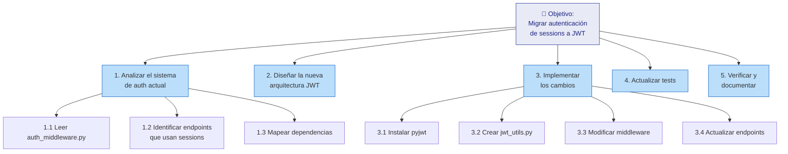
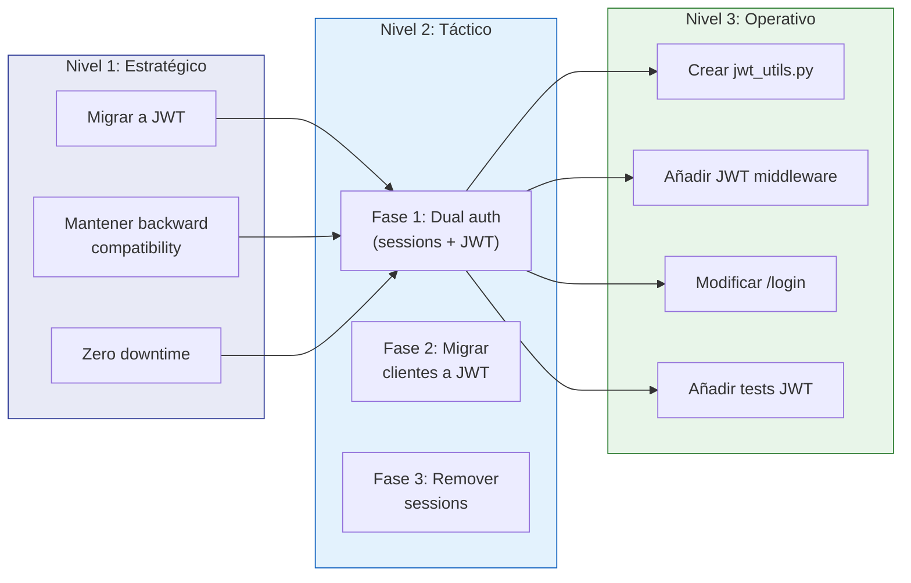
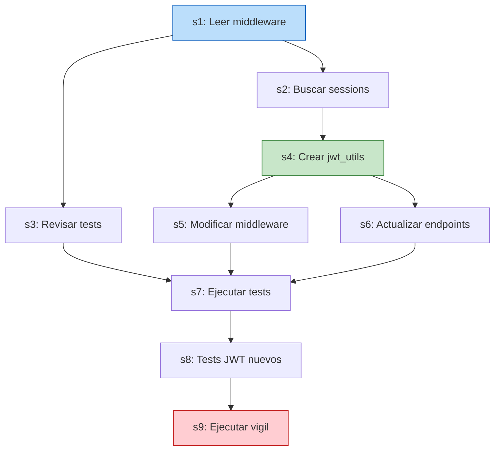
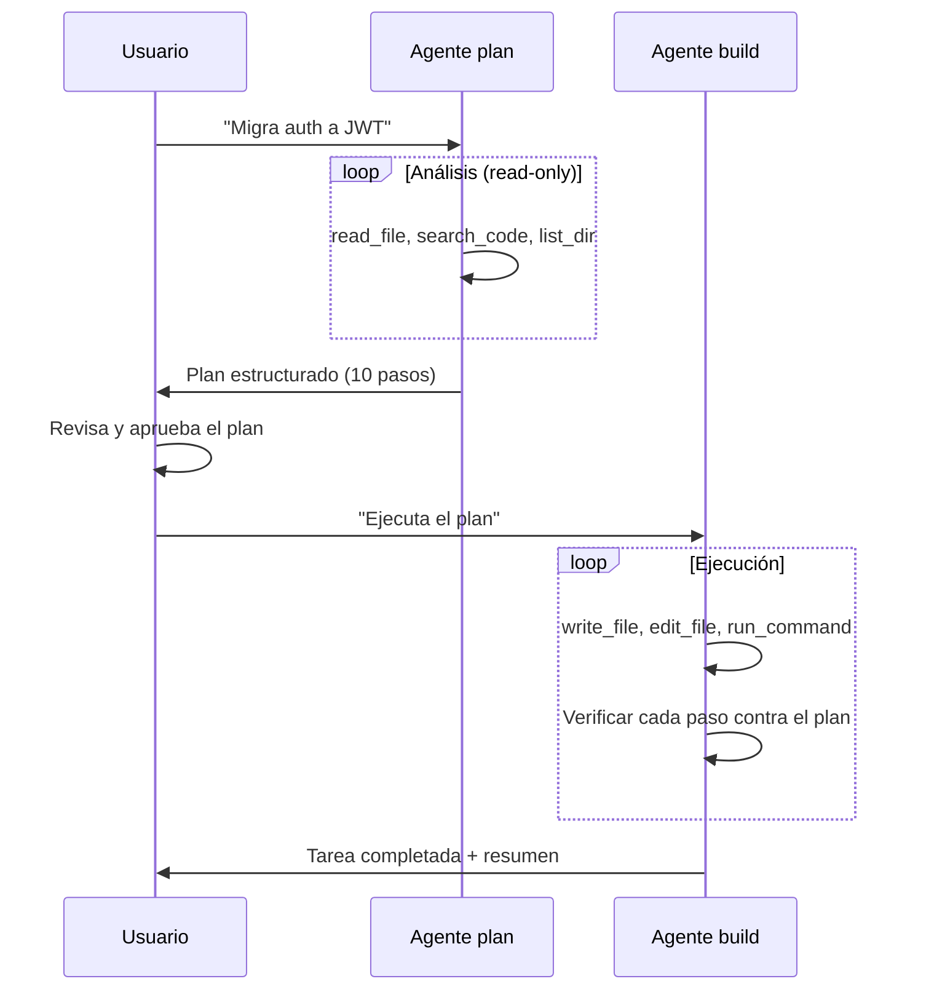
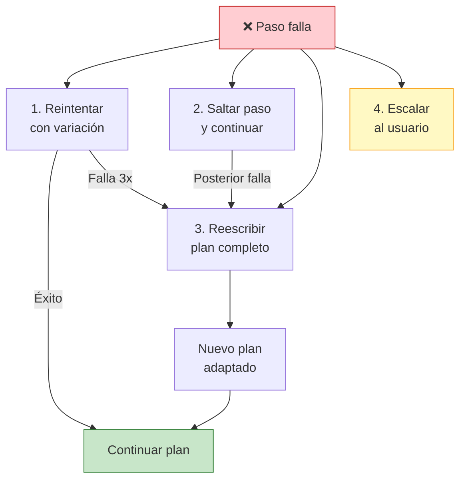
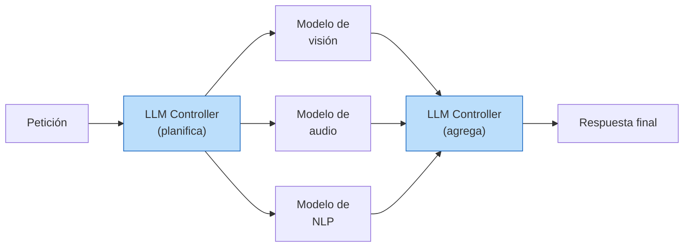
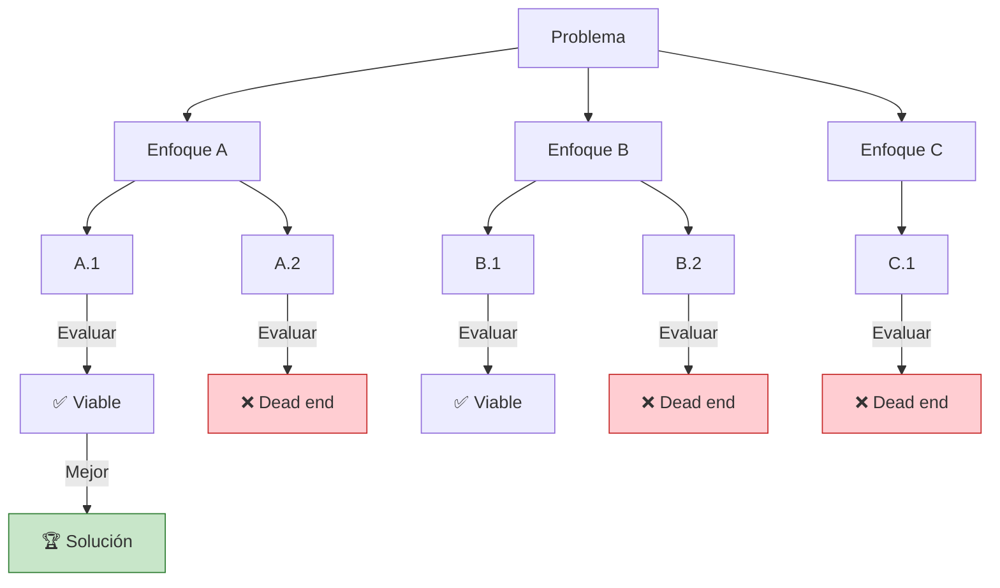

# Planificación en Agentes IA

> [!abstract]
> La planificación (*planning*) es la capacidad que permite a un agente ==descomponer objetivos complejos en secuencias de pasos ejecutables==. Sin planificación, un agente opera de forma reactiva, resolviendo cada paso sin visión global. Con planificación, el agente puede abordar tareas que requieren ==coordinación, dependencias entre subtareas y asignación estratégica de recursos==. Esta nota cubre la descomposición de tareas (*task decomposition*), la planificación jerárquica, la re-planificación adaptativa, las representaciones de planes (lenguaje natural, JSON, DAGs), cómo [[architect-overview|architect]] implementa la planificación con su agente `plan` de solo lectura, y cómo [[intake-overview|intake]] genera DAGs de tareas desde requisitos. ^resumen

---

## Por qué la planificación es necesaria

> [!quote] Helmuth von Moltke [^1]
> *"No plan survives first contact with the enemy."*

Paradójicamente, la planificación es esencial incluso sabiendo que los planes cambiarán. Un agente sin plan tiende a:

1. **Perderse en la exploración**: lee ficheros sin rumbo, ejecuta herramientas sin propósito claro
2. **Olvidar el objetivo global**: optimiza localmente (arregla lo que tiene delante) pero pierde la visión de conjunto
3. **Repetir trabajo**: sin un registro de qué se ha hecho y qué falta, el agente revisita las mismas áreas
4. **Subestimar dependencias**: modifica el fichero A sin darse cuenta de que B depende de A

La planificación transforma un problema abierto ("refactoriza este módulo") en una secuencia concreta de acciones con dependencias explícitas.

---

## Task Decomposition: el fundamento

La *task decomposition* (descomposición de tareas) es el acto de dividir un objetivo complejo en subtareas manejables. Es la habilidad más importante de la planificación.

### Niveles de descomposición



### Estrategias de descomposición

| Estrategia | Descripción | Cuándo usar |
|---|---|---|
| **Top-down** | Del objetivo global a los detalles | Cuando el dominio es conocido |
| **Bottom-up** | De las capacidades disponibles al objetivo | Cuando no está claro cómo empezar |
| **Analógica** | "Esto es como X que hice antes" | Cuando hay precedentes en el contexto |
| **Chunking temporal** | Dividir por fases: análisis → diseño → implementación → test | Para tareas de desarrollo de software |
| **Por componente** | Una subtarea por módulo/fichero afectado | Para refactorizaciones |

> [!tip] La regla del "paso atómico"
> Una subtarea está bien descompuesta cuando puede ser resuelta por el agente ==en 1-3 pasos del [[agent-loop|agent loop]]==. Si requiere más de 5 pasos, probablemente se puede descomponer más. Si es solo 1 paso trivial, probablemente la descomposición es excesiva.

---

## Planificación jerárquica

La planificación jerárquica (*Hierarchical Task Network*, HTN) organiza los planes en niveles de abstracción. Un plan de alto nivel se refina progresivamente en planes detallados.

### Tres niveles de abstracción



> [!info] Cómo architect implementa la jerarquía
> El agente `plan` de [[architect-overview|architect]] genera planes a nivel táctico y operativo. El nivel estratégico lo proporciona el usuario (o [[intake-overview|intake]] al transformar requisitos). El agente `plan` analiza el codebase con herramientas de solo lectura y produce un plan estructurado que el agente `build` ejecutará.

---

## Representaciones de planes

Un plan puede representarse en múltiples formatos. La elección afecta cómo el agente lo consume y cómo los humanos lo auditan.

### Lenguaje natural

La representación más simple y legible. El LLM genera el plan como texto markdown:

```markdown
## Plan: Migrar autenticación a JWT

### Fase 1: Análisis (read-only)
1. Leer `auth/middleware.py` para entender el flujo actual
2. Identificar todos los endpoints que acceden a `request.session`
3. Revisar los tests existentes de autenticación

### Fase 2: Implementación
4. Crear `auth/jwt_utils.py` con funciones create_token y verify_token
5. Modificar `auth/middleware.py` para aceptar Bearer tokens
6. Actualizar cada endpoint para usar el nuevo middleware

### Fase 3: Verificación
7. Ejecutar tests existentes (deben seguir pasando)
8. Añadir tests específicos para JWT (expiración, tokens inválidos)
9. Ejecutar vigil para verificar seguridad del código generado
```

> [!success] Ventaja del lenguaje natural
> Los humanos pueden revisar y aprobar el plan antes de ejecutar. [[architect-overview|architect]] muestra el plan al usuario y pide confirmación antes de proceder con `build`.

### JSON estructurado

Para consumo programático. Cada paso tiene metadatos:

> [!example]- Ejemplo de plan en formato JSON
> ```json
> {
>   "plan_id": "migrate-jwt-001",
>   "objective": "Migrar autenticación de sessions a JWT",
>   "estimated_steps": 15,
>   "phases": [
>     {
>       "name": "Análisis",
>       "type": "read-only",
>       "steps": [
>         {
>           "id": "s1",
>           "action": "read_file",
>           "target": "auth/middleware.py",
>           "purpose": "Entender flujo de auth actual",
>           "depends_on": []
>         },
>         {
>           "id": "s2",
>           "action": "search_code",
>           "target": "request.session",
>           "purpose": "Identificar endpoints con sessions",
>           "depends_on": ["s1"]
>         }
>       ]
>     },
>     {
>       "name": "Implementación",
>       "type": "read-write",
>       "steps": [
>         {
>           "id": "s4",
>           "action": "create_file",
>           "target": "auth/jwt_utils.py",
>           "purpose": "Crear utilidades JWT",
>           "depends_on": ["s2"]
>         },
>         {
>           "id": "s5",
>           "action": "edit_file",
>           "target": "auth/middleware.py",
>           "purpose": "Añadir soporte JWT al middleware",
>           "depends_on": ["s4"]
>         }
>       ]
>     }
>   ]
> }
> ```

### DAGs (Directed Acyclic Graphs)

La representación más poderosa. Captura dependencias y paralelismo:



> [!tip] Paralelismo en el DAG
> Los nodos sin dependencias mutuas pueden ejecutarse en paralelo. En el grafo anterior, `s2` y `s3` pueden ejecutarse simultáneamente. Esto reduce el tiempo total de ejecución.

---

## Cómo intake genera DAGs de tareas

[[intake-overview|intake]] transforma requisitos heterogéneos en DAGs de tareas que [[architect-overview|architect]] puede ejecutar. Su pipeline de 5 fases opera así:

```mermaid
graph LR
    subgraph INPUT["Entrada"]
        PDF["📄 PDF de reqs"]
        EMAIL["📧 Email"]
        JIRA["🎫 Ticket Jira"]
        SLACK["💬 Mensaje Slack"]
    end

    subgraph INTAKE["Pipeline de intake"]
        P1["1. Parse<br/>(12+ parsers)"]
        P2["2. Normalize<br/>(LLM via LiteLLM)"]
        P3["3. Decompose<br/>(task breakdown)"]
        P4["4. Prioritize<br/>(dependencias)"]
        P5["5. Output<br/>(spec + DAG)"]
    end

    subgraph OUTPUT["Salida"]
        SPEC["📋 Spec normalizada"]
        DAG["🔀 DAG de tareas"]
        META["📊 Metadatos"]
    end

    INPUT --> P1 --> P2 --> P3 --> P4 --> P5 --> OUTPUT

    style INTAKE fill:#e3f2fd,stroke:#1565c0
```



### La fase de descomposición en intake

En la fase 3 (*Decompose*), intake usa el LLM para:

1. **Identificar entidades**: ¿qué módulos, servicios o componentes están involucrados?
2. **Extraer dependencias**: ¿qué debe hacerse antes de qué?
3. **Estimar complejidad**: ¿cuánto esfuerzo requiere cada tarea?
4. **Asignar tipos**: ¿es una tarea de análisis, implementación, testing, documentación?

> [!example]- Ejemplo: de requisito vago a DAG de tareas
> **Input**: "Necesitamos que la API soporte autenticación JWT con refresh tokens y que los endpoints existentes sigan funcionando con sessions durante la migración."
>
> **Output de intake** (simplificado):
> ```yaml
> tasks:
>   - id: task-001
>     title: "Análisis del sistema de autenticación actual"
>     type: analysis
>     complexity: low
>     depends_on: []
>     description: "Revisar middleware de auth, endpoints con sessions, y tests"
>
>   - id: task-002
>     title: "Diseño de arquitectura JWT"
>     type: design
>     complexity: medium
>     depends_on: [task-001]
>     description: "Definir estructura de tokens, refresh flow, y strategy de migración"
>
>   - id: task-003
>     title: "Implementar JWT utils"
>     type: implementation
>     complexity: medium
>     depends_on: [task-002]
>     description: "Crear módulo jwt_utils con create, verify, refresh"
>
>   - id: task-004
>     title: "Implementar dual-auth middleware"
>     type: implementation
>     complexity: high
>     depends_on: [task-003]
>     description: "Middleware que acepta tanto sessions como JWT"
>
>   - id: task-005
>     title: "Actualizar endpoints"
>     type: implementation
>     complexity: medium
>     depends_on: [task-004]
>     description: "Migrar endpoints de session directa a middleware genérico"
>
>   - id: task-006
>     title: "Tests de integración JWT"
>     type: testing
>     complexity: medium
>     depends_on: [task-003, task-004, task-005]
>     description: "Tests para JWT flow completo y backward compat con sessions"
>
>   - id: task-007
>     title: "Scan de seguridad"
>     type: security
>     complexity: low
>     depends_on: [task-005]
>     description: "Ejecutar vigil sobre el código generado"
>
> dag_edges:
>   - [task-001, task-002]
>   - [task-002, task-003]
>   - [task-003, task-004]
>   - [task-004, task-005]
>   - [task-003, task-006]
>   - [task-004, task-006]
>   - [task-005, task-006]
>   - [task-005, task-007]
> ```
>
> Este DAG se consume a través del servidor MCP de intake, que cualquier agente compatible puede invocar.

---

## Cómo architect implementa la planificación

### El agente `plan`: planificación con herramientas de solo lectura

El agente `plan` de [[architect-overview|architect]] es una configuración especial del [[agent-loop|agent loop]] con restricciones deliberadas:

| Aspecto | Agente `plan` | Agente `build` |
|---|---|---|
| **Herramientas disponibles** | Solo lectura (`read_file`, `list_dir`, `search_code`) | Todas (lectura + escritura + ejecución) |
| **Objetivo** | Generar un plan, no ejecutar | Ejecutar pasos para completar la tarea |
| **max_steps** | 20 (análisis rápido) | 50+ (ejecución completa) |
| **Output** | Plan en markdown/JSON | Código modificado + resumen |
| **Modificaciones al codebase** | ==Ninguna== | Todas las necesarias |

> [!warning] Por qué plan es read-only
> La separación de privilegios entre `plan` y `build` es una decisión de seguridad fundamental. Un agente que planifica y ejecuta simultáneamente puede "saltarse" pasos del plan o tomar atajos peligrosos. Al hacer `plan` read-only, se garantiza que:
> 1. El plan se genera basándose en análisis real del codebase (no en suposiciones)
> 2. El plan es un artefacto auditable que el humano puede revisar
> 3. No se modifica nada hasta que el humano aprueba el plan

### Flujo plan → build



---

## Re-planificación: cuando el plan falla

> [!danger] Los planes fallan. La capacidad de re-planificar es lo que separa un agente robusto de uno frágil.

### Cuándo re-planificar

1. **Un paso falla repetidamente**: Si `npm test` falla 3 veces con el mismo error después de intentar fixes, el enfoque actual no funciona
2. **Se descubre nueva información**: Al leer un fichero, el agente descubre que la arquitectura es diferente a lo esperado
3. **Dependencias cambian**: El paso 5 dependía del resultado del paso 3, pero el paso 3 produjo algo diferente a lo esperado
4. **El contexto se llena**: No hay espacio para completar el plan original, hay que priorizar los pasos más importantes

### Estrategias de re-planificación



> [!tip] La heurística del 3-strike
> [[architect-overview|architect]] implementa implícitamente esta heurística: si una herramienta falla 3 veces seguidas, el LLM tiende a cambiar de estrategia (la repetición de errores en el contexto actúa como señal para re-planificar). No es una regla hardcodeada, sino un comportamiento emergente del razonamiento del LLM con contexto.

---

## Investigación en planificación de agentes

### Plan-and-Solve Prompting

Wang et al. (2023) [^2] propusieron una técnica de prompting que mejora el *zero-shot* CoT añadiendo planificación explícita:

```
Plan-and-Solve (PS) prompting:
"Let's first understand the problem and devise a plan to solve it.
Then, let's carry out the plan and solve the problem step by step."
```

Esta técnica simple mejora consistentemente el rendimiento en tareas de razonamiento matemático y lógico. En agentes, se traduce en un *system prompt* que instruye al LLM a planificar antes de actuar.

### HuggingGPT: planificación con modelos especializados

Shen et al. (2023) [^3] propusieron un sistema donde un LLM actúa como controlador que planifica y orquesta modelos especializados de Hugging Face:



> [!info] Relevancia para el ecosistema
> Este patrón es análogo a cómo [[architect-overview|architect]] podría orquestar sub-agentes especializados: un sub-agente para frontend, otro para backend, otro para tests. La planificación determina qué sub-agente se invoca para cada tarea.

### Tree of Thoughts (ToT)

Yao et al. (2023) [^4] generalizaron CoT a un árbol de razonamiento donde el agente explora múltiples caminos:



> [!warning] Coste de ToT
> La exploración de múltiples caminos multiplica el coste en tokens. Si cada evaluación cuesta $0.01 y el árbol tiene 20 nodos, el coste de la planificación sola puede ser $0.20+. Para tareas simples, *ReAct* o *Plan-and-Execute* son más eficientes.

### Least-to-Most Prompting

Zhou et al. (2022) [^5] propusieron descomponer un problema complejo en subproblemas más simples, resolverlos en orden de menor a mayor complejidad, y usar la solución de cada subproblema como contexto para el siguiente. Este es exactamente el patrón que un agente bien planificado debería seguir.

---

## Métricas de calidad de la planificación

> [!question] ¿Cómo evaluar si un plan es bueno?

| Métrica | Definición | Valor óptimo |
|---|---|---|
| **Completitud** | ¿El plan cubre todos los aspectos del objetivo? | 100% de requisitos |
| **Granularidad** | ¿Los pasos son del tamaño correcto? | 1-3 pasos del loop cada uno |
| **Dependencias** | ¿Las dependencias son correctas? | Sin ciclos, sin dependencias faltantes |
| **Paralelismo** | ¿Se identifican tareas paralelizables? | Max paralelismo sin conflictos |
| **Estimación** | ¿Las estimaciones son realistas? | ±30% del esfuerzo real |
| **Contingencia** | ¿Hay alternativas si algo falla? | Al menos para pasos críticos |

---

## Relación con el ecosistema

- **[[intake-overview|intake]]**: es el ==planificador de nivel estratégico== del ecosistema. Transforma requisitos humanos (vagos, heterogéneos, distribuidos en múltiples fuentes) en planes ejecutables con DAGs de dependencias. Su output es el input para la planificación táctica de architect.

- **[[architect-overview|architect]]**: implementa ==planificación táctica y operativa==. El agente `plan` genera planes detallados a nivel de ficheros y funciones. El agente `build` tiene capacidad de re-planificación cuando los pasos fallan. Los sub-agentes permiten delegación de sub-planes a agentes especializados.

- **[[vigil-overview|vigil]]**: no planifica, pero sus resultados ==alimentan la re-planificación==. Si vigil detecta un placeholder secret o un test vacío en el código generado, architect debe re-planificar para corregir esos hallazgos.

- **[[licit-overview|licit]]**: registra la ==trazabilidad de los planes== para compliance. La EU AI Act (Artículo 12) exige registrar las decisiones tomadas por sistemas IA. Los planes generados por architect y los DAGs de intake son artefactos de trazabilidad que licit almacena y valida.

---

## Enlaces y referencias

> [!quote]- Bibliografía
> - von Moltke, H. (1871). *Über Strategie*. [^1]
> - Wang, L., et al. (2023). *Plan-and-Solve Prompting*. arXiv:2305.04091 [^2]
> - Shen, Y., et al. (2023). *HuggingGPT: Solving AI Tasks with ChatGPT and its Friends in Hugging Face*. arXiv:2303.17580 [^3]
> - Yao, S., et al. (2023). *Tree of Thoughts*. arXiv:2305.10601 [^4]
> - Zhou, D., et al. (2022). *Least-to-Most Prompting Enables Complex Reasoning in Large Language Models*. arXiv:2205.10625 [^5]
> - Wei, J., et al. (2022). *Chain-of-Thought Prompting Elicits Reasoning in Large Language Models*. arXiv:2201.11903 [^6]
> - Huang, W., et al. (2022). *Inner Monologue: Embodied Reasoning through Planning with Language Models*. arXiv:2207.05608

### Notas relacionadas

- [[que-es-un-agente-ia]] — El contexto: qué es un agente y sus taxonomías
- [[anatomia-agente]] — La planificación como componente de la anatomía
- [[agent-loop]] — El loop que ejecuta los planes
- [[tool-use-function-calling]] — Las herramientas que materializan los pasos
- [[intake-overview]] — Generación de DAGs desde requisitos
- [[architect-overview]] — Implementación de plan + build
- [[prompt-engineering-fundamentos]] — Técnicas de prompting para planificación
- [[moc-agentes]] — Mapa de contenido

---

[^1]: Atribuido a Helmuth von Moltke the Elder (1800-1891), militar prusiano.
[^2]: Wang, L., Xu, W., Lan, Y., et al. (2023). *Plan-and-Solve Prompting: Improving Zero-Shot Chain-of-Thought Reasoning by Large Language Models*. arXiv:2305.04091.
[^3]: Shen, Y., Song, K., Tan, X., et al. (2023). *HuggingGPT: Solving AI Tasks with ChatGPT and its Friends in Hugging Face*. arXiv:2303.17580.
[^4]: Yao, S., Yu, D., Zhao, J., et al. (2023). *Tree of Thoughts: Deliberate Problem Solving with Large Language Models*. arXiv:2305.10601.
[^5]: Zhou, D., Schärli, N., Hou, L., et al. (2022). *Least-to-Most Prompting Enables Complex Reasoning in Large Language Models*. arXiv:2205.10625.
[^6]: Wei, J., Wang, X., Schuurmans, D., et al. (2022). *Chain-of-Thought Prompting Elicits Reasoning in Large Language Models*. arXiv:2201.11903.
