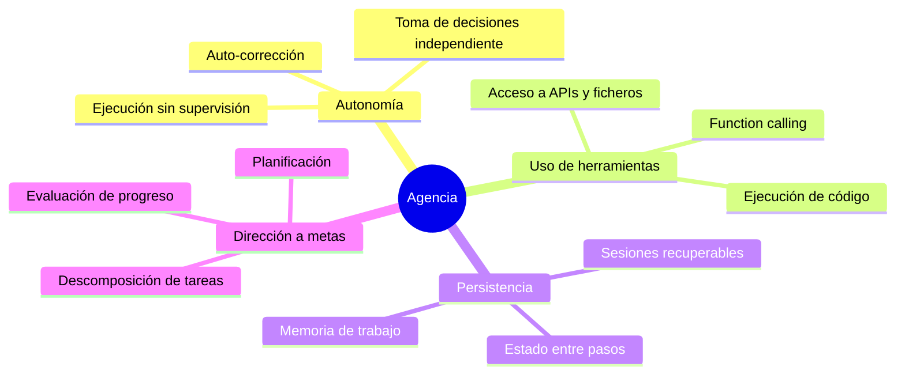
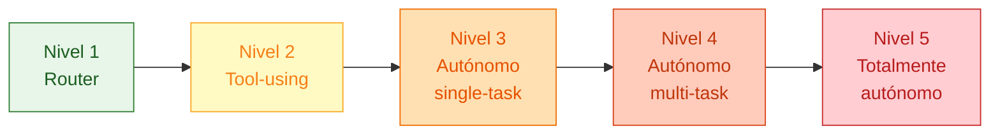
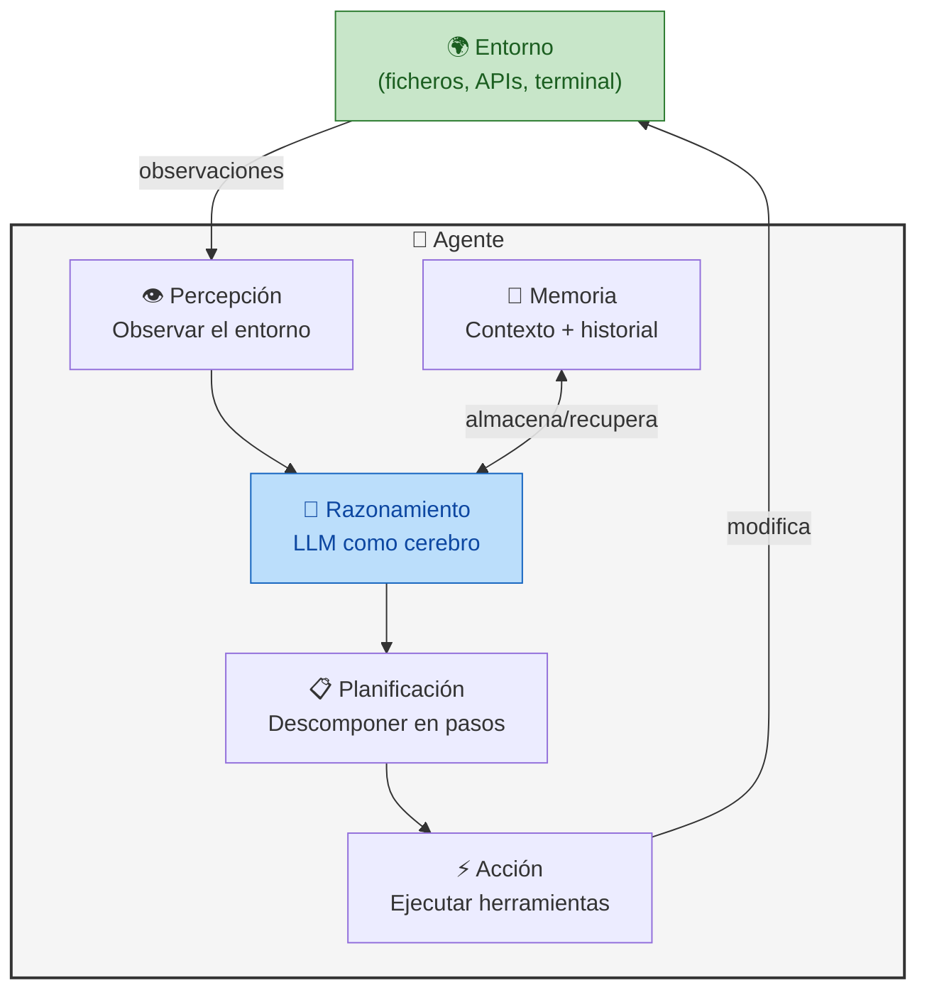

# ¿Qué es un Agente IA?

> [!abstract]
> Un *AI agent* (agente de inteligencia artificial) es un sistema que ==percibe su entorno, razona sobre lo observado, planifica una secuencia de acciones y las ejecuta de forma autónoma para alcanzar un objetivo==. A diferencia de un chatbot convencional, un agente posee **agencia**: combina ==autonomía, uso de herramientas, persistencia de estado y comportamiento dirigido a metas==. Esta nota define formalmente qué es un agente, clasifica las taxonomías principales (*ReAct*, *Plan-and-Execute*, reflexivos, conversacionales), establece los niveles de agencia desde respuestas simples hasta autonomía completa, y explica por qué el período 2024-2025 ha sido denominado la "era de los agentes". ^resumen

---

## Definición formal

> [!quote] Stuart Russell & Peter Norvig, *Artificial Intelligence: A Modern Approach* [^1]
> *"An agent is anything that can be viewed as perceiving its environment through sensors and acting upon that environment through actuators."*

La definición clásica de Russell y Norvig sigue siendo la base conceptual. Un agente IA moderno extiende esta idea con tres capacidades que los sistemas clásicos no tenían:

1. **Razonamiento en lenguaje natural**: el LLM actúa como "cerebro" del agente, permitiendo razonamiento flexible y generalista.
2. **Uso de herramientas**: el agente puede invocar APIs, ejecutar código, leer ficheros, consultar bases de datos --- todo a través de [[tool-use-function-calling|function calling]].
3. **Memoria persistente**: el agente mantiene contexto entre pasos e incluso entre sesiones, algo que un simple [[prompt-engineering-fundamentos|prompt]] no logra.

> [!info] Definición operativa
> Un **agente IA** es un programa que utiliza un *Large Language Model* como motor de razonamiento dentro de un bucle iterativo (*loop*), donde en cada iteración:
> 1. **Observa** el estado actual (entorno, resultados previos, contexto)
> 2. **Piensa** qué hacer a continuación (razonamiento con el LLM)
> 3. **Actúa** ejecutando una herramienta o generando una respuesta
> 4. **Evalúa** si el objetivo se ha cumplido o debe continuar

Este bucle es el [[agent-loop|agent loop]], la primitiva fundamental que estudiaremos en profundidad en su nota dedicada.

---

## Agente vs. Chatbot: la distinción clave

La confusión más frecuente es equiparar un chatbot con un agente. La diferencia no es de grado sino de naturaleza: la **agencia**.

| Característica | Chatbot | Agente IA |
|---|---|---|
| **Interacción** | Reactiva (pregunta → respuesta) | Proactiva (objetivo → plan → ejecución) |
| **Autonomía** | Nula: necesita un humano en cada paso | Alta: ejecuta múltiples pasos sin intervención |
| **Herramientas** | No usa herramientas externas | Invoca APIs, ejecuta código, lee ficheros |
| **Memoria** | Solo ventana de contexto | Memoria de trabajo + memoria a largo plazo |
| **Estado** | *Stateless* entre mensajes | *Stateful*: mantiene progreso hacia el objetivo |
| **Planificación** | No planifica | Descompone tareas en subtareas |
| **Evaluación** | No evalúa sus respuestas | Verifica resultados y corrige errores |
| **Ejemplo** | ChatGPT en modo conversación | [[architect-overview\|architect]] ejecutando un pipeline completo |

> [!tip] La prueba de la agencia
> Pregúntate: ¿el sistema puede recibir una meta vaga como "refactoriza este módulo para que sea testeable" y completarla ejecutando múltiples pasos sin intervención humana? Si la respuesta es sí, es un agente. Si necesita que el humano le diga qué hacer en cada paso, es un chatbot.

---

## Los cuatro pilares de la agencia

La agencia (*agency*) no es un concepto binario. Se compone de cuatro pilares que pueden estar presentes en mayor o menor medida:



### 1. Autonomía

El agente toma decisiones sin intervención humana. No pregunta "¿qué hago ahora?" en cada paso --- decide por sí mismo basándose en el estado actual y el objetivo. [[architect-overview|architect]] implementa esto con su *Ralph Loop*: un bucle `while True` que continúa ejecutando pasos hasta que el LLM indica que ha terminado o se alcanza un límite de seguridad.

### 2. Uso de herramientas (*tool use*)

El agente extiende sus capacidades más allá de la generación de texto. Puede leer ficheros, escribir código, ejecutar comandos, consultar bases de datos. Sin herramientas, el LLM está limitado a lo que "sabe" de su entrenamiento. Con herramientas, puede interactuar con el mundo real. Ver [[tool-use-function-calling]] para detalles completos.

### 3. Persistencia

El agente mantiene estado. Sabe qué pasos ha ejecutado, qué resultados ha obtenido, qué errores ha encontrado. Esta memoria de trabajo le permite razonar sobre su progreso y adaptar su estrategia. Algunos agentes también tienen memoria a largo plazo entre sesiones.

### 4. Dirección a metas (*goal-directed behavior*)

El agente no responde preguntas --- persigue objetivos. Recibe una meta ("implementa autenticación JWT en este proyecto") y trabaja hasta alcanzarla. Esto requiere [[planning-agentes|planificación]], descomposición de tareas y evaluación continua del progreso.

---

## Taxonomías de agentes

Existen múltiples formas de clasificar agentes. Las taxonomías más útiles en la práctica son:

### Por estrategia de razonamiento

> [!example]- Tabla comparativa de estrategias de razonamiento
>
> | Estrategia | Descripción | Fortalezas | Debilidades | Referencia |
> |---|---|---|---|---|
> | **ReAct** | Alterna *Reasoning* y *Acting* en cada paso | Simple, efectivo, trazable | Puede perderse en loops largos | Yao et al., 2022 [^2] |
> | **Plan-and-Execute** | Primero planifica todo, luego ejecuta | Bueno para tareas complejas | Plan inicial puede ser incorrecto | Wang et al., 2023 [^3] |
> | **Reflexion** | Ejecuta, evalúa, reflexiona sobre errores | Aprende de sus errores | Costoso en tokens | Shinn et al., 2023 [^4] |
> | **Tree of Thoughts** | Explora múltiples caminos de razonamiento | Encuentra soluciones creativas | Muy costoso computacionalmente | Yao et al., 2023 [^5] |
> | **LATS** | Combina *Monte Carlo Tree Search* con LLM | Óptimo para problemas de búsqueda | Extremadamente costoso | Zhou et al., 2023 |

#### ReAct (*Reasoning + Acting*)

El patrón *ReAct* es la estrategia más adoptada. El agente alterna entre pensar y actuar en cada paso del [[agent-loop|loop]]:

```
Thought: Necesito leer el fichero de configuración para entender la estructura.
Action: read_file("config.yaml")
Observation: El fichero contiene 3 secciones: database, api, security...
Thought: Ahora necesito verificar si la sección de seguridad tiene CORS configurado.
Action: ...
```

[[architect-overview|architect]] utiliza una variante de *ReAct* donde el LLM genera *tool calls* estructurados en lugar de texto libre, lo que elimina la necesidad de parsear la salida.

#### Plan-and-Execute

Separa la planificación de la ejecución en dos fases distintas. Un primer agente (o llamada al LLM) genera un plan completo, y un segundo agente ejecuta cada paso. [[architect-overview|architect]] implementa esto con su agente `plan`, que usa herramientas de solo lectura para analizar el proyecto antes de generar un plan estructurado.

#### Reflexion

Añade una fase de auto-evaluación al loop. Después de actuar, el agente reflexiona sobre el resultado: ¿fue correcto? ¿Qué podría haber hecho mejor? Esta reflexión se añade al contexto para mejorar las siguientes decisiones. El agente `review` de [[architect-overview|architect]] implementa una forma de reflexión al evaluar el código generado por `build`.

### Por nivel de autonomía



### Niveles de agencia en detalle

> [!info] Los 5 niveles de agencia
>
> **Nivel 1 — Router**: El LLM decide a qué sistema derivar la consulta, pero no ejecuta nada. Ejemplo: un clasificador de intenciones que enruta al equipo correcto.
>
> **Nivel 2 — Tool-using**: El LLM puede invocar herramientas predefinidas dentro de una sola interacción. Ejemplo: un asistente que consulta una base de datos para responder una pregunta.
>
> **Nivel 3 — Autónomo single-task**: El agente ejecuta múltiples pasos para completar una tarea concreta. Ejemplo: [[architect-overview|architect]] en modo `build` generando código para una feature.
>
> **Nivel 4 — Autónomo multi-task**: El agente gestiona múltiples tareas con dependencias. Ejemplo: [[intake-overview|intake]] generando un DAG de tareas que luego orquesta [[architect-overview|architect]].
>
> **Nivel 5 — Totalmente autónomo**: El agente define sus propios objetivos, gestiona recursos y opera indefinidamente. Este nivel aún es mayormente teórico y plantea serios riesgos que [[vigil-overview|vigil]] y [[licit-overview|licit]] buscan mitigar.

---

## Anatomía de un agente (vista de alto nivel)

Cada agente, independientemente de su taxonomía, comparte una [[anatomia-agente|anatomía]] común:



Para un análisis exhaustivo de cada componente, ver [[anatomia-agente|Anatomía de un agente]].

---

## ¿Por qué 2024-2025 es la "era de los agentes"?

> [!question] ¿Qué cambió para que los agentes pasaran de concepto académico a producto viable?

Varios factores convergieron:

### 1. Modelos con capacidad de *function calling* nativa

Hasta 2023, hacer que un LLM usara herramientas requería *prompts* frágiles y parseo de texto libre. Con el lanzamiento de *function calling* nativo por OpenAI (junio 2023), seguido por Anthropic y Google, los modelos pudieron invocar herramientas de forma estructurada y fiable. Ver [[tool-use-function-calling#Evolución del function calling|la evolución del function calling]].

### 2. Ventanas de contexto masivas

Pasar de 4K tokens (GPT-3.5) a 128K+ tokens (GPT-4 Turbo, Claude 3) y hasta 1M+ tokens (Gemini 1.5) permitió a los agentes mantener mucho más contexto de trabajo. Un agente que opera sobre un codebase necesita ver ficheros completos, historiales de errores y resultados anteriores --- todo simultáneamente.

### 3. Reducción de costes

El coste por token cayó más de 100x entre 2023 y 2025, haciendo económicamente viable que un agente ejecute decenas o cientos de llamadas al LLM en una sola tarea. [[architect-overview|architect]] incluye *cost tracking* precisamente porque una sesión de agente puede implicar cientos de llamadas.

### 4. Infraestructura de herramientas

Protocolos como *Model Context Protocol* (MCP) estandarizaron cómo los agentes descubren y usan herramientas. [[intake-overview|intake]] expone un servidor MCP que permite a cualquier agente compatible consumir sus capacidades de parsing de requisitos.

### 5. Frameworks maduros

LangChain, CrewAI, AutoGen, y herramientas como [[architect-overview|architect]] proporcionaron abstracciones probadas en producción. Ya no es necesario construir un agente desde cero.

> [!success] El ecosistema propio como ejemplo
> El ecosistema [[intake-overview|intake]] → [[architect-overview|architect]] → [[vigil-overview|vigil]] → [[licit-overview|licit]] representa exactamente este momento: cuatro herramientas especializadas que cooperan para llevar agentes IA a producción con ==seguridad, compliance y trazabilidad==.

---

## El *observe-think-act loop* como primitiva fundamental

> [!warning] No confundir con el prompt → response de un chatbot
> El [[agent-loop|agent loop]] es fundamentalmente diferente a una interacción de chatbot. El chatbot tiene un ciclo de vida de un solo turno: recibe un prompt, genera una respuesta, termina. El agente tiene un ciclo de vida de N turnos, decidiendo en cada uno si continuar o parar.

El bucle observar-pensar-actuar (*observe-think-act*, OTA) es la primitiva sobre la que se construye todo agente:

```python
# Pseudocódigo del loop fundamental
while not done:
    observation = perceive(environment)      # Observar
    thought = llm.reason(observation, goal)  # Pensar
    action = thought.next_action()           # Decidir
    result = execute(action)                 # Actuar
    environment.update(result)               # Actualizar estado
    done = thought.is_goal_achieved()        # ¿Terminamos?
```

Este patrón es tan fundamental que aparece en cada componente del ecosistema:

- [[intake-overview|intake]]: observa requisitos heterogéneos → razona sobre su estructura → actúa normalizándolos en specs
- [[architect-overview|architect]]: observa el codebase → razona sobre qué cambios hacer → actúa generando/modificando código
- [[vigil-overview|vigil]]: observa código generado → razona sobre patrones de riesgo → actúa reportando vulnerabilidades
- [[licit-overview|licit]]: observa configuraciones de agentes → razona sobre cumplimiento regulatorio → actúa generando reportes de compliance

Para el análisis completo del loop con variantes, condiciones de parada e implementación, ver [[agent-loop|El Agent Loop]].

---

## Relación con el ecosistema

El concepto de agente IA es el fundamento teórico sobre el que se construye todo el ecosistema de herramientas:

- **[[intake-overview|intake]]**: no es un agente en sí mismo, sino un *preprocesador* que transforma la entrada para los agentes. Su pipeline de 5 fases convierte requisitos vagos en especificaciones que un agente puede ejecutar sin ambigüedad. El servidor MCP de intake permite que agentes externos consuman sus capacidades como herramientas.

- **[[architect-overview|architect]]**: es el **agente por excelencia** del ecosistema. Implementa las cuatro taxonomías (sus 4 agentes --- plan, build, resume, review --- cubren *Plan-and-Execute*, *ReAct*, y *Reflexion*). Sus 22 capas de seguridad representan el estado del arte en agentes seguros para producción.

- **[[vigil-overview|vigil]]**: actúa como ==guardián determinista== del output de los agentes. Mientras el agente es probabilístico (LLM), vigil aplica 26 reglas deterministas que no dependen de ningún modelo. Es el complemento necesario para llevar agentes a producción.

- **[[licit-overview|licit]]**: garantiza que los agentes operen dentro del marco regulatorio. Con la EU AI Act exigiendo trazabilidad y documentación, licit proporciona la capa de compliance que todo agente en producción necesita.

---

## Enlaces y referencias

> [!quote]- Bibliografía
> - Russell, S., & Norvig, P. (2020). *Artificial Intelligence: A Modern Approach* (4th ed.). Pearson. [^1]
> - Yao, S., et al. (2022). *ReAct: Synergizing Reasoning and Acting in Language Models*. arXiv:2210.03629 [^2]
> - Wang, L., et al. (2023). *Plan-and-Solve Prompting*. arXiv:2305.04091 [^3]
> - Shinn, N., et al. (2023). *Reflexion: Language Agents with Verbal Reinforcement Learning*. arXiv:2303.11366 [^4]
> - Yao, S., et al. (2023). *Tree of Thoughts: Deliberate Problem Solving with Large Language Models*. arXiv:2305.10601 [^5]
> - Xi, Z., et al. (2023). *The Rise and Potential of Large Language Model Based Agents: A Survey*. arXiv:2309.07864
> - Wang, L., et al. (2024). *A Survey on Large Language Model based Autonomous Agents*. arXiv:2308.11432

### Notas relacionadas

- [[anatomia-agente]] — Anatomía detallada de cada componente
- [[agent-loop]] — El bucle fundamental de ejecución
- [[planning-agentes]] — Estrategias de planificación
- [[tool-use-function-calling]] — Cómo los agentes usan herramientas
- [[prompt-engineering-fundamentos]] — Técnicas de prompting como base
- [[llm-overview]] — Los modelos de lenguaje que potencian a los agentes
- [[architect-overview]] — Implementación concreta de un agente autónomo
- [[moc-agentes]] — Mapa de contenido de agentes IA

---

[^1]: Russell, S., & Norvig, P. (2020). *Artificial Intelligence: A Modern Approach* (4th ed.). Pearson.
[^2]: Yao, S., Zhao, J., Yu, D., et al. (2022). *ReAct: Synergizing Reasoning and Acting in Language Models*. arXiv:2210.03629.
[^3]: Wang, L., Xu, W., Lan, Y., et al. (2023). *Plan-and-Solve Prompting: Improving Zero-Shot Chain-of-Thought Reasoning by Large Language Models*. arXiv:2305.04091.
[^4]: Shinn, N., Cassano, F., Gopinath, A., et al. (2023). *Reflexion: Language Agents with Verbal Reinforcement Learning*. arXiv:2303.11366.
[^5]: Yao, S., Yu, D., Zhao, J., et al. (2023). *Tree of Thoughts: Deliberate Problem Solving with Large Language Models*. arXiv:2305.10601.
