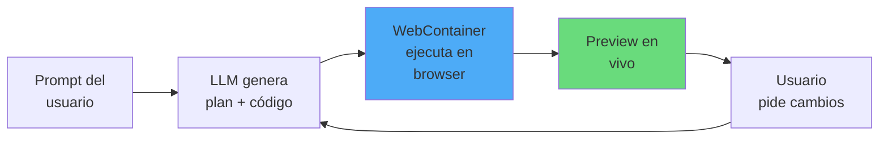
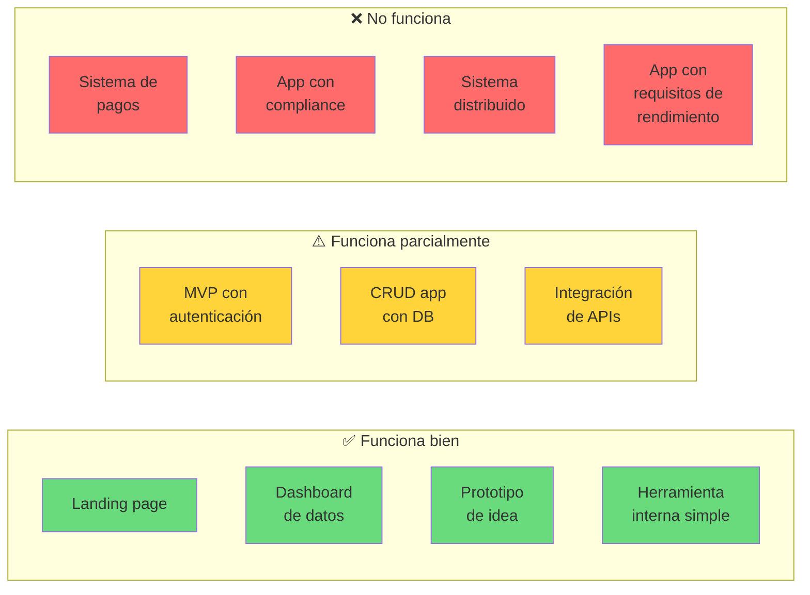
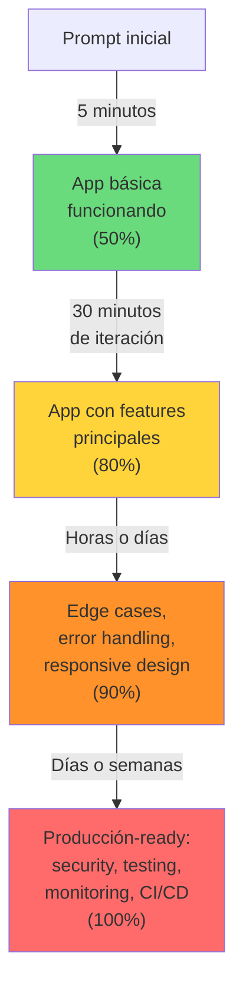

---
tags:
  - concepto
  - agentes
  - herramienta
  - tendencia
aliases:
  - vibe coding
  - prompt-to-app
  - coding by vibes
  - desarrollo por vibraciones
  - AI app builders
created: 2025-06-01
updated: 2025-06-01
category: agentes-ia
status: volatile
difficulty: beginner
related:
  - "[[coding-agents]]"
  - "[[agent-evaluation]]"
  - "[[vigil-overview]]"
  - "[[hallucinations]]"
  - "[[vibe-coding-vs-coding-agents]]"
  - "[[ai-assisted-development]]"
  - "[[technical-debt]]"
up: "[[moc-agentes]]"
---

# Vibe Coding

> [!abstract] Resumen
> *Vibe coding* es un paradigma de desarrollo de software donde el programador ==describe lo que quiere en lenguaje natural y una IA genera la aplicación completa==, incluyendo frontend, backend y configuración de despliegue. Herramientas como Bolt (StackBlitz), v0 (Vercel), Lovable, Replit Agent y Claude Artifacts han popularizado este enfoque, que ==funciona extraordinariamente bien para prototipos, MVPs y aplicaciones simples, pero falla de forma predecible en sistemas complejos, seguros o de producción==. El término, acuñado por Andrej Karpathy en 2025[^1], captura la esencia: "te dejas llevar por la vibra, ves si funciona, y si no, le pides que lo arregle". El problema fundamental es el *last mile*: pasar del ==80% funcional al 100% listo para producción== suele costar más esfuerzo que el 80% inicial. ^resumen

## Qué es y por qué importa

*Vibe coding* (*vibe coding*) describe un estilo de desarrollo donde el programador ==no escribe código directamente==, sino que:

1. Describe lo que quiere en un prompt ("Hazme una app de gestión de tareas con drag-and-drop, autenticación y base de datos")
2. La IA genera el código completo
3. El programador ve el resultado, pide cambios ("El botón debería ser azul", "Añade filtros por fecha")
4. Itera hasta que el resultado es satisfactorio

El término fue acuñado por **Andrej Karpathy** (ex-Tesla AI, ex-OpenAI) en febrero de 2025, describiéndolo como:

> [!quote] Definición original de Karpathy
> "There's a new kind of coding I call 'vibe coding', where you fully give in to the vibes, embrace exponentials, and forget that the code even exists. [...] I just see things, say things, run things, and copy-paste things, and it mostly works."[^1]

El fenómeno importa por varias razones:

- ==Democratiza la creación de software== para personas sin formación técnica profunda
- Reduce el tiempo de prototipado de semanas a horas (o minutos)
- Plantea preguntas fundamentales sobre el futuro del rol de desarrollador
- Genera una ==tensión entre velocidad de entrega y calidad técnica== que afecta a toda la industria

> [!tip] Cuándo usar vibe coding
> - **Usar cuando**: Prototipos internos, MVPs para validar ideas, herramientas internas simples, landing pages, dashboards de datos, proyectos personales, hackathons
> - **No usar cuando**: Aplicaciones que manejan datos sensibles, sistemas de pagos, infraestructura crítica, aplicaciones con requisitos de compliance regulatorio, sistemas que necesitan escalar a millones de usuarios
> - Ver [[coding-agents]] para agentes que asisten al desarrollador (en vez de reemplazarlo)

---

## Herramientas del ecosistema

### Comparativa de plataformas de vibe coding (2025)

| Plataforma | Empresa | Modelo base | Stack generado | Hosting | Precio (tier gratuito) | Fortaleza |
|-----------|---------|------------|----------------|---------|----------------------|-----------|
| **Bolt** | StackBlitz | Claude, GPT-4o | React, Next.js, Node | StackBlitz / Netlify | Limitado (tokens/día) | ==Full-stack en browser, WebContainers== |
| **v0** | Vercel | Propio (fine-tuned) | React, Next.js, Tailwind | Vercel | Generoso | ==UI components de calidad== |
| **Lovable** | Lovable (ex-GPT Engineer) | Claude, GPT-4o | React, Supabase | Integrado | Limitado | UX más pulida, ==Supabase integrado== |
| **Replit Agent** | Replit | Propio + Claude | Multi-lenguaje | Replit Deployments | Limitado | IDE completo, ==deployment one-click== |
| **Claude Artifacts** | Anthropic | Claude | React (sandbox) | N/A (local) | Con Claude Pro | ==Iteración rápida==, sandbox seguro |
| **Cursor** | Anysphere | Claude, GPT-4o | Cualquiera | N/A (local) | Free tier | ==IDE completo==, más control |
| **Windsurf** | Codeium | Propio + otros | Cualquiera | N/A (local) | Free tier | Agentic IDE, flows automáticos |

> [!warning] Tabla de datos volátiles
> Los precios, modelos y features de estas plataformas cambian frecuentemente. ==Última verificación: junio 2025==. Verificar en la documentación oficial antes de tomar decisiones.

### Bolt (StackBlitz)

Bolt ejecuta un ==entorno de desarrollo completo en el browser== usando WebContainers (Node.js compilado a WebAssembly). El usuario describe lo que quiere, y Bolt genera un proyecto completo con preview en vivo.



**Fortalezas**: No necesita backend, todo corre en el browser, despliegue a Netlify con un click.
**Limitaciones**: Limitado a lo que WebContainers soporta (no Python, no bases de datos nativas), ==el código generado a menudo tiene problemas de mantenibilidad==.

### v0 (Vercel)

v0 se enfoca en ==generación de componentes UI==, no aplicaciones completas. Genera código React + Tailwind + shadcn/ui de alta calidad visual.

**Fortalezas**: Los componentes son visualmente excelentes, código limpio, integración nativa con Vercel.
**Limitaciones**: Solo frontend, no genera backend ni lógica de negocio compleja.

### Lovable (ex-GPT Engineer)

Lovable genera ==aplicaciones full-stack con backend en Supabase==, incluyendo autenticación, base de datos y API.

**Fortalezas**: Full-stack real con persistencia, buena UX de iteración, Supabase como backend robusto.
**Limitaciones**: Vendor lock-in con Supabase, el código generado puede ser difícil de migrar.

### Replit Agent

Replit Agent tiene la ventaja de operar dentro de un ==IDE completo con terminal, sistema de archivos y deployment==.

**Fortalezas**: Soporte multi-lenguaje (Python, JS, Go, etc.), deployment integrado, IDE funcional.
**Limitaciones**: Performance del IDE en browser, limitaciones del free tier.

---

## Cuándo funciona y cuándo no

### El espectro de viabilidad



### Análisis detallado

| Escenario | Resultado con vibe coding | Por qué |
|-----------|--------------------------|---------|
| **Prototipo para inversores** | ==Excelente== | Solo necesita verse bien y funcionar en demo |
| **Herramienta interna para 5 personas** | Bueno | Requisitos simples, tolerancia a bugs, sin escala |
| **MVP para validar mercado** | Bueno-Aceptable | Velocidad importa más que calidad, refactorizar después |
| **App móvil con UX compleja** | Aceptable | ==La UI se genera bien, pero las interacciones complejas fallan== |
| **E-commerce con pagos** | Pobre | Requiere seguridad en pagos, manejo de estado complejo, edge cases |
| **SaaS multi-tenant** | Pobre | Aislamiento de datos, permisos, billing, escalabilidad |
| **Aplicación regulada (salud/finanzas)** | ==Inaceptable== | Compliance, auditoría, seguridad — no negociable |

> [!danger] El código de vibe coding en producción
> El mayor riesgo del vibe coding es que ==el código generado se ponga en producción sin revisión==. Los problemas típicos:
> - **Sin manejo de errores**: happy path funciona, edge cases explotan
> - **SQL injection y XSS**: el código generado a menudo no sanitiza inputs
> - **Secrets hardcodeados**: API keys directamente en el código
> - **Sin rate limiting**: endpoints expuestos sin protección
> - **Dependencias innecesarias**: 50 paquetes npm para lo que se podría hacer con 5
> - Conexión directa con [[vigil-overview|vigil]]: ==escanear código generado por vibe coding es un caso de uso crítico para vigil==

---

## El problema del "last mile"

### Del 80% al 100%

El fenómeno más documentado del vibe coding es el *last mile problem*: ==llegar al 80% de funcionalidad es rápido y fácil, pero el 20% restante puede tomar más tiempo que el 80% inicial==.



### ¿Por qué ocurre el last mile?

| Aspecto del "last mile" | Por qué es difícil para vibe coding |
|------------------------|-------------------------------------|
| **Edge cases** | El LLM genera el happy path; ==los edge cases requieren pensamiento sistemático== |
| **Error handling** | Cada error necesita una respuesta específica; el LLM tiende a generar catch-all genéricos |
| **Testing** | Generar tests significativos requiere entender la lógica de negocio, no solo la estructura del código |
| **Seguridad** | Requiere conocimiento especializado de OWASP, sanitización, autenticación robusta |
| **Performance** | Optimizar requiere profiling, entender bottlenecks, conocimiento de algoritmos |
| **Accesibilidad** | ARIA labels, keyboard navigation, screen reader support — difícil de generar correctamente |
| **Responsive design** | El LLM genera una vista; ==adaptar a 5 breakpoints requiere iteración manual== |
| **CI/CD** | Pipeline, environments, secrets management, deployment estrategy |

> [!question] ¿El last mile es un problema temporal o fundamental?
> - **Temporal**: Los modelos mejorarán, las herramientas de vibe coding integrarán testing, security scanning, y deployment automation. En 2-3 años, el "last mile" se reducirá significativamente
> - **Fundamental**: ==El last mile es inherentemente un problema de especificación==. El usuario no sabe (o no expresa) todos los requisitos hasta que ve el producto. Ningún modelo puede generar lo que el usuario no ha pensado
> - **Mi valoración**: El last mile se reducirá pero no desaparecerá. Las herramientas se dividirán en dos categorías: las de "vibe coding puro" (80%, rápido, para prototipos) y las de "AI-assisted engineering" ([[coding-agents]]) que apuntan al 100%

---

## Calidad del código generado

### ¿"Funciona" es suficiente?

> [!warning] El código de vibe coding "funciona" pero...
> El estándar de calidad del vibe coding es binario: funciona o no funciona. Pero hay una diferencia enorme entre "funciona" y "es bueno":
> - **Funciona**: El botón hace algo cuando lo presionas
> - **Es bueno**: El botón maneja loading states, errores, doble click, accesibilidad, responsive, y tiene tests

### Análisis de calidad típico

| Dimensión | Calidad en vibe coding | Calidad profesional | Gap |
|-----------|----------------------|-------------------|-----|
| **Funcionalidad** (happy path) | Alta | Alta | Bajo |
| **Funcionalidad** (edge cases) | ==Baja== | Alta | ==Alto== |
| **Seguridad** | Baja | Alta | Alto |
| **Testing** | Nula o mínima | Alta | Muy alto |
| **Mantenibilidad** | Media-Baja | Alta | Alto |
| **Performance** | Media | Alta | Medio |
| **Accesibilidad** | Baja | Media-Alta | Alto |
| **Documentación** | Baja | Media | Medio |
| **Estructura de proyecto** | Media | Alta | Medio |

> [!example]- Ejemplo: código de vibe coding vs. código profesional
> ```typescript
> // === VIBE CODING: "Hazme login con email/password" ===
>
> async function login(email: string, password: string) {
>   const res = await fetch('/api/login', {
>     method: 'POST',
>     body: JSON.stringify({ email, password })
>   });
>   const data = await res.json();
>   localStorage.setItem('token', data.token);
>   window.location.href = '/dashboard';
> }
>
> // Problemas:
> // - No valida email/password antes de enviar
> // - No maneja errores de red
> // - No maneja respuestas no-200
> // - Token en localStorage (vulnerable a XSS)
> // - No hay CSRF protection
> // - Redirect hardcodeado
> // - No hay loading state
> // - No hay rate limiting en el cliente
>
>
> // === CÓDIGO PROFESIONAL ===
>
> async function login(credentials: LoginCredentials): Promise<LoginResult> {
>   const validated = loginSchema.safeParse(credentials);
>   if (!validated.success) {
>     return { success: false, error: 'invalid_input', details: validated.error };
>   }
>
>   try {
>     const res = await fetch('/api/login', {
>       method: 'POST',
>       headers: {
>         'Content-Type': 'application/json',
>         'X-CSRF-Token': getCsrfToken(),
>       },
>       body: JSON.stringify(validated.data),
>       credentials: 'include',  // HttpOnly cookies
>     });
>
>     if (!res.ok) {
>       if (res.status === 429) return { success: false, error: 'rate_limited' };
>       if (res.status === 401) return { success: false, error: 'invalid_credentials' };
>       return { success: false, error: 'server_error' };
>     }
>
>     // Token via HttpOnly cookie (set by server), no localStorage
>     const { user, redirectUrl } = await res.json();
>     return { success: true, user, redirectUrl };
>   } catch (error) {
>     if (error instanceof TypeError) {
>       return { success: false, error: 'network_error' };
>     }
>     return { success: false, error: 'unknown_error' };
>   }
> }
> ```

---

## Vibe coding vs. coding agents profesionales

| Dimensión | Vibe coding | Coding agents (ej. [[architect-overview\|architect]]) |
|-----------|------------|-----------------------------------------------------|
| **Usuario objetivo** | No-programadores, programadores prototipando | ==Desarrolladores profesionales== |
| **Control sobre el código** | Bajo (caja negra) | Alto (ediciones en tu codebase) |
| **Entorno de ejecución** | Browser sandbox | ==Tu máquina, tu repo, tu entorno== |
| **Testing** | Opcional/nulo | Integrado (post-edit hooks, [[architect-overview#ralph-loop\|Ralph loop]]) |
| **Seguridad** | Mínima | ==Path sandboxing, confirmation modes, protected files== |
| **Iteración** | Prompt → resultado visual | Prompt → edición → tests → corrección |
| **Codebase existente** | Genera desde cero | ==Trabaja con código existente== |
| **Debugging** | Limitado (ver resultado) | [[coding-agent-debugging\|Logging, trazas, replay]] |
| **Producción** | Rara vez | ==Diseñado para producción== |

> [!info] No son competidores, son complementarios
> Vibe coding y coding agents resuelven problemas diferentes:
> - **Vibe coding**: "Quiero una app y no me importa cómo está hecha"
> - **Coding agents**: "Quiero que me ayuden a escribir ==código profesional== en mi proyecto existente"
> - Un workflow válido: ==usar vibe coding para prototipar, luego migrar a un coding agent para profesionalizar==

---

## El debate sobre el futuro del desarrollo

> [!question] ¿El vibe coding reemplazará a los programadores?
> - **Posición 1 ("sí, parcialmente")**: Para el ==90% de las apps internas, CRUD apps, y herramientas simples==, el vibe coding hará innecesario a un programador tradicional. Los "citizen developers" (no-programadores que crean software) se multiplicarán. Defendida por: Karpathy, Replit CEO
> - **Posición 2 ("no, pero los transformará")**: Los programadores pasarán de escribir código a ==revisar, orquestar y corregir código generado por IA==. El skillset cambia pero el rol persiste. Defendida por: GitHub CEO, Cursor CEO
> - **Posición 3 ("es una moda con límites claros")**: El vibe coding funciona para demos pero ==no escala a sistemas reales==. Quien no entienda el código que la IA genera no podrá mantenerlo ni debuggearlo. Defendida por: muchos ingenieros senior
> - **Mi valoración**: La Posición 2 es la más probable. El vibe coding ampliará la base de creadores de software, pero ==los sistemas complejos seguirán necesitando ingenieros que entiendan lo que pasa bajo el capó==. El vibe coding será al desarrollo de software lo que Canva fue al diseño gráfico: democratiza lo simple, pero no reemplaza al profesional para lo complejo.

---

## Estado del arte (2025-2026)

### Tendencias actuales

1. **Convergencia con coding agents**: Bolt y Lovable están añadiendo capacidades de testing automático y debugging — ==acercándose a lo que hacen los coding agents==
2. **Vibe coding para mobile**: Herramientas que generan apps React Native o Flutter desde un prompt[^2]
3. **Integración con backend-as-a-service**: Supabase, Firebase, Convex como backends que el vibe coding puede configurar automáticamente
4. **Escáneres de calidad integrados**: ==Primeros intentos de integrar análisis de seguridad y calidad== en las plataformas de vibe coding (conexión con [[vigil-overview|vigil]])
5. **Multi-agent vibe coding**: Un agente diseña la UI, otro el backend, otro los tests — orquestados automáticamente[^3]

> [!success] Lo que el vibe coding ha logrado
> - Reducción de ==tiempo de prototipado de semanas a minutos==
> - Democratización real: personas sin formación técnica crean software funcional
> - Presión competitiva que está mejorando todas las herramientas de AI coding
> - Validación de mercado: Bolt ($150M+ funding), Lovable ($25M), Replit ($200M+)

---

## Relación con el ecosistema

> [!info] Conexiones con mis herramientas
> - **[[intake-overview|intake]]**: Intake podría funcionar como un ==intermediario inteligente entre el usuario y la herramienta de vibe coding==: recibir una descripción vaga del usuario, estructurarla en una especificación clara con criterios de aceptación, y alimentar esa especificación a Bolt/Lovable/Replit. Esto mejoraría la calidad del output al mejorar la calidad del input
> - **[[architect-overview|architect]]**: Architect representa el paso siguiente al vibe coding: cuando el prototipo generado necesita ==profesionalizarse, architect puede tomar el código existente y refactorizarlo con testing, security, y estructura==. El flujo "vibe code → architect polish" es un workflow viable
> - **[[vigil-overview|vigil]]**: ==Vigil es crítico para código de vibe coding==. Dado que el código generado rara vez considera seguridad, pasar el output de vibe coding por vigil antes de desplegarlo debería ser obligatorio. Vigil detectaría dependencias vulnerables, paquetes alucinados, secrets expuestos, y patrones de código inseguro
> - **[[licit-overview|licit]]**: Las aplicaciones de vibe coding que manejan datos de usuarios tienen ==obligaciones legales que el generador no considera==: GDPR, CCPA, políticas de cookies, términos de servicio. Licit debe validar compliance antes de que estas apps vean la luz

---

## Enlaces y referencias

**Notas relacionadas:**
- [[coding-agents]] — Comparación con agentes de código profesionales
- [[agent-evaluation]] — Cómo evaluar calidad del código generado
- [[vigil-overview]] — Escaneo de seguridad para código de vibe coding
- [[hallucinations]] — Alucinaciones en código generado
- [[technical-debt]] — La deuda técnica acumulada por vibe coding
- [[ai-assisted-development]] — Marco general de desarrollo asistido por IA
- [[vibe-coding-vs-coding-agents]] — Comparativa detallada
- [[architect-overview]] — Coding agent profesional como alternativa

> [!quote]- Referencias bibliográficas
> - Karpathy, A., "Vibe Coding", Twitter/X post, febrero 2025
> - StackBlitz Bolt Documentation: https://bolt.new
> - Vercel v0 Documentation: https://v0.dev
> - Lovable Documentation: https://docs.lovable.dev
> - Replit Agent: https://replit.com/agent
> - Simon Willison, "Vibe coding and the risks of AI-generated code", Blog, 2025
> - Wilson, G., "Is 'Vibe Coding' the future? A critical analysis", ACM Queue, 2025

[^1]: Karpathy, A., "Vibe Coding", publicado en X (Twitter), 2 de febrero de 2025. Post viral que acuñó el término y definió el paradigma.
[^2]: Expo ha integrado capacidades de generación de componentes React Native desde prompts, aunque todavía en beta (2025).
[^3]: Devin (Cognition) y OpenHands representan los primeros intentos de sistemas multi-agent para desarrollo de software completo, que se acercan al vibe coding pero con más sofisticación.
