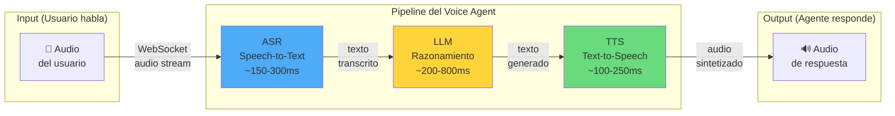
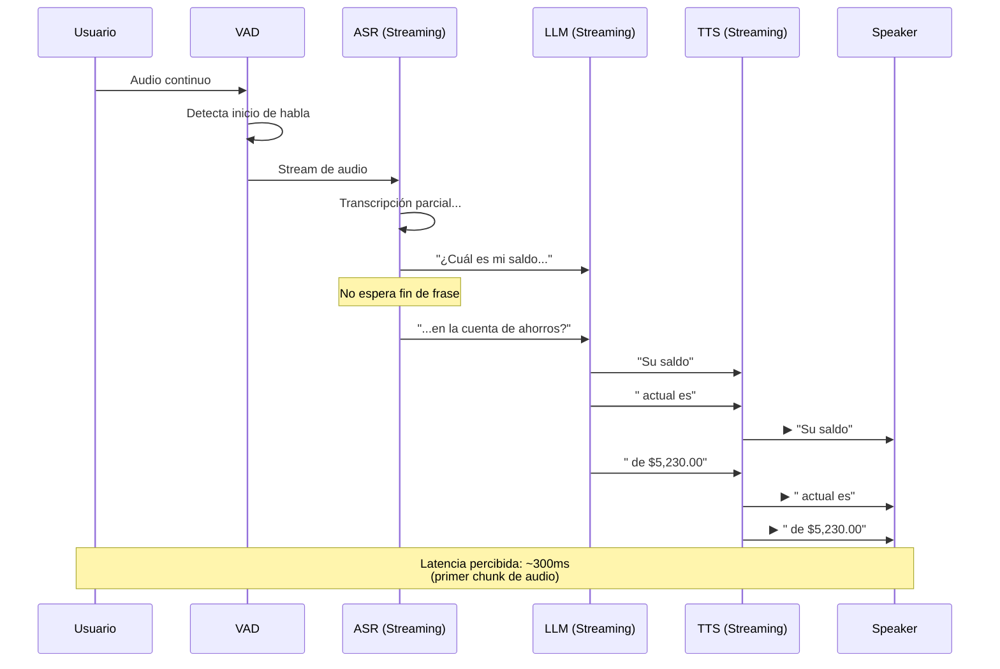
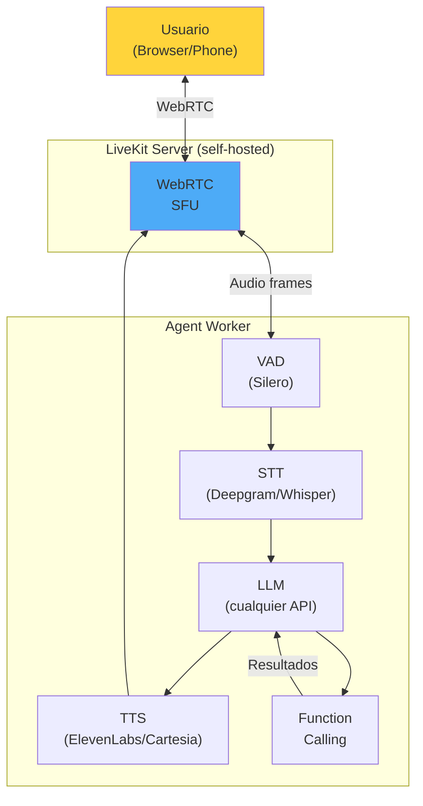

---
tags:
  - concepto
  - agentes
  - herramienta
aliases:
  - agentes de voz
  - conversational voice agents
  - voice AI agents
  - agentes conversacionales de voz
created: 2025-06-01
updated: 2025-06-01
category: agentes-ia
status: volatile
difficulty: intermediate
related:
  - "[[agent-architectures]]"
  - "[[agent-tool-use]]"
  - "[[streaming-llm]]"
  - "[[latency-optimization]]"
  - "[[real-time-ai]]"
  - "[[customer-support-agents]]"
  - "[[speech-to-text]]"
up: "[[moc-agentes]]"
---

# Voice Agents (Agentes de Voz Conversacionales)

> [!abstract] Resumen
> Los **agentes de voz** (*voice agents*) son sistemas de IA que mantienen conversaciones habladas en tiempo real con usuarios humanos, combinando reconocimiento automático de habla (*ASR*), un modelo de lenguaje (*LLM*) y síntesis de voz (*TTS*) en un pipeline de ==latencia ultra-baja (<500ms roundtrip)==. Plataformas como Vapi, Retell, ElevenLabs Conversational AI y LiveKit Agents han democratizado su construcción, pero los desafíos de ==latencia, toma de turnos, detección de interrupciones y comprensión emocional== siguen siendo problemas abiertos. El mercado de voice agents se proyecta a ==más de $8B para 2027==, impulsado por customer support, agendamiento de citas y ventas outbound. ^resumen

## Qué es y por qué importa

Un **agente de voz** (*voice agent*) es un sistema que permite a un usuario mantener una conversación hablada natural con una IA. A diferencia de los chatbots de texto, los voice agents operan bajo ==restricciones de tiempo real extremas==: un humano percibe una pausa de más de 800ms como antinatural, y de más de 1.5s como un fallo del sistema.

El problema fundamental que resuelven es la ==brecha de accesibilidad entre interfaces de texto y la forma más natural de comunicación humana: la voz==. Millones de interacciones de soporte, ventas y servicio ocurren por teléfono, y automatizarlas requiere agentes que puedan hablar, escuchar, interrumpir y ser interrumpidos de forma natural.

> [!tip] Cuándo usar voice agents
> - **Usar cuando**: El canal de comunicación es telefónico, el usuario no puede o no quiere usar texto, se necesita empatía en la interacción, el flujo es semi-estructurado (agendar citas, verificar datos, FAQ)
> - **No usar cuando**: La tarea requiere razonamiento complejo multi-paso, el usuario necesita revisar información visualmente, la precisión factual es crítica sin verificación humana
> - Ver [[agent-architectures]] para entender dónde encajan en el panorama general de agentes
> - Ver [[streaming-llm]] para las técnicas de streaming que hacen posible la baja latencia

---

## Arquitectura del pipeline ASR → LLM → TTS

### El pipeline clásico

La arquitectura fundamental de un voice agent consiste en tres componentes conectados en serie, donde ==cada milisegundo de latencia se acumula==.



### Desglose de latencia

| Componente | Latencia típica | Mejor caso | Técnica de optimización |
|-----------|----------------|-----------|------------------------|
| **ASR** (*Automatic Speech Recognition*) | 150-300ms | ~80ms | Streaming ASR con Whisper turbo, Deepgram Nova-2 |
| **VAD** (*Voice Activity Detection*) | 20-50ms | ~10ms | Silero VAD, WebRTC VAD integrado |
| **LLM Inference** | 200-800ms | ~100ms | ==Streaming token-by-token==, modelos pequeños, edge inference |
| **TTS** (*Text-to-Speech*) | 100-250ms | ~50ms | Streaming TTS, voice cloning pre-cached |
| **Red/Transport** | 30-100ms | ~10ms | ==Edge deployment==, WebRTC vs WebSocket |
| **Total roundtrip** | ==500-1500ms== | ~250ms | Optimización end-to-end |

> [!warning] El presupuesto de latencia es implacable
> Para una conversación natural, el roundtrip total debe ser ==<500ms==. Considerando que solo el LLM puede tomar 200-800ms, el margen para los demás componentes es mínimo. Cada componente adicional (RAG, guardrails, function calling) añade latencia. La arquitectura de un voice agent es esencialmente un ==ejercicio de ingeniería de latencia==.

### Pipeline con streaming (estado del arte)

La clave para reducir la latencia percibida es el *streaming* end-to-end: no esperar a que cada componente termine completamente antes de pasar al siguiente.



> [!info] Streaming reduce la latencia percibida, no la real
> El tiempo total para generar la respuesta completa es el mismo, pero el usuario ==escucha el primer chunk de audio mucho antes==. Esta técnica se llama *time-to-first-byte* (TTFB) optimization y es la misma que se usa en streaming de video.

---

## Componentes críticos

### Voice Activity Detection (VAD)

*VAD* es el componente que determina ==cuándo el usuario está hablando y cuándo ha dejado de hablar==. Parece trivial pero es uno de los problemas más difíciles:

- **Falsos positivos**: Ruido de fondo interpretado como habla → el agente se interrumpe innecesariamente
- **Falsos negativos**: El usuario habla pero el VAD no lo detecta → el agente no responde
- **Endpointing**: Determinar cuándo el usuario ha terminado una frase vs. cuando hace una pausa para pensar

> [!example]- Configuración de Silero VAD
> ```python
> import torch
>
> # Silero VAD - modelo ligero para detección de voz
> model, utils = torch.hub.load(
>     repo_or_dir='snakers4/silero-vad',
>     model='silero_vad',
>     force_reload=False
> )
>
> (get_speech_timestamps,
>  save_audio,
>  read_audio,
>  VADIterator,
>  collect_chunks) = utils
>
> # Configuración para voice agents
> vad_iterator = VADIterator(
>     model,
>     threshold=0.5,          # Sensibilidad (0.0-1.0)
>     sampling_rate=16000,    # 16kHz es estándar
>     min_silence_duration_ms=300,  # Pausa mínima para considerar fin de turno
>     speech_pad_ms=100       # Padding alrededor del habla detectada
> )
>
> # En producción: min_silence_duration_ms es CRÍTICO
> # - Muy bajo (100ms): interrumpe pausas naturales del usuario
> # - Muy alto (800ms): latencia inaceptable antes de responder
> # - Sweet spot: 250-400ms dependiendo del caso de uso
> ```

### Turn-taking e interrupciones

La *toma de turnos* (*turn-taking*) en conversaciones humanas es extraordinariamente compleja. Los humanos predicen cuándo su interlocutor va a terminar de hablar y ==comienzan a formular su respuesta antes de que el otro termine==[^1].

| Escenario | Comportamiento esperado | Dificultad |
|-----------|------------------------|-----------|
| Usuario termina frase | Agente responde tras breve pausa (~300ms) | Baja |
| Usuario hace pausa larga | Agente espera vs. pregunta "¿sigue ahí?" | Media |
| **Barge-in**: Usuario interrumpe al agente | ==Agente deja de hablar inmediatamente== | Alta |
| Habla simultánea | Determinar quién tiene prioridad | Alta |
| Usuario dice "um", "eh" | No interpretar como fin de turno | Media |
| Ruido de fondo | No confundir con habla del usuario | Media-Alta |

> [!danger] Barge-in mal implementado destruye la experiencia
> Si el usuario interrumpe al agente y este no se detiene inmediatamente, la conversación se vuelve caótica. El *barge-in detection* requiere:
> 1. Detección de voz del usuario mientras el agente habla (echo cancellation)
> 2. Cancelación inmediata del audio en cola
> 3. Flush del buffer de TTS
> 4. El LLM debe recibir la transcripción parcial de lo que dijo antes de ser interrumpido
> 5. Contexto de que fue interrumpido para ajustar su respuesta

---

## Plataformas principales

### Comparativa de plataformas (2025)

| Plataforma | Modelo de negocio | Latencia TTFB | Voces | Integración LLM | Fortaleza principal |
|-----------|-------------------|---------------|-------|-----------------|-------------------|
| **Vapi** | API/SaaS | ~400-600ms | Múltiples proveedores | Cualquier LLM via API | ==Flexibilidad y ecosystem== |
| **Retell** | API/SaaS | ~300-500ms | Propias + ElevenLabs | OpenAI, Anthropic, custom | Facilidad de uso, UX de configuración |
| **ElevenLabs Conversational AI** | API/SaaS | ~300-450ms | ==Propias (calidad líder)== | OpenAI, custom | Calidad de voz superior |
| **LiveKit Agents** | Open source (FOSS) | ~250-500ms | Cualquier TTS | Cualquier LLM | ==Control total, self-hosted== |
| **Bland AI** | API/SaaS | ~400-700ms | Propias | Propietario | Enfocado en llamadas telefónicas |
| **Vocode** | Open source | ~400-800ms | Múltiples | Múltiples | Prototipado rápido |

> [!tip] Mi recomendación según caso de uso
> - **Prototipo rápido**: Vapi o Retell — setup en minutos, buen developer experience
> - **Calidad de voz máxima**: ElevenLabs — sus voces son notablemente más naturales
> - **Control total / self-hosted**: ==LiveKit Agents== — open source, desplegable en tu infraestructura, sin vendor lock-in
> - **Llamadas telefónicas masivas**: Bland AI o Vapi con integración Twilio
> - Ver [[agent-tool-use]] para cómo estos agentes ejecutan acciones (agendar citas, consultar bases de datos)

### Vapi

Vapi se posiciona como el "Twilio de los voice agents". Su propuesta de valor es la ==orquestación del pipeline completo==: conecta ASR, LLM, TTS y telefonía en una sola API.

> [!example]- Configuración de un agente Vapi
> ```json
> {
>   "name": "Agente de soporte",
>   "model": {
>     "provider": "anthropic",
>     "model": "claude-sonnet-4-20250514",
>     "systemPrompt": "Eres un agente de soporte técnico...",
>     "temperature": 0.3,
>     "tools": [
>       {
>         "type": "function",
>         "function": {
>           "name": "lookup_order",
>           "description": "Busca el estado de un pedido",
>           "parameters": {
>             "type": "object",
>             "properties": {
>               "order_id": { "type": "string" }
>             }
>           }
>         }
>       }
>     ]
>   },
>   "voice": {
>     "provider": "elevenlabs",
>     "voiceId": "rachel",
>     "stability": 0.6,
>     "similarityBoost": 0.8
>   },
>   "transcriber": {
>     "provider": "deepgram",
>     "model": "nova-2",
>     "language": "es"
>   },
>   "silenceTimeoutSeconds": 30,
>   "maxDurationSeconds": 600,
>   "endCallMessage": "Gracias por llamar. ¡Que tenga un buen día!"
> }
> ```

### LiveKit Agents

*LiveKit Agents* es el framework open source más completo para construir voice agents. Su ventaja principal es que ==puedes self-hostear todo el stack== y tener control total sobre la latencia y la privacidad de datos.



> [!example]- Agente mínimo con LiveKit
> ```python
> from livekit.agents import AutoSubscribe, JobContext, WorkerOptions, cli
> from livekit.agents.voice import AgentSession, Agent
> from livekit.plugins import deepgram, openai, silero, elevenlabs
>
> async def entrypoint(ctx: JobContext):
>     await ctx.connect(auto_subscribe=AutoSubscribe.AUDIO_ONLY)
>
>     session = AgentSession(
>         vad=silero.VAD.load(),
>         stt=deepgram.STT(language="es"),
>         llm=openai.LLM(model="gpt-4o-mini"),
>         tts=elevenlabs.TTS(voice="Rachel"),
>     )
>
>     await session.start(
>         room=ctx.room,
>         agent=Agent(
>             instructions="""Eres un agente de soporte técnico amable.
>             Hablas en español. Eres conciso en tus respuestas.
>             Si no sabes algo, dilo honestamente."""
>         ),
>     )
>
> if __name__ == "__main__":
>     cli.run_app(WorkerOptions(entrypoint_fnc=entrypoint))
> ```

---

## Protocolos de transporte: WebSocket vs WebRTC

| Aspecto | WebSocket | WebRTC |
|---------|-----------|--------|
| **Latencia** | 50-150ms | ==10-50ms== |
| **NAT traversal** | No (requiere proxy) | Sí (ICE/STUN/TURN) |
| **Echo cancellation** | Manual | ==Integrado en browsers== |
| **Calidad adaptativa** | Manual | Automática (bandwidth estimation) |
| **Complejidad server** | Baja | Alta (SFU/MCU) |
| **Peer-to-peer** | No | Sí |
| **Uso en voice agents** | APIs simples (Vapi, Retell) | ==LiveKit, Daily.co== |

> [!info] Por qué WebRTC domina en voice agents de calidad
> WebRTC fue diseñado para comunicación en tiempo real. Incluye:
> - **AEC** (*Acoustic Echo Cancellation*): Elimina el eco del speaker captado por el micrófono — ==esencial para barge-in==
> - **AGC** (*Automatic Gain Control*): Normaliza el volumen
> - **NS** (*Noise Suppression*): Reduce ruido de fondo
> - **Jitter buffer**: Suaviza variaciones de latencia
> - Todo esto viene "gratis" en los navegadores, y reimplementarlo sobre WebSocket es un esfuerzo significativo

---

## Casos de uso principales

### 1. Soporte al cliente (*Customer Support*)

El caso de uso más maduro. Empresas como airlines, bancos y telecoms ya usan voice agents para ==manejar el 30-50% de llamadas de primer nivel==.

> [!example]- Flujo de soporte con voice agent
> ```mermaid
> flowchart TD
>     A["Llamada entrante"] --> B["Voice Agent<br/>saluda"]
>     B --> C["Identifica intención"]
>     C --> D{"¿Puede resolver?"}
>     D -->|"Sí"| E["Resuelve<br/>(consulta saldo,<br/>estado de envío,<br/>FAQ)"]
>     D -->|"No"| F["Escala a<br/>agente humano"]
>     E --> G["Confirma resolución"]
>     G --> H["Encuesta CSAT"]
>     F --> I["Transfiere con<br/>contexto completo"]
>
>     style E fill:#69db7c
>     style F fill:#ffd43b
> ```

### 2. Agendamiento de citas (*Appointment Scheduling*)

Voice agents que llaman o reciben llamadas para agendar citas médicas, de servicio técnico, o consultas profesionales. ==Integración con calendarios (Google Calendar, Cal.com) via function calling==.

### 3. Ventas outbound (*Outbound Sales*)

Agentes que realizan llamadas salientes para calificación de leads, seguimiento de prospectos, o encuestas. Este es el caso de uso más ==controversial éticamente== — la línea entre asistencia y spam es delgada.

> [!warning] Regulación y ética en llamadas outbound
> - Varios países y estados de EE.UU. están legislando la ==obligación de declarar que es una IA== al inicio de la llamada
> - La FTC ha emitido guidelines contra el uso de voice AI para suplantación de identidad
> - El GDPR requiere consentimiento explícito para llamadas automatizadas en la UE
> - ==Recomendación: siempre identificar al agente como IA al inicio de la conversación==

### 4. Asistentes de voz verticales

Agentes especializados en dominios específicos:
- **Salud**: Triage telefónico, recordatorios de medicación, seguimiento post-consulta
- **Legal**: Intake de casos, recopilación de información inicial
- **Inmobiliario**: Calificación de compradores, agendamiento de visitas
- **Restaurantes**: Reservas, pedidos telefónicos

---

## Limitaciones y desafíos abiertos

> [!failure] Limitaciones actuales
> - **Latencia**: Incluso con optimizaciones, ==la latencia end-to-end es perceptible vs. conversación humana==. Los usuarios notan que "algo no es natural"
> - **Comprensión emocional**: Los modelos de voz detectan tono pero no comprenden estados emocionales complejos (frustración creciente, sarcasmo, urgencia genuina)
> - **Razonamiento mid-conversation**: Si el usuario plantea un problema complejo que requiere múltiples pasos de razonamiento, ==el agente debe pensar mientras mantiene la conversación fluida== — un problema fundamentalmente difícil
> - **Multilingüismo en tiempo real**: Cambiar de idioma mid-conversation (code-switching) sigue siendo problemático
> - **Acentos y dialectos**: Los modelos ASR tienen sesgos hacia acentos estándar. ==El rendimiento degrada significativamente con acentos regionales fuertes==
> - **Contexto largo en voz**: Mantener coherencia en conversaciones de >10 minutos es difícil porque la transcripción acumulada consume tokens rápidamente

> [!danger] Riesgo de confianza excesiva
> Los voice agents con voces naturales generan ==una ilusión de competencia mayor que los chatbots de texto==. Los usuarios tienden a confiar más en un agente que "suena humano", lo que amplifica el riesgo de [[hallucinations|alucinaciones]] en dominios donde la precisión importa.

> [!question] Debate abierto: ¿Voz nativa o pipeline?
> - **Pipeline (ASR→LLM→TTS)**: Enfoque actual dominante. Cada componente se puede optimizar independientemente, pero ==la latencia se acumula==
> - **Modelos de voz nativos** (GPT-4o voice, Gemini voice): Un solo modelo que procesa audio-in, audio-out directamente. Potencialmente menor latencia, mejor comprensión de tono y emoción, pero ==menos control y más difícil de debuggear==
> - **Mi valoración**: Los modelos nativos dominarán a medio plazo (2026-2027), pero el pipeline seguirá siendo relevante donde se necesite control granular sobre cada componente

---

## Estado del arte (2025-2026)

### Tendencias clave

1. **Modelos de voz multimodales nativos**: GPT-4o, Gemini 2.5 y Claude ya procesan audio directamente. ==La convergencia hacia modelos audio-nativos reducirá la latencia a <200ms==
2. **Voice cloning ético**: ElevenLabs, Cartesia y PlayHT permiten clonar voces con ==pocos segundos de muestra==. Esto plantea problemas de deepfakes de voz
3. **Agents-as-a-Service**: Plataformas que ofrecen voice agents preconfigurados para industrias específicas (salud, finanzas, retail)
4. **Regulación emergente**: La EU AI Act clasifica ciertos voice agents como sistemas de alto riesgo, requiriendo ==transparencia sobre la naturaleza artificial del interlocutor==[^2]
5. **Edge deployment**: Inferencia de modelos pequeños directamente en el dispositivo para eliminar latencia de red

> [!success] Hitos alcanzados en 2025
> - Latencia TTFB consistente <300ms en plataformas líderes
> - Voces sintéticas indistinguibles de voces humanas en tests A/B
> - ==Function calling en tiempo real== (el agente ejecuta acciones mientras habla)
> - Soporte multilingüe con cambio de idioma mid-conversation en modelos frontier

---

## Relación con el ecosistema

> [!info] Conexiones con mis herramientas
> - **[[intake-overview|intake]]**: Un voice agent podría servir como ==interfaz de voz para intake==, permitiendo al usuario describir verbalmente su proyecto mientras intake estructura la especificación. La transcripción de la conversación alimentaría el sistema de [[prompt-engineering|prompts]] de intake
> - **[[architect-overview|architect]]**: Architect no interactúa directamente con voice agents, pero las técnicas de ==streaming y latencia optimización== que usan los voice agents son relevantes para el diseño de la interfaz de architect. Además, architect podría generar el código de un voice agent usando su [[architect-overview#ralph-loop|Ralph loop]]
> - **[[vigil-overview|vigil]]**: Vigil debería ==escanear las dependencias de los voice agents==: SDKs de ASR/TTS, paquetes de WebRTC, librerías de audio. Las supply chain attacks en paquetes de audio procesamiento son un vector real
> - **[[licit-overview|licit]]**: Los voice agents tienen implicaciones legales significativas: ==grabación de llamadas, consentimiento, regulación de telecomunicaciones, protección de datos de voz (biométricos)==. Licit debe validar compliance con regulaciones locales antes de desplegar un voice agent

---

## Enlaces y referencias

**Notas relacionadas:**
- [[agent-architectures]] — Dónde encajan los voice agents en la taxonomía de agentes
- [[agent-tool-use]] — Function calling en voice agents para ejecutar acciones
- [[streaming-llm]] — Técnicas de streaming críticas para la latencia
- [[hallucinations]] — Riesgo amplificado por la confianza que genera la voz natural
- [[latency-optimization]] — Ingeniería de latencia end-to-end
- [[real-time-ai]] — Paradigma de IA en tiempo real
- [[customer-support-agents]] — Caso de uso principal
- [[agent-evaluation]] — Cómo evaluar la calidad de un voice agent

> [!quote]- Referencias bibliográficas
> - Vapi Documentation: https://docs.vapi.ai
> - LiveKit Agents Framework: https://docs.livekit.io/agents/
> - ElevenLabs Conversational AI: https://elevenlabs.io/docs/conversational-ai
> - Retell AI Documentation: https://docs.retellai.com
> - Deepgram Nova-2 ASR: https://deepgram.com/learn/nova-2
> - Silero VAD: https://github.com/snakers4/silero-vad
> - Skantze, G., "Turn-taking in Conversational Systems and Human-Robot Interaction", Computer Speech & Language, 2021
> - EU AI Act, Annex III: High-Risk AI Systems, 2024

[^1]: Skantze, G., "Turn-taking in Conversational Systems and Human-Robot Interaction", Computer Speech & Language, 2021. Análisis detallado de los mecanismos de toma de turnos y su aplicación a sistemas conversacionales.
[^2]: EU AI Act, Artículo 52, 2024. Obligación de transparencia para sistemas de IA que interactúan directamente con personas naturales.
