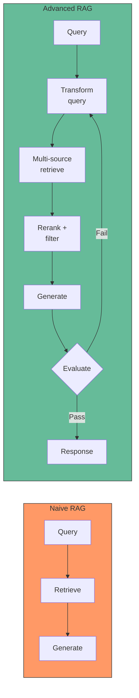
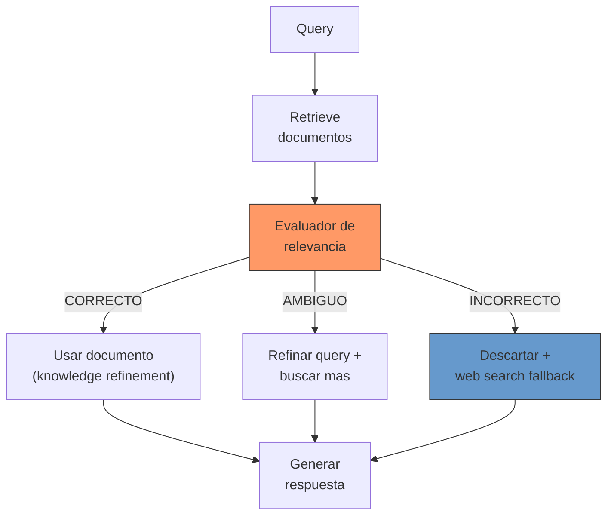
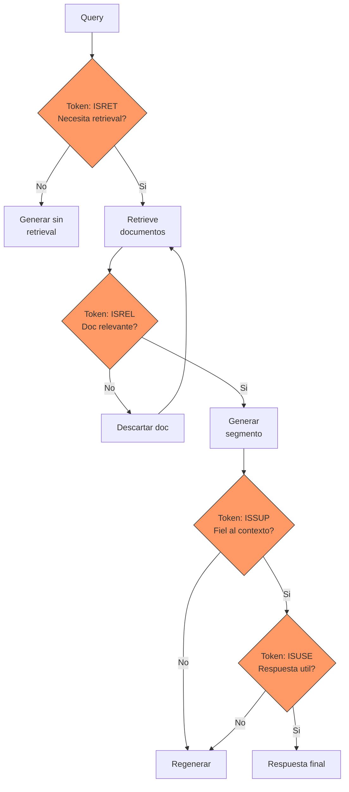
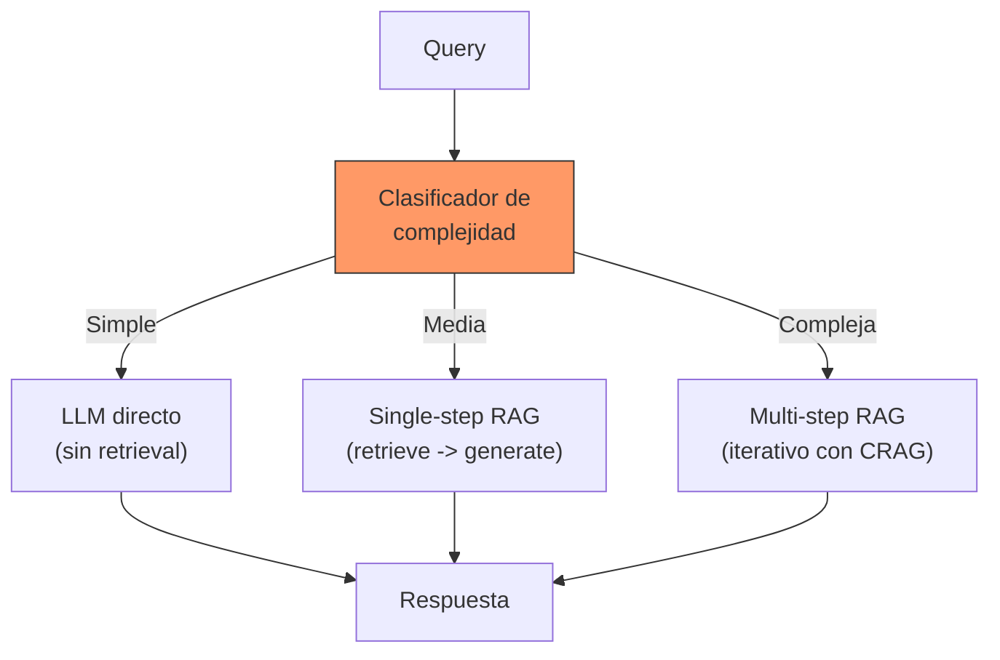
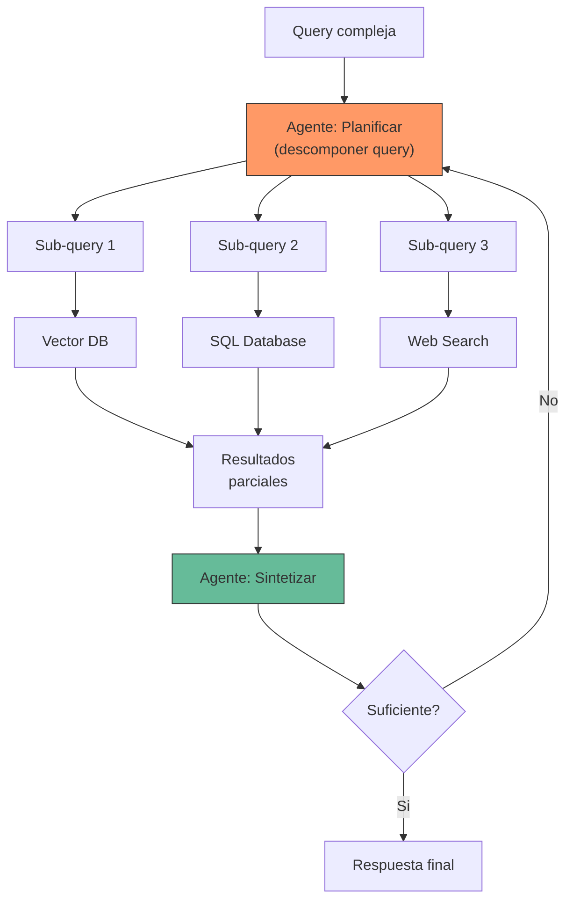
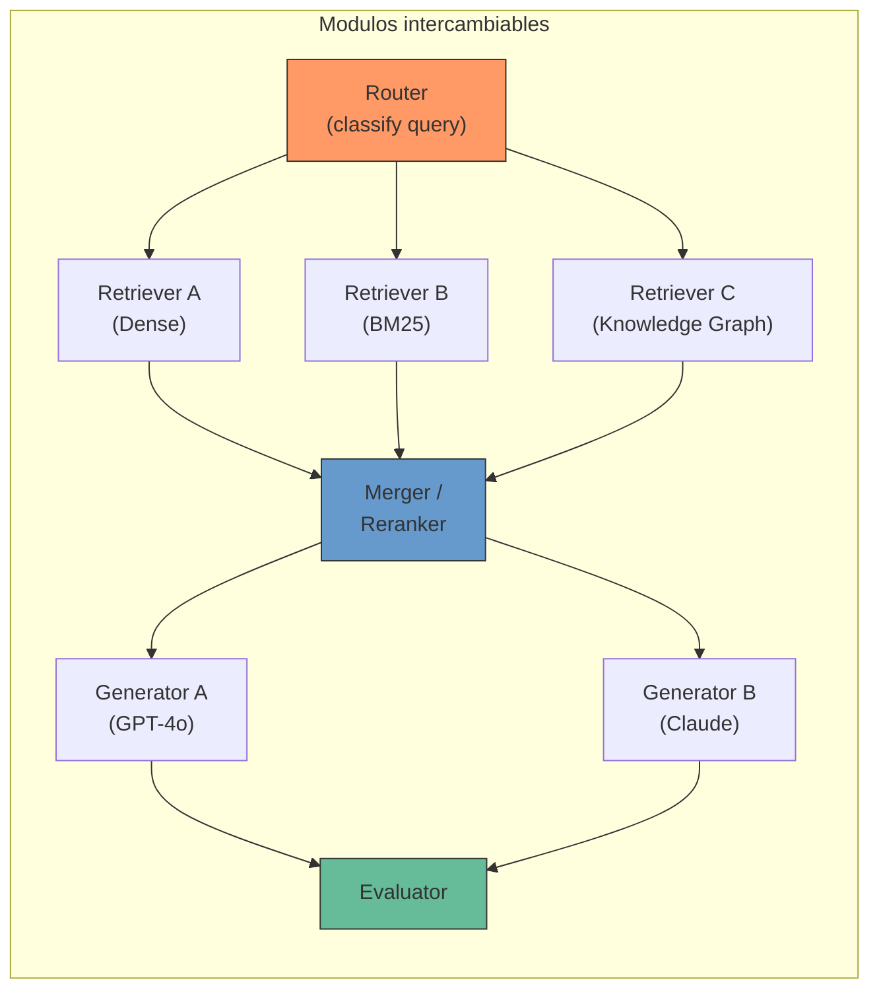
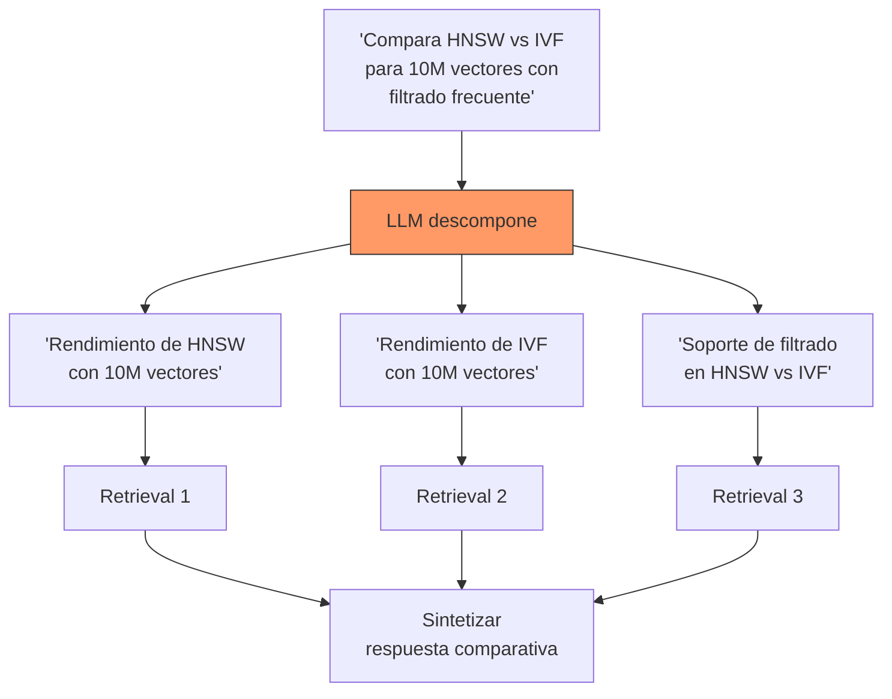
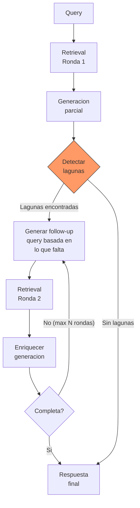
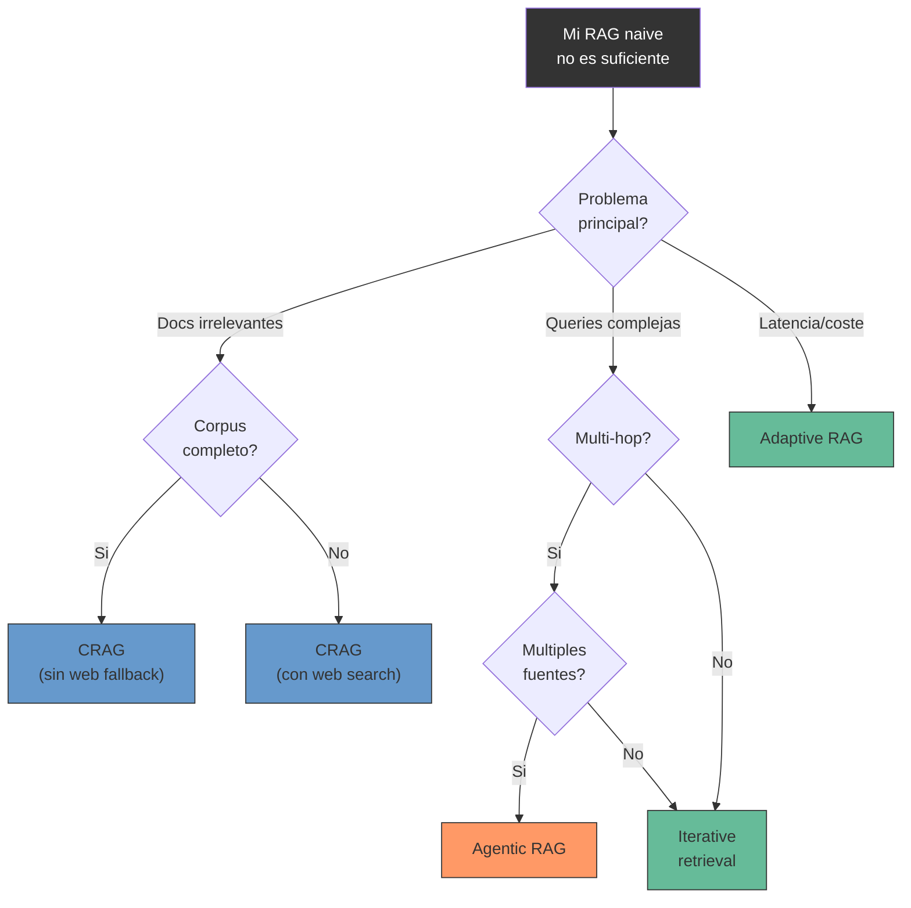

---
tags:
  - tecnica
  - rag
  - agentes
  - avanzado
  - arquitectura
aliases:
  - RAG avanzado
  - advanced RAG
  - CRAG
  - Self-RAG
  - Adaptive RAG
  - Agentic RAG
created: 2025-06-01
updated: 2025-06-01
category: tecnicas-retrieval
status: evergreen
difficulty: advanced
related:
  - "[[retrieval-strategies]]"
  - "[[reranking]]"
  - "[[pattern-rag]]"
  - "[[vector-databases]]"
  - "[[embeddings]]"
  - "[[que-es-un-agente-ia]]"
  - "[[hallucinations]]"
  - "[[agent-loop]]"
up: "[[moc-rag-retrieval]]"
---

# Advanced RAG

> [!abstract] Resumen
> Mas alla del RAG naive (retrieve-then-read), los patrones avanzados anaden inteligencia al pipeline para decidir ==cuando buscar, como evaluar los resultados y cuando iterar==. Este documento cubre Corrective RAG (CRAG), Self-RAG, Adaptive RAG, Agentic RAG, Modular RAG, query transformation, iterative retrieval, y optimizaciones pre y post-retrieval, con diagramas de arquitectura y tablas comparativas para elegir el patron adecuado. ^resumen

## De naive RAG a advanced RAG

El *naive RAG* sigue un flujo lineal: query -> retrieve -> generate. Funciona razonablemente bien pero tiene limitaciones fundamentales:

1. **Siempre busca**, incluso cuando el LLM ya sabe la respuesta
2. **No evalua** la calidad de los documentos recuperados
3. **No itera** si la primera busqueda no es suficiente
4. **No transforma** la query para mejorar el retrieval

==Advanced RAG anade bucles de retroalimentacion, evaluacion de calidad y rutas de decision==, transformando el pipeline lineal en un sistema adaptativo.

> [!tip] Cuando necesitas Advanced RAG
> - El naive RAG produce hallucinations frecuentes por documentos irrelevantes
> - Las queries son complejas o multi-hop (requieren informacion de multiples fuentes)
> - Necesitas alta fiabilidad (aplicaciones medicas, legales, financieras)
> - El corpus puede estar incompleto y necesitas fallback a busqueda web

---

## Corrective RAG (CRAG)

*Corrective RAG*[^1] introduce un **evaluador de relevancia** que clasifica cada documento recuperado antes de pasarlo al LLM, con acciones correctivas segun la clasificacion.

### Componentes de CRAG

| Componente | Funcion | Implementacion tipica |
|---|---|---|
| **Retrieval Evaluator** | Clasifica docs en correct/ambiguous/incorrect | LLM con prompt de evaluacion o classifier fine-tuned |
| **Knowledge Refinement** | Extrae solo las partes relevantes de docs correctos | LLM con prompt extractivo |
| **Web Search Fallback** | Busca en web cuando todos los docs son incorrectos | Tavily, Serper, SerpAPI |
| **Knowledge Strip** | Descompone docs en oraciones y filtra individualmente | Sentence splitter + evaluador |

> [!success] Cuando CRAG brilla
> - La base de conocimiento puede estar incompleta o desactualizada
> - Las queries frecuentemente caen fuera del dominio
> - ==Se necesita un fallback robusto cuando el corpus falla==
> - Mejora tipica: 10-20% en precision sobre naive RAG

> [!danger] Riesgos de CRAG con web search
> El fallback a web search introduce contenido no controlado. ==Documentos web pueden contener prompt injections, desinformacion o datos desactualizados==. [[vigil-overview|vigil]] debe escanear los resultados web antes de incluirlos en el contexto del LLM.

---

## Self-RAG

*Self-RAG*[^2] entrena al modelo para generar **tokens especiales de reflexion** que controlan el flujo del pipeline de forma autonoma.

### Tokens de reflexion de Self-RAG

| Token | Decision | Opciones | Impacto |
|---|---|---|---|
| `[Retrieve]` | Necesita buscar? | Yes / No / Continue | Evita retrieval innecesario |
| `[IsRel]` | Doc relevante? | Relevant / Irrelevant | Filtra ruido |
| `[IsSup]` | Generacion fiel al doc? | ==Fully Supported== / Partially / No | Reduce hallucinations |
| `[IsUse]` | Respuesta util? | 1-5 (escala) | Asegura calidad |

> [!warning] Self-RAG requiere fine-tuning
> A diferencia de otros patrones que usan prompting, Self-RAG ==requiere un modelo fine-tuned== que genere los tokens de reflexion nativamente. El modelo original usa Llama-2 7B/13B fine-tuned con datos generados por GPT-4. Esto limita su adopcion en produccion donde no siempre se puede hacer fine-tuning.

> [!question] Self-RAG vs CRAG: cual elegir
> - **CRAG**: mas facil de implementar (solo prompting), funciona con cualquier LLM, pero ==el evaluador externo anade latencia==
> - **Self-RAG**: evaluacion integrada en la generacion (mas eficiente), pero ==requiere modelo fine-tuned==
> - Para la mayoria de equipos, CRAG es mas practico. Self-RAG es superior si puedes invertir en fine-tuning.

---

## Adaptive RAG

*Adaptive RAG*[^3] usa un **clasificador de complejidad** de query para decidir que nivel de retrieval aplicar. ==Evita el overhead de retrieval complejo cuando la query es simple==.

### Clasificacion de queries en Adaptive RAG

| Complejidad | Ejemplo | Estrategia | Latencia tipica |
|---|---|---|---|
| Simple (factual directo) | "Quien es el CEO de Apple" | ==LLM directo== | ~200ms |
| Media (requiere contexto) | "Cuales son las metricas del Q3" | Single-step RAG | ~1s |
| Compleja (multi-hop) | "Compara rendimiento Q1-Q4 con el ano anterior" | ==Multi-step iterativo== | ~3-5s |

> [!success] Beneficio principal de Adaptive RAG
> - ==Reduce latencia media un 40%== al evitar retrieval innecesario
> - Reduce costes un 30% (menos llamadas LLM para queries simples)
> - Escala la complejidad del pipeline solo cuando la query lo requiere
> - El clasificador puede ser un modelo ligero (BERT fine-tuned) o un prompt con LLM

---

## Agentic RAG

El *Agentic RAG* es el patron mas avanzado: un [[que-es-un-agente-ia|agente autonomo]] que orquesta herramientas de retrieval como parte de un razonamiento mas amplio. ==El agente decide dinamicamente que buscar, donde buscar y cuando parar==.

### Diferencias clave con RAG tradicional

| Aspecto | RAG Tradicional | Agentic RAG |
|---|---|---|
| Flujo | Fijo (retrieve -> generate) | ==Dinamico (agente decide)== |
| Fuentes | Una (vector DB) | ==Multiples (DB, API, web)== |
| Iteracion | No o fija | ==Adaptativa== |
| Planificacion | Ninguna | ==Query decomposition== |
| Herramientas | Solo retrieval | Retrieval + SQL + API + code |
| Evaluacion | Post-hoc | ==Inline (en cada paso)== |

> [!danger] Complejidad operacional de Agentic RAG
> Agentic RAG es ==significativamente mas complejo== de debuggear, evaluar y mantener. Cada ejecucion puede seguir un camino diferente. Requisitos criticos:
> - Observabilidad detallada (traces de cada decision del agente)
> - Presupuesto de tokens/tiempo por query (evitar loops infinitos)
> - Fallbacks para cuando el agente se "pierde"
> - Testing exhaustivo con queries representativas

> [!info] Frameworks para Agentic RAG
> - **LangGraph**: grafo de estados, ==control fino del flujo de decision==
> - **CrewAI**: colaboracion multi-agente para queries que requieren perspectivas multiples
> - **LlamaIndex Workflows**: event-driven, buena integracion con indices
> - **Architect** ([[architect-overview|architect]]): el Ralph Loop de architect implementa un patron similar con YAML pipelines y 22 capas de seguridad

---

## Modular RAG

*Modular RAG* descompone el pipeline en ==modulos intercambiables y configurables==, permitiendo experimentacion sistematica.

**Ventaja clave**: permite ==A/B testing por componente==. Cambiar solo el reranker, solo el modelo de embedding, o solo el LLM generador sin tocar el resto del pipeline. Esto acelera la optimizacion y facilita la experimentacion con nuevas tecnicas.

---

## Query transformation

Las tecnicas de *query transformation* mejoran la query antes del retrieval:

### Rewriting

El LLM reformula la query para hacerla mas precisa o mejor alineada con el vocabulario del corpus.

### Decomposition

Descompone queries complejas en sub-preguntas atomicas que se resuelven independientemente:

### Expansion

Enriquece la query con terminos relacionados, sinonimos o acronimos expandidos.

| Tecnica | Mejora recall | Coste adicional | Cuando usar |
|---|---|---|---|
| Rewriting | +5-10% | 1 LLM call | Queries mal formuladas |
| Decomposition | ==+15-25%== | 1 LLM call | ==Queries multi-hop== |
| Expansion | +5-10% | 1 LLM call | Vocabulario tecnico diverso |
| HyDE | +10-20% | 1 LLM call | Asimetria query/doc |
| [[retrieval-strategies#multi-query|Multi-query]] | +10-15% | 1 LLM call | Queries ambiguas |

---

## Iterative retrieval

El *iterative retrieval* ejecuta multiples rondas de busqueda donde cada ronda se informa de los resultados y las lagunas de la anterior.

> [!warning] Limites del iterative retrieval
> Establecer siempre un ==maximo de iteraciones (3-5)== y un presupuesto de tokens. Sin limites, el sistema puede entrar en loops degenerativos que consumen recursos sin mejorar la respuesta. Implementar un detector de convergencia que pare cuando los nuevos documentos no aportan informacion nueva.

---

## Optimizaciones pre-retrieval

Tecnicas aplicadas antes de la busqueda:

| Tecnica | Descripcion | Cuando aplicar |
|---|---|---|
| **Query expansion** | Anadir sinonimos, acronimos, traducciones | Vocabulario tecnico variado |
| **HyDE** | Generar documento hipotetico para buscar | Queries cortas y vagas |
| **Step-back** | Abstraer la query a nivel mas general | Queries demasiado especificas |
| **[[retrieval-strategies#self-query|Self-query]]** | Extraer filtros de metadatos de la query | ==Metadatos ricos en el corpus== |
| **Query routing** | Dirigir a la fuente de datos mas apropiada | ==Multiples fuentes de datos== |
| **[[retrieval-strategies#contextual-retrieval|Contextual chunks]]** | Anadir contexto a chunks durante indexacion | Chunks ambiguos fuera de contexto |

---

## Optimizaciones post-retrieval

Tecnicas aplicadas despues de la busqueda y antes de la generacion:

### Reranking

Ver [[reranking]] para una cobertura completa. ==Es la optimizacion post-retrieval con mejor ratio coste/beneficio==.

### Compresion de contexto

Reducir la cantidad de texto pasado al LLM extrayendo solo las partes relevantes de cada documento. Esto reduce coste de tokens y mitiga el problema de [[reranking#lost-in-the-middle|lost in the middle]].

### Diversificacion

Asegurar que los documentos pasados al LLM cubran aspectos diversos de la query, no solo los mas similares (que pueden ser redundantes). Se implementa con *Maximal Marginal Relevance* (MMR):

$$\text{MMR} = \arg\max_{d_i \in R \setminus S} [\lambda \cdot \text{Sim}(d_i, q) - (1-\lambda) \cdot \max_{d_j \in S} \text{Sim}(d_i, d_j)]$$

Donde $\lambda$ controla el balance entre relevancia y diversidad.

---

## Tabla comparativa de patrones avanzados

| Patron | Calidad | Latencia | Complejidad impl. | Coste | Mejor para |
|---|---|---|---|---|---|
| **Naive RAG** | Baja | ==Baja== | ==Baja== | ==Bajo== | Prototipos |
| **CRAG** | Alta | Media | Media | Medio | KB potencialmente incompletas |
| **Self-RAG** | ==Muy alta== | Media | ==Alta (fine-tune)== | Medio | Maxima fidelidad |
| **Adaptive** | Alta | ==Optimizada== | Media | ==Optimizado== | ==Produccion general== |
| **Agentic** | ==Muy alta== | Alta | ==Muy alta== | Alto | Queries complejas multi-hop |
| **Modular** | Variable | Variable | Media | Variable | Experimentacion sistematica |
| **Iterative** | Alta | Alta | Media | Alto | Respuestas exhaustivas |

^tabla-comparativa-advanced-rag

> [!tip] Recomendacion practica de adopcion
> 1. Empezar con ==Naive RAG + [[reranking|reranker]]==
> 2. Anadir busqueda hibrida ([[retrieval-strategies#busqueda-hibrida|dense + BM25]])
> 3. Implementar CRAG si hay problemas de relevancia
> 4. Considerar Adaptive RAG si la variedad de queries es alta
> 5. Solo pasar a Agentic RAG si las queries son realmente multi-hop y multi-source

---

## Diagrama de decision: que patron usar

---

## Relación con el ecosistema

> [!info] Conexiones con mis herramientas
> - **[[intake-overview|intake]]**: el pipeline de intake con sus 12+ parsers alimenta directamente los sistemas Advanced RAG. La capacidad de intake de manejar multiples formatos es especialmente valiosa para Agentic RAG que combina fuentes heterogeneas. El MCP server de intake permite a los agentes consultar documentos normalizados bajo demanda.
> - **[[architect-overview|architect]]**: el ==Ralph Loop de architect es conceptualmente identico al loop de Self-RAG==: planificar -> ejecutar -> evaluar -> decidir si continuar. Los YAML pipelines de architect pueden definir diferentes patrones Advanced RAG como configuraciones intercambiables, y las 22 capas de seguridad protegen contra loops infinitos y ejecucion descontrolada.
> - **[[vigil-overview|vigil]]**: los patrones con web search fallback (CRAG) introducen riesgo de inyeccion desde fuentes no controladas. Las 26 reglas de vigil deben aplicarse a los resultados web antes de incluirlos en el contexto del LLM. La deteccion de slopsquatting de vigil es critica para evitar que paquetes maliciosos se cuelen en el contexto via code retrieval.
> - **[[licit-overview|licit]]**: Agentic RAG con multiples fuentes requiere ==trazabilidad de proveniencia por fuente==. licit verifica que cada fuente tiene autorizacion y que la mezcla de fuentes cumple con EU AI Act Annex IV. El FRIA (Fundamental Rights Impact Assessment) debe considerar los riesgos de cada patron avanzado.

---

## Enlaces y referencias

**Notas relacionadas:**
- [[retrieval-strategies]] -- Estrategias de retrieval que estos patrones orquestan
- [[reranking]] -- Componente post-retrieval clave de Advanced RAG
- [[pattern-rag]] -- El patron base que estos patrones extienden
- [[vector-databases]] -- Infraestructura de almacenamiento subyacente
- [[embeddings]] -- Representaciones vectoriales usadas en retrieval
- [[que-es-un-agente-ia]] -- Fundamentos de agentes para Agentic RAG
- [[agent-loop]] -- El loop de agentes aplicado a RAG
- [[hallucinations]] -- Problema que Advanced RAG mitiga

> [!quote]- Referencias bibliograficas
> - Yan, S. et al. "Corrective Retrieval Augmented Generation", arXiv 2024
> - Asai, A. et al. "Self-RAG: Learning to Retrieve, Generate, and Critique through Self-Reflection", ICLR 2024
> - Jeong, S. et al. "Adaptive-RAG: Learning to Adapt Retrieval-Augmented Large Language Models", NAACL 2024
> - Gao, Y. et al. "Retrieval-Augmented Generation for Large Language Models: A Survey", arXiv 2024
> - Asai, A. et al. "Reliable, Adaptable, and Attributable Language Models with Retrieval", COLM 2024
> - LangChain Documentation, "Advanced RAG Patterns", 2024
> - LlamaIndex Documentation, "Agentic RAG", 2024

[^1]: Yan et al., "Corrective Retrieval Augmented Generation", arXiv 2024. Introduce el patron CRAG con evaluador de relevancia y web search fallback.
[^2]: Asai et al., "Self-RAG: Learning to Retrieve, Generate, and Critique through Self-Reflection", ICLR 2024. Modelo con tokens de reflexion para control autonomo del pipeline.
[^3]: Jeong et al., "Adaptive-RAG: Learning to Adapt Retrieval-Augmented Large Language Models", NAACL 2024. Clasificador de complejidad de queries para routing adaptativo.
