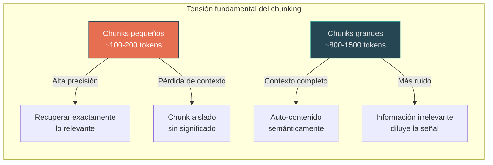
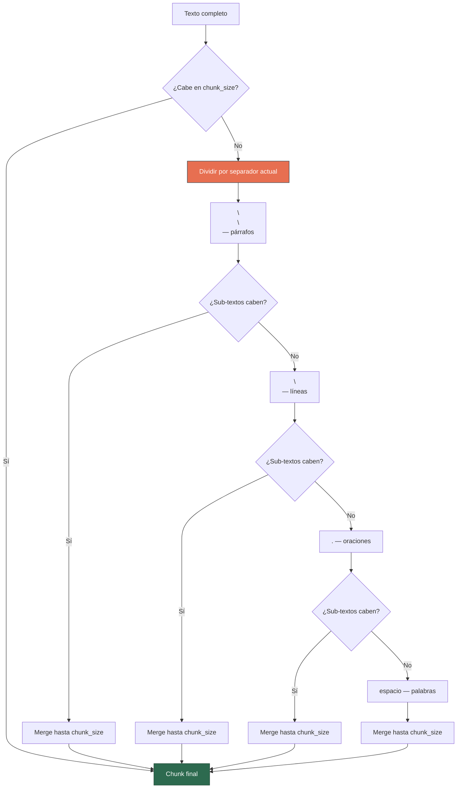
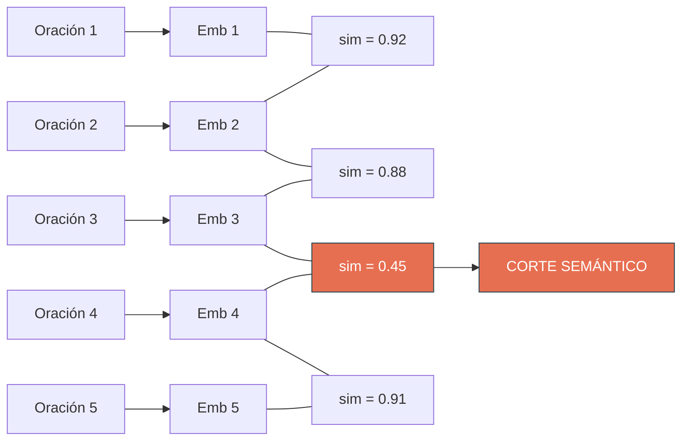
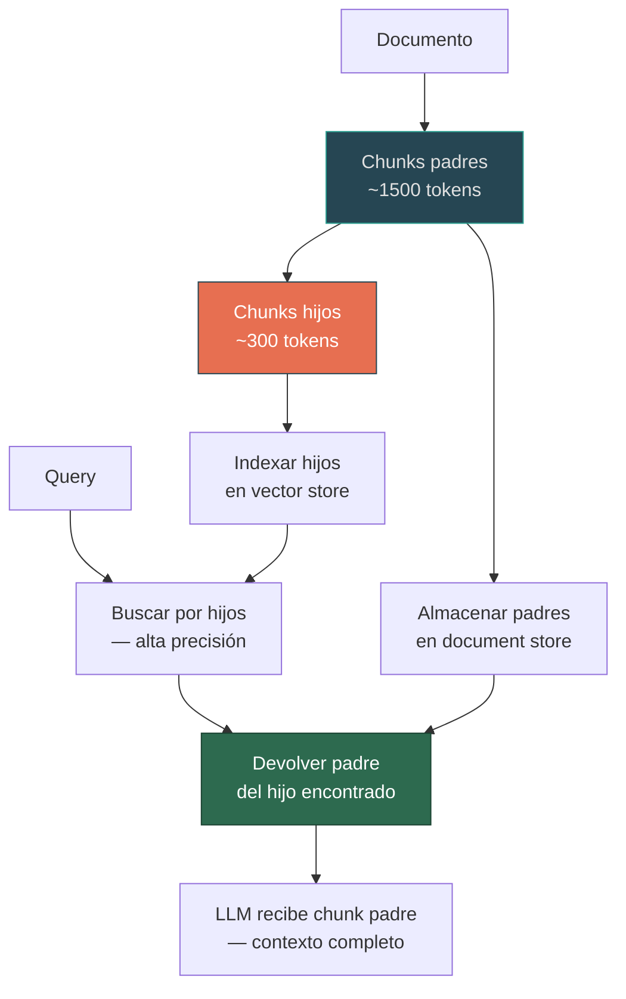
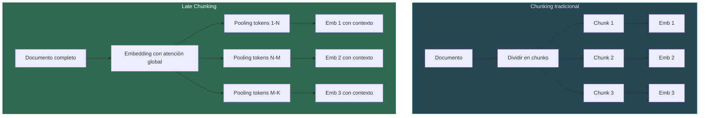

# Estrategias de Chunking para RAG

> [!abstract] Resumen
> El *chunking* (segmentación) es el proceso de dividir documentos en fragmentos que serán las ==unidades atómicas de recuperación en un pipeline RAG==. La estrategia de chunking impacta directamente en la calidad del retrieval: chunks demasiado grandes diluyen la señal, demasiado pequeños pierden contexto. Esta nota cubre siete estrategias principales (fixed-size, recursive, semantic, sentence-level, document-structure-aware, agentic, code chunking), sus trade-offs, y el impacto del chunk size y overlap en la calidad del retrieval.
> ^resumen

## Por qué importa el chunking

> [!danger] Impacto silencioso en calidad
> El chunking es la fase del pipeline RAG que más impacto tiene y menos atención recibe. Un cambio en la estrategia de chunking puede ==mejorar o degradar la calidad del retrieval en un 20-40%== sin tocar ningún otro componente.

El chunking define la ==unidad atómica de información== que el sistema RAG puede recuperar. Debe resolver una tensión fundamental:



### Requisitos de un buen chunk

1. **Auto-contenido** — comprensible sin leer el documento completo
2. **Semánticamente coherente** — trata un solo tema o concepto
3. **Tamaño apropiado** — equilibrio entre contexto y precisión
4. **Metadata preservada** — saber de dónde viene (documento, sección, página)
5. **Solapamiento controlado** — continuidad entre chunks consecutivos

> [!warning] El chunking es específico del dominio
> No existe una estrategia universal. Documentos legales, código fuente, papers científicos y conversaciones requieren estrategias completamente diferentes. ==Siempre validar con datos y queries reales.==

## Estrategia 1: Fixed-Size Chunking

La estrategia más simple: dividir el texto cada N tokens/caracteres con un overlap fijo.

> [!info] Implementación de referencia
> Es el enfoque por defecto en la mayoría de frameworks. Su simplicidad lo hace ideal como baseline contra el cual medir otras estrategias.

### Parámetros

| Parámetro | Rango típico | Recomendación |
|---|---|---|
| *Chunk size* | 256–1024 tokens | ==512 tokens== como punto de partida |
| *Overlap* | 0–25% del chunk size | 10–15% (50–75 tokens para chunks de 512) |
| Unidad de medida | Caracteres, tokens, palabras | ==Tokens== (alineado con el tokenizer del modelo) |

> [!example]- Implementación con LangChain
> ```python
> from langchain.text_splitter import CharacterTextSplitter, TokenTextSplitter
>
> # Chunking por caracteres (simple, rápido)
> char_splitter = CharacterTextSplitter(
>     separator="\n\n",
>     chunk_size=1000,      # ~250 tokens aprox
>     chunk_overlap=200,    # 20% overlap
>     length_function=len
> )
> chunks = char_splitter.split_text(document_text)
>
> # Chunking por tokens (más preciso, recomendado)
> token_splitter = TokenTextSplitter(
>     chunk_size=512,
>     chunk_overlap=64,
>     encoding_name="cl100k_base"  # Tokenizer de OpenAI
> )
> chunks = token_splitter.split_text(document_text)
> ```

**Ventajas:** Simplicidad máxima, velocidad máxima, predecibilidad del tamaño de output.

**Limitaciones:** ==Corta en medio de oraciones, párrafos y secciones==. No respeta la estructura semántica del documento. Chunks resultantes pueden ser incoherentes.

> [!failure] Cuándo NO usar
> Fixed-size chunking es aceptable solo para prototipos rápidos. ==Nunca usar en producción sin al menos medir el impacto vs. recursive splitting.==

## Estrategia 2: Recursive Character Splitting

Divide jerárquicamente usando separadores progresivos: primero `\n\n` (párrafos), luego `\n` (líneas), luego `. ` (oraciones), luego ` ` (palabras).



> [!tip] La opción por defecto más sólida
> El *recursive character splitting* es ==la estrategia recomendada como punto de partida== para la mayoría de documentos de texto. Preserva la estructura de párrafos y oraciones sin complejidad adicional.

> [!example]- Configuración óptima con LangChain
> ```python
> from langchain.text_splitter import RecursiveCharacterTextSplitter
>
> splitter = RecursiveCharacterTextSplitter(
>     chunk_size=512,
>     chunk_overlap=64,
>     separators=[
>         "\n\n",     # Párrafos
>         "\n",       # Líneas
>         ". ",       # Oraciones
>         "? ",       # Preguntas
>         "! ",       # Exclamaciones
>         "; ",       # Punto y coma
>         ", ",       # Comas
>         " ",        # Palabras
>         ""          # Caracteres (último recurso)
>     ],
>     length_function=len,
>     is_separator_regex=False
> )
>
> chunks = splitter.split_text(document_text)
> ```

## Estrategia 3: Semantic Chunking

Divide el texto en puntos donde el ==significado semántico cambia significativamente==. Usa embeddings para detectar transiciones temáticas.

### Algoritmo

1. Dividir el texto en oraciones
2. Generar embeddings para cada oración (o grupo de oraciones)
3. Calcular similitud coseno entre oraciones consecutivas
4. Identificar puntos de corte donde la similitud cae por debajo de un umbral
5. Agrupar oraciones consecutivas similares en chunks



> [!example]- Implementación con LangChain Experimental
> ```python
> from langchain_experimental.text_splitter import SemanticChunker
> from langchain_openai import OpenAIEmbeddings
>
> embeddings = OpenAIEmbeddings(model="text-embedding-3-small")
>
> # Método 1: Percentile — cortar en el percentil X de distancias
> chunker_percentile = SemanticChunker(
>     embeddings,
>     breakpoint_threshold_type="percentile",
>     breakpoint_threshold_amount=75
> )
>
> # Método 2: Standard deviation — cortar cuando distancia > media + N*std
> chunker_std = SemanticChunker(
>     embeddings,
>     breakpoint_threshold_type="standard_deviation",
>     breakpoint_threshold_amount=1.5
> )
>
> # Método 3: Interquartile — cortar basándose en IQR
> chunker_iqr = SemanticChunker(
>     embeddings,
>     breakpoint_threshold_type="interquartile",
>     breakpoint_threshold_amount=1.5
> )
>
> chunks = chunker_percentile.split_text(document_text)
> ```

**Ventajas:** Chunks semánticamente coherentes, respeta transiciones temáticas naturales.

**Limitaciones:** ==Requiere llamadas a modelo de embedding== (costo y latencia), chunks de tamaño variable (puede generar chunks muy grandes o muy pequeños), sensible al modelo de embedding utilizado.

## Estrategia 4: Sentence-Level Chunking

Divide exclusivamente por oraciones, agrupándolas hasta alcanzar el tamaño objetivo.

| Herramienta | Motor de detección | Idiomas | Precisión |
|---|---|---|---|
| NLTK `sent_tokenize` | Punkt tokenizer | ==Muchos== | Buena |
| spaCy `sentencizer` | Reglas / modelo ML | Muchos | ==Muy buena== |
| Stanza | Modelo neural | Muchos | Muy buena |
| `re.split` | Regex simple | Cualquiera | Básica |

> [!warning] Detección de oraciones no es trivial
> Abreviaturas ("Dr.", "U.S.A."), números decimales ("3.14"), URLs y otros patrones hacen que la detección de fin de oración por regex ==falle frecuentemente==. Usar siempre un tokenizer entrenado (NLTK Punkt, spaCy).

> [!info] Cuándo usar
> Ideal para FAQs, bases de conocimiento donde cada oración es una unidad de información auto-contenida, y sistemas de soporte técnico con respuestas cortas y factuales.

## Estrategia 5: Document-Structure-Aware Chunking

Aprovecha la estructura del documento (encabezados, secciones, listas) como guía para definir los límites de los chunks.

### Fuentes de estructura por formato

| Formato | Señales de estructura | Herramienta |
|---|---|---|
| Markdown | `#`, `##`, `###` | ==MarkdownHeaderTextSplitter== |
| HTML | `<h1>`, `<h2>`, `<section>` | HTMLHeaderTextSplitter |
| DOCX | Heading 1, Heading 2, styles | python-docx + custom splitter |
| PDF | Tabla de contenidos, font sizes | Unstructured (modo elements) |
| LaTeX | `\section`, `\subsection` | Custom regex splitter |

> [!example]- Chunking por estructura de Markdown
> ```python
> from langchain.text_splitter import MarkdownHeaderTextSplitter
> from langchain.text_splitter import RecursiveCharacterTextSplitter
>
> # Paso 1: Dividir por encabezados (preserva jerarquía)
> headers_to_split_on = [
>     ("#", "header_1"),
>     ("##", "header_2"),
>     ("###", "header_3"),
> ]
>
> md_splitter = MarkdownHeaderTextSplitter(
>     headers_to_split_on=headers_to_split_on,
>     strip_headers=False  # Mantener encabezados en el texto
> )
> md_header_splits = md_splitter.split_text(markdown_doc)
>
> # Paso 2: Sub-dividir secciones grandes con recursive splitter
> text_splitter = RecursiveCharacterTextSplitter(
>     chunk_size=512,
>     chunk_overlap=64
> )
> final_chunks = text_splitter.split_documents(md_header_splits)
>
> # Cada chunk tiene metadata con la jerarquía de encabezados:
> # {"header_1": "Introducción", "header_2": "Motivación", ...}
> ```

> [!success] Preservación de jerarquía
> La metadata de jerarquía (header_1, header_2, header_3) ==permite filtrado por sección== durante el retrieval. Un usuario preguntando sobre "instalación" puede filtrar chunks donde header_2 contiene "Instalación".

### Patrón: Parent-Child Chunking

Una técnica avanzada que combina chunks pequeños para retrieval preciso con chunks grandes para contexto completo:



> [!tip] Lo mejor de ambos mundos
> *Parent-child chunking* ==combina la precisión de chunks pequeños con el contexto de chunks grandes==. Se busca con granularidad fina pero se envía al LLM con contexto amplio.

## Estrategia 6: Agentic Chunking

Un LLM decide cómo dividir el documento, usando comprensión semántica para crear chunks óptimos.

### Proceso

1. Procesar el documento oración por oración
2. Para cada oración, el LLM decide:
   - ¿Pertenece al chunk actual?
   - ¿Debe iniciar un nuevo chunk?
   - ¿Debería fusionarse con un chunk anterior diferente?
3. Opcionalmente, el LLM genera un título/resumen para cada chunk

> [!example]- Código: Agentic Chunking con proposiciones
> ```python
> from openai import OpenAI
>
> client = OpenAI()
>
> PROPOSITION_PROMPT = """Descompón el siguiente texto en proposiciones atómicas.
> Cada proposición debe:
> 1. Ser auto-contenida (comprensible sin contexto adicional)
> 2. Contener exactamente un hecho o afirmación
> 3. Incluir sujeto y contexto necesario
> 4. Ser desambiguada (reemplazar pronombres por nombres)
>
> Texto:
> {text}
>
> Proposiciones (una por línea):"""
>
> def extract_propositions(text: str) -> list[str]:
>     """Extrae proposiciones atómicas del texto."""
>     response = client.chat.completions.create(
>         model="gpt-4o-mini",
>         messages=[{"role": "user", "content": PROPOSITION_PROMPT.format(text=text)}],
>         temperature=0,
>     )
>     propositions = response.choices[0].message.content.strip().split('\n')
>     return [p.strip('- ').strip() for p in propositions if p.strip()]
> ```

> [!danger] Costo computacional
> Agentic chunking requiere ==una o más llamadas al LLM por cada sección del documento==. Para un corpus de 10K documentos a $0.15/1K tokens con GPT-4o-mini, el costo de chunking puede superar los $500. Solo se justifica para documentos de alto valor donde la calidad del chunking es crítica.

| Aspecto | Agentic Chunking | Recursive Splitting |
|---|---|---|
| Calidad semántica | ==Excelente== | Buena |
| Velocidad | Muy lenta | ==Muy rápida== |
| Costo | Alto (LLM calls) | ==Mínimo== |
| Reproducibilidad | Variable (no determinista) | ==Determinista== |
| Caso de uso | Documentos de alto valor | Procesamiento masivo |

## Estrategia 7: Code Chunking

Para repositorios de código, las estrategias genéricas no funcionan. El chunking debe respetar la estructura sintáctica del lenguaje de programación.

### Unidades naturales de chunking para código

| Lenguaje | Unidad principal | Unidad secundaria |
|---|---|---|
| Python | Función / Clase | Método / Bloque |
| JavaScript/TypeScript | Función / Clase / Módulo | Método |
| Java | Clase | Método |
| Go | Función / Struct | Método |
| Rust | `fn` / `impl` / `mod` | Bloques |

> [!example]- Code chunking con LangChain
> ```python
> from langchain.text_splitter import Language, RecursiveCharacterTextSplitter
>
> # LangChain incluye splitters específicos por lenguaje
> python_splitter = RecursiveCharacterTextSplitter.from_language(
>     language=Language.PYTHON,
>     chunk_size=1000,
>     chunk_overlap=100
> )
> # Separadores jerárquicos para Python:
> # ["\nclass ", "\ndef ", "\n\tdef ", "\n\n", "\n", " ", ""]
>
> js_splitter = RecursiveCharacterTextSplitter.from_language(
>     language=Language.JS,
>     chunk_size=1000,
>     chunk_overlap=100
> )
>
> python_chunks = python_splitter.split_text(python_code)
> ```

> [!tip] Metadata de código
> Para chunks de código, la metadata debe incluir: ==nombre de función/clase, imports, tipo de archivo, ruta del archivo y firma de la función==. Esto permite retrieval filtrado por módulo, clase o tipo.

## Comparación completa de estrategias

| Estrategia | Calidad semántica | Velocidad | Costo | Uniformidad tamaño | Mejor para |
|---|---|---|---|---|---|
| Fixed-size | Baja | ==Muy alta== | ==Mínimo== | ==Alta== | Baseline, prototipado rápido |
| Recursive | ==Buena== | Muy alta | Mínimo | Alta | ==Caso general — default recomendado== |
| Semantic | Muy buena | Media | Medio | Baja | Documentos narrativos extensos |
| Sentence-level | Media | Alta | Mínimo | Media | FAQs, knowledge bases factuales |
| Document-structure | ==Muy buena== | Alta | Mínimo | Media | Docs con encabezados claros |
| Agentic | ==Excelente== | Muy baja | ==Alto== | Variable | Documentos de alto valor |
| Code | Alta | Alta | Mínimo | Media | Repositorios de código fuente |

## Impacto del Chunk Size y Overlap

### Chunk size — no existe un valor universal

> [!question] ¿Cuál es el chunk size óptimo?
> No existe un chunk size universal. El óptimo depende del ==modelo de embedding, la naturaleza de los documentos y el tipo de queries esperadas==. Sin embargo, 256–512 tokens funciona bien para la mayoría de casos.

| Chunk size | Precisión retrieval | Contexto | Costo embedding | Recomendado para |
|---|---|---|---|---|
| 128 tokens | ==Alta== | Bajo | Alto (muchos chunks) | Preguntas muy específicas |
| 256 tokens | Alta | Medio | Medio | ==Balance general== |
| 512 tokens | Media | ==Alto== | Medio | Documentos narrativos |
| 1024 tokens | Baja | Muy alto | Bajo | Long-form QA |
| 2048 tokens | Baja | Muy alto | ==Bajo== | Resúmenes de documentos |

### Overlap — continuidad vs redundancia

El overlap controla cuánto texto se comparte entre chunks consecutivos:

```
Chunk 1: [AAAAAAAAAA|BBBB]
Chunk 2:            [BBBB|CCCCCCCCCC]
                     ^^^^
                     Overlap
```

| Overlap (% del chunk size) | Continuidad | Redundancia | Costo embedding |
|---|---|---|---|
| 0% | Baja (cortes abruptos) | ==Mínima== | Mínimo |
| 10% | Buena | Baja | Bajo |
| ==15%== | ==Óptima para mayoría de casos== | Aceptable | Aceptable |
| 25% | Alta | Alta | Alto |
| 50% | Máxima | Muy alta | Muy alto |

> [!danger] Overlap excesivo
> Un overlap > 25% genera ==redundancia masiva== sin mejora proporcional de calidad. Además, puede causar que el retriever devuelva múltiples chunks con la misma información, desperdiciando slots en el Top-K.

### Benchmark empírico de chunk size

Resultados típicos de evaluación con RAGAS variando chunk size (corpus de documentación técnica, queries factuales):

| Chunk Size | Context Precision | Context Recall | Faithfulness | Answer Relevancy |
|---|---|---|---|---|
| 128 | ==0.89== | 0.61 | 0.82 | 0.78 |
| 256 | 0.85 | 0.74 | ==0.88== | 0.83 |
| 512 | 0.78 | ==0.82== | 0.86 | ==0.85== |
| 1024 | 0.65 | 0.79 | 0.83 | 0.81 |

> [!info] Observación clave
> Chunks pequeños (128) maximizan context precision pero ==sufren en recall== porque cada chunk cubre poco contenido. Chunks de 256–512 ofrecen el mejor balance global. Los resultados varían significativamente por dominio.

### Parámetros recomendados por tipo de documento

| Tipo de documento | Chunk size | Overlap | Estrategia recomendada |
|---|---|---|---|
| Prosa general | 512–1024 tokens | 64–128 | Recursive |
| Legal / regulatorio | 1024–2048 tokens | 128–256 | ==Structure-aware== |
| Papers científicos | 512–768 tokens | 64 | Semantic |
| FAQ / Soporte | 256–512 tokens | 32 | Sentence |
| Código fuente | Función/clase completa | 0 | ==AST / Code== |
| Transcripciones | 512 tokens | 128 | Recursive |

## Técnicas avanzadas complementarias

### Contextual Chunking (Anthropic)

Técnica introducida por Anthropic en 2024[^1] que ==añade un resumen contextual al inicio de cada chunk==:

```
ANTES:
"Los parámetros incluyen max_retries, timeout y batch_size."

DESPUÉS:
"Este fragmento pertenece a la sección 'Configuración del pipeline de ingesta'
del manual de administración del sistema RAG. Los parámetros incluyen
max_retries, timeout y batch_size."
```

> [!success] Resultados demostrados
> Según Anthropic, contextual chunking ==reduce las tasas de fallo de retrieval en un 49%== cuando se combina con búsqueda híbrida (embeddings + BM25)[^1]. Es la técnica con mejor ROI para mejorar retrieval quality.

### Late Chunking (Jina AI)

Técnica que ==genera embeddings del documento completo primero y luego divide en chunks==, preservando la atención global del documento en cada chunk embedding.



> [!tip] Ventaja de Late Chunking
> Cada chunk embedding ==contiene información contextual de todo el documento== gracias a la atención global del transformer. Esto resuelve parcialmente el problema de chunks aislados sin significado.

## Evaluando la calidad del chunking

> [!question] ¿Cómo saber si mi chunking es bueno?
> 1. **Inspección manual** — leer 50 chunks aleatorios, ¿cada uno tiene sentido por sí solo?
> 2. **Retrieval test** — ejecutar 100 queries de test y medir *recall@5*
> 3. **A/B testing** — comparar dos estrategias midiendo [[evaluation-ragas|métricas RAGAS]]
> 4. **Análisis de distribución** — histograma de tamaños de chunk, evitar bimodalidad extrema

## Relación con el ecosistema

El chunking interactúa con múltiples componentes del ecosistema:

- **[[intake-overview]]** — Los 12+ parsers de intake producen documentos estructurados que facilitan el chunking *document-structure-aware*. La preservación de estructura que hace intake (encabezados, listas, tablas) es directamente consumible por splitters jerárquicos. El protocolo *MCP* permite que el chunker reciba metadata rica que guía las decisiones de segmentación.

- **[[architect-overview]]** — Los *YAML pipelines* de architect permiten definir la estrategia de chunking como un paso configurable del pipeline, facilitando A/B testing entre estrategias. El *Ralph Loop* puede iterar sobre configuraciones de chunking evaluando métricas de retrieval automáticamente. Las *worktrees* permiten ejecutar ==múltiples variantes de chunking en paralelo==.

- **[[vigil-overview]]** — Vigil puede detectar *prompt injections* embebidas en documentos que sobreviven al chunking. Sus 26 reglas deben aplicarse ==después del chunking== para detectar chunks que contengan código malicioso o patrones de inyección. El formato *SARIF* permite reportar qué chunks específicos contienen amenazas.

- **[[licit-overview]]** — El chunking de documentos con datos personales debe mantener la trazabilidad requerida por el *EU AI Act*. Cada chunk debe preservar la *provenance* de su documento padre. Los *FRIA* pueden requerir que ciertos datos personales sean excluidos o anonimizados durante el chunking. Licit verifica que chunks de documentos regulatorios mantengan integridad semántica según Annex IV.

## Enlaces y referencias

> [!quote]- Bibliografía
> - Anthropic. (2024). "Contextual Retrieval." https://www.anthropic.com/news/contextual-retrieval
> - Jina AI. (2024). "Late Chunking: Contextual Chunk Embeddings Using Long-Context Embedding Models."
> - Chen, J., et al. (2023). "Dense X Retrieval: What Retrieval Granularity Should We Use?" *arXiv:2312.06648*.
> - LangChain Documentation. "Text Splitters." https://python.langchain.com/docs/how_to/#text-splitters
> - Pinecone. (2024). "Chunking Strategies for LLM Applications."
> - Greg Kamradt. (2023). "5 Levels of Text Splitting."
> - [[rag-pipeline-completo]] — Pipeline completo
> - [[document-ingestion]] — Fase anterior: ingesta
> - [[embedding-models]] — Fase siguiente: embedding

[^1]: Anthropic. "Contextual Retrieval." 2024. Demuestra una reducción del 49% en tasas de fallo de retrieval combinando contextual chunking con búsqueda híbrida.

---

> [!quote] Principio de diseño
> "El mejor chunk es aquel que un humano ==reconocería como una unidad de información completa== y que un modelo de embedding puede representar fielmente."
