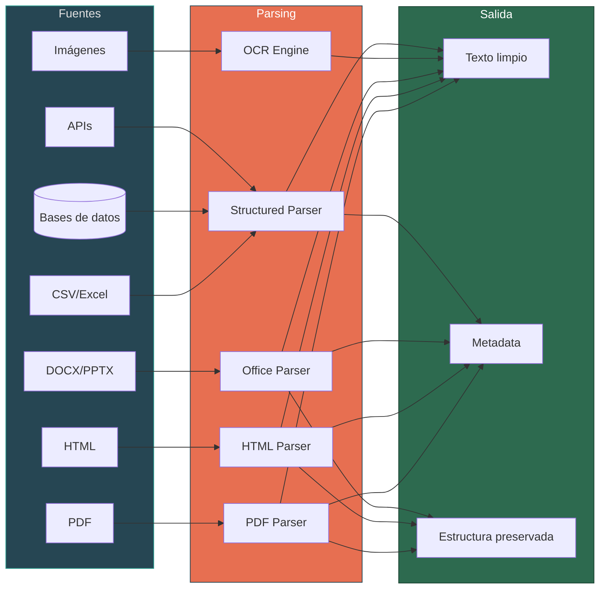
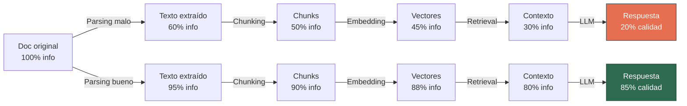
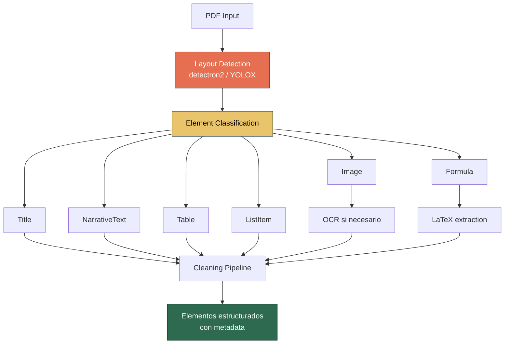
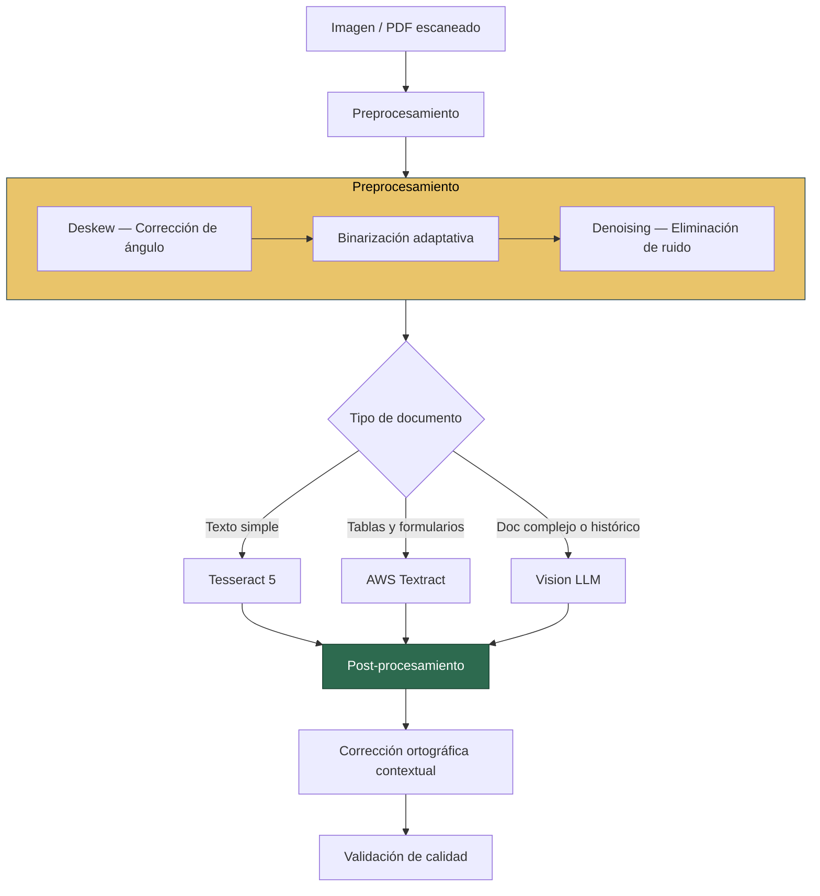
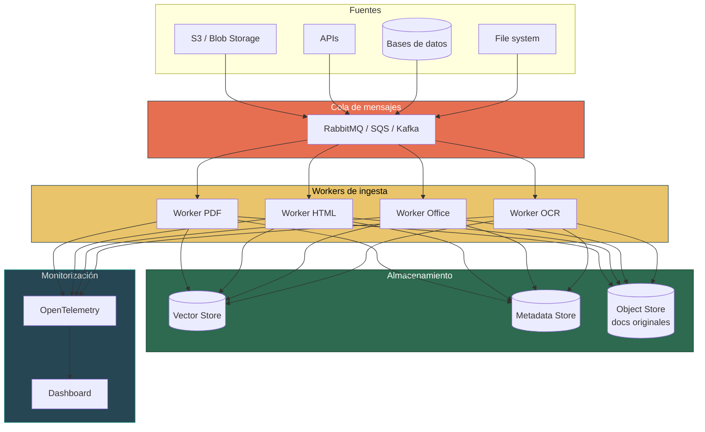

# Ingesta de Documentos para RAG

> [!abstract] Resumen
> La ingesta de documentos (*document ingestion*) es la ==fase fundacional del pipeline RAG==: transforma fuentes heterogéneas (PDF, HTML, Office, imágenes) en texto limpio, estructurado y enriquecido con metadata. Esta nota cubre parsers de PDF, extracción de tablas, procesamiento de HTML y Office, OCR, limpieza de datos, extracción de metadata, y una comparación exhaustiva de herramientas disponibles en 2025.
> ^resumen

## Importancia de la ingesta

> [!danger] El eslabón más débil
> La ingesta es la fase donde más silenciosamente se pierde calidad. Un PDF mal parseado produce chunks sin sentido que ==contaminan todo el pipeline downstream==. A diferencia de otras fases, los errores de ingesta son difíciles de detectar automáticamente. El 60% de los problemas de calidad en sistemas RAG se originan aquí.



### Degradación acumulativa de información



## Parsing de PDFs

Los PDFs son el formato más común y ==el más problemático== para RAG. Un mismo PDF puede contener texto nativo, imágenes escaneadas, tablas complejas, figuras y anotaciones.

### Tipos de PDF y parser recomendado

| Tipo de PDF | Características | Parser recomendado |
|---|---|---|
| Digital (texto nativo) | Texto seleccionable, estructura clara | ==PyMuPDF== (fitz) |
| Escaneado (imagen) | Solo imágenes, sin capa de texto | PaddleOCR + Unstructured |
| Mixto | Páginas digitales + escaneadas | Unstructured (auto-detect) |
| Con formularios | Campos interactivos | PyMuPDF + pdfplumber |
| Tablas complejas | Tablas anidadas, multicolumna | ==LlamaParse== o Camelot |

### Landscape de parsers 2025

| Parser | Tipo | Tablas | OCR | Layout | Velocidad | Calidad |
|---|---|---|---|---|---|---|
| PyMuPDF (fitz) | Local, open source | Básico | No nativo | Básico | ==Muy rápida== | Media |
| pdfplumber | Local, open source | ==Excelente== | No | Bueno | Media | Alta para tablas |
| Unstructured | Local/API, open source | Buena | Sí (Tesseract) | ==Excelente== | Lenta | Alta |
| LlamaParse | API, comercial | Excelente | Sí | Excelente | Media | ==Muy alta== |
| Docling (IBM) | Local, open source | Excelente | Sí | Excelente | Media | Muy alta |
| Marker | Local, open source | Bueno | Sí | Muy bueno | Media | Alta |
| Amazon Textract | API, comercial | Excelente | ==Sí (nativo)== | Excelente | Rápida | Muy alta |
| Azure Document Intelligence | API, comercial | Excelente | Sí (nativo) | Excelente | Rápida | Muy alta |

### PyMuPDF (fitz)

El parser más rápido para PDFs con texto nativo. Ideal para procesamiento masivo donde la velocidad prima sobre la fidelidad de layout.

> [!example]- Extracción con PyMuPDF
> ```python
> import fitz  # PyMuPDF
>
> def extract_with_pymupdf(pdf_path: str) -> list[dict]:
>     """Extrae texto y metadata por página."""
>     doc = fitz.open(pdf_path)
>     pages = []
>     for page_num, page in enumerate(doc):
>         text = page.get_text("text")
>         blocks = page.get_text("dict")["blocks"]
>         pages.append({
>             "page_number": page_num + 1,
>             "text": text,
>             "width": page.rect.width,
>             "height": page.rect.height,
>             "images": len(page.get_images()),
>             "links": [link["uri"] for link in page.get_links() if "uri" in link]
>         })
>     doc.close()
>     return pages
> ```

**Ventajas:** Velocidad extrema (10x más rápido que alternativas), bajo consumo de memoria, API rica.

**Limitaciones:** No maneja bien tablas complejas, no tiene OCR nativo, pierde estructura en layouts multi-columna.

### pdfplumber

Especializado en ==extracción precisa de tablas y datos tabulares==.

> [!example]- Extracción de tablas con pdfplumber
> ```python
> import pdfplumber
>
> def extract_tables(pdf_path: str) -> list[str]:
>     """Extrae todas las tablas del PDF como markdown."""
>     all_tables_md = []
>     with pdfplumber.open(pdf_path) as pdf:
>         for page in pdf.pages:
>             tables = page.extract_tables({
>                 "vertical_strategy": "text",
>                 "horizontal_strategy": "text",
>                 "snap_tolerance": 5,
>                 "join_tolerance": 3,
>             })
>             for table in tables:
>                 if table and len(table) > 1:
>                     headers = table[0]
>                     md = "| " + " | ".join(str(h) for h in headers) + " |\n"
>                     md += "| " + " | ".join("---" for _ in headers) + " |\n"
>                     for row in table[1:]:
>                         md += "| " + " | ".join(str(c) for c in row) + " |\n"
>                     all_tables_md.append(md)
>     return all_tables_md
> ```

### Unstructured

Framework de ingesta completo que maneja múltiples formatos. Su fortaleza es la ==detección automática de layout== y la clasificación de elementos.



> [!tip] Modo "elements" de Unstructured
> El modo `elements` clasifica cada bloque del documento en tipos semánticos (Title, NarrativeText, Table, ListItem). Esto permite ==chunking consciente de la estructura== del documento, donde cada chunk respeta los límites semánticos.

### LlamaParse

Servicio cloud de LlamaIndex que usa ==modelos de visión (VLMs) para parsing== de documentos complejos.

| Característica | Detalle |
|---|---|
| Formato de salida | Markdown estructurado |
| Manejo de tablas | Excelente, incluyendo tablas anidadas y spanning cells |
| Diagramas | Descripción textual de figuras |
| Precio | ~$0.003 por página |
| Límites | 1000 páginas/día en plan gratuito |

> [!warning] Dependencia de API externa
> LlamaParse requiere conexión a internet y envío de documentos a servidores externos. Para documentos confidenciales, considerar alternativas locales como Unstructured o Docling. Esta consideración se alinea con los principios de [[licit-overview]] sobre proveniencia de datos.

## Procesamiento de HTML

El HTML es deceptivamente complejo: la misma información puede representarse con markup radicalmente diferente.

### Estrategias de procesamiento

| Estrategia | Herramienta | Cuándo usar |
|---|---|---|
| Extracción simple | BeautifulSoup + html2text | Páginas simples, artículos |
| Renderizado completo | Playwright + extracción | ==SPAs, contenido dinámico== |
| Selectores CSS | Trafilatura | Artículos de noticias, blogs |
| Readability | Mozilla Readability / readability-lxml | Contenido editorial |
| Crawling + parsing | Firecrawl | Todo-en-uno, API |

> [!example]- Pipeline de extracción HTML
> ```python
> import trafilatura
> from bs4 import BeautifulSoup
> import html2text
>
> def extract_html(url_or_html: str, method: str = "trafilatura") -> dict:
>     """Extrae contenido limpio de HTML."""
>     if method == "trafilatura":
>         downloaded = trafilatura.fetch_url(url_or_html) if url_or_html.startswith("http") else url_or_html
>         result = trafilatura.extract(
>             downloaded,
>             include_tables=True,
>             include_links=True,
>             output_format="json",
>             with_metadata=True
>         )
>         return result
>     elif method == "beautifulsoup":
>         soup = BeautifulSoup(url_or_html, "html.parser")
>         for tag in soup(["script", "style", "nav", "footer", "header", "aside"]):
>             tag.decompose()
>         converter = html2text.HTML2Text()
>         converter.ignore_links = False
>         converter.body_width = 0
>         return {"text": converter.handle(str(soup)), "title": soup.title.string if soup.title else None}
> ```

## Procesamiento de documentos Office

| Formato | Herramienta recomendada | Alternativa |
|---|---|---|
| DOCX | python-docx + Unstructured | mammoth (HTML intermedio) |
| PPTX | python-pptx | Unstructured |
| XLSX | openpyxl + pandas | ==Unstructured== (maneja fórmulas) |

> [!info] Preservación de estructura en DOCX
> Los documentos DOCX contienen estilos (Heading 1, Heading 2, Normal, etc.) que son ==señales valiosas para el chunking==. Extraer estos estilos como metadata permite chunking *document-structure-aware* ([[chunking-strategies]]).

> [!example]- Extracción de DOCX con estilos
> ```python
> from docx import Document
>
> def extract_docx_with_styles(docx_path: str) -> list[dict]:
>     """Extrae texto con estilos semánticos preservados."""
>     doc = Document(docx_path)
>     elements = []
>     for paragraph in doc.paragraphs:
>         if not paragraph.text.strip():
>             continue
>         style = paragraph.style.name
>         element_type = "paragraph"
>         level = 0
>         if style.startswith("Heading"):
>             element_type = "heading"
>             level = int(style.split()[-1]) if style[-1].isdigit() else 1
>         elif style == "List Paragraph":
>             element_type = "list_item"
>         elements.append({
>             "text": paragraph.text,
>             "type": element_type,
>             "level": level,
>             "style": style,
>         })
>     for table in doc.tables:
>         rows = [[cell.text for cell in row.cells] for row in table.rows]
>         if rows:
>             elements.append({"text": _table_to_markdown(rows), "type": "table", "level": 0})
>     return elements
> ```

## OCR — Optical Character Recognition

Para documentos escaneados o imágenes con texto, el OCR es imprescindible.

### Comparación de motores OCR

| Motor | Tipo | Idiomas | Precisión | Velocidad | Costo |
|---|---|---|---|---|---|
| Tesseract 5 | Local, open source | 100+ | Media | Media | ==Gratis== |
| EasyOCR | Local, open source | 80+ | Media-Alta | Lenta | Gratis |
| PaddleOCR | Local, open source | 80+ | ==Alta== | ==Rápida== | Gratis |
| Google Cloud Vision | API | 100+ | Muy alta | Rápida | $1.50/1000 págs |
| AWS Textract | API | 30+ | Muy alta | Rápida | $1.50/1000 págs |
| Vision LLMs (GPT-4o, Claude) | API | Multilingüe | ==Muy alta== | Media | Variable |

> [!tip] Vision LLMs como OCR de nueva generación
> Para documentos complejos (formularios escaneados, recibos, documentos históricos), los *Vision LLMs* como GPT-4o o Claude ==superan a los motores OCR tradicionales== al entender el contexto semántico. Son más lentos y costosos, pero la calidad justifica el costo para documentos de alto valor.

### Pipeline OCR robusto



> [!warning] Preprocesamiento es esencial
> Sin preprocesamiento adecuado (deskew, binarización, denoising), la precisión del OCR puede caer ==del 95% al 60%==. Invertir en preprocesamiento tiene un ROI enorme.

## Extracción de tablas

Las tablas son uno de los elementos más difíciles de extraer correctamente y ==uno de los más valiosos para RAG==.

### Herramientas especializadas

| Herramienta | Enfoque | Tablas con bordes | Tablas sin bordes | Spanning cells |
|---|---|---|---|---|
| Camelot (lattice) | Detección de líneas | ==Excelente== | No | Limitado |
| Camelot (stream) | Heurísticas de alineación | No | Bueno | No |
| Tabula | Java-based | Excelente | Bueno | Limitado |
| pdfplumber | Análisis geométrico | Excelente | Bueno | ==Bueno== |
| img2table | Detección visual | Bueno | Bueno | Bueno |
| Vision LLMs | Comprensión semántica | Excelente | ==Excelente== | ==Excelente== |

### Representación de tablas para RAG

> [!question] ¿Cómo representar tablas para embeddings?
> Las tablas tienen estructura bidimensional que se pierde al linearizar a texto.

| Estrategia | Descripción | Calidad embedding | Legibilidad LLM |
|---|---|---|---|
| Markdown | Formato markdown estándar | Media | ==Alta== |
| JSON | Array de objetos | Alta | Media |
| NL sentences | Cada fila como oración | ==Alta== | Alta |
| HTML | Tabla HTML | Media | Alta |

La estrategia de ==NL sentences== convierte cada fila en una oración completa:

```
Tabla original:
| Producto | Precio | Stock |
|----------|--------|-------|
| Widget A | $10.50 | 150   |

NL sentence:
"El producto Widget A tiene un precio de $10.50 y un stock de 150 unidades."
```

## Limpieza de datos — Data Cleaning

> [!failure] Problemas comunes de datos sucios
> - Headers/footers repetidos en cada página del PDF
> - Números de página intercalados en el texto
> - Caracteres especiales de encoding (mojibake)
> - Guiones de silabeo al final de línea
> - Espaciado inconsistente
> - Texto duplicado por solapamiento de columnas

### Pipeline de limpieza


> [!example]- Código: Pipeline de limpieza
> ```python
> import re
> import unicodedata
>
> def clean_text(text: str) -> str:
>     """Pipeline de limpieza de texto para RAG."""
>     # 1. Normalización Unicode
>     text = unicodedata.normalize("NFKD", text)
>     # 2. Eliminar caracteres de control (excepto newlines y tabs)
>     text = re.sub(r'[\x00-\x08\x0b\x0c\x0e-\x1f\x7f]', '', text)
>     # 3. Reunir palabras partidas por guión al final de línea
>     text = re.sub(r'(\w)-\n(\w)', r'\1\2', text)
>     # 4. Normalizar whitespace
>     text = re.sub(r'[ \t]+', ' ', text)
>     text = re.sub(r'\n{3,}', '\n\n', text)
>     # 5. Eliminar headers/footers repetidos (heurística)
>     lines = text.split('\n')
>     cleaned_lines = [
>         line for line in lines
>         if not re.match(r'^\s*(?:Page\s+\d+|Confidential|\d+\s*$)', line, re.IGNORECASE)
>     ]
>     return '\n'.join(cleaned_lines).strip()
> ```

## Extracción de metadata

La metadata enriquece cada documento con información estructurada que mejora el filtering y el retrieval.

### Metadata automática vs manual

| Tipo | Ejemplos | Extracción | Valor para retrieval |
|---|---|---|---|
| Metadata del archivo | Nombre, tamaño, fecha, formato | ==Automática== | Medio |
| Metadata del documento | Título, autor, versión, idioma | Semi-automática | Alto |
| Metadata semántica | Tema, entidades, resumen | LLM-asistida | ==Muy alto== |
| Metadata de negocio | Departamento, proyecto, clasificación | Manual o lookup | Alto |

> [!tip] Metadata semántica con LLMs
> Usar un LLM para generar un ==resumen de 2-3 oraciones y extraer entidades clave== de cada documento. Esta metadata semántica mejora dramáticamente la calidad del retrieval, especialmente cuando se combina con filtrado pre-retrieval.

> [!success] Metadata como filtro pre-retrieval
> Filtrar por metadata ==antes== de la búsqueda vectorial reduce drásticamente el espacio de búsqueda. Ejemplo: "resultados financieros de 2024" → filtrar `date >= 2024-01-01` antes de búsqueda semántica.

## Arquitectura de ingesta escalable

Para producción, la ingesta debe ser asíncrona, idempotente y observable.



> [!success] Idempotencia
> Cada documento debe tener un ==hash de contenido como identificador==. Si un documento ya fue ingestado (mismo hash), el worker lo descarta. Esto permite re-ejecutar la ingesta sin duplicados.

## Relación con el ecosistema

La ingesta de documentos se conecta directamente con las capacidades del ecosistema:

- **[[intake-overview]]** — Intake es esencialmente un ==sistema de ingesta especializado== con 12+ parsers para transformar requisitos en especificaciones. Los mismos principios de parsing multiformato, extracción de metadata y transformación estructurada aplican directamente al pipeline RAG. La integración vía *MCP* (*Model Context Protocol*) permite que el pipeline de ingesta RAG consuma la salida de intake como fuente de documentos.

- **[[architect-overview]]** — Los *YAML pipelines* de architect pueden orquestar el pipeline de ingesta como una secuencia de pasos declarativos. La integración con *OpenTelemetry* permite monitorizar cada worker de ingesta y detectar cuellos de botella. Las ==22 capas de seguridad== de architect son relevantes para proteger documentos sensibles durante el tránsito por el pipeline.

- **[[vigil-overview]]** — Los documentos ingestados pueden contener código malicioso, *prompt injections* embebidas o dependencias comprometidas. Vigil debe escanear el contenido ingestado con sus 26 reglas para detectar amenazas antes de que lleguen al vector store. La detección de *slopsquatting* es relevante cuando se ingestan repositorios de código.

- **[[licit-overview]]** — La ingesta de documentos que contienen datos personales está sujeta al *EU AI Act* y regulaciones de privacidad. Licit asegura que la cadena de *provenance* se mantenga desde el documento original hasta el chunk indexado. Los *FRIA* son obligatorios cuando los documentos procesados afectan derechos fundamentales.

## Enlaces y referencias

> [!quote]- Bibliografía
> - Unstructured.io Documentation. https://docs.unstructured.io/
> - LlamaParse Documentation. https://docs.llamaindex.ai/en/stable/llama_cloud/llama_parse/
> - PyMuPDF Documentation. https://pymupdf.readthedocs.io/
> - pdfplumber Documentation. https://github.com/jsvine/pdfplumber
> - Camelot Documentation. https://camelot-py.readthedocs.io/
> - Docling (IBM). https://github.com/DS4SD/docling
> - Anthropic. (2024). "Contextual Retrieval." https://www.anthropic.com/news/contextual-retrieval
> - [[rag-pipeline-completo]] — Pipeline completo
> - [[chunking-strategies]] — Siguiente fase: chunking

[^1]: Zhong, Z., et al. "A Comprehensive Benchmark for Document AI." NeurIPS 2023.
[^2]: Li, J., et al. "PaddleOCR: An Ultra Lightweight OCR System." arXiv 2022.

---

> [!quote] Principio operativo
> "La calidad del RAG ==nunca puede superar la calidad de la ingesta==. Cada minuto invertido en mejorar el parsing ahorra horas de debugging downstream."
