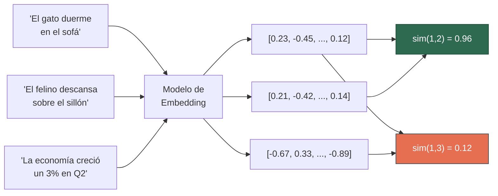
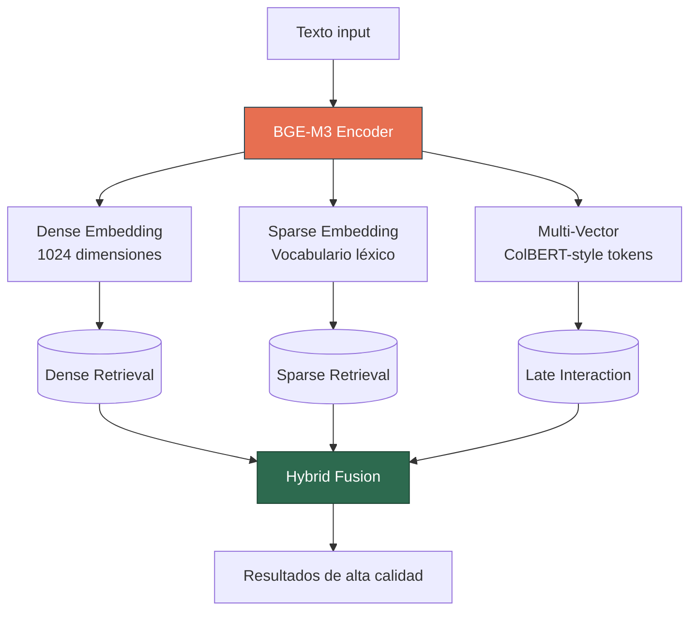
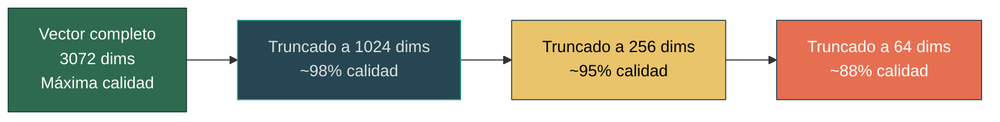
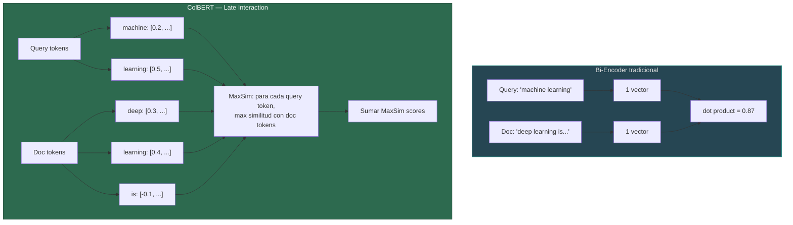
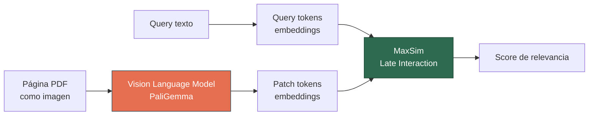
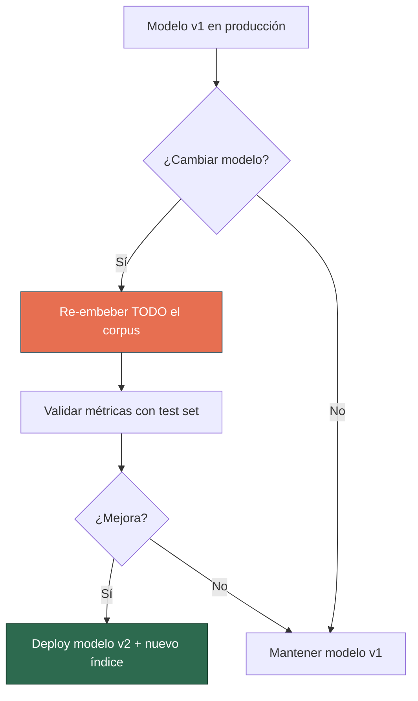
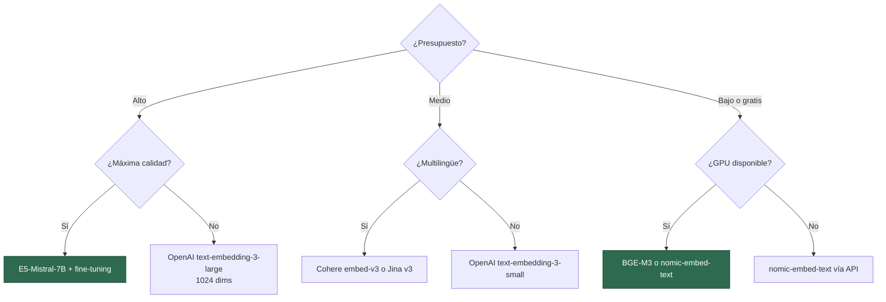

# Modelos de Embedding para RAG

> [!abstract] Resumen
> Los modelos de *embedding* (*text embeddings*) convierten texto en vectores densos de alta dimensión que capturan el significado semántico, siendo la ==pieza central de todo sistema de retrieval vectorial==. Esta nota cubre el landscape de modelos 2025 (OpenAI, Cohere, Voyage, Jina, BGE-M3, Nomic, E5-Mistral, GTE-Qwen2), el benchmark *MTEB*, técnicas avanzadas como *Matryoshka embeddings* y *ColBERT/ColPali*, estrategias de fine-tuning, y una comparación exhaustiva de dimensiones, scores, pricing y longitud de contexto.
> ^resumen

## Fundamentos de embeddings para retrieval

Un *embedding* es una representación vectorial densa de un fragmento de texto en un espacio de alta dimensión, donde la ==proximidad geométrica refleja similitud semántica==.



### Propiedades deseables de embeddings para RAG

| Propiedad | Descripción | Importancia |
|---|---|---|
| Discriminación semántica | Textos similares → vectores cercanos | ==Crítica== |
| Asimetría query-doc | Representa queries y docs con roles distintos | Alta |
| Eficiencia dimensional | Máxima información en mínimas dimensiones | Media |
| Robustez multilingüe | Funciona bien en múltiples idiomas | Según caso de uso |
| Longitud de contexto | Capacidad de procesar textos largos | Alta |

> [!info] Bi-encoders vs Cross-encoders
> Los modelos de embedding son *bi-encoders*: codifican query y documento ==por separado==, permitiendo pre-computar embeddings de documentos. Los *cross-encoders* codifican query y documento juntos, siendo más precisos pero requiriendo cómputo en tiempo de query. La combinación típica es bi-encoder para retrieval inicial + cross-encoder para [[reranking-strategies|reranking]].

## Landscape de modelos 2025

### Modelos comerciales (API)

#### OpenAI text-embedding-3

La familia de modelos de embedding de OpenAI, con soporte nativo para *Matryoshka embeddings*.

| Variante | Dimensiones | MTEB avg | Precio (por M tokens) | Contexto |
|---|---|---|---|---|
| text-embedding-3-small | 1536 | 62.3 | ==$0.02== | 8191 tokens |
| text-embedding-3-large | 3072 | 64.6 | $0.13 | 8191 tokens |
| text-embedding-3-large (dim=1024) | 1024 | 63.8 | $0.13 | 8191 tokens |
| text-embedding-3-large (dim=256) | 256 | 62.0 | $0.13 | 8191 tokens |

> [!tip] Matryoshka: reducir dimensiones sin re-indexar
> Los modelos text-embedding-3 soportan *Matryoshka embeddings*: puedes ==truncar los vectores a cualquier dimensión== y mantienen calidad proporcional. Esto permite optimizar almacenamiento y velocidad sin reembedear el corpus.

#### Cohere embed-v3

Modelo multilingüe con soporte nativo para diferentes *input types* (search_document, search_query, classification, clustering).

| Variante | Dimensiones | MTEB avg | Precio (por M tokens) | Contexto |
|---|---|---|---|---|
| embed-english-v3.0 | 1024 | 64.5 | $0.10 | 512 tokens |
| embed-multilingual-v3.0 | 1024 | 63.8 | $0.10 | 512 tokens |
| embed-english-light-v3.0 | 384 | 62.0 | ==$0.01== | 512 tokens |

> [!warning] Contexto limitado en Cohere
> Los modelos Cohere embed-v3 tienen un ==contexto máximo de 512 tokens==, significativamente menor que competidores. Esto impone restricciones en el chunk size máximo que se puede embeder sin truncamiento.

> [!danger] input_type matters
> Cohere requiere especificar `input_type` diferente para documentos vs queries. ==Usar el mismo tipo para ambos degrada la calidad significativamente==. Este es un error frecuente en implementaciones.

#### Voyage AI

Modelos especializados por dominio con excelente rendimiento en benchmarks verticales.

| Variante | Dimensiones | MTEB avg | Precio (por M tokens) | Contexto |
|---|---|---|---|---|
| voyage-3 | 1024 | ==65.3== | $0.06 | 32000 tokens |
| voyage-3-lite | 512 | 63.1 | $0.02 | 32000 tokens |
| voyage-code-3 | 1024 | —[^1] | $0.06 | 32000 tokens |
| voyage-finance-2 | 1024 | — | $0.06 | 32000 tokens |
| voyage-law-2 | 1024 | — | $0.06 | 32000 tokens |

> [!success] Modelos especializados por dominio
> Voyage ofrece modelos fine-tuneados para ==código, finanzas y legal==. Para estos dominios específicos, superan a modelos generalistas por un margen significativo.

#### Jina AI

Modelos con foco en multilingüismo, late interaction y Matryoshka nativo.

| Variante | Dimensiones | MTEB avg | Precio (por M tokens) | Contexto |
|---|---|---|---|---|
| jina-embeddings-v3 | 1024 | 65.0 | $0.02 | ==8192 tokens== |
| jina-colbert-v2 | 128 (per-token) | — | $0.02 | 8192 tokens |
| jina-clip-v2 | 1024 | — | $0.02 | 8192 tokens |

### Modelos open source

#### BGE-M3 (BAAI)

Modelo multilingüe que soporta ==tres modos de retrieval simultáneamente==: denso, sparse y multi-vector (ColBERT).



| Característica | Detalle |
|---|---|
| Dimensiones | 1024 (dense), variable (sparse/multi-vector) |
| MTEB avg | 62.1 |
| Idiomas | ==100+ idiomas== |
| Contexto | 8192 tokens |
| Licencia | MIT |

> [!tip] Un modelo, tres modos de retrieval
> BGE-M3 es el único modelo open source que ==produce embeddings densos, sparse y multi-vector en una sola pasada==. Esto permite búsqueda híbrida sin necesidad de modelos separados para BM25 y dense retrieval.

#### Nomic Embed

Modelos con contexto largo y Matryoshka nativo.

| Variante | Dimensiones | MTEB avg | Contexto | Licencia |
|---|---|---|---|---|
| nomic-embed-text-v1.5 | 768 | 62.2 | ==8192 tokens== | Apache 2.0 |
| nomic-embed-vision-v1.5 | 768 | — | Imágenes + texto | Apache 2.0 |

#### E5-Mistral-7B-Instruct

Modelo basado en Mistral-7B fine-tuneado para embeddings. Usa instrucciones en el prompt para especializar la representación.

| Característica | Detalle |
|---|---|
| Dimensiones | 4096 |
| MTEB avg | ==63.8== |
| Contexto | 32768 tokens |
| Tamaño | 7B parámetros |
| Requerimientos | GPU con 16GB+ VRAM |

> [!warning] Tamaño vs rendimiento
> E5-Mistral-7B tiene ==4096 dimensiones y 7B parámetros==. El costo computacional de embedding es ordenes de magnitud mayor que modelos más pequeños. Solo se justifica cuando la calidad es absolutamente crítica y hay GPU disponible.

#### GTE-Qwen2

Familia de modelos de Alibaba basados en Qwen2, con variantes de diferentes tamaños.

| Variante | Dimensiones | MTEB avg | Contexto | Tamaño |
|---|---|---|---|---|
| gte-Qwen2-1.5B-instruct | 1536 | 63.3 | ==131072 tokens== | 1.5B |
| gte-Qwen2-7B-instruct | 3584 | ==64.7== | 131072 tokens | 7B |

> [!success] Contexto de 128K tokens
> GTE-Qwen2 soporta ==hasta 131072 tokens de contexto==, permitiendo embeder documentos completos sin chunking. Esto abre la puerta a estrategias de *late chunking* y embedding de documentos completos.

## Tabla comparativa completa

| Modelo | Dims | MTEB | Precio/M tok | Contexto | Tipo | Matryoshka | Multilingüe |
|---|---|---|---|---|---|---|---|
| text-embedding-3-large | 3072 | 64.6 | $0.13 | 8K | API | ==Sí== | Sí |
| text-embedding-3-small | 1536 | 62.3 | ==$0.02== | 8K | API | Sí | Sí |
| Cohere embed-v3 | 1024 | 64.5 | $0.10 | 512 | API | No | ==Sí== |
| Voyage voyage-3 | 1024 | ==65.3== | $0.06 | 32K | API | No | Sí |
| Jina v3 | 1024 | 65.0 | $0.02 | 8K | API/Local | Sí | ==Sí== |
| BGE-M3 | 1024 | 62.1 | Gratis | 8K | ==Local== | No | ==Sí (100+)== |
| Nomic v1.5 | 768 | 62.2 | Gratis | 8K | Local | ==Sí== | Sí |
| E5-Mistral-7B | 4096 | 63.8 | Gratis | 32K | Local | No | Sí |
| GTE-Qwen2-7B | 3584 | ==64.7== | Gratis | ==128K== | Local | No | Sí |

> [!question] ¿Cuál elegir?
> La elección depende de las restricciones del proyecto:
> - **Presupuesto limitado + calidad**: ==BGE-M3 o Nomic v1.5== (open source, gratis)
> - **Máxima calidad API**: ==Voyage voyage-3== (mejor MTEB, contexto largo)
> - **Mejor balance precio/calidad API**: ==Jina v3 o text-embedding-3-small==
> - **Dominio especializado**: ==Voyage domain-specific== (code, finance, law)
> - **Contexto ultra-largo**: ==GTE-Qwen2== (128K tokens)
> - **Búsqueda híbrida nativa**: ==BGE-M3== (dense + sparse + multi-vector)

## MTEB Benchmark

El *Massive Text Embedding Benchmark* (MTEB)[^2] es el estándar de facto para evaluar modelos de embedding. Evalúa 8 tareas:

| Tarea MTEB | Descripción | Relevancia para RAG |
|---|---|---|
| *Retrieval* | Recuperar documentos relevantes para una query | ==Directamente relevante== |
| *STS* (Semantic Textual Similarity) | Similitud entre pares de oraciones | Alta |
| *Classification* | Clasificar texto por categoría | Media |
| *Clustering* | Agrupar textos similares | Media |
| *Reranking* | Reordenar resultados de búsqueda | Alta |
| *Pair Classification* | Clasificar relación entre pares | Media |
| *Summarization* | Calidad de resúmenes | Baja |
| *BitextMining* | Encontrar traducciones | Baja |

> [!warning] MTEB no es verdad absoluta
> El score promedio MTEB ==mezcla tareas que no son relevantes para RAG== (como BitextMining o Summarization). Para RAG, enfocarse en los scores de *Retrieval* y *STS*. Además, MTEB es predominantemente en inglés; para otros idiomas, usar benchmarks específicos como MIRACL[^3].

### Scores de retrieval (subconjunto MTEB)

| Modelo | MTEB Retrieval avg | MTEB STS avg |
|---|---|---|
| Voyage voyage-3 | ==54.8== | 83.2 |
| text-embedding-3-large | 52.1 | ==84.1== |
| GTE-Qwen2-7B | 53.2 | 82.7 |
| Jina v3 | 52.9 | 83.5 |
| Cohere embed-v3 | 51.7 | 82.3 |
| BGE-M3 | 48.9 | 81.1 |

## Matryoshka Embeddings

*Matryoshka Representation Learning* (MRL)[^4] entrena modelos donde las ==primeras N dimensiones del embedding son una representación válida y útil del texto==.



### Beneficios operacionales

| Dimensiones | Almacenamiento por vector | Velocidad de búsqueda | Calidad relativa |
|---|---|---|---|
| 3072 | 12 KB | Baseline | 100% |
| 1024 | 4 KB | ==~3x más rápida== | ~98% |
| 256 | 1 KB | ==~12x más rápida== | ~95% |
| 64 | 0.25 KB | ==~48x más rápida== | ~88% |

> [!tip] Estrategia de dos fases con Matryoshka
> Usar dimensiones reducidas (256) para una ==primera pasada rápida== (recuperar top-100), y luego re-scorear con dimensiones completas (3072) para seleccionar el top-10 final. Esto reduce la latencia de búsqueda manteniendo calidad.

## ColBERT y ColPali — Late Interaction

### ColBERT v2

*ColBERT* (*Contextualized Late Interaction over BERT*)[^5] es un paradigma de retrieval que genera ==un embedding por cada token== del documento, en lugar de un único vector para todo el texto.



**Ventajas de ColBERT:**
- ==Captura interacciones token-level== entre query y documento
- Más preciso que bi-encoders para queries complejas
- Los embeddings de documentos se pre-computan (eficiente en runtime)
- Especialmente bueno para queries multi-hop y factuales

**Limitaciones:**
- ==Almacenamiento masivo== — un embedding por token, no por documento
- Para un doc de 512 tokens a 128 dims: 512 x 128 x 4 bytes = 256 KB (vs 4 KB para bi-encoder de 1024 dims)

| Arquitectura | Calidad | Velocidad indexación | Velocidad query | Almacenamiento |
|---|---|---|---|---|
| Bi-Encoder | Buena | ==Rápida== | ==Rápida== | ==Bajo== |
| ColBERT | ==Muy buena== | Media | Rápida | Alto (N vecs/doc) |
| Cross-Encoder | ==Excelente== | N/A | Lenta | N/A |

### ColPali — Retrieval multimodal

*ColPali*[^6] extiende el paradigma ColBERT a ==documentos como imágenes==: en lugar de parsear y extraer texto, embede directamente la imagen de cada página del documento.



> [!success] Elimina el pipeline de parsing
> ColPali ==elimina completamente la necesidad de parsear PDFs==, extraer tablas o hacer OCR. El modelo ve la página como un humano la vería, capturando layout, tablas, figuras y texto en una sola representación. Esto elimina una fuente enorme de errores en [[document-ingestion]].

> [!warning] Estado de madurez
> ColPali es una técnica emergente (2024). El costo de almacenamiento y cómputo es ==significativamente mayor que embeddings tradicionales==. Considerar para casos donde la calidad de parsing es un cuello de botella crítico.

## Fine-tuning de embeddings

Los modelos de embedding pre-entrenados funcionan bien para texto general, pero ==para dominios especializados el fine-tuning puede mejorar retrieval quality en un 5-15%==.

### Cuándo hacer fine-tuning

| Señal | Acción |
|---|---|
| Vocabulario de dominio muy específico (médico, legal, financiero) | ==Fine-tuning recomendado== |
| Queries y documentos en el mismo idioma que el pre-training | Fine-tuning opcional |
| Idioma poco representado en el pre-training | ==Fine-tuning recomendado== |
| Score de retrieval ya es > 0.85 | Fine-tuning probablemente innecesario |
| Corpus < 1000 documentos | Fine-tuning podría overfittear |

### Técnicas de fine-tuning

| Técnica | Datos necesarios | Complejidad | Mejora típica |
|---|---|---|---|
| *Contrastive learning* (pares positivo/negativo) | Pares query-doc relevantes | Media | ==5-15%== |
| *RLHF para embeddings* | Feedback de relevancia | Alta | 8-20% |
| *Hard negative mining* | Pares + negativos difíciles | Media | ==10-20%== |
| *Matryoshka fine-tuning* | Pares + múltiples dimensiones | Alta | 3-10% |

> [!example]- Fine-tuning con Sentence Transformers
> ```python
> from sentence_transformers import SentenceTransformer, InputExample, losses
> from torch.utils.data import DataLoader
>
> # Cargar modelo base
> model = SentenceTransformer("BAAI/bge-base-en-v1.5")
>
> # Preparar datos de entrenamiento (pares query-documento)
> train_examples = [
>     InputExample(
>         texts=["¿Cómo configurar OAuth2?",
>                "La configuración de OAuth2 requiere registrar..."],
>         label=1.0  # Relevante
>     ),
>     InputExample(
>         texts=["¿Cómo configurar OAuth2?",
>                "El pronóstico del tiempo para mañana..."],
>         label=0.0  # No relevante
>     ),
>     # ... miles de ejemplos (mínimo 1000 pares)
> ]
>
> train_dataloader = DataLoader(train_examples, shuffle=True, batch_size=32)
>
> # Loss function: Multiple Negatives Ranking Loss
> train_loss = losses.MultipleNegativesRankingLoss(model)
>
> # Fine-tuning
> model.fit(
>     train_objectives=[(train_dataloader, train_loss)],
>     epochs=3,
>     warmup_steps=100,
>     output_path="./fine-tuned-embeddings",
>     show_progress_bar=True
> )
> ```

> [!danger] Re-indexación obligatoria
> Después del fine-tuning, ==todo el corpus debe ser re-embebido e re-indexado==. Los vectores generados por el modelo anterior son incompatibles con el modelo fine-tuneado. Planificar el costo y tiempo de re-indexación antes de decidir.

> [!question] ¿Cuántos datos necesito para fine-tuning?
> - **Mínimo viable**: 500-1000 pares (query, documento relevante)
> - **Recomendado**: 5000-10000 pares
> - **Generación sintética**: Usar un LLM para generar queries a partir de los documentos es la forma más eficiente de escalar datos de entrenamiento

## Embeddings asimétricos

Algunos modelos usan ==prefijos diferenciados para queries y documentos==, optimizando cada representación para su rol en el retrieval.

| Modelo | Prefijo query | Prefijo documento |
|---|---|---|
| E5-Mistral | `"query: "` | `"passage: "` |
| BGE | `"Represent this sentence for searching relevant passages: "` | (sin prefijo) |
| Nomic | `"search_query: "` | `"search_document: "` |
| Cohere | `input_type="search_query"` | `input_type="search_document"` |

> [!warning] Omitir prefijos degrada calidad
> Si el modelo espera prefijos asimétricos y no se proporcionan, la ==calidad del retrieval puede caer un 10-20%==. Siempre verificar la documentación del modelo y usar los prefijos correctos.

## Consideraciones de producción

### Batching y throughput

| Estrategia | Throughput | Latencia por request |
|---|---|---|
| Request individual | Bajo | Media |
| Batch de 32 | ==Alto== | Baja por doc |
| Batch de 128 | Muy alto | ==Muy baja por doc== |
| Batch de 512+ | Máximo | Riesgo de timeout en APIs |

### Versionado y migración



> [!danger] Cambiar de modelo = re-indexar todo
> Los embeddings de diferentes modelos ==viven en espacios vectoriales incompatibles==. No se pueden mezclar embeddings de modelos diferentes en el mismo índice. Cada cambio de modelo requiere re-embeber y re-indexar todo el corpus.

### Caching de embeddings

| Qué cachear | Dónde | TTL | Impacto |
|---|---|---|---|
| Query embeddings frecuentes | Redis / Memcached | 1-24h | ==Reduce latencia 50-80%== |
| Document embeddings | Vector store (persistente) | Permanente | Elimina re-cómputo |
| Batch results | Disco local | Sesión | Eficiencia en re-procesamiento |

## Criterios de selección



## Relación con el ecosistema

Los modelos de embedding se conectan con cada componente del ecosistema:

- **[[intake-overview]]** — La calidad del texto extraído por los 12+ parsers de intake ==determina directamente la calidad de los embeddings generados==. Texto mal parseado produce embeddings ruidosos. La integración vía *MCP* permite alimentar el pipeline de embedding desde las transformaciones de intake de forma estandarizada.

- **[[architect-overview]]** — Los *YAML pipelines* de architect pueden orquestar el proceso de embedding como un paso del pipeline, permitiendo configurar modelo, dimensiones y batching de forma declarativa. La integración con *OpenTelemetry* permite monitorizar latencia y throughput del embedding en producción. Las ==22 capas de seguridad== protegen las API keys de los modelos de embedding.

- **[[vigil-overview]]** — Los modelos de embedding pueden ser vulnerables a *adversarial attacks* donde textos crafteados producen embeddings engañosos. Vigil puede escanear el corpus con sus 26 reglas antes del embedding para detectar contenido malicioso. La detección de *slopsquatting* es relevante al verificar las dependencias de las librerías de embedding (sentence-transformers, etc.).

- **[[licit-overview]]** — El *EU AI Act* requiere documentar qué modelos se usan en el pipeline y su *provenance*. Licit rastrea qué modelo de embedding generó cada vector, facilitando auditorías. Los *FRIA* aplican cuando los embeddings codifican datos personales, ya que ==la representación vectorial puede ser invertible parcialmente==. *OWASP Agentic Top 10* identifica riesgos de exfiltración de datos vía embeddings.

## Enlaces y referencias

> [!quote]- Bibliografía
> - Muennighoff, N., et al. (2023). "MTEB: Massive Text Embedding Benchmark." *EACL 2023*. [arXiv:2210.07316](https://arxiv.org/abs/2210.07316)
> - Kusupati, A., et al. (2024). "Matryoshka Representation Learning." *NeurIPS 2022*. [arXiv:2205.13147](https://arxiv.org/abs/2205.13147)
> - Khattab, O., Zaharia, M. (2020). "ColBERT: Efficient and Effective Passage Search via Contextualized Late Interaction over BERT."
> - Faysse, M., et al. (2024). "ColPali: Efficient Document Retrieval with Vision Language Models." *arXiv:2407.01449*.
> - Chen, J., et al. (2024). "BGE M3-Embedding: Multi-Lingual, Multi-Functionality, Multi-Granularity Text Embeddings Through Self-Knowledge Distillation."
> - Wang, L., et al. (2024). "Improving Text Embeddings with Large Language Models." (E5-Mistral)
> - MTEB Leaderboard. https://huggingface.co/spaces/mteb/leaderboard
> - [[rag-pipeline-completo]] — Fase de embedding en el pipeline
> - [[chunking-strategies]] — Fase anterior: chunking
> - [[vector-databases]] — Fase siguiente: indexación
> - [[reranking-strategies]] — Complemento: reranking post-retrieval

[^1]: Voyage voyage-code-3 se evalúa con benchmarks especializados de código (CodeSearchNet), no con MTEB general.
[^2]: Muennighoff, N., et al. "MTEB: Massive Text Embedding Benchmark." EACL 2023.
[^3]: Zhang, X., et al. "MIRACL: A Multilingual Information Retrieval Across a Continuum of Languages." 2023.
[^4]: Kusupati, A., et al. "Matryoshka Representation Learning." NeurIPS 2022. Permite representaciones anidadas de múltiples resoluciones.
[^5]: Khattab, O., Zaharia, M. "ColBERT: Efficient and Effective Passage Search via Contextualized Late Interaction over BERT." 2020.
[^6]: Faysse, M., et al. "ColPali: Efficient Document Retrieval with Vision Language Models." 2024.

---

> [!quote] Principio operativo
> "El modelo de embedding es el ==lente a través del cual tu sistema RAG ve el mundo==. Un lente borroso produce resultados borrosos, sin importar cuán bueno sea el resto del pipeline."
