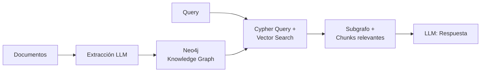
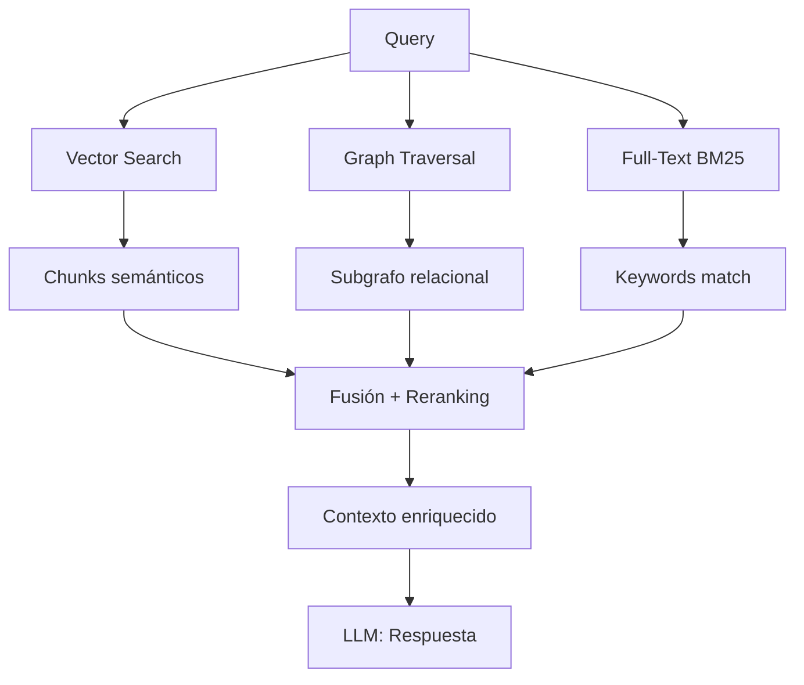
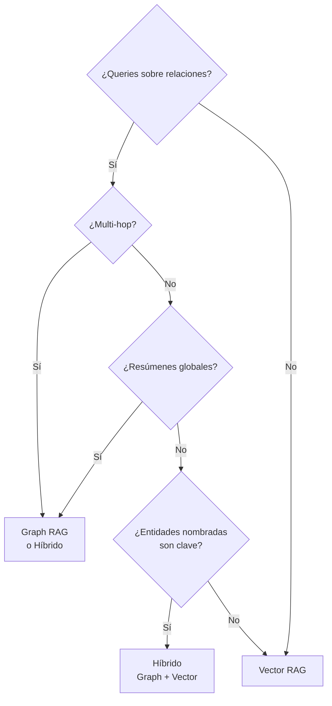

# Graph RAG — Knowledge Graphs + RAG

> [!abstract] Resumen
> *Graph RAG* combina ==grafos de conocimiento con retrieval vectorial== para capturar relaciones entre entidades que los embeddings solos no representan. Microsoft GraphRAG demostró que este enfoque supera al vector RAG en queries que requieren razonamiento sobre relaciones, resúmenes globales y preguntas multi-hop. Este documento cubre la arquitectura, implementación con Neo4j, cuándo usarlo y sus limitaciones.
> ^resumen

---

## Por qué los grafos complementan los vectores

Los embeddings capturan ==similitud semántica== pero fallan en representar ==relaciones estructuradas==:

| Tipo de query | Vector RAG | Graph RAG |
|---|---|---|
| "¿Qué dice el documento X sobre Y?" | ==Excelente== | Bueno |
| "¿Quién reporta a quién en la empresa?" | Malo | ==Excelente== |
| "¿Cómo se relacionan los productos A, B y C?" | Malo | ==Excelente== |
| "Dame un resumen global del corpus" | Malo | ==Excelente== |
| "¿Qué causó el evento X?" (cadena causal) | Medio | ==Excelente== |
| Búsqueda semántica abierta | ==Excelente== | Medio |

> [!question] ¿Cuándo Graph RAG supera a Vector RAG?
> Graph RAG supera a vector RAG cuando las queries requieren:
> 1. ==Relaciones entre entidades== (quién, qué, con quién)
> 2. ==Razonamiento multi-hop== (A → B → C → respuesta)
> 3. ==Resúmenes globales== sobre todo el corpus
> 4. ==Navegación jerárquica== (departamentos, taxonomías)

---

## Microsoft GraphRAG

Microsoft publicó GraphRAG[^1] en 2024, proponiendo un pipeline que construye un grafo de conocimiento desde los documentos y lo usa para retrieval:

### Pipeline GraphRAG

```mermaid
flowchart TB
    subgraph "Indexación"
        A[Documentos] --> B[Chunking]
        B --> C[LLM: Extraer<br/>entidades + relaciones]
        C --> D[Knowledge Graph]
        D --> E[LLM: Detectar<br/>comunidades]
        E --> F[LLM: Generar<br/>resúmenes por comunidad]
    end

    subgraph "Query: Local Search"
        G[Query] --> H[Entidades relevantes]
        H --> I[Subgrafo local]
        I --> J[Chunks asociados]
        J --> K[LLM: Generar respuesta]
    end

    subgraph "Query: Global Search"
        L[Query global] --> M[Resúmenes de<br/>comunidades]
        M --> N[Map: generar<br/>respuesta parcial<br/>por comunidad]
        N --> O[Reduce: sintetizar<br/>respuestas parciales]
    end
```



### Local Search vs Global Search

| Aspecto | Local Search | Global Search |
|---|---|---|
| Tipo de query | Específica sobre entidades | ==Resumen global, tendencias== |
| Alcance | Subgrafo local | Todo el grafo |
| Latencia | Rápida | Lenta (MapReduce) |
| Coste | Bajo | ==Alto (muchas LLM calls)== |
| Ejemplo | "¿Qué hace la empresa X?" | "¿Cuáles son los temas principales?" |

> [!warning] Coste de indexación GraphRAG
> GraphRAG requiere ==múltiples llamadas LLM durante la indexación==:
> - Extracción de entidades: ~1 call por chunk
> - Detección de comunidades: múltiples calls
> - Resúmenes de comunidades: 1 call por comunidad
>
> Para un corpus de 10K chunks, el coste de indexación puede ser ==$50-200+== con GPT-4o.

---

## Extracción de entidades y relaciones

El primer paso es extraer un grafo estructurado de los documentos:

> [!example]- Código: Extracción de entidades con LLM
> ```python
> from openai import OpenAI
> import json
>
> client = OpenAI()
>
> EXTRACTION_PROMPT = """Extrae todas las entidades y relaciones
> del siguiente texto. Devuelve JSON con el formato:
> {
>     "entities": [
>         {"name": "...", "type": "PERSON|ORG|CONCEPT|EVENT|PLACE", "description": "..."}
>     ],
>     "relations": [
>         {"source": "...", "target": "...", "type": "...", "description": "..."}
>     ]
> }
>
> Texto:
> {text}
>
> JSON:"""
>
> def extract_entities_relations(text: str) -> dict:
>     """Extrae entidades y relaciones de un texto."""
>     response = client.chat.completions.create(
>         model="gpt-4o-mini",
>         messages=[
>             {"role": "user",
>              "content": EXTRACTION_PROMPT.format(text=text)}
>         ],
>         temperature=0,
>         response_format={"type": "json_object"},
>     )
>     return json.loads(response.choices[0].message.content)
>
> # Ejemplo
> text = """
> Apple Inc., dirigida por Tim Cook, anunció una alianza
> con Microsoft para integrar Azure con los servicios de iCloud.
> Satya Nadella confirmó que la integración comenzará en Q3 2025.
> """
> result = extract_entities_relations(text)
> # entities: Apple Inc. (ORG), Tim Cook (PERSON), Microsoft (ORG), ...
> # relations: Tim Cook -[DIRIGE]-> Apple Inc., Apple -[ALIANZA]-> Microsoft, ...
> ```

---

## Implementación con Neo4j

*Neo4j* es la base de datos de grafos más popular para Graph RAG:



### Queries Cypher para RAG

```cypher
// Encontrar relaciones de una entidad
MATCH (e:Entity {name: "Apple Inc."})-[r]->(related)
RETURN e, type(r), related
LIMIT 20;

// Multi-hop: ¿Quién trabaja en empresas asociadas a Apple?
MATCH (apple:Entity {name: "Apple Inc."})
      -[:ALIANZA]->(partner)
      <-[:TRABAJA_EN]-(person)
RETURN person.name, partner.name;

// Búsqueda híbrida: vector + grafo
CALL db.index.vector.queryNodes(
    'entity_embeddings', 5, $query_embedding
) YIELD node, score
MATCH (node)-[r]->(related)
RETURN node.name, type(r), related.name, score
ORDER BY score DESC;
```

> [!tip] Neo4j + Vector Search
> Neo4j 5.x soporta ==índices vectoriales nativos==, permitiendo búsqueda híbrida grafo+vector en una sola query Cypher. Esto simplifica la arquitectura enormemente.

---

## Híbrido: Graph + Vector RAG

La arquitectura más potente combina ambos enfoques:



### Cómo fusionar resultados

| Señal | Peso típico | Fuente |
|---|---|---|
| Similitud vectorial | 0.4 | Vector DB |
| Proximidad en grafo | 0.3 | Neo4j |
| Match léxico (BM25) | 0.2 | Full-text index |
| Metadata (fecha, tipo) | 0.1 | Metadata store |

> [!success] Resultados de la combinación
> Según los benchmarks de Microsoft, la combinación grafo+vector ==mejora la calidad de resúmenes globales un 70%== y de queries multi-hop un 30% sobre vector-only[^1].

---

## Limitaciones de Graph RAG

> [!danger] Limitaciones importantes

1. **Coste de indexación**: La extracción de entidades/relaciones con LLM es ==costosa y lenta==
2. **Calidad de extracción**: Los LLM cometen errores en la extracción, generando nodos/relaciones incorrectos
3. **Mantenimiento**: Los grafos requieren actualización cuando cambian los documentos
4. **Queries simples**: Para queries semánticas simples, vector RAG es ==más rápido y más simple==
5. **Escalabilidad**: Grafos muy grandes (>1M nodos) requieren particionado y optimización
6. **Deduplicación**: Misma entidad puede aparecer con nombres diferentes ("Apple Inc.", "Apple", "AAPL")

> [!info] Entity Resolution
> La deduplicación de entidades (*entity resolution*) es un problema complejo. Estrategias:
> - Embeddings de nombres de entidad + clustering
> - LLM para decidir si dos entidades son la misma
> - Reglas heurísticas (normalización de nombres, acrónimos)

---

## Cuándo elegir Graph RAG



---

## Relación con el ecosistema

- **[[intake-overview|intake]]**: Los parsers de intake pueden enriquecer la extracción de entidades proporcionando ==estructura pre-parseada== (headings, secciones, metadata) que facilita la identificación de entidades y sus relaciones.

- **[[architect-overview|architect]]**: architect puede orquestar el pipeline de indexación de Graph RAG como un pipeline YAML multi-step. La extracción de entidades, construcción del grafo y generación de resúmenes son steps independientes.

- **[[vigil-overview|vigil]]**: Los grafos de conocimiento pueden contener ==información sensible sobre personas y organizaciones==. Vigil puede auditar el grafo para detectar PII expuesta en nodos y relaciones.

- **[[licit-overview|licit]]**: La construcción de grafos de conocimiento sobre personas requiere cumplimiento estricto de GDPR. Licit verifica que los nodos de tipo PERSON tienen base legal para su procesamiento y que el ==derecho al olvido se puede ejercer== (borrar nodo + relaciones).

---

## Enlaces y referencias

> [!quote]- Bibliografía
> - Edge, D., et al. "From Local to Global: A Graph RAG Approach to Query-Focused Summarization." Microsoft Research, 2024.[^1]
> - Pan, S., et al. "Unifying Large Language Models and Knowledge Graphs: A Roadmap." arXiv 2024.[^2]
> - Neo4j Documentation. "Vector Search Index." https://neo4j.com/docs/
> - [[advanced-rag]] — Patrones avanzados de RAG
> - [[retrieval-strategies]] — Estrategias de retrieval
> - [[vector-databases]] — Bases de datos vectoriales

[^1]: Edge, D., et al. "From Local to Global: A Graph RAG Approach to Query-Focused Summarization." Microsoft Research, 2024.
[^2]: Pan, S., et al. "Unifying Large Language Models and Knowledge Graphs: A Roadmap." arXiv 2024.
