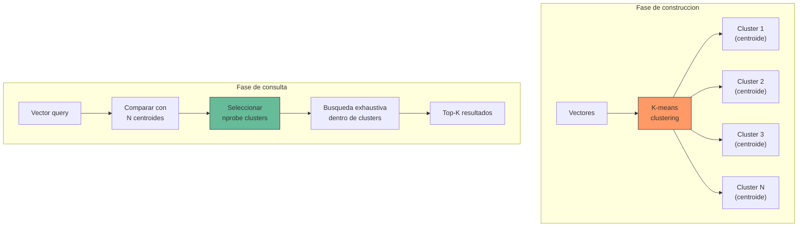
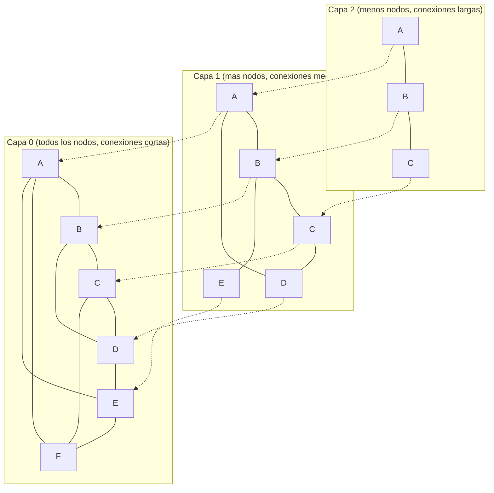
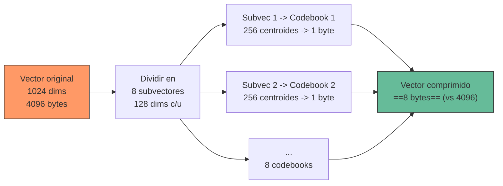
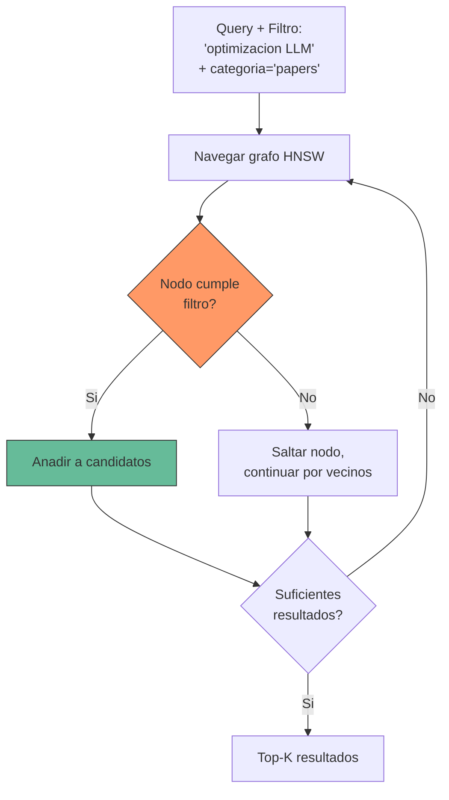
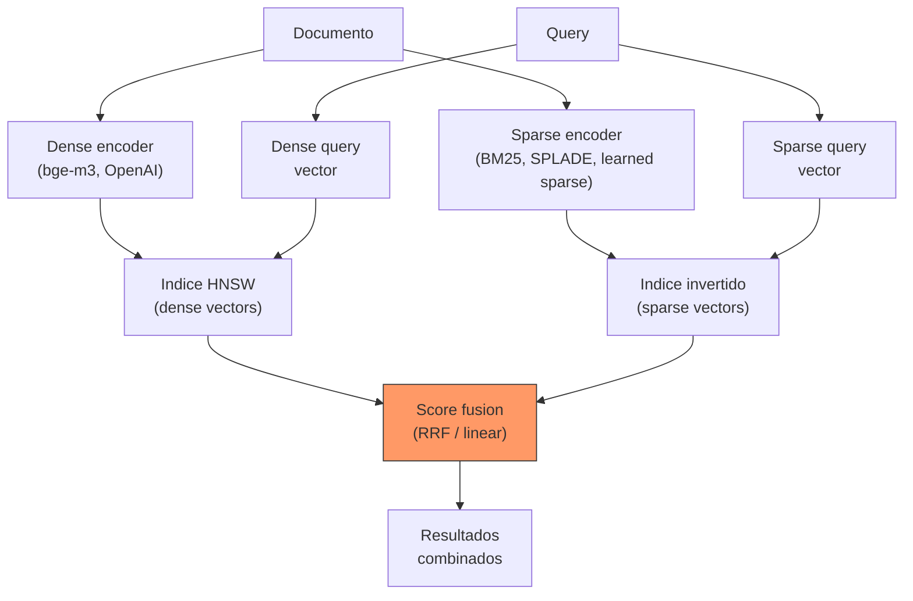

---
tags:
  - tecnica
  - rag
  - infraestructura
  - algoritmos
  - indexacion
aliases:
  - estrategias de indexacion
  - indices vectoriales
  - ANN indexes
  - vector indexing
created: 2025-06-01
updated: 2025-06-01
category: tecnicas-retrieval
status: evergreen
difficulty: advanced
related:
  - "[[vector-databases]]"
  - "[[embeddings]]"
  - "[[retrieval-strategies]]"
  - "[[reranking]]"
  - "[[pattern-rag]]"
  - "[[advanced-rag]]"
  - "[[chunking-strategies]]"
up: "[[moc-rag-retrieval]]"
---

# Estrategias de indexacion

> [!abstract] Resumen
> Las *indexing strategies* determinan como se organizan los vectores en una base de datos vectorial para permitir busquedas eficientes de vecinos mas cercanos. ==La eleccion del indice impacta directamente en la latencia de busqueda, el consumo de memoria, la precision (recall) y el tiempo de construccion==. Este documento cubre Flat index, IVF, HNSW, ScaNN, Product Quantization, busqueda filtrada e indexacion hibrida, con guias practicas de tuning para produccion. ^resumen

## Que es y por que importa

Cuando almacenas millones de [[embeddings]] en una [[vector-databases|base de datos vectorial]], la pregunta fundamental es: como encontrar los K vectores mas similares a un vector de consulta sin comparar contra todos.

La busqueda exhaustiva (*brute force*) garantiza resultados exactos pero tiene complejidad O(n * d) donde n es el numero de vectores y d la dimensionalidad. Con 10M vectores de 1024 dimensiones, cada consulta requiere ~40 GB de operaciones de punto flotante. ==Inaceptable para latencias de milisegundos==.

Los algoritmos de *Approximate Nearest Neighbor* (ANN) construyen estructuras de datos (indices) que permiten saltar directamente a las regiones relevantes del espacio vectorial, reduciendo el numero de comparaciones de millones a cientos o miles.

> [!question] Exacto vs aproximado: cuando importa
> En la practica de RAG, la diferencia entre busqueda exacta y ANN con 99% de recall es negligible. ==El LLM tolera bien que falte el documento #8 de los 10 mas relevantes==. La perdida marginal de recall se compensa ampliamente con la reduccion de latencia y coste computacional. Solo en aplicaciones criticas (busqueda legal, medica) considerar busqueda exacta.

---

## Flat Index (fuerza bruta)

El *Flat index* almacena todos los vectores sin estructura adicional y compara la consulta contra cada uno. Es el baseline contra el que se miden todos los demas.

| Propiedad | Valor |
|---|---|
| Complejidad de busqueda | O(n * d) |
| Recall | ==100% (exacto)== |
| Memoria | n * d * sizeof(float32) |
| Tiempo de build | O(n) (solo copiar) |
| Actualizaciones | O(1) (append) |

> [!tip] Cuando usar Flat index
> - Datasets pequenos (<50K vectores): la busqueda es instantanea
> - Como ground truth para evaluar el recall de otros indices
> - Cuando necesitas precision absoluta y la latencia no es critica
> - En [[vector-databases#faiss|FAISS]]: `faiss.IndexFlatL2(dimension)` o `faiss.IndexFlatIP(dimension)`

---

## IVF (Inverted File Index)

*IVF* (*Inverted File Index*) particiona el espacio vectorial en clusters usando K-means, y en tiempo de consulta solo busca en los clusters mas cercanos al vector query.



**Parametros clave:**
- **nlist**: numero de clusters (tipico: sqrt(n) a 4*sqrt(n))
- **nprobe**: numero de clusters a explorar en consulta (trade-off velocidad/recall)

| nlist | nprobe | Recall@10 | Latencia relativa |
|---|---|---|---|
| 1024 | 1 | ~40% | ==1x (mas rapido)== |
| 1024 | 8 | ~80% | 8x |
| 1024 | 32 | ~95% | 32x |
| 1024 | 128 | ~99% | 128x |
| 1024 | 1024 | ==100%== | Igual que flat |

> [!warning] Limitacion de IVF
> IVF requiere entrenamiento (clustering K-means) antes de poder insertar vectores. ==Anadir vectores nuevos no actualiza los centroides==, lo que degrada el rendimiento si la distribucion de datos cambia significativamente. En ese caso hay que reentrenar el indice periodicamente.

---

## HNSW (Hierarchical Navigable Small World)

*HNSW* es el algoritmo de indexacion ==mas usado en produccion para busqueda vectorial==. Construye un grafo navegable multi-capa inspirado en redes de *small world*, donde cada nodo (vector) esta conectado a sus vecinos mas cercanos[^1].



**Algoritmo de busqueda:**
1. Comenzar en el punto de entrada en la capa mas alta
2. Navegar greedily hacia el vecino mas cercano a la query
3. Cuando no se puede mejorar, descender a la siguiente capa
4. Repetir hasta llegar a la capa 0
5. En la capa 0, realizar busqueda ampliada con beam search

### Parametros HNSW

| Parametro | Descripcion | Rango tipico | Impacto |
|---|---|---|---|
| **M** | Conexiones por nodo por capa | ==12-48== | Mas M = mas memoria, mejor recall |
| **ef_construction** | Tamano del beam durante build | 100-500 | Mas = build mas lento, mejor grafo |
| **ef_search** | Tamano del beam durante busqueda | 50-500 | Mas = busqueda mas lenta, mejor recall |

> [!example]- Guia practica de tuning HNSW
> ```python
> """
> Guia de tuning HNSW basada en experiencia practica.
> Ajustar segun los requisitos de tu aplicacion.
> """
>
> # CONFIGURACION POR DEFECTO (buen punto de partida)
> hnsw_params = {
>     "M": 16,                # Conexiones por nodo
>     "ef_construction": 200, # Calidad del grafo
>     "ef_search": 100,       # Calidad de busqueda
> }
>
> # CONFIGURACION PARA ALTO RECALL (>99%)
> # Usar cuando la precision es critica (legal, medico)
> high_recall_params = {
>     "M": 32,                # Mas conexiones = mejor navegabilidad
>     "ef_construction": 400, # Grafo de mayor calidad
>     "ef_search": 300,       # Beam search mas amplio
> }
> # Coste: ~2x memoria, ~3x tiempo de build, ~2x latencia de query
>
> # CONFIGURACION PARA BAJA LATENCIA
> # Usar cuando la velocidad es critica y 95% recall es aceptable
> low_latency_params = {
>     "M": 12,
>     "ef_construction": 100,
>     "ef_search": 50,
> }
> # Coste: recall ~95%, pero latencia <5ms en 1M vectores
>
> # REGLAS DE THUMB:
> # - ef_search >= K (numero de resultados solicitados)
> # - ef_construction >= 2 * M
> # - Memoria por vector aprox M * 2 * 4 bytes (por capa)
> #   + sizeof(float32) * dimensiones
> # - Para 1M vectores, 1024 dims, M=16:
> #   Vectores: ~4GB, Grafo: ~256MB, Total: ~4.3GB
>
> # EVALUACION: medir recall@K contra Flat index
> # con un subset de queries representativas
> import numpy as np
>
> def evaluate_recall(exact_results, approx_results, k=10):
>     """Calcula recall@K comparando resultados ANN vs exactos."""
>     recalls = []
>     for exact, approx in zip(exact_results, approx_results):
>         exact_set = set(exact[:k])
>         approx_set = set(approx[:k])
>         recalls.append(len(exact_set & approx_set) / k)
>     return np.mean(recalls)
> ```

> [!success] Por que HNSW domina en produccion
> - ==No requiere entrenamiento previo== (a diferencia de IVF): los vectores se insertan incrementalmente
> - Excelente balance entre recall, latencia y memoria
> - Paralelizable: las busquedas en el grafo son independientes
> - Implementaciones maduras en todas las vector DBs principales
> - Rendimiento predecible: la latencia varia poco entre consultas

> [!danger] Limitaciones de HNSW
> - **Memoria**: el grafo HNSW vive completamente en RAM. Para 100M vectores de 1024 dims con M=16, necesitas ==~400GB de RAM== solo para los vectores, mas el overhead del grafo.
> - **Actualizaciones**: eliminar nodos del grafo no es eficiente (se marcan como borrados pero el espacio no se reclama hasta compactacion).
> - **Build time**: construir el indice completo puede tardar horas para datasets grandes.

---

## ScaNN (Scalable Nearest Neighbors)

*ScaNN* es la libreria de Google para busqueda ANN, con un enfoque unico en *quantization-aware training*[^2].

El insight clave: en lugar de cuantizar los vectores despues de entrenar (como hace PQ estandar), ScaNN ==optimiza conjuntamente la particion del espacio y la cuantizacion de los residuos==, logrando mejor recall con el mismo nivel de compresion.

**Estructura de ScaNN:**
1. **Particionamiento**: divide el espacio en clusters (como IVF)
2. **Scoring asimetrico**: la query usa valores float completos, los candidatos estan cuantizados
3. **Rescoring**: los top candidatos se re-evaluan con vectores originales

> [!info] Cuando considerar ScaNN
> - Datasets muy grandes (>100M vectores) donde la memoria es el bottleneck
> - Entornos Google Cloud donde la integracion es nativa
> - Necesidad de latencia ultra-baja con recall aceptable
> - ==ScaNN es la base del Vertex AI Matching Engine de Google Cloud==

---

## Product Quantization (PQ)

*Product Quantization* comprime vectores de alta dimensionalidad dividiendo cada vector en subvectores y cuantizando cada uno independientemente con un codebook aprendido[^3].



**Ratio de compresion**: un vector de 1024 dims (4096 bytes en float32) se comprime a ==8-64 bytes==, una reduccion de 64-512x.

| Configuracion PQ | Compresion | Recall@10 (tipico) | Uso de memoria (1M vecs, 1024d) |
|---|---|---|---|
| Sin PQ | 1x | ==100%== | ~4 GB |
| PQ (m=8, nbits=8) | 512x | ~85% | ==~8 MB== |
| PQ (m=16, nbits=8) | 256x | ~90% | ~16 MB |
| PQ (m=32, nbits=8) | 128x | ~95% | ~32 MB |
| PQ (m=64, nbits=8) | 64x | ~97% | ~64 MB |

> [!warning] Trade-off de Product Quantization
> PQ introduce ==distorsion en las distancias calculadas==. Funciona mejor cuando:
> - Los vectores tienen distribucion relativamente uniforme
> - Se combina con IVF (IVF-PQ) para pre-filtrar candidatos
> - Se usa rescoring con vectores originales para los top-K finales
>
> Para RAG, la combinacion IVF-PQ + reranking con [[reranking|cross-encoders]] puede dar excelentes resultados con 10-50x menos memoria.

---

## Busqueda filtrada

La *filtered search* combina condiciones sobre metadatos con busqueda vectorial. Es esencial en produccion: ==casi toda consulta RAG real tiene filtros== (por fecha, por fuente, por categoria, por tenant).

Existen tres estrategias:

### Pre-filtrado

1. Aplicar filtros de metadatos primero
2. Buscar vectores solo en el subconjunto filtrado

**Problema**: si el filtro elimina nodos del grafo HNSW, ==la navegacion del grafo se rompe y el recall cae drasticamente==.

### Post-filtrado

1. Buscar los top-K*N vectores mas cercanos (con N > 1)
2. Aplicar filtros de metadatos sobre los resultados
3. Devolver los top-K que pasen el filtro

**Problema**: si el filtro es muy selectivo (e.g., solo 1% de los docs), ==necesitas buscar 100x mas candidatos para encontrar K resultados validos==.

### Filtrado integrado (recomendado)

Los filtros se aplican durante la navegacion del grafo. Si un nodo no cumple el filtro, se salta pero se siguen sus conexiones.



> [!tip] Soporte de filtrado integrado por base de datos
> - ==[[vector-databases#qdrant|Qdrant]]==: filtrado integrado nativo, el mejor de la industria
> - [[vector-databases#weaviate|Weaviate]]: filtrado integrado
> - [[vector-databases#pinecone|Pinecone]]: filtrado integrado (serverless)
> - [[vector-databases#pgvector|pgvector]]: usa el optimizador de PostgreSQL (variable)

---

## Indexacion hibrida: sparse + dense

La *indexacion hibrida* combina indices de vectores densos (embeddings) con indices sparse (BM25/TF-IDF) para capturar tanto similitud semantica como coincidencia lexica[^4].



**Por que importa**: los vectores densos capturan significado semantico pero ==pueden fallar con terminos tecnicos especificos, nombres propios o acronimos==. BM25 captura coincidencia exacta de terminos. La combinacion es sistematicamente superior.

| Escenario | Dense only | Sparse only | ==Hibrido== |
|---|---|---|---|
| "optimizacion de rendimiento de modelos" | Bueno | Bueno | ==Excelente== |
| "error CUDA_OUT_OF_MEMORY" | Malo | ==Excelente== | ==Excelente== |
| "como reducir latencia de inferencia" | Excelente | Bueno | ==Excelente== |
| Acronimo especifico "RLHF" | Malo | ==Excelente== | ==Excelente== |
| Concepto sin terminos exactos | ==Excelente== | Malo | ==Excelente== |

Ver [[retrieval-strategies#busqueda-hibrida|retrieval strategies]] para los metodos de fusion de scores.

---

## Tabla comparativa de indices

| Indice | Build time | Query time | Memoria | Recall@10 | Actualizaciones | Caso de uso |
|---|---|---|---|---|---|---|
| **Flat** | O(n) | O(n*d) | n*d*4B | ==100%== | O(1) | Datasets pequenos, ground truth |
| **IVF** | O(n*k*iter) | O(nprobe*n/nlist) | n*d*4B + overhead | 85-99% | Requiere re-train | Datasets grandes con batch updates |
| **HNSW** | O(n*log(n)*M) | O(log(n)*ef) | n*d*4B + grafo | ==95-99.9%== | O(log(n)) | ==Produccion general (recomendado)== |
| **IVF-PQ** | O(n*k*iter + PQ train) | O(nprobe*n/nlist) | ==n*m bytes== | 80-95% | Requiere re-train | Datasets masivos, memoria limitada |
| **HNSW+PQ** | O(n*log(n)*M) | O(log(n)*ef) | n*m bytes + grafo | 90-98% | O(log(n)) | Gran escala con buen balance |
| **ScaNN** | O(n*k*iter) | Sublinear | Comprimido | 90-99% | Batch | Google Cloud, alta escala |

^tabla-comparativa-indices

> [!danger] No existe el indice perfecto
> Cada indice es un trade-off entre cuatro dimensiones: ==velocidad de build, velocidad de query, uso de memoria y recall==. Optimizar una siempre degrada otra. La clave es entender las prioridades de tu aplicacion y elegir en consecuencia.

---

## Tuning practico para produccion

> [!example]- Metodologia de tuning paso a paso
> ```python
> """
> Metodologia de tuning de indices ANN para produccion.
> Objetivo: encontrar la configuracion optima para tu dataset y requisitos.
> """
> import numpy as np
> import time
> from typing import List, Tuple
>
> # 1. DEFINIR REQUISITOS
> requirements = {
>     "target_recall": 0.95,       # Recall minimo aceptable
>     "max_latency_p99_ms": 50,    # Latencia maxima p99
>     "max_memory_gb": 32,         # Memoria RAM disponible
>     "num_vectors": 5_000_000,    # Tamano del dataset
>     "dimensions": 1024,          # Dimensionalidad de embeddings
>     "update_frequency": "hourly", # Frecuencia de actualizaciones
> }
>
> # 2. PREPARAR GROUND TRUTH
> # Usar Flat index para calcular los K vecinos exactos
> # de un conjunto de queries de evaluacion (1000-10000 queries)
>
> # 3. GRID SEARCH DE PARAMETROS HNSW
> configs_to_test = [
>     {"M": 12, "ef_construction": 100, "ef_search": 50},
>     {"M": 12, "ef_construction": 200, "ef_search": 100},
>     {"M": 16, "ef_construction": 200, "ef_search": 100},
>     {"M": 16, "ef_construction": 200, "ef_search": 200},
>     {"M": 24, "ef_construction": 300, "ef_search": 150},
>     {"M": 32, "ef_construction": 400, "ef_search": 200},
>     {"M": 48, "ef_construction": 500, "ef_search": 300},
> ]
>
> def evaluate_config(config, vectors, queries, ground_truth, k=10):
>     """Evalua una configuracion HNSW."""
>     # Build
>     t0 = time.time()
>     index = build_hnsw_index(vectors, **config)
>     build_time = time.time() - t0
>
>     # Query
>     latencies = []
>     all_results = []
>     for q in queries:
>         t0 = time.time()
>         results = index.search(q, k=k)
>         latencies.append((time.time() - t0) * 1000)
>         all_results.append(results)
>
>     # Metrics
>     recall = compute_recall(all_results, ground_truth, k)
>     memory = index.memory_usage_bytes() / 1e9
>
>     return {
>         "config": config,
>         "recall@10": recall,
>         "latency_p50_ms": np.percentile(latencies, 50),
>         "latency_p99_ms": np.percentile(latencies, 99),
>         "memory_gb": memory,
>         "build_time_s": build_time,
>     }
>
> # 4. SELECCIONAR: filtrar por requisitos, elegir el mas eficiente
> # que cumpla recall y latencia target
> ```

---

## Relación con el ecosistema

> [!info] Conexiones con mis herramientas
> - **[[intake-overview|intake]]**: la estrategia de indexacion debe ser consistente con el pipeline de ingestion de intake. Si intake procesa documentos en batch, IVF-PQ puede ser adecuado. Si procesa en streaming, HNSW es preferible por soportar inserciones incrementales.
> - **[[architect-overview|architect]]**: architect puede generar configuraciones de indices HNSW optimizadas como parte de sus YAML pipelines, incluyendo scripts de benchmark para evaluar recall vs latencia en el dataset especifico.
> - **[[vigil-overview|vigil]]**: vigil debe verificar que los indices vectoriales no expongan informacion sensible a traves de timing attacks (la latencia de busqueda puede revelar la densidad de clusters, lo cual puede filtrar informacion sobre la distribucion de datos).
> - **[[licit-overview|licit]]**: licit valida que la compresion via PQ o quantizacion no introduzca sesgos que violen regulaciones de equidad (la cuantizacion puede degradar asimetricamente la representacion de ciertos grupos de datos).

---

## Enlaces y referencias

**Notas relacionadas:**
- [[vector-databases]] -- Bases de datos que implementan estos indices
- [[embeddings]] -- Los vectores que se indexan
- [[retrieval-strategies]] -- Como consultar estos indices efectivamente
- [[reranking]] -- Compensar la perdida de recall de indices aproximados
- [[pattern-rag]] -- Contexto arquitectonico donde se aplican
- [[advanced-rag]] -- Tecnicas avanzadas que requieren indices especificos
- [[chunking-strategies]] -- El tamano de chunks afecta la dimensionalidad optima

> [!quote]- Referencias bibliograficas
> - Malkov, Y. & Yashunin, D. "Efficient and robust approximate nearest neighbor search using Hierarchical Navigable Small World graphs", IEEE TPAMI, 2020
> - Jegou, H. et al. "Product Quantization for Nearest Neighbor Search", IEEE TPAMI, 2011
> - Guo, R. et al. "Accelerating Large-Scale Inference with Anisotropic Vector Quantization" (ScaNN), ICML 2020
> - ANN Benchmarks, ann-benchmarks.com -- Comparativas reproducibles de indices ANN
> - Qdrant Blog, "Filterable HNSW: How vector search with filtering works", 2023
> - Pinecone Learning Center, "Vector Index Basics", 2024
> - Weaviate Documentation, "HNSW Configuration", 2024

[^1]: Malkov & Yashunin, "Efficient and robust approximate nearest neighbor search using Hierarchical Navigable Small World graphs", IEEE TPAMI 2020. El paper original de HNSW.
[^2]: Guo et al., "Accelerating Large-Scale Inference with Anisotropic Vector Quantization", ICML 2020. Paper de ScaNN de Google Research.
[^3]: Jegou et al., "Product Quantization for Nearest Neighbor Search", IEEE TPAMI 2011. Trabajo fundacional sobre PQ.
[^4]: Luan et al., "Sparse, Dense, and Attentional Representations for Text Retrieval", TACL 2021. Analisis formal de hybrid retrieval.
