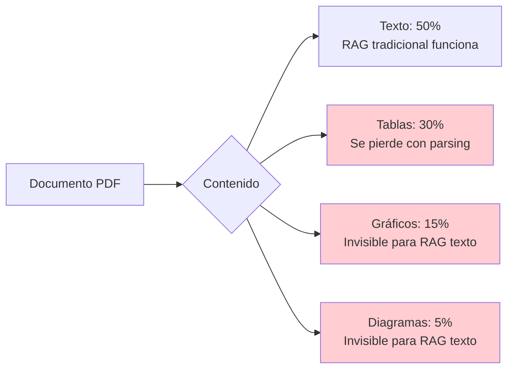
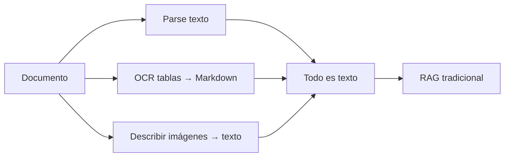
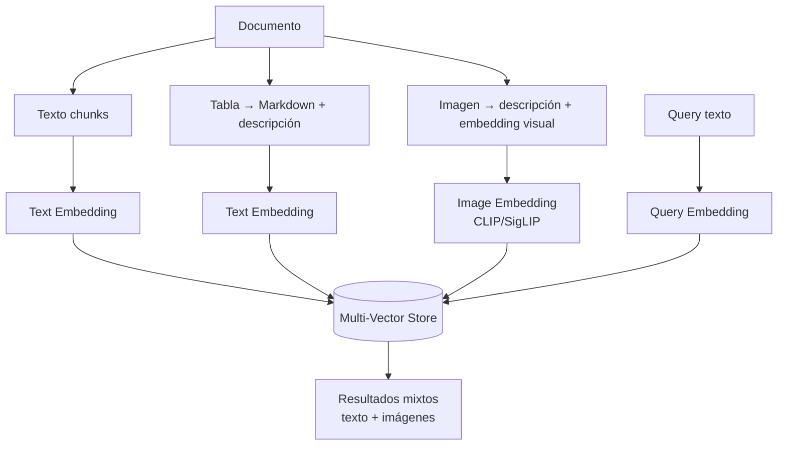
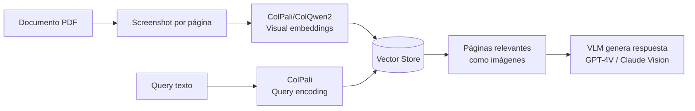
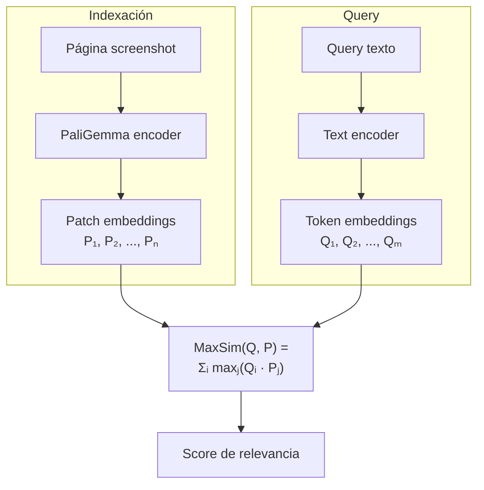
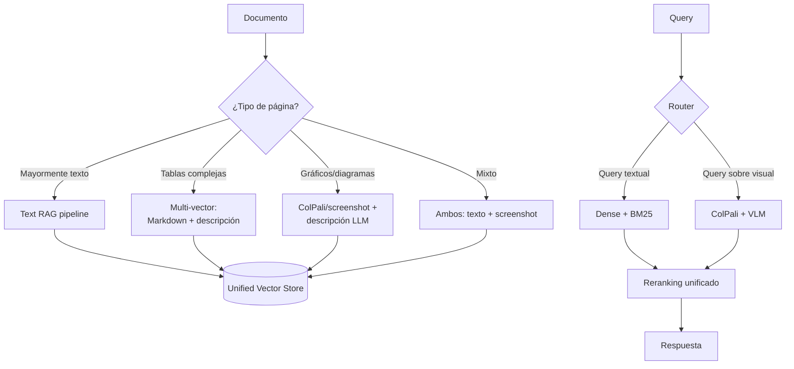

# Multimodal RAG — Más Allá del Texto

> [!abstract] Resumen
> *Multimodal RAG* extiende el retrieval más allá del texto para incluir ==imágenes, tablas, diagramas y documentos como screenshots==. Tecnologías como ColPali, CLIP y SigLIP permiten buscar información visual con la misma facilidad que texto. Este documento cubre arquitecturas, modelos, desafíos y el cambio de paradigma de "parsear y chunking" a "document-as-image".
> ^resumen

---

## Por qué multimodal

El 40-60% de la información en documentos empresariales está en ==formato no textual==:

| Tipo de contenido | Ejemplos | % en docs típicos |
|---|---|---|
| Tablas | Financieras, comparativas, resultados | 25-35% |
| Gráficos | Barras, líneas, pie charts | 10-15% |
| Diagramas | Arquitectura, flujos, organigramas | 5-10% |
| Imágenes | Fotos, capturas de pantalla, logos | 5-10% |
| Fórmulas | Ecuaciones matemáticas, químicas | 2-5% |



> [!danger] Lo que se pierde con RAG solo-texto
> Un sistema RAG que solo procesa texto ==ignora el 40-50% de la información== de documentos empresariales típicos. Tablas financieras, gráficos de rendimiento y diagramas de arquitectura contienen información crítica.

---

## Arquitecturas multimodal

### Arquitectura 1: Parse Everything to Text

La aproximación clásica: extraer todo como texto.



| Pro | Contra |
|---|---|
| Reutiliza pipeline existente | ==Pérdida de información visual== |
| Simple de implementar | OCR/descripción imperfectos |
| Embeddings texto maduros | Coste de LLM para describir |

### Arquitectura 2: Multi-Vector (texto + imagen)

Almacena ==múltiples representaciones== por documento:



### Arquitectura 3: Document-as-Image (ColPali)

El paradigma más reciente: ==tratar cada página como una imagen== y hacer retrieval directamente sobre screenshots.



> [!success] La promesa de document-as-image
> ==Elimina completamente la necesidad de parsing, OCR y chunking==. Un screenshot de una página captura tablas, gráficos, layout y texto en una sola representación. ColPali demostró que este enfoque iguala o supera a text-only RAG en benchmarks de QA sobre documentos.

---

## ColPali: el cambio de paradigma

*ColPali*[^1] aplica la arquitectura *ColBERT* (late interaction) a embeddings visuales:

### Cómo funciona

1. Cada página de documento se convierte en un screenshot
2. Un *Vision Language Model* (PaliGemma) genera un embedding por patch visual
3. La query de texto se codifica en embeddings de tokens
4. *MaxSim* (late interaction) calcula la similitud entre tokens de query y patches visuales



### Benchmarks ColPali

| Método | ViDoRe Benchmark | Parsing necesario | Latencia indexación |
|---|---|---|---|
| Text RAG (PyMuPDF + embed) | 0.68 | ==Sí (complejo)== | Media |
| Text RAG (Unstructured + embed) | 0.74 | ==Sí (complejo)== | Alta |
| ColPali | ==0.81== | ==No== | ==Baja== |
| ColQwen2 | ==0.84== | ==No== | Baja |

> [!tip] Implicación práctica
> ColPali ==elimina la necesidad de parsers complejos== (PyMuPDF, pdfplumber, OCR). Un pipeline que solo necesita: PDF → screenshot → ColPali → vector store. Drásticamente más simple.

---

## Modelos de embedding multimodal

### Para imágenes y texto

| Modelo | Tipo | Dimensiones | Uso | Fortaleza |
|---|---|---|---|---|
| CLIP (OpenAI) | Bi-encoder | 512-768 | Imagen ↔ texto | ==Más maduro== |
| SigLIP (Google) | Bi-encoder | 384-1152 | Imagen ↔ texto | ==Mejor calidad que CLIP== |
| ColPali | Late interaction | Multi-vector | ==Documento ↔ texto== | Retrieval de documentos |
| ColQwen2 | Late interaction | Multi-vector | Documento ↔ texto | ==Mejor que ColPali== |
| Nomic Embed Vision | Bi-encoder | 768 | Imagen ↔ texto | Open source |

### Para tablas

| Enfoque | Método | Calidad | Coste |
|---|---|---|---|
| Tabla → Markdown | Camelot/pdfplumber | Media | ==Bajo== |
| Tabla → JSON | LLM extraction | Alta | Alto |
| Tabla → descripción textual | LLM summary | ==Alta para retrieval== | Medio |
| Tabla como imagen | ColPali/Vision embedding | ==Alta== | Bajo |

> [!example]- Código: Multimodal RAG con tablas
> ```python
> from langchain_openai import ChatOpenAI
> from langchain_core.messages import HumanMessage
> import base64
>
> def describe_table_image(image_path: str) -> str:
>     """Genera descripción textual de una tabla desde imagen."""
>     llm = ChatOpenAI(model="gpt-4o", temperature=0)
>
>     with open(image_path, "rb") as f:
>         image_data = base64.b64encode(f.read()).decode()
>
>     response = llm.invoke([
>         HumanMessage(content=[
>             {"type": "text", "text":
>                 "Describe esta tabla en detalle. Incluye:\n"
>                 "1. Qué datos contiene\n"
>                 "2. Los valores clave\n"
>                 "3. Tendencias o patrones visibles\n"
>                 "4. El contexto aparente"},
>             {"type": "image_url",
>              "image_url": {
>                  "url": f"data:image/png;base64,{image_data}"
>              }},
>         ])
>     ])
>     return response.content
>
> def create_multi_vector_entry(
>     table_image_path: str,
>     table_markdown: str,
> ) -> dict:
>     """Crea entrada multi-vector para una tabla."""
>     description = describe_table_image(table_image_path)
>     return {
>         "original_image": table_image_path,
>         "markdown": table_markdown,
>         "description": description,  # Para embedding y retrieval
>         "vectors": {
>             "text_embedding": embed(description),
>             "markdown_embedding": embed(table_markdown),
>         },
>     }
> ```

---

## Desafíos del multimodal RAG

> [!warning] Desafíos principales

1. **Coste de VLMs**: GPT-4V/Claude Vision son ==4-10x más caros== que modelos solo-texto
2. **Latencia**: Procesar imágenes añade 200-500ms por imagen
3. **Almacenamiento**: Screenshots ocupan ==10-100x más== que texto
4. **Evaluación**: No hay benchmarks estandarizados como RAGAS para multimodal
5. **Alucinaciones visuales**: Los VLMs pueden "inventar" datos de gráficos
6. **Escalabilidad**: ColPali genera múltiples vectores por página (mayor almacenamiento)

### Comparación de costes

| Enfoque | Coste indexación (1K pages) | Coste query | Almacenamiento |
|---|---|---|---|
| Text-only RAG | ==$0.50== | ==$0.01== | ==Bajo== |
| Multi-vector (texto + desc) | $5-15 | $0.05 | Medio |
| ColPali document-as-image | $1-3 | $0.02 | Alto |
| Full VLM per query | $2-5 | ==$0.10-0.50== | Alto |

---

## Arquitectura práctica recomendada



> [!question] ¿Necesito multimodal RAG?
> Evalúa tu corpus:
> - **>70% texto**: Text-only RAG es suficiente
> - **30-50% tablas/gráficos**: ==Multi-vector con descripciones==
> - **Documentos escaneados sin OCR bueno**: ==ColPali document-as-image==
> - **Queries sobre contenido visual**: Full multimodal pipeline

---

## Relación con el ecosistema

- **[[intake-overview|intake]]**: Los parsers de intake manejan la extracción de texto de documentos. Para multimodal RAG, intake puede ==complementarse con ColPali== para capturar la información visual que los parsers de texto pierden.

- **[[architect-overview|architect]]**: architect puede orquestar pipelines multimodales donde diferentes pasos procesan texto vs. imágenes. Los pipelines YAML permiten definir rutas paralelas para contenido textual y visual.

- **[[vigil-overview|vigil]]**: Las imágenes en documentos pueden contener ==texto malicioso invisible== (steganografía, prompt injection en imágenes). Vigil debe extender su análisis a contenido visual.

- **[[licit-overview|licit]]**: Las imágenes pueden contener PII (fotos de personas, documentos de identidad escaneados). Licit debe verificar que el procesamiento visual cumple con GDPR y que hay capacidad de ==borrado de embeddings visuales== asociados a datos personales.

---

## Enlaces y referencias

> [!quote]- Bibliografía
> - Faysse, M., et al. "ColPali: Efficient Document Retrieval with Vision Language Models." arXiv 2024.[^1]
> - Radford, A., et al. "Learning Transferable Visual Models From Natural Language Supervision (CLIP)." ICML 2021.[^2]
> - Zhai, X., et al. "Sigmoid Loss for Language Image Pre-Training (SigLIP)." ICCV 2023.[^3]
> - [[document-ingestion]] — Ingesta de documentos
> - [[embedding-models]] — Modelos de embedding
> - [[retrieval-strategies]] — Estrategias de retrieval
> - [[advanced-rag]] — Patrones avanzados

[^1]: Faysse, M., et al. "ColPali: Efficient Document Retrieval with Vision Language Models." arXiv 2024.
[^2]: Radford, A., et al. "Learning Transferable Visual Models From Natural Language Supervision." ICML 2021.
[^3]: Zhai, X., et al. "Sigmoid Loss for Language Image Pre-Training." ICCV 2023.
