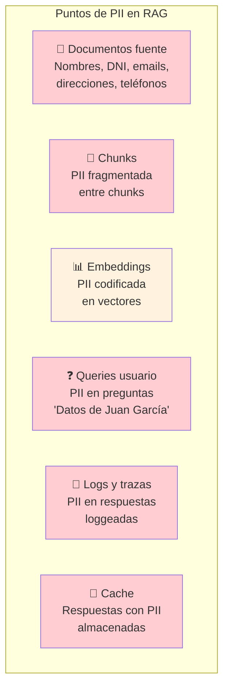
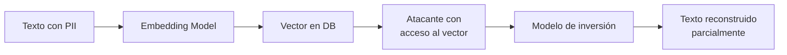
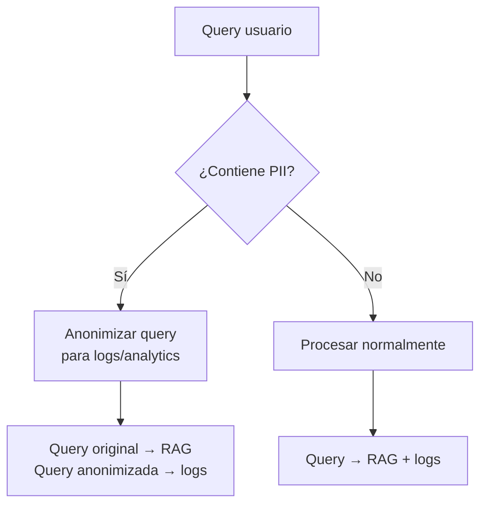
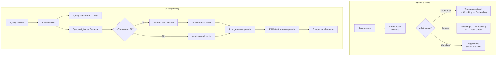

# Manejo de PII en Sistemas RAG

> [!abstract] Resumen
> Los sistemas RAG procesan datos personales (*Personally Identifiable Information*, PII) en ==múltiples puntos== del pipeline: documentos fuente, chunks, embeddings, queries y logs. Este documento cubre dónde aparece PII, herramientas de detección (Presidio, spaCy), estrategias de anonimización, privacidad diferencial en embeddings, riesgos de re-identificación, requisitos GDPR y una arquitectura práctica de protección.
> ^resumen

---

## Dónde aparece PII en un pipeline RAG



> [!danger] PII está en TODAS partes
> El error más común es proteger PII solo en los documentos fuente. ==PII aparece en los 6 puntos del pipeline== y cada uno requiere protección específica.

---

## Tipos de PII relevantes para RAG

| Tipo | Ejemplos | Riesgo | Frecuencia |
|---|---|---|---|
| Nombres | Juan García López | ==Alto== | Muy alta |
| Emails | juan@empresa.com | Alto | Alta |
| Teléfonos | +34 612 345 678 | Medio | Media |
| DNI/NIE/SSN | 12345678A | ==Crítico== | Media |
| Direcciones | Calle Mayor 5, Madrid | Alto | Media |
| IBAN/Tarjetas | ES76 0049 1234... | ==Crítico== | Baja |
| Datos médicos | Diagnóstico, medicamentos | ==Crítico== | Baja-Media |
| Fechas de nacimiento | 15/03/1985 | Medio | Media |
| IP addresses | 192.168.1.1 | Medio | Alta (logs) |

---

## Detección de PII

### Microsoft Presidio

*Presidio*[^1] es el framework open-source más robusto para detección y anonimización de PII:

```python
from presidio_analyzer import AnalyzerEngine
from presidio_anonymizer import AnonymizerEngine

analyzer = AnalyzerEngine()
anonymizer = AnonymizerEngine()

text = "Juan García vive en Calle Mayor 5, Madrid. Su email es juan@empresa.com y su DNI 12345678A."

# Detectar PII
results = analyzer.analyze(
    text=text,
    language="es",
    entities=[
        "PERSON", "EMAIL_ADDRESS", "PHONE_NUMBER",
        "LOCATION", "ES_NIF",  # DNI español
    ],
)

for result in results:
    print(f"{result.entity_type}: "
          f"'{text[result.start:result.end]}' "
          f"(confidence: {result.score:.2f})")
```

### Comparativa de herramientas de detección

| Herramienta | Idiomas | Tipos PII | Precisión | Customizable | Open Source |
|---|---|---|---|---|---|
| Presidio | 50+ | ==30+== | Alta | ==Sí (recognizers)== | ==Sí== |
| spaCy NER | 20+ | 10+ | Media-Alta | Sí | Sí |
| AWS Comprehend | 12+ | 20+ | ==Alta== | No | No |
| Google DLP | 50+ | ==150+== | ==Muy alta== | Limitado | No |
| Private AI | 50+ | 50+ | Alta | Sí | No |

> [!tip] Recomendación
> Usa ==Presidio como base== y extiéndelo con recognizers custom para tu dominio. Para detección de alta sensibilidad (legal, médico), complementa con un ==segundo detector== para reducir falsos negativos.

### spaCy para NER

```python
import spacy

nlp = spacy.load("es_core_news_lg")
doc = nlp("Juan García trabaja en Microsoft Madrid")

for ent in doc.ents:
    print(f"{ent.text} → {ent.label_}")
# Juan García → PER
# Microsoft → ORG
# Madrid → LOC
```

---

## Estrategias de anonimización

### Técnicas por tipo

| Técnica | Descripción | Reversible | Utilidad del dato |
|---|---|---|---|
| Redacción | Reemplazar con `[REDACTED]` | No | ==Mínima== |
| Pseudonimización | Reemplazar con identificador consistente | ==Sí (con clave)== | Media |
| Generalización | "Madrid" → "España" | No | Media |
| Perturbación | "25 años" → "20-30 años" | No | Media |
| Enmascaramiento | "12345678A" → "1234****A" | No | Baja |
| Síntesis | Generar datos ficticios realistas | No | ==Alta== |

> [!example]- Código: Pipeline de anonimización con Presidio
> ```python
> from presidio_analyzer import AnalyzerEngine, PatternRecognizer, Pattern
> from presidio_anonymizer import AnonymizerEngine
> from presidio_anonymizer.entities import (
>     OperatorConfig, RecognizerResult
> )
>
> # Recognizer custom para DNI español
> dni_pattern = Pattern(
>     name="spanish_dni",
>     regex=r"\b\d{8}[A-Z]\b",
>     score=0.9,
> )
> dni_recognizer = PatternRecognizer(
>     supported_entity="ES_DNI",
>     patterns=[dni_pattern],
>     supported_language="es",
> )
>
> analyzer = AnalyzerEngine()
> analyzer.registry.add_recognizer(dni_recognizer)
> anonymizer = AnonymizerEngine()
>
> def anonymize_for_rag(
>     text: str,
>     strategy: str = "pseudonymize",
> ) -> tuple[str, dict]:
>     """Anonimiza texto para RAG preservando utilidad."""
>     # Detectar PII
>     results = analyzer.analyze(
>         text=text,
>         language="es",
>         entities=[
>             "PERSON", "EMAIL_ADDRESS", "PHONE_NUMBER",
>             "LOCATION", "ES_DNI", "IBAN_CODE",
>             "CREDIT_CARD", "DATE_TIME",
>         ],
>     )
>
>     if strategy == "redact":
>         operators = {
>             "DEFAULT": OperatorConfig("replace",
>                 {"new_value": "[REDACTED]"})
>         }
>     elif strategy == "pseudonymize":
>         operators = {
>             "PERSON": OperatorConfig("replace",
>                 {"new_value": "<PERSONA_{}>"}),
>             "EMAIL_ADDRESS": OperatorConfig("replace",
>                 {"new_value": "<EMAIL_{}>"}),
>             "PHONE_NUMBER": OperatorConfig("mask",
>                 {"masking_char": "*", "chars_to_mask": 6,
>                  "from_end": False}),
>             "DEFAULT": OperatorConfig("replace",
>                 {"new_value": "<PII_{}>"}),
>         }
>     else:
>         operators = {
>             "DEFAULT": OperatorConfig("hash",
>                 {"hash_type": "sha256"})
>         }
>
>     # Anonimizar
>     anonymized = anonymizer.anonymize(
>         text=text,
>         analyzer_results=results,
>         operators=operators,
>     )
>
>     # Mapping para posible de-anonimización
>     mapping = {}
>     for original, result in zip(
>         sorted(results, key=lambda x: x.start),
>         anonymized.items
>     ):
>         original_text = text[original.start:original.end]
>         mapping[result.text] = original_text
>
>     return anonymized.text, mapping
>
> # Ejemplo
> text = "Juan García (DNI 12345678A) envió un email a maria@empresa.com"
> anon_text, mapping = anonymize_for_rag(text, "pseudonymize")
> print(anon_text)
> # <PERSONA_1> (DNI <PII_1>) envió un email a <EMAIL_1>
> ```

---

## PII en embeddings: el riesgo oculto

> [!warning] Los embeddings pueden filtrar PII
> Estudios demuestran que es posible ==extraer información personal de los embeddings==[^2]. Un vector que codifica "Juan García, DNI 12345678A" contiene información que un atacante podría intentar reconstruir.

### Ataques de inversión de embeddings



### Mitigaciones

| Mitigación | Efectividad | Impacto en calidad |
|---|---|---|
| Anonimizar antes de embedding | ==Alta== | Mínimo |
| Privacidad diferencial en embeddings | Alta | Medio (-5-10% recall) |
| Reducción de dimensiones (Matryoshka) | Media | Bajo |
| Acceso controlado al vector store | ==Crítico== | Ninguno |
| Cifrado at-rest y in-transit | ==Crítico== | Ninguno |

### Privacidad diferencial en embeddings

La *differential privacy* (DP) añade ruido calibrado a los embeddings para ==imposibilitar la reconstrucción de PII==:

```python
import numpy as np

def add_dp_noise(
    embedding: np.ndarray,
    epsilon: float = 1.0,
    sensitivity: float = 1.0,
) -> np.ndarray:
    """Añade ruido Laplaciano para privacidad diferencial."""
    scale = sensitivity / epsilon
    noise = np.random.laplace(0, scale, embedding.shape)
    noisy_embedding = embedding + noise
    # Re-normalizar
    return noisy_embedding / np.linalg.norm(noisy_embedding)
```

> [!question] ¿Cuánto ruido es suficiente?
> - **epsilon = 0.1**: Protección fuerte, ==pérdida de recall ~15%==
> - **epsilon = 1.0**: Balance razonable, pérdida de recall ~5%
> - **epsilon = 10.0**: Protección débil, pérdida de recall ~1%
>
> En la práctica, ==epsilon = 1.0-3.0== ofrece protección razonable con impacto aceptable.

---

## PII en queries y logs

### Queries del usuario

Los usuarios frecuentemente incluyen PII en sus preguntas:
- "Dame los datos de Juan García"
- "¿Cuál es el email de la directora?"
- "Busca el contrato de 12345678A"

### Protección de queries



> [!tip] Principio de separación
> La query original se usa para el pipeline RAG (necesita PII para buscar correctamente). Pero los ==logs, analytics y monitoring== deben recibir la versión anonimizada.

### Protección de logs

```python
import logging
from presidio_analyzer import AnalyzerEngine

analyzer = AnalyzerEngine()

class PIIFilter(logging.Filter):
    """Filtra PII de logs automáticamente."""
    def filter(self, record):
        if hasattr(record, 'msg') and isinstance(record.msg, str):
            results = analyzer.analyze(
                text=record.msg, language="es"
            )
            for result in sorted(
                results, key=lambda x: x.start, reverse=True
            ):
                record.msg = (
                    record.msg[:result.start] +
                    "[PII]" +
                    record.msg[result.end:]
                )
        return True
```

---

## GDPR y RAG

### Derechos del interesado que afectan a RAG

| Derecho GDPR | Impacto en RAG | Implementación |
|---|---|---|
| Art. 15: Acceso | Mostrar qué datos se almacenan | ==Búsqueda en vector DB por persona== |
| Art. 16: Rectificación | Corregir datos incorrectos | Reindexar documentos corregidos |
| Art. 17: Borrado | ==Derecho al olvido== | ==Borrar chunks + embeddings + cache== |
| Art. 20: Portabilidad | Exportar datos en formato estándar | Export de chunks + metadata |
| Art. 22: No profiling | No tomar decisiones automatizadas | Transparencia en respuestas |

> [!danger] El derecho al olvido en RAG es complejo
> Borrar datos de una persona requiere:
> 1. Identificar ==todos los chunks== que mencionan a la persona
> 2. Borrar esos chunks del vector store
> 3. Borrar embeddings asociados
> 4. ==Invalidar cache== con respuestas que mencionan a la persona
> 5. Borrar de logs y analytics
> 6. Verificar que no hay réplicas o backups con esos datos

---

## Arquitectura práctica de protección PII



> [!success] Principios de diseño
> 1. **Minimización**: Solo procesar PII cuando es estrictamente necesario
> 2. **Aislamiento**: PII separada del texto general cuando sea posible
> 3. **Control de acceso**: ==Chunks con PII requieren autorización==
> 4. **Trazabilidad**: Log de quién accedió a qué PII y cuándo
> 5. **Borrado granular**: Capacidad de borrar PII de una persona específica

---

## Riesgo de re-identificación

> [!warning] La anonimización no es perfecta
> Incluso con anonimización, la ==combinación de datos== puede permitir re-identificar personas:
> - "Un hombre de 35 años, ingeniero, que vive en Logroño" → probablemente identificable
> - Chunks consecutivos pueden contener piezas que juntas revelan identidad

### Evaluación de riesgo

| Factor | Riesgo bajo | Riesgo alto |
|---|---|---|
| Tamaño de población | Grande (>100K) | ==Pequeño (<1000)== |
| Granularidad de datos | General | ==Específico== |
| Combinación de quasi-identifiers | Ninguna | ==2+ quasi-IDs en mismo chunk== |
| Contexto del chunk | Genérico | ==Específico de persona== |

---

## Relación con el ecosistema

- **[[intake-overview|intake]]**: intake debe integrar ==detección de PII como fase de su pipeline de 5 fases==. Antes de que un documento entre al sistema RAG, intake debe clasificarlo por nivel de PII y aplicar las políticas correspondientes.

- **[[architect-overview|architect]]**: Los 22 layers de seguridad de architect incluyen protección de datos sensibles. architect puede orquestar el pipeline de anonimización como un step YAML con retry y logging seguro vía OpenTelemetry.

- **[[vigil-overview|vigil]]**: vigil complementa la detección de PII con sus ==26 reglas de seguridad==. Mientras Presidio detecta PII, vigil detecta patrones de exfiltración (queries diseñadas para extraer PII del sistema) y prompt injection.

- **[[licit-overview|licit]]**: licit es el ==guardián de compliance==. Verifica que el sistema RAG cumple con GDPR, EU AI Act y OWASP Agentic Top 10. La trazabilidad de proveniencia de licit documenta qué datos se procesaron, cuándo, y con qué base legal. La firma criptográfica protege la integridad de los registros de procesamiento de PII.

---

## Enlaces y referencias

> [!quote]- Bibliografía
> - Microsoft Presidio Documentation. https://microsoft.github.io/presidio/[^1]
> - Morris, J., et al. "Text Embeddings Reveal (Almost) As Much As Text." EMNLP 2023.[^2]
> - GDPR. Regulation (EU) 2016/679. https://gdpr-info.eu/
> - EDPB. "Guidelines on Anonymisation Techniques." 2014.
> - [[rag-en-produccion]] — Consideraciones de producción
> - [[document-ingestion]] — PII durante la ingesta
> - [[semantic-caching]] — PII en cache
> - [[vector-databases]] — Borrado granular de vectores

[^1]: Microsoft Presidio. "Data Protection and De-identification SDK." https://microsoft.github.io/presidio/
[^2]: Morris, J., et al. "Text Embeddings Reveal (Almost) As Much As Text." EMNLP 2023.
