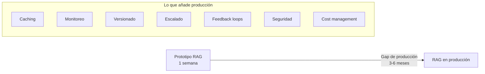
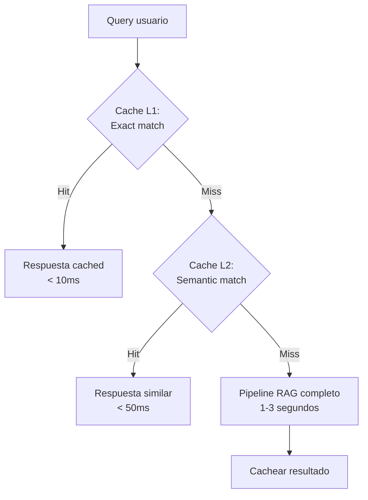
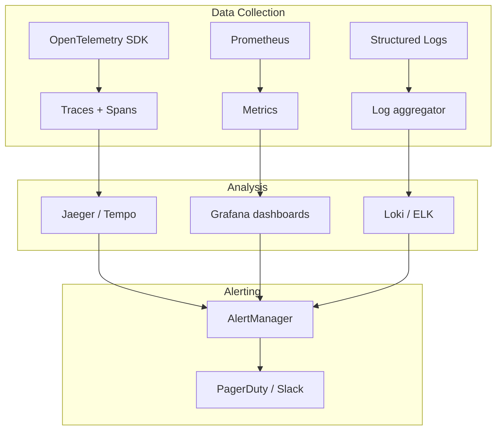
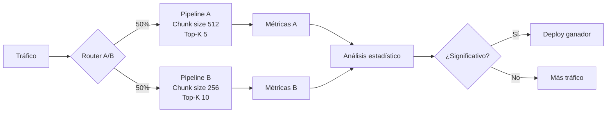
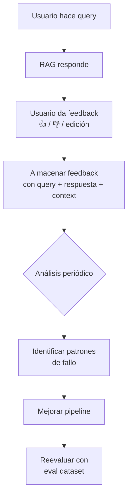
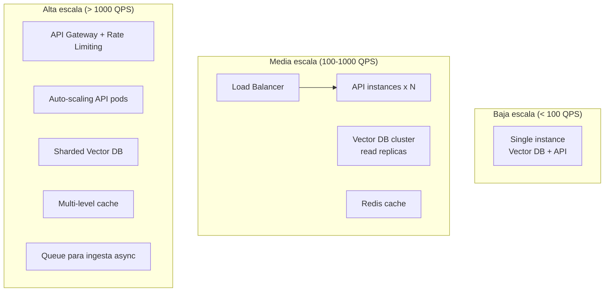

# RAG en Producción

> [!abstract] Resumen
> Pasar un prototipo RAG a producción es un ==orden de magnitud más complejo== de lo que parece. Este documento cubre caching, monitoreo, versionado, A/B testing, feedback loops, optimización de costes, escalado, modos de fallo y las lecciones aprendidas en sistemas RAG reales. El gap prototipo → producción es donde mueren la mayoría de proyectos RAG.
> ^resumen

---

## El gap prototipo → producción



| Aspecto | Prototipo | Producción |
|---|---|---|
| Usuarios | 1-5 (tú) | ==Cientos/miles== |
| Evaluación | "Se ve bien" | ==Métricas automatizadas + CI/CD== |
| Latencia aceptable | 10 segundos | ==< 3 segundos P95== |
| Disponibilidad | "Reinicio manual" | ==99.9% SLA== |
| Costes | No importa | ==$X/query optimizado== |
| Datos | Estáticos | ==Actualizados continuamente== |

> [!danger] La demo no es el producto
> El 80% de los proyectos RAG que funcionan como demo ==nunca llegan a producción==. Las razones: latencia inaceptable, costes descontrolados, evaluación insuficiente, y falta de operaciones.

---

## Caching

El caching es la optimización con ==mayor impacto en coste y latencia==:

### Niveles de cache



| Nivel | Tipo | Hit rate típico | Latencia | Implementación |
|---|---|---|---|---|
| L1: Exact | Hash de query | 5-15% | ==<10ms== | Redis |
| L2: Semantic | Similitud embedding | 20-40% | <50ms | [[semantic-caching]] |
| L3: Component | Cache por fase | Variable | Variable | Custom |

> [!tip] Semantic caching
> El [[semantic-caching|cache semántico]] reutiliza respuestas para queries ==semánticamente similares== (no solo idénticas). "¿Cuál es la tasa?" y "¿A cuánto está la tasa de interés?" comparten respuesta. Ahorra 50-80% de costes LLM.

### Cache de embeddings

```python
import hashlib
import redis

r = redis.Redis()

def get_or_compute_embedding(text: str, model) -> list:
    key = f"emb:{hashlib.sha256(text.encode()).hexdigest()}"
    cached = r.get(key)
    if cached:
        return json.loads(cached)
    embedding = model.embed(text)
    r.setex(key, 86400, json.dumps(embedding))  # TTL 24h
    return embedding
```

---

## Monitoreo

### Métricas clave a monitorear

| Categoría | Métrica | Umbral alerta | Herramienta |
|---|---|---|---|
| Latencia | P50, P95, P99 | P95 > 3s | ==Prometheus + Grafana== |
| Calidad | Faithfulness (muestreo) | < 0.80 | RAGAS + custom |
| Costes | $ por query | > presupuesto | OpenTelemetry |
| Retrieval | Avg. docs retrieved | < 3 o > 15 | Custom metrics |
| Errores | Tasa de error | > 1% | ==Sentry / Datadog== |
| Feedback | Thumbs down rate | > 15% | Custom |
| Cache | Hit rate | < 20% | Redis metrics |

### Dashboard de monitoreo



> [!warning] Observabilidad no es opcional
> Sin monitoreo, la ==degradación del RAG es silenciosa==. El modelo no lanza excepciones cuando alucina; simplemente da respuestas incorrectas con confianza. Solo el monitoreo continuo de métricas de calidad detecta estos problemas.

---

## Versionado

Todo debe estar versionado para reproducibilidad:

| Componente | Qué versionar | Cómo |
|---|---|---|
| Documentos fuente | Hash + fecha de ingesta | ==Git LFS / DVC== |
| Índice vectorial | Snapshot + config | Backup periódico |
| Modelo embedding | Nombre + versión + dims | Config file |
| Prompt templates | Texto exacto | ==Git== |
| Pipeline config | Chunk size, top-K, etc. | ==YAML en Git== |
| Eval dataset | Queries + ground truth | Git |
| Resultados eval | Métricas por versión | MLflow / W&B |

> [!success] Reproducibilidad
> Si un usuario reporta un problema, debes poder ==reproducir exactamente el mismo pipeline== que generó esa respuesta. Sin versionado, debugging es imposible.

---

## A/B Testing



### Qué testear con A/B

| Variable | Impacto esperado | Duración mínima test |
|---|---|---|
| Modelo embedding | ==Alto== | 1-2 semanas |
| Chunk size | Alto | 1 semana |
| Reranker on/off | Medio-Alto | 1 semana |
| Top-K | Medio | 3-5 días |
| Prompt template | ==Medio-Alto== | 1 semana |
| Modelo LLM | Alto | 1-2 semanas |

---

## Feedback Loops



### Tipos de feedback

| Tipo | Signal quality | Coste | Implementación |
|---|---|---|---|
| Thumbs up/down | Baja (binario) | ==Muy bajo== | UI simple |
| Rating 1-5 | Media | Bajo | UI simple |
| Respuesta editada | ==Alta== | Medio (esfuerzo usuario) | Editor inline |
| Pregunta de seguimiento | Alta (implícita) | ==Nulo== | Análisis de logs |

> [!tip] El feedback implícito
> Si un usuario reformula la pregunta inmediatamente después de recibir una respuesta, es ==señal fuerte de insatisfacción==. Monitorea la tasa de reformulación como proxy de calidad.

---

## Optimización de costes

### Desglose de costes típico

| Componente | % del coste total | Optimización |
|---|---|---|
| LLM (generación) | ==60-70%== | Cache semántico, modelo más barato |
| Embeddings | 10-15% | Matryoshka, batch, cache |
| Vector DB | 10-15% | Dimensiones reducidas, PQ |
| Reranking | 5-10% | Open source (BGE, FlashRank) |
| Infraestructura | 5-10% | Auto-scaling |

### Estrategias de ahorro

| Estrategia | Ahorro estimado | Impacto en calidad |
|---|---|---|
| [[semantic-caching]] | ==50-80%== | Ninguno |
| Matryoshka embeddings (1024→256) | 75% storage | Mínimo (-2%) |
| LLM routing (fácil→pequeño, difícil→grande) | 40-60% | Mínimo |
| Reranker open source | 100% (vs API) | Mínimo |
| Batch embeddings | 30-50% | Ninguno |

> [!example]- Código: LLM Routing por complejidad
> ```python
> from openai import OpenAI
>
> client = OpenAI()
>
> def classify_complexity(query: str) -> str:
>     """Clasifica la complejidad de la query."""
>     response = client.chat.completions.create(
>         model="gpt-4o-mini",
>         messages=[{
>             "role": "user",
>             "content": f"Clasifica la complejidad de esta "
>                        f"pregunta como SIMPLE, MEDIA o COMPLEJA. "
>                        f"Responde solo la clasificación.\n"
>                        f"Pregunta: {query}"
>         }],
>         temperature=0,
>         max_tokens=10,
>     )
>     return response.choices[0].message.content.strip()
>
> def route_to_model(query: str) -> str:
>     """Selecciona el modelo según complejidad."""
>     complexity = classify_complexity(query)
>     models = {
>         "SIMPLE": "gpt-4o-mini",     # $0.15/1M input
>         "MEDIA": "gpt-4o-mini",      # $0.15/1M input
>         "COMPLEJA": "gpt-4o",        # $2.50/1M input
>     }
>     return models.get(complexity, "gpt-4o-mini")
> ```

---

## Escalado

### Patrones de escalado



| Escala | Arquitectura | Infra típica | Coste mensual |
|---|---|---|---|
| < 10 QPS | Monolito | 1 VM + Chroma | ==$50-200== |
| 10-100 QPS | Microservicios | K8s + Qdrant | $500-2000 |
| 100-1000 QPS | Distribuido | K8s + Qdrant cluster | $2000-10000 |
| > 1000 QPS | Full distributed | K8s + sharded Milvus | ==$10000+== |

---

## Modos de fallo en producción

> [!failure] Fallos que solo aparecen en producción

| Fallo | Síntoma | Causa | Mitigación |
|---|---|---|---|
| Degradación silenciosa | Calidad baja sin errores | Documentos actualizados no reindexados | ==Monitoreo de calidad continuo== |
| Cost explosion | Factura inesperada | Queries sin cache, loops | Rate limiting + alertas de coste |
| Stale cache | Respuestas obsoletas | Cache sin invalidación | TTL + invalidación en reindex |
| Cold start | Primeras queries lentas | Vector DB loading index | Warm-up queries |
| Concurrent reindex | Resultados inconsistentes | Reindexar mientras se sirven queries | ==Blue-green deployment== de índices |
| Prompt injection | Respuestas manipuladas | Queries maliciosas | Filtrado de input, [[vigil-overview|vigil]] |

---

## Checklist de producción

> [!success] Checklist antes de ir live

- [ ] Eval dataset con ≥200 queries, segmentado por categoría
- [ ] Métricas RAGAS: faithfulness ≥ 0.85, context recall ≥ 0.75
- [ ] Latencia P95 < 3 segundos
- [ ] Semantic cache implementado y testeado
- [ ] Monitoreo con alertas (Prometheus + Grafana)
- [ ] Feedback loop implementado (mínimo thumbs up/down)
- [ ] Rate limiting configurado
- [ ] PII handling implementado ([[pii-handling-rag]])
- [ ] Versionado de pipeline completo en Git
- [ ] Runbook de incidentes documentado
- [ ] Plan de rollback en caso de degradación

---

## Relación con el ecosistema

- **[[intake-overview|intake]]**: En producción, intake funciona como ==servicio de ingesta continua== con su servidor MCP. Nuevos documentos alimentan el pipeline de reindexación automatizado. La pipeline de 5 fases de intake garantiza calidad de parsing consistente a escala.

- **[[architect-overview|architect]]**: Los ==22 layers de seguridad de architect== son relevantes para proteger el pipeline RAG en producción. OpenTelemetry de architect proporciona observabilidad end-to-end. El cost tracking monitorea gasto acumulado en APIs de LLM y embedding.

- **[[vigil-overview|vigil]]**: En producción, vigil actúa como ==guardian de las queries entrantes==. Sus 26 reglas y 4 analizadores detectan prompt injection, PII en queries, y código malicioso en documentos nuevos antes de la indexación.

- **[[licit-overview|licit]]**: Producción requiere compliance continuo. Licit verifica que el sistema RAG cumple con EU AI Act en runtime: ==trazabilidad de respuestas, gestión de consentimiento, y derecho al olvido== (GDPR art. 17).

---

## Enlaces y referencias

> [!quote]- Bibliografía
> - Databricks. "RAG Production Best Practices." Blog 2024.
> - LangChain. "Building Production RAG Applications." https://blog.langchain.dev/
> - Pinecone. "RAG at Scale: Lessons Learned." Blog 2024.
> - [[rag-overview]] — Visión general
> - [[rag-evaluation]] — Evaluación continua
> - [[semantic-caching]] — Cache semántico
> - [[pii-handling-rag]] — Manejo de PII
> - [[vector-databases]] — Infraestructura vectorial

[^1]: Databricks. "Quality Evaluation Best Practices for RAG Applications." 2024.
