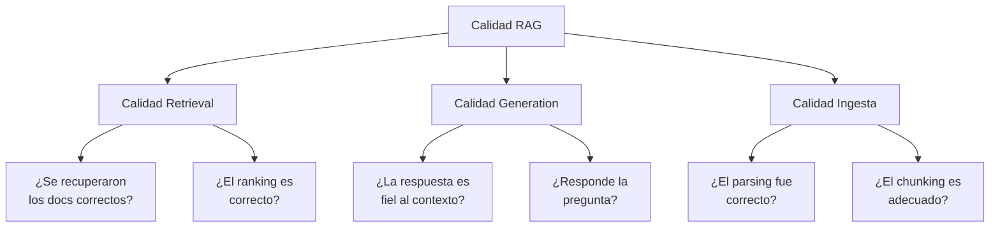
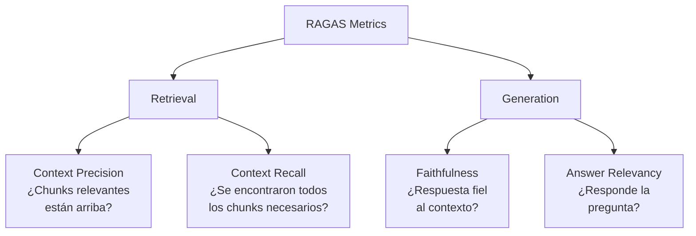
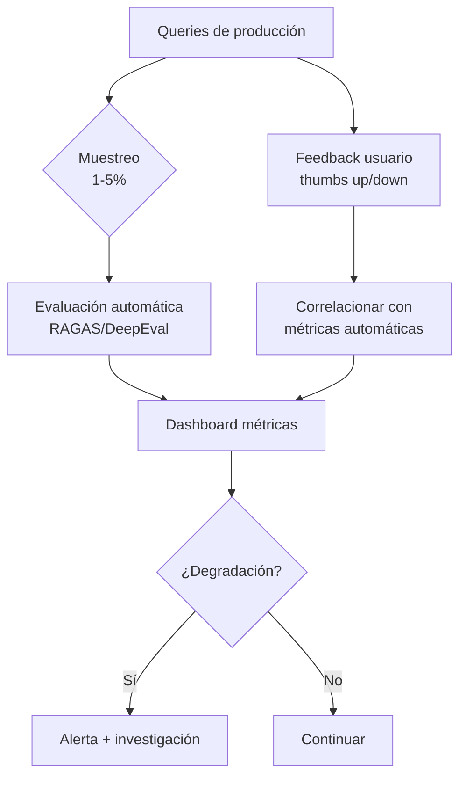

# Evaluación de Sistemas RAG

> [!abstract] Resumen
> Evaluar un sistema RAG es ==más difícil que evaluar un LLM estándar== porque hay múltiples componentes (retrieval + generation) que pueden fallar independientemente. Este documento cubre el framework RAGAS, métricas por componente, herramientas (RAGAS, DeepEval, TruLens, Galileo, Promptfoo), creación de datasets de evaluación, evaluación continua y anti-patrones.
> ^resumen

---

## Por qué la evaluación RAG es difícil



> [!danger] El problema de atribución
> Cuando una respuesta RAG es mala, ==¿fue culpa del retrieval o de la generación?== Una respuesta alucinada podría deberse a:
> - Chunks incorrectos recuperados (retrieval)
> - Chunks correctos pero mal interpretados (generation)
> - Chunks con información incorrecta (ingesta/fuente)
>
> La evaluación por componente es esencial para diagnosticar.

---

## Framework RAGAS

*RAGAS* (*Retrieval Augmented Generation Assessment*)[^1] es el framework estándar de evaluación con métricas automatizadas:

### Métricas principales



| Métrica | Qué evalúa | Fórmula simplificada | Objetivo producción |
|---|---|---|---|
| *Faithfulness* | Fidelidad al contexto | Claims soportados / Total claims | ==≥ 0.85== |
| *Answer Relevancy* | Relevancia de la respuesta | Similitud semántica con query | ==≥ 0.80== |
| *Context Precision* | Ranking de chunks | % relevantes en top posiciones | ==≥ 0.75== |
| *Context Recall* | Cobertura de chunks | Sentences de GT cubiertas por contexto | ==≥ 0.80== |
| *Answer Correctness* | Corrección factual | F1 de claims correctos | ≥ 0.75 |

### Evaluación por componente vs end-to-end

| Tipo | Métricas | Qué diagnostica | Cuándo usar |
|---|---|---|---|
| Component: Retrieval | Context Precision, Recall | ==Problemas de búsqueda== | Optimización de retrieval |
| Component: Generation | Faithfulness, Relevancy | ==Problemas de LLM/prompt== | Optimización de prompt |
| End-to-End | Answer Correctness | Calidad global percibida | Reporte a stakeholders |

> [!tip] Evalúa componentes primero
> Siempre evalúa retrieval y generation ==por separado== antes del end-to-end. Si el retrieval falla, optimizar el prompt es inútil.

---

## Implementación con RAGAS

> [!example]- Código: Evaluación completa con RAGAS
> ```python
> from ragas import evaluate
> from ragas.metrics import (
>     faithfulness,
>     answer_relevancy,
>     context_precision,
>     context_recall,
> )
> from datasets import Dataset
>
> # Preparar dataset de evaluación
> eval_data = {
>     "question": [
>         "¿Cuál es la tasa de interés actual?",
>         "¿Quién es el CEO de la empresa?",
>         "¿Cuáles fueron los resultados del Q3?",
>     ],
>     "answer": [
>         "La tasa de interés actual es 5.25%.",
>         "El CEO es Juan García desde 2022.",
>         "Los ingresos del Q3 fueron $50M.",
>     ],
>     "contexts": [
>         ["La tasa de interés se fijó en 5.25% en marzo."],
>         ["Juan García fue nombrado CEO en enero 2022."],
>         ["Resultados Q3: ingresos $50M, EBITDA $12M."],
>     ],
>     "ground_truth": [
>         "La tasa es 5.25%, fijada en la reunión de marzo.",
>         "Juan García es CEO desde enero 2022.",
>         "Q3: $50M ingresos, $12M EBITDA, 24% margen.",
>     ],
> }
>
> dataset = Dataset.from_dict(eval_data)
>
> # Ejecutar evaluación
> results = evaluate(
>     dataset=dataset,
>     metrics=[
>         faithfulness,
>         answer_relevancy,
>         context_precision,
>         context_recall,
>     ],
> )
>
> # Resultados
> print(results)
> # {'faithfulness': 0.92, 'answer_relevancy': 0.88,
> #  'context_precision': 0.85, 'context_recall': 0.78}
>
> # Análisis por pregunta
> df = results.to_pandas()
> print(df[df['faithfulness'] < 0.8])  # Preguntas problemáticas
> ```

---

## Herramientas de evaluación

### Comparativa

| Herramienta | Tipo | Métricas | CI/CD | Coste | Fortaleza |
|---|---|---|---|---|---|
| RAGAS | OSS | ==Completas== | Sí | ==Gratis== | Estándar de facto |
| DeepEval | OSS | Completas + custom | ==Sí (pytest)== | Gratis | ==Integración pytest== |
| TruLens | OSS | Feedback functions | Sí | Gratis | Observabilidad |
| Galileo | SaaS | Auto-métricas | Sí | Pagado | Dashboard visual |
| Promptfoo | OSS | LLM-as-judge + custom | ==Sí (CLI)== | ==Gratis== | Versátil, config YAML |
| Phoenix (Arize) | OSS | Traces + métricas | Sí | Gratis | ==Observabilidad completa== |

> [!info] Recomendación por caso
> - **Evaluación rápida en desarrollo**: RAGAS
> - **Integración en tests**: ==DeepEval (pytest nativo)==
> - **Evaluación continua en producción**: TruLens + Phoenix
> - **Evaluación de prompts**: ==Promptfoo==
> - **Equipo no técnico**: Galileo (dashboard)

### DeepEval con pytest

```python
# test_rag.py — se ejecuta con pytest
from deepeval import assert_test
from deepeval.test_case import LLMTestCase
from deepeval.metrics import (
    FaithfulnessMetric,
    AnswerRelevancyMetric,
)

def test_rag_faithfulness():
    test_case = LLMTestCase(
        input="¿Cuál es la tasa de interés?",
        actual_output="La tasa es 5.25%.",
        retrieval_context=["Tasa fijada en 5.25% en marzo."],
    )
    metric = FaithfulnessMetric(threshold=0.85)
    assert_test(test_case, [metric])
```

---

## Creación de datasets de evaluación

### El problema del ground truth

> [!warning] Sin ground truth no hay evaluación
> El mayor obstáculo para evaluar RAG es ==crear un dataset de evaluación con respuestas correctas==. Esto requiere expertos del dominio, lo cual es costoso y lento.

### Estrategias para crear eval datasets

| Estrategia | Coste | Calidad | Escalabilidad |
|---|---|---|---|
| Expertos manuales | ==Alto== | ==Máxima== | Baja (50-200 queries) |
| LLM-generated + revisión | Medio | Alta | Media (500-2000) |
| LLM-generated sin revisión | ==Bajo== | Media | ==Alta (1000+)== |
| Logs de producción + feedback | Bajo (continuo) | Variable | Alta |

> [!example]- Código: Generar eval dataset con LLM
> ```python
> from openai import OpenAI
> import json
>
> client = OpenAI()
>
> def generate_eval_questions(
>     chunks: list[str],
>     n_questions_per_chunk: int = 2,
> ) -> list[dict]:
>     """Genera preguntas de evaluación desde chunks."""
>     eval_data = []
>
>     for chunk in chunks:
>         response = client.chat.completions.create(
>             model="gpt-4o",
>             messages=[{
>                 "role": "user",
>                 "content": f"""Genera {n_questions_per_chunk} preguntas
> que se puedan responder usando SOLO este texto.
> Para cada pregunta, incluye la respuesta correcta.
>
> Texto: {chunk}
>
> Formato JSON:
> [{{"question": "...", "answer": "...", "context": "..."}}]"""
>             }],
>             temperature=0.3,
>             response_format={"type": "json_object"},
>         )
>         questions = json.loads(
>             response.choices[0].message.content
>         )
>         for q in questions.get("questions", []):
>             eval_data.append({
>                 "question": q["question"],
>                 "ground_truth": q["answer"],
>                 "source_chunk": chunk,
>             })
>
>     return eval_data
> ```

### Tamaño recomendado del eval dataset

| Fase | Mínimo | Recomendado | Notas |
|---|---|---|---|
| Prototipo | 20 | 50 | Validación rápida |
| Pre-producción | 100 | ==200-500== | Cobertura de edge cases |
| Producción | 200 | ==500-1000== | Segmentado por categoría |

---

## Evaluación continua en producción



### Señales de degradación

> [!failure] Señales de alarma
> - *Faithfulness* cae por debajo de 0.80
> - Tasa de "No tengo información" sube > 15%
> - Latencia P95 sube > 3 segundos
> - Feedback negativo del usuario sube > 20%
> - Context recall cae después de reindexar

---

## A/B Testing para RAG

| Qué testear | Variable A | Variable B | Métrica primaria |
|---|---|---|---|
| Modelo embedding | OpenAI | Cohere | Context Recall |
| Chunk size | 256 | 512 | Faithfulness |
| Reranker | Cohere | BGE | ==Answer Correctness== |
| Top-K | 5 | 10 | Answer Relevancy |
| Prompt template | Template v1 | Template v2 | Faithfulness |

> [!question] ¿Cuántas queries para A/B testing?
> Para detectar una diferencia del 5% con confianza del 95%:
> - ==Mínimo 400 queries por variante==
> - Si la varianza es alta: 1000+ queries
> - Siempre usar las mismas queries para ambas variantes

---

## Pitfalls de la evaluación

> [!danger] Errores comunes en evaluación RAG

1. **Evaluar solo end-to-end**: No diagnostica dónde falla el pipeline
2. **Eval dataset demasiado pequeño**: 20 queries no es estadísticamente significativo
3. **Eval dataset sesgado**: Solo queries fáciles o solo de un dominio
4. **No evaluar después de cambios**: Reindexar sin reevaluar es peligroso
5. **LLM-as-judge sin calibrar**: El LLM evaluador puede tener sus propios sesgos
6. **Ignorar latencia y coste**: Una mejora del 2% en faithfulness no justifica 3x en latencia
7. **No versionar el eval dataset**: Sin versionado, los resultados no son reproducibles

---

## Relación con el ecosistema

- **[[intake-overview|intake]]**: La calidad de la ingesta impacta directamente en las métricas de evaluación. Si intake parsea mal un documento, ==context recall será bajo== independientemente del retriever. Evaluar la ingesta es el primer paso.

- **[[architect-overview|architect]]**: Los pipelines YAML de architect pueden incluir un ==step de evaluación automática== después de cada cambio en el pipeline RAG. El loop de Ralph de architect es análogo a evaluar → ajustar → reevaluar.

- **[[vigil-overview|vigil]]**: vigil puede analizar los datasets de evaluación para detectar ==queries con prompt injection== que podrían sesgar los resultados. También puede verificar que las respuestas generadas no contienen información sensible filtrada.

- **[[licit-overview|licit]]**: El EU AI Act requiere ==evaluación documentada de sistemas de IA==. Licit puede verificar que los procesos de evaluación cumplen con los requisitos de Annex IV (testing, validación, documentación de métricas).

---

## Enlaces y referencias

> [!quote]- Bibliografía
> - Es, S., et al. "RAGAS: Automated Evaluation of Retrieval Augmented Generation." arXiv 2023.[^1]
> - DeepEval Documentation. https://docs.confident-ai.com/
> - TruLens Documentation. https://trulens.org/
> - Promptfoo Documentation. https://promptfoo.dev/
> - [[rag-pipeline-completo]] — Pipeline completo
> - [[rag-en-produccion]] — RAG en producción
> - [[retrieval-strategies]] — Estrategias evaluables
> - [[reranking]] — Impacto del reranking en métricas

[^1]: Es, S., et al. "RAGAS: Automated Evaluation of Retrieval Augmented Generation." arXiv 2023. https://arxiv.org/abs/2309.15217
[^2]: Zheng, L., et al. "Judging LLM-as-a-Judge with MT-Bench and Chatbot Arena." NeurIPS 2023.
