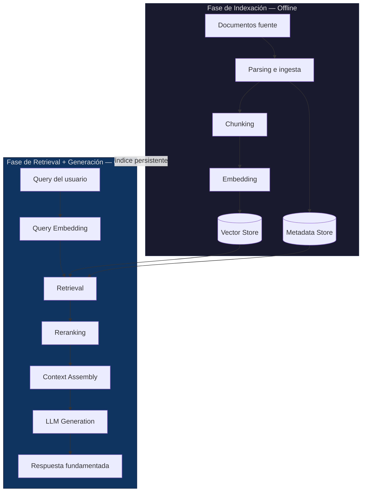
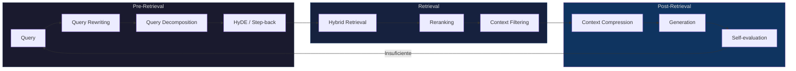
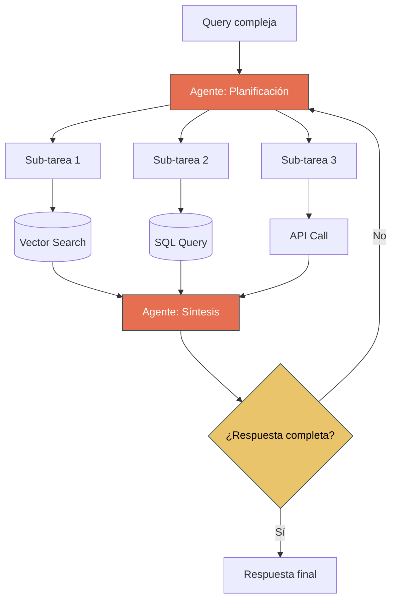
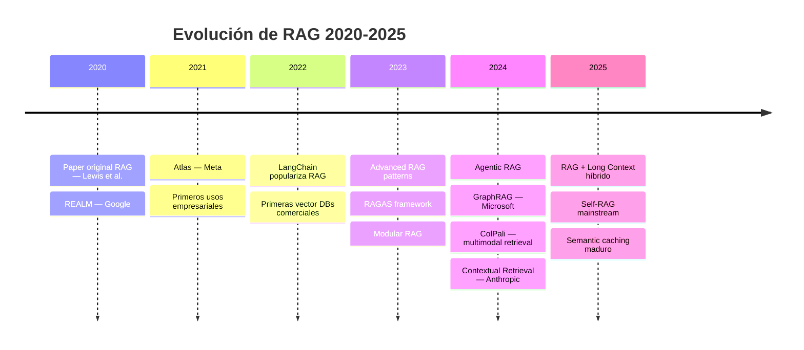

# RAG — Retrieval-Augmented Generation

> [!abstract] Resumen
> *Retrieval-Augmented Generation* (RAG) es un patrón arquitectónico que ==combina la recuperación de información externa con la generación de texto mediante LLMs==, resolviendo problemas críticos como el corte de conocimiento (*knowledge cutoff*), las alucinaciones y la falta de fundamentación (*grounding*). Esta nota cubre la motivación, arquitectura nuclear, taxonomía de variantes (Naive, Advanced, Modular, Agentic), métricas de evaluación y modos de fallo comunes.
> ^resumen

## Por qué existe RAG

Los *Large Language Models* (LLMs) presentan tres limitaciones fundamentales que RAG aborda directamente:

| Limitación | Descripción | Cómo RAG la resuelve |
|---|---|---|
| *Knowledge cutoff* | El modelo solo conoce datos hasta su fecha de entrenamiento | ==Inyecta contexto actualizado en tiempo real== |
| Alucinaciones | Genera información plausible pero falsa | Fundamenta respuestas en documentos recuperados |
| Falta de especificidad | No conoce datos privados o de dominio | Recupera de bases de conocimiento corporativas |
| Costo de actualización | Reentrenar por cada cambio es prohibitivo | Actualiza la base documental sin tocar el modelo |

> [!info] Origen del término
> El término RAG fue acuñado por Lewis et al. en 2020 en el paper "Retrieval-Augmented Generation for Knowledge-Intensive NLP Tasks"[^1]. Desde entonces, el patrón ha evolucionado de forma radical, pasando de un enfoque monolítico a arquitecturas modulares y agénticas.

### El problema del *grounding*

Sin RAG, un LLM responde exclusivamente desde sus pesos paramétricos. Esto genera:

1. **Imposibilidad de citar fuentes** — no hay trazabilidad entre respuesta y evidencia
2. **Datos desactualizados** — el conocimiento queda congelado en la fecha de corte
3. **Confidencialidad comprometida** — para usar datos privados, habría que hacer *fine-tuning*, exponiendo datos en los pesos
4. **Costo de actualización** — reentrenar o hacer *fine-tuning* por cada cambio de conocimiento es prohibitivo

> [!tip] Principio fundamental
> RAG separa el ==conocimiento== (almacenado en documentos externos) del ==razonamiento== (ejecutado por el LLM). Esta separación permite actualizar el conocimiento sin tocar el modelo.

## Arquitectura nuclear

La arquitectura RAG consta de dos fases principales: **indexación** (offline) y **recuperación + generación** (online).



### Fase de indexación (offline)

La fase de indexación transforma documentos crudos en representaciones vectoriales buscables:

1. **Ingesta** — Parseo de PDFs, HTML, Office, etc. ([[document-ingestion]])
2. **Chunking** — División en fragmentos semánticos ([[chunking-strategies]])
3. **Embedding** — Conversión a vectores densos ([[embedding-models]])
4. **Almacenamiento** — Persistencia en *vector stores* con metadatos

### Fase de recuperación + generación (online)

1. **Query embedding** — La consulta del usuario se convierte al mismo espacio vectorial
2. **Retrieval** — Búsqueda por similitud coseno, MMR o híbrida
3. **Reranking** — Reordenamiento de resultados con modelos *cross-encoder* ([[reranking-strategies]])
4. **Context assembly** — Construcción del prompt con los chunks más relevantes
5. **Generation** — El LLM genera una respuesta fundamentada en el contexto

> [!warning] Ventana de contexto no es infinita
> Aunque los modelos modernos soportan ventanas de 128K–1M tokens, ==la calidad degrada con contextos muy largos== (*lost in the middle* problem)[^2]. RAG selecciona solo los fragmentos más relevantes, optimizando la señal/ruido.

## RAG vs Fine-tuning vs Long Context

> [!question] ¿Cuándo usar cada enfoque?
> La decisión entre RAG, *fine-tuning* y *long context* depende del caso de uso. No son mutuamente excluyentes: las mejores arquitecturas combinan múltiples técnicas.

| Criterio | RAG | *Fine-tuning* | *Long Context* |
|---|---|---|---|
| Conocimiento actualizable | ==Sí, en tiempo real== | No (requiere reentrenamiento) | Sí, pero limitado por ventana |
| Citabilidad | ==Alta (fuentes trazables)== | Nula | Media (sin recuperación explícita) |
| Costo de implementación | Medio | Alto | ==Bajo== |
| Latencia | Media (retrieval + generation) | ==Baja== | Alta (procesar todo el contexto) |
| Escala de conocimiento | ==Ilimitada== | Limitada por capacidad del modelo | Limitada por ventana de contexto |
| Datos privados | Seguros (no en pesos) | ==Riesgo de filtración== | Seguros pero en memoria |
| Precisión en dominio | Alta con buen retrieval | ==Muy alta== | Variable |
| Complejidad operativa | Media-Alta | Alta | ==Baja== |

> [!example]- Árbol de decisión para elegir enfoque
> ```mermaid
> flowchart TD
>     START[¿Necesito conocimiento externo?] -->|Sí| EXT[¿Se actualiza frecuentemente?]
>     START -->|No| FT[Fine-tuning o Prompting]
>     EXT -->|Sí| RAG[RAG]
>     EXT -->|No| SIZE[¿Cabe en la ventana de contexto?]
>     SIZE -->|Sí| LC[Long Context]
>     SIZE -->|No| RAG2[RAG]
>     RAG --> CITE[¿Necesito citar fuentes?]
>     RAG2 --> CITE
>     CITE -->|Sí| RAGF[RAG con trazabilidad]
>     CITE -->|No| HYBRID[Considerar RAG + Fine-tuning]
>
>     style RAG fill:#2d6a4f,stroke:#1b4332,color:#fff
>     style RAG2 fill:#2d6a4f,stroke:#1b4332,color:#fff
>     style RAGF fill:#2d6a4f,stroke:#1b4332,color:#fff
> ```

## Taxonomía de RAG

### Naive RAG

La implementación más básica: recuperar-y-leer. Un único paso de retrieval seguido de generación directa.

```
Query → Embedding → Vector Search → Top-K chunks → LLM → Respuesta
```

**Limitaciones:**
- Sin refinamiento de la query
- Sin reranking
- Vulnerable a chunks irrelevantes en los resultados
- Sin validación de la respuesta

### Advanced RAG

Introduce optimizaciones en las fases pre-retrieval, retrieval y post-retrieval:



**Técnicas clave de Advanced RAG:**

| Técnica | Fase | Propósito |
|---|---|---|
| *Query rewriting* | Pre-retrieval | Reformular la query para mejorar recall |
| *HyDE* (*Hypothetical Document Embeddings*) | Pre-retrieval | Generar documento hipotético para buscar |
| *Step-back prompting* | Pre-retrieval | Abstraer la query a conceptos generales |
| *Hybrid search* | Retrieval | ==Combinar búsqueda vectorial + BM25== |
| *Cross-encoder reranking* | Post-retrieval | Reordenar con modelos más precisos |
| *Context compression* | Post-retrieval | Eliminar información irrelevante de chunks |

### Modular RAG

Descompone el pipeline en módulos intercambiables. Cada módulo puede ser reemplazado, omitido o duplicado según el caso de uso.

> [!tip] Inspiración de [[architect-overview]]
> El enfoque modular de RAG es análogo al diseño de *YAML pipelines* en [[architect-overview]], donde cada paso del pipeline es un módulo configurable e intercambiable.

Módulos típicos:
- **Router** — dirige la query al pipeline apropiado
- **Retriever** — múltiples retrievers especializados (denso, sparse, knowledge graph)
- **Reranker** — modelos de reranking intercambiables
- **Generator** — diferentes LLMs según la tarea
- **Evaluator** — validación automática de calidad

### Agentic RAG

La evolución más reciente: un agente autónomo que ==decide dinámicamente qué herramientas de retrieval usar, cuándo iterar y cuándo detenerse==.

> [!danger] Complejidad vs beneficio
> Agentic RAG introduce una complejidad significativa. Solo se justifica cuando las queries son complejas, multi-hop o requieren razonamiento sobre múltiples fuentes. Para casos simples, Advanced RAG es suficiente y más predecible.

Características de Agentic RAG:
- **Planificación** — el agente descompone queries complejas en sub-tareas
- **Selección de herramientas** — elige entre múltiples fuentes (vector DB, SQL, API, web)
- **Iteración** — refina la búsqueda basándose en resultados parciales
- **Auto-evaluación** — verifica si la respuesta es completa y correcta



> [!example]- Ejemplo: Agentic RAG con LangGraph
> ```python
> from langgraph.graph import StateGraph, END
> from typing import TypedDict, List
>
> class RAGState(TypedDict):
>     question: str
>     documents: List[str]
>     generation: str
>     needs_more_info: bool
>     attempt: int
>
> def retrieve(state: RAGState) -> RAGState:
>     """Recupera documentos relevantes."""
>     docs = vector_store.similarity_search(state["question"], k=5)
>     return {"documents": [d.page_content for d in docs]}
>
> def grade_documents(state: RAGState) -> RAGState:
>     """El LLM evalúa si los docs son suficientes."""
>     grade = llm.invoke(
>         f"¿Estos documentos responden a '{state['question']}'?\n"
>         f"Docs: {state['documents']}\n"
>         f"Responde SUFICIENTE o INSUFICIENTE."
>     )
>     return {"needs_more_info": "INSUFICIENTE" in grade.content}
>
> def generate(state: RAGState) -> RAGState:
>     """Genera respuesta con contexto."""
>     response = llm.invoke(
>         f"Pregunta: {state['question']}\n"
>         f"Contexto: {state['documents']}\n"
>         f"Responde basándote SOLO en el contexto."
>     )
>     return {"generation": response.content}
>
> def route(state: RAGState) -> str:
>     if state.get("needs_more_info") and state["attempt"] < 3:
>         return "rewrite_query"
>     return "generate"
>
> workflow = StateGraph(RAGState)
> workflow.add_node("retrieve", retrieve)
> workflow.add_node("grade", grade_documents)
> workflow.add_node("generate", generate)
> workflow.add_edge("retrieve", "grade")
> workflow.add_conditional_edges("grade", route)
> ```

## Métricas de evaluación

> [!success] Framework RAGAS
> [[evaluation-ragas]] proporciona un framework completo para evaluar pipelines RAG con métricas automatizadas. Es el estándar de facto para evaluación de RAG.

| Métrica | Qué mide | Rango | Valor objetivo |
|---|---|---|---|
| *Faithfulness* | ¿La respuesta es fiel al contexto? | 0–1 | ==≥ 0.85== |
| *Answer relevancy* | ¿La respuesta es relevante a la query? | 0–1 | ==≥ 0.80== |
| *Context precision* | ¿Los chunks recuperados son relevantes? | 0–1 | ==≥ 0.75== |
| *Context recall* | ¿Se recuperaron todos los chunks necesarios? | 0–1 | ==≥ 0.80== |
| *Answer correctness* | ¿La respuesta es factualmente correcta? | 0–1 | ==≥ 0.80== |

> [!info] Evaluación end-to-end vs por componente
> Es crítico evaluar tanto el pipeline completo (métricas end-to-end) como cada componente por separado (retrieval precision/recall, generation quality). Un mal retriever puede arruinar un excelente generador y viceversa.

### Métricas complementarias

- **Latencia P50/P95** — tiempo de respuesta percibido por el usuario
- **Costo por query** — tokens consumidos (retrieval + generation)
- **Tasa de alucinación** — porcentaje de claims no soportados por el contexto
- **Cobertura de fuentes** — diversidad de documentos citados

## Modos de fallo comunes

> [!failure] Anti-patrones frecuentes
> Estos son los modos de fallo más comunes en implementaciones RAG productivas.

### 1. Retrieval deficiente

| Fallo | Causa raíz | Solución |
|---|---|---|
| Baja recall | Embedding no alineado con dominio | Fine-tuning de embeddings o búsqueda híbrida |
| Baja precisión | Chunks demasiado grandes | Reducir chunk size, añadir reranking |
| *Semantic gap* | Query y documento usan vocabularios diferentes | *Query expansion*, HyDE, sinónimos |
| Resultados duplicados | Chunks solapados sin deduplicación | MMR (*Maximal Marginal Relevance*) |

### 2. Generación deficiente

| Fallo | Causa raíz | Solución |
|---|---|---|
| Alucinación pese a buen contexto | Prompt mal diseñado | Instrucciones explícitas de fidelidad |
| *Lost in the middle* | Información clave en medio del contexto | Reordenar chunks (relevantes al inicio y final) |
| Respuesta genérica | Contexto irrelevante diluye la señal | Context compression, filtrado por umbral |
| Falta de citación | No se instruye al modelo a citar | Prompting con formato de citas |

### 3. Fallos de indexación

| Fallo | Causa raíz | Solución |
|---|---|---|
| Tablas mal parseadas | Parser inadecuado | Usar parsers especializados ([[document-ingestion]]) |
| Pérdida de estructura | Chunking agresivo | Chunking *document-structure-aware* ([[chunking-strategies]]) |
| Metadatos ausentes | Pipeline sin extracción de metadata | Enriquecer chunks con metadata en indexación |

> [!warning] El efecto cascada
> Un fallo en una fase temprana (ingesta, chunking) se ==propaga y amplifica== en fases posteriores. La calidad del RAG depende del eslabón más débil de la cadena.

## Patrones avanzados

### Self-RAG

El modelo decide autónomamente si necesita recuperar información y evalúa la calidad de lo recuperado[^3]:

1. Decide si necesita retrieval para la query actual
2. Si sí, recupera y evalúa la relevancia del contexto
3. Genera respuesta y auto-evalúa la fidelidad
4. Si la evaluación falla, itera

### Corrective RAG (CRAG)

Introduce un evaluador de relevancia que clasifica los documentos recuperados como correctos, ambiguos o incorrectos, y actúa en consecuencia[^4]:

- **Correcto** → usa el documento directamente
- **Ambiguo** → refina la búsqueda con query rewriting
- **Incorrecto** → descarta y busca en fuentes alternativas (web search)

### Graph RAG

Combina *knowledge graphs* con retrieval vectorial para capturar relaciones entre entidades que los embeddings solos no representan bien.

> [!example]- Ejemplo de Graph RAG
> ```
> Pregunta: "¿Qué productos del competidor X compiten con nuestro producto Y?"
>
> 1. Vector search → recupera docs sobre producto Y y competidor X
> 2. Knowledge Graph → traversal de relaciones:
>    Competidor_X --produce--> Producto_A --compite_con--> Producto_Y
>    Competidor_X --produce--> Producto_B --compite_con--> Producto_Y
> 3. Síntesis → respuesta con relaciones estructuradas
> ```

## Evolución histórica



## Relación con el ecosistema

RAG como patrón arquitectónico se conecta profundamente con las herramientas del ecosistema:

- **[[intake-overview]]** — Los 12+ parsers de intake son fundamentales para la fase de ingesta de documentos en RAG. La capacidad de intake de transformar requisitos en especificaciones tiene un paralelo directo con la transformación de documentos crudos en chunks indexables. Su integración via *MCP* (*Model Context Protocol*) permite que el pipeline RAG consuma datos de múltiples fuentes de forma estandarizada.

- **[[architect-overview]]** — El *Ralph Loop* de architect representa un patrón de iteración autónoma análogo al loop de Agentic RAG. Los *YAML pipelines* de architect pueden orquestar pipelines RAG completos, y sus ==22 capas de seguridad== son relevantes para proteger datos sensibles en el contexto de retrieval. La integración con *OpenTelemetry* permite observabilidad end-to-end del pipeline RAG.

- **[[vigil-overview]]** — Las ==26 reglas de seguridad== de vigil, su formato *SARIF* y la detección de *slopsquatting* son esenciales para escanear tanto el código del pipeline RAG como los documentos ingestados en busca de vulnerabilidades o contenido malicioso.

- **[[licit-overview]]** — La trazabilidad de fuentes en RAG es un requisito directo del *EU AI Act* y las directrices de *OWASP Agentic Top 10*. Licit garantiza que la proveniencia (*provenance*) de cada documento y la cadena de transformaciones cumplan con el marco regulatorio. Los *FRIA* (*Fundamental Rights Impact Assessments*) aplican cuando RAG procesa datos de personas.

## Enlaces y referencias

> [!quote]- Bibliografía
> - Lewis, P., et al. (2020). "Retrieval-Augmented Generation for Knowledge-Intensive NLP Tasks." *NeurIPS 2020*. [arXiv:2005.11401](https://arxiv.org/abs/2005.11401)
> - Gao, Y., et al. (2024). "Retrieval-Augmented Generation for Large Language Models: A Survey." *arXiv:2312.10997*.
> - Asai, A., et al. (2023). "Self-RAG: Learning to Retrieve, Generate, and Critique through Self-Reflection." *arXiv:2310.11511*.
> - Yan, S., et al. (2024). "Corrective Retrieval Augmented Generation." *arXiv:2401.15884*.
> - Es, S., et al. (2023). "RAGAS: Automated Evaluation of Retrieval Augmented Generation." *arXiv:2309.15217*.
> - [[rag-pipeline-completo]] — Pipeline completo paso a paso
> - [[evaluation-ragas]] — Métricas y frameworks de evaluación

[^1]: Lewis, P., et al. "Retrieval-Augmented Generation for Knowledge-Intensive NLP Tasks." NeurIPS 2020. El paper original que definió el paradigma.
[^2]: Liu, N., et al. "Lost in the Middle: How Language Models Use Long Contexts." 2023. Demuestra que los LLMs prestan menos atención a información en el medio del contexto.
[^3]: Asai, A., et al. "Self-RAG: Learning to Retrieve, Generate, and Critique through Self-Reflection." 2023.
[^4]: Yan, S., et al. "Corrective Retrieval Augmented Generation." 2024.

---

> [!quote] Cita clave
> "RAG is not just a technique — it's a ==design philosophy== that separates what the model knows from what it can access." — Adaptado de la comunidad RAG.
