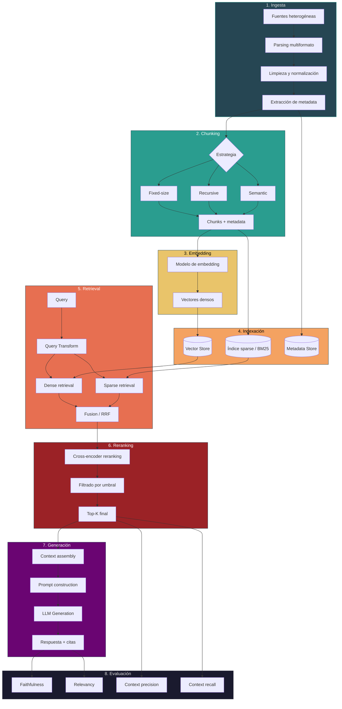
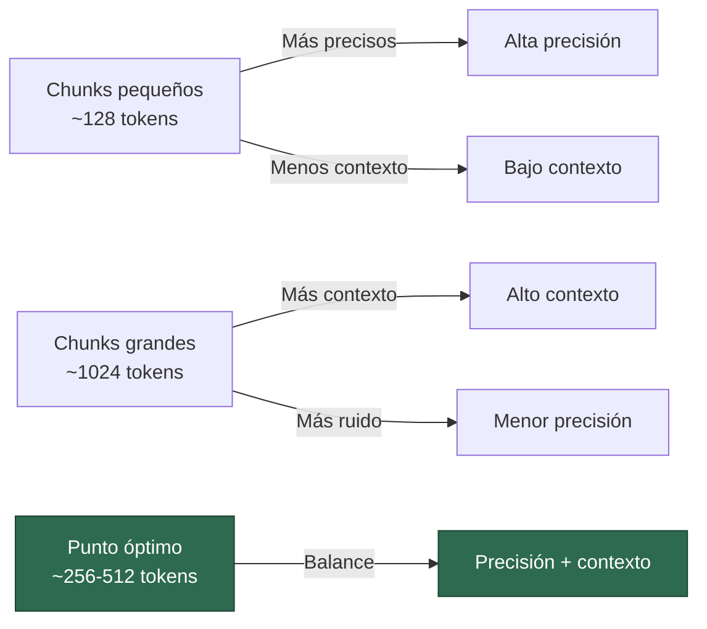
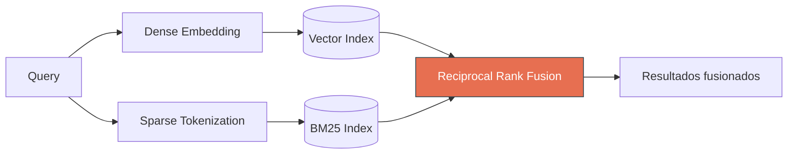
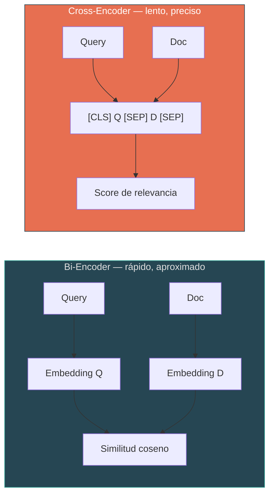
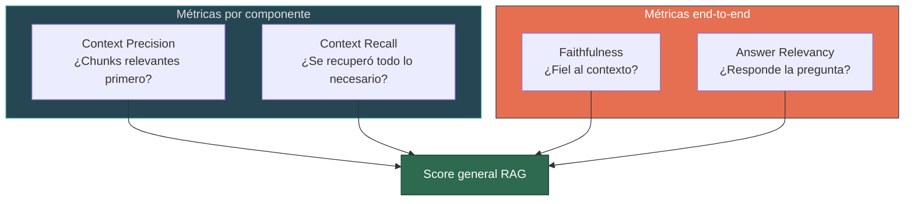

# Pipeline RAG Completo — De la Ingesta a la Evaluación

> [!abstract] Resumen
> Un pipeline RAG (*Retrieval-Augmented Generation*) completo comprende ==ocho fases secuenciales==: ingesta, chunking, embedding, indexación, retrieval, reranking, generación y evaluación. Cada fase introduce decisiones arquitectónicas con trade-offs significativos. Esta nota detalla cada fase, las decisiones clave, y proporciona una implementación de referencia con *LangChain*.
> ^resumen

## Visión general del pipeline



## Fase 1: Ingesta de documentos

> [!info] Referencia detallada
> Para un tratamiento exhaustivo de esta fase, ver [[document-ingestion]].

La ingesta transforma fuentes heterogéneas (PDFs, HTML, DOCX, bases de datos, APIs) en texto limpio con metadata estructurada.

### Decisiones clave

| Decisión | Opciones | Recomendación |
|---|---|---|
| Parser de PDF | PyMuPDF, pdfplumber, Unstructured, LlamaParse | ==LlamaParse== para docs complejos, PyMuPDF para velocidad |
| Manejo de tablas | Extraer como texto, como markdown, como imagen | ==Markdown== preserva estructura sin overhead |
| OCR | Tesseract, EasyOCR, PaddleOCR, vision LLM | Vision LLM para documentos escaneados de calidad variable |
| Limpieza | Regex, modelos de clasificación | Pipeline combinado: regex para ruido obvio + clasificador para bordes |

> [!warning] Garbage in, garbage out
> La calidad de la ingesta ==determina el techo de calidad== de todo el pipeline. Un documento mal parseado producirá chunks sin sentido, embeddings ruidosos y respuestas incorrectas. Invertir en esta fase tiene el mayor ROI.

### Extracción de metadata

Metadata crítica para cada documento:

- **Identificador único** (hash del contenido o UUID)
- **Fuente** (URL, ruta de archivo, nombre de base de datos)
- **Fecha de creación / modificación**
- **Autor / departamento**
- **Tipo de documento** (manual, política, FAQ, informe)
- **Idioma**
- **Versión**

> [!tip] Metadata como filtro de retrieval
> La metadata permite filtrado pre-retrieval que ==reduce dramáticamente el espacio de búsqueda==. Ejemplo: filtrar por departamento, fecha o tipo antes de la búsqueda vectorial.

## Fase 2: Chunking

> [!info] Referencia detallada
> Para estrategias de chunking en profundidad, ver [[chunking-strategies]].

El chunking divide documentos en fragmentos que serán las unidades atómicas de retrieval.

### Trade-offs fundamentales



| Parámetro | Rango típico | Impacto |
|---|---|---|
| *Chunk size* | 256–1024 tokens | Mayor → más contexto, menor precisión |
| *Chunk overlap* | 10–25% del chunk size | Mayor → mejor continuidad, más redundancia |
| Estrategia | Fixed, recursive, semantic | ==Semantic== para máxima calidad, recursive para balance |

> [!danger] Chunks sin contexto
> Un chunk aislado puede perder su significado. La técnica de *contextual chunking* — añadir un resumen del documento padre a cada chunk — mejora significativamente la calidad del retrieval[^1].

## Fase 3: Embedding

> [!info] Referencia detallada
> Para un análisis completo de modelos de embedding, ver [[embedding-models]].

La fase de embedding convierte cada chunk de texto en un vector denso que captura su significado semántico.

### Selección del modelo

| Modelo | Dimensiones | MTEB avg | Latencia | Costo |
|---|---|---|---|---|
| OpenAI text-embedding-3-large | 3072 | 64.6 | Baja | $0.13/M tokens |
| Cohere embed-v3 | 1024 | 64.5 | Media | $0.10/M tokens |
| Voyage voyage-3 | 1024 | ==65.3== | Media | $0.06/M tokens |
| BGE-M3 (open source) | 1024 | 62.1 | Variable | ==Gratis== |

> [!tip] Embeddings asimétricos
> Algunos modelos como E5-Mistral usan ==prefijos diferenciados para queries y documentos==, mejorando la calidad del retrieval al alinear los espacios de representación.

### Consideraciones de producción

- **Batching** — procesar embeddings en lotes de 100–500 para eficiencia
- **Caché** — cachear embeddings de queries frecuentes
- **Versionado** — cambiar de modelo de embedding requiere ==re-indexar todo el corpus==
- **Dimensionalidad** — modelos con *Matryoshka embeddings* permiten truncar dimensiones sin re-indexar

## Fase 4: Indexación

La indexación almacena vectores y metadata para búsqueda eficiente.

### Tipos de índice

| Tipo | Algoritmo | Velocidad | Recall | Memoria |
|---|---|---|---|---|
| Fuerza bruta | Dot product / cosine | Lenta | ==100%== | Baja |
| HNSW | *Hierarchical Navigable Small World* | ==Muy rápida== | ~99% | Alta |
| IVF-PQ | *Inverted File + Product Quantization* | Rápida | ~95% | ==Baja== |
| ScaNN | Google's ScaNN | Muy rápida | ~98% | Media |

> [!example]- Configuración de HNSW en diferentes vector stores
> ```python
> # Qdrant
> from qdrant_client.models import VectorParams, HnswConfigDiff
>
> collection_config = VectorParams(
>     size=1024,
>     distance="Cosine",
>     hnsw_config=HnswConfigDiff(
>         m=16,                    # Conexiones por nodo (más = mejor recall, más RAM)
>         ef_construct=200,        # Precisión durante construcción
>         full_scan_threshold=10000 # Threshold para fuerza bruta
>     )
> )
>
> # ChromaDB (usa HNSW internamente con hnswlib)
> import chromadb
> client = chromadb.Client()
> collection = client.create_collection(
>     name="docs",
>     metadata={
>         "hnsw:space": "cosine",
>         "hnsw:M": 16,
>         "hnsw:construction_ef": 200,
>         "hnsw:search_ef": 100
>     }
> )
> ```

### Índice híbrido (denso + sparse)

La configuración más robusta combina búsqueda vectorial (*dense*) con búsqueda léxica (*sparse*, BM25):



> [!success] Búsqueda híbrida como estándar
> La búsqueda híbrida es ==la configuración por defecto recomendada== para la mayoría de casos de uso. Combina la comprensión semántica de los embeddings con la precisión léxica de BM25, cubriendo las debilidades de cada enfoque.

## Fase 5: Retrieval

El retrieval recupera los fragmentos más relevantes para la query del usuario.

### Transformación de queries

Antes de buscar, es beneficioso transformar la query del usuario:

| Técnica | Descripción | Cuándo usar |
|---|---|---|
| *Query rewriting* | Reformular la query para mejorar claridad | Queries ambiguas o coloquiales |
| *Query decomposition* | Dividir en sub-queries | ==Preguntas multi-hop== |
| *HyDE* | Generar documento hipotético y buscar con su embedding | Queries abstractas o conceptuales |
| *Step-back prompting* | Abstraer la query a nivel conceptual | Preguntas muy específicas |
| *Multi-query* | Generar variaciones de la query | Aumentar recall |

> [!example]- Implementación de Multi-Query Retrieval
> ```python
> from langchain.retrievers.multi_query import MultiQueryRetriever
> from langchain_openai import ChatOpenAI
>
> llm = ChatOpenAI(model="gpt-4o-mini", temperature=0.3)
>
> retriever = MultiQueryRetriever.from_llm(
>     retriever=vectorstore.as_retriever(search_kwargs={"k": 10}),
>     llm=llm
> )
>
> # Genera 3 variaciones de la query y fusiona resultados
> docs = retriever.invoke("¿Cómo configurar autenticación OAuth2?")
> ```

### Parámetros de retrieval

| Parámetro | Valor típico | Trade-off |
|---|---|---|
| Top-K | 5–20 | Más K → mayor recall, más ruido |
| *Score threshold* | 0.7–0.85 | Más alto → mayor precisión, riesgo de 0 resultados |
| *MMR lambda* | 0.5–0.7 | Más alto → más relevancia; más bajo → más diversidad |
| *Fetch K* (pre-MMR) | 3–5x Top-K | Pool para selección por diversidad |

> [!danger] Error fatal: solo dense retrieval
> Usar únicamente búsqueda vectorial densa es el error más frecuente. ==BM25 supera a dense retrieval en búsquedas con entidades nombradas, códigos o acrónimos==. La combinación híbrida con *Reciprocal Rank Fusion* (RRF) es casi siempre superior.

## Fase 6: Reranking

> [!info] Por qué reranking es esencial
> Los *bi-encoders* (embeddings) son eficientes pero aproximados. Los *cross-encoders* son más precisos porque procesan query y documento ==juntos==, capturando interacciones finas entre tokens. El reranking combina la eficiencia de bi-encoders con la precisión de cross-encoders.

### Modelos de reranking

| Modelo | Tipo | Latencia | Calidad |
|---|---|---|---|
| Cohere Rerank v3 | API | Baja | ==Excelente== |
| Jina Reranker v2 | API / Local | Media | Muy buena |
| BGE Reranker v2-M3 | Local | Media | Buena |
| ColBERT v2 | Local (late interaction) | ==Muy baja== | Muy buena |
| FlashRank | Local (ligero) | Muy baja | Aceptable |



> [!warning] Latencia de reranking
> El reranking con cross-encoder es O(n) donde n es el número de documentos a reranquear. ==Limitar el input a 20–50 documentos== es crítico para mantener latencias aceptables en producción.

## Fase 7: Generación

La fase de generación construye un prompt con el contexto recuperado y genera la respuesta.

### Construcción del prompt

> [!tip] Orden del contexto
> Debido al *lost in the middle* problem[^2], colocar los chunks más relevantes ==al principio y al final== del contexto mejora la calidad de la respuesta.

Estructura típica del prompt:

```
[System] Eres un asistente que responde basándose EXCLUSIVAMENTE en el
contexto proporcionado. Si la información no está en el contexto, indica
que no tienes suficiente información. Cita las fuentes usando [Fuente N].

[Context]
--- Fuente 1: {metadata.title} ({metadata.date}) ---
{chunk_1.text}

--- Fuente 2: {metadata.title} ({metadata.date}) ---
{chunk_2.text}

...

[User] {query_original}
```

### Parámetros de generación

| Parámetro | Valor para RAG | Justificación |
|---|---|---|
| *Temperature* | ==0.0–0.3== | Minimizar creatividad para maximizar fidelidad |
| *Top-P* | 0.9 | Evitar tokens de cola muy improbables |
| *Max tokens* | Según caso de uso | Limitar para evitar divagación |
| *Frequency penalty* | 0.0–0.3 | Leve para evitar repetición |

> [!danger] No instruir fidelidad = alucinación garantizada
> Sin instrucciones explícitas de ceñirse al contexto, el LLM ==combinará libremente sus conocimientos paramétricos con el contexto==, produciendo respuestas que mezclan hechos verificables con alucinaciones.

## Fase 8: Evaluación

La evaluación cierra el ciclo de calidad del pipeline. Sin evaluación sistemática, las mejoras son especulativas.

### Framework RAGAS

[[evaluation-ragas]] define cuatro métricas nucleares:



### Evaluación continua en producción

| Señal | Fuente | Acción |
|---|---|---|
| Thumbs down del usuario | UI feedback | Añadir a test set de regresión |
| Queries sin resultados | Logs de retrieval | Ampliar corpus o ajustar embeddings |
| Latencia P95 > 5s | Métricas de infra | Optimizar reranking o reducir Top-K |
| Tasa de "no sé" > 30% | Logs de generación | Revisar cobertura del corpus |

> [!question] ¿Evaluación con LLM-as-Judge?
> Usar un LLM como evaluador (*LLM-as-Judge*) es cada vez más común. Modelos como GPT-4o o Claude evalúan faithfulness y relevancy con ==correlación > 0.85 con evaluadores humanos==. Pero cuidado: el mismo modelo que genera no debería evaluar sus propias respuestas.

## Implementación de referencia

> [!example]- Pipeline completo con LangChain (Python)
> ```python
> """
> Pipeline RAG completo con LangChain.
> Requiere: pip install langchain langchain-openai langchain-community
>           chromadb unstructured cohere
> """
> from langchain_community.document_loaders import DirectoryLoader, UnstructuredFileLoader
> from langchain.text_splitter import RecursiveCharacterTextSplitter
> from langchain_openai import OpenAIEmbeddings, ChatOpenAI
> from langchain_community.vectorstores import Chroma
> from langchain.retrievers import ContextualCompressionRetriever
> from langchain_cohere import CohereRerank
> from langchain_core.prompts import ChatPromptTemplate
> from langchain_core.output_parsers import StrOutputParser
> from langchain_core.runnables import RunnablePassthrough
>
> # --- Fase 1: Ingesta ---
> loader = DirectoryLoader(
>     "./documents/",
>     glob="**/*.pdf",
>     loader_cls=UnstructuredFileLoader,
>     loader_kwargs={"mode": "elements"},
>     show_progress=True
> )
> raw_docs = loader.load()
> print(f"Documentos cargados: {len(raw_docs)}")
>
> # --- Fase 2: Chunking ---
> text_splitter = RecursiveCharacterTextSplitter(
>     chunk_size=512,
>     chunk_overlap=64,
>     length_function=len,
>     separators=["\n\n", "\n", ". ", " ", ""],
>     is_separator_regex=False
> )
> chunks = text_splitter.split_documents(raw_docs)
> print(f"Chunks generados: {len(chunks)}")
>
> # --- Fase 3 + 4: Embedding + Indexación ---
> embeddings = OpenAIEmbeddings(
>     model="text-embedding-3-large",
>     dimensions=1024  # Matryoshka: reducir dimensiones para eficiencia
> )
>
> vectorstore = Chroma.from_documents(
>     documents=chunks,
>     embedding=embeddings,
>     collection_name="rag_pipeline",
>     persist_directory="./chroma_db"
> )
>
> # --- Fase 5: Retrieval (híbrido con MMR) ---
> base_retriever = vectorstore.as_retriever(
>     search_type="mmr",
>     search_kwargs={
>         "k": 10,
>         "fetch_k": 50,
>         "lambda_mult": 0.6
>     }
> )
>
> # --- Fase 6: Reranking ---
> reranker = CohereRerank(
>     model="rerank-english-v3.0",
>     top_n=5
> )
>
> retriever = ContextualCompressionRetriever(
>     base_compressor=reranker,
>     base_retriever=base_retriever
> )
>
> # --- Fase 7: Generación ---
> system_prompt = """Eres un asistente técnico que responde basándose
> EXCLUSIVAMENTE en el contexto proporcionado.
>
> Reglas:
> 1. Si la información no está en el contexto, di "No tengo información suficiente"
> 2. Cita fuentes usando [Fuente N] donde N es el número del fragmento
> 3. Sé conciso y directo
> 4. No inventes información
>
> Contexto:
> {context}"""
>
> prompt = ChatPromptTemplate.from_messages([
>     ("system", system_prompt),
>     ("human", "{question}")
> ])
>
> llm = ChatOpenAI(model="gpt-4o", temperature=0.1)
>
> def format_docs(docs):
>     return "\n\n".join(
>         f"--- Fuente {i+1}: {doc.metadata.get('source', 'N/A')} ---\n{doc.page_content}"
>         for i, doc in enumerate(docs)
>     )
>
> rag_chain = (
>     {"context": retriever | format_docs, "question": RunnablePassthrough()}
>     | prompt
>     | llm
>     | StrOutputParser()
> )
>
> # --- Uso ---
> response = rag_chain.invoke("¿Cómo se implementa la autenticación OAuth2?")
> print(response)
>
> # --- Fase 8: Evaluación con RAGAS ---
> from ragas import evaluate
> from ragas.metrics import faithfulness, answer_relevancy, context_precision, context_recall
> from datasets import Dataset
>
> eval_data = {
>     "question": ["¿Cómo se implementa OAuth2?"],
>     "answer": [response],
>     "contexts": [[doc.page_content for doc in retriever.invoke("¿Cómo se implementa OAuth2?")]],
>     "ground_truth": ["OAuth2 se implementa mediante..."]
> }
>
> result = evaluate(
>     Dataset.from_dict(eval_data),
>     metrics=[faithfulness, answer_relevancy, context_precision, context_recall]
> )
> print(result)
> ```

## Optimización del pipeline

### Diagnóstico por fase

> [!failure] Tabla de diagnóstico
> Cuando el pipeline no rinde como se espera, aislar la fase problemática:

| Síntoma | Fase probable | Diagnóstico | Acción |
|---|---|---|---|
| Respuestas incorrectas con contexto correcto | Generación | Prompt inadecuado | Mejorar instrucciones del prompt |
| Contexto recuperado irrelevante | Retrieval | Baja precisión | Añadir reranking, ajustar embeddings |
| Información existe pero no se recupera | Chunking | Chunks mal formados | Cambiar estrategia de chunking |
| Texto ilegible o incompleto | Ingesta | Parser inadecuado | Cambiar parser o preprocesamiento |
| Todo funciona pero es lento | Indexación/Reranking | Índice no optimizado | HNSW, reducir dimensiones, limitar reranking |

### Latencia por fase (benchmarks típicos)

| Fase | Latencia típica | Optimizable | Impacto en UX |
|---|---|---|---|
| Query embedding | 20–50ms | Caché | Bajo |
| Vector search | 10–100ms | Índice HNSW | Bajo |
| BM25 search | 5–30ms | Índice invertido | Bajo |
| Reranking (cross-encoder) | ==100–500ms== | Limitar N docs | Alto |
| LLM generation | ==500–3000ms== | Streaming, modelo más rápido | Muy alto |
| **Total** | **635–3680ms** | | |

> [!tip] Streaming como percepción de velocidad
> Implementar *streaming* en la fase de generación ==reduce la latencia percibida a ~500ms== (tiempo hasta el primer token), aunque la latencia total sea de varios segundos.

## Anti-patrones del pipeline

> [!failure] Errores que arruinan el pipeline
> 1. **Saltarse la evaluación** — "funciona bien en mis 3 preguntas de prueba" no es evaluación
> 2. **Indexar sin limpiar** — basura entra, basura sale
> 3. **Un solo modelo de embedding para todo** — código, prosa técnica y tablas necesitan tratamiento diferente
> 4. **No versionar el índice** — si no puedes reproducir un resultado, no puedes depurarlo
> 5. **Ignorar la latencia total** — P95 > 3s mata la experiencia de usuario

## Relación con el ecosistema

El pipeline RAG completo interactúa con cada componente del ecosistema:

- **[[intake-overview]]** — La fase de ingesta del pipeline RAG se beneficia directamente de los 12+ parsers de intake. El protocolo *MCP* de intake permite alimentar el pipeline RAG desde fuentes heterogéneas con una interfaz estandarizada, eliminando la necesidad de escribir conectores ad-hoc para cada formato.

- **[[architect-overview]]** — Los *YAML pipelines* de architect pueden ==orquestar el pipeline RAG completo como una serie de pasos declarativos==. El *Ralph Loop* de architect implementa un patrón de iteración análogo al loop query-retrieve-evaluate-refine de Agentic RAG. Las *worktrees* permiten ejecutar múltiples variantes del pipeline en paralelo para A/B testing. La integración con *OpenTelemetry* proporciona trazas distribuidas que permiten diagnosticar cuellos de botella en cada fase.

- **[[vigil-overview]]** — Vigil debe escanear el código del pipeline RAG con sus 26 reglas de seguridad. El formato *SARIF* permite integrar los hallazgos en el CI/CD. La detección de *slopsquatting* es especialmente relevante para validar dependencias del pipeline (langchain, chromadb, etc.).

- **[[licit-overview]]** — El *EU AI Act* requiere trazabilidad de las fuentes utilizadas para generar respuestas. El pipeline RAG debe mantener *provenance* de cada documento desde la ingesta hasta la citación en la respuesta. Los *FRIA* aplican cuando el pipeline procesa datos personales. *OWASP Agentic Top 10* identifica riesgos específicos como *prompt injection* vía documentos ingestados.

## Enlaces y referencias

> [!quote]- Bibliografía
> - Lewis, P., et al. (2020). "Retrieval-Augmented Generation for Knowledge-Intensive NLP Tasks." *NeurIPS 2020*.
> - Gao, Y., et al. (2024). "Retrieval-Augmented Generation for Large Language Models: A Survey." *arXiv:2312.10997*.
> - LangChain Documentation. "RAG Tutorial." https://python.langchain.com/docs/tutorials/rag/
> - Anthropic. (2024). "Contextual Retrieval." https://www.anthropic.com/news/contextual-retrieval
> - Es, S., et al. (2023). "RAGAS: Automated Evaluation of Retrieval Augmented Generation."
> - Wang, L., et al. (2023). "Query2Doc: Query Expansion with Large Language Models."
> - [[rag-overview]] — Visión general de RAG
> - [[document-ingestion]] — Fase 1: Ingesta
> - [[chunking-strategies]] — Fase 2: Chunking
> - [[embedding-models]] — Fase 3: Embedding
> - [[evaluation-ragas]] — Fase 8: Evaluación

[^1]: Anthropic. "Contextual Retrieval." 2024. Demuestra que añadir contexto del documento padre a cada chunk mejora retrieval en un 49%.
[^2]: Liu, N., et al. "Lost in the Middle: How Language Models Use Long Contexts." 2023.

---

> [!quote] Principio de diseño
> "Un pipeline RAG es tan fuerte como su ==eslabón más débil==. Optimiza de izquierda a derecha: primero la ingesta, luego el chunking, y así sucesivamente."
