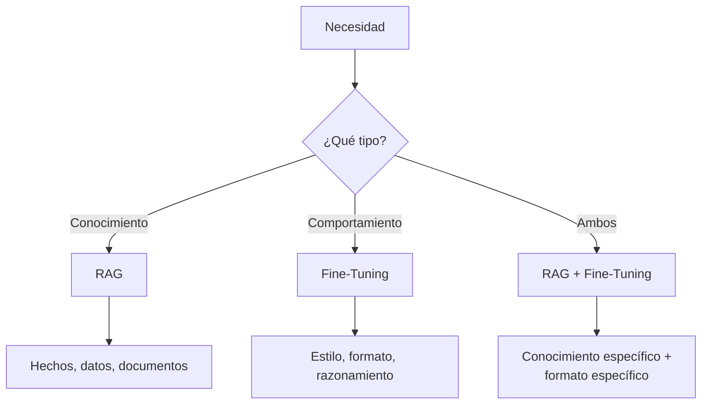
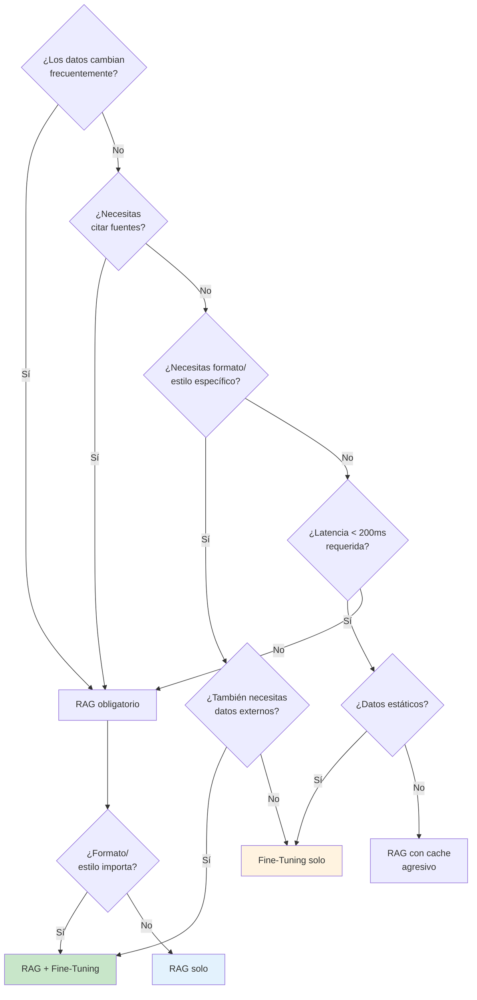
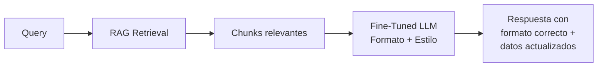

# RAG vs Fine-Tuning — Framework de Decisión

> [!abstract] Resumen
> RAG y *fine-tuning* no son alternativas excluyentes sino ==técnicas complementarias con fortalezas diferentes==. RAG aporta conocimiento dinámico y citabilidad; fine-tuning aporta comportamiento, estilo y razonamiento específico. Este documento proporciona un framework de decisión con métricas, costes y un flowchart para elegir la estrategia correcta.
> ^resumen

---

## El falso dilema

> [!warning] No es una elección binaria
> La pregunta "¿RAG o fine-tuning?" ==está mal planteada==. Los mejores sistemas combinan ambos:
> - RAG para inyectar conocimiento actualizable
> - Fine-tuning para ajustar comportamiento y formato
> - Long context como complemento (ver [[rag-vs-long-context]])

---

## Cuándo usar RAG

| Señal | Ejemplo | Prioridad |
|---|---|---|
| ==Datos cambian frecuentemente== | Precios, noticias, regulación | Alta |
| Necesitas citar fuentes | Legal, médico, compliance | ==Crítica== |
| Datos privados/propietarios | Documentación interna | Alta |
| Corpus muy grande (>100K docs) | Base de conocimiento corporativa | Alta |
| Reducir alucinaciones | Cualquier dominio factual | Alta |
| Multi-tenant (datos por cliente) | SaaS | ==Crítica== |

> [!success] RAG brilla cuando
> El conocimiento es ==dinámico, citado y externo== al modelo. RAG permite actualizar la base de conocimiento sin tocar el modelo, con trazabilidad completa de fuentes.

---

## Cuándo usar fine-tuning

| Señal | Ejemplo | Prioridad |
|---|---|---|
| ==Formato de respuesta específico== | JSON estructurado, informes | Alta |
| Estilo/tono particular | Brand voice, comunicación formal | Media |
| Razonamiento de dominio | Diagnóstico médico, código | Alta |
| Vocabulario técnico específico | Jerga legal, científica | Media |
| Latencia mínima requerida | Chat real-time, <200ms | Alta |
| Reducir tokens de prompt | Costes a gran escala | Media |

> [!info] Fine-tuning cambia el "cómo", RAG cambia el "qué"
> Fine-tuning modifica ==cómo== responde el modelo (formato, estilo, razonamiento). RAG modifica ==qué== información tiene disponible. Son dimensiones ortogonales.

---

## Comparación detallada

| Dimensión | RAG | Fine-Tuning | RAG + Fine-Tuning |
|---|---|---|---|
| **Conocimiento** | ==Dinámico, actualizable== | Estático (congelado en pesos) | ==Dinámico + comportamiento== |
| **Citabilidad** | ==Nativa (fuentes trazables)== | No posible | ==Sí== |
| **Alucinaciones** | ==Reducidas (contexto externo)== | Pueden aumentar en dominio | Mínimas |
| **Latencia** | Media (~1-3s) | ==Baja (~200ms)== | Media |
| **Coste setup** | Medio ($500-5K) | ==Alto ($1K-50K)== | Alto |
| **Coste por query** | $0.01-0.10 | ==$0.001-0.01== | $0.01-0.05 |
| **Mantenimiento** | Reindexar docs | ==Reentrenar modelo== | Ambos |
| **Escalabilidad datos** | ==Ilimitada== | Limitada por training | ==Ilimitada== |
| **Personalización** | Por filtros metadata | Por modelo dedicado | Completa |
| **Time to production** | ==1-4 semanas== | 4-12 semanas | 6-16 semanas |

---

## Análisis de costes

### Setup inicial

| Componente | RAG | Fine-Tuning |
|---|---|---|
| Infraestructura | Vector DB + API: ==$200-1000/mes== | GPU training: $500-5000 |
| Datos | Ingesta + indexación: $50-500 | Dataset curación: ==$1000-10000== |
| Desarrollo | Pipeline: 2-4 semanas | Training + eval: 4-8 semanas |
| **Total setup** | ==$1K-5K== | **$5K-50K** |

### Coste operativo mensual (1000 queries/día)

| Componente | RAG | Fine-Tuning |
|---|---|---|
| LLM (generación) | $300-1000 | ==$30-100== |
| Embeddings | $10-50 | N/A |
| Vector DB | $50-200 | N/A |
| Hosting modelo | N/A | ==$200-2000== (GPU) |
| Reindexación | $10-100/mes | Retraining: $500-5000/vez |
| **Total mensual** | **$400-1400** | **$230-2100** |

> [!question] ¿Cuál es más barato?
> Depende del volumen y frecuencia de actualización:
> - ==Alto volumen + datos estables==: Fine-tuning gana
> - ==Bajo volumen + datos dinámicos==: RAG gana
> - ==Alto volumen + datos dinámicos==: RAG + FT con modelo pequeño

---

## Quality benchmarks

| Escenario | Solo LLM | RAG | Fine-Tune | RAG + FT |
|---|---|---|---|---|
| QA sobre datos internos | 0.30 | ==0.85== | 0.65 | ==0.90== |
| Formato específico | 0.50 | 0.55 | ==0.90== | ==0.92== |
| Datos actualizados | 0.20 | ==0.88== | 0.20 | ==0.88== |
| Razonamiento de dominio | 0.60 | 0.70 | ==0.85== | ==0.88== |
| Citación de fuentes | 0.10 | ==0.90== | 0.10 | ==0.90== |

> [!tip] RAG + Fine-Tuning es el sweet spot
> Para sistemas de producción de alto valor, ==RAG + fine-tuning es casi siempre la mejor opción==. Fine-tune un modelo pequeño (7-13B) para tu formato/estilo y aliméntalo con RAG para conocimiento dinámico.

---

## Flowchart de decisión

---

## Mantenimiento a largo plazo

| Aspecto | RAG | Fine-Tuning |
|---|---|---|
| Actualizar conocimiento | ==Reindexar (minutos-horas)== | Reentrenar (horas-días) |
| Corregir respuestas | Editar/añadir documentos | Añadir ejemplos al dataset |
| Escalar dominios | Añadir colecciones | ==Entrenar modelos adicionales== |
| Rollback | Restaurar índice anterior | Volver a modelo anterior |
| Debugging | Inspeccionar chunks recuperados | ==Opaco (caja negra)== |

> [!danger] Fine-tuning: la trampa del mantenimiento
> Cada vez que cambian los datos, hay que ==reentrenar el modelo==. En dominios donde los datos cambian semanalmente, fine-tuning se vuelve operacionalmente insostenible. RAG actualiza sin reentrenamiento.

---

## Combinando RAG y Fine-Tuning

### Arquitectura combinada

### Ejemplo práctico: chatbot legal

| Componente | Técnica | Razón |
|---|---|---|
| Conocimiento legal | ==RAG== | Leyes cambian, necesita citación |
| Formato de informe | ==Fine-tuning== | Estilo formal específico |
| Análisis de riesgo | ==Fine-tuning== | Razonamiento legal específico |
| Datos del caso | ==RAG== | Cada caso es diferente |

---

## Relación con el ecosistema

- **[[intake-overview|intake]]**: intake normaliza documentos que alimentan tanto RAG (indexación) como fine-tuning (creación de datasets de entrenamiento). Los parsers de intake producen texto limpio que ==reduce el ruido en ambos enfoques==.

- **[[architect-overview|architect]]**: Los pipelines YAML de architect pueden orquestar tanto pipelines RAG como workflows de fine-tuning. El cost tracking de architect es especialmente relevante para ==comparar costes entre RAG y fine-tuning en producción==.

- **[[vigil-overview|vigil]]**: Tanto RAG como fine-tuning pueden generar código. Vigil escanea la salida independientemente de la técnica utilizada. Sin embargo, fine-tuning tiene mayor riesgo de ==memorización de patrones inseguros== del dataset de training.

- **[[licit-overview|licit]]**: Fine-tuning plantea riesgos adicionales de compliance: los datos de entrenamiento quedan ==embebidos en los pesos del modelo==, complicando el derecho al olvido (GDPR art. 17). RAG es más compatible con GDPR porque los datos están separados del modelo.

---

## Errores comunes en la decisión

> [!failure] Anti-patrones frecuentes

1. **"Fine-tune para todo"**: Equipos que fine-tunean para inyectar conocimiento factual en lugar de usar RAG → datos obsoletos en semanas
2. **"RAG para todo"**: Equipos que usan RAG para ajustar formato/estilo en lugar de fine-tune → prompts gigantes y frágiles
3. **Ignorar la combinación**: Tratar RAG y fine-tuning como mutuamente excluyentes cuando ==la combinación es casi siempre superior==
4. **No evaluar comparativamente**: Elegir una técnica sin medir ambas con las mismas queries y métricas
5. **Subestimar el mantenimiento**: Fine-tuning parece más simple al inicio pero ==el coste de reentrenamiento se acumula==

> [!info] Regla de oro
> Si la respuesta a "¿necesitas actualizar los datos sin reentrenar?" es sí → RAG es obligatorio.
> Si la respuesta a "¿necesitas un formato/comportamiento específico?" es sí → fine-tuning es necesario.
> Si ambas son sí → ==combina ambos==.

---

## Enlaces y referencias

> [!quote]- Bibliografía
> - Ovadia, O., et al. "Fine-tuning or Retrieval? Comparing Knowledge Injection in LLMs." arXiv 2024.[^1]
> - Gao, Y., et al. "RAG Survey." arXiv 2024.
> - OpenAI. "Fine-tuning Best Practices." https://platform.openai.com/docs/guides/fine-tuning
> - Anthropic. "When to use RAG vs Fine-Tuning." Blog 2024.
> - [[rag-overview]] — Visión general de RAG
> - [[rag-vs-long-context]] — RAG vs Long Context
> - [[rag-en-produccion]] — RAG en producción
> - [[rag-evaluation]] — Evaluación comparativa
> - [[embedding-models]] — Modelos de embedding (fine-tunable)
> - [[advanced-rag]] — Patrones avanzados de RAG

[^1]: Ovadia, O., et al. "Fine-tuning or Retrieval? Comparing Knowledge Injection in LLMs." arXiv 2024.
