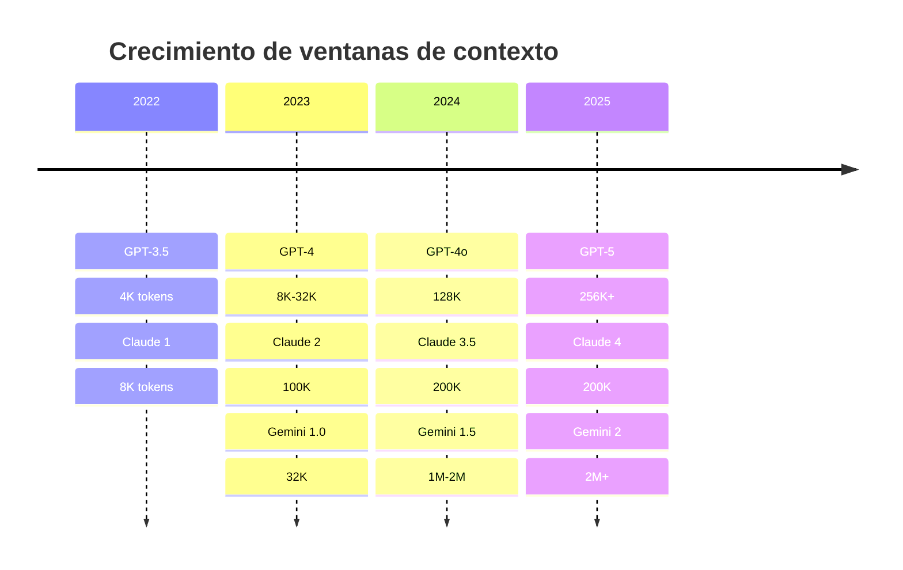
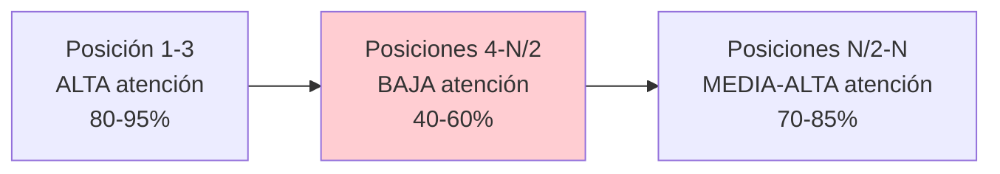
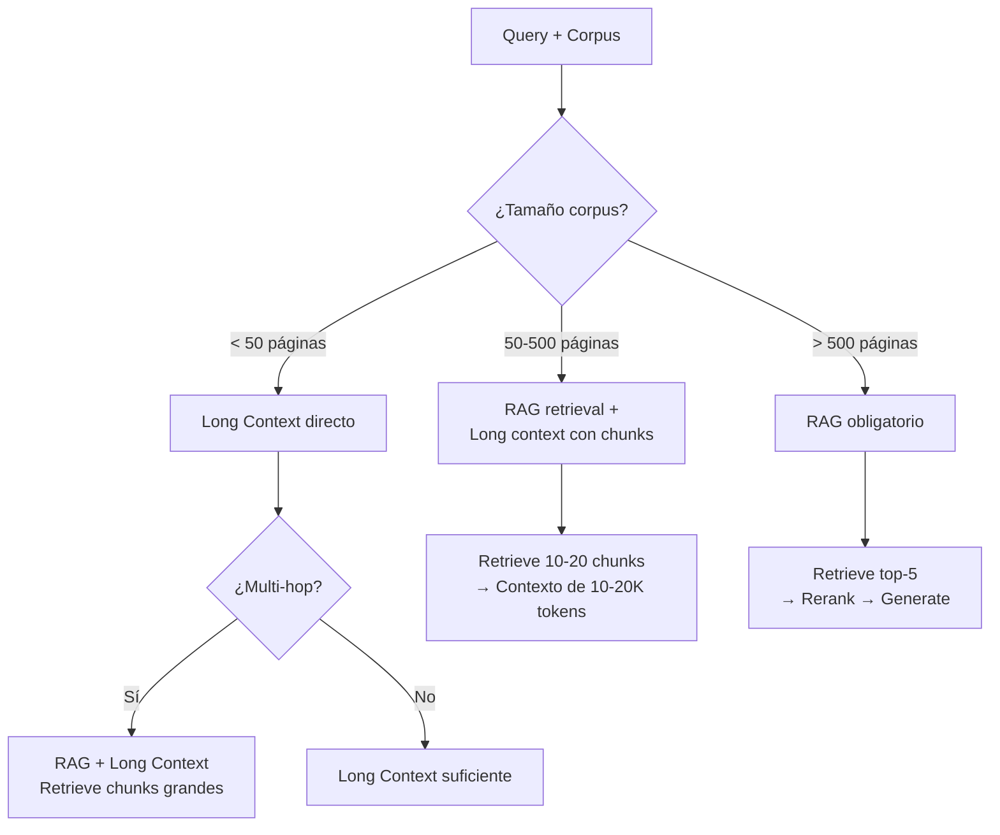

# RAG vs Long Context — ¿Necesitamos RAG con 1M de tokens?

> [!abstract] Resumen
> Con ventanas de contexto de 128K (GPT-4o), 200K (Claude) y hasta 1-2M tokens (Gemini), surge la pregunta: ==¿sigue siendo necesario RAG?== La respuesta es matizada: long context es mejor para documentos pequeños y preguntas simples, pero RAG sigue siendo ==indispensable para escala, costes, citabilidad y datos dinámicos==. Este documento analiza argumentos, benchmarks, costes y ofrece un framework de decisión.
> ^resumen

---

## El contexto del debate



> [!question] La pregunta legítima
> Si puedo meter 1M de tokens (≈750K palabras ≈ 1500 páginas) en el contexto, ¿por qué necesito un pipeline complejo de RAG con chunking, embeddings, vector DB, reranking...?

---

## Argumentos a favor de Long Context (contra RAG)

| Argumento | Detalle |
|---|---|
| ==Simplicidad== | Sin pipeline de ingesta, sin vector DB, sin embeddings |
| Sin pérdida de información | Todo el documento está disponible, no hay chunking |
| Sin errores de retrieval | No hay riesgo de recuperar chunks incorrectos |
| Razonamiento completo | El modelo ve todo el documento, puede razonar globalmente |
| Setup instantáneo | Cargar documentos → preguntar (minutos vs. semanas) |

---

## Argumentos a favor de RAG (contra Long Context)

| Argumento | Detalle |
|---|---|
| ==Escala== | 1M tokens ≈ 1500 páginas; RAG escala a millones de documentos |
| ==Coste== | Procesar 1M tokens por query es 100-500x más caro |
| ==Latencia== | 1M tokens = 30-90 segundos; RAG = 1-3 segundos |
| Citabilidad | RAG sabe ==exactamente qué chunks usó== |
| Datos dinámicos | Reindexar un doc es incremental; re-cargar todo es O(n) |
| Multi-tenancy | Cada tenant tiene su índice; no puedes mezclar en un prompt |
| *Lost in the middle* | Los modelos ==ignoran información en el medio del contexto==[^1] |
| Privacidad | RAG filtra PII antes del LLM; long context envía todo |

---

## El problema "Lost in the Middle"

Los LLM prestan atención desigual a diferentes posiciones del contexto[^1]:



### Benchmarks NIAH (Needle in a Haystack)

| Modelo | 32K | 128K | 256K | 1M |
|---|---|---|---|---|
| GPT-4o | ==99%== | 95% | N/A | N/A |
| Claude 3.5 | ==99%== | ==98%== | 95% | N/A |
| Gemini 1.5 Pro | ==99%== | ==98%== | ==97%== | ==93%== |
| Llama 3.1 70B | 98% | 90% | N/A | N/A |

> [!warning] NIAH no es realista
> El benchmark *Needle in a Haystack* busca un hecho aislado en texto de relleno. ==En la realidad, la información relevante está distribuida a lo largo del documento==, no concentrada en un punto. El rendimiento real es significativamente peor que NIAH sugiere.

### Benchmark más realista: Multi-hop QA en contexto largo

| Modelo + Contexto | Accuracy multi-hop |
|---|---|
| GPT-4o + RAG (5 chunks) | ==82%== |
| GPT-4o + 128K full context | 71% |
| Claude 3.5 + RAG (5 chunks) | ==85%== |
| Claude 3.5 + 200K full context | 75% |
| Gemini 1.5 + 1M full context | 68% |

> [!success] RAG supera a long context en multi-hop
> Para preguntas que requieren combinar información de múltiples partes del documento, ==RAG con reranking supera consistentemente a long context==. La pre-selección de chunks relevantes concentra la información donde el modelo presta más atención.

---

## Análisis de costes

### Coste por query

| Enfoque | Tokens input | Coste por query (GPT-4o) | Latencia |
|---|---|---|---|
| RAG (5 chunks × 512 tokens) | ==2,560== | ==$0.006== | ==1-3s== |
| Long context (50 páginas) | 50,000 | $0.125 | 10-20s |
| Long context (500 páginas) | 500,000 | ==$1.25== | 30-60s |
| Long context (1500 páginas) | 1,000,000 | ==$2.50== | ==60-120s== |

### Coste mensual (1000 queries/día)

| Enfoque | Coste LLM/mes | Coste infra/mes | Total |
|---|---|---|---|
| RAG | ==$180== | $100-200 (vector DB) | ==$280-380== |
| Long context (50 pgs) | $3,750 | $0 | $3,750 |
| Long context (500 pgs) | $37,500 | $0 | ==$37,500== |

> [!danger] El coste de long context escala linealmente
> Cada query procesa ==todo el contexto==, independientemente de si la respuesta está en la primera o última página. RAG solo procesa los chunks relevantes. A escala, la diferencia es ==10-100x==.

---

## El enfoque híbrido

La mejor estrategia combina ambos:



### RAG como pre-filtro para Long Context

```python
# Estrategia híbrida: RAG retrieve → long context
def hybrid_rag_long_context(query: str, k: int = 20) -> str:
    # 1. RAG recupera candidatos amplios
    candidates = retriever.search(query, k=k)

    # 2. Construir contexto largo con los candidatos
    long_context = "\n\n---\n\n".join(
        f"[Fuente: {c.metadata['source']}, p.{c.metadata['page']}]\n{c.text}"
        for c in candidates
    )

    # 3. LLM con contexto largo pero pre-filtrado
    response = llm.invoke(
        f"Contexto:\n{long_context}\n\nPregunta: {query}"
    )
    return response
```

> [!tip] Lo mejor de ambos mundos
> RAG reduce de 500K tokens a 20K tokens (pre-filtro), y luego long context procesa esos 20K sin riesgo de *lost in the middle*. ==Coste de long context, calidad de RAG.==

---

## Framework de decisión

| Criterio | Long Context gana | RAG gana |
|---|---|---|
| Corpus < 50 páginas | ==Sí== | |
| Corpus > 500 páginas | | ==Sí== |
| Datos dinámicos | | ==Sí== |
| Citación necesaria | | ==Sí== |
| Latencia < 3s | | ==Sí== |
| Setup rápido (horas) | ==Sí== | |
| Coste a escala | | ==Sí== |
| Multi-tenant | | ==Sí== |
| Preguntas simples, doc pequeño | ==Sí== | |
| Multi-hop reasoning | | ==Sí== |

> [!info] Regla de oro
> Si tu corpus cabe en la ventana de contexto ==Y== el coste por query es aceptable ==Y== no necesitas citación precisa → usa long context.
> En cualquier otro caso → RAG, posiblemente híbrido.

---

## Relación con el ecosistema

- **[[intake-overview|intake]]**: intake es necesario tanto para RAG (ingesta) como para long context (preparar documentos para el prompt). Sus parsers normalizan formatos heterogéneos independientemente del enfoque de retrieval elegido.

- **[[architect-overview|architect]]**: Los pipelines YAML de architect pueden encapsular ambas estrategias como steps intercambiables, permitiendo ==A/B testing entre RAG y long context== para el mismo caso de uso.

- **[[vigil-overview|vigil]]**: Long context envía ==más datos al LLM==, aumentando el riesgo de filtración de información sensible. Vigil debe escanear todo el contexto antes de enviarlo al modelo, especialmente con long context donde no hay pre-filtrado.

- **[[licit-overview|licit]]**: Con long context, ==todo el documento se envía al proveedor del LLM==. Licit debe verificar que esto cumple con GDPR y que el proveedor tiene las autorizaciones adecuadas para procesar esos datos.

---

## Evolución futura: ¿convergencia?

> [!info] Tendencias 2025+
> Las ventanas de contexto seguirán creciendo, pero hay límites fundamentales:
> - **Coste**: Procesar 1M tokens será siempre más caro que procesar 5K tokens seleccionados
> - **Atención**: La arquitectura transformer tiene ==limitaciones inherentes de atención== a escala
> - **Velocidad**: Time-to-first-token escala con el tamaño del contexto
>
> La tendencia es hacia ==sistemas híbridos== que usen RAG para pre-filtrar y long context para razonar sobre los resultados filtrados.

### Predicciones

| Aspecto | 2025 | 2027+ |
|---|---|---|
| Ventana máxima | 2M tokens | 10M+ tokens |
| Coste 1M tokens input | $2.50 | ~$0.25 (10x reducción) |
| RAG necesario | ==Sí, para escala y coste== | Sí, pero menos para docs pequeños |
| Enfoque dominante | RAG + long context híbrido | ==Híbrido optimizado por router== |

---

## Enlaces y referencias

> [!quote]- Bibliografía
> - Liu, N., et al. "Lost in the Middle: How Language Models Use Long Contexts." TACL 2024.[^1]
> - Hsieh, C., et al. "RULER: What's the Real Context Size of Your Long-Context Language Models?" arXiv 2024.[^2]
> - Google. "Gemini 1.5: Unlocking multimodal understanding across millions of tokens." 2024.
> - Anthropic. "Long Context Prompting Tips." Documentation 2024.
> - [[rag-overview]] — Visión general de RAG
> - [[rag-vs-fine-tuning]] — RAG vs Fine-Tuning
> - [[rag-en-produccion]] — Costes en producción
> - [[semantic-caching]] — Optimización de costes
> - [[retrieval-strategies]] — Estrategias de retrieval

[^1]: Liu, N., et al. "Lost in the Middle: How Language Models Use Long Contexts." TACL 2024.
[^2]: Hsieh, C., et al. "RULER: What's the Real Context Size of Your Long-Context Language Models?" arXiv 2024.
