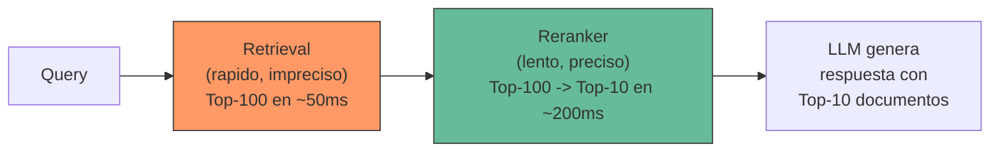
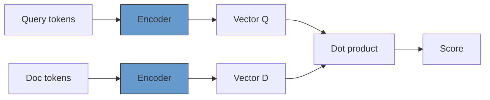
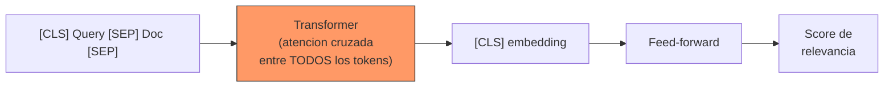
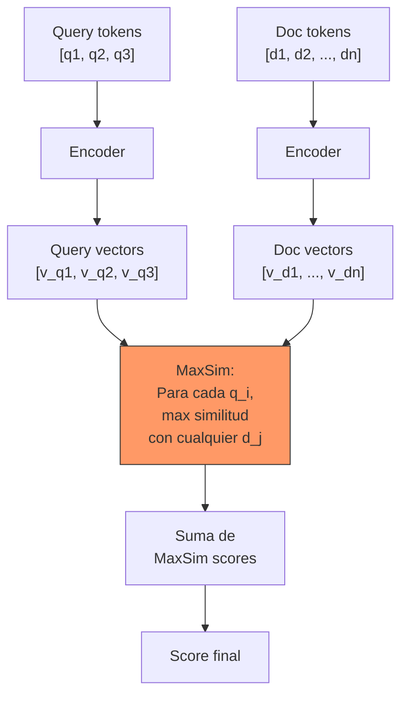
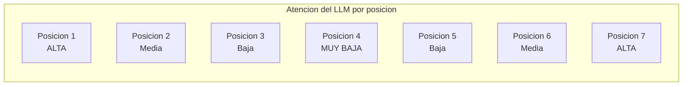

---
tags:
  - tecnica
  - rag
  - reranking
  - relevancia
aliases:
  - reranking
  - re-ranking
  - reordenamiento de resultados
  - cross-encoder reranking
created: 2025-06-01
updated: 2025-06-01
category: tecnicas-retrieval
status: evergreen
difficulty: advanced
related:
  - "[[retrieval-strategies]]"
  - "[[embeddings]]"
  - "[[vector-databases]]"
  - "[[indexing-strategies]]"
  - "[[advanced-rag]]"
  - "[[pattern-rag]]"
  - "[[hallucinations]]"
  - "[[inference-optimization]]"
up: "[[moc-rag-retrieval]]"
---

# Reranking

> [!abstract] Resumen
> El *reranking* es el proceso de reordenar los resultados de una busqueda inicial usando un modelo mas preciso pero mas lento. ==Es probablemente la mejora con mejor ratio esfuerzo/impacto en un pipeline RAG==: anadir un reranker sobre retrieval existente tipicamente mejora la precision en 5-15% con minima complejidad adicional. Este documento cubre cross-encoders, ColBERT, Cohere Rerank, BGE Reranker, FlashRank, el problema de "lost in the middle", fusion de scores, y guias practicas de implementacion. ^resumen

## Por que el reranking importa

El retrieval inicial (sea dense, sparse o hibrido) tiene una limitacion fundamental: ==prioriza velocidad sobre precision==. Un bi-encoder comprime toda la semantica de un documento en un unico vector, perdiendo matices. BM25 solo mira coincidencia de terminos. Ambos son rapidos (milisegundos sobre millones de documentos) pero imprecisos.

El reranking invierte este trade-off: ==usa un modelo que examina la relacion detallada entre query y documento, pero solo lo aplica a los top-N candidatos del retrieval inicial==.



> [!tip] Analogia practica
> El retrieval es como un filtro de cafe grueso: pasa rapido pero deja pasar impurezas. ==El reranking es el filtro fino: mas lento, pero produce un resultado mucho mas limpio==. Sin el filtro grueso primero, el fino se atascaria (no puedes aplicar cross-encoders a millones de documentos).

---

## Cross-encoders vs bi-encoders

La diferencia fundamental entre retrieval y reranking radica en la arquitectura del modelo:

### Bi-encoder (retrieval)



- Query y documento se codifican ==independientemente==
- No hay interaccion entre tokens de query y documento
- Se puede precomputar el vector del documento
- Complejidad: O(1) por comparacion (solo dot product)

### Cross-encoder (reranking)



- Query y documento se procesan ==juntos como una sola secuencia==
- Atencion cruzada completa entre tokens de query y documento
- ==No se puede precomputar==: cada par (query, doc) requiere una pasada completa
- Complejidad: O(n^2) por la self-attention sobre la secuencia concatenada

> [!question] Por que el cross-encoder es mas preciso
> Porque puede capturar interacciones finas entre terminos. Si la query es "problemas de memoria en HNSW" y el documento menciona "el grafo HNSW consume RAM proporcional a M * num_vectors", el cross-encoder puede atender directamente entre "memoria" y "RAM", y entre "problemas" y "consume". ==El bi-encoder, al codificar independientemente, pierde estas conexiones==.

---

## ColBERT: late interaction

*ColBERT* (*Contextualized Late Interaction over BERT*)[^1] es un modelo intermedio entre bi-encoders y cross-encoders. Mantiene representaciones individuales por token (no comprime a un solo vector) pero ==calcula la similitud eficientemente usando MaxSim (maximum similarity)==.



$$\text{ColBERT}(q, d) = \sum_{i \in q} \max_{j \in d} \text{sim}(v_{q_i}, v_{d_j})$$

**Ventaja clave**: los vectores por token del documento se pueden precomputar y almacenar. En tiempo de query, solo se calculan los vectores de la query y las operaciones MaxSim. ==Esto es 100-1000x mas rapido que un cross-encoder completo con precision comparable==.

| Aspecto | Bi-encoder | ColBERT | Cross-encoder |
|---|---|---|---|
| Representacion | 1 vector/doc | ==N vectores/doc== | No precomputable |
| Precomputo docs | Si | Si | No |
| Interaccion Q-D | Ninguna | Token-level | Completa |
| Latencia | ==Muy baja== | Baja-Media | Alta |
| Precision | Buena | Muy buena | ==Excelente== |
| Almacenamiento | Bajo | ==Alto (N vectors/doc)== | N/A |

> [!warning] Coste de almacenamiento de ColBERT
> ColBERT almacena un vector por token del documento. Un documento de 512 tokens con vectores de 128 dims requiere ==512 * 128 * 4 = 256KB== (vs ~4KB para un bi-encoder con 1024 dims). Para 1M documentos, esto son ~256GB solo de vectores de ColBERT.

---

## Soluciones de reranking

### Cohere Rerank

*Cohere Rerank* es un servicio API de reranking. ==Es la opcion mas simple de implementar: envias query + lista de documentos y recibes scores de relevancia==.

> [!info] Datos de Cohere Rerank
> - **Modelos**: `rerank-v3.5` (multilingue, ultima generacion)
> - **Contexto**: hasta 4,096 tokens por documento
> - **Coste**: ~$2/1000 queries (1000 docs rerankeados)
> - **Latencia**: ~200-500ms para 100 documentos
> - **Multilingue**: ==100+ idiomas soportados==

### BGE Reranker

*BGE Reranker* de BAAI es la alternativa open-source mas popular[^2].

| Modelo | Tamano | MTEB Reranking | Velocidad |
|---|---|---|---|
| `bge-reranker-v2-m3` | 568M | ==Excelente== | ~50 docs/sec (CPU) |
| `bge-reranker-v2-gemma` | 2B | Superior | ~15 docs/sec (CPU) |
| `bge-reranker-base` | 278M | Bueno | ==~100 docs/sec (CPU)== |

> [!success] Ventaja de BGE Reranker
> - Gratuito y open-source (MIT license)
> - Ejecutable localmente (sin dependencia de API)
> - Multilingue (especialmente bge-reranker-v2-m3)
> - ==Datos sensibles nunca salen de tu infraestructura==

### FlashRank

*FlashRank* es una libreria ligera de reranking disenada para ==latencia minima y facilidad de integracion==.

> [!info] Datos de FlashRank
> - **Tamano**: modelos de ~30-60MB
> - **Dependencias**: minimas (no requiere PyTorch completo)
> - **Velocidad**: ==~500 docs/sec en CPU==
> - **Instalacion**: `pip install flashrank` (sin conflictos)
> - **Trade-off**: menor precision que BGE o Cohere, pero ordenes de magnitud mas rapido

---

## El problema de "lost in the middle"

Investigaciones demuestran que los LLMs ==prestan mas atencion a la informacion al principio y al final del contexto, ignorando parcialmente lo que esta en el medio==[^3]. Este fenomeno tiene implicaciones directas para el reranking.



> [!danger] Implicacion practica
> Si el reranker pone el documento mas relevante en la posicion 4 de 7, ==el LLM puede ignorarlo parcialmente==. Mitigaciones:
> - Reducir el numero de documentos pasados al LLM (5-7 es optimo)
> - Reordenar los documentos para poner los mas relevantes primero y ultimo
> - Usar prompts que instruyan al LLM a considerar toda la informacion por igual
> - Implementar [[advanced-rag#compresion|compresion de contexto]] para eliminar documentos irrelevantes

---

## Score fusion: combinando multiples senales

Cuando tienes scores de multiples fuentes (dense retrieval, BM25, reranker), necesitas combinarlos en un ranking final.

### Reciprocal Rank Fusion (RRF)

$$\text{RRF}(d) = \sum_{r \in \text{rankings}} \frac{1}{k + \text{rank}_r(d)}$$

Con $k = 60$ (valor estandar). RRF es ==agnostico a la escala de los scores==: solo usa posiciones en el ranking.

### Combinacion ponderada

$$\text{score}(d) = w_1 \cdot s_{\text{dense}}(d) + w_2 \cdot s_{\text{sparse}}(d) + w_3 \cdot s_{\text{reranker}}(d)$$

> [!warning] Normalizar scores antes de combinar
> Los scores de diferentes fuentes tienen escalas incompatibles:
> - Coseno: [-1, 1]
> - BM25: [0, +inf)
> - Cross-encoder: (-inf, +inf) o [0, 1] (depende del modelo)
>
> ==Normalizar a [0, 1] usando min-max sobre el batch de resultados antes de combinar==.

| Metodo de fusion | Complejidad | Requiere tuning | Robustez |
|---|---|---|---|
| **RRF** | Baja | No (k=60) | ==Alta== |
| **Linear combination** | Baja | Si (pesos) | Media |
| **Learned fusion** | Alta | Si (datos) | Potencialmente la mejor |
| **Cascade (solo reranker)** | Baja | No | ==Alta== |

> [!tip] Recomendacion practica
> Para la mayoria de aplicaciones RAG:
> 1. Retrieval hibrido (dense + BM25) con RRF -> Top-50
> 2. Reranker cross-encoder sobre Top-50 -> Top-10
> 3. Enviar Top-10 al LLM ordenados por score del reranker
>
> ==Este pipeline de 3 etapas cubre el 90% de los casos de uso sin sobreingeniar==.

---

## Cuando reranker vs mejorar retrieval

No siempre un reranker es la solucion correcta. A veces es mejor invertir en mejorar el retrieval directamente:

| Sintoma | Solucion recomendada |
|---|---|
| Recall bajo (documentos relevantes no aparecen en top-100) | ==Mejorar retrieval==: mejor modelo de embeddings, busqueda hibrida, multi-query |
| Recall alto pero precision baja (top-100 tiene los docs, pero no estan arriba) | ==Anadir reranker== |
| Queries ambiguas que recuperan documentos tangenciales | Mejorar retrieval: [[retrieval-strategies#self-query|self-query]], [[retrieval-strategies#multi-query|multi-query]] |
| Filtrado insuficiente | Mejorar metadatos + [[indexing-strategies#busqueda-filtrada|filtrado integrado]] |
| Latencia total demasiado alta | Optimizar retrieval O usar reranker mas ligero (FlashRank) |

> [!question] Debate: reranking vs modelos de embedding mas grandes
> Con la llegada de modelos de embedding de 7B parametros (GTE-Qwen2-7B), ==la brecha entre bi-encoder y cross-encoder se esta cerrando==. Un bi-encoder gigante puede acercarse a un cross-encoder pequeno en precision, con la ventaja de permitir precomputo. Sin embargo, el coste de generar embeddings con modelos de 7B es significativo y la combinacion de bi-encoder pequeno + reranker sigue siendo mas eficiente en la mayoria de escenarios.

---

## Impacto en latencia y mitigacion

El reranking anade latencia al pipeline. Estrategias para mitigarlo:

| Estrategia | Impacto en latencia | Impacto en calidad |
|---|---|---|
| Reducir N candidatos (100->25) | ==Reduce ~75%== | Leve perdida de recall |
| Usar FlashRank en vez de cross-encoder | Reduce ~90% | Perdida moderada |
| Batching de documentos | Reduce ~50% | Sin impacto |
| GPU para cross-encoder | ==Reduce ~80%== | Sin impacto |
| Reranking asincrono (pre-compute top queries) | Elimina latencia | Solo para queries frecuentes |
| ColBERT en lugar de cross-encoder | Reduce ~70% | Leve perdida |

---

## Implementacion practica

> [!example]- Pipeline completo de retrieval + reranking en Python
> ```python
> """
> Pipeline de retrieval + reranking para produccion.
> Combina busqueda hibrida (dense + BM25), RRF, y reranking.
> """
> from dataclasses import dataclass
> from typing import List, Tuple
> import numpy as np
>
> @dataclass
> class SearchResult:
>     doc_id: str
>     content: str
>     score: float
>     source: str  # "dense", "sparse", "reranker"
>
> class RAGRetriever:
>     def __init__(self, vector_db, bm25_index, reranker, embed_model):
>         self.vector_db = vector_db
>         self.bm25 = bm25_index
>         self.reranker = reranker
>         self.embed_model = embed_model
>
>     def retrieve_and_rerank(
>         self,
>         query: str,
>         k_retrieval: int = 50,
>         k_rerank: int = 10,
>         rrf_k: int = 60,
>     ) -> List[SearchResult]:
>         """Pipeline completo: hibrido + RRF + reranking."""
>
>         # 1. Dense retrieval
>         query_embedding = self.embed_model.encode(query)
>         dense_results = self.vector_db.search(
>             vector=query_embedding,
>             limit=k_retrieval
>         )
>
>         # 2. Sparse retrieval (BM25)
>         sparse_results = self.bm25.search(query, limit=k_retrieval)
>
>         # 3. RRF fusion
>         rrf_scores = {}
>         for rank, result in enumerate(dense_results):
>             doc_id = result.doc_id
>             rrf_scores[doc_id] = rrf_scores.get(doc_id, 0)
>             rrf_scores[doc_id] += 1 / (rrf_k + rank + 1)
>
>         for rank, result in enumerate(sparse_results):
>             doc_id = result.doc_id
>             rrf_scores[doc_id] = rrf_scores.get(doc_id, 0)
>             rrf_scores[doc_id] += 1 / (rrf_k + rank + 1)
>
>         # Top-N por RRF para reranking
>         all_docs = {r.doc_id: r for r in dense_results + sparse_results}
>         top_rrf = sorted(rrf_scores.items(), key=lambda x: x[1], reverse=True)
>         candidates = [all_docs[doc_id] for doc_id, _ in top_rrf[:k_retrieval]]
>
>         # 4. Reranking con cross-encoder
>         pairs = [(query, doc.content) for doc in candidates]
>         rerank_scores = self.reranker.predict(pairs)
>
>         # 5. Ordenar por score del reranker
>         reranked = sorted(
>             zip(candidates, rerank_scores),
>             key=lambda x: x[1],
>             reverse=True
>         )
>
>         return [
>             SearchResult(
>                 doc_id=doc.doc_id,
>                 content=doc.content,
>                 score=score,
>                 source="reranker"
>             )
>             for doc, score in reranked[:k_rerank]
>         ]
>
>
> # Ejemplo de uso con BGE Reranker
> from sentence_transformers import CrossEncoder
>
> reranker = CrossEncoder("BAAI/bge-reranker-v2-m3", max_length=512)
>
> # El reranker.predict() recibe pares (query, document)
> # y devuelve scores de relevancia
> scores = reranker.predict([
>     ("que es HNSW", "HNSW es un algoritmo de busqueda..."),
>     ("que es HNSW", "Python es un lenguaje de programacion..."),
> ])
> # scores: [0.92, 0.03]  -- el primero es relevante, el segundo no
> ```

---

## Relación con el ecosistema

> [!info] Conexiones con mis herramientas
> - **[[intake-overview|intake]]**: intake puede pre-computar scores de relevancia durante la ingestion para queries frecuentes, almacenandolos como metadatos. Esto elimina la necesidad de reranking en tiempo real para los casos de uso mas comunes del pipeline de retrieval.
> - **[[architect-overview|architect]]**: architect genera pipelines de retrieval+reranking completos, incluyendo la seleccion del modelo de reranking apropiado segun las constraints de latencia y precision. Las metricas de OpenTelemetry de architect permiten monitorizar la latencia del reranker en produccion.
> - **[[vigil-overview|vigil]]**: vigil debe auditar que el reranker no introduzca sesgos sistematicos (favorecer cierto tipo de documentos por razones espurias). ==Un reranker entrenado con datos sesgados puede amplificar sesgos del corpus==.
> - **[[licit-overview|licit]]**: licit verifica que el modelo de reranking cumple con requisitos de explicabilidad. OWASP Agentic Top 10 incluye riesgos de manipulacion del retrieval; el reranker es un punto donde un adversario podria influir en que informacion ve el LLM.

---

## Enlaces y referencias

**Notas relacionadas:**
- [[retrieval-strategies]] -- Las estrategias de retrieval que alimentan al reranker
- [[embeddings]] -- Los bi-encoders son la base del retrieval inicial
- [[vector-databases]] -- Donde se ejecuta la busqueda vectorial previa al reranking
- [[advanced-rag]] -- El reranking es componente clave de RAG avanzado
- [[pattern-rag]] -- Contexto arquitectonico del pipeline
- [[indexing-strategies]] -- La calidad del indice afecta los candidatos del reranker
- [[inference-optimization]] -- Optimizacion de latencia del modelo de reranking
- [[hallucinations]] -- Mejor reranking reduce hallucinations por contexto irrelevante

> [!quote]- Referencias bibliograficas
> - Nogueira, R. & Cho, K. "Passage Re-ranking with BERT", arXiv 2019
> - Khattab, O. & Zaharia, M. "ColBERT: Efficient and Effective Passage Search via Contextualized Late Interaction over BERT", SIGIR 2020
> - Liu, N. et al. "Lost in the Middle: How Language Models Use Long Contexts", TACL 2024
> - Cohere Documentation, "Rerank API Reference", 2024
> - Chen, J. et al. "BGE M3-Embedding", arXiv 2024
> - Pradeep, R. et al. "RankZephyr: Effective and Robust Zero-Shot Listwise Reranking", arXiv 2024
> - Cormack, G. et al. "Reciprocal Rank Fusion outperforms Condorcet and individual Rank Learning Methods", SIGIR 2009

[^1]: Khattab & Zaharia, "ColBERT: Efficient and Effective Passage Search via Contextualized Late Interaction over BERT", SIGIR 2020. Introduce el modelo de late interaction.
[^2]: Chen et al., "BGE M3-Embedding: Multi-Lingual, Multi-Functionality, Multi-Granularity", arXiv 2024. Incluye los modelos de reranking BGE.
[^3]: Liu et al., "Lost in the Middle: How Language Models Use Long Contexts", TACL 2024. Demuestra el sesgo posicional en LLMs.
